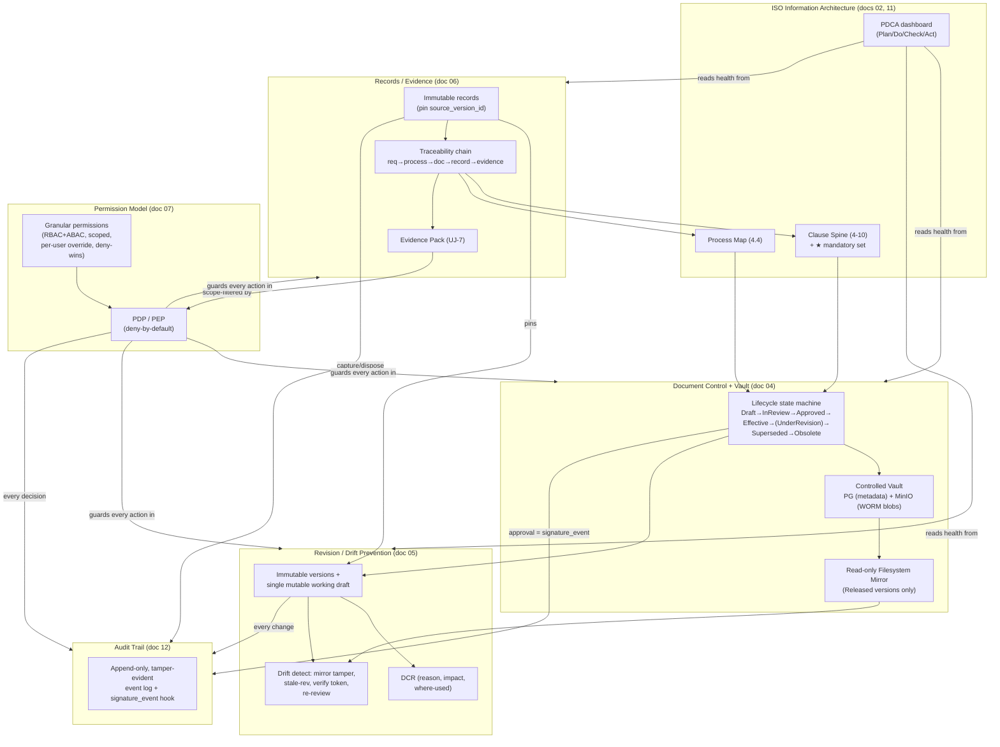

# EasySynQ — Master Specification (Overview & Front Door)

> This is the entry point to the EasySynQ specification. Read this first. It gives the one-page product, the four locked foundational decisions, the full table of contents, a cross-cutting concepts map that shows how the major subsystems interlock, a feature-to-persona responsibility matrix, and a short guide to reading the rest of the spec. Every term used here is defined authoritatively in the **Canonical Glossary** (doc 01 §8) and the **Domain Model** (doc 02).

---

## 1. Executive Summary

EasySynQ is a **self-hosted, browser-based application that keeps an organization's Quality Management System (QMS) correct, current, and audit-ready.** It replaces the usual reality — QMS documents scattered across file shares, email attachments, and personal folders, with no reliable answer to "which version governs?" — by moving the authoritative copy of every document and record *inside a controlled vault* (PostgreSQL + object storage) and reducing the on-disk filesystem to a **read-only, organized mirror**. Because the master can no longer be silently overwritten on a writable disk, **document drift, version chaos, lost evidence, and painful audit prep stop being human-discipline problems and become solved engineering problems.**

The product is shaped the way **ISO 9001:2015** actually flows: clause-aligned, process-oriented, and organized around the **Plan-Do-Check-Act (PDCA)** cycle. It presents that structure through a calm, progressively disclosed interface — a health dashboard on landing, depth one click deeper, never the whole standard at once. It enforces a controlled **Document lifecycle** — the canonical **seven-state machine** (`Draft`, `InReview`, `Approved`, `Effective`, `UnderRevision`, `Superseded`, `Obsolete`; the five-state `Draft → In Review → Approved → Effective → Obsolete` form is only a simplified user-facing summary) — with check-in/check-out, immutable versions, and recorded approvals; it captures and retains **Records / documented evidence** linked to the process and clause they prove; it maintains an **append-only, tamper-evident audit trail** of every consequential action; and it generates clause-mapped **Evidence Packs** on demand, turning audit preparation from a multi-week scramble into a single operation.

EasySynQ is built on an ISO 9001:2015 foundation but is **architected to extend without rework** toward 21 CFR Part 11-style electronic signatures and additional standards (ISO 13485 / 14001 / 45001 / IATF 16949). Those are deliberately *not built now*; the data model, the approval `signature_event` hook, the `framework_id` discriminator, and the many-to-many clause mapping are reserved so that adding them later is additive, never a rewrite.

---

## 2. The Product in One Page

| Question | EasySynQ's answer |
|---|---|
| **What is it?** | A self-hosted web QMS built around a managed **Controlled Vault** that owns the master copy of every controlled document and record. |
| **Who is it for?** | Organizations running an ISO 9001:2015 QMS (for certification, a customer requirement, or internal discipline) that are tired of drift, version chaos, and audit fire-drills. |
| **What problem does it kill?** | The root cause of QMS pain: the authoritative file lives on a writable share anyone can touch. EasySynQ inverts authority — **the vault is the master; the disk is a read-only mirror.** |
| **How does it feel?** | Calm and clause-aligned. Navigation mirrors the ISO clause spine grouped by PDCA; the home screen is a PDCA health wheel; depth is revealed progressively. |
| **What does it enforce?** | One **Effective** version per document (DB-enforced), immutable versions, mandatory change reasons, recorded approvals, version-pinned records, retention + controlled disposition, and a full audit trail. |
| **Who can do what?** | A **hybrid RBAC + ABAC** model: granular `domain.action` permissions, bundled into convenient org-defined roles, scopable to system / process / folder / document, with per-user overrides and explicit deny (**deny always wins**). Deny-by-default, centrally enforced. A **two-tier grant boundary** applies: the QMS Owner may hold `permission.grant` scoped to CONTENT domains within QMS scope, while SYSTEM permissions stay **admin-only at SYSTEM scope**. |
| **How is it run?** | One Linux host via Docker Compose (S/M/L sizing profiles). Data never leaves the org boundary; admin-controlled backups; no telemetry without explicit opt-in. |
| **What is the tech?** | React + TypeScript + Mantine + Tailwind (SPA); Python 3.12 + FastAPI (API); PostgreSQL 16 + MinIO + OpenSearch + Redis; Celery workers; Keycloak (auth); Gotenberg/LibreOffice (rendering); Caddy (TLS). |
| **What is the headline payoff?** | Audit readiness as the **default state** rather than a recurring crisis (target: scoped evidence pack in < 30 minutes; zero uncontrolled effective versions). |
| **What is deliberately NOT built (v1)?** | Part 11 e-signatures, multi-standard packs, SaaS/multi-tenancy, in-app rich authoring, real-time co-editing, operational quality analytics, generic workflow/BPM, public access, auto-compliance judgments, native mobile (see doc 01 §4). All reserved as clean extension points. |

---

## 3. The Four Locked Foundational Decisions

These are inviolable. No section of this specification may contradict them.

| # | Decision | What it means concretely | Where elaborated |
|---|---|---|---|
| **D1 — Deployment** | **Self-hosted web application.** | Installed on the org's own server/network; users reach it via browser. **Data never leaves the org infrastructure.** No phone-home, no SaaS, single-organization per install. Admin-controlled backups. | doc 03 (architecture, sizing, install, backup); doc 08 (first-run) |
| **D2 — Document source of truth** | **A managed Controlled Vault.** | Documents are *ingested* into EasySynQ's own controlled store (relational DB + object storage). The on-disk filesystem is a **read-only, organized export/mirror** regenerated from Released versions only. Authority flows **vault → mirror, never the reverse.** Enables drift prevention, immutable versions, check-in/check-out. | docs 04, 05, 06 (vault, drift, records) |
| **D3 — Compliance target** | **ISO 9001:2015 foundation, extensibly designed.** | Clause-aligned structure, document control, immutable revision history, approval workflows, full audit trail — built now. **Architected (not built) to extend cleanly** to 21 CFR Part 11 e-signatures and multi-standard frameworks. Do not paint into a corner. | docs 02, 04, 12; "Future" in doc 16 |
| **D4 — Tech stack** | **A modern, recommended self-hostable stack.** | React/TS + Mantine + Tailwind; FastAPI/Python; PostgreSQL + MinIO + OpenSearch + Redis; Celery; Keycloak; Gotenberg; Caddy; Docker Compose. OpenAPI-first, 12-factor, deny-by-default. | doc 03 (full rationale vs. alternatives) |

**Permission philosophy (cross-cutting, locked):** permissions are **granted granularly, not strictly bound to roles.** Roles are convenient, org-defined *bundles* of permissions. The system is hybrid **RBAC + ABAC**, scopable to document/folder/process, with **per-user overrides** (doc 07).

---

## 4. Table of Contents

The specification is **19 numbered documents (00–18)** plus the **Decisions Register**: this overview (00), fifteen substantive sections (01-15), the roadmap (16), the gap audit (17), and the build plan (18), all governed by the `decisions-register.md`. The order below is the recommended reading order; the "Reads after" column gives the hard prerequisites.

> **Reconciliation note.** The `decisions-register.md` is the **single authoritative source of truth and reconciliation source** for this specification: it records the locked foundational decisions, the locked stakeholder decisions, and the normative resolutions (R1–R40) to every gap-audit finding. **Where it conflicts with any text in sections 01–15, the register supersedes that text**, and the drift items in §8 below are now back-propagated and superseded by it (by R-number) rather than merely flagged. The numbered files run **00–18**: the fifteen substantive sections (01–15), the roadmap (16), the **gap audit** (17 — `17-gaps-and-open-questions.md`, the *input* the register resolves, not a normative section), and the **build plan** (18 — `18-mvp-implementation-plan.md`, the slice plan + §1 canon corrections). The TOC below is authoritative for what exists. A future appendix/standards-pack section is anticipated by the multi-standard roadmap (doc 16, Future) but is not yet written.

| # | File | One-line description | Reads after |
|---|---|---|---|
| **★** | `decisions-register.md` | **Authoritative reconciliation source & single source of truth** — locked foundational decisions, locked stakeholder decisions, and the normative resolutions R1–R40 to every gap-audit finding. **Supersedes any conflicting text in 01–15**; canonical tokens/enums/states/field-names are verbatim. | 00 (consult continuously) |
| **00** | `00-overview.md` | **This document** — master front door: summary, locked decisions, TOC, cross-cutting map, responsibility matrix, reading guide. | — |
| **01** | `01-vision-and-scope.md` | Problem statement, product vision & goals, explicit non-goals, success metrics (M1-M11), the eight canonical personas, the seven primary user journeys (UJ-1…UJ-7), and the **canonical glossary**. | 00 |
| **02** | `02-iso-9001-domain-model.md` | ISO 9001:2015 domain model & information architecture: clause-by-clause walkthrough (4-10), maintained-Document vs retained-Record distinction, PDCA mapping, the three lenses (clause spine / process map / PDCA dashboard), navigation, artifact taxonomy. | 01 |
| **03** | `03-architecture-and-stack.md` | System architecture & technology stack: C4 context/container diagrams, the chosen stack with rationale vs. alternatives, security posture, sizing (S/M/L), backup/restore, observability, packaging, and the binding non-functional requirements. | 01, 02 |
| **04** | `04-document-control-and-vault.md` | The controlled-vault engine for Clause 7.5: Document lifecycle state machine, immutable versions vs. the single mutable working draft, check-in/check-out + locking, metadata & numbering schemes, controlled/uncontrolled copies + watermarking, distribution + read-and-understood acknowledgement, periodic review & obsolescence, the read-only filesystem mirror. | 02, 03 |
| **05** | `05-revision-and-drift.md` | Revision/change management & drift prevention+detection: version model (major/minor, effectivity windows, scheduled future revisions), the **Document Change Request (DCR)**, redline/diff, where-used/impact analysis, mirror tamper/staleness detection, scheduled re-review, revision-history presentation. | 04 |
| **06** | `06-records-and-evidence.md` | Records & evidence management (the retained half of 7.5): record types catalog, three capture modes, immutability + `correction_of`, version pinning, retention schedules + controlled disposition, the requirement→process→document→record→evidence traceability chain, **Evidence Packs** (UJ-7). | 02, 04 |
| **07** | `07-authorization-model.md` | Hybrid RBAC + ABAC authorization: permission catalog, roles as bundles, scoping system & scope tree, attribute/condition model, precedence & conflict resolution (deny-wins), break-glass, separation of duties, delegation, external-auditor/admin boundaries, PDP/PEP enforcement. | 03 |
| **08** | `08-setup-and-onboarding.md` | Admin first-run experience: the ten-step setup wizard, system/identity/storage/backup/SMTP configuration, framework seeding, user/role provisioning, the import hand-off, and the **setup→ownership handoff** (Avery → Mara). | 03, 07, 09 |
| **09** | `09-ingestion-engine.md` | The import/ingestion engine (UJ-2): scanning & previewing an existing QMS, proposed source→controlled-document mapping with process/clause hints, baseline version creation, legacy-identifier preservation, bulk record import, and mirror generation from imported masters. | 04, 06, 08 |
| **10** | `10-workflows-and-notifications.md` | Workflow & notification engine: approval/review routing, CAPA and audit-finding flows, periodic-review and retention/disposition tasks, acknowledgement prompts, **My Tasks**, escalations, and SMTP + in-app notification delivery. | 04, 05, 06, 07 |
| **11** | `11-ui-ux-design-system.md` | UI/UX design system: calm/progressive-disclosure principles, design tokens & theming (Mantine + Tailwind, dark/light), the PDCA dashboard wheel, the three-lens navigation, the shared artifact header, the Document-vs-Record visual asymmetry, and WCAG 2.2 AA accessibility. | 02 |
| **12** | `12-security-and-audit.md` | Security & the audit trail: the append-only, tamper-evident audit event model (schema, partitioning, integrity/hash-chaining), authentication hardening, encryption in transit/at rest, blob integrity verification, security headers, and Part 11-evidence pre-positioning. | 03, 07 |
| **13** | `13-search-and-reporting.md` | Search & reporting: OpenSearch full-text + faceted + metadata search (with Postgres-FTS fallback), clause/process/state filters, the ★ mandatory-coverage **Compliance Checklist**, dashboards, currency/overdue reports, and audit-log search. | 02, 06, 12 |
| **14** | `14-data-model.md` | The relational data model / ERD: documents, versions, working drafts, blobs, records, retention policies, DCRs, audits/findings/CAPA, the clause catalog, process map, clause/process mappings, authorization entities, and the append-only audit & signature-event tables. | 02, 04, 06, 07 |
| **15** | `15-api-design.md` | API design: the OpenAPI-first REST contract — resources and endpoints for documents/versions/records/audits/CAPA/evidence-packs/users/roles/permissions/setup, presigned upload/download, PEP authorization, pagination, the error model, and the authenticated ingest API. | 03, 07, 14 |
| **16** | `16-roadmap.md` | Phased delivery roadmap: the MVP definition, v1, v1.x, and Future (Part 11 e-signatures, multi-standard frameworks, AI-assisted classification), with rationale, sequencing, dependencies, risks & mitigations, and major assumptions. | all |
| **17** | `17-gaps-and-open-questions.md` | The **gap audit** (input, not a normative section): findings A1–A14 (gaps), B1–B15 (contradictions), C1–C12 (risks), D1–D14 (open questions). Every finding is **resolved** by the Decisions Register (Part 4 finding→R-number map) — read the register for the binding answer. | 00, all |
| **18** | `18-mvp-implementation-plan.md` | The **build plan**: the §1 canon-correction set, the ordered MVP slice plan (S0–S11) + the v1 family slices, exit criteria, and CI/verification gates. Read when planning a slice. | 03, 14, 15, 16 |

---

## 5. Cross-Cutting Concepts Map

Five subsystems do most of the work in EasySynQ, and their power comes from how they **interlock**. The diagram shows the dependencies; the narrative below explains each relationship.

**How the five interrelate (the load-bearing relationships):**

1. **ISO information architecture is the organizing skeleton; everything else hangs off it.** Every controlled artifact (document or record) carries a many-to-many `clause_map[]` and `process_links[]` plus a `pdca_phase`. Those links are what let the *same* artifact appear in the clause spine, the process map, and the PDCA dashboard without duplication — "three lenses, one QMS" (doc 02 §5). The IA is not a folder tree bolted on top; it is metadata on the data model, which is why re-skinning for another standard (doc 16, Future) is a data change, not an IA rebuild.

2. **Document control prevents drift by inverting authority, and revision management is the discipline on top of it.** The Controlled Vault (PostgreSQL + MinIO) holds the master; the filesystem mirror is regenerated read-only from **Released versions only**, so the disk can never silently become a competing truth (D2). Revision management (doc 05) adds the version model — immutable snapshots, exactly one **Effective** version (DB-enforced partial-unique index), check-out/check-in under a Redis lock with a mandatory change reason, and the DCR that records *why* a change happened. Together these structurally close the three classic drift vectors (the wall poster, the intranet PDF, the laptop Word file). What can still drift *outside* the boundary — a tampered mirror file, a stale printout — is **detected** (mirror re-hash + auto-correct, controlled-rendition verify token, scheduled re-review).

3. **Records pin the exact document version they were produced under, which makes the audit trail historically true forever.** A Record (doc 06) is immutable from capture, follows retention → controlled disposition (never silent delete), and stores `source_version_id` — the precise Effective version in force when it was captured. Superseding the document to a new version therefore never relabels or orphans past evidence. This pin is the hinge of the **traceability chain** (requirement → process → document → record → evidence) that powers Evidence Packs and answers an auditor's two questions: *do we have evidence?* (top-down coverage) and *what does this prove, under what rules?* (bottom-up provenance).

4. **The permission model is the gate in front of all of the above, and it is the same gate everywhere.** Every state transition, check-in, approval, record capture, disposition, and evidence-pack generation is authorized server-side by the PDP/PEP (doc 07) before any state change — deny-by-default, hybrid RBAC + ABAC, scoped, with explicit deny winning (precedence per the canonical algorithm: **deny always wins**, and scope specificity only breaks ALLOW-vs-ALLOW ties). Crucially, the model encodes **separation of duties** (author ≠ sole approver), **auditor independence** (Ingrid holds broad read but no document/record mutation), and a **two-tier permission-grant boundary**: the Quality-Manager / QMS-Owner **MAY hold `permission.grant` scoped to CONTENT permission domains within QMS scope** (`document.*`, `record.*`, `audit.*`, `capa.*`, `changeRequest.*`, `evidencepack.*`), while **SYSTEM permissions** (`user.*`, `role.*`, `storage.*`, `backup.*`, `restore.*`, `config.*`, `import.*`) **remain admin-only at SYSTEM scope** (Avery's `system.*` does not grant `document.*`; the QMS Owner's content grants do not reach system permissions). Evidence Packs are filtered through the *same* engine, so an over-broad scope silently excludes what the requester may not see rather than leaking it.

5. **The audit trail is the universal sink — it is what makes every other guarantee provable.** Every consequential action writes an append-only, tamper-evident, attributed event (doc 12): lifecycle transitions, check-out/in, approvals (which also fire a `signature_event` — the Part 11 hook), record captures and dispositions, permission-grant changes, exports/prints, drift anomalies, and authorization decisions (allow *and* deny). The trail is distinct from operational logs, never updatable, partitioned, and retained per policy. It is simultaneously the backbone of ISO 9001 traceability and the pre-positioned evidence layer for a future 21 CFR Part 11 phase.

**The thread that ties it together:** the IA gives every artifact its place and meaning; document control + revision management guarantee currency and immutability; records + the traceability chain guarantee provable evidence; the permission model guarantees the right people do the right things; and the audit trail guarantees all of it is recorded and tamper-evident. Remove any one and "audit readiness as the default state" collapses.

---

## 6. Feature-to-Persona Responsibility Matrix

Personas are the **canonical eight** (doc 01 §6). Remember the locked permission philosophy: these are *typical bundles*, not hard boundaries — actual authority is the granular, scoped permission grant (doc 07).

Legend: **P** = primary actor / owns the feature · **S** = secondary / participates · **R** = read-only consumer · **—** = not involved by default · **(scoped)** = limited to their process/folder/evidence-pack scope.

| Feature → / Persona ↓ | Avery (Admin) | Mara (Quality Mgr) | Diego (Process Owner) | Priya (Author) | Ken (Approver) | Ingrid (Int. Auditor) | Sam (Employee) | Olsen (Ext. Auditor) |
|---|---|---|---|---|---|---|---|---|
| First-run setup & system config (08) | **P** | — | — | — | — | — | — | — |
| Identity / storage / backup (03, 08) | **P** | — | — | — | — | — | — | — |
| Users, roles, permission grants (07, 08) | **P** | S (split settings) | — | — | — | — | — | — |
| QMS import / ingestion (09) | **P** (runs) | **S** (reviews mapping/coverage) | S (own process) | — | — | — | — | — |
| Clause framework & ★ coverage (02, 13) | — | **P** | S (scoped) | — | — | R | — | R (in pack) |
| Process map & process ownership (02) | — | **P** (assigns) | **P** (owns process) | S | — | R | R | R (scoped) |
| Authoring documents (04, 05) | — | S | **P** (commissions) | **P** | — | — | — | — |
| Check-out / check-in / DCR (04, 05) | — | S | S | **P** | — | — | — | — |
| Review / approval (04, 05, 10) | — | **P** (release) | S | — | **P** | — | — | — |
| Release & obsolescence (04) | — | **P** | S (scoped) | — | S (delegated) | — | — | — |
| Distribution & read-acknowledge (04) | — | **P** (manages) | S | — | — | — | **P** (acknowledges) | — |
| Records capture (06) | — | S | **P** | **P** (scoped) | S | S (link-as-evidence) | S (forms) | — |
| Retention & disposition (06) | S (storage capacity) | **P** | S (scoped) | — | — | R | — | — |
| Internal audit & findings (02, 06, 10) | — | S (oversees) | S (auditee) | — | — | **P** | — | — |
| CAPA program (06, 10) | — | **P** (verify/close) | **P** (owner) | S | S | S (raises) | — | — |
| Evidence Pack generation (06) | — | **P** | S (scoped) | — | — | S | — | R (consumes) |
| Search / find current procedure (13) | R | R | R | R | R | R | **P** | R (scoped) |
| Audit trail / system health (03, 12) | **P** (system) | R (QMS) | R (scoped) | — | — | R | — | — |
| External-audit guest access (07, 06) | S (provisions account) | **P** (defines scope) | — | — | — | — | — | **P** (consumes, read-only, time-boxed) |

> **Boundary reminders the matrix encodes (two-tier permission-grant model):** Avery (system power) cannot author or approve content without an explicit, separate, audited QMS grant; conversely the QMS Owner's `permission.grant` is **content-scoped within QMS scope** (`document.*`, `record.*`, `audit.*`, `capa.*`, `changeRequest.*`, `evidencepack.*`) and **cannot reach SYSTEM permissions** (`user.*`, `role.*`, `storage.*`, `backup.*`, `restore.*`, `config.*`, `import.*`), which stay **admin-only at SYSTEM scope**. Ingrid (independence) has broad read but no document/record *mutation*. Olsen (external) is read-only, scope-limited, and time-boxed to an evidence pack. Sam (read-only employee) consumes current procedures and acknowledges, nothing more.

---

## 7. How to Read This Spec

1. **Start here (00), then read 01 and 02 — and keep the `decisions-register.md` open beside you.** The Decisions Register is the **authoritative reconciliation source / single source of truth**: read it before relying on any detail in 01–15, because its resolutions R1–R40 supersede conflicting section text and define the one canonical spelling per concept. Doc 01 gives you the vision, the eight personas, the seven user journeys, and the **canonical glossary** — every later section uses those terms verbatim. Doc 02 gives you the domain model and the maintained-Document vs. retained-Record distinction, which is the single most important behavioral rule in the system. Internalize those, consult the register continuously, and the rest reads quickly.

2. **Then choose your path by role:**
   - *Backend / platform engineers:* 03 (architecture) → 14 (data model) → 04, 05, 06 (the vault + revision + records engines) → 07 (authz) → 15 (API) → 12 (security/audit).
   - *Frontend engineers / designers:* 02 (IA) → 11 (design system) → 13 (search/reporting) → 04/06 (what the screens manipulate).
   - *Quality / compliance reviewers:* 02 (clause mapping) → 04, 05, 06 (control, drift, evidence) → 12 (audit trail) → 13 (compliance checklist).
   - *Ops / IT installers:* 03 (sizing, packaging, backup) → 08 (first-run) → 09 (import).
   - *Product / planning:* 01 (scope/metrics) → 16 (roadmap) → `decisions-register.md` (locked decisions & resolutions).
   - *Any reader resolving an apparent conflict:* go straight to the `decisions-register.md` (R1–R40 + the Part-4 finding→resolution map) — it is the authoritative reconciliation source.

3. **Conventions used throughout:** mermaid diagrams for state machines, sequences, and ERDs; decision tables with brief rationale; explicit **assumptions** (labeled `A1`, `R-A1`, etc.) and **invariants** (labeled `INV-1`, …); permission keys in `domain.action` form; the lifecycle and personas always by their canonical names.

4. **Authority precedence when sections appear to differ.** The **`decisions-register.md` is the top-level authority and reconciliation source**: where it conflicts with any text in sections 01–15, **the register supersedes that text**, and its canonical tokens, enum values, state names, and field names are verbatim. Below the register, if two sections describe the same mechanism at different depth, the **more specific section governs**: the glossary (01 §8) and domain model (02) are canonical for *terms and the artifact taxonomy*; doc 04 is canonical for the *Document lifecycle*; doc 07 is canonical for the *permission catalog and evaluation*; doc 12 is canonical for the *audit trail*; doc 14 is canonical for the *data model*. The known surface-level inconsistencies are listed below — and are now **back-propagated and superseded by the Decisions Register (R-numbers)**, not merely flagged.

5. **Treat the "extensibility hooks" boxes as promises, not features.** Every engine section ends with reserved-but-unbuilt hooks (Part 11 `signature_event`, `framework_id`, M:N clause mapping, retention policy-as-data). They are there to keep D3 honest — do not implement them in the named phase; do not remove them.

---

## 8. Inconsistencies Reconciled (lead-architect notes)

While synthesizing the sections, I found the following terminology/numbering drift. None are contradictions of the four locked decisions. **Status update (reconciliation pass):** these items are no longer merely *flagged* here — they are now **back-propagated into the affected sections and superseded by the `decisions-register.md`** via the cited R-numbers. The register holds the canonical, verbatim tokens; the rows below are retained as a change-log of what was reconciled and a pointer to the governing resolution. **Where this table and the Decisions Register differ in any detail, the register supersedes.**

| # | Where | The drift | Resolution — now back-propagated & superseded by the Decisions Register |
|---|---|---|---|
| C1 | Lifecycle states: doc 01 §8 & doc 05 (short form) vs. doc 03 §6.2 & doc 04 §3.1 (extended form) | The "headline" lifecycle is 5 states (`Draft → In Review → Approved → Released/Effective → Obsolete`); doc 04 §3.1 extends it with two operationally-necessary intermediate states (`Under Revision`, `Superseded`). | **Superseded by R1.** The canonical lifecycle is the **7-state machine** with engine/data-model state tokens (verbatim) `Draft`, `InReview`, `Approved`, `Effective`, `UnderRevision`, `Superseded`, `Obsolete`. The 5-state form (`Draft → In Review → Approved → Effective → Obsolete`) is **only a simplified user-facing summary**; the engine, data model, and all state diagrams use the 7-state machine. Doc 04 §3.1 is the canonical definition; back-propagated to 01, 03, 04, 05, 11, 14. |
| C2 | Success-metric numbering in doc 05 §11.3 | Doc 05 labels "zero uncontrolled effective versions" as **M9** and "100% audit-trail completeness" as **M11**. In the canonical metric table (doc 01 §5), **M2** = drift/zero uncontrolled effective versions, **M9** = adoption ≥95%, **M7** = audit-trail completeness, **M11** = task-level usability. | **Superseded by R36.** Doc 01 §5 numbering is canonical; doc 05 §11.3 cross-references back-propagated: zero-uncontrolled-effective-versions → **M2**, audit-trail-completeness → **M7**. |
| C3 | Permission-key spellings across docs 04 §12, 05 §11.2, 07 §3, 10 | Same capabilities are spelled differently. Doc 07's catalog uses `document.read`/`read_draft`/`read_obsolete`, `document.edit`, `document.submit`, `document.review`, `document.approve`, `document.release`, `document.obsolete`, `document.export`. Doc 04 §12 uses `document.view`/`view_drafts`/`checkin`/`submit_for_review`/`make_obsolete`. Doc 05 §11.2 uses `document.read_effective`/`read_draft`/`submit_review`/`retire`/`export_controlled`/`break_lock`. Doc 10 references `dcr.raise`, `capa.raise`. | **Superseded by R5** (with R2 for `signature_event.meaning`). Doc 07 §3 is the canonical permission catalog; all variants normalize verbatim (e.g. `document.view`→`document.read`, `document.submit_for_review`→`document.submit`, `document.make_obsolete`→`document.obsolete`, `document.export_controlled`→`document.export`; `record.dispose` **not** `record.retire`; `dcr.raise`→`changeRequest.create`; `capa.raise`→`capa.create`; `audit_qms.*`→`audit.*`). Back-propagated to 04, 05, 07, 08, 09, 10, 14, 15. |
| C4 | Beat sweep cadence: doc 04 (daily review-sweep) vs doc 05 §2.5 (5-minute cutover sweep) | These read like one schedule with two values. | **Not a conflict — two distinct Beat jobs** (no R-number needed). The *effectivity-cutover* sweep runs frequently (≈5 min, doc 05) so scheduled go-lives are timely; the *periodic-review-due* sweep runs daily (doc 04). Documented here to prevent future readers from "fixing" one to match the other. |
| C5 | ★ mandatory set: clause-8 walkthrough table (doc 02 §2) omits 8.5.6 row, but §2.1 consolidated list includes "Production/service change control (8.5.6)". | Minor coverage gap in the per-clause table. | **Superseded by R30.** The §2.1 consolidated ★ list is authoritative for the Compliance Checklist seed; the missing **8.5.6 (production/service change control)** row is back-propagated into the clause-8 walkthrough table (docs 02, 13). |
| C6 | TOC count "01..17" in the brief vs. files that exist. | Clarify which numbered files exist. | **The numbered files run 00–18.** 17 = `17-gaps-and-open-questions.md` (the gap-audit *input* the register resolves, not a normative section); 18 = `18-mvp-implementation-plan.md` (the build plan). A future standards-pack/appendix section is anticipated by doc 16 (Future) but unwritten. |
| C7 | Import permission keys: docs 07 §2.1/§3.9 & 08 (`import.administer`, `import.initiate`, `guest.administer`) vs. doc 09 §15 (`import.execute`, `import.review`, `import.commit`). | The setup/authz sections name import as one admin capability; the ingestion engine splits it into three (run / review-classify / commit) so QMS-content review can stay with Mara (SoD). | **Superseded by R5.** The three-way split `import.execute` / `import.review` / `import.commit` is canonical and **replaces** `import.initiate` and `import.administer` everywhere; all three are added to the doc 07 catalog and the doc 14 seed. Back-propagated to 07, 08, 09, 14. |

---

*End of overview. Continue to [01-vision-and-scope.md](01-vision-and-scope.md), or jump to the [16-roadmap.md](16-roadmap.md) for delivery phasing.*
