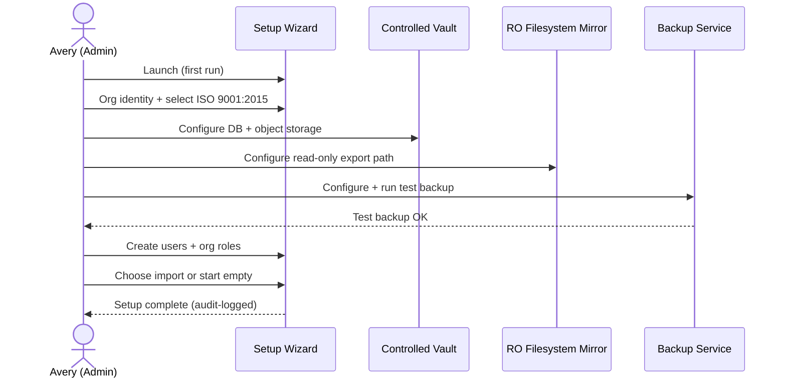
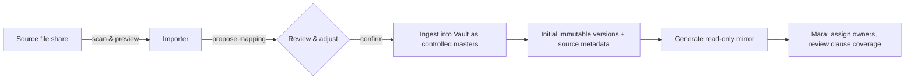
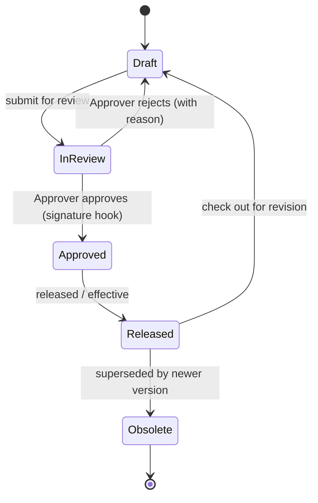
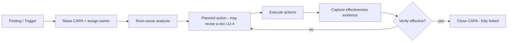
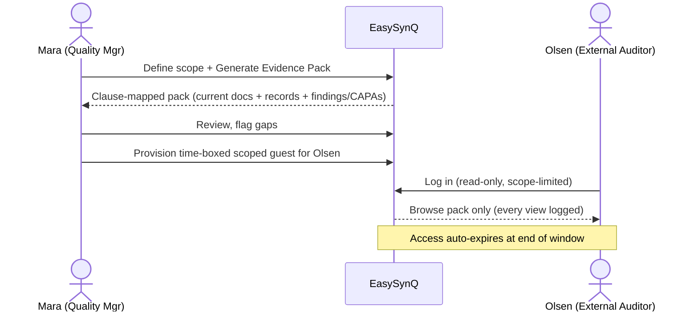

# EasySynQ — Vision & Scope

EasySynQ is a self-hosted, browser-based application that helps an organization keep its **Quality Management System (QMS)** correct, current, and audit-ready. It replaces the all-too-common reality of QMS documents scattered across shared drives, email attachments, and personal folders with a single **controlled vault** that owns the authoritative version of every document and record. EasySynQ prevents *document drift*, makes revision history immutable and reviewable, keeps documented evidence linked to the process it proves, and turns audit preparation from a multi-week scramble into a one-click evidence pack. The product is structured the way **ISO 9001:2015** actually flows — clause-aligned, process-oriented, and organized around the **Plan-Do-Check-Act (PDCA)** cycle — and it presents that structure through a calm, progressively disclosed interface that never dumps the whole standard on a user at once. This document defines the problem, the vision, the goals and explicit non-goals, success metrics, the canonical personas, the primary user journeys, and the canonical glossary that all subsequent specification sections inherit.

---

## 1. Problem Statement

Organizations that run a QMS — whether for ISO 9001 certification, a customer requirement, or internal discipline — almost universally manage it with general-purpose tools (network file shares, SharePoint folders, spreadsheets, email). These tools were never designed to enforce a *controlled* document lifecycle. The result is a recurring, costly set of failures:

| # | Problem | What it looks like in practice | Cost / Risk |
|---|---------|-------------------------------|-------------|
| P1 | **Document drift** | The "official" procedure on the wall, the PDF on the intranet, and the editable Word file on a manager's laptop have all diverged. Nobody is sure which is governing. | People follow obsolete instructions; nonconformities; failed audits. |
| P2 | **Version chaos** | Files named `SOP-Welding_v3_FINAL_revB_USE_THIS.docx`. No reliable history of *what* changed, *when*, *why*, or *who approved it*. | No defensible revision history; can't prove change control (a core ISO 9001 §7.5 requirement). |
| P3 | **Lost / scattered evidence** | Records that *prove* the QMS is operating (training records, calibration certs, audit reports, management-review minutes) live in inboxes, desk drawers, and ad-hoc folders. | Records can't be produced on demand; retention rules unenforced; evidence is missing exactly when an auditor asks. |
| P4 | **Painful audit prep** | Weeks of manual hunting before every audit to assemble "the binder" — collecting current procedures, matching them to clauses, gathering proof each process ran. | Huge recurring labor cost; stress; gaps discovered too late to fix. |
| P5 | **Rigid, role-only access** | Permissions are coarse ("editor" / "viewer") and bound to a fixed role. Real organizations need *this auditor sees only the Production process*, *this contractor edits one folder*, *this approver signs only Level-2 procedures*. | Either over-sharing (security/integrity risk) or constant admin friction and shadow workarounds. |
| P6 | **Broken traceability** | A finding, a corrective action, the document it changed, and the evidence of effectiveness are recorded in four disconnected places. | Can't demonstrate the closed-loop improvement that ISO 9001 §10 demands. |
| P7 | **No tamper-evident trail** | "Who changed this and when?" has no trustworthy answer; metadata is editable. | Audit findings; in regulated extensions (21 CFR Part 11), an outright disqualifier. |

**Root cause.** The authoritative copy of a document lives on a *writable filesystem that anyone can touch directly*, outside any control layer. Every downstream problem follows from that single architectural mistake.

**EasySynQ's thesis.** Move the source of truth *inside* a controlled vault (relational DB + object storage). The filesystem becomes a **read-only, organized mirror/export**, not the master. Once the master is controlled, drift, version chaos, lost evidence, and audit pain become tractable engineering problems rather than human-discipline problems.

---

## 2. Product Vision

> **EasySynQ is the controlled home of an organization's QMS — the one place where every document is current, every version is permanent, every record is findable, and audit readiness is the default state rather than a fire drill.**

Three principles shape the product:

1. **The vault is the master; the disk is a mirror.** Documents are *ingested* into a controlled store. Editing happens only through governed check-in/check-out. The on-disk export is regenerated read-only so the filesystem can never silently diverge.
2. **The UI flows like the standard.** Navigation, workflows, and dashboards mirror the ISO 9001 clause tree and the PDCA cycle. A Quality Manager thinks in clauses and processes; EasySynQ speaks that language instead of forcing a generic "folders and files" mental model.
3. **Calm by design — progressive disclosure.** The interface reveals depth on demand. A first-time user sees a clean, guided path; an expert can drill from a PDCA dashboard down to a single immutable revision and its signature. We never present the entire standard, every permission, and every record at once.

EasySynQ is built on an **ISO 9001:2015 foundation** but is **architected to extend** — without rework — toward 21 CFR Part 11-style electronic signatures and multi-standard frameworks (ISO 13485 / 14001 / 45001 / IATF 16949). Those are *not built now*; the data model, audit trail, and signature hooks are designed so adding them later is additive, not a rewrite.

---

## 3. Goals

| Goal | Description | Tied to |
|------|-------------|---------|
| G1 — **Eliminate drift** | Make the vault the single source of truth; render the filesystem a read-only mirror; detect and block any out-of-band edit. | P1, P2 |
| G2 — **Immutable versioned history** | Every revision is permanent, comparable, and annotated with who/what/when/why. Superseded versions are retained and clearly marked obsolete. | P2, P7 |
| G3 — **Controlled lifecycle** | Enforce Draft → Review → Approved → Released → Obsolete with check-in/check-out and approval workflows. No document is "effective" without recorded approval. | P1, P2 |
| G4 — **Evidence/record management** | Capture, classify, link, and retain documented evidence (records) against the process/clause they support; enforce retention. | P3, P6 |
| G5 — **One-click audit readiness** | Generate clause-mapped, scoped evidence packs on demand for internal or external audits. | P4 |
| G6 — **Full traceability** | Link findings → corrective actions (CAPA) → document changes → effectiveness evidence in a navigable closed loop. | P6 |
| G7 — **Tamper-evident audit trail** | Record every consequential action (view of controlled docs, edits, approvals, exports, permission changes) in an append-only, attributable log. | P7 |
| G8 — **Granular hybrid access control** | Hybrid RBAC + ABAC: org-defined role bundles, fine-grained permissions scopable to document/folder/process, plus per-user overrides. | P5 |
| G9 — **Self-hosted data sovereignty** | Run entirely on the org's infrastructure; data never leaves it; admin-controlled backups. | (deployment constraint) |
| G10 — **Calm, clause-aligned UX** | Deliver the PDCA-oriented, progressively disclosed interface described in the vision. | (vision) |
| G11 — **Future-proof for regulated/multi-standard use** | Design the model and workflows so Part 11 e-signatures and additional standards plug in additively. | (vision) |

---

## 4. Non-Goals (Explicitly Out of Scope for v1)

Stating these prevents scope creep and protects the calm-UX promise. *Not now* does **not** mean *never* — items marked **(extension-ready)** must not be architecturally precluded.

| # | Non-Goal | Rationale |
|---|----------|-----------|
| N1 | **21 CFR Part 11 compliant electronic signatures** (biometric/credentialed signing manifestations, signature meaning binding, regulated training records). **(extension-ready)** | High regulatory burden; ISO 9001 needs only recorded approval. Build approval as a signature *hook* so Part 11 layers on later. |
| N2 | **Multi-standard packs** for ISO 13485 / 14001 / 45001 / IATF 16949. **(extension-ready)** | v1 ships ISO 9001:2015 only. Clause framework is modeled as data so other standards are added as new frameworks, not new code. |
| N3 | **SaaS / multi-tenant cloud hosting.** | Locked decision: single-org self-hosted. No tenant isolation layer, no shared cloud. |
| N4 | **In-app rich document authoring** (a Word/Google-Docs replacement). | Users author in their existing tools; EasySynQ *controls* the artifact (versions, approvals, lifecycle), it does not become a word processor. (Viewing/preview is in scope; full WYSIWYG editing is not.) |
| N5 | **Real-time multi-user co-editing.** | The control model is check-out/check-in (one editor at a time). Concurrent co-authoring conflicts with controlled versioning. |
| N6 | **Operational quality data analytics** (SPC charts, defect-rate trending, supplier scorecards). | EasySynQ governs the *system* (documents, records, improvement loop), not shop-floor measurement analytics. |
| N7 | **Project/task management or general workflow engine.** | Workflows are QMS-specific (approval, audit, CAPA). Not a generic BPM tool. |
| N8 | **Public/anonymous access or customer-facing portal.** | All access is authenticated and authorized; external auditors get scoped, time-bounded accounts. |
| N9 | **Automated regulatory interpretation / "auto-compliance" judgments.** | The tool organizes evidence and structure; it does not assert that the org *is* compliant. Humans decide. |
| N10 | **Native mobile apps.** | Responsive web only for v1. |

---

## 5. Success Metrics

Metrics are split into **leading** (adoption/behavior, measurable early) and **lagging** (outcomes, measurable over audit cycles). Targets are baseline goals for a reference deployment of ~150 controlled documents and ~50 users.

> **Metric-numbering note (confirmed per Decisions Register R36).** The metric IDs (`M1`–`M11`) in this section are **canonical and authoritative** — this section is the source of truth for metric numbering, and all other sections cross-reference these IDs as defined here. In particular, **zero-uncontrolled-effective-versions is `M2`** and **audit-trail-completeness is `M7`**. These IDs MUST NOT be renumbered.

| ID | Metric | Type | Target |
|----|--------|------|--------|
| M1 | **Audit-pack assembly time** | Lagging | From days/weeks → **< 30 minutes** to generate a scoped, clause-mapped evidence pack. |
| M2 | **Document drift incidents** (out-of-band edits detected on the mirror) | Lagging | **0** uncontrolled effective versions; any drift detected and flagged within one mirror-sync cycle. |
| M3 | **Currency of controlled docs** (% of effective docs past their review date) | Lagging | **< 5%** overdue at any time; proactive reminders before due. |
| M4 | **CAPA closure traceability** (% of CAPAs with linked root cause, action, *and* effectiveness evidence) | Lagging | **100%** of closed CAPAs fully linked. |
| M5 | **Time-to-find a record** | Leading | Locate any record by clause/process/keyword in **< 60 seconds**. |
| M6 | **Approval cycle time** (Draft submission → Released) | Leading | Reduce median by **≥ 40%** vs. prior email-based process. |
| M7 | **Audit-trail completeness** | Leading | **100%** of approvals, version changes, exports, and permission changes captured; trail tamper-evident and non-editable. |
| M8 | **First-run setup time** (Admin install → first imported QMS browsable) | Leading | **< 1 working day** for a typical existing QMS. |
| M9 | **Adoption** (% of QMS document changes flowing through EasySynQ rather than out-of-band) | Leading | **≥ 95%** within 3 months of go-live. |
| M10 | **External-audit findings related to document/record control** | Lagging | **Reduction vs. prior cycle**; goal of zero control-related nonconformities. |
| M11 | **Task-level usability** (new Read-only Employee finds the current version of a named procedure unaided) | Leading | **≥ 90%** success in usability testing; supports the "calm/progressive disclosure" promise. |

---

## 6. Target Users & Personas

EasySynQ serves two tiers: the **Admin** (a system super-user who sits *outside* the QMS) and **organization QMS users** (who live *inside* it). Persona names below are **canonical** and are reused verbatim across all other specification sections.

> **Permission philosophy (canonical):** Permissions are **granted granularly, not strictly bound to roles.** A *Role* is a convenient, org-defined **bundle** of permissions. The system supports fine-grained, assignable permissions (hybrid **RBAC + ABAC**) scopable down to the document / folder / process level, with **direct per-user overrides**. The persona "roles" below are therefore *typical bundles*, not hard boundaries.

### 6.1 Persona summary

| Persona | Canonical name | Inside/outside QMS | Typical permission bundle |
|---------|---------------|--------------------|---------------------------|
| Admin | **Avery (System Admin)** | Outside | Full system permissions; no QMS authorship by default |
| Quality Manager | **Mara (Quality Manager)** | Inside | Org-wide QMS read; configure framework/lifecycle; manage roles within QMS; own management review |
| Process Owner | **Diego (Process Owner)** | Inside | Read all; author/own documents & records scoped to their process |
| Document Author | **Priya (Author)** | Inside | Author/edit (check-out/in) within assigned folders/processes; submit for review |
| Reviewer/Approver | **Ken (Approver)** | Inside | Review and approve/reject documents within assigned scope |
| Internal Auditor | **Ingrid (Internal Auditor)** | Inside | Broad read (incl. records); create audits, log findings; cannot edit controlled docs |
| Read-only Employee | **Sam (Employee)** | Inside | Read released/effective documents within their area |
| External/3rd-party Auditor | **Olsen (External Auditor)** | Outside (guest) | Time-boxed, scoped read of a defined evidence pack only |

### 6.2 Detailed personas

#### Avery — System Admin (super-user, outside the QMS)
- **Context:** IT/system administrator. Installs and operates EasySynQ; is *not* a quality professional and does not author QMS content.
- **Goals:** Stand the system up quickly; configure storage and admin-controlled backups; create users and org-specific roles; grant granular permissions; point the install at an existing QMS to import; keep the system secure, available, and recoverable.
- **Pains:** Tools that conflate "system admin" with "quality content owner"; opaque backups; rigid role models that force them to over-grant; messy first-time imports.
- **Key tasks:** First-run setup wizard; storage/backup config; user & role creation; granular permission grants and per-user overrides; initiate QMS import; monitor audit trail and system health.
- **Boundary note:** Holds full *system* permissions but, by deliberate separation of duties, does **not** approve or author QMS documents unless explicitly granted those QMS permissions.

#### Mara — Quality Manager (inside, QMS owner)
- **Context:** Owns the QMS end-to-end; the certification's primary point of contact.
- **Goals:** Keep the whole QMS current and audit-ready; see PDCA health at a glance; ensure every clause has owning documents and evidence; run management review; drive corrective action.
- **Pains:** Drift she can't see; overdue reviews she discovers too late; assembling audit packs by hand; not knowing which processes lack evidence.
- **Key tasks:** Configure clause framework & document lifecycle (within QMS); assign process owners; monitor the **PDCA dashboard**; trigger/oversee audits; own CAPA program; prepare external-audit evidence packs.

#### Diego — Process Owner (inside)
- **Context:** Owns a specific process (e.g., Production, Purchasing) and its documents/records.
- **Goals:** Keep his process's procedures current and his evidence complete; know when his documents are due for review; respond to findings against his process.
- **Pains:** Being blamed for obsolete documents he didn't know had lapsed; scattered records for his process; unclear ownership.
- **Key tasks:** Author/commission procedures for his process; review/approve within scope; ensure records are captured and linked; act as CAPA owner for findings in his process.

#### Priya — Author (inside)
- **Context:** Subject-matter expert who drafts and revises procedures and work instructions.
- **Goals:** Draft/revise documents without version confusion; clearly see check-out status; submit cleanly for review with a change summary.
- **Pains:** "Which file is the latest?"; overwriting someone else's edits; rework because the wrong version was edited.
- **Key tasks:** Check out a document, edit in her native tool, check in with a mandatory change reason; create new documents from controlled templates; respond to reviewer comments.

#### Ken — Approver (inside)
- **Context:** Manager or authority who reviews and authorizes documents before release.
- **Goals:** Review efficiently with full context (diff vs. prior version, change reason); approve or reject with a recorded decision and comment.
- **Pains:** Approving blind (no visibility into what changed); approvals lost in email; no record of *why* he approved.
- **Key tasks:** Review queued documents; view revision diff; approve/reject with recorded reason (the **approval = signature hook** for future Part 11); delegate during absence (if granted).

#### Ingrid — Internal Auditor (inside)
- **Context:** Trained internal auditor (often part-time, from another function for independence).
- **Goals:** Plan and conduct internal audits against clauses/processes; access objective evidence; record findings consistently; track them to closure.
- **Pains:** Hunting for evidence; inconsistent finding records; findings that vanish after the audit.
- **Key tasks:** Create an audit (scope = clauses/processes); pull evidence; log findings (NC / OFI / observation) with severity; link findings to CAPA; verify effectiveness. **Cannot edit controlled documents** (independence).

#### Sam — Read-only Employee (inside)
- **Context:** Operator/staff who must follow current procedures relevant to their job.
- **Goals:** Quickly find the *current, effective* version of the procedure they need; trust it's the right one.
- **Pains:** Following outdated instructions; not knowing where the official copy lives; intimidating, dense systems.
- **Key tasks:** Search/browse to a released document scoped to their area; view/print the **controlled current version** (watermarked as controlled); acknowledge read (if required).

#### Olsen — External Auditor (outside, scoped guest)
- **Context:** Third-party certification-body or customer auditor. Trusted but external; access must be tightly bounded.
- **Goals:** Verify the QMS efficiently against the standard; see current documents and objective evidence within the audit scope.
- **Pains:** Disorganized evidence; being shown the wrong/obsolete version; access that's all-or-nothing.
- **Key tasks:** Log into a **time-boxed, read-only, scope-limited** account; browse the prepared **evidence pack** mapped to clauses; view current documents and linked records — and *nothing outside the granted scope*. Every view is logged.

---

## 7. Primary User Journeys / Use Cases

Each journey lists the actor(s), preconditions, and the happy path. Diagrams use mermaid.

### UJ-1 — First-run setup (Avery)
**Pre:** Software installed on org server; Avery has the install URL and a bootstrap admin credential.

1. Avery opens EasySynQ; the **First-Run Setup Wizard** launches (only available until completed).
2. Sets organization identity; selects the **ISO 9001:2015** framework (the only one in v1).
3. Configures the **controlled vault** storage (DB connection + object-storage target) and the **read-only filesystem mirror** location.
4. Configures **admin-controlled backups** (target + schedule) and verifies a test backup.
5. Creates the first QMS user accounts and **org-specific roles** (permission bundles).
6. Chooses to **import an existing QMS** (→ UJ-2) or start empty.
7. Wizard completes; system enters normal operation; setup actions are written to the audit trail.

### UJ-2 — Import an existing QMS (Avery, then Mara)
**Pre:** Setup complete; a source location (existing folder tree / file share) is reachable.

1. Avery points the importer at the source location; EasySynQ scans and previews the structure.
2. The importer proposes a mapping: source files → controlled documents; detected folder structure → process/clause hints.
3. Avery (and/or **Mara**) reviews and adjusts mappings, sets initial document **types/levels** and **owners**.
4. On confirm, EasySynQ **ingests** files into the vault as the controlled master, captures each as an initial immutable version, and records source metadata.
5. EasySynQ generates the **read-only mirror** from the vault; the original source can be archived.
6. Mara reviews coverage on the PDCA/clause map, assigns Process Owners, and flags gaps. Import is fully audit-logged.

### UJ-3 — Author a new procedure (Priya, Diego)
**Pre:** Priya has author permission scoped to the relevant process/folder.

1. Priya selects **New Document** from a controlled **template**; sets type/level, owning process, and target clause(s).
2. The document is created in **Draft**; Priya edits the content in her native tool (controlled artifact upload/check-in).
3. Priya checks in with a **mandatory change summary**; submits **for review**.
4. Workflow routes to the assigned **Approver(s)** (→ UJ-4 from the Review step).

### UJ-4 — Revise & approve a document (Priya → Ken; Diego/Mara oversight)
**Pre:** A released document needs change; Priya has check-out rights; Ken has approve rights in scope.

1. Priya **checks out** the released document (locks it for editing; status visible to all).
2. Priya edits and **checks in** a new Draft revision with a change reason; submits for review.
3. **Ken** receives a review task in **My Tasks**, sees a **diff vs. the prior released version** + change reason, and **approves or rejects** with a recorded decision (the approval = the v1 **signature hook**).
4. On approval, the new version transitions **Approved → Released/Effective**; the prior version becomes **Obsolete** (retained, marked superseded).
5. The read-only mirror regenerates; affected employees (e.g., **Sam**) are notified / asked to re-acknowledge if required. All steps are audit-logged.

> **Lifecycle note (reconciled per Decisions Register R1).** The state diagram above shows the **simplified five-state user-facing view** (Draft → In Review → Approved → Effective → Obsolete). The **canonical engine/data-model lifecycle is the seven-state machine** — `Draft`, `InReview`, `Approved`, `Effective`, `UnderRevision`, `Superseded`, `Obsolete` — defined in **doc 04 section 3.1**, which is authoritative for the engine, data model, and all state diagrams.

### UJ-5 — Conduct an internal audit & log findings (Ingrid)
**Pre:** Ingrid has internal-auditor permissions; an audit program exists.

1. **Ingrid** creates an **Audit**, defining scope (selected **clauses** and/or **processes**) and schedule.
2. For each scope item, EasySynQ surfaces the governing documents and linked records as candidate **objective evidence**.
3. Ingrid examines evidence and logs **Findings**, each typed (**Nonconformity / Observation / Opportunity for Improvement**) with severity, the clause/process it relates to, and references to the evidence reviewed.
4. Nonconformities are **linked to CAPAs** (→ UJ-6).
5. Ingrid closes the audit with a summary report; the audit and findings are permanent and audit-logged. (Ingrid cannot edit controlled documents — independence preserved.)

### UJ-6 — Raise & close a CAPA (Diego/Mara owns; sourced from a Finding)
**Pre:** A nonconformity or improvement need exists (from an audit, complaint, or internal trigger).

1. A **CAPA** is raised (often auto-linked from an audit **Finding**) and assigned an **owner** (e.g., **Diego**).
2. Owner records **root-cause analysis**, then the **planned action(s)** (which may include revising a document → UJ-4).
3. Actions are executed; **effectiveness evidence** is captured and linked.
4. **Mara** (or designated authority) verifies effectiveness and **closes** the CAPA. A closed CAPA must have root cause **and** action **and** effectiveness evidence linked (enforces metric M4).

### UJ-7 — Prepare an external-audit evidence pack (Mara → Olsen)
**Pre:** An external audit is scheduled; Mara has pack-generation rights.

1. **Mara** defines the **audit scope** (clauses/processes/date range) and triggers **Generate Evidence Pack**.
2. EasySynQ assembles, for each in-scope clause/process: the **current released** governing documents, linked **records/evidence**, relevant audits/findings/CAPAs — all clause-mapped.
3. Mara reviews the pack for completeness; gaps are flagged before the auditor arrives.
4. Mara provisions **Olsen** a **time-boxed, read-only, scope-limited** guest account bound to that pack.
5. **Olsen** logs in and browses *only* the pack — current versions, mapped to clauses — every view audit-logged. Access expires automatically at end of scope window.

---

## 8. Glossary (Canonical)

These definitions are **authoritative** for all EasySynQ specification sections. QMS/ISO terms and app-specific terms are intermixed; the **Kind** column distinguishes them.

| Term | Kind | Definition |
|------|------|-----------|
| **QMS (Quality Management System)** | ISO | The set of interrelated processes, documents, and records by which an organization directs and controls quality, per ISO 9001:2015. |
| **ISO 9001:2015** | ISO | The international standard for quality management systems; EasySynQ's v1 compliance foundation. |
| **Clause** | ISO | A numbered section of the standard (e.g., §7.5 *Documented information*). EasySynQ models clauses as data to enable multi-standard extension. |
| **PDCA (Plan-Do-Check-Act)** | ISO | The continual-improvement cycle around which EasySynQ's navigation and dashboards are organized. |
| **Process** | ISO | A set of activities transforming inputs to outputs (e.g., Purchasing). A primary organizing dimension alongside clauses; has an owner. |
| **Documented information** | ISO | The umbrella ISO term covering both **Documents** and **Records**. |
| **Document** | App/ISO | A controlled instructional/governing artifact that *says what should be done* (policy, procedure, work instruction, form template). Versioned and lifecycle-controlled. |
| **Record / Evidence** | App/ISO | Documented proof that *something was done* (a completed form, training record, calibration cert, audit report). Captured, classified, linked, and retained; not revised like a Document. ("Record" and "Evidence" are used interchangeably in EasySynQ.) |
| **Controlled Vault** | App | EasySynQ's authoritative store (relational DB + object storage) that owns the master copy of every document and record. The **source of truth**. |
| **Read-only Mirror / Export** | App | The on-disk, organized, **read-only** representation regenerated from the vault. Never the master; used for browsing/backup convenience. |
| **Document Drift** | App | Divergence between the controlled master and uncontrolled copies (or between which version people believe is current). The core problem EasySynQ prevents. |
| **Version / Revision** | App | An immutable, point-in-time state of a Document, annotated with author, timestamp, and change reason. Superseded versions are retained and marked obsolete. |
| **Document Lifecycle** | App | The controlled state machine a Document moves through: **Draft → In Review → Approved → Released/Effective → Obsolete**. *(Note: this five-state form is the simplified, user-facing summary view; the canonical engine/data-model lifecycle is the seven-state machine — `Draft`, `InReview`, `Approved`, `Effective`, `UnderRevision`, `Superseded`, `Obsolete` — defined in doc 04 section 3.1. See the canonical 7-state machine, reconciled per Decisions Register R1.)* |
| **Released / Effective** | App | The lifecycle state in which a Document version is the governing, currently-in-force copy. Exactly one effective version per controlled document. |
| **Obsolete / Superseded** | App | A previously effective version retained for history but no longer governing. |
| **Check-out / Check-in** | App | The control mechanism granting one editor at a time exclusive edit rights (check-out) and committing a new revision with a mandatory change reason (check-in). |
| **Change Reason / Summary** | App | The mandatory annotation captured at check-in / submission describing *what changed and why*. |
| **Approval (Signature Hook)** | App | The recorded review decision (approve/reject + identity + timestamp + comment) that authorizes a version. Designed as the extension point for future 21 CFR Part 11 electronic signatures. |
| **My Tasks** | App | The canonical name of a user's personal task inbox — the surface where assigned work (review tasks, approval tasks, acknowledgement/onboarding tasks, CAPA actions, etc.) is queued. (Canonical label per Decisions Register R23; the legacy term "My Actions" is retired.) |
| **Audit Trail** | App | The append-only, tamper-evident, attributable log of consequential actions (views of controlled docs, edits, approvals, exports, permission changes). |
| **Audit** | ISO/App | A planned, scoped examination of the QMS against clauses/processes to gather objective evidence (internal: **Ingrid**; external: **Olsen**). |
| **Finding** | ISO/App | A documented audit result, typed as **Nonconformity (NC)**, **Observation**, or **Opportunity for Improvement (OFI)**, with severity and clause/process linkage. |
| **Nonconformity (NC)** | ISO | A failure to meet a requirement; typically drives a CAPA. |
| **Opportunity for Improvement (OFI)** | ISO | A non-mandatory suggestion to improve; does not necessarily require a CAPA. |
| **CAPA (Corrective and Preventive Action)** | ISO/App | The closed-loop record of root cause, planned/executed action, and verified effectiveness addressing a finding or other trigger. |
| **Root-Cause Analysis (RCA)** | ISO/App | The investigation step within a CAPA identifying the underlying cause(s) of a nonconformity. |
| **Effectiveness Evidence** | App | The record(s) proving a CAPA's actions actually resolved the cause; required to close a CAPA. |
| **Evidence Pack** | App | A clause-mapped, scope-limited bundle of current documents, records, and findings/CAPAs generated for an audit (the output of UJ-7). |
| **Management Review** | ISO | The periodic top-management review of QMS performance (ISO 9001 §9.3); its inputs/minutes are records managed in EasySynQ. |
| **Retention (Rule/Period)** | ISO/App | The policy governing how long a record must be kept before disposition; enforced by EasySynQ. |
| **Permission** | App | A fine-grained, assignable right (e.g., *approve documents*, *view records*) — the atomic unit of access control. |
| **Role** | App | An org-defined, convenient **bundle of permissions**. Convenient, not binding — see permission philosophy. |
| **Scope (of a permission)** | App | The boundary to which a permission applies: system-wide, a process, a folder, or a single document. |
| **RBAC** | App | Role-Based Access Control — granting permissions via role bundles. |
| **ABAC** | App | Attribute-Based Access Control — granting/limiting access by attributes (e.g., process, document level, scope window). EasySynQ uses a **hybrid RBAC + ABAC** model. |
| **Per-user Override** | App | A direct permission grant or denial assigned to an individual user, layered on top of their roles. |
| **Admin (System Admin)** | App | Canonical persona **Avery**; super-user *outside* the QMS holding full system permissions; performs setup, user/role/permission and storage/backup administration. Does not author/approve QMS content by default. |
| **First-Run Setup Wizard** | App | The guided one-time configuration flow Avery completes on initial install (UJ-1). |
| **Ingest / Import** | App | The process of bringing existing files into the controlled vault as masters, capturing initial versions and source metadata (UJ-2). |
| **Time-boxed Guest Access** | App | A read-only, scope-limited, auto-expiring account type used for external auditors (Olsen). |

### Canonical persona names (quick reference)
**Avery** (System Admin) · **Mara** (Quality Manager) · **Diego** (Process Owner) · **Priya** (Author) · **Ken** (Approver) · **Ingrid** (Internal Auditor) · **Sam** (Read-only Employee) · **Olsen** (External Auditor).

---

## 9. Stated Assumptions

| # | Assumption |
|---|-----------|
| A1 | The deploying organization has IT capability to run a self-hosted web app (server, DB, object storage, backup target) on its own network. |
| A2 | Users author content in their existing desktop tools; EasySynQ controls the artifact lifecycle, not the editing surface (per N4/N5). |
| A3 | The existing QMS to import is reachable as a file tree / share at setup time, with reasonably consistent structure for mapping (UJ-2). |
| A4 | "Approval" in v1 satisfies ISO 9001 recorded-authorization needs; cryptographic/Part-11 signatures are a future additive layer (N1, G11). |
| A5 | One organization (single tenant) per EasySynQ install (N3). |
| A6 | Browser access on modern desktop browsers; responsive but no native mobile app (N10). |
| A7 | Exactly one **Released/Effective** version exists per controlled document at any time; all prior effective versions are retained as Obsolete. |
