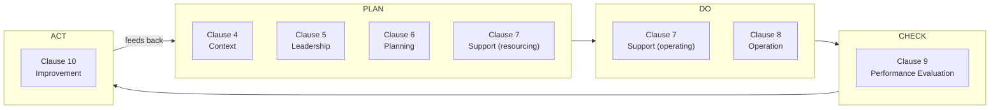
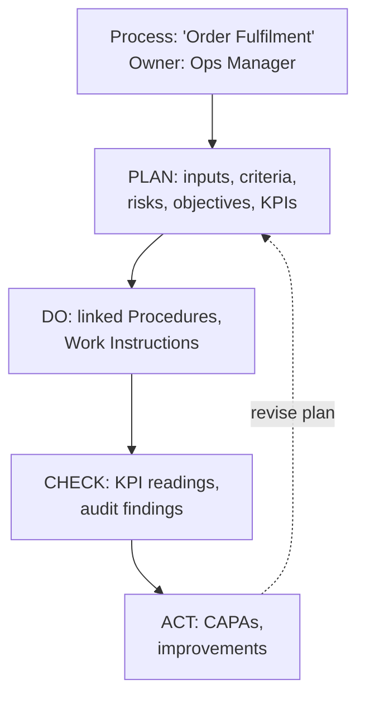
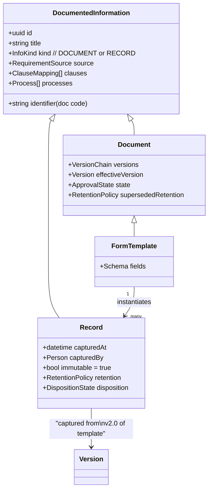
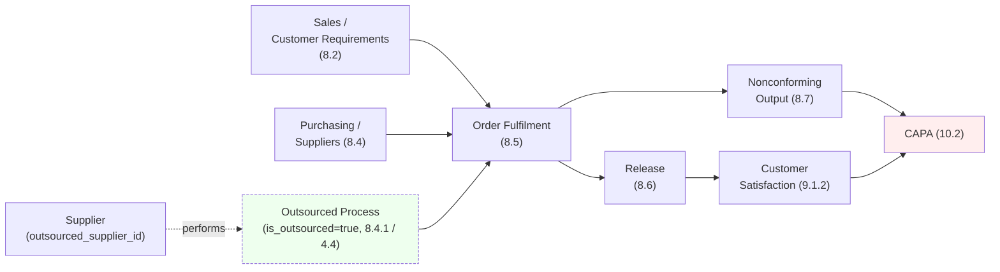
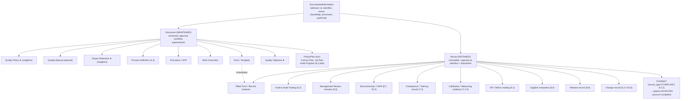

# ISO 9001:2015 Domain Model & Information Architecture

This section is the **conceptual backbone** of EasySynQ. It translates the structure, vocabulary, and intent of ISO 9001:2015 into a concrete domain model and a clause-aligned, PDCA-driven information architecture (IA). Everything downstream — navigation, data model, screens, permissions, workflows — derives from the entities, relationships, and terminology defined here. The guiding principle: **a Quality Manager opening EasySynQ should recognize their QMS instantly**, because the app is shaped like the standard they already think in. We do this by establishing a *clause-oriented spine* (the authoritative organizing axis), a *process map* (how work actually flows), and a *PDCA dashboard* (the operating rhythm), then mapping every QMS artifact onto a single canonical taxonomy with a hard, enforced distinction between **maintained documents** and **retained records**.

---

## 1. Scope, Terms & Assumptions

### 1.1 Normative vocabulary (used verbatim throughout EasySynQ)

EasySynQ adopts ISO 9000:2015 / ISO 9001:2015 terms as **first-class domain terms**. We do not invent synonyms where the standard already names a concept. These terms appear in the UI, the database schema, the API, and this document identically.

| Term | EasySynQ definition (operational) | ISO basis |
|---|---|---|
| **Documented information** | Any controlled information artifact under EasySynQ control. Superclass of *Document* and *Record*. | Clause 7.5 |
| **Document (maintained)** | Documented information that is **kept current** — it lives, gets revised, supersedes prior versions. "What we say we do." | 7.5 ("maintain") |
| **Record (retained)** | Documented information that is **kept as evidence** — captured at a point in time, immutable, never revised. "Proof we did it." | 7.5 ("retain") |
| **Process** | A set of interrelated activities transforming inputs to outputs, with an owner, risks, and KPIs. | 4.4, 0.3 |
| **Process owner** | The accountable person for a process's effectiveness and its documented information. | 5.3 (implied) |
| **Clause** | A numbered requirement section of ISO 9001:2015 (4–10). The authoritative spine. | Annex SL |
| **Interested party** | A stakeholder relevant to the QMS (customer, regulator, supplier, employee, owner). | 4.2 |
| **Risk / Opportunity** | An effect of uncertainty (risk = potential negative; opportunity = potential positive) addressed by planned actions. | 6.1 |
| **Quality objective** | A measurable target consistent with the Quality Policy, owned and time-bound. | 6.2 |
| **Nonconformity (NC)** | A non-fulfilment of a requirement. | 10.2 |
| **Correction** | Immediate action to fix the symptom / contain the NC. | 10.2 (3.12.3) |
| **Corrective action (CA)** | Action to eliminate the *cause* of an NC so it does not recur. | 10.2 |
| **CAPA** | EasySynQ's unified workflow record bundling NC + Correction + root-cause + Corrective Action + verification. (CAPA is not an ISO 9001 term per se; it is our pragmatic, Part-11-extensible container.) | derived from 10.2 |
| **Effectiveness** | The degree to which planned activities are realized and planned results achieved. | 3.7.11 |

> **Assumption A1.** EasySynQ targets the *single-organization, single-standard (ISO 9001)* model in v1, but every entity carries a `framework_id` / `standard_clause_ref` so multi-standard mapping (13485/14001/45001/IATF) is additive, never structural. See §7.

> **Assumption A2.** The clause set 4–10 is **seeded as read-only reference data** ("clause catalog") shipped with EasySynQ. Organizations *map their artifacts to* clauses; they do not edit the clause text. This keeps the spine authoritative and upgradeable.

> **Assumption A3.** "Documented information required by the standard" vs. "documented information the org deems necessary" are both supported; each artifact carries a `requirement_source` flag (`iso_mandatory` | `org_determined`).

---

## 2. Clause-by-Clause Walkthrough (Clauses 4–10)

This is the heart of the domain model. For each clause we give: its intent, the **documented information** ISO expects (mandatory vs. commonly-expected), whether each item is **Maintained (M)** or **Retained (R)**, the primary EasySynQ **entity** that holds it, and where it lives in the IA.

> Legend: **M** = maintained document, **R** = retained record. **★** = explicitly mandated documented information in ISO 9001:2015 (the "20-ish" mandatory items). Other rows are strongly expected or org-determined.

### Clause 4 — Context of the Organization (PLAN)

Intent: establish *why the QMS exists and what it covers* — the external/internal context, interested parties, scope, and the process landscape.

| # | Expected documented information | M/R | ★ | EasySynQ entity | IA home |
|---|---|---|---|---|---|
| 4.1 | Issues analysis (internal/external context) | M | | `ContextRegister` (issue items) | Context › Context Register |
| 4.2 | Interested parties & their requirements | M | | `InterestedParty` register | Context › Interested Parties |
| 4.3 | **Scope of the QMS** (incl. justified exclusions) | M | ★ | `QmsScope` (singleton document) | Context › Scope Statement |
| 4.4 | **QMS & its processes** (sequence, interaction, criteria) | M | ★ | `Process` + `ProcessMap` | Process Map (top-level) |

Notes:
- 4.3 Scope and 4.4 Process determination are the two **mandatory maintained documents** in this clause.
- The `ProcessMap` is not just a document — it is a **live graph** of `Process` nodes and their input/output edges, rendered as the app's primary "map" view (see §5.3).

### Clause 5 — Leadership (PLAN)

Intent: top-management commitment, the **Quality Policy**, and assignment of roles/responsibilities/authorities.

| # | Expected documented information | M/R | ★ | EasySynQ entity | IA home |
|---|---|---|---|---|---|
| 5.1 | Evidence of leadership commitment (e.g., mgmt review minutes, resourcing decisions) | R | | links to `ManagementReview`, `Resource` records | Leadership › Commitment Evidence |
| 5.2 | **Quality Policy** (available as documented information) | M | ★ | `QualityPolicy` (singleton, top-of-hierarchy doc) | Leadership › Quality Policy |
| 5.3 | Org roles, responsibilities & authorities | M | | `OrgRole` / RACI matrix on `Process` | Leadership › Roles & Responsibilities |

Notes:
- The `QualityPolicy` sits at the apex of the document hierarchy; the `QualityManual` (if the org keeps one — no longer mandatory in 2015) references it.
- 5.3 maps responsibilities onto `Process` owners and `OrgRole`s; this **feeds the permission layer** (roles here are organizational/QMS roles, distinct from EasySynQ *permission* roles — see §3.4).

### Clause 6 — Planning (PLAN)

Intent: risk-based thinking, **quality objectives**, and planning of changes.

| # | Expected documented information | M/R | ★ | EasySynQ entity | IA home |
|---|---|---|---|---|---|
| 6.1 | Risks & opportunities + actions to address them | M | | `RiskOpportunityRegister` entries | Planning › Risk & Opportunity Register |
| 6.2 | **Quality objectives** (measurable) + plans to achieve | M | ★ | `QualityObjective` + `ObjectivePlan` | Planning › Quality Objectives |
| 6.3 | Planning of changes (rationale, resources, responsibilities) | R | | `ChangePlan` records | Planning › Change Planning |

Notes:
- ISO 9001:2015 does not *mandate* a documented risk register, but EasySynQ provides one as the canonical home for risk-based thinking and links each entry to the `Process`, `Clause`, and any resulting `Action`/`CAPA`.
- **Risk scoring (reconciled per Decisions Register R18).** Each `risk_opportunity` register entry carries **`likelihood`**, **`severity`**, a **`risk_rating`** (derived/stored from likelihood × severity), and **`scoring_method`** (records the matrix/scale used). The stored `risk_rating` is the real field that downstream workflow routing (on `subject.risk_rating`) and the high-risk dashboards resolve against — no more proxy/placeholder.
- `QualityObjective` is mandatory documented info and is **measurable by construction** (target value, unit, owner, due date, current value) so it drives the PDCA "Check" dashboard.

### Clause 7 — Support (PLAN/DO)

Intent: resources, competence, awareness, communication, and the **control of documented information** itself — i.e., this clause governs EasySynQ's core engine.

| # | Expected documented information | M/R | ★ | EasySynQ entity | IA home |
|---|---|---|---|---|---|
| 7.1.3 | Infrastructure (where evidence is needed) | M/R | | `Resource` (infrastructure) | Support › Resources |
| 7.1.5.1 | **Monitoring & measuring resources** — fitness evidence | R | ★ | `MeasuringResource` + calibration records | Support › Measuring Equipment |
| 7.1.5.2 | **Measurement traceability** (calibration basis) | R | ★ | calibration `Record` on `MeasuringResource` | Support › Measuring Equipment |
| 7.1.6 | Organizational knowledge | M | | `KnowledgeItem` | Support › Organizational Knowledge |
| 7.2 | **Competence** evidence (education, training, skills) | R | ★ | `CompetenceRecord` per `Person` | Support › Competence & Training |
| 7.3 | Awareness | R | | training acknowledgements (`Record`) | Support › Competence & Training |
| 7.4 | Communication (what/when/who/how) | M | | `CommunicationPlan` | Support › Communication |
| **7.5** | **Documented information — control** (the meta-clause) | M+R | ★ | the **entire EasySynQ control engine** | governs all modules |

Notes — **7.5 is special**: it is the clause EasySynQ *implements as a feature* rather than stores as a doc.
- 7.5.2 (creating/updating: identification, format, review & approval) ⇒ EasySynQ's **document metadata + approval workflow**.
- 7.5.3 (control: availability, protection, distribution, storage, version control, retention/disposition) ⇒ EasySynQ's **controlled vault, immutable versions, check-in/out, access control, retention policies**.
- This is why the IA has a persistent **Document Control** lens available from every artifact, not a buried settings page.

### Clause 8 — Operation (DO)

Intent: the actual *doing* — operational planning, customer requirements, design, suppliers, production/service, release, and control of nonconforming outputs.

| # | Expected documented information | M/R | ★ | EasySynQ entity | IA home |
|---|---|---|---|---|---|
| 8.1 | Operational planning & control; criteria/process confidence | M+R | ★ | `OperationalPlan`, process `Procedure`s | Operation › Operational Planning |
| 8.2.1 | **Customer communication** incl. **customer complaints** intake | R | | `Complaint` record (`record_type=COMPLAINT`) | Operation › Customer Requirements |
| 8.2.3 | **Results of review of requirements** for products/services | R | ★ | `RequirementsReview` record | Operation › Customer Requirements |
| 8.3 | **Design & development** inputs, controls, outputs, changes | R | ★ | `DesignProject` + D&D records | Operation › Design & Development |
| 8.4 | **Control of external providers** (evaluation, selection, monitoring) | R | ★ | `Supplier` + `SupplierEvaluation` records | Operation › Suppliers (External Providers) |
| 8.5.1 | Production/service provision under controlled conditions | M | | `WorkInstruction`, `Procedure` | Operation › Production & Service |
| 8.5.2 | **Identification & traceability** (where required) | R | ★ | traceability `Record` | Operation › Production & Service |
| 8.5.3 | Property belonging to customers/external providers | R | | custody `Record` | Operation › Customer Property |
| 8.5.6 | **Production/service change control** (review/control of changes; results, authorizing person, actions) | R | ★ | `ChangeRecord` (8.5.6) | Operation › Production & Service |
| 8.6 | **Release of products/services** evidence (acceptance, releasing authority) | R | ★ | `ReleaseRecord` | Operation › Release |
| 8.7 | **Control of nonconforming outputs** | R | ★ | `Nonconformity` (product/output type) | Operation › Nonconforming Output → links to CAPA |

Notes:
- Clause 8 is where EasySynQ's **process-oriented** view shines: each `Process` on the Process Map that is operational links directly to its 8.x procedures, work instructions, and the record types it must produce.
- Design (8.3) and Suppliers (8.4) are modeled as sub-domains that some orgs exclude (4.3 exclusions); when excluded, their IA sections are hidden but the entities remain in the schema (extensibility).
- **Scope-change side effect (reconciled per Decisions Register R31).** Because exclusions only *hide* IA sections (the entities persist), when the **Scope Statement is revised to remove an exclusion**, EasySynQ **re-surfaces the previously-hidden IA sections/entities** (e.g., un-hiding Design 8.3) **and re-runs the mandatory-coverage checks** so the Compliance Checklist (the ★ set in §2.1) immediately reflects the newly in-scope mandatory items.
- **Customer-complaint intake (reconciled per Decisions Register R16).** Customer communication (8.2.1) includes a lightweight **Complaint** capture modeled as a Record with **`record_type=COMPLAINT`** and fields **`customer`, `received_at`, `channel`, `description`, `severity`**. A complaint can **one-click spawn an NCR/CAPA** carrying **`source=complaint`** (closing the dangling `source=complaint` reference used by the improvement flow). This wires Clause 8 customer feedback directly into the Clause 10 (ACT) improvement loop — see §6 (`Nonconformity / CAPA`) and the Improvement clause walkthrough.

### Clause 9 — Performance Evaluation (CHECK)

Intent: monitoring/measurement/analysis, **internal audit**, and **management review**.

| # | Expected documented information | M/R | ★ | EasySynQ entity | IA home |
|---|---|---|---|---|---|
| 9.1.1 | **Evidence of monitoring & measurement results** | R | ★ | `KpiMeasurement` / `MetricReading` | Performance › KPIs & Metrics |
| 9.1.2 | Customer satisfaction monitoring | R | | `SatisfactionSurvey` record | Performance › Customer Satisfaction |
| 9.1.3 | Analysis & evaluation of data | R | | `DataAnalysis` record | Performance › Analysis |
| 9.2 | **Internal audit program & audit results** | M+R | ★ | `AuditProgram` (M) + `Audit` + `AuditFinding` (R) | Performance › Internal Audit |
| 9.3 | **Management review** inputs & outputs (results) | R | ★ | `ManagementReview` + `ReviewOutput` | Performance › Management Review |

Notes:
- 9.2 is dual: the **audit program/schedule** is a *maintained* plan; each executed **audit, its findings, and reports** are *retained* records. EasySynQ models them as `AuditProgram (M) → AuditPlan → Audit → AuditFinding (R)`.
- `AuditFinding` of type "nonconformity" **auto-creates a linked `CAPA`**, closing the Check→Act loop.
- **As-built (S-mr-1):** 9.3 is now implemented. An *authored* Management Review is a **kind=DOCUMENT shared-PK subtype** of `documented_information` (document_type `MR`), auto-mapped to clause 9.3 at create — a **deliberate, register-sanctioned deviation from the RECORD classification above (R45):** only a released *document* earns the `current_effective_version_id` the compliance checklist reads, so DOCUMENT is the only shape that flips the **9.3 ★** node COVERED. **One released MR flips 9.3 COVERED — the ISO 9001:2015 ★ spine is now feature-complete.** (Imported legacy minutes remain kind=RECORD type `MGMT_REVIEW`; see doc 06.)

### Clause 10 — Improvement (ACT)

Intent: nonconformity & corrective action, and continual improvement.

| # | Expected documented information | M/R | ★ | EasySynQ entity | IA home |
|---|---|---|---|---|---|
| 10.2.2 | **Nature of NCs & actions taken** | R | ★ | `CAPA` (NC + correction + CA) | Improvement › Nonconformity & CAPA |
| 10.2.2 | **Results of any corrective action** | R | ★ | `CAPA.verification` | Improvement › Nonconformity & CAPA |
| 10.3 | Continual improvement evidence | R | | `ImprovementInitiative` record | Improvement › Continual Improvement |

Notes:
- Clause 10 is the **ACT** stage; CAPAs and improvement initiatives feed *back* into Clause 6 planning (new risks/objectives) and Clause 4 (context revisited) — the loop closes.

### 2.1 Consolidated mandatory documented information (the "★" set)

EasySynQ ships a **compliance checklist** seeded from this list so an org can see, at a glance, which mandatory items exist, are approved, and are current.

> **Authoritative seed (reconciled per Decisions Register R30).** This consolidated **★ (mandatory) documented-information list** is the **authoritative source for the Compliance Checklist seed**. It includes the **8.5.6 production/service change control** row; the clause-8 walkthrough table above has been aligned to carry the matching 8.5.6 row.

| Mandatory item | Clause | M/R |
|---|---|---|
| Scope of the QMS | 4.3 | M |
| QMS processes & interactions | 4.4 | M |
| Quality Policy | 5.2 | M |
| Quality objectives | 6.2 | M |
| Monitoring & measuring resource fitness | 7.1.5.1 | R |
| Measurement traceability / calibration | 7.1.5.2 | R |
| Competence evidence | 7.2 | R |
| Operational planning evidence | 8.1 | R |
| Review of product/service requirements | 8.2.3 | R |
| Design & development records | 8.3 | R |
| External provider evaluation | 8.4 | R |
| Identification & traceability | 8.5.2 | R |
| Customer/external-provider property events | 8.5.3 | R |
| Production/service change control | 8.5.6 | R |
| Product/service release | 8.6 | R |
| Nonconforming output control | 8.7 | R |
| Monitoring & measurement results | 9.1.1 | R |
| Internal audit program & results | 9.2 | M+R |
| Management review results | 9.3 | R |
| Nonconformities & corrective actions + results | 10.2 | R |

> **Design takeaway:** EasySynQ does not force a 1:1 file-per-row. An org may satisfy several rows with one document or many records. The model therefore links **artifacts ↔ clauses many-to-many** (`ClauseMapping` join), and the checklist computes coverage from those links.

---

## 3. The Process Approach & PDCA — and How EasySynQ Mirrors Them

### 3.1 The two organizing axes (and why we need both)

ISO 9001:2015 is built on two complementary ideas:

1. **The process approach** — manage the QMS as a *system of interacting processes* (Clause 0.3.1, 4.4). This is a **spatial/structural** view: who owns what, what flows where.
2. **The PDCA cycle** — operate every process and the whole QMS in a **Plan-Do-Check-Act** rhythm (Clause 0.3.2). This is a **temporal/operational** view: where are we in the improvement loop.

EasySynQ exposes **both** as primary navigation, because users alternate between "show me the *structure* of our QMS" (process map / clause spine) and "show me the *state* of our QMS right now" (PDCA dashboard).

### 3.2 PDCA ↔ Clause mapping (the canonical mapping EasySynQ enforces)



| PDCA stage | Clauses | "The question the user is answering" | Primary EasySynQ artifacts |
|---|---|---|---|
| **Plan** | 4, 5, 6, 7 (resourcing) | *What do we do, why, and with what targets?* | Context, Policy, Objectives, Risk register, Processes |
| **Do** | 7 (operating), 8 | *Are we operating as planned?* | Procedures, Work Instructions, Operation records |
| **Check** | 9 | *Is it working? What does the evidence say?* | KPIs, Audits, Management Review |
| **Act** | 10 | *What do we fix / improve?* | CAPA, Improvement initiatives |

> **Rationale for splitting Clause 7 across Plan and Do:** Support is genuinely dual — *determining/providing* resources and competence is Plan; *applying* them and controlling documented information during operation is Do. EasySynQ tags Clause-7 artifacts with a `pdca_phase` so the dashboard can place them correctly without forcing the user to choose.

### 3.3 Process-level PDCA (fractal model)

PDCA applies at **two scales**, and EasySynQ models both:

- **System PDCA** — the whole QMS turns once per management-review cycle (typically annual/quarterly).
- **Process PDCA** — *each* `Process` has its own mini-loop: planned criteria (Plan), execution (Do), its KPIs (Check), and its CAPAs/improvements (Act).



This fractal model means the **Process detail page** is itself a PDCA dashboard scoped to one process — a key UX pattern enabling **progressive disclosure**: zoom from system → process → artifact without changing mental model.

### 3.4 Two kinds of "role" — do not conflate

Because the standard (5.3) talks about *roles/responsibilities* and EasySynQ's foundation uses *permission roles*, we draw a hard line:

| Concept | Meaning | Where defined | Affects |
|---|---|---|---|
| **QMS role** (`OrgRole`) | Organizational responsibility in the QMS (e.g., "Process Owner of Purchasing", "Management Representative") | Leadership › Roles (Clause 5.3 data) | RACI, accountability, *who appears in records* |
| **Permission role** | A convenient *bundle of granular permissions* (hybrid RBAC+ABAC) per the locked permission philosophy | Admin › Roles & Permissions | *What a user can do in the app* |

A person typically has both. A QMS role *may* be wired to suggest a permission bundle, but they are independently editable. (Full treatment is in the Permissions section; here we only fix the vocabulary so the domain model stays clean.)

---

## 4. Maintained vs. Retained — The Central Distinction

This distinction (Clause 7.5: "maintain" vs. "retain") is the **single most important behavioral rule** in EasySynQ's domain model, because it dictates lifecycle, immutability, versioning, and UI affordances.

### 4.1 Definition & contrast

| Dimension | **Document (Maintained)** | **Record (Retained)** |
|---|---|---|
| ISO verb | "maintain documented information" | "retain documented information" |
| Plain meaning | *What we intend to do* | *Evidence of what happened* |
| Examples | Quality Policy, Manual, Procedure/SOP, Work Instruction, Form **template**, Scope, Objectives | Filled-in form, audit report, calibration cert, training record, management-review minutes, CAPA |
| Mutability | Revised over time; **supersession** model | **Immutable** once captured (point-in-time) |
| Versioning | Multiple versions; one **Effective** version at a time | Single fixed instance; no "new version" |
| Lifecycle | Draft → Review → Approve → **Effective** → Superseded/Obsolete | Captured → (optionally controlled signing) → Archived/Disposed per retention |
| Drift concern | **High** — the core problem EasySynQ prevents | Low — records don't drift, but must be *protected & retained* |
| Approval | Yes (review & approval workflow) | Usually a *creation/sign* event, not multi-version approval |
| Retention rule | Retain superseded versions for traceability | Retain per defined **retention period**, then controlled disposition |
| EasySynQ store | Controlled vault, version chain | Controlled vault, immutable object + metadata |

### 4.2 The "template → record" relationship (critical mechanic)

A **Form/Template** is a *maintained document*. When it is filled out, it produces a **Record** (retained). EasySynQ models this explicitly:



Key rules EasySynQ enforces:
1. A `Record` **always pins the exact `Version`** of the template/procedure it was produced under (so we know *which* edition of the SOP was followed).
2. A `Record` is **never editable** after capture — corrections create a *new* record linked as a `correction_of` (preserves audit trail; this is the seed of Part-11 extensibility).
3. Disposing a `Record` follows its `RetentionPolicy` and is itself an audited event.
4. A `Document` can be marked **Obsolete** but its superseded versions remain retrievable (read-only) for traceability.

### 4.3 How the distinction surfaces in the UI

- **Documents** show a *version timeline*, an "Effective" badge, check-in/out controls, and an approval state chip.
- **Records** show a *capture stamp*, a lock icon, a retention countdown, and a "View source document version" link — **no edit button**.
- This visual asymmetry is intentional: the UI *teaches* the maintain/retain distinction by making the two genuinely feel different.

---

## 5. Top-Level Information Architecture & Primary Navigation

### 5.1 Design principles for the IA

1. **Clause spine is authoritative** — the standard's structure is always reachable and is the canonical "table of contents" of the QMS.
2. **Three lenses, one QMS** — the same artifacts are viewable through (a) the **Clause spine**, (b) the **Process map**, (c) the **PDCA dashboard**. These are *lenses*, not silos: navigating between them never duplicates data.
3. **Progressive disclosure** — Home → lens → cluster → artifact → version/record. Each level reveals only what's needed; dense detail is one click deeper, never on the landing surface.
4. **Calm by default** — the landing surface is a *status/health* view, not a file dump.
5. **Extensibility-aware** — section labels carry clause refs so re-skinning for another standard is a data change, not an IA rebuild.

### 5.2 Primary navigation (the actual top-level menu)

EasySynQ's left rail is organized so the **top group is the PDCA/operational rhythm**, the **middle group is the clause spine grouped by PDCA**, and **structural lenses + admin** sit at the edges.

```
┌─ EasySynQ ───────────────────────────────────────────────┐
│                                                           │
│  HOME                                                     │
│   ● Dashboard (QMS Health + PDCA wheel)                   │
│   ● Process Map                                           │
│   ● My Tasks (approvals, reviews, CAPAs assigned to me)   │
│                                                           │
│  ── PLAN ─────────────────────────────────────────────    │
│   ▸ Context            (Cl. 4)                            │
│        · Context Register                                 │
│        · Interested Parties                               │
│        · Scope Statement ★                                │
│   ▸ Leadership         (Cl. 5)                            │
│        · Quality Policy ★                                 │
│        · Roles & Responsibilities                         │
│        · Commitment Evidence                              │
│   ▸ Planning           (Cl. 6)                            │
│        · Quality Objectives ★                             │
│        · Risk & Opportunity Register                      │
│        · Change Planning                                  │
│                                                           │
│  ── DO ───────────────────────────────────────────────    │
│   ▸ Support            (Cl. 7)                            │
│        · Document Control      ← the 7.5 engine lens      │
│        · Competence & Training                            │
│        · Measuring Equipment                              │
│        · Organizational Knowledge                         │
│        · Communication                                    │
│        · Resources                                        │
│   ▸ Operation          (Cl. 8)                            │
│        · Operational Planning                             │
│        · Customer Requirements                            │
│        · Design & Development     (hideable)              │
│        · Suppliers (External Providers)                   │
│        · Production & Service                             │
│        · Release                                          │
│        · Nonconforming Output                             │
│                                                           │
│  ── CHECK ────────────────────────────────────────────    │
│   ▸ Performance        (Cl. 9)                            │
│        · KPIs & Metrics                                   │
│        · Customer Satisfaction                            │
│        · Internal Audit                                   │
│        · Management Review                                │
│                                                           │
│  ── ACT ──────────────────────────────────────────────    │
│   ▸ Improvement        (Cl. 10)                           │
│        · Nonconformity & CAPA                             │
│        · Continual Improvement                            │
│                                                           │
│  ── LIBRARY (cross-cutting lens) ─────────────────────     │
│   ● All Documents      (filter by clause/process/state)   │
│   ● All Records        (filter by retention/clause)       │
│   ● Compliance Checklist (the ★ mandatory coverage view)  │
│                                                           │
│  ── ADMIN (outside the QMS) ──────────────────────────     │
│   ● Users & Roles · Permissions · Storage & Backup        │
│   ● Import / Vault Setup · Audit Log · System Settings     │
└───────────────────────────────────────────────────────────┘
```

> **Why group the clause spine *under* PDCA banners (PLAN/DO/CHECK/ACT)?** It teaches the relationship the standard intends (Annex SL clauses *are* a PDCA cycle) every time the user scans the nav. It also makes the menu feel like a *journey*, not a filing cabinet — directly serving "flow the way ISO 9001 flows."

### 5.3 The three lenses in detail

**(a) Clause spine** — the nav above *is* the spine. Selecting a clause section shows its intent (from the seeded clause catalog), its mapped artifacts, and its mandatory-item coverage. This is the "I think in clauses" entry point (auditors, QMs preparing for certification).

**(b) Process Map** — a top-level, always-one-click view rendering `Process` nodes and their input/output edges as an interactive graph (Clause 4.4). Clicking a process opens its **process-scoped PDCA page** (§3.3) with its owner, risks, procedures, KPIs, and CAPAs. This is the "I think in how-work-flows" entry point (process owners, operators).

> **Outsourced / external process nodes (reconciled per Decisions Register R17).** A `Process` may be performed by an external provider rather than in-house. The `Process` entity carries **`is_outsourced`** (boolean) and **`outsourced_supplier_id`** (nullable FK to **supplier**); when `is_outsourced = true`, the process renders on the map as an **outsourced/external process node** linked to the **supplier** that performs it, and EasySynQ still requires it to be **controlled** (ISO 9001 **8.4.1** control of externally provided processes, with **4.4** sequence/interaction). Outsourcing a process does **not** remove it from the QMS scope; it changes *who operates it* and routes its monitoring/criteria through the supplier control (8.4) sub-domain.



**(c) PDCA Dashboard (Home)** — the calm landing surface. A PDCA "wheel" with four quadrants, each summarizing health:

| Quadrant | Surfaced signals (examples) |
|---|---|
| **Plan** | Objectives on/off target; open high-risk register items; expired/overdue document reviews |
| **Do** | Documents pending approval; out-for-check-out (potential drift); procedures past their review date |
| **Check** | Upcoming/overdue audits; KPI breaches; management review due |
| **Act** | Open CAPAs by age; overdue corrective actions; improvement initiatives in progress |

Progressive disclosure: the wheel shows *counts and RAG status only*; drilling into a quadrant opens the relevant clause section pre-filtered. Nothing dense on the landing page.

### 5.4 Cross-lens consistency rule

Every artifact, regardless of lens, exposes the **same artifact header**: identifier, kind (Document/Record), clause map, owning process(es), state/version, owner, and a "View in [other lens]" switcher. This guarantees the user never feels they've entered a different app when switching lenses.

---

## 6. Canonical QMS Artifact Taxonomy

A single inheritance taxonomy underpins everything. Each leaf type is either a **Document (M)** or a **Record (R)**; the abstract `DocumentedInformation` superclass carries the universal control fields (identifier, owner, clause map, process links, audit trail).



### 6.1 Artifact catalog (build-ready reference)

| Artifact | Kind | Cardinality | Key clauses | Notable fields / behavior |
|---|---|---|---|---|
| **Quality Policy** | Doc (M) | Singleton | 5.2 | Apex of doc hierarchy; objectives must be *consistent with* it (validation hint) |
| **Quality Manual** | Doc (M) | 0..1 | (legacy/optional) | Not mandatory in 2015; acts as narrative index referencing other docs |
| **Scope Statement** | Doc (M) | Singleton | 4.3 | Holds justified exclusions; exclusions toggle visibility of IA sections (e.g., Design 8.3). **Revising the Scope Statement to remove an exclusion re-surfaces the previously-hidden IA sections/entities and re-runs the mandatory-coverage checks** (reconciled per Decisions Register R31) |
| **Process Definition** | Doc (M) | Many | 4.4 | Owner, inputs/outputs (graph edges), criteria, linked risks/KPIs/procedures; **`is_outsourced`** (boolean) + **`outsourced_supplier_id`** (nullable FK to supplier) mark an outsourced/external process (8.4.1 / 4.4) (reconciled per Decisions Register R17) |
| **Procedure / SOP** | Doc (M) | Many | 7.5, 8.x | Versioned, approved, check-in/out; produces records |
| **Work Instruction** | Doc (M) | Many | 8.5.1 | Child of a procedure; granular task steps |
| **Form / Template** | Doc (M) | Many | 7.5 | Has a field `Schema`; instantiates Records (§4.2) |
| **Quality Objective** | Doc (M) | Many | 6.2 | Measurable (target/unit/owner/due/current); feeds Plan & Check dashboards |
| **Risk & Opportunity entry** | Doc (M)* | Many | 6.1 | Register item; links to process, action/CAPA. *Treated as maintained register.* Scored via **`likelihood`**, **`severity`**, derived/stored **`risk_rating`**, and **`scoring_method`** on `risk_opportunity` (reconciled per Decisions Register R18) |
| **Interested Party** | Doc (M)* | Many | 4.2 | Party + needs/expectations |
| **Context Issue** | Doc (M)* | Many | 4.1 | Internal/external classification |
| **Audit Program** | Doc (M) | Singleton/period | 9.2 | The *plan/schedule*; spawns Audits |
| **Audit / Audit Finding** | Record (R) | Many | 9.2 | Findings of type NC auto-create CAPA |
| **Management Review** | Record (R) | Many | 9.3 | Inputs + outputs (decisions/actions) |
| **Complaint** | Record (R) | Many | 8.2.1 | `record_type=COMPLAINT`; fields `customer`, `received_at`, `channel`, `description`, `severity`; one-click spawns NCR/CAPA with `source=complaint` (reconciled per Decisions Register R16) |
| **Nonconformity / CAPA** | Record (R) | Many | 8.7, 10.2 | Unified container: NC → correction → root cause → CA → verification |
| **Competence / Training record** | Record (R) | Many | 7.2, 7.3 | Per person; awareness acknowledgements |
| **Calibration / Measuring evidence** | Record (R) | Many | 7.1.5 | Attached to `MeasuringResource`; due-date driven |
| **KPI / Metric reading** | Record (R) | Many | 9.1.1 | Time-series; tied to objective/process |
| **Supplier evaluation** | Record (R) | Many | 8.4 | Re-evaluation cadence |
| **Release record** | Record (R) | Many | 8.6 | Releasing authority captured |
| **Filled Form / Record instance** | Record (R) | Many | varies | Pins template version (§4.2) |

\* *Register items (4.1/4.2/6.1) are modeled as maintained documented information because they are kept current over time, but they are lightweight records-of-decisions rather than approval-workflow documents. EasySynQ treats a register as one controlled document whose **rows are versioned together**, with a per-row change history — a pragmatic middle ground.*

### 6.2 Universal control fields (on `DocumentedInformation`)

Every artifact carries these — this is the backbone the audit trail, search, and compliance views rely on:

| Field | Purpose |
|---|---|
| `id` (uuid) | Stable internal identity |
| `identifier` | Human doc code (e.g., `SOP-PUR-002`), org-configurable scheme |
| `kind` | `DOCUMENT` \| `RECORD` (drives all lifecycle behavior) |
| `requirement_source` | `iso_mandatory` \| `org_determined` |
| `clause_map[]` | M:N links to `Clause` (drives spine + compliance checklist) |
| `process_links[]` | M:N links to `Process` (drives process map lens) |
| `pdca_phase` | `PLAN`\|`DO`\|`CHECK`\|`ACT` (drives dashboard placement) |
| `owner` / `org_role` | Accountability (Clause 5.3) |
| `framework_id` | Reserved for multi-standard extension (default = ISO 9001) |
| `created/modified/by` + `audit_trail` | Full Clause 7.5 traceability |

---

## 7. Extensibility Hooks (Do Not Build Now — Do Not Block Either)

The locked decision #3 demands clean extension toward Part 11 and other ISO standards. The domain model reserves the following, *without implementing them*:

| Future need | Reserved hook in this model |
|---|---|
| **21 CFR Part 11 e-signatures** | `Record` already immutable + `correction_of` chain; add a `SignatureEvent` (meaning, intent, identity re-auth) attached to any artifact state transition. Approval workflow already captures who/when. |
| **Multi-standard (13485/14001/45001/IATF)** | `framework_id` on every artifact + `Clause` catalog is data-seeded per framework; `clause_map` is already M:N so one artifact can satisfy clauses across standards. |
| **Integrated/combined management systems** | PDCA + process axes are framework-agnostic; only the clause spine labels change. |
| **Per-record retention regimes** | `RetentionPolicy` + `DispositionState` exist on `Record` from day one. |

These hooks cost nothing now but guarantee we are not painted into a corner.

---

## 8. Summary — How the Pieces Lock Together

1. **Clauses 4–10** define *what documented information must exist*; EasySynQ seeds them as an authoritative, read-only **clause catalog** and maps every artifact to them M:N.
2. **PDCA** is the *operating rhythm*; it groups the clauses, drives the **Home dashboard wheel**, and recurs *fractally* on every process page.
3. **The maintain/retain distinction** is the *central behavioral rule*: Documents version & flow through approval; Records are immutable evidence with retention. Forms (M) instantiate Records (R), pinning the source version.
4. **Three lenses** — clause spine, process map, PDCA dashboard — present **one** QMS without duplication, with a consistent artifact header and cross-lens switcher.
5. **One taxonomy** (`DocumentedInformation` → Document / Record → concrete types) underpins data model, navigation, and permissions, with universal control fields enabling the audit trail, compliance checklist, and future multi-standard/Part-11 extension.

This domain model is the conceptual backbone: the navigation in §5, the data schema, the lifecycle/workflow engine, and the permission scoping all derive directly from the entities and rules defined above.
