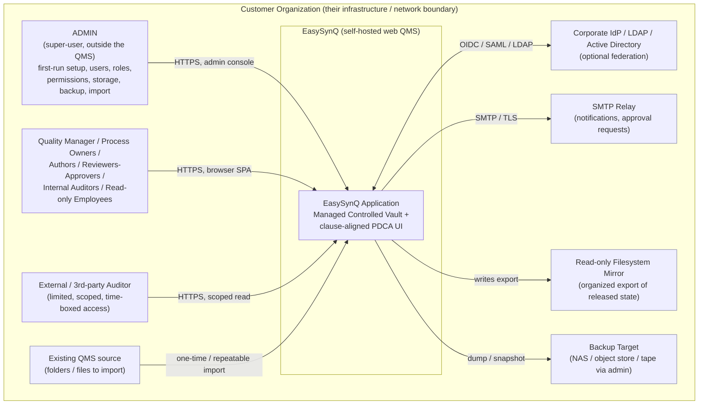
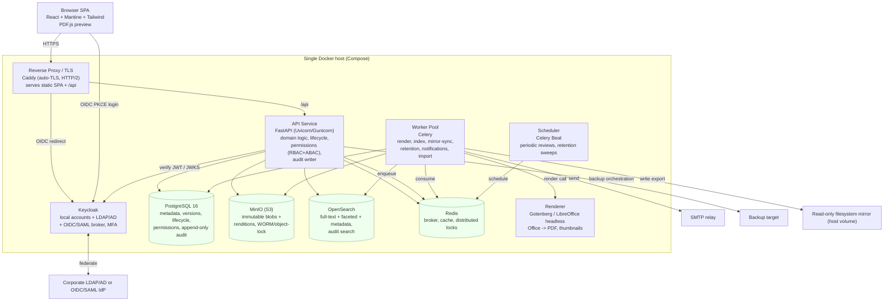
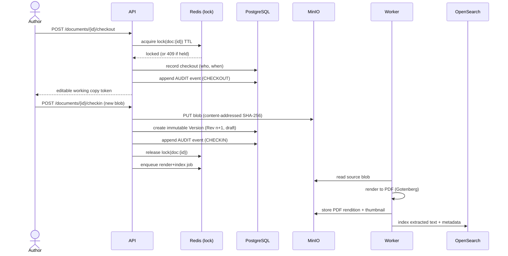
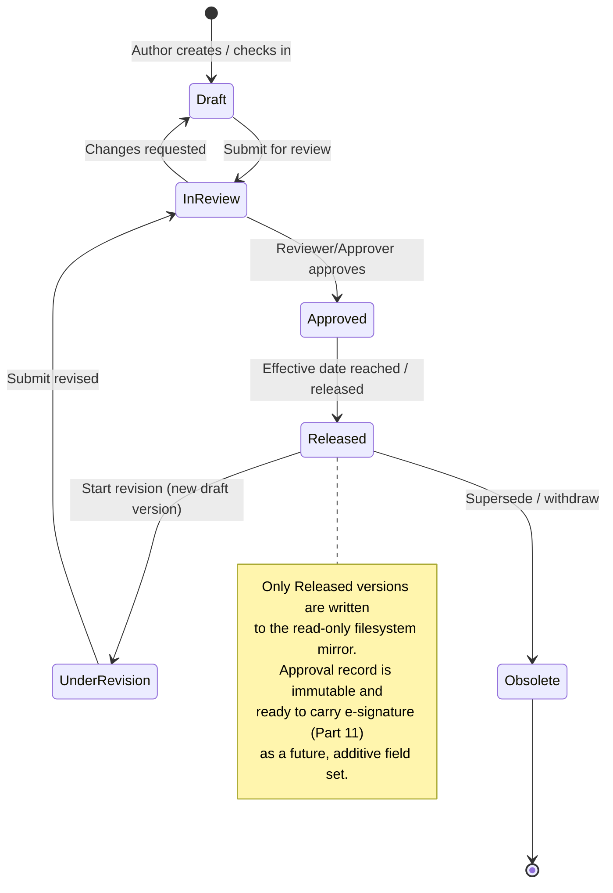
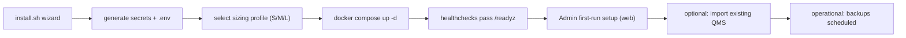

# System Architecture & Technology Stack

EasySynQ is a self-hosted, multi-user web Quality Management System (QMS) built around a **managed controlled document vault**: the relational database plus object storage are the single source of truth for every controlled document, version, record, and audit event, while the on-disk filesystem is reduced to a read-only, organized mirror/export. This section specifies the deployment topology, the recommended technology stack, security posture, sizing, observability, and the binding non-functional requirements (NFRs) that all downstream design documents must respect. Every choice is made to satisfy an ISO 9001:2015 foundation today while leaving a clean extension path toward 21 CFR Part 11-style electronic signatures and multi-standard frameworks (ISO 13485 / 14001 / 45001 / IATF 16949) later — without painting us into a corner. The guiding principles are: **simplicity of self-hosted operation** (a single-host Docker Compose footprint a small IT team can run), **immutability and traceability** (append-only audit, content-addressed binaries), and **calm, progressive UX** delivered by a modern SPA.

---

## 1. Definitions & Scope

| Term | Precise meaning in EasySynQ |
| --- | --- |
| **Controlled Vault** | The authoritative store for documents. Comprises (a) the relational DB holding metadata, lifecycle state, versions, approvals, and audit trail, and (b) object storage holding immutable binary blobs. Nothing is "controlled" unless it lives here. |
| **Blob** | An immutable, content-addressed file binary (a specific rendition of a specific document version). Identified by its SHA-256 digest. Never mutated or deleted in normal operation. |
| **Document** | A logical controlled item (e.g., "QM-001 Quality Manual") with a stable identity, a lifecycle, and an ordered chain of **versions**. |
| **Version (Revision)** | An immutable snapshot of a document at a point in time (e.g., Rev C). Has its own metadata, one or more blobs (source + renditions), and an approval record. |
| **Record / Documented Evidence** | An ISO 9001 §7.5.3 "documented information to be retained" — proof an activity happened (audit report, training log, calibration cert). Stored with the same immutability guarantees as document versions, plus retention rules. |
| **Filesystem Mirror** | A read-only directory tree EasySynQ writes (and rewrites) to reflect the current released state of the vault, for offline browsing, OS backup, and human reassurance. **Authority flows vault → mirror, never the reverse.** |
| **Self-hosted** | Runs entirely on infrastructure the customer controls (their server / VM / network). No EasySynQ component phones home; no document data leaves the customer boundary. |
| **Single-host footprint** | The entire system installs and runs on one Linux host via Docker Compose, suitable for small-to-mid organizations (target ≤ 250 named users, ≤ 1M documents/versions). A documented horizontal-scale path exists but is not required for v1. |

**Assumptions (stated explicitly):**
1. The customer can provide one Linux host (or VM) with Docker + Docker Compose v2, x86-64 or arm64, and outbound access only to fetch images (or an air-gapped image bundle is supplied).
2. TLS is terminated at EasySynQ's reverse proxy; the customer either supplies certificates or uses the built-in ACME (where reachable) / self-signed bootstrap.
3. Identity may be local-only, or federated to the customer's LDAP/AD and/or an OIDC/SAML IdP. EasySynQ never becomes the customer's primary IdP but can operate fully standalone.
4. Backups are admin-controlled and land on customer-controlled storage.

---

## 2. Recommended Technology Stack (the decision)

The following is the **single concrete recommended stack**. Alternatives and rationale are in §3.

| Layer | Choice | Version target (v1) | Role |
| --- | --- | --- | --- |
| **Frontend framework** | **React + TypeScript** (Vite build) | React 18+, TS 5+ | SPA delivering progressive-disclosure, clause-aligned UI |
| **UI components / styling** | **Mantine** component library + **Tailwind CSS** utility layer + CSS variables design-token system | Mantine 7+, Tailwind 3+ | Accessible primitives (WCAG 2.2 AA baseline), calm theming, dark/light |
| **Client data layer** | **TanStack Query** + typed API client generated from OpenAPI | — | Caching, optimistic UX, request dedupe |
| **Backend language/framework** | **Python 3.12 + FastAPI** (ASGI, Uvicorn/Gunicorn) | FastAPI 0.11x | REST/JSON API, OpenAPI-first, async I/O |
| **ORM / migrations** | **SQLAlchemy 2.x + Alembic** | — | Typed data access, versioned schema migrations |
| **Relational database** | **PostgreSQL** | 16+ | Source of truth for metadata, lifecycle, audit, permissions |
| **Object / blob storage** | **MinIO** (S3-compatible), self-hosted | latest LTS | Immutable, content-addressed document binaries & renditions |
| **Search engine** | **OpenSearch** | 2.x | Full-text + metadata + faceted search; audit log search |
| **Background jobs / workers** | **Celery** workers + **Redis** broker/result backend; **Celery Beat** for schedules | Celery 5+, Redis 7+ | Rendering, indexing, mirror sync, retention, notifications |
| **Cache / locks / queue** | **Redis** | 7+ | Broker, ephemeral cache, distributed locks (check-in/out), rate limits |
| **AuthN / Identity broker** | **Keycloak** (embedded option) — local accounts **and** LDAP/AD federation **and** OIDC/SAML SSO | latest LTS | One identity broker covering all three required auth modes |
| **Document rendering** | **LibreOffice (headless)** for Office→PDF + **PDF.js** (client) for preview; **pdfium**/Ghostscript for thumbnails | — | Server-side normalization to PDF; in-browser preview |
| **Reverse proxy / TLS** | **Caddy** (auto-TLS) or Nginx | — | TLS termination, HTTP/2, static asset serving, gzip/brotli |
| **Packaging** | **Docker Compose** (single `compose.yml` + `.env`), versioned images, install script | Compose v2 | One-command self-hosted install on a single host |
| **Observability** | **OpenTelemetry** SDK → optional Prometheus + Grafana + Loki bundle (opt-in profile) | — | Metrics, structured logs, traces |

> **One-line justification:** Python/FastAPI gives the fastest path to a correct, OpenAPI-first API with first-class async and an ecosystem rich in document/PDF tooling; PostgreSQL + MinIO + OpenSearch + Redis are the canonical, license-friendly, self-hostable building blocks for an immutable vault + search; Keycloak collapses the three mandatory auth modes (local, LDAP/AD, OIDC/SAML) into one battle-tested broker; React + Mantine + Tailwind delivers an accessible, calm, progressively-disclosed SPA.

---

## 3. Stack Rationale vs. Main Alternatives

| Decision | Chosen | Main alternative(s) | Why chosen (brief) |
| --- | --- | --- | --- |
| Backend | **Python / FastAPI** | Node.js/NestJS, Java/Spring Boot, Go | FastAPI is OpenAPI-first (auto-generated typed client + interactive docs aids the spec-driven approach), async-capable, and Python's document/PDF/Office tooling (LibreOffice UNO, pypdf, ReportLab) is the deepest. Spring is heavier to operate single-host; Node lacks Python's doc-processing depth; Go is excellent for throughput but slower to build the rich domain logic and lacks library breadth here. The workload is I/O-bound (DB, storage, rendering), where FastAPI shines. |
| Database | **PostgreSQL** | MySQL/MariaDB, SQL Server | Postgres offers transactional integrity, `JSONB` for flexible metadata + extensible standards mapping, robust row-level constructs, partitioning for the append-only audit table, and full open-source self-hosting with no licensing cost. Best fit for an immutable, audit-heavy vault. |
| Blob store | **MinIO (S3 API)** | Filesystem-only, MongoDB GridFS, Ceph | S3 semantics give object-lock/versioning (WORM), content-addressing, and a clean swap to AWS S3 / Azure Blob later **without code change**. Filesystem-only loses WORM + integrity guarantees and conflicts with our "filesystem = read-only mirror" rule. Ceph is overkill for single-host. |
| Search | **OpenSearch** | Elasticsearch, Postgres FTS, Typesense, Meilisearch | OpenSearch is Apache-2.0 (clean license for redistribution in a self-hosted product), powerful faceting/highlighting, and scales later. Postgres FTS is tempting for small installs but caps facet/relevance richness; we keep Postgres FTS as a **fallback profile** for tiny installs to save RAM (see §7). Elasticsearch's SSPL license complicates redistribution. |
| Jobs | **Celery + Redis** | RQ, Dramatiq, Arq, DB-backed queue | Celery is mature, supports scheduling (Beat), retries, routing, and chords (multi-step render→index→mirror pipelines). Redis is already present for cache/locks, minimizing moving parts. |
| AuthN | **Keycloak** | Authentik, hand-rolled OIDC, Authelia | One component delivers local accounts, LDAP/AD federation, **and** OIDC/SAML SSO/IdP brokering, plus password policies and MFA — directly satisfying the auth requirement and pre-positioning for Part 11 (re-authentication, MFA) without rebuild. Hand-rolling all three modes is risky and slow. Authentik is a viable alternative but Keycloak's SAML + LDAP maturity is stronger. |
| Frontend | **React + Mantine + Tailwind** | Vue/Nuxt, Angular, SvelteKit, MUI-only | React's hiring pool and ecosystem are largest; Mantine ships accessible, dense-data components (tables, modals, steppers) ideal for clause-aligned forms; Tailwind tokens give calm, consistent theming and easy white-labeling. Angular is heavier; Svelte's component ecosystem is thinner for enterprise data UIs. |
| Rendering | **LibreOffice headless + PDF.js** | Gotenberg (wraps LO/Chromium), commercial SDKs, OnlyOffice/Collabora | Normalizing every Office doc to PDF server-side gives one stable, watermark-able, immutable preview rendition. We run LibreOffice via a **Gotenberg** container in practice (clean HTTP API around LibreOffice/Chromium) to avoid managing the UNO bridge ourselves. PDF.js previews in-browser with zero plugins. Commercial SDKs add cost/licensing friction for a self-hosted product. |
| Packaging | **Docker Compose** | Kubernetes/Helm, bare-metal installer, Snap | Compose is the lowest-friction single-host install for the target IT teams. A Helm chart is offered as an **optional** later artifact for orgs that want HA, but is explicitly not required for v1. |

---

## 4. System Context Diagram (C4 Level 1)

**Boundary statement:** Everything inside `Customer Organization` is on infrastructure the customer controls. EasySynQ makes **no** outbound connection except to customer-designated systems (IdP, SMTP, backup target, image registry during install). No telemetry leaves the boundary unless the admin explicitly enables an external sink.

---

## 5. Component / Container Diagram (C4 Level 2)

### 5.1 Container responsibilities

| Container | Responsibility | Stateful? | Scale unit |
| --- | --- | --- | --- |
| `proxy` (Caddy) | TLS termination, HTTP/2, static SPA hosting, compression, security headers, request size limits | No | 1 |
| `api` (FastAPI) | All synchronous domain logic: auth checks, permission evaluation, lifecycle transitions, check-in/out, audit write, search query proxy, presigned upload/download URLs | No | N replicas (stateless) |
| `worker` (Celery) | Async pipelines: rendering, indexing, mirror sync, retention, notifications, imports, backup jobs | No | N replicas |
| `beat` (Celery Beat) | Single scheduler emitting periodic tasks (review-due, retention sweep, integrity verify) | No (schedule in DB) | exactly 1 |
| `keycloak` | Identity broker | Yes (own DB schema or shared PG) | 1 (HA later) |
| `postgres` | Authoritative metadata + audit | **Yes** | 1 primary (+ replica later) |
| `minio` | Authoritative blobs | **Yes** | 1 (distributed later) |
| `opensearch` | Search index (rebuildable from PG+MinIO) | Derived | 1 (cluster later) |
| `redis` | Broker/cache/locks (ephemeral) | Ephemeral | 1 |
| `renderer` (Gotenberg) | Stateless rendering | No | N replicas |

**Key invariant:** OpenSearch and the filesystem mirror are **always rebuildable** from PostgreSQL + MinIO. Only PostgreSQL and MinIO hold non-derivable truth → these two are the backup-critical stores.

---

## 6. Core Data & Flow Patterns

### 6.1 Document check-in / check-out (drift prevention)

The exclusive lock + content-addressed immutable versions are the technical mechanism for **drift prevention**: a document cannot be edited concurrently, every saved state is a new immutable version, and the filesystem mirror only ever reflects the *released* version (never a draft), so on-disk files cannot diverge from the controlled record.

### 6.2 Lifecycle state machine (ISO 9001 document control, PDCA-aligned)

**Extensibility hook for Part 11:** the approval/transition record is modeled as an append-only `signature_event` row carrying *signer, meaning, timestamp, method*. Today it records a logged-in approval (single-factor). Later it can additionally require re-authentication / MFA and bind a cryptographic signature, with **no schema rewrite** — only new non-null-defaulted columns and a stricter policy flag.

---

## 7. Sizing & Scalability (small-to-mid organizations)

Single-host deployment is the baseline. Three sizing profiles ship as Compose overlays.

| Profile | Target | Users (named) | Docs+versions | Host minimum | Notes |
| --- | --- | --- | --- | --- | --- |
| **S — Tiny** | very small org / pilot | ≤ 25 | ≤ 50k | 2 vCPU, 8 GB RAM, 50 GB SSD | **Postgres-FTS-only — OpenSearch disabled — documented degraded mode** (see §7.1): single worker; saves ~2 GB RAM; loses OpenSearch faceting/relevance/highlighting richness |
| **M — Standard** | small-to-mid (default) | ≤ 100 | ≤ 300k | 4 vCPU, 16 GB RAM, 200 GB SSD | Full stack; 2 API + 2 worker + 2 renderer replicas |
| **L — Busy mid** | active mid-size | ≤ 250 | ≤ 1M | 8 vCPU, 32 GB RAM, 500 GB+ SSD | OpenSearch given 4 GB+ heap; MinIO on dedicated disk; nightly index integrity verify |

**Scaling path (documented, not built in v1):**
- **Vertical first**: add vCPU/RAM; bump replica counts of stateless `api`/`worker`/`renderer` in Compose.
- **Storage**: MinIO points to a larger/striped volume, or repoints to external S3/Azure Blob via env (no code change).
- **Horizontal (future)**: lift to Kubernetes/Helm — Postgres with a replica + connection pooler (PgBouncer), MinIO distributed mode, OpenSearch cluster, Keycloak clustered. The architecture is already 12-factor and stateless at the app tier to allow this.

**Performance budgets (NFR, see §11):** P95 page interaction ≤ 1.5 s; document metadata read P95 ≤ 300 ms; search query P95 ≤ 800 ms; preview first-page render of a cached PDF rendition ≤ 2 s; Office→PDF render of a 20-page doc ≤ 15 s (async, non-blocking).

### 7.1 Search & render capacity budget (reconciled per Decisions Register R34)

The sizing profiles above assume the following quantified search and render costs. These are planning figures used to size disk/RAM and to set the performance budget; they are validated against the integration-test corpus before release.

- **OpenSearch index size per 1M docs.** Budget **~0.6–1.2 GB of OpenSearch index per 1 million documents/versions** for the full-text + metadata index (extracted body text plus faceted metadata, with stored highlights), i.e. roughly **1 GB per 1M docs** as the planning rule of thumb. Heavily-OCR'd or large-body corpora trend toward the upper end; metadata-light catalogs toward the lower end. The L profile's ≤ 1M ceiling therefore implies an index on the order of ~1 GB, comfortably within its 4 GB+ OpenSearch heap.
- **OCR throughput.** Text-layer extraction from already-digital PDFs/Office files is cheap; **OCR of image-only/scanned pages is the expensive path** and is **async on the worker pool**. Budget **~2–5 scanned pages/second per worker core** (typical for a Tesseract-class engine at screen DPI). A bulk import of scanned documents is therefore **throughput-bound on OCR**, not on the API tier; sizing OCR-heavy installs means adding worker replicas/cores, and OCR work is explicitly excluded from the interactive request budget.
- **Per-request watermark/stamp render cost is a real budget line.** Applying the per-recipient "uncontrolled-when-printed" watermark/stamp to a rendition is **not free** — it re-renders/overlays the PDF at download time. This **per-request watermark/stamp rendering cost belongs in the performance budget**: budget it on the same async/cached-rendition path as preview render (a watermarked download of a cached rendition targets the **≤ 2 s** cached-PDF budget; first-time stamping of a large or many-page doc may be queued like an Office→PDF render). It must never be assumed to be a zero-cost transform layered on a static blob.

#### 7.1.1 Postgres-FTS-only degraded mode (S profile)

The **S sizing profile runs Postgres-FTS-only with OpenSearch disabled**, and this is a **documented degraded mode**, not merely a "fallback": on S, the dedicated search engine is absent by design to save ~2 GB RAM. In this mode the system uses PostgreSQL full-text search, which **caps facet richness, relevance tuning, and highlighting** compared to OpenSearch. The UI surfaces that search is in degraded mode. (This is distinct from the §11 runtime graceful-degradation behavior, where OpenSearch is *configured but temporarily down*; on S it is *deliberately not deployed*.)

---

## 8. Security Posture

### 8.1 Data in transit
- **All external traffic over TLS 1.2+ (prefer 1.3)** terminated at Caddy; HSTS, HTTP/2.
- **Internal service traffic** stays on a private Docker network not published to the host except the proxy port. Optional mTLS overlay for regulated customers (future profile).
- **SMTP and LDAP** connections use STARTTLS/LDAPS; OIDC/SAML over HTTPS only.
- Security headers: HSTS, `Content-Security-Policy` (strict, nonce-based), `X-Content-Type-Options`, `Referrer-Policy`, `Permissions-Policy`, frame-ancestors `none`.

### 8.2 Data at rest
- **PostgreSQL**: full-volume encryption via host-level LUKS / dm-crypt (recommended in install guide); sensitive columns (federation secrets, SMTP creds) encrypted with an app-managed data key sealed by a master key from `.env`/secret file.
- **MinIO**: server-side encryption (SSE-S3) enabled; **object-lock / WORM** retention on the document/record buckets to enforce immutability (versions and retained records cannot be deleted or overwritten before retention expiry).
- **Blob integrity**: every blob stored under its SHA-256; a scheduled `verify` job re-hashes a rolling sample and the full set periodically, raising an audit alarm on mismatch (tamper/bit-rot detection).
- **Secrets**: never baked into images; injected via Docker secrets / `.env` with restricted file perms; Keycloak client secrets and the app master key are rotatable.

### 8.3 AuthN / AuthZ
- **AuthN** via Keycloak: local accounts, LDAP/AD federation, OIDC/SAML SSO — selectable per realm. Password policy, brute-force lockout, and optional TOTP/WebAuthn MFA are configured centrally. The SPA uses OIDC Authorization Code + PKCE; the API validates JWTs against Keycloak's JWKS.
- **AuthZ** is the **hybrid RBAC + ABAC** model mandated by the product: permissions are fine-grained capabilities, optionally bundled into org-defined roles, scopable to document / folder / process, with **direct per-user overrides**. Evaluated server-side in the `api` tier on every request; never trusted from the client. (Detailed policy model lives in the Permissions design doc; this section only fixes that enforcement is centralized and deny-by-default.)
- **External auditor access** is a scoped, optionally time-boxed grant (read + export within an audit scope), enforced by the same ABAC engine.
- **Append-only audit trail**: every state change, view-of-controlled-doc (configurable), permission change, login, and admin action writes an immutable, timestamped, attributed audit row (partitioned table, never updatable, retained per policy) — the backbone of ISO traceability and future Part 11 evidence.

### 8.4 Tenancy
v1 is **single-organization per install** (the self-hosted model). The data model carries an `org_id` discriminator from day one so a future multi-org/SaaS variant is additive, not a rewrite — but no cross-org sharing logic ships now.

### 8.5 Off-host audit-checkpoint sink (reconciled per Decisions Register R13)

The append-only audit trail (§8.3) is tamper-**evident**, but an attacker with host/root access could in principle rewrite both the audit rows and their hash-chain on the same machine. To make tamper-evidence meaningful, the architecture **provides for a mandatory off-host / append-only audit-checkpoint sink**: an external, write-once or append-only destination that periodically receives audit hash-chain checkpoints, so the on-host trail can be independently corroborated against an anchor the host cannot silently revise.

- **Architectural provision.** A worker task periodically emits a **checkpoint** (the current chain head — i.e., the latest `row_hash` and its position) to **at least one off-host or append-only sink**: e.g., a **separate WORM bucket** (object-locked, on different infrastructure), an **external object store**, or an **append-only syslog** destination. The sink is **outside the single Docker host's mutable storage**, so it survives compromise of the host.
- **Config entity `audit_checkpoint_sink`.** The sink(s) are modeled as a config entity, **`audit_checkpoint_sink`** (defined in the data model, doc 14), carrying the sink type, endpoint/target, credentials reference, and last-checkpoint state. This is the same anchor the WORM-aware restore consults in §9.1.
- **Mandatory for tamper-evidence claims; soft gate at setup.** Per the stakeholder decision (Decisions Register Part 2(c)), an off-host/append-only checkpoint sink is **MANDATORY for any install claiming tamper-evidence / Part-11 readiness**. It is **configured during setup as a soft gate** (doc 08), with a **clear UI warning if absent** — an install with no sink configured can run, but MUST NOT advertise tamper-evidence.

---

## 9. Backup & Restore Strategy

**Principle:** only PostgreSQL + MinIO are backup-critical (everything else is rebuildable). A backup is *consistent* only if the DB snapshot and blob snapshot correspond.

| Component | Method | Cadence (default, admin-tunable) | Restore |
| --- | --- | --- | --- |
| PostgreSQL | `pg_dump` logical dump **and** optional continuous WAL archiving (PITR) | Nightly full + WAL stream | `pg_restore` / PITR to timestamp |
| MinIO blobs | `mc mirror` to backup target, or MinIO bucket replication; WORM means objects are immutable so incremental mirror is safe | Nightly incremental | `mc mirror` back / repoint |
| Keycloak realm | realm export JSON | On config change + nightly | realm import |
| Config / secrets | `.env` + Compose files snapshot (encrypted) | On change | redeploy |
| OpenSearch | **Not backed up** — rebuilt from PG+MinIO via reindex job | n/a | run reindex task |
| Filesystem mirror | **Not backed up** — regenerated from vault | n/a | run mirror-sync task |

- A bundled `easysynq backup` command produces a single timestamped, checksummed, optionally-encrypted archive (DB dump + MinIO manifest + Keycloak realm + config) and writes it to the admin-configured target. Quiescing/locking briefly ensures DB↔blob consistency.
- `easysynq restore` validates checksums, restores PG + MinIO, re-imports the realm, then triggers reindex + mirror-sync. A documented **restore drill** is part of the admin runbook (RPO/RTO below).
- **RPO** ≤ 24 h with nightly (≤ minutes with WAL archiving enabled); **RTO** target ≤ 2 h on the M profile for a full restore.

### 9.1 WORM-aware restore, PITR↔blob alignment & quiesce window (reconciled per Decisions Register R37)

Because the document/record buckets are under **object-lock / WORM** (§8.2), and because PostgreSQL holds the authoritative pointers (including the audit hash-chain checkpoint) while MinIO holds the blobs, restore is **not** a naïve "load the DB dump and re-point at whatever blobs are on disk." The following constraints are binding:

- **WORM-aware restore target.** You cannot overwrite object-locked blobs in place. Restoring blobs MUST target a **fresh/cleared bucket or a versioned restore target** — never an attempt to mutate retained objects in the existing locked bucket. The restore procedure provisions (or repoints to) a clean bucket, writes the restored blob set there, then cuts MinIO over to it. The original locked bucket is left untouched as evidence.
- **PITR ↔ blob alignment.** A Postgres **point-in-time restore MUST be paired with the matching blob set** — the blob snapshot whose contents correspond to the chosen recovery timestamp — **not merely the latest mirror**. Restoring DB-to-T while pairing the newest blobs (or vice versa) yields version rows that point at blobs that did not yet exist (or that have moved on), violating the DB↔blob consistency invariant. The backup manifest records the blob-snapshot identifier alongside each WAL/PITR position so `easysynq restore` can select the aligned pair.
- **Audit hash-chain checkpoint check.** Before completing a mid-chain PITR, the restore MUST **verify the audit hash-chain checkpoint is not ahead of the PITR target** — i.e., the chained-state recorded off-host/at the checkpoint sink (the `audit_checkpoint_sink`, see §8.5) must not reference `audit_event` rows beyond the recovery point. If the checkpoint is ahead, the restore is flagged: rolling back below an already-anchored checkpoint is a tamper-evidence event and requires explicit, audited operator acknowledgement.
- **Bounded consistency-quiesce window.** Producing a consistent DB↔blob pair requires a brief **quiesce** (pause new writes / hold a consistency point). This window is **bounded and short** — targeted at the **single-digit-minutes** range on the M profile — and is **explicitly reconciled with the R14 availability target**: the quiesce counts as planned maintenance and is sized to stay within the **99.0% single-host** budget (and is shorter still, or eliminated via snapshot/clone, on the HA path).

---

## 10. Observability & Logging

| Concern | Approach |
| --- | --- |
| **Application logs** | Structured JSON to stdout (12-factor); correlation/request IDs propagated through `api` → `worker`. Collected by the bundled Loki (opt-in profile) or shipped to the customer's existing log stack. |
| **Audit log** (compliance) | **Distinct from operational logs** — lives in PostgreSQL (append-only, partitioned), searchable in-app and in OpenSearch, exportable for auditors. Never rotated/deleted before retention policy. |
| **Metrics** | OpenTelemetry → Prometheus; dashboards in Grafana (opt-in `observability` Compose profile): request latency/error rates, queue depth, render times, index lag, storage utilization, login/auth failures. |
| **Tracing** | OpenTelemetry spans across API → worker → renderer for diagnosing slow pipelines. |
| **Health** | `/healthz` (liveness) and `/readyz` (DB, MinIO, OpenSearch, Redis, Keycloak reachability) on every service for Compose healthchecks and proxy gating. |
| **Alerting** | Optional Prometheus Alertmanager rules: disk pressure, queue backlog, failed integrity verify, backup failure, auth-failure spikes. |

Observability stack is **opt-in** (a `--profile observability` overlay) so the S/M profiles aren't forced to carry Grafana/Loki/Prometheus RAM cost; logs always at least go to stdout.

---

## 11. Non-Functional Requirements (binding)

| Category | Requirement |
| --- | --- |
| **Performance** | P95 interactive action ≤ 1.5 s (M profile, nominal load); metadata read P95 ≤ 300 ms; search P95 ≤ 800 ms; cached-PDF first page ≤ 2 s. **Per-request watermark/stamp rendering is a real, budgeted cost** on the cached-rendition path (≤ 2 s for a cached rendition; large/first-time stamping is queued like a render) — not a free transform. Capacity assumptions (≈ 1 GB OpenSearch index per 1M docs; ≈ 2–5 OCR pages/s per worker core) are quantified in §7.1. Long operations (render, import, bulk export, reindex, **OCR**) are async with progress feedback — never block the request thread. (Reconciled per Decisions Register R34.) |
| **Availability** | Single-host target **99.0% monthly** (excludes planned maintenance), **including** the auth (**Keycloak**) and scheduler (**Beat**) dependencies — both are **single points of failure** on this profile, each addressed by a **fast-restart runbook** (see §11.1). **99.5%+ is achievable only via the documented HA/K8s path** (§7 horizontal-scale path); we do **not** claim 99.5% on a single host running six single-instance stateful services. Graceful degradation: if OpenSearch is down, search falls back to Postgres FTS and the UI surfaces a non-blocking banner; if the renderer is down, previews queue and metadata/check-in still work. (Reconciled per Decisions Register R14.) |
| **Durability** | No acknowledged document version or audit event is ever lost: writes to PG are committed before success is returned; blobs are written to MinIO (with object-lock) before the version is marked complete. |
| **Data integrity** | Content-addressed blobs + periodic re-hash verification; append-only audit; DB foreign-key + check constraints enforce lifecycle legality. |
| **Accessibility** | **WCAG 2.2 Level AA** across the SPA: full keyboard operability, visible focus, ARIA on all custom components (Mantine baseline + audited custom widgets), color-contrast ≥ 4.5:1 (text), respects `prefers-reduced-motion`, target-size and focus-not-obscured (new 2.2 criteria) verified. Automated axe checks in CI + manual screen-reader passes (NVDA/VoiceOver) before release. |
| **i18n readiness** | All UI strings externalized via `react-i18next` (ICU message format); locale-aware dates/numbers; **full Unicode (UTF-8) end to end** in DB, search, filenames, and the mirror; RTL-capable layout. Ships **English (en)** in v1 with the framework ready for additional locales — no hard-coded strings. |
| **Security/compliance** | Deny-by-default authz, centralized server-side enforcement, immutable audit, encrypted at rest + in transit, MFA-capable. Architected (not built) for 21 CFR Part 11 e-signatures and multi-standard mappings. |
| **Supported browsers** | Latest two stable major versions of **Chrome, Edge, Firefox, and Safari** (desktop) at release time; responsive down to tablet width. No IE11. JavaScript required (it is an SPA). |
| **Privacy / residency** | All data remains within the customer boundary; no outbound telemetry without explicit admin opt-in; PII (user identities) minimized and tied to retention policy. |
| **Maintainability** | OpenAPI-first contract; generated typed client; Alembic migrations gated in CI; semantic-versioned images; documented upgrade path with backup-before-upgrade enforced. |

### 11.1 Single-host SPOFs & fast-restart runbook (reconciled per Decisions Register R14)

The single-host profile is honest about its limits: every stateful service runs as a single instance, and **two hard dependencies are single points of failure (SPOFs)** that take user-facing capability down while they are unavailable:

- **`keycloak` (auth) — SPOF.** While Keycloak is down, new logins and token refreshes fail; in-flight sessions with a valid JWT continue until expiry. This is why the single-host availability target is **99.0%, not 99.5%** — auth is on the critical path.
- **`beat` (scheduler) — SPOF.** While Beat is down, periodic tasks (review-due, retention sweeps, integrity verify, audit-chain linking) do not fire; queued/async work already enqueued still drains via the workers. Beat is `exactly 1` by design (two schedulers would double-fire), so it cannot be replicated within the single-host model.

**Fast-restart runbook (target: restore each SPOF within minutes, inside the 99.0% budget):**
1. **Detect** — `/readyz` on `api` reports Keycloak reachability; Compose healthchecks flag a stopped `keycloak`/`beat`; Alertmanager (observability profile) raises on the failing healthcheck.
2. **Keycloak restart** — `docker compose restart keycloak`; wait for its healthcheck; confirm `api` `/readyz` clears the Keycloak dependency. Keycloak state lives in PostgreSQL (its own schema or shared PG), so a restart loses no realm/session-store data.
3. **Beat restart** — `docker compose restart beat`; the schedule lives in the DB, so it resumes without reconstruction. Missed periodic windows are caught up by the next tick (retention/verify/chain-linker tasks are idempotent and pick up backlog).
4. **Escalate to HA** — repeated SPOF outages are the documented trigger to move to the **HA/K8s path** (§7): clustered Keycloak and a leader-elected scheduler remove these SPOFs and unlock the **99.5%+** target.

**Anything claiming 99.5%+ MUST be on the HA path; the single-host profile claims 99.0%.**

---

## 12. On-Prem Packaging & Install (developer-facing summary)

- **Single artifact:** a versioned `compose.yml` + profile overlays (`s`, `m`, `l`, `observability`, `airgap`) + a `.env.example` + an `install.sh` wizard that generates secrets, picks a sizing profile, configures TLS, and brings the stack up.
- **Images:** all first-party and third-party images pinned by digest; an **air-gapped bundle** (`docker save` tarball + offline install guide) for disconnected networks.
- **First-run:** Admin completes setup (admin account, org realm, storage paths, backup target, optional IdP federation, and pointing the install at an existing QMS folder for import) through a guided wizard.
- **Upgrades:** `easysynq upgrade` enforces a pre-upgrade backup, runs Alembic migrations, performs a health gate, and supports rollback to the prior image set + DB snapshot.

---

## 13. Open Items Deferred to Other Sections

These are acknowledged here but specified elsewhere to keep this section focused:
- Detailed **permission model** (capability catalog, role bundles, ABAC attributes, scope resolution, override precedence).
- Full **data model / ERD** for documents, versions, records, audit, and standards mapping.
- **Clause-aligned UX / IA** and the PDCA navigation flow.
- **Import / migration** mechanics from an existing QMS into the vault.
- **Electronic-signature** detailed design (Part 11 phase).
