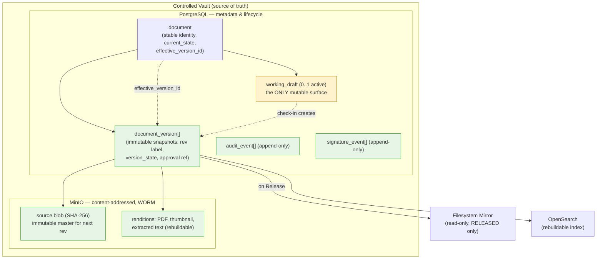

# Document Control & The Controlled Vault

This section specifies the engine that implements ISO 9001:2015 Clause 7.5 ("control of documented information") and is the root fix for **document drift**: the **Controlled Vault** — PostgreSQL (metadata, lifecycle, audit) plus MinIO (immutable, content-addressed blobs) — is the single source of truth, and the on-disk **Filesystem Mirror** is a regenerated, read-only export written *only* from Released versions, so authority always flows vault → mirror and never the reverse. It defines the maintained-**Document** lifecycle state machine (the canonical 7-state engine `Draft → InReview → Approved → Effective → UnderRevision → Superseded → Obsolete`, displayed as Draft / In Review / Approved / Effective / Under Revision / Superseded / Obsolete) with allowed transitions, triggering actors, and side effects; the immutable-version vs mutable-working-draft model; check-out/check-in and distributed locking; the document metadata schema and the numbering/identification scheme; controlled-copy vs uncontrolled-copy semantics with on-print/on-export watermarking and revision-bearing headers/footers; distribution lists with read-and-understood acknowledgement; periodic review and obsolescence cycles; and the read-only organized filesystem mirror. Everything here governs **Documents (maintained)**; the parallel rules for **Records (retained)** — immutability, retention, disposition — are referenced where they intersect but specified in the domain model (§4, doc 02) and the Records/Evidence section. Approval is modeled throughout as the recorded review decision and is the explicit **signature hook** for additive 21 CFR Part 11 e-signatures.

> **Scope note.** "Document" in this section means a maintained `DocumentedInformation` of `kind = DOCUMENT` (Quality Policy, Manual, Scope Statement, Process Definition, Procedure/SOP, Work Instruction, Form/Template, Quality Objective, registers). Records (`kind = RECORD`) do not have this lifecycle: they are captured-immutable and follow Retention/Disposition (§9.4 cross-reference). Every behavior below is enforced **server-side in the `api` tier, deny-by-default**, and writes an **append-only audit event**.

---

## 1. Terms & Precise Definitions (used verbatim)

| Term | Precise meaning in EasySynQ |
|---|---|
| **Controlled Vault** | The authoritative store: PostgreSQL (metadata, lifecycle state, versions, approvals, distribution, audit) + MinIO (immutable content-addressed blobs). Nothing is "controlled" unless it lives here. |
| **Document** | A logical maintained item with stable identity (`document.id`, `identifier`), a lifecycle, and an ordered chain of immutable **Versions**. |
| **Version (Revision)** | An immutable snapshot of a Document at a point in time (e.g. Rev C / v3.0). Owns its own metadata snapshot, one **source blob** + derived **renditions**, an approval record, and a lifecycle `version_state`. Never mutated after creation. |
| **Working Draft** | The *only* mutable surface in the Document world: a Version in state `Draft` or `Under Revision` that is checked out and being edited. On check-in it becomes an immutable Version snapshot. |
| **Effective / Released Version** | The single Version of a Document that currently governs (the authority). Exactly **one per Document at a time** (or zero, if never released / fully obsolete). This is what the mirror exports and what Records pin. |
| **Blob** | An immutable binary identified by its SHA-256 digest, stored once (content-addressed, deduplicated) in MinIO under object-lock/WORM. |
| **Rendition** | A derived blob (normalized PDF, thumbnail, extracted text) produced by the renderer from a source blob. Rebuildable; never authoritative. |
| **Check-out / Check-in** | The mandatory edit protocol: check-out acquires an exclusive lock and opens a Working Draft; check-in creates a new immutable Version and **requires a Change Reason/Summary**. |
| **Controlled Copy** | A *governed* manifestation of an Effective Version: the live in-app view, the mirror file, or a print/export that EasySynQ tracks and stamps as controlled. Guaranteed to reflect the current Effective revision. |
| **Uncontrolled Copy** | Any manifestation EasySynQ cannot keep current (an ad-hoc print, a downloaded PDF taken offline). Stamped "UNCONTROLLED COPY" with a freshness warning so it can never masquerade as the authority. |
| **Distribution List** | The set of users/roles/processes to whom a Document is *issued*, optionally requiring **read-and-understood acknowledgement**. |
| **Periodic Review** | A scheduled re-confirmation that an Effective Document is still valid, on a per-document `review_period`. |
| **Supersession** | The atomic act of a newly Released Version replacing the prior Effective Version, which is moved to `Superseded`. |
| **Obsolescence** | Withdrawal of a Document (or all its versions) from effective use; retained read-only for traceability per the standard's "control of obsolete documented information." |
| **Signature hook** | The approval/transition decision modeled as an append-only `signature_event` row (signer, meaning, intent, timestamp, method) — single-factor today, Part 11 e-signature later, additively. |

> **Assumption A1.** v1 normalizes editable source files (Office, Markdown, etc.) to a PDF rendition for preview, watermarking, and mirror; the **source blob remains the editable master** for the next revision. In-app rich authoring is a non-goal (N4); editing happens in the user's native tool around the check-out/check-in protocol.

> **Assumption A2.** "One Effective version at a time" is enforced by a database constraint, not merely by convention (see §3.4). This directly serves success metric **M (zero uncontrolled effective versions)**.

> **Assumption A3.** Registers (Context 4.1, Interested Parties 4.2, Risk/Opportunity 6.1) are maintained Documents whose *rows* version together; they use the same lifecycle but typically a **lightweight approval profile** (§4.5). All other rules apply unchanged.

---

## 2. The Controlled Vault Model

### 2.1 Immutable Versions vs the single mutable Working Draft

The Vault enforces a strict immutability boundary. Everything is immutable **except** a Working Draft that is currently checked out.



Rules the Vault enforces:

1. **A `document_version` row is immutable once created.** No `UPDATE` of content fields is permitted; the only mutable column on a version is its `version_state` transition (and even that is constrained by the state machine, §3). The blob behind it is WORM in MinIO.
2. **At most one active Working Draft per Document** (the next-revision-in-progress). It is created on check-out, exists as scratch metadata + an editable source blob, and is "frozen into" a new immutable Version on check-in.
3. **Authority flows one way:** vault → mirror, vault → index, vault → renditions. Nothing in the mirror, index, or renditions can write back to the version chain.
4. **Blobs are content-addressed and deduplicated:** identical content (same SHA-256) is stored once; a version references it. Re-uploading unchanged content is detected and surfaced ("no change detected").
5. **Renditions and the index are derived and rebuildable;** only PostgreSQL + MinIO are backup-critical (inherited invariant from doc 03 §5.1/§9).

### 2.2 Version identity & immutable snapshot contents

Each Version captures a self-contained, replayable snapshot so that any past state can be reconstructed and audited:

| Snapshot element | Why it is pinned into the version |
|---|---|
| `rev_label` (e.g. `Rev C`, `v3.0`) | Human revision identity; never reused. |
| `source_blob_sha256` + `pdf_rendition_sha256` | The exact bytes that were reviewed/approved/effective. |
| `metadata_snapshot` (JSONB) | Title, type, owner, clause map, process links, classification **as they were** at this revision (later metadata edits create a new revision — see §3.7). |
| `change_reason` / `change_summary` | Mandatory at check-in; the "why" of the revision (Clause 7.5.2). |
| `approval_ref` → `signature_event[]` | Who approved, meaning, timestamp, method. |
| `effective_from` / `effective_to` | When this revision governed (set on Release / Supersession). |
| `superseded_by_version_id` | Forward link in the supersession chain. |

---

## 3. Document Lifecycle State Machine

### 3.1 Canonical states

This is the **canonical 7-state machine** (reconciled per Decisions Register R1) and is the authoritative definition of the document lifecycle. The engine, data model, and all state diagrams use these seven engine-state tokens **verbatim**: `Draft`, `InReview`, `Approved`, `Effective`, `UnderRevision`, `Superseded`, `Obsolete`. Their display labels are Draft / In Review / Approved / Effective / Under Revision / Superseded / Obsolete. The five-state form `Draft → In Review → Approved → Effective → Obsolete` is **only** a simplified user-facing summary and is never used by the engine or data model.

| State (engine token) | Display label | Meaning | Mutable? | Governs (authority)? | In mirror? | Indexed? |
|---|---|---|---|---|---|---|
| **`Draft`** | Draft | A brand-new Document's first Working Draft being authored. | Yes (working draft) | No | No | Internal-only (drafts area) |
| **`InReview`** | In Review | Submitted; reviewers/approvers are evaluating. Content frozen. | No | No | No | Internal-only |
| **`Approved`** | Approved | Review decision recorded (signature hook fired); not yet effective (awaiting effective date / release). | No | No | No | Internal-only |
| **`Effective`** | Effective | The single governing revision. | No | **Yes** | **Yes** | Yes |
| **`UnderRevision`** | Under Revision | A *new* Working Draft (next revision) is open while the current Effective revision **keeps governing**. | Yes (the new draft only) | The prior Effective still governs | Prior Effective stays in mirror | Prior Effective stays indexed |
| **`Superseded`** | Superseded | A previously Effective revision replaced by a newer Released revision. Retained read-only for traceability. | No | No | No (removed/marked) | Yes (history search) |
| **`Obsolete`** | Obsolete | The Document (or version) is withdrawn from effective use entirely; retained read-only. | No | No | No | Yes (history search) |

> **Document-level vs Version-level state.** A Document has a `current_state` (the headline status users see), but state lives precisely on **versions** because multiple versions coexist (e.g. one `Effective` while another is `UnderRevision`). The Document's `effective_version_id` points to the single governing version; `current_state` is derived (e.g. `UnderRevision` if any version is being revised while an Effective one exists).

### 3.2 State diagram (canonical)

```mermaid
stateDiagram-v2
    [*] --> Draft: Author creates document (new doc code reserved)

    Draft --> InReview: Author submits for review\n(requires complete metadata + change reason)
    InReview --> Draft: Reviewer/Approver requests changes\n(returns to author)
    InReview --> Approved: Approver records approval decision\n(signature_event fired)

    Approved --> InReview: Approval rescinded before release\n(QM/Approver)
    Approved --> Effective: Effective date reached OR released now\n(supersedes prior effective atomically)

    Effective --> UnderRevision: Author/Owner starts a revision\n(check-out -> new working draft; current stays effective)
    UnderRevision --> Effective: Revision abandoned\n(discard draft; effective unchanged)
    UnderRevision --> InReview: Revised draft submitted

    Effective --> Superseded: A newer revision is Released\n(this revision moved to Superseded)
    Effective --> Obsolete: Withdraw / make obsolete\n(no successor; QM decision)
    Superseded --> Obsolete: Document fully retired

    Obsolete --> [*]: Retained read-only (traceability)

    note right of Effective
        Exactly ONE Effective
        version per document at a time.
        Only Effective versions are written
        to the read-only filesystem mirror.
    end note
    note right of Approved
        Approval = recorded review decision =
        the signature hook (append-only
        signature_event). Single-factor today;
        Part 11 e-signature later, additively.
    end note
```



### 3.3 Transition table — trigger, permission, guards, side effects

Each transition lists the **typical persona** trigger (permissions are atomic and scopable per the hybrid RBAC+ABAC model — personas are typical bundles, not hard boundaries), the **permission** required, **guards** (preconditions enforced server-side), and the **side effects** (all of which write an `audit_event`).

| # | From → To | Trigger (typical) | Permission (atomic) | Guards | Side effects |
|---|---|---|---|---|---|
| T1 | ∅ → **Draft** | Priya (Author) | `document.create` (scoped to folder/process) | Doc type chosen; identifier reserved (§7) | Reserve `identifier`; create `document` + `Draft` version + Working Draft; acquire edit lock; **audit: DOCUMENT_CREATED**. |
| T2 | **Draft → InReview** | Priya (Author) | `document.submit` | All required metadata present; non-empty content; **Change Reason** captured; lock released on submit | Freeze content (immutable snapshot); resolve approval route (§4.3); notify reviewers; create review tasks; **audit: SUBMITTED_FOR_REVIEW**. |
| T3 | **InReview → Draft** | Ken (Approver) / Reviewer | `document.review` | Reviewer is on the resolved route; comment required | Return to author with comments; re-open Working Draft on next check-out; **audit: CHANGES_REQUESTED**. |
| T4 | **InReview → Approved** | Ken (Approver) | `document.approve` (scoped) | All required approvers in route have decided "approve" (quorum/sequence per profile, §4.4); approver ≠ sole author if `segregation_of_duties` flag set | Write **`signature_event`** (meaning=`approval`, intent, ts, method); set planned `effective_from`; **audit: APPROVED**. |
| T5 | **Approved → InReview** | Ken / Mara (QM) | `document.rescind_approval (deferred — T5 not in MVP; not yet a seeded key)` | Not yet Effective | Void prior approval signature (recorded, not deleted); re-open review; **audit: APPROVAL_RESCINDED**. |
| T6 | **Approved → Effective** | Mara (QM) / Ken; or system (Beat) at effective date | `document.release` | Effective date ≤ now (or a release-now override of `document.release`); WORM blob confirmed; rendition present | **Atomic supersession** (§3.4): set this version Effective, set prior Effective → Superseded, update `document.effective_version_id`, set `effective_from`/prior `effective_to`; enqueue mirror-sync + distribution + acknowledgement tasks; write **`signature_event`** (meaning=`release`); **audit: RELEASED + SUPERSEDED(prior)**. |
| T7 | **Effective → UnderRevision** | Priya / Diego (Owner) | `document.checkout` + `document.edit` | No active Working Draft already; lock acquirable | Acquire lock; create new Working Draft seeded from Effective source blob; `document.current_state = UnderRevision`; **prior Effective keeps governing & stays in mirror**; **audit: REVISION_STARTED**. |
| T8 | **UnderRevision → Effective** (abandon) | Priya / Diego | `document.delete_draft` | Active draft exists | Discard Working Draft (scratch removed; nothing entered the version chain); release lock; revert `current_state` to Effective; **audit: REVISION_ABANDONED**. |
| T9 | **UnderRevision → InReview** | Priya | `document.submit` | Check-in completed (new immutable version exists, §5); Change Reason present | Same as T2 for the new revision; **audit: SUBMITTED_FOR_REVIEW**. |
| T10 | **Effective → Superseded** | system (as part of T6) | (no direct user trigger) | Triggered only by a successor Release | Set `effective_to`; remove from mirror; keep indexed for history; preserved read-only; write **`signature_event`** (meaning=`obsolete`) if also obsoleted; **audit: SUPERSEDED**. |
| T11 | **Effective → Obsolete** | Mara (QM) | `document.obsolete` | Obsolescence reason captured; impact check (links/usage) surfaced; confirm | Set Document/version `Obsolete`; clear `effective_version_id`; remove from mirror (or move to `_obsolete/` per policy §10.4); notify distribution list; write **`signature_event`** (meaning=`obsolete`); **audit: MADE_OBSOLETE**. |
| T12 | **Superseded → Obsolete** | Mara (QM) | `document.obsolete` | — | Mark superseded version archived; **audit: MADE_OBSOLETE**. |

> **Who can do what is *granted*, not role-bound.** The "Trigger (typical)" column maps to canonical personas (Priya/Ken/Mara/Diego) only as the *usual* bundle. The actual gate is the atomic permission in column 4, evaluated against scope (system/process/folder/document) with per-user overrides. Ingrid (Internal Auditor) is **explicitly denied** all mutating document permissions (T1–T12) to preserve audit independence; Sam (Read-only) and Olsen (External Auditor) likewise hold none.

### 3.4 The "exactly one Effective" invariant (enforced, not advisory)

This is the linchpin against drift and is enforced at the database layer, not by application logic alone:

- A **partial unique index** on `document_version (document_id) WHERE version_state = 'Effective'` makes a second concurrent Effective row impossible (reconciled per Decisions Register R1: canonical state token `Effective`).
- Supersession (T6/T10) executes inside **one serializable transaction**: insert/flip new version to `Effective`, flip prior to `Superseded`, update `document.effective_version_id`. Either all succeed or none do.
- The Redis check-out lock prevents two authors racing to release competing revisions.

```mermaid
sequenceDiagram
    actor Mara as Mara (QM) / Beat
    participant API
    participant PG as PostgreSQL (serializable txn)
    participant Worker
    participant Mirror
    Mara->>API: POST /documents/{id}/versions/{v}/release
    API->>API: authz: document.release @ scope; guards
    API->>PG: BEGIN SERIALIZABLE
    PG->>PG: prior Effective -> Superseded (effective_to=now)
    PG->>PG: this version -> Effective (effective_from)
    PG->>PG: document.effective_version_id = v
    PG->>PG: append audit (RELEASED, SUPERSEDED)
    PG->>PG: append signature_event (meaning=release)
    API->>PG: COMMIT  (partial-unique index guarantees single effective)
    API-->>Mara: 200 Released
    API->>Worker: enqueue mirror-sync, distribution, ack, index
    Worker->>Mirror: write new Effective; remove superseded
```

### 3.5 Visual surfacing of state (calm UX)

Per the domain model's "make Documents and Records feel different" rule, Document state is shown as a calm chip + version timeline, never a dense dump:

| State | Chip | Affordances shown |
|---|---|---|
| Draft | grey "Draft" | Edit (checked out to me), Submit for review, Discard |
| In Review | amber "In Review" | Review panel (approve / request changes), comment thread |
| Approved | blue "Approved · effective {date}" | Release now (if permitted), Rescind |
| Effective | green "Effective · Rev C · {date}" + Effective badge | View, Print (controlled), Export, Start revision, Distribution, Acknowledgements |
| Under Revision | green Effective badge **plus** a small amber "Rev D in progress" sub-chip | Open my draft; the Effective one still governs |
| Superseded | slate "Superseded by Rev D" | View read-only, compare to current |
| Obsolete | red-outline "Obsolete" + diagonal hatch | View read-only only |

### 3.6 Metadata-only revisions

Changing controlled metadata (owner, classification, clause map, review period) is itself a controlled change: it creates a **metadata-only revision** that follows the same lifecycle (it can use a lightweight approval profile, §4.5) and is captured in the version's `metadata_snapshot`. Trivial, non-controlled fields (e.g. internal tags) may be flagged `non_controlled` and edited without a revision, but every such edit still writes an `audit_event`.

---

## 4. Approval Workflow & the Signature Hook

### 4.1 Approval = recorded review decision

Approval is **the recorded review decision** and is the single, explicit extension point for future 21 CFR Part 11 e-signatures. Today it is single-factor (the authenticated, authorized user clicks Approve); the decision is persisted as an append-only `signature_event`.

### 4.2 `signature_event` (append-only) — the hook

| Column | v1 value | Part 11 additive extension (not built now) |
|---|---|---|
| `id`, `document_version_id`, `org_id` | set | — |
| `signer_user_id` | authenticated approver | + bound identity proof |
| `meaning` | lowercase snake_case enum (v1, emitted): `review` \| `approval` \| `release` \| `obsolete` \| `verify` \| `disposition` \| `import_baseline` \| `review_confirmed` (reconciled per Decisions Register R2) | + reserved Part-11 values `authored`, `responsibility` (declared, not emitted in v1) |
| `intent` | free-text/role statement (e.g. "Approved as Quality Manager") | + standardized Part 11 meaning string |
| `method` | `app_click` | + `password_reauth`, `mfa_totp`, `mfa_webauthn` |
| `created_at` | server time (UTC) | + trusted timestamp |
| `signature_payload` | NULL | + cryptographic signature / hash chain |
| `voided_by`, `voided_reason` | for rescinded approvals (recorded, never deleted) | — |

No schema rewrite is needed to reach Part 11 — only new non-null-defaulted columns and a stricter policy flag (`require_reauth_on_approve`, `require_mfa_on_release`).

> **`signature_event.meaning` enum (canonical, reconciled per Decisions Register R2).** The v1 emitted values are exactly, in lowercase snake_case: `review`, `approval`, `release`, `obsolete`, `verify`, `disposition`, `import_baseline`, `review_confirmed`. There are no uppercase `APPROVE`/`RELEASE` forms. In this section: `approval` is written at T4, `release` at T6, `obsolete` at T11/T12; `review` is written for a recorded review step; **`review_confirmed` is emitted by a periodic review that concludes no change is needed** (§9.2). `verify` (calibration/CAPA verification), `disposition` (record disposition), and `import_baseline` (controlled-baseline import) are emitted by the sections that own those flows. The values `authored` and `responsibility` are **reserved for the future Part-11 phase (declared but NOT emitted in v1)**.

### 4.3 Approval routing

A Document's approval route is resolved at submit time from, in precedence order: (1) a per-document override; (2) its document type's default route; (3) the owning process's policy; (4) the org default. A route specifies required **review** steps and required **approval** steps, each binding a **permission + scope** (not a named person), so any user holding the granted permission can fulfil a step. RACI from Clause 5.3 (`OrgRole`) may *suggest* approvers but does not gate (QMS role ≠ permission role — never conflated).

### 4.4 Route topologies & profiles

| Profile | Topology | Typical use | Guard at T4 (→ Approved) |
|---|---|---|---|
| **Single approver** | 1 approval | Work Instructions, low-risk docs | one `document.approve` decision |
| **Sequential** | review → approve (ordered) | Procedures/SOPs | each step's holder decided in order |
| **Parallel quorum** | N approvers, M-of-N | Quality Manual, cross-functional procedures | M approvals recorded |
| **Lightweight** | author self-attest + owner ack | Registers (4.1/4.2/6.1) | owner acknowledgement |
| **Policy apex** | QM + top-management sign-off | Quality Policy (5.2), Scope (4.3) | both required signatures |

A `segregation_of_duties` flag (default on for `iso_mandatory` docs) prevents the sole author from being the sole approver — a soft Part 11 pre-position.

### 4.5 Effective date handling

On approval, an `effective_from` is set (now, or a future date). If future, the Document sits in `Approved` and **Celery Beat releases it automatically** when the date arrives (T6, system trigger) — guaranteeing planned go-live without a person remembering to click. A future effective date is visible on the Approved chip.

> **`effective_from` timezone rule (reconciled per Decisions Register R8).** `effective_from` is stored as a **`timestamptz` in UTC**, but is **captured in the UI as a DATE interpreted as local-midnight in the org timezone and converted to UTC at save**. Effectivity is **displayed in the org timezone**, while the **server UTC clock remains authoritative for cutover** — i.e. Beat's release sweep compares the stored UTC instant, so a document configured to go effective on a given local date goes live at that org-local midnight expressed in UTC. This conversion rule is explicit and binding.

---

## 5. Check-out / Check-in & Locking

### 5.1 Protocol

Editing a Document is possible **only** via check-out → edit → check-in. This is the technical mechanism (with immutable versions) that prevents concurrent divergence — i.e. drift at source.

```mermaid
sequenceDiagram
    actor Author as Priya (Author)
    participant API
    participant Redis as Redis (distributed lock)
    participant PG as PostgreSQL
    participant MinIO
    participant Worker
    participant REND as Renderer

    Author->>API: POST /documents/{id}/checkout
    API->>API: authz document.checkout @ scope
    API->>Redis: SET lock:doc:{id} owner=Priya NX EX=ttl
    alt lock held by someone else
        Redis-->>API: fail
        API-->>Author: 409 Conflict (checked out by {user} since {ts})
    else acquired
        Redis-->>API: ok
        API->>PG: create/attach Working Draft; record checkout
        API->>PG: append audit CHECKOUT
        API-->>Author: editable source (download) + draft token
    end

    Note over Author: edits in native tool (offline ok)

    Author->>API: POST /documents/{id}/checkin (file, change_reason*)
    API->>API: authz; require non-empty change_reason
    API->>MinIO: PUT source blob (SHA-256, WORM)
    alt SHA-256 identical to current
        API-->>Author: 200 "No change detected" (no new version)
    else changed
        API->>PG: create immutable Version (next rev, Draft/Under Revision)
        API->>PG: append audit CHECKIN (+change_reason)
        API->>Redis: DEL lock:doc:{id}
        API->>Worker: enqueue render + index + (later) mirror on release
        Worker->>REND: Office -> PDF rendition + thumbnail
        Worker->>MinIO: store renditions
        Worker->>PG/Index: index extracted text + metadata
    end
```

### 5.2 Locking rules (Redis distributed lock)

| Concern | Rule |
|---|---|
| Lock scope | One exclusive lock per **Document** (`lock:doc:{id}`), held by the checking-out user. |
| TTL & renewal | Lock has a TTL (**default 8h**, configurable; reconciled per Decisions Register R24); the client renews via heartbeat while editing. Prevents a crashed/forgotten checkout from blocking forever. |
| Stale lock | After TTL expiry the lock auto-releases; the in-progress working copy is **PRESERVED as recoverable scratch — never silently discarded** (reconciled per Decisions Register R9). A user with `document.checkout` (Mara) can **break a lock** — an audited, notified action (`LOCK_BROKEN`) that **requires a confirm warning** before proceeding. |
| Conflict | A second checkout returns **409** with who/when, never a silent overwrite. |
| Read while checked out | Others retain read access to the current **Effective** version (Under Revision case); the in-progress draft is private to the editor + those with `document.read_draft`. |
| Crash safety | Lock is advisory-in-Redis but the *authority* is the version chain in PG; even total Redis loss cannot corrupt the vault (worst case: a stale lock to break). |

### 5.3 Mandatory Change Reason / Summary

Check-in **rejects** an empty `change_reason` (HTTP 422). This satisfies Clause 7.5.2 ("appropriate review and approval" / identification of changes), powers the human-readable version-history diff, and is shown verbatim in the version timeline and on the mirror's `CHANGELOG`.

### 5.4 Lock loss / break-lock — working-copy preservation (reconciled per Decisions Register R9)

On **lock expiry** or **admin break-lock** the in-progress working copy is **PRESERVED as recoverable scratch and is never silently discarded.** The vault retains the displaced editor's uploaded-but-not-yet-checked-in source bytes so no edit work is lost:

- The displaced editor may **check in their preserved scratch as a new draft** if **no successor was released** in the interim.
- If a **successor revision exists** (someone else released a new Effective version while the lock was lost), the preserved scratch is **offered as a starting point for a fresh revision** rather than entering the version chain blindly.
- **Break-lock requires a confirm warning.** A holder of `document.checkout` (typically Mara, QM) is shown an explicit warning — who currently holds the lock, since when, and that their in-progress work will be preserved as recoverable scratch — and must confirm before the lock is broken. The action is audited (`LOCK_BROKEN`) and the current lock-holder is notified.

This resolves the prior doc 04 §5.2 vs doc 05 §4.2 contradiction **in favor of preservation**.

---

## 6. Document Metadata Schema

### 6.1 Controlled metadata fields

These extend the universal `DocumentedInformation` control fields (doc 02 §6.2). Required fields are enforced before `Draft → In Review` (T2). Fields marked **(snapshot)** are frozen into each Version's `metadata_snapshot`.

| Field | Type | Req? | Snapshot? | Notes |
|---|---|---|---|---|
| `identifier` (document number) | string | ✔ | ✔ | Org-configurable scheme (§7); unique per org; immutable once created. |
| `title` | string | ✔ | ✔ | Human title. |
| `document_type` | enum | ✔ | ✔ | Quality Policy, Quality Manual, Scope Statement, Process Definition, Procedure/SOP, Work Instruction, Form/Template, Quality Objective, Register, … (drives default route, numbering, lifecycle profile). |
| `kind` | `DOCUMENT` | ✔ | — | Always DOCUMENT here (distinguishes from RECORD). |
| `requirement_source` | enum | ✔ | ✔ | `iso_mandatory` \| `org_determined` (drives compliance checklist + SoD default). |
| `owner` (user) | FK user | ✔ | ✔ | Accountable person (Clause 5.3). |
| `org_role` | FK OrgRole | ○ | ✔ | QMS responsibility (RACI), distinct from permission role. |
| `clause_map[]` | M:N → Clause | ✔ (≥1) | ✔ | Drives clause spine + ★ mandatory coverage. |
| `process_links[]` | M:N → Process | ○ | ✔ | Drives Process Map lens. |
| `folder_path` | `ltree` (nullable) | ○ | ✔ | Materialized logical path on the `documented_information` entity; a **scope selector** for the first-class `FOLDER` scope level, **not physical storage** (reconciled per Decisions Register R6). Set/edited via document metadata (see §6.3); scope evaluation uses subtree-prefix (ltree ancestor) matching. |
| `pdca_phase` | enum | ✔ | ✔ | PLAN \| DO \| CHECK \| ACT (dashboard placement). |
| `effective_from` (`effective_date`) | `timestamptz` (UTC) | (set at release) | ✔ | When the revision governs. Stored as `timestamptz` in **UTC**; **captured in the UI as a DATE interpreted as local-midnight in the org timezone and converted to UTC at save**; displayed in org tz (reconciled per Decisions Register R8). |
| `review_period` | interval | ✔ | ✔ | e.g. 12/24/36 months → drives `next_review_due` (§9). |
| `next_review_due` | date (derived) | — | — | `effective_from + review_period`; recomputed on release/review. |
| `classification` | enum | ✔ | ✔ | `Public` \| `Internal` \| `Confidential` \| `Restricted` (drives watermark + export/print gating). |
| `distribution_list` | structured (§8) | ○ | ✔ | Recipients + ack requirement. |
| `retention_of_superseded` | RetentionPolicy | ✔ | ✔ | How long Superseded/Obsolete versions are kept (defaults by type). |
| `framework_id` | FK | ✔ | ✔ | Default ISO 9001; reserved for multi-standard. |
| `related_docs[]` | M:N self | ○ | ✔ | Parent/child (Procedure → Work Instruction), supersedes, references. |
| `keywords/tags` | string[] | ○ | — | Non-controlled (editable without revision); aids search. |

### 6.2 Audit-trail fields (every entity)

`created_at/by`, `modified_at/by`, and the append-only `audit_event[]` (who, what, when, from-state, to-state, reason, IP/session) — partitioned, never updatable, retained per policy (inherited from doc 03 §8.3). This is the backbone of ISO traceability and Part 11 evidence.

### 6.3 Folder-path metadata management (reconciled per Decisions Register R6)

`folder_path` (PostgreSQL `ltree`, nullable) is a first-class column on the `documented_information` entity (defined in doc 14) that backs the **`FOLDER`** authorization scope level. It is a **logical scope selector, not physical storage** — the bytes still live content-addressed in MinIO, and the read-only mirror's on-disk tree (§10.3) is generated from the IA/clause layout, independent of `folder_path`.

Because it is controlled metadata, `folder_path` is **set and edited through the document metadata management affordance**, not by moving files on disk:
- The metadata editor exposes `folder_path` as a **folder/scope picker** (a path under the org's logical folder tree, e.g. `purchasing.suppliers`), with creation of intermediate path segments where permitted.
- Changing `folder_path` is a **controlled metadata edit**: it follows the metadata-revision rules of §3.6 (or is captured as an audited change for non-controlled handling) and is frozen into the version `metadata_snapshot`.
- Scope evaluation uses **subtree-prefix (ltree ancestor) matching**, so a grant on `purchasing` covers `purchasing.suppliers`; `FOLDER` therefore **survives as a first-class scope level** alongside system/process/document.

---

## 7. Document Numbering & Identification Scheme

### 7.1 Goals & default scheme

The scheme must be **human-meaningful, collision-free, stable, and configurable** (different orgs have different conventions). The default, admin/QM-configurable template:

```
{TYPE}-{AREA}-{SEQ}[ {REV}]
   e.g.  SOP-PUR-014   (Purchasing SOP #14)
         WI-PUR-014-03 (Work Instruction 3 under that SOP)
         QP-001        (Quality Policy, singleton)
         FRM-QA-022    (Form/Template)
```

| Token | Source | Example |
|---|---|---|
| `{TYPE}` | document_type code | `QP`, `QM`, `SCOPE`, `PROC`(process def), `SOP`, `WI`, `FRM`, `OBJ`, `REG` |
| `{AREA}` | process/department code (optional segment, from Process Map) | `PUR`, `SALES`, `QA` |
| `{SEQ}` | zero-padded per-(type[,area]) sequence, vault-allocated | `014` |
| `{REV}` | **not part of identifier**; revision is version metadata | shown contextually, never reused |

### 7.2 Rules

1. **`identifier` is allocated by the vault on creation (T1) and is immutable.** Sequence numbers are issued by an atomic counter (PostgreSQL sequence per type/area) so two authors can never collide.
2. **Revision is *not* part of the identifier.** A document keeps `SOP-PUR-014` across all revisions; the revision (`Rev C`, `v3.0`) is version metadata. This prevents the classic "is SOP-PUR-014-RevB a different doc?" confusion.
3. **Revision labelling** is configurable per org: `Letter` (A, B, C…), `Numeric` (1, 2, 3…), or `Major.Minor` (1.0, 1.1, 2.0). Major vs minor (where used) is chosen at check-in based on change significance.
4. **Singletons** (Quality Policy, Scope Statement) take a fixed identifier (`QP-001`, `SCOPE-001`) and enforce **exactly one `Effective` instance at a time — NOT one instance ever** (reconciled per Decisions Register R25). A **draft successor may coexist** while the current revision governs (so the policy/scope can be revised through the normal lifecycle), and the rule survives import dedup and multi-site; what the vault refuses is a **second concurrently-Effective** instance, not a successor draft.
5. **Imported documents** (UJ-2) may carry **legacy identifiers**; the vault stores `legacy_identifier` alongside the canonical one and can be configured to *preserve* legacy codes rather than renumber, to avoid breaking external references.
6. The full template (segments, separators, padding, per-area sequencing on/off) is set once during First-Run Setup and editable by the QM; changing it never renumbers existing documents.

---

## 8. Distribution & Read-and-Understood Acknowledgement

### 8.1 Controlled distribution

When a Document becomes Effective (or is re-released), it is **issued** to its `distribution_list`. Distribution targets are resolved dynamically so the list stays correct as people join/leave:

| Target kind | Resolves to | Example |
|---|---|---|
| User | that user | Sam |
| OrgRole / QMS role | all current holders | "all Purchasing operators" |
| Process | all users linked to that process | Order Fulfilment team |
| Folder/scope | users with view on that scope | a department area |

### 8.2 Read-and-understood acknowledgement

A Document may set `acknowledgement_required = true` (typical for Procedures/SOPs/Work Instructions affecting operators). On release/re-release:

```mermaid
sequenceDiagram
    participant Beat as Worker (on Release)
    participant PG
    participant Notify as Notifier (SMTP/in-app)
    actor Sam as Sam (recipient)
    Beat->>PG: create acknowledgement task per resolved recipient\n(pin document_version_id)
    Beat->>Notify: notify recipients "Rev C effective, please acknowledge"
    Sam->>PG: opens doc, reads, clicks "I have read & understood"
    PG->>PG: write acknowledgement (user, version, ts, ip) + audit
    Note over PG: Re-release (new rev) creates NEW ack tasks;\nprior acks pinned to their version remain as evidence
```

Rules:
- Acknowledgements **pin the exact `document_version_id`** — acknowledging Rev C does not satisfy Rev D; a new revision re-triggers acknowledgement for affected recipients.
- Outstanding acknowledgements appear in each recipient's **My Tasks** and on the QM's distribution dashboard (count of acknowledged / pending / overdue).
- An acknowledgement is effectively a **Record (retained, immutable)** — it is evidence of awareness (Clause 7.3) and competence (7.2 adjacency). It is never editable.
- Distribution + acknowledgement status surface on the Document header and feed the **Do** quadrant of the PDCA dashboard.

> **Reconciled per Decisions Register R43.** The blanket "Re-release (new rev) creates NEW ack tasks" is superseded: re-acknowledgement is **MAJOR-only** (doc 05 §2.2's posture) with carry-forward satisfaction — a user is covered while their acked version_seq ≥ the last MAJOR boundary. Implemented in slice S-ack-1 (mig 0048).

### 8.3 New-joiner acknowledgements (reconciled per Decisions Register R15)

Distribution targets are dynamic (§8.1), so a user can become a recipient simply by **entering a distribution target** — joining a role, being linked to a process, or gaining view on a folder/scope. When that happens, the vault automatically brings the new entrant up to date:

- On a user **entering any distribution target (role / process / folder)**, create **acknowledgement tasks for the CURRENT `Effective` version** of every Document issued to that target that **requires acknowledgement** (`acknowledgement_required = true`).
- These surface as **onboarding tasks in My Tasks** (alongside the recipient's other outstanding acknowledgements) and on the QM's distribution dashboard.
- **Already-acknowledged versions are excluded** — if the user previously acknowledged the current Effective version of a document (e.g. via a different target they already belonged to), no duplicate task is created. Acknowledgements remain pinned to `document_version_id`, so only the current Effective version's unacknowledged docs generate tasks.

This mirrors the release-time flow of §8.2 but is keyed off **target entry** rather than release, closing the gap where a new joiner would otherwise never be asked to acknowledge documents that went Effective before they joined.

---

## 9. Periodic Review Cycles & Obsolescence

### 9.1 Review scheduling

Each Effective Document has `review_period` → `next_review_due = effective_from + review_period`. **Celery Beat** runs a daily review-sweep:

| Trigger point | Action |
|---|---|
| `next_review_due − lead_time` (e.g. 30 days) | Create a **Periodic Review task** for the owner; notify; show in My Tasks + Plan dashboard quadrant. |
| `next_review_due` reached, not actioned | Mark Document **review-overdue** (amber/red on dashboard); escalate to QM. |
| Overdue ≥ grace period | Optional policy: surface as a potential **Finding** to internal audit. |

### 9.2 Review outcomes

The owner performs the review and records one of:

| Outcome | Effect | Lifecycle |
|---|---|---|
| **No change needed** | Records a `review_event` (who/when/decision) and emits a `signature_event` with `meaning=review_confirmed` (reconciled per Decisions Register R2); recompute `next_review_due` from review date. | Stays Effective; **no new content revision**, but the review decision is an audited record carrying the `review_confirmed` signature. |
| **Minor/major revision needed** | Starts a revision (T7 → Under Revision). | New revision flows through approval. |
| **Obsolete it** | Initiate obsolescence (T11). | → Obsolete. |

> A review with "no change" still produces evidence the Document was *reconsidered* — satisfying the spirit of 7.5 control without forcing a meaningless version bump.

### 9.3 Obsolescence handling

Obsoleting (T11/T12) is a controlled, reason-bearing, audited act. On obsolescence the vault:
1. Captures an `obsolescence_reason` and (optional) `superseded_by` pointer to a replacement document.
2. Surfaces an **impact check**: incoming `related_docs` links, process links, and any Records that pinned this Document's versions — so the QM sees what depends on it before withdrawing.
3. Clears `effective_version_id` (the Document no longer governs).
4. Removes the file from the live mirror (or relocates to a clearly-marked `_obsolete/` tree per policy, §10.4) so obsolete documents cannot be unintentionally used (Clause 7.5.3 control of obsolete information).
5. Notifies the distribution list of withdrawal.
6. **Retains** the obsolete/superseded versions read-only per `retention_of_superseded` for traceability; disposition (eventual deletion) follows the same retention/disposition flow as Records and is itself audited.

### 9.4 Cross-reference — Records vs Documents on retention

Documents retain *superseded versions* for traceability and are *withdrawn* (obsolete), but the Document concept itself is about currency. **Records** are captured-immutable from birth and follow a *retention period → disposition* lifecycle (no Draft/Review/Effective). Their full treatment lives in the domain model (doc 02 §4) and the Records/Evidence section; this section only governs maintained Documents.

---

## 10. The Read-Only Organized Filesystem Mirror / Export

### 10.1 Purpose & cardinal rule

The Mirror is a regenerated, **read-only** directory tree reflecting the **current Released/Effective state** of the vault, for offline browsing, OS-level backup convenience, and human reassurance (people can still "see the files"). **Authority flows vault → mirror, never the reverse** — the filesystem is never the master. This inversion is the structural root-cause fix for document drift.

### 10.2 What is mirrored

| Included | Excluded |
|---|---|
| **Only Released/Effective versions** (the single governing revision of each Document) | Drafts, In Review, Approved-but-not-yet-effective |
| Normalized **PDF rendition** (watermarked "CONTROLLED COPY", §11), stamped header/footer | Editable source blobs (the master stays in the vault) |
| A per-document `metadata.json` + human `CHANGELOG` (revision, effective date, change reason) | Superseded versions (kept in vault; optionally a separate `_history/` export) |
| A top-level `INDEX` / manifest with SHA-256 of each file | Records (separate evidence export, scope-limited; see Evidence Pack) |

### 10.3 Organization (clause + process aligned)

The tree mirrors the IA so a human browsing the disk recognizes the QMS:

```
/qms-mirror/
  INDEX.md                      (generated: all effective docs, rev, effective date, sha256)
  _meta/manifest.json           (machine manifest + checksums + generated-at)
  PLAN/
    04-Context/ SCOPE-001 Scope Statement (Rev B).pdf
    05-Leadership/ QP-001 Quality Policy (Rev C).pdf
    06-Planning/ OBJ-001 Quality Objectives (Rev A).pdf
  DO/
    07-Support/ ...
    08-Operation/
      Purchasing/ SOP-PUR-014 Purchasing Procedure (Rev C).pdf
                  WI-PUR-014-03 Supplier Onboarding (Rev A).pdf
  CHECK/ 09-Performance/ ...
  ACT/   10-Improvement/ ...
  _obsolete/                    (optional: withdrawn docs, clearly marked)
    SOP-PUR-009 (OBSOLETE) Old Purchasing Procedure.pdf
```

A configurable **secondary index by Process** (symlinks or a parallel `by-process/` tree) supports the Process Map lens without duplicating bytes.

> **Build note (S9b/S9d ✅, reconciled).** The clause tree is built in **S9b** and the `by-process/` index in **S9d** (`services/vault/mirror.py`), both as **relative symlinks into one real doc folder** (bytes stored once). The phase folder keys off the **mapped clause's** `pdca_phase`, not a document field — the §6 `pdca_phase` metadata column was never added to `documented_information` (S3), so placement is purely clause-driven (a doc mapped to several clauses lives under its numerically-lowest one + is symlinked from the rest; clause 7 splits PLAN/DO; an unmapped upgrade artifact → `_unmapped/`). The `by-process/` index is **always built** in v1 — the doc-14 `storage_config.mirror_layout` toggle is deferred to its config UI. The drift-scan/`_quarantine` (§10.6) remains v1.

### 10.4 Generation & integrity

| Aspect | Decision |
|---|---|
| Trigger | A Celery `mirror-sync` task runs on every Release/Supersession/Obsolescence (incremental) and on a nightly full reconcile (Beat). |
| Idempotent & rebuildable | The entire mirror is **fully regenerable** from PG+MinIO at any time (`easysynq mirror rebuild`); it is never backup-critical. |
| Read-only enforcement | Mirror directory is written by the worker only; mounted read-only for users; a periodic check compares on-disk SHA-256 to the manifest and, on any drift/tamper, **QUARANTINES the tampered bytes before overwriting from the vault** and **raises an audit alarm** (defends the one-way invariant; full contract in §10.6, reconciled per Decisions Register R11). |
| Atomicity | Writes go to a temp tree then atomic rename/swap, so browsers never see a half-written mirror. |
| Obsolete handling | Per §9.3, obsoleted docs are removed from the live tree or moved to `_obsolete/` (policy flag), never silently left as if effective. |

### 10.5 Why this kills drift

Because only Released versions reach the mirror, drafts can never appear on disk as if governing; because the mirror is read-only and reconciled against vault checksums, an edited on-disk file is detected — its bytes quarantined for forensics (§10.6) — and overwritten (and alarmed) rather than becoming a competing truth; and because the editable master never leaves the vault, there is no "the real Word file on someone's laptop" path. The three classic drift vectors are structurally closed.

### 10.6 Mirror drift detection, quarantine & mount contract (reconciled per Decisions Register R11)

The periodic integrity check (§10.4) is the defense against a tampered mirror file masquerading as truth. Its behavior on detection and its operating contract are normative:

**Quarantine-before-overwrite.** On detecting a divergent mirror file (on-disk SHA-256 ≠ manifest), the worker:
1. **Copies the tampered bytes to a quarantine area FIRST**, so forensic evidence is preserved before any change. The quarantine area is outside the live tree (e.g. `_quarantine/{detected-at}/...`) and is itself worker-written, not user-writable.
2. **Then overwrites the file from the vault** (the authoritative source) to restore the one-way invariant.
3. **Logs the anomaly to the audit trail** (`MIRROR_DRIFT_DETECTED`) with the document/version, the divergent vs expected digest, and the quarantine location.

**Scan cadence vs accepted drift window.** Integrity scanning runs on two cadences: an **incremental check on every `mirror-sync`** (touched paths) and a **full nightly reconcile via Beat** (the whole tree against the manifest). The **accepted drift window** — the maximum time a tampered file can sit undetected — is therefore bounded by the nightly full-reconcile interval for files not otherwise touched; deployments needing a tighter window may shorten the full-scan interval (a documented cost/throughput trade-off). A tampered file is never treated as authoritative regardless of when detected, because authority lives only in the vault.

**Mount / permission contract.** The mirror filesystem is **read-only to users and writable only by the worker** process (its service UID). This is the exact contract:
- Users (and any human-facing mount) get a **read-only** mount; the worker gets the sole **read-write** path.
- **NFS/SMB caveat:** network filesystems may not honor local mode bits or may map UIDs unexpectedly; export the share **read-only to client mounts** and grant write only on the worker's server-side export, and validate `root_squash`/UID-mapping so a client cannot write back.
- **Container-UID caveat:** the worker container's UID must own the volume and match the volume's permissions; a user-facing container mounting the same volume must mount it read-only (`:ro`), and host bind-mount ownership must align with the worker UID so writes are not silently permitted to others.

**Scope of detection.** Drift detection covers **only files within the mirror.** Copies taken **outside** the mirror (an ad-hoc print or a download carried off to a laptop) are **not** in scope here; their control status is addressed only by the **controlled-rendition verify token / verify-link** (§11.3).

---

## 11. Controlled vs Uncontrolled Copies, Watermarking, Headers & Footers

### 11.1 Concept

| Copy type | Definition | EasySynQ guarantee |
|---|---|---|
| **Controlled Copy** | The live in-app view, the read-only mirror file, or a print/export EasySynQ registers and stamps as controlled. | Always reflects (or is registered against) the current Effective revision; appears in distribution/ack tracking. |
| **Uncontrolled Copy** | Any artifact EasySynQ cannot keep current — typically an ad-hoc print/download taken offline. | Stamped **"UNCONTROLLED COPY"** + freshness warning so it can never pass as the authority. |

The principle (Clause 7.5.3): printed/exported copies are inherently snapshots; EasySynQ's job is to make their control status **unmistakable on the page**.

### 11.2 On-print / on-export watermarking & stamping

All renditions, prints, and exports pass through a server-side stamping step (the renderer / PDF layer) — clients cannot bypass it. Stamping is driven by intent and classification:

| Action | Watermark | Header/Footer | Extra |
|---|---|---|---|
| In-app preview (Effective) | faint diagonal **"CONTROLLED COPY"** | header/footer per §11.3 | — |
| Mirror PDF | **"CONTROLLED COPY"** | full header/footer | manifest SHA-256 |
| Print (Effective) via app | **"CONTROLLED COPY — valid on {print date} only"** | header/footer | QR/short-link back to live version + a `print_event` audit row |
| Export/Download (Effective) | **"UNCONTROLLED IF PRINTED / valid as of {export date}"** | header/footer | `export_event` audit row; optional `document.export` permission gate |
| Any Draft/In-Review/Superseded | **"DRAFT — NOT FOR USE"** / **"SUPERSEDED"** | header/footer | blocked from mirror entirely |
| Obsolete | **"OBSOLETE — DO NOT USE"** | header/footer | watermark cannot be suppressed |

Classification (`Confidential`/`Restricted`) adds a classification banner and may gate export/print behind permissions and force a per-action audit reason.

### 11.3 Header/footer payload (revision + effective date carried on the page)

Every controlled rendition carries an auto-generated header/footer band so the page itself proves its provenance (defeats the "is this printout current?" problem):

```
HEADER:  {org logo}   {identifier}  —  {title}                       {classification}
FOOTER:  Rev {rev_label} · Effective {effective_date} · Owner {owner}
         Controlled in EasySynQ · {copy_status} · Page {n}/{N}
         Verify current revision: {short-link or QR to live version}
```

- The footer's revision + effective date are taken from the version `metadata_snapshot`, so they are always truthful for that exact rendition.
- A scannable **verify link/QR** lets anyone holding a paper copy confirm against the live Effective revision in one step — turning an uncontrolled printout into a self-checking artifact.
- Header/footer templates are org-configurable (logo, fields, position) but the **revision + effective date + copy status are mandatory and non-removable**.

### 11.4 Non-renderable formats (reconciled per Decisions Register R26)

Some controlled formats cannot be normalized to a PDF rendition by **LibreOffice/Gotenberg** (e.g. CAD drawings, proprietary binaries, large media). For these the vault does **not** fail the document and does **not** fabricate a watermarked rendition; instead:

- **Store the source blob as the controlled artifact** (WORM, content-addressed, exactly as for any other version) — the source bytes are the authoritative controlled item.
- Mark the document **"no preview available"** in the app (no in-app preview is generated because none can be produced).
- **Gate download behind a click-through "uncontrolled when printed" notice.** Because there is no rendition to watermark or stamp, the on-page header/footer band of §11.3 cannot be applied; the click-through notice carries the copy-status warning instead.
- Keep the document **fully versioned and controlled** — the full lifecycle (§3), check-out/check-in (§5), approval (§4), distribution/acknowledgement (§8), and audit all apply unchanged.
- **Flag it as "no controlled rendition"** so it is visible as such on the **Document-Control dashboard** (doc 13), letting the QM see which controlled documents lack a watermarkable rendition.

The mirror (§10) includes the source blob for such documents in place of a PDF rendition, and its `metadata.json` records the `no_controlled_rendition` flag so the absence of a watermarked PDF is explicit rather than silent.

---

## 12. Permissions Touchpoints (deferred detail, fixed here)

Per the hybrid RBAC+ABAC model, the following **atomic permissions** are introduced by this section (the catalog/precedence lives in the Permissions doc). All are deny-by-default, scopable (system/process/folder/document), and overridable per-user:

`document.create`, `document.read`, `document.read_obsolete`, `document.read_draft`, `document.checkout`, `document.edit`, `document.submit`, `document.review`, `document.approve`, `document.release`, `document.obsolete`, `document.delete_draft`, `document.manage_metadata`, `document.acknowledge`, `document.print_controlled`, `document.export` (the canonical doc 07 §3.10 / seed-`0004` set). Two doc-control concepts shipped v1 with **no seeded key**: rescind-approval (transition T5, deferred from MVP) and distribution-list management (seeded as `document.distribute` in 0048 — R42).

> **Permission-key normalization (reconciled per Decisions Register R5).** These are the doc 07 canonical catalog forms. Earlier variant spellings used in this section normalize as: `document.view`/`document.read_effective` → `document.read`; `document.view_drafts` → `document.read_draft`; `document.submit_for_review` → `document.submit`; `document.make_obsolete` → `document.obsolete`; `document.export_controlled` → `document.export`; **`document.checkin`/`document.revise` → `document.edit`; `document.discard_draft` → `document.delete_draft`; `document.force_checkin` → `document.checkout`; `document.release_now` → `document.release`; `document.edit_metadata` → `document.manage_metadata`; `document.print` → `document.print_controlled`; `mirror.scan` is a worker/system op, not a permission**. The record-disposition permission elsewhere is `record.dispose` (**NOT** `record.retire`).

Independence rule preserved: **Ingrid (Internal Auditor)** holds broad `document.read` (+ `document.read_draft` where granted) but **none** of the mutating permissions, so she cannot edit controlled documents — protecting audit objectivity. **Olsen (External Auditor)** receives a time-boxed, scope-limited read/export grant only.

---

## 13. Extensibility Hooks (reserved, not built)

| Future need | Hook already present in this section |
|---|---|
| **21 CFR Part 11 e-signatures** | Approval/release modeled as append-only `signature_event` (signer/meaning/intent/method/ts); add re-auth/MFA/crypto columns + policy flags — additive, no rewrite. Segregation-of-duties flag pre-positioned. |
| **Multi-standard (13485/14001/45001/IATF)** | `framework_id` on every document + M:N `clause_map`; numbering `{TYPE}` codes and routes are data-configurable per framework; one document can satisfy clauses across standards. |
| **Stricter immutable evidence** | Renditions already content-addressed + WORM; `print_event`/`export_event` already audited for controlled-copy provenance. |
| **Per-document review/retention regimes** | `review_period`, `retention_of_superseded`, and `RetentionPolicy` exist from day one. |

---

## 14. Summary — How Document Control Closes the Drift Loop

1. **One source of truth:** the Vault (PG + MinIO) owns every document, version, approval, and audit event; the filesystem is a regenerated read-only mirror.
2. **Immutable versions, one mutable draft:** every saved state is a permanent snapshot; only a checked-out Working Draft is editable; check-in always demands a Change Reason.
3. **A constrained lifecycle:** the canonical 7-state engine `Draft → InReview → Approved → Effective → UnderRevision → Superseded → Obsolete` (display: Draft / In Review / Approved / Effective / Under Revision / Superseded / Obsolete; §3.1, reconciled per Decisions Register R1), with exactly **one `Effective` version** enforced by a DB constraint and atomic supersession.
4. **Approval as the signature hook:** every decision is an append-only `signature_event`, single-factor now and Part 11-ready later.
5. **Controlled distribution & awareness:** issue-on-release, version-pinned read-and-understood acknowledgements as immutable evidence.
6. **Living currency:** periodic review cycles, reasoned obsolescence, retained-but-withdrawn history.
7. **Unmistakable copy control:** server-side watermarks and revision-bearing headers/footers, with a verify-link, so no printout or export can impersonate the authority.

Together these make **audit readiness the default state** and reduce *zero uncontrolled effective versions* (success metric) from a hope to a structural guarantee.
