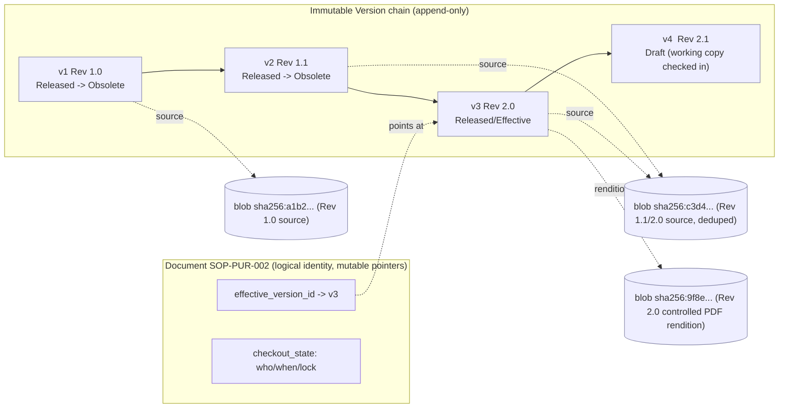
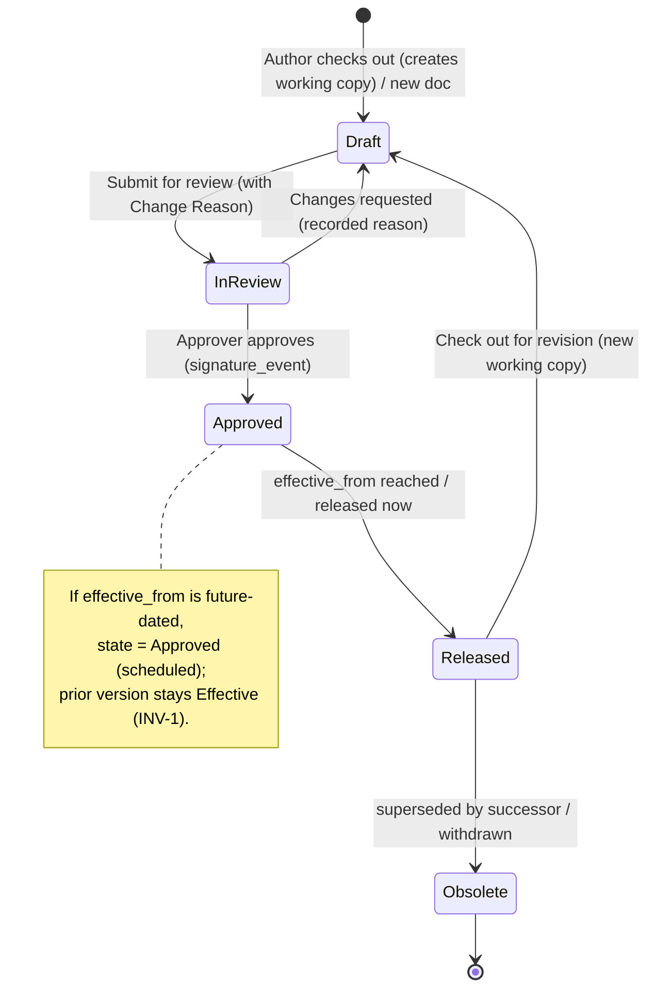
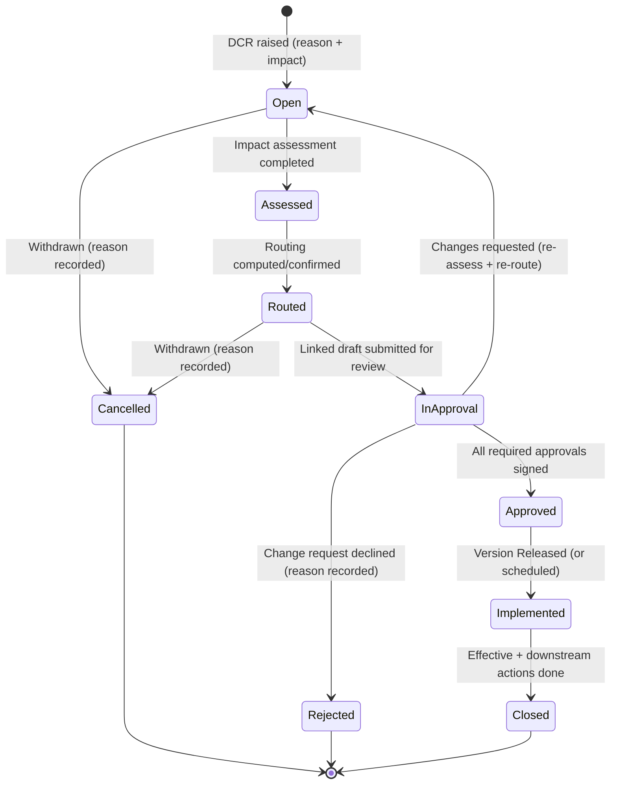
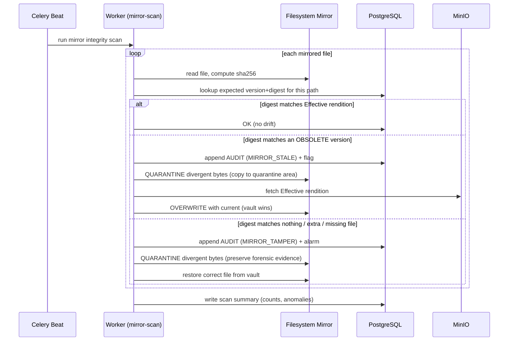

# Revision / Change Management & Document Drift Prevention

This section specifies the **heart of EasySynQ**: how controlled **Documents** (maintained documented information, ISO 9001:2015 Clause 7.5) acquire immutable versions, how change is governed end-to-end through a **Document Change Request (DCR)** with reason-for-change, impact assessment, and approval routing, and — most importantly — how **document drift is structurally PREVENTED** and, where it can still occur outside the system's reach (paper printouts, copied files), **DETECTED**. The root architectural fix is inherited from the Vision and Architecture docs: the **Controlled Vault** (PostgreSQL + MinIO) is the single source of truth, the **Filesystem Mirror** is a read-only, regenerated export written *only* from Released/Effective versions, and authority flows **vault → mirror, never the reverse**. Every Document version is an immutable, content-addressed snapshot; editing happens only through **Check-out / Check-in** under a Redis distributed lock with a mandatory Change Reason; and exactly **one** Released/Effective version exists per Document at any instant. This section also defines major/minor revision semantics, effectivity dates and scheduled future revisions, text and metadata redline/diff, the strict separation of the effective version from the working copy, scheduled re-review, and **where-used / impact analysis** across processes, records, and links. It aligns verbatim to the canonical lifecycle `Draft → In Review → Approved → Released/Effective → Obsolete`, the maintain/retain distinction, the append-only audit trail, and the Part-11 `signature_event` extension hook — building none of the deferred non-goals (N1–N10).

---

## 1. Scope, Terms & Assumptions

### 1.1 What this section governs (and what it does not)

| In scope | Out of scope (governed elsewhere) |
|---|---|
| The **version model** for Documents (maintained): revision numbering, immutable snapshots, effectivity dates, scheduled future revisions. | Record (retained) immutability and retention/disposition — covered by the domain model §4 and a future Records/Retention section. Records do **not** revise; corrections create a new record via `correction_of`. |
| **Document Change Request (DCR)**: trigger, reason-for-change, impact assessment, approval routing, link to the resulting version. | Full permission catalog / ABAC scope resolution — the Permissions section. We reference `permission keys` here but do not define their evaluation. |
| **Redline / diff** between two versions (text content and metadata). | CAPA workflow internals — the Improvement section. We define only the **DCR ↔ CAPA link** and how a CAPA can spawn a DCR. |
| **Drift prevention** (single source of truth, lock, no edits to Released, controlled distribution) and **drift detection** (hashes, mirror tamper detection, uncontrolled-copy flagging, scheduled re-review). | Part 11 e-signature cryptographic detail — non-goal **N1**; we only keep the `signature_event` hook intact. |
| **Where-used / impact analysis** across processes, records, and document links. | Import/ingest of an existing QMS — the Import section. We define how an *imported* document acquires its initial baseline version (§2.6). |

### 1.2 Terms (precise, additive to the canonical glossary)

| Term | Precise meaning in EasySynQ |
|---|---|
| **Document** | A logical controlled item of *maintained* documented information with a stable `document_id`, a lifecycle, and an ordered chain of immutable **Versions**. (Domain model: a `DocumentedInformation` with `kind = DOCUMENT`.) |
| **Version (Revision)** | An immutable point-in-time snapshot of a Document: its content blob(s), its full metadata set, its change reason, its approval/`signature_event` record, and its effectivity window. Identified by `version_id` (uuid) and an ordered, human revision label (§2.2). |
| **Baseline version** | The first Released version of a Document (revision `1.0` / `A`). Imported documents are baselined at ingest (§2.6). |
| **Effective version** | The single Version whose effectivity window contains *now* and whose Document state is Released/Effective. Exactly one per Document at any instant (invariant **INV-1**). |
| **Working copy** | The *mutable editing surface* created by Check-out. It is **not** a Version, is **never** mirrored, is **never** the source of truth, and is visible as a Draft only to those with `document.read_draft` scope. Becomes an immutable Version on Check-in. |
| **DCR (Document Change Request)** | The governed request-to-change object: what document, why, impact assessment, routing, decision, and the resulting version. The DCR is a controlled **workflow object** with a *mutable* `state` column and an append-only history of stage events — **not** a `kind=RECORD` immutable artifact; its closed form is retained as a record-like snapshot (reconciled per Decisions Register R22). It is the auditable answer to "why did this change?". |
| **Change Reason / Summary** | The mandatory free-text + classified justification captured at Check-in *and* on the DCR. Never optional. Drives the revision-history presentation and the diff header. |
| **Effectivity window** | `[effective_from, effective_to)` on a Version. `effective_from` may be future-dated (scheduled future revision); `effective_to` is set automatically when a successor becomes effective. |
| **Drift** | Divergence between what governs (the vault's Effective version) and what people actually have/follow (a stale mirror file, a printed copy, an emailed PDF). Prevented inside the boundary; detected at the boundary and beyond. |
| **Controlled rendition** | The watermarked, immutable PDF rendition of the Effective version that EasySynQ serves/prints, stamped `CONTROLLED COPY — Rev <x>, Effective <date>, printed <ts> by <user>` plus an integrity token (§6.4). |
| **Uncontrolled copy** | Any copy of a controlled document that is **not** the live, vault-served Effective rendition: a printout, a downloaded PDF, a file copied out of the mirror. EasySynQ cannot prevent these from existing but is designed to make them *self-evidently* uncontrolled and to detect them where reachable. |

### 1.3 Assumptions

- **R-A1.** Revision numbering scheme is **org-configurable** (numeric `major.minor`, alphabetic `A/B/C`, or alphanumeric `A.1`) but the *underlying* `version_seq` integer is system-owned and monotonic — the human label is a presentation projection (§2.2). Default scheme = numeric `major.minor`.
- **R-A2.** Every Document binary is content-addressed by SHA-256 (per Architecture invariant 3). Two versions with byte-identical content still get distinct `version_id`s and revision labels but **share the same blob digest** (dedup); the version is the metadata+approval wrapper, the blob is the bytes.
- **R-A3.** Check-out/Check-in concurrency uses a **Redis distributed lock** keyed `lock:doc:{document_id}` with a TTL and explicit renewal (per Architecture §6.1).
- **R-A4.** The system clock authoritative for effectivity and audit is the **server clock (UTC)**; effectivity transitions are evaluated by a Celery Beat sweep (§2.5) and lazily on read. `effective_from` is stored as `timestamptz` in UTC but **captured in the UI as a DATE interpreted as local-midnight in the org timezone and converted to UTC at save**; effectivity is *displayed* in org tz while the server UTC clock remains authoritative for cutover (reconciled per Decisions Register R8).
- **R-A5.** Approval is the recorded review decision and is the v1 **signature hook**; it writes an append-only `signature_event` row (`signer, meaning, timestamp, method`) so Part 11 is additive (non-goal **N1**, hook preserved). The `meaning` value is drawn from the canonical lowercase snake_case `signature_event.meaning` enum — `review`, `approval`, `release`, `obsolete`, `verify`, `disposition`, `import_baseline`, `review_confirmed` (reconciled per Decisions Register R2).

---

## 2. The Version Model

### 2.1 Document vs. Version vs. Blob (the three-layer identity)

A Document is a *line of descent*; a Version is an *immutable node* on that line; a Blob is the *bytes* a Version points at. This separation is what makes history permanent and drift structurally impossible inside the vault.



| Layer | Mutable? | Stored in | Notes |
|---|---|---|---|
| **Document** | Pointers only (`effective_version_id`, checkout state, review schedule) | PostgreSQL | Logical identity; its metadata defaults are inherited by new versions. |
| **Version** | **Immutable** once created | PostgreSQL (metadata) | Snapshot of all content metadata + change reason + approval; never updated, only superseded by a successor. |
| **Blob** | **Immutable**, content-addressed | MinIO (object-lock/WORM) | Bytes of one rendition (source, PDF, thumbnail). Reused across versions when identical (R-A2). |

### 2.2 Revision numbering: major / minor, letters, and the underlying sequence

EasySynQ stores a system-owned monotonic `version_seq` (1, 2, 3, …) and projects it to a human **revision label** per the org scheme. The **major/minor** distinction is a *change-significance* decision captured on the DCR / at Check-in, not a free choice of an arbitrary string.

| Concept | Stored field | Example | Meaning |
|---|---|---|---|
| Version sequence | `version_seq` (int, monotonic) | `1, 2, 3, 4` | Total order; system truth; never reused. |
| Revision label | `revision_label` (computed) | `1.0, 1.1, 2.0` or `A, B, C` | Human-facing, scheme-driven (R-A1). |
| Change significance | `change_significance` (`MAJOR`/`MINOR`) | `MAJOR` | Set on DCR; bumps major vs. minor counter. |

**Major vs. minor (the rule):**

| | **Major revision** (`x.0`, or new letter `A→B`) | **Minor revision** (`x.1, x.2`) |
|---|---|---|
| Trigger | Substantive change to *what to do*: process steps, controls, responsibilities, scope, acceptance criteria. | Editorial / non-substantive: typo, formatting, broken-link fix, clarified wording with no procedural change. |
| Re-approval | **Full** approval routing (all required approvers re-sign). | Org-configurable: either full routing or a single **editorial approver**; default = single approver, recorded the same way. |
| Re-training / re-acknowledge | Triggers read-acknowledge re-prompts for affected employees (where required). | Does **not** trigger re-acknowledge by default. |
| Where-used impact | Re-runs full impact analysis (§7). | Impact notice only (no forced downstream review). |
| Diff banner | "Major revision — substantive change." | "Minor revision — editorial." |

> **Rationale.** Auditors and employees must instantly tell "the procedure actually changed" from "a typo was fixed." Encoding significance as data (not vibes) lets the dashboard, re-acknowledge engine, and re-review scheduler behave correctly, and lets a future standard (e.g., ISO 13485) tighten the editorial path without a rewrite.

**Worked numbering example (numeric scheme, `version_seq` in brackets):**

```
[1] Rev 1.0  Released  2024-02-01  (baseline)         <- MAJOR
[2] Rev 1.1  Released  2024-06-15  (fix typo in §4)   <- MINOR
[3] Rev 2.0  Released  2025-01-10  (new approval step)<- MAJOR
[4] Rev 2.1  Released  2025-09-01  (clarify wording)  <- MINOR
[5] Rev 3.0  scheduled 2026-07-01  (regulatory change)<- MAJOR, future-effective
```

The same chain under the **alphabetic** scheme would read `A, A.1, B, B.1, C` — only the projection differs; `version_seq` is identical.

### 2.3 Immutable version snapshot — what is frozen

When a Version is created (at Check-in for a Draft, finalized at Release), the following are frozen and never change:

| Frozen on the Version | Why |
|---|---|
| `version_id`, `version_seq`, `revision_label` | Stable citation in records, audits, training. |
| `source_blob_digest` (+ rendition digests) | Content integrity; drift detection baseline. |
| Full content-metadata set (title, identifier, clause_map snapshot, process_links snapshot, owner, pdca_phase, requirement_source) | A Record pins the *exact* version it was produced under (domain model §4.2); the snapshot must be self-describing. |
| `change_reason`, `change_significance`, `dcr_id` | Permanent "why." |
| `approval` / `signature_event[]` (signer, meaning, timestamp, method) | Permanent "who approved, when, why." |
| `effective_from`, `effective_to` (window) | Permanent effectivity history. |
| `created_by`, `created_at` | Authorship. |

Mutation is **physically prevented**: blobs sit under MinIO object-lock/WORM; Version rows have no UPDATE path in the API (only INSERT of a successor); the audit table is append-only and partitioned (Architecture invariant 3). The only mutable thing about history is the *Document's pointer* to which version is currently effective.

### 2.4 Effectivity dates & scheduled future revisions

Each Version carries an effectivity window `[effective_from, effective_to)`. This lets an org approve a change **now** but have it **become effective later** (e.g., aligned to a regulatory date, a shift change, or a training-completion deadline).

| Field | Set when | Behavior |
|---|---|---|
| `effective_from` (`timestamptz`, UTC) | At Release (or scheduled at approval) | Captured in the UI as a DATE = local-midnight in the org timezone, converted to UTC at save; displayed in org tz (reconciled per Decisions Register R8). If `<= now` (server UTC), the version becomes Effective immediately. If `> now`, it is **Approved + scheduled**; it does **not** govern yet and is **not** mirrored yet. |
| `effective_to` | Auto-set when a successor's `effective_from` is reached | Marks the close of this version's reign; version becomes Obsolete/Superseded. |

**Scheduled future revision invariants:**

- **INV-1 (single effective):** At any instant, at most one Version of a Document has `effective_from <= now < effective_to` AND Document state Released/Effective. Enforced by a partial unique constraint + the transition logic.
- A scheduled version sits in state **Approved (scheduled)**. The currently-Effective version keeps governing until the scheduled `effective_from`.
- At `effective_from`, the **effectivity cutover** (Celery Beat sweep, §2.5) atomically: sets predecessor `effective_to = effective_from`, flips predecessor → Obsolete, flips scheduled → Released/Effective, repoints `Document.effective_version_id`, enqueues mirror-sync + re-acknowledge (if MAJOR), and writes audit events.
- A scheduled version can be **rescheduled or cancelled** before its `effective_from` via a controlled action (audited); cancellation returns it to Draft/Obsolete without ever having governed.

```mermaid
sequenceDiagram
    participant U as Approver (Ken)
    participant API
    participant PG as PostgreSQL
    participant Beat as Celery Beat
    participant W as Worker (mirror/notify)

    U->>API: Approve Rev 3.0 with effective_from = 2026-07-01 (future)
    API->>PG: Version v5 = Approved (scheduled), effective_from=2026-07-01
    Note over PG: Rev 2.1 (v4) STILL Effective. INV-1 holds.
    Beat->>API: cutover sweep @ 2026-07-01T00:00Z
    API->>PG: BEGIN TX
    API->>PG: v4.effective_to = 2026-07-01; v4 -> Obsolete
    API->>PG: v5 -> Released/Effective; Document.effective_version_id = v5
    API->>PG: append AUDIT (CUTOVER, EFFECTIVE_CHANGED)
    API->>PG: COMMIT TX
    API->>W: enqueue mirror-sync + re-acknowledge (MAJOR)
```

### 2.5 Effectivity evaluation (Beat sweep + lazy read)

Two mechanisms keep effectivity correct:

1. **Celery Beat cutover sweep** (default every 5 min, configurable): finds Approved-scheduled versions whose `effective_from <= now` and performs the atomic cutover (§2.4). Also closes any window edge cases.
2. **Lazy read guard:** every read of `Document.effective_version_id` is validated against the clock; if a cutover is due but the sweep has not yet run, the read path performs (or triggers) the cutover so the user is never served a stale effective pointer. This makes correctness independent of sweep latency.

### 2.6 Baseline of imported documents

When the Import process ingests an existing file as a controlled Document, EasySynQ creates a **baseline version** (`version_seq = 1`, default `Rev 1.0` / `A`) in state Released/Effective, with:
- `change_reason = "Imported baseline (migration)"`, `change_significance = MAJOR`,
- `source_blob_digest` computed at ingest (the integrity anchor for all future drift detection),
- `effective_from = import date` (or an admin-supplied "as-of"),
- an `imported = true` provenance flag and the original path recorded for audit.

From that moment the imported file is under full control; the original on-disk file is *not* the master — the mirror will be regenerated from this baseline.

---

## 3. The Working Copy vs. Effective Version — Strict Separation

This separation is the single most important runtime rule for drift prevention. The two are different *kinds of thing* and are deliberately impossible to confuse.

| | **Effective version** | **Working copy** |
|---|---|---|
| Nature | An immutable Released Version | A mutable editing surface (a Draft-in-progress) |
| Exists | Always (exactly one per Document) | Only between Check-out and Check-in |
| Source of truth? | **Yes** | **No, never** |
| Mirrored to filesystem? | **Yes** (only Released) | **Never** |
| Served to readers / external auditors? | Yes (controlled rendition) | No (only `document.read_draft` holders) |
| Editable? | **No** (no edit path exists) | Yes (the only place edits happen) |
| Lock | n/a | Holds the Redis exclusive lock |
| On Check-in | unchanged | Becomes a new immutable Draft Version (does not auto-release) |

**Hard rules (server-enforced, deny-by-default):**
- **No edit-in-place of a Released version, ever.** There is no API verb to mutate a Released Version's content. Change requires Check-out, which creates a *new* working copy / Draft version — the Effective version keeps governing untouched until a successor is *released*.
- **Check-in does not release.** A checked-in working copy becomes a Draft version and must traverse `Draft → In Review → Approved → Released/Effective`. Until then, the prior version remains Effective (INV-1).
- The **working copy is invisible to ordinary readers**; Sam (read-only) and Olsen (external auditor) only ever see the Effective version. Ingrid (internal auditor) sees drafts as read-only for independence but cannot edit.



---

## 4. Check-out / Check-in (the only editing path)

Editing is gated by an exclusive lock and a mandatory Change Reason. This is the mechanism the Architecture doc names (§6.1); here we specify the governance details.

### 4.1 Sequence

```mermaid
sequenceDiagram
    actor Priya as Author (Priya)
    participant API
    participant Redis
    participant PG as PostgreSQL
    participant MinIO
    participant Worker
    participant IDX as OpenSearch

    Priya->>API: POST /documents/{id}/checkout  (requires document.checkout in scope)
    API->>Redis: SET lock:doc:{id} = Priya  NX  EX=TTL
    alt lock free
        Redis-->>API: OK
        API->>PG: checkout row (who, when, source_version=v3)
        API->>PG: append AUDIT (CHECKOUT)
        API-->>Priya: working-copy editor token (Draft v4 staged)
    else lock held by Diego
        Redis-->>API: held
        API-->>Priya: 409 "Checked out by Diego since 10:32; request takeover?"
    end

    Priya->>API: POST /documents/{id}/checkin  (new blob + MANDATORY change_reason + significance)
    API->>API: validate change_reason non-empty, significance set
    API->>MinIO: PUT source blob (sha256, dedup)
    API->>PG: INSERT immutable Version v4 = Draft (reason, significance, dcr_id?)
    API->>PG: append AUDIT (CHECKIN)
    API->>Redis: DEL lock:doc:{id}
    API->>Redis: enqueue render + index
    Worker->>MinIO: write PDF rendition + thumbnail (sha256)
    Worker->>IDX: index extracted text + metadata
```

### 4.2 Lock semantics & edge cases

| Concern | Behavior |
|---|---|
| Concurrency | Exactly one holder. Second check-out → `409 Conflict` with holder + since-timestamp. |
| Lock TTL | Default 8h, renewed on editor heartbeat; prevents permanent locks from a closed tab. |
| Abandoned lock | On TTL expiry the lock auto-releases; the in-progress working copy is **PRESERVED as recoverable scratch** — never silently discarded (reconciled per Decisions Register R9, aligning with doc 04). The displaced editor may **check in as a new draft** if no successor was released; if a successor exists, their work is **offered as a starting point for a fresh revision**. An audit `LOCK_EXPIRED` event is written. No partial/uncontrolled state can leak (the scratch is a Draft surface, never Released or mirrored). |
| Forced takeover / break-lock | Requires `document.break_lock` (typically Mara/Quality Manager) and a **confirm warning**. Audited as `LOCK_BROKEN` with reason; notifies the displaced holder. As with lock expiry, the displaced holder's working copy is **preserved as recoverable scratch** (R9): check in as a new draft if no successor was released, otherwise offered as a starting point for a fresh revision. |
| Cancel check-out | `POST /checkout/cancel` discards the working copy, releases the lock, writes audit; no Version is created. |
| Mandatory Change Reason | Check-in is **rejected** (422) if `change_reason` is empty or `change_significance` unset. This is the non-bypassable provenance gate (metric M2/M4 support). |

---

## 5. Document Change Request (DCR)

The DCR is the governed wrapper around a change: *why* it is needed, *what* it impacts, *who* must approve, and *which* version resulted. It makes change auditable and routable, and is the natural carrier of impact assessment and the CAPA linkage. The DCR is a controlled **workflow object** with a *mutable* `state` column and an **append-only history of stage events** — it is **NOT** a `kind=RECORD` immutable artifact; only its **closed form is retained as a record-like snapshot** (reconciled per Decisions Register R22). The doc 10 short form (Raised / Triage / Accepted) maps onto the canonical lifecycle below.

### 5.1 When a DCR is required

| Scenario | DCR required? |
|---|---|
| Major revision to a Released document | **Yes** (always). |
| Minor/editorial revision | Org-configurable; default = lightweight DCR auto-created and fast-tracked (single editorial approver). |
| New document creation | A "create" DCR (or the first authoring flow) records origin + initial approval. |
| Change driven by a CAPA corrective action | **Yes**; the DCR is linked to the `capa_id` (closes the §10 → §7.5 loop; supports metric M4 traceability). |
| Withdrawal/obsoletion of a document | **Yes** (a "retire" DCR with reason + where-used confirmation). |

### 5.2 DCR fields

| Field | Required | Purpose |
|---|---|---|
| `dcr_id`, `identifier` (e.g., `DCR-2026-0042`) | yes | Citation. |
| `target_document_id` (+ optional set for batch) | yes | What changes. |
| `change_type` | yes | `REVISE` \| `CREATE` \| `RETIRE`. |
| `change_significance` | yes | `MAJOR` \| `MINOR` (drives routing & re-acknowledge). |
| `reason_for_change` (classified + free text) | yes | Why. Classes: `regulatory`, `audit_finding`, `capa`, `process_improvement`, `error_correction`, `periodic_review`, `customer_requirement`, `other`. |
| `source_link` | conditional | Link to originating `capa_id` / `finding_id` / `management_review_id` / `risk_id`. |
| `impact_assessment` | yes | Structured assessment (§5.3). |
| `proposed_effective_from` | optional | Enables scheduled future revision (§2.4). |
| `routing` (computed + overridable) | yes | Ordered approver steps (§5.4). |
| `resulting_version_id` | set on close | The version this DCR produced. |
| `state` (mutable), `decision`, `decided_by`, `decided_at` | system | DCR lifecycle (§5.5): `state` is a **mutable** column advanced through the canonical stages, with every transition captured as an append-only stage event (reconciled per Decisions Register R22). |

### 5.3 Impact assessment (structured, where-used-driven)

The impact assessment is **pre-populated** from the live where-used / impact analysis (§7) so the requester cannot overlook downstream effects, then annotated.

| Impact dimension | Auto-populated from | Requester confirms / annotates |
|---|---|---|
| **Affected processes** | `process_links` of the document + processes referencing it | Which need re-validation. |
| **Dependent documents** | Documents that link/embed/reference this one (parent procedure, child WIs, referenced forms) | Which must be co-revised; spawns child DCRs if so. |
| **Records produced under it** | `instantiates` chain (forms→records), pinned-version records | Note that historical records stay pinned to their original version (no retroactive change). |
| **Training / awareness** | Read-acknowledge requirements + competence links (7.2) | Whether re-training/re-acknowledge is needed (auto-yes for MAJOR). |
| **Clause coverage** | `clause_map` (incl. ★ mandatory items) | Whether the change affects mandatory-item coverage (flags the Compliance Checklist). |
| **Effectivity / transition** | proposed `effective_from` | Transition plan if future-dated. |
| **Risk** | linked `RiskOpportunity` entries | New/changed risks → may spawn Clause 6 entries. |

### 5.4 Approval routing

Routing is **derived** from the document type, change significance, scope, and the org's configured approval policy, then optionally adjusted by someone with `changeRequest.route` permission (reconciled per Decisions Register R5).

| Determinant | Effect on routing |
|---|---|
| Document type (Policy/Procedure/WI/Form) | Higher-tier docs (Quality Policy) route to top management; WIs to process owner. |
| `change_significance` | MAJOR = full multi-approver chain; MINOR = single editorial approver (default). |
| Scope (process/folder) | Routes to the in-scope Process Owner + required Approver(s). |
| Independence rule | The **author cannot be the sole approver**; Ingrid (auditor) cannot approve controlled-doc changes (independence). Enforced server-side. |
| Quorum/order | Steps can be **sequential** (ordered) or **parallel** (all-of / any-of quorum), org-configurable per step. |

Each approval **decision** writes an append-only `signature_event` (`signer, meaning="approval", timestamp, method`) — the Part 11 hook, using the canonical lowercase `signature_event.meaning` enum value `approval` (reconciled per Decisions Register R2). A rejection records a reason and returns the version to Draft.

### 5.5 DCR lifecycle



> **Note (reconciled per Decisions Register R22).** The DCR is a controlled **workflow object** with a mutable `state` column and an append-only history of stage events. Its canonical lifecycle is `Open → Assessed → Routed → InApproval → Approved → Implemented → Closed`, with terminal states `Cancelled` / `Rejected`; the doc 10 short form (Raised / Triage / Accepted) maps onto these stages. Only the *closed* DCR is retained as a record-like snapshot — the object itself is never treated as a `kind=RECORD` immutable artifact.

> The DCR and the Version are linked but distinct: the **Version** is the immutable artifact; the **DCR** is the immutable *story* of why and how it came to be. UJ-4 (Revise & approve) is exactly: open DCR → check out → edit → check in (reason) → submit → approve (signature) → release (now or scheduled) → close DCR.

---

## 6. Drift PREVENTION

Drift is prevented by removing every path through which the governing copy and the available copy could diverge inside the system boundary.

### 6.1 Single controlled source of truth (the architectural inversion)

The Controlled Vault (PostgreSQL + MinIO) is the master. The filesystem is a **read-only Mirror** regenerated from Released versions only; authority flows **vault → mirror, never reverse**. There is no "save back to the network share" path, because the network share is no longer the master. This is the root fix for problem P1 (the wall poster, the intranet PDF, and the laptop Word file can no longer each claim to be official — only the vault is official).

### 6.2 No edits to Released versions + lock + immutability

- Released versions are immutable (§2.3); there is no mutate verb.
- Editing requires Check-out (exclusive Redis lock, §4) → guarantees no concurrent divergent edits.
- Check-in creates a new immutable Draft version → every saved state is permanent and attributable; nothing is silently overwritten.
- INV-1 guarantees exactly one Effective version → there is never ambiguity about "which one governs."

### 6.3 Controlled distribution

| Channel | How drift is prevented |
|---|---|
| **In-app view** | Readers always fetch the *live* Effective version via the API; they cannot pin to a stale copy. The artifact header shows `Rev <x> — Effective` so it is unambiguous. |
| **Mirror (filesystem)** | Written only from Released versions, regenerated on every cutover; obsolete files are removed/replaced, so the organized export cannot present an old revision as current. |
| **Print / download** | Produces a **controlled rendition** (§6.4) watermarked + stamped + integrity-tokened. The act of printing/downloading is audited (who/when/which version). |
| **Read-acknowledge** | For MAJOR revisions of docs that require acknowledgement, affected employees are re-prompted; the dashboard tracks un-acknowledged effective changes. |
| **External auditor** | Olsen receives a scope-limited, time-boxed, read-only view of *Effective* versions and an Evidence Pack — never editable, never a stale snapshot. |

### 6.4 Controlled rendition watermark + integrity token

Every served/printed PDF of the Effective version is stamped:

```
CONTROLLED COPY — SOP-PUR-002  Rev 2.0  Effective 2025-01-10
Printed 2026-05-31 14:22 UTC by p.author   Verify: easysynq/v?t=4e9c...c1
Uncontrolled when printed. Verify currency before use.
```

- The `Verify` token encodes `{document_id, version_id, content_digest}` (signed). Scanning/entering it on the EasySynQ verify page returns **CURRENT / SUPERSEDED / UNKNOWN** for that printout — turning any paper copy into something whose currency can be checked, and supporting drift *detection* on copies that have already left the building.
- The watermark makes every export *self-evidently uncontrolled-once-printed*, discouraging the "PDF on the intranet becomes the de-facto master" failure mode.

---

## 7. Where-Used / Impact Analysis

Before any change (and on demand), EasySynQ answers: **"If I change this document, what else is affected?"** This feeds the DCR impact assessment (§5.3) and powers the obsoletion safety check.

### 7.1 The reference graph

EasySynQ maintains a typed reference graph over `DocumentedInformation`, `Process`, `Clause`, and `Record`:

| Edge type | From → To | Meaning | Where stored |
|---|---|---|---|
| `parent_of` / `child_of` | Procedure → Work Instruction | Hierarchy. | document link table |
| `references` | Document → Document | "see SOP-QA-003", embedded cross-ref. | extracted at index + explicit links |
| `instantiates` | Form/Template → Record | Filled forms produced from a template (domain §4.2). | record provenance |
| `produced_under` | Record → Version | A record pins the exact version it was created under. | record `source_version_id` |
| `governs` | Document ↔ Process | `process_links` (M:N). | process link table |
| `maps_to` | Document ↔ Clause | `clause_map` (M:N), incl. ★ mandatory. | clause mapping table |
| `caused_by` | DCR ↔ CAPA/Finding | Change provenance. | dcr `source_link` |

### 7.2 Where-used panel (worked example)

For `SOP-PUR-002 (Purchasing) Rev 2.0`, the where-used panel shows:

| Category | Affected items | Effect of revising |
|---|---|---|
| **Processes** | `Purchasing (8.4)`, `Order Fulfilment (8.5)` (consumes its output) | Both flagged for re-validation; Order Fulfilment's owner Diego notified. |
| **Child documents** | `WI-PUR-002-01 Raise PO`, `WI-PUR-002-02 Supplier onboarding` | Candidate co-revision → child DCRs offered. |
| **Referenced by** | `SOP-QA-007 Supplier NC handling` ("per SOP-PUR-002 §5") | Cross-ref may need update → notice to owner. |
| **Forms/Templates** | `FRM-PUR-014 Purchase Requisition` | Template may need change; existing records stay pinned (no retroactive edit). |
| **Records produced under it** | 318 `produced_under` records across Rev 1.0–2.0 | **Read-only**: historical records remain pinned to their original version; they are *not* retroactively changed (immutability). |
| **Clauses** | `8.4` (★ External provider control) | Compliance Checklist coverage re-evaluated. |
| **Open CAPAs / findings** | `CAPA-2026-011` (root cause = unclear PO approval limit) | This CAPA is the *driver*; DCR links back to it. |

### 7.3 Obsoletion safety check

When retiring a document, the where-used graph runs first. If the document is still `governs`-linked to an active process, is `referenced` by an Effective document, or provides ★ mandatory-item coverage with no replacement, EasySynQ **blocks silent obsoletion** and requires either a replacement mapping or an explicit `force_retire` with recorded justification (audited). This prevents creating a coverage gap (supports metric: zero uncontrolled/uncovered mandatory items).

> **Realized (S-dcr-5, mig `0044`).** S-dcr-2 shipped the pure predicate + a read-only `where-used.obsoletion_safety` advisory; **S-dcr-5 enforces it as a `409 obsoletion_blocked` inside the SHARED `lifecycle.obsolete()`** (scoped to the T11 document-level obsolete; a T12 Superseded-version archive removes no coverage) — so **both** the direct `POST /documents/{id}/obsolete` endpoint **and** the DCR RETIRE-implement (`POST /dcrs/{id}/implement`) are guarded by the one check. The override is `{force_retire:true, override_justification}` (recorded on the obsolete `signature_event.intent` + the `MADE_OBSOLETE` audit). The §7.3 inputs + the pure rule live once in `services/vault/obsoletion.py`, which the advisory also consumes — so gate and advisory can never diverge. (Owner decision — this supersedes the earlier "defer enforcement to the RETIRE call site / leave `document.obsolete` untouched" plan; decisions-register R40 S-dcr-5 addendum.)

---

## 8. Redline / Diff Between Versions

EasySynQ diffs **two dimensions**: content (text) and metadata. Diff is read-only and available between any two versions of the same document (e.g., Rev 1.1 ↔ Rev 2.0), and is the default approver view in UJ-4.

### 8.1 What is diffed and how

| Dimension | Source | Method | Presentation |
|---|---|---|---|
| **Text content** | Extracted text layer from each version's source/rendition (the same text indexed in OpenSearch) | Word/line-level diff (LCS); structure-aware where headings/sections are detectable | Side-by-side and inline redline: additions green/underline, deletions red/strikethrough, moves flagged. |
| **Metadata** | The frozen metadata snapshot on each version | Field-by-field comparison | A change table: field, old value, new value. |
| **Rendition (visual)** | PDF renditions | Page-image overlay (visual diff) for format-heavy docs where text diff is insufficient | Page thumbnails with changed regions highlighted. |
| **Approval / provenance** | `signature_event[]`, change reason, DCR | Listed, not diffed | Header band: who approved each, change reason, DCR link. |

> **Note on fidelity.** Word-processor binaries do not diff cleanly byte-for-byte; EasySynQ diffs the **extracted text** (authoritative for "what the procedure says") and offers the **visual page diff** as a complement for layout-sensitive documents. This is a deliberate, stated choice given non-goal **N4** (no in-app rich authoring) — we diff what we can faithfully extract, and never claim a perfect WYSIWYG redline of arbitrary Office formatting.

### 8.2 Metadata diff — worked example (Rev 1.1 → Rev 2.0)

| Field | Rev 1.1 | Rev 2.0 | Change |
|---|---|---|---|
| `change_significance` | MINOR | MAJOR | — |
| Owner | Diego (Process Owner) | Diego | unchanged |
| `clause_map` | 8.4 | 8.4, 8.4.2 | + clause 8.4.2 |
| Required approvers | Ken | Ken, Mara | + Mara |
| Review interval | 24 months | 12 months | tightened |
| Read-acknowledge required | no | **yes** | new (MAJOR triggers re-ack) |

### 8.3 Text redline — worked example header

```
Diff: SOP-PUR-002  Rev 1.1 (2024-06-15)  →  Rev 2.0 (2025-01-10)   [MAJOR]
Change reason (regulatory): "Add mandatory dual-approval for POs > $10k per updated procurement policy."
DCR: DCR-2024-0117   Approved by: Ken (2025-01-08), Mara (2025-01-09)

§5.2 Approval
- "The buyer approves the purchase order."
+ "The buyer raises the purchase order; for orders over $10,000 a second
+  approval by the Procurement Manager is required before release."
```

---

## 9. Drift DETECTION

Prevention handles everything *inside* the boundary. Detection handles everything that can still drift: the mirror (could be tampered with at the OS level), copies that left the system, and documents that quietly go stale.

### 9.1 Detection mechanisms

| # | Mechanism | Detects | How it works | Cadence |
|---|---|---|---|---|
| **D1** | **Blob integrity verify** | Bit-rot / tampering of vault blobs | Re-hash a rolling sample + periodic full set; compare to stored SHA-256; mismatch → audit alarm. (Architecture §8.2.) | Continuous sample + scheduled full |
| **D2** | **Mirror tamper / drift detection** | Someone edited or replaced a file in the read-only mirror at OS level | Mirror-sync worker re-hashes each mirrored file and compares to the **expected digest of the Effective rendition**; any mismatch, extra file, or missing file is flagged, the divergent bytes are **QUARANTINED before any overwrite** (copied to a quarantine area so forensic evidence is preserved), the anomaly is **logged to the audit trail**, and only then is the mirror **rewritten from the vault** (vault wins) (reconciled per Decisions Register R11). Detection covers **only files within the mirror**. | Each mirror-sync + scheduled scan (see §9.2 cadence-vs-drift-window) |
| **D3** | **On-disk vs. vault comparison** | A mirrored file is from an *obsolete* revision (stale), or content differs | For each mirrored path, resolve the expected `{document_id, version_id, digest}` and compare; `STALE_REVISION` if it matches an older version, `UNEXPECTED_CONTENT` if it matches nothing. Divergent bytes are **quarantined before overwrite** (R11). | Scheduled scan (Beat) |
| **D4** | **Uncontrolled-copy flagging** | A printed/downloaded copy still in circulation | The controlled-rendition verify token (§6.4): scanning a copy's token returns CURRENT/SUPERSEDED/UNKNOWN; downloads are audited so the count of outstanding exported copies of a now-superseded version is reportable. **Copies taken *outside* the mirror are out of reach of D2/D3 and are addressed *only* by this verify token** (reconciled per Decisions Register R11). | On verify / on demand |
| **D5** | **Scheduled re-review (currency)** | Documents past their review-by date (latent drift: reality moved, doc didn't) | Each Document has a `review_interval` and `next_review_due`; Beat sweep flags overdue, surfaces on the PDCA "Plan/Do" dashboards, and notifies owner. (Supports metric M3 < 5% overdue.) | Beat sweep (daily) |

### 9.2 Mirror tamper detection flow (D2/D3)



The key principle: **the mirror is never trusted as truth**; any divergence is *evidence of an external action* (logged as a security/quality signal) and is *automatically corrected* by rewriting from the vault. Crucially, the divergent bytes are **quarantined *before* the overwrite** (copied to a quarantine area) so forensic evidence is preserved (reconciled per Decisions Register R11). This directly serves metric M2 ("drift detected and flagged within one mirror-sync cycle").

#### 9.2.1 Scan cadence, drift window & mount/permission contract (R11)

The scan cadence is deliberately set against an **accepted drift window** — the maximum interval during which an OS-level mirror tamper could go undetected — and the two are stated together so operators can tune them as a pair (reconciled per Decisions Register R11):

| Aspect | Contract |
|---|---|
| **Scan cadence vs. drift window** | Each mirror-sync (event-driven, on every cutover) plus a scheduled Beat integrity scan (default hourly, configurable). The **accepted drift window equals the configured scan interval**: a tamper is guaranteed detected, quarantined, audited, and corrected within at most one scan cycle. Tightening the cadence narrows the window at the cost of I/O. |
| **Mount / permission contract** | The mirror is **read-only to users and writable only by the mirror-sync worker** (the worker owns the mount; user-facing access is read-only). This is the structural guarantee that the only *legitimate* writer is the vault→mirror pipeline. |
| **NFS/SMB/container-UID caveats** | On networked filesystems (NFS/SMB) and containerized deployments, the read-only-to-users / writable-only-by-worker contract depends on consistent **UID/GID mapping** between the worker container and the export; NFS `root_squash`, SMB ACL translation, and container-UID remapping can silently break it. Operators **must** verify the effective permissions at deploy time — a misconfigured mount that lets users write is a drift vector the scan will catch but cannot prevent. |
| **Detection boundary** | Detection covers **only files within the mirror**. Copies taken *outside* the mirror (downloads, emailed PDFs, printouts) are out of reach of D2/D3 and are addressed **only** by the controlled-rendition verify token (§6.4, D4). |

### 9.3 Scheduled re-review (currency / staleness)

| Field on Document | Meaning |
|---|---|
| `review_interval` | e.g., 12 / 24 / 36 months (set per doc, may tighten on MAJOR revision). |
| `next_review_due` | Computed from last release/last review. |
| `review_state` | `current` \| `due_soon` (within lead window) \| `overdue`. |

When due, the owner gets a task; a re-review can conclude in either **"no change needed"** (records a *review confirmation* event, resets the clock — itself an audited record) or **"change needed"** (opens a DCR). Overdue docs are RAG-flagged on the PDCA dashboard (Plan/Do quadrants per domain model §5.3). This catches the *latent* drift where the document is byte-perfect but no longer matches reality.

---

## 10. Revision-History Presentation

The revision history is the human-facing proof of control. It is rendered as an immutable, append-only timeline on every Document, and is exportable into Evidence Packs.

### 10.1 The version timeline (UI)

- A vertical timeline, newest at top, each node = one Version with: revision label, state badge, effectivity window, change significance chip (MAJOR/MINOR), change reason (truncated, expandable), approver(s) + signature timestamps, DCR link, and "Diff vs. previous" / "Diff vs. effective" actions.
- The **Effective** version carries a prominent green `EFFECTIVE` badge and its effectivity date; Obsolete versions are visually muted and labeled `SUPERSEDED`.
- A scheduled future version shows an amber `SCHEDULED — effective <date>` badge and is sorted at top but clearly *not yet governing*.
- This is the *Document* affordance set (version timeline + Effective badge + check-in/out) that the domain model §4.3 contrasts against the *Record* affordance set (lock icon + retention countdown + no edit button).

### 10.2 Revision-history table — worked example

`SOP-PUR-002 — Purchasing` (numeric scheme):

| Rev | seq | State | Effective from | Effective to | Sig. | Change reason (class) | DCR | Approved by | Content digest |
|---|---|---|---|---|---|---|---|---|---|
| **3.0** | 5 | Approved (scheduled) | 2026-07-01 | — | MAJOR | New EU supplier due-diligence (regulatory) | DCR-2026-0042 | Ken, Mara | `sha256:7b1f…` |
| **2.1** | 4 | **Released/Effective** | 2025-09-01 | (open) | MINOR | Clarify §6 wording (error_correction) | DCR-2025-0301 | Ken | `sha256:0ac2…` |
| 2.0 | 3 | Obsolete | 2025-01-10 | 2025-09-01 | MAJOR | Dual-approval > $10k (regulatory) | DCR-2024-0117 | Ken, Mara | `sha256:9f8e…` |
| 1.1 | 2 | Obsolete | 2024-06-15 | 2025-01-10 | MINOR | Fix typo §4 (error_correction) | DCR-2024-0044 | Ken | `sha256:c3d4…` |
| 1.0 | 1 | Obsolete | 2024-02-01 | 2024-06-15 | MAJOR | Imported baseline (migration) | DCR-2024-0001 | Mara | `sha256:a1b2…` |

> Reading this table answers an auditor's core questions at a glance: *what governs now* (Rev 2.1), *what's coming* (Rev 3.0 on 2026-07-01), *what governed when a given record was produced* (cross-reference a record's `produced_under` to the row), *why each change happened* (reason + DCR), and *who approved* (signature). The content digest column lets an auditor verify any exported copy against D4.

### 10.3 What is exportable

The full revision history, the diffs, the DCRs, and the signature events for a document (or a clause/process scope) export into the clause-mapped, scope-limited **Evidence Pack** (UJ-7) — giving an external auditor a self-contained, tamper-evident change story without granting standing access.

---

## 11. Invariants, Data Touchpoints & Permission Keys

### 11.1 Invariants (enforced server-side, deny-by-default)

| ID | Invariant |
|---|---|
| **INV-1** | At most one Effective version per Document at any instant (partial unique constraint + cutover logic). |
| **INV-2** | Released versions and their blobs are immutable; no mutate path exists (WORM + no UPDATE verb). |
| **INV-3** | Check-in requires a non-empty `change_reason` and a set `change_significance` (422 otherwise). |
| **INV-4** | The author of a version cannot be its sole approver; internal auditors cannot approve controlled-doc changes (independence). |
| **INV-5** | The filesystem mirror is written only from Released versions; any divergence is corrected vault→mirror and audited. |
| **INV-6** | Every state transition, check-out/in, approval, schedule, cutover, download/print, and integrity anomaly writes an append-only audit + (for approvals) a `signature_event` (Part-11 hook). |
| **INV-7** | A Record's `produced_under` version pin is immutable; revising a document never retroactively alters historical records. |

### 11.2 Representative permission keys (defined in the Permissions section; referenced here)

`document.read`, `document.read_draft`, `document.checkout`, `document.checkin`, `document.break_lock`, `document.submit`, `document.approve`, `document.release`, `document.schedule_effective`, `document.obsolete`, `changeRequest.create`, `changeRequest.route`, `changeRequest.close`, `document.diff`, `document.export`, `mirror.scan`, `document.set_review_interval`. All are scopable to system / process / folder / document with per-user overrides (hybrid RBAC + ABAC). (Permission keys normalized onto the canonical doc 07 catalog per Decisions Register R5: `document.read_effective`→`document.read`, `document.submit_review`→`document.submit`, `document.retire`→`document.obsolete`, `document.export_controlled`→`document.export`, and the `dcr.*` keys onto the `changeRequest.*` family — `dcr.raise`→`changeRequest.create`, `dcr.route`→`changeRequest.route`, `dcr.cancel`→`changeRequest.close`.)

### 11.3 Mapping to the seven user journeys & success metrics

| Mechanism here | Serves UJ | Serves metric |
|---|---|---|
| DCR + check-in/out + approval + release (now/scheduled) | UJ-3 (author), UJ-4 (revise & approve) | M6 (approval cycle time), M2 (zero uncontrolled effective versions) (cross-ref corrected per Decisions Register R36) |
| Drift detection D1–D4 + mirror rewrite | (cross-cutting) | M2 (drift incidents → 0, flagged within one sync cycle — drift would otherwise create uncontrolled effective versions) |
| Scheduled re-review D5 | (cross-cutting) | M3 (< 5% overdue) |
| DCR ↔ CAPA link + where-used | UJ-5 (audit/findings), UJ-6 (CAPA) | M4 (100% CAPA traceability) |
| Revision history + diffs + signature events export | UJ-7 (evidence pack) | M1 (audit-pack assembly), M7 (100% audit-trail completeness) (cross-ref corrected per Decisions Register R36) |

---

## 12. Summary

EasySynQ prevents document drift by **inverting authority**: the Controlled Vault is the only master, the filesystem is a regenerated read-only mirror, Released versions are immutable, and the *only* way to change anything is Check-out → edit working copy → Check-in (mandatory Change Reason) → DCR-routed approval (a `signature_event`) → release now or on a scheduled effectivity date — with exactly one Effective version governing at all times. Where drift can still occur beyond the system's direct control — a tampered mirror file, a stale printout, a document that quietly went out of date — EasySynQ **detects** it via blob hashing, mirror tamper/staleness scans that auto-correct from the vault, verifiable controlled-rendition tokens, and scheduled re-review. Major/minor revision significance, effectivity windows, text+metadata redlines, where-used impact analysis, and an immutable revision-history timeline give every actor — from Priya authoring, to Ken approving, to Olsen auditing — an unambiguous, traceable, tamper-evident answer to the only question that matters: **"Is this the current, governing version, and how did it get here?"** Every mechanism keeps the Part-11 `signature_event` hook and the multi-standard `framework_id`/`clause_map` data model intact, so the deferred non-goals remain additive, never a rewrite.
