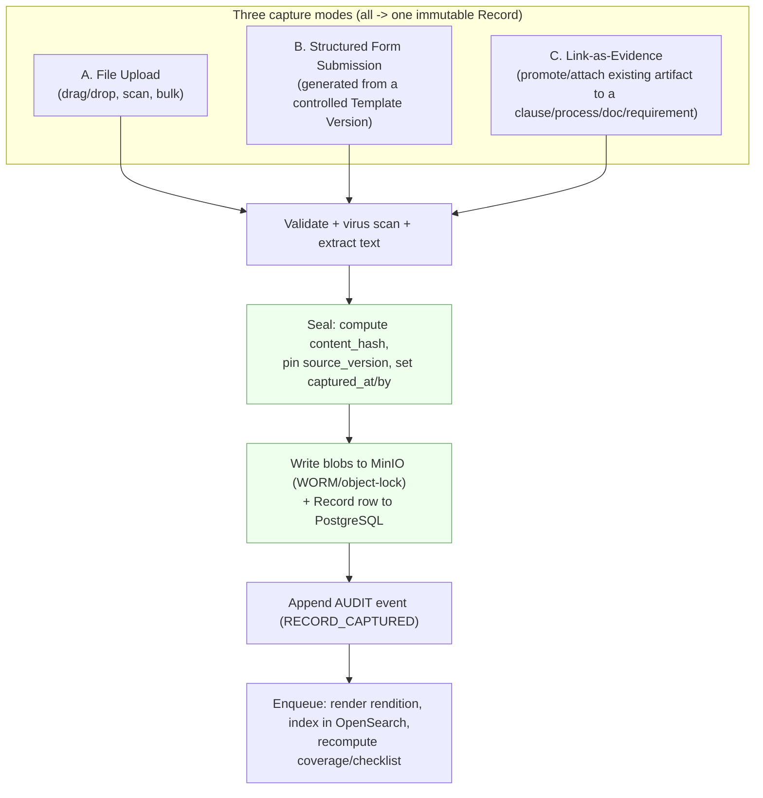
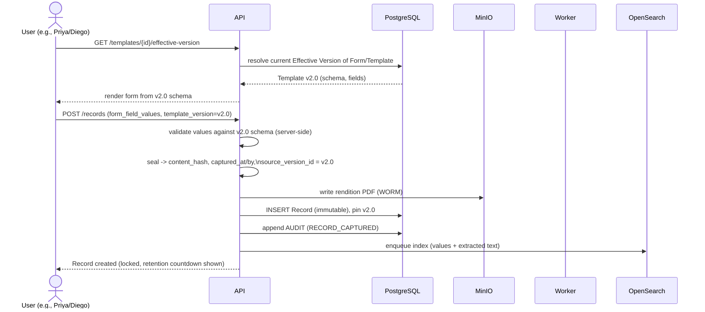
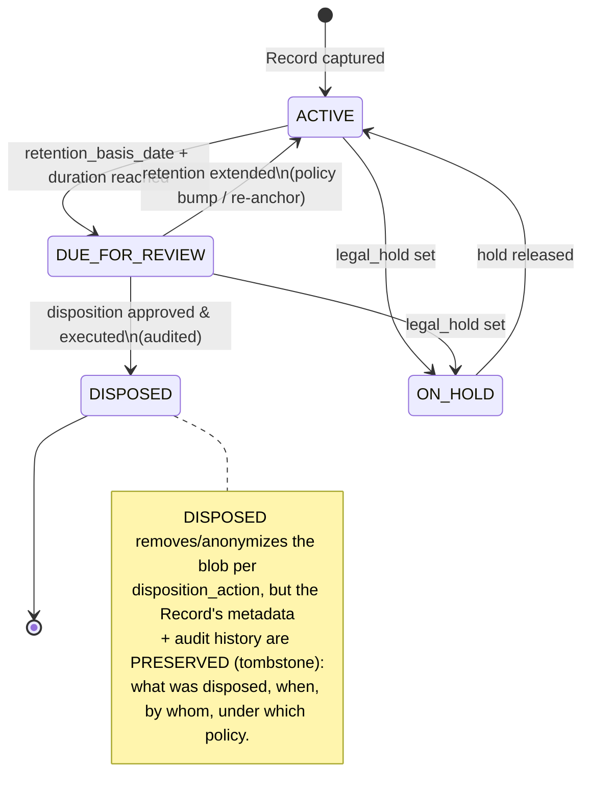
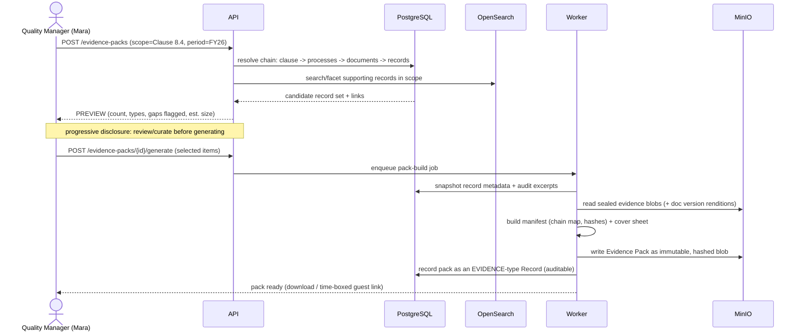

# Records & Evidence Management

This section specifies how EasySynQ captures, protects, retains, and surfaces **Records / Documented Evidence** — the *retained* half of ISO 9001:2015 Clause 7.5, the "proof we did it" that stands in hard contrast to the *maintained* Documents covered by the lifecycle engine. Records are **immutable, captured-at-a-point-in-time, never revised**: corrections create a new record via a `correction_of` chain, every record pins the exact Document **Version** it was produced under, and every record carries a **Retention** period and a controlled **Disposition** lifecycle. The whole module exists to make one auditor question answerable in seconds rather than days: *"show me the evidence that this requirement, in this process, governed by this document, was actually met."* EasySynQ answers that by walking a single, fully-linked traceability chain — **requirement → process → document → record → evidence (blob)** — and by letting any user assemble and export a clause-, process-, or finding-scoped **Evidence Pack** on demand. This document inherits the canonical taxonomy, the maintain/retain rule, the persona names, the lifecycle state machine, and the architecture invariants from the Vision & Scope, Domain Model, and Architecture sections verbatim; it does not re-derive them.

---

## 1. Scope, Terms & Position in the Model

### 1.1 What this section covers (and what it deliberately does not)

| In scope | Deferred (and to where) |
|---|---|
| Record types and their concrete fields/behavior | Document lifecycle engine (Domain Model §4; Architecture §6) |
| Evidence capture: upload, structured form submission, link-as-evidence | Permission catalog / ABAC attributes (Permissions section) |
| Immutability, integrity, and the `correction_of` chain | Full ERD (Data Model section) |
| Retention schedules + disposition lifecycle | Part 11 e-signature detail (extension hook only here) |
| The end-to-end traceability chain for audits | Import mechanics for legacy records (Import section; UJ-2) |
| Evidence Pack assembly + export (UJ-7) | Clause-aligned navigation/IA (Domain Model §5) |

### 1.2 Terminology (inherited verbatim; do not introduce synonyms)

| Term | Meaning in EasySynQ | Source |
|---|---|---|
| **Record / Documented Evidence** | Documented information that is **retained** as proof an activity happened — captured at a point in time, immutable, never revised. `DocumentedInformation.kind = RECORD`. | Domain Model §4, Cl 7.5 |
| **Document (maintained)** | "What we say we do" — versioned, approval-driven, drift-prone. `kind = DOCUMENT`. The thing a Record proves was followed. | Domain Model §4 |
| **Form / Template** | A *maintained Document* (`FormTemplate`) carrying a field `Schema`. When filled, it **instantiates** a Record. | Domain Model §4.2, §6.1 |
| **Version (Revision)** | An immutable snapshot of a Document (e.g., Rev C). Every Record **pins** the exact Version it was produced under. | Architecture §1 |
| **Blob** | An immutable, content-addressed (SHA-256) file binary in MinIO. The literal evidence artifact a Record points at. | Architecture §1 |
| **Controlled Vault** | PostgreSQL + MinIO; the single source of truth. Records live here, never on the filesystem mirror. | Architecture §1 |
| **Retention** | The defined period a Record must be kept before disposition is permitted. | Cl 7.5.3 |
| **Disposition** | The controlled end-of-life action for a Record after retention (retain-permanent, destroy, archive, transfer) — itself an audited event. | Cl 7.5.3 |
| **Audit Trail** | Append-only, tamper-evident, partitioned event log in PostgreSQL. | Architecture §8.3 |
| **Evidence Pack** | A clause-/process-/finding-scoped, immutable, exportable bundle of records + their evidence + a traceability manifest. | Vision & Scope |
| **CAPA** | EasySynQ's unified (non-ISO) container: NC + correction + root cause + corrective action + verification. Modeled as a Record. | Domain Model §1.1 |
| **correction_of** | The link from a new Record to the prior Record it corrects/supersedes-as-evidence. Records are never edited in place. | Domain Model §4.2 |

> **Assumption R1.** Records inherit the universal control fields of `DocumentedInformation` (`id`, `identifier`, `kind`, `requirement_source`, `clause_map[]`, `process_links[]`, `pdca_phase`, `owner`/`org_role`, `framework_id`, `audit_trail`) — see Domain Model §6.2. This section specifies only the **Record-specific** additive fields.

> **Assumption R2.** Records are predominantly **CHECK** and **ACT** evidence (audits, KPIs, management review, CAPA) plus **DO** operational evidence (releases, calibration, training), and so are surfaced under those PDCA banners; but `pdca_phase` is per-artifact, not assumed from kind.

> **Assumption R3.** A Record's binaries are written to MinIO under **object-lock / WORM** with a retention hold equal to (or exceeding) the Record's retention period (Architecture §8.2). This makes immutability a storage-layer guarantee, not merely an application convention.

### 1.3 The maintain/retain contract, restated as enforceable invariants

These are the non-negotiable behavioral rules this module enforces (derived from Domain Model §4.2):

1. **No edit.** A Record has **no edit endpoint and no edit button.** The only mutations permitted post-capture are (a) appending links/tags as *new audited annotations* that never alter captured content, and (b) advancing the **disposition** state.
2. **Pin the source (for controlled-document-derived records).** Every Record **produced under a controlled document** persists `source_document_id` **and** `source_version_id` — the exact Version effective when the Record was captured (not "current"). This survives later supersession of the document. Ad-hoc `EVIDENCE` captured without a governing controlled document has no Version to pin, so `source_version_id` (and `source_document_id`) may be **null** for such records; the invariant binds only records derived from a controlled document (reconciled per Decisions Register R21).
3. **Correct, don't change.** A wrong Record is fixed by capturing a **new** Record linked `correction_of → old`. The old Record is flagged `superseded_by_correction` but remains retrievable forever (audit integrity).
4. **Capture, then immutable.** Once `captured_at` is set and blobs are sealed, the content hash is frozen and verified on a schedule (Architecture §8.2 integrity job).
5. **Retain, then dispose — never silently delete.** Disposition follows the assigned `RetentionPolicy` and writes an audit event; pre-retention destruction is blocked by WORM and by policy.

---

## 2. Record Types Catalog

All record types are concrete leaves of `Record (RETAINED)` in the canonical taxonomy (Domain Model §6). The table below is the **build-ready catalog**: each row fixes the clause anchor, the typical source template (the Document a Record proves was followed), the capture mode, the default retention basis, and the type-specific fields layered on top of the universal control fields.

| Record type (`record_type`) | Primary clause(s) | Typical source Document | Capture mode | Default retention basis | Type-specific fields |
|---|---|---|---|---|---|
| **Filled Form / Record instance** | varies | the Form/Template it instantiates | Structured form (§4.2) or upload | inherits template's retention class | `form_field_values{}` (schema-validated), `source_version_id` |
| **Audit Report** (`AUDIT`) | 9.2 | Audit Program (M), audit checklist template | Structured + attachments | program retention (e.g., 3 audit cycles) | `audit_id`, `scope[]` (clauses/processes), `lead_auditor`, `dates`, `result_summary` |
| **Audit Finding** (`AUDIT_FINDING`) | 9.2 | — (child of Audit) | Structured | tied to parent audit | `finding_type` = `NC`\|`OBSERVATION`\|`OFI`, `severity`, `clause_ref`, `process_ref`, `auto_capa_id?` |
| **Nonconformity / CAPA** (`CAPA`) | 8.7, 10.2 | NCR/CAPA template | Structured (multi-stage) | longer of {legal, 3 yr post-close} | `nc_description`, `correction`, `rca` (method + result), `corrective_action[]`, `verification` (effectiveness evidence), `close_state` |
| **Training / Competence Record** (`COMPETENCE`) | 7.2, 7.3 | training matrix / awareness ack template | Upload (certs) + structured + bulk | duration of employment + N yr | `person_id`, `competence_item`, `evidence_type` (education\|training\|experience), `awareness_ack?`, `expiry?` |
| **Calibration / Maintenance Record** (`CALIBRATION`) | 7.1.5.1, 7.1.5.2 | calibration procedure / cert template | Upload (cert) + structured | equipment life + N yr | `measuring_resource_id`, `cal_date`, `next_due`, `standard_traceability`, `result` (pass/adjusted/fail), `cert_blob` |
| **Management Review Minutes** (`MGMT_REVIEW`) | 9.3 | MR agenda template | Structured + attachments | permanent (recommended) | `review_date`, `inputs[]` (links to KPIs/audits/CAPAs), `outputs[]` (decisions/actions), `attendees[]` |
| **Supplier Evaluation** (`SUPPLIER_EVAL`) | 8.4 | supplier eval template | Structured + upload | supplier-active + N yr | `supplier_id`, `eval_type` (initial\|re-eval), `score`, `criteria_results{}`, `re_eval_due` |
| **Release Record** (`RELEASE`) | 8.6 | release/acceptance template | Structured + upload | product liability period | `release_authority` (person/org_role), `acceptance_criteria_met`, `batch/lot_ref`, `linked_inspection_records[]` |
| **KPI / Metric Reading** (`KPI_READING`) | 9.1.1 | KPI definition (objective) | Structured / integration ingest | rolling N yr or per objective | `objective_id`, `period`, `value`, `target_at_capture`, `unit`, `source` |
| **Customer Satisfaction** (`SATISFACTION`) | 9.1.2 | survey template | Structured + upload | rolling N yr | `survey_ref`, `period`, `score`, `respondents` |
| **Identification & Traceability** (`TRACEABILITY`) | 8.5.2 | traceability procedure | Structured / ingest | product life + N yr | `item_id`, `lot/serial`, `genealogy_links[]` |
| **Customer/Provider Property Event** (`PROPERTY_EVENT`) | 8.5.3 | custody template | Structured + upload | contract + N yr | `party_id`, `event` (received\|lost\|damaged\|returned), `notification_ref?` |
| **Change Record** (`CHANGE`) | 6.3, 8.5.6 | change template | Structured | tied to affected artifact | `change_scope`, `rationale`, `resources`, `responsibilities`, `verification` |
| **Customer Complaint** (`COMPLAINT`) | 8.2.1, 9.1.2, 10.2 | complaint intake template | Structured + upload | per assigned policy (typically rolling N yr) | `customer`, `received_at`, `channel`, `description`, `severity` — can one-click spawn an NCR/CAPA with `source=complaint` (reconciled per Decisions Register R16) |
| **Generic Evidence** (`EVIDENCE`) | any | none (ad-hoc) | Upload + link | per assigned policy | minimal; exists to attach arbitrary proof and link it into the chain |

**Design notes:**

- **`AUDIT_FINDING` of `finding_type = NC` auto-creates a linked `CAPA`** (Domain Model §2 note on 9.2). The link is bidirectional: `AuditFinding.auto_capa_id` ⇄ `CAPA.origin_finding_id`. This closes the Check→Act loop as a system behavior, not a manual step (UJ-5 → UJ-6).
- **`COMPLAINT` (`record_type=COMPLAINT`) is a lightweight customer-complaint intake** carrying `customer`, `received_at`, `channel`, `description`, and `severity`. A complaint can **one-click spawn an NCR/CAPA** with `source=complaint`, closing the Check→Act loop from external feedback into corrective action (ISO 9001 8.2.1 / 10.2). This reconciles the dangling `source=complaint` reference (reconciled per Decisions Register R16).
- **`CALIBRATION` with `result=fail` triggers an impact loop.** When a calibration / measuring-resource record is captured with `result=fail`, EasySynQ raises an **impact-assessment task and a candidate NCR** over the records and releases that depended on that instrument (ISO 9001 7.1.5.2), so a drifted instrument cannot silently invalidate downstream measurements (reconciled per Decisions Register R19).
- **CAPA is the only multi-stage Record.** Its *content* accretes over a workflow (NC raised → correction → RCA → CA → verification → closed), yet it remains a single immutable Record at the **stage-transition** granularity: each stage transition appends a sealed, timestamped, attributed stage-block and an audit event. Earlier stage-blocks are never rewritten. (This preserves "records are not edited" while modeling a process record; it is also the natural place a future Part 11 `SignatureEvent` attaches per stage.)
- **`KPI_READING` and `TRACEABILITY`** are the high-volume types and may arrive via an authenticated ingest API (machine source), but each ingested reading is still a first-class immutable Record with a captured-at and a source attribution.
- The **`record_type`** discriminator drives the capture form, the default retention class, and the icon/affordances; new types are additive (a new enum value + form schema), never structural — consistent with the extensibility rule.

---

## 3. The Record Data Shape (Record-specific fields)

Layered on the universal `DocumentedInformation` fields. Shown as the conceptual shape, not the full ERD.

| Field | Type | Purpose / rule |
|---|---|---|
| `record_type` | enum | Discriminator (see §2). |
| `captured_at` | timestamptz | The point-in-time the evidence is fixed. Immutable once set. |
| `captured_by` | user ref | Who captured it (attribution; future signature subject). |
| `immutable` | bool = true | Always true post-capture; enforced in API + WORM. |
| `content_hash` | sha-256 | Hash over the canonical serialization of structured content **and** the manifest of attached blob digests. Frozen at capture; re-verified on schedule. |
| `source_document_id` | doc ref \| null | The Document this Record proves was followed (null only for `EVIDENCE`/ad-hoc). |
| `source_version_id` | version ref \| null | **The exact pinned Version** — survives later supersession. **Nullable**: required for records produced under a controlled document; null for ad-hoc `EVIDENCE` with no source document (reconciled per Decisions Register R21). |
| `form_field_values` | jsonb \| null | For structured submissions: schema-validated values, validated against the pinned template Version's `Schema`. |
| `evidence_blobs[]` | blob refs | Content-addressed attachments (uploaded files, generated PDF renditions). |
| `clause_map[]` | M:N | (universal) Drives clause-scoped Evidence Packs + Compliance Checklist. |
| `process_links[]` | M:N | (universal) Drives process-scoped Evidence Packs + Process Map lens. |
| `requirement_links[]` | M:N | Optional finer-grained link to a specific requirement/sub-clause node (enables requirement-level traceability, §6). |
| `correction_of` | record ref \| null | Points to the prior Record this one corrects. |
| `superseded_by_correction` | record ref \| null | Inverse of above; set on the old Record. |
| `retention_policy_id` | policy ref | The applied retention schedule (§5). |
| `retention_basis_date` | date | The date retention is computed *from* (e.g., `captured_at`, employment-end, product-EOL). |
| `disposition_state` | enum | `ACTIVE → DUE_FOR_REVIEW → ON_HOLD → DISPOSED` (§5.3). |
| `legal_hold` | bool | When true, blocks disposition regardless of retention expiry. |
| `signature_events[]` | M:1→event | **Reserved (not built):** append-only `signature_event` rows; today empty for records, captures the future Part 11 e-sign. |

---

## 4. Capturing Evidence

EasySynQ supports exactly **three capture modes**, and every Record is created by one of them. All three converge on the same immutable Record + WORM blob outcome; they differ only in how content originates.



### 4.1 Mode A — File Upload

Used for externally-produced evidence: signed PDFs, calibration certificates, scanned sign-off sheets, supplier-issued documents, photos.

- **Single, drag-drop, scanner, and bulk** upload supported. Bulk upload pairs files with a CSV/sidecar of metadata (record_type, clause/process links, retention class) for migrations and batch capture (supports UJ-2 import of legacy records).
- On receipt: size/type guard, malware scan (worker), text extraction for search, optional Office→PDF normalization rendition (Gotenberg) so every record has a previewable PDF (Architecture §6.1 pipeline reused).
- The uploaded bytes are the **canonical blob** (content-addressed); any generated PDF is an *additional* rendition, never a replacement — the original is never mutated.

### 4.2 Mode B — Structured Form Submission (from a controlled Template)

This is the **drift-killing capture path** and the mechanism behind the template→record relationship (Domain Model §4.2).



Rules specific to Mode B:

- The form is **always rendered from the Effective Version** of the template at the moment of capture; the resolved `source_version_id` is pinned into the Record. If the template is later revised to v3.0, **already-captured records keep showing v2.0** — the auditor sees exactly which edition of the form was in force.
- Field values are **validated server-side against that pinned Version's `Schema`** (types, required, ranges, enumerations). A form cannot be submitted against a schema the system can't resolve.
- A captured structured Record renders both as a **read-only structured view** (the fielded data) and as a **sealed PDF rendition** (for export/print), the latter being a generated `evidence_blob`.
- If the template is in `Draft`/`In Review` (not Effective), capture is **blocked** unless the org has explicitly enabled "capture against pre-release templates" for a controlled migration — otherwise records could be produced under an unapproved form (a drift/compliance hole).

### 4.3 Mode C — Link-as-Evidence

The "promote what already exists into the chain" path. A user designates an existing artifact (an uploaded file already in the vault, a Record produced elsewhere, a released Document acting as evidence of its own existence, or a KPI reading) as **evidence for** a specific clause, process, document, requirement, audit finding, or CAPA stage.

- Linking **never copies** the artifact — it creates an M:N edge (`requirement_links` / `clause_map` / `process_links` / a typed `evidence_for` edge to a Finding/CAPA). No data duplication (consistent with "three lenses, one QMS").
- Each link creation is an **audited annotation** (who linked what to what, when, why) — it does not mutate the linked Record's sealed content.
- This is how a single calibration certificate can simultaneously be evidence for Clause 7.1.5.2, the "Inspection" process, the calibration procedure it followed, and a specific audit finding — without ever being duplicated.

### 4.4 What every captured Record gets, regardless of mode

| Guarantee | How |
|---|---|
| Immutable content | `content_hash` sealed at capture; WORM object-lock on blobs |
| Provenance | `captured_by`, `captured_at`, and (where applicable) pinned `source_version_id` |
| Searchability | OpenSearch index of structured values + extracted text + metadata (rebuildable) |
| Traceability | clause / process / document / requirement links (the chain, §6) |
| Lifecycle clock | a `RetentionPolicy` + `retention_basis_date` + initial `disposition_state = ACTIVE` |
| Audit | an append-only `RECORD_CAPTURED` event with full context |

---

## 5. Retention & Disposition

### 5.1 Retention schedules (policy as data)

Retention is modeled as reusable **Retention Policies** (configured by Mara, the Quality Manager, governed by Avery's storage/backup setup) assignable per record type, per clause, per process, or per-record override. Modeling it as data — not code — keeps multi-standard and jurisdiction-specific retention additive (extensibility rule).

| Policy field | Meaning / example |
|---|---|
| `policy_id`, `name` | e.g., "Training records — employment + 3y" |
| `applies_to` | default mapping (record_type / clause / process) the policy auto-attaches to |
| `basis` | what `retention_basis_date` is anchored to: `captured_at` \| `event:employment_end` \| `event:product_eol` \| `event:contract_end` \| `event:capa_closed` |
| `duration` | ISO-8601 period (e.g., `P3Y`, `P10Y`) or `PERMANENT` |
| `disposition_action` | `DESTROY` \| `ARCHIVE_COLD` \| `TRANSFER` \| `RETAIN_PERMANENT` |
| `review_required` | bool — if true, disposition needs explicit human approval (default for high-risk types) |
| `worm_lock_period` | the MinIO object-lock retention applied to blobs (≥ `duration`) |

**Resolution precedence** (most specific wins): per-record override → process policy → clause policy → record-type default → system default. The resolved policy is **snapshotted onto the Record at capture** (`retention_policy_id`) so later policy edits do not retroactively shorten an existing record's retention (a one-way ratchet that protects against accidental early disposal). A policy *extension* can be applied forward; a *reduction* never applies to already-captured records.

### 5.2 Why retention is a one-way ratchet

Shortening retention on already-captured evidence is a compliance and legal hazard. EasySynQ therefore:
- snapshots the policy at capture,
- backs immutability with WORM `worm_lock_period`,
- and requires that any `legal_hold = true` **overrides expiry** entirely (records cannot be disposed while on hold, even past retention).

### 5.3 Disposition lifecycle



- **Celery Beat** runs a periodic **retention sweep** (Architecture §5.1 `beat`) that flips eligible records `ACTIVE → DUE_FOR_REVIEW` and notifies the owning `org_role`.
- **Disposition is never automatic for `review_required` policies** — a human (typically Mara) approves under the `record.dispose` permission (reconciled per Decisions Register R5; the canonical permission is `record.dispose`, **not** `record.retire`); the action and approver are written to the audit trail. For low-risk auto-dispose policies, the sweep can execute `DESTROY`/`ARCHIVE_COLD` directly, still fully audited.
- **`DISPOSED` is a tombstone, not a delete of history.** The evidence blob is removed/anonymized per `disposition_action`, but the Record row, its links, its hash, and its full audit history persist — so an auditor can always see *that* a record existed and *that it was disposed lawfully*, even when the content itself is gone. This is essential: "we destroyed it on schedule" is itself auditable evidence.
- **WORM interplay:** the MinIO object-lock period must be expired (and no legal hold present) before a `DESTROY` can physically remove a blob; the application will not attempt destruction before the storage layer permits it.

> **Implementation note (slice S-rec-2).** `retention_until = retention_basis_date + duration`; a `PERMANENT` duration (paired with `disposition_action=RETAIN_PERMANENT`) or an unset (`event:*`) basis date yields no expiry and is **never auto-swept**. The DESTROY path is **fail-closed, purge-first**: the WORM bytes are physically removed *before* the record flips to `DISPOSED` and the tombstone is written, and only on success — a storage failure rolls back (the purge is idempotent, so the next sweep self-heals), so there is never a tombstone over still-present bytes nor deleted bytes without a tombstone. `place_legal_hold`/`release_legal_hold` require a `reason` (audit trail); a release returns the record to `ACTIVE` (the next sweep re-evaluates expiry). The sweep emits `RECORD_DISPOSITION_DUE` as the v1 **"notify the owning `org_role`" surrogate** until the doc-10 notification engine lands. A `DISPOSED` record's `content_hash` survives as the tombstone — the immutable audit trail (not a re-hash of absent bytes) is the post-disposal verification.

### 5.4 NCR disposition states (ISO 9001 8.7)

The disposition lifecycle in §5.3 governs *retention end-of-life* for any Record. **Nonconforming-output disposition** is a distinct, content-level concept on the `ncr` entity: it records *what was decided about the nonconforming product/service*, not when the record is destroyed. The `disposition` field on `ncr` is a closed enum, accompanied by `disposition_authorized_by` capturing who authorized the decision (reconciled per Decisions Register R20):

| `disposition` value | Meaning |
|---|---|
| `use_as_is` | accept the nonconforming output without change |
| `rework` | bring back into conformity by re-doing work |
| `scrap` | discard the nonconforming output |
| `return` | return to supplier / originator |
| `concession` | accept under a documented concession/waiver |
| `regrade` | reclassify to a different grade/use |

### 5.5 Legal posture: PII retention, WORM, and GDPR erasure

A genuine tension exists between **WORM/object-lock immutability** (which guarantees evidence cannot be silently deleted) and **GDPR-style erasure rights** over records whose *content is PII* and whose retention may exceed the data subject's employment or relationship. EasySynQ documents its posture explicitly rather than leaving it implicit (reconciled per Decisions Register R27):

- Records whose **content is PII** and whose **retention exceeds employment/relationship** **remain under object-lock for their retention period** — WORM and any active `legal_hold` win over an erasure request, and an erasure request that conflicts with a preservation obligation is **logged as refused-with-reason** rather than silently honored or silently ignored.
- For the legitimate cases where a WORM blob genuinely must be destroyed before its lock expires — a mis-import, or a binding erasure/legal order — there is a **tightly-controlled, dual-control (two-person), fully-audited destroy-under-legal-order escape hatch**. Both authorizing actors are recorded, the legal basis is captured, and the destruction itself is written to the audit trail; the Record's tombstone (metadata + history) is preserved exactly as in §5.3. No single actor can ever destroy a WORM-locked or legal-held record, and no such destruction is ever unaudited.

---

## 6. The Traceability Chain (the audit backbone)

The single most important capability of this module: for any requirement, prove the full chain down to the literal evidence — and traverse it in either direction.

### 6.1 The canonical chain

```mermaid
flowchart LR
    REQ["REQUIREMENT\n(Clause node, e.g. 8.4\nControl of external providers)\nseeded read-only catalog"]
    PROC["PROCESS\n(e.g. 'Purchasing')\nClause 4.4 graph node, has owner"]
    DOC["DOCUMENT (maintained)\n(e.g. SOP-PUR-002 'Supplier Approval')\nEffective Version v2.0"]
    REC["RECORD (retained)\n(e.g. Supplier Evaluation,\ncaptured 2026-03-12, pins SOP-PUR-002 v2.0)"]
    EV["EVIDENCE (blob)\n(signed eval PDF + attached cert,\nSHA-256, WORM-locked)"]

    REQ -->|clause_map M:N| PROC
    PROC -->|process_links M:N| DOC
    DOC -->|instantiates / governs| REC
    REC -->|source_version_id pins| DOC
    REC -->|evidence_blobs| EV
    REQ -. "requirement_links (direct)" .-> REC

    classDoc fill:#eef
    classRec fill:#efe
```

Each edge in the chain is a **first-class, audited M:N link** in PostgreSQL, never a copy:

| Edge | Mechanism | Guarantees |
|---|---|---|
| Requirement → Process | `Process.clause_map[]` | every process declares which clauses it satisfies |
| Process → Document | `Document.process_links[]` | every controlled doc declares the processes it serves |
| Document → Record | template `instantiates` Record + `source_version_id` | which *edition* of the doc the record was produced under |
| Requirement → Record (direct) | `Record.requirement_links[]` / `clause_map[]` | record can answer a clause even with no intervening doc |
| Record → Evidence | `Record.evidence_blobs[]` (content-addressed) | the literal, integrity-verified proof |

### 6.2 Bidirectional traversal (the two questions auditors actually ask)

- **Top-down (coverage / "do we have evidence?"):** start at a Clause node → list mapped Processes → their governing Documents → the Records those Documents instantiate (and directly-linked Records) → the evidence blobs. Gaps (a mandatory ★ clause with no current evidence) surface in the **Compliance Checklist** (Domain Model §2.1).
- **Bottom-up (provenance / "what does this prove and under what rules?"):** start at an evidence blob → its Record → the pinned Document Version → the Process → the Clause(s). Answers "this calibration cert — which procedure version governed it, which process, which requirement?"

### 6.3 Integrity of the chain over time

- Because Records **pin `source_version_id`**, superseding a Document to a new Version **does not orphan or relabel** historical records — the chain remains historically accurate ("this record was produced under v2.0, even though v3.0 is now Effective").
- Because evidence is **content-addressed and WORM-locked** and re-hashed on schedule (Architecture §8.2), a tampered or bit-rotted blob raises an audit alarm rather than silently corrupting the chain.
- Because every link is itself **audited**, the chain's *construction history* (who linked what, when) is replayable — supporting "100% audit-trail completeness" (Success metric M from Vision & Scope).

---

## 7. Evidence Packs (UJ-7)

An **Evidence Pack** is an on-demand, scope-limited, immutable bundle that assembles every record + its evidence + a traceability manifest for a given **Clause**, **Process**, or **Finding/CAPA**, then exports it for an external auditor (Olsen) or for internal review. Target: assemble in **< 30 minutes** and ideally seconds (Success metric M1).

### 7.1 Scoping a pack

| Scope kind | Selects | Typical user / journey |
|---|---|---|
| **Clause scope** | all records mapped (directly or via process→document) to a clause/sub-clause set, optionally date-bounded | certification audit prep; the ★ mandatory set |
| **Process scope** | all records linked to one or more processes (uses Process Map lens) | process audit; "show me everything for Purchasing this year" |
| **Finding / CAPA scope** | the finding/CAPA + its origin record(s) + evidence + the documents in force + the closure verification evidence | UJ-5/UJ-6 follow-up; "prove this NC was closed effectively" |
| **Date / period filter** | overlays any scope (e.g., audit window 2025-06-01 → 2026-05-31) | bounding a surveillance audit |

### 7.2 Assembly flow



### 7.3 What a generated pack contains

1. **Cover sheet** — scope, generated-by, generated-at, organization, framework, period, and the pack's own SHA-256.
2. **Traceability manifest** — the requirement→process→document→record→evidence map (the §6 chain) for every included item, machine-readable (JSON) **and** human-readable (PDF index).
3. **The records themselves** — structured records as sealed PDF renditions; uploaded evidence in original form; each item stamped with its `captured_at`, `captured_by`, `source_version_id`, `content_hash`, and retention status.
4. **The governing Document Versions** — the *exact pinned versions* (not current), so the auditor sees the edition in force at capture time.
5. **Audit-trail excerpts** — the relevant `RECORD_CAPTURED`, link, and disposition events for included items.
6. **Gap report** — any in-scope mandatory ★ requirement lacking current evidence is explicitly listed (calm honesty beats a silent hole; lets Mara remediate before the auditor finds it).
7. **Exclusion report** — a list, **distinct from the gap report**, of every in-scope item that was *excluded from the pack* together with the **reason** for each exclusion, classified as **permission** (the generator was not entitled to see the item) vs. **genuine absence** (a missing/unavailable blob). The gap report answers "what evidence is missing"; the exclusion report answers "what existed but was left out, and why" (reconciled per Decisions Register R28).

### 7.4 Pack properties

- **Immutable & self-verifying.** The pack is itself written as a content-addressed, hashed blob and registered as an `EVIDENCE`-type Record — so "which pack did we hand the auditor on 2026-05-31?" is itself auditable, and the auditor can re-verify item hashes against the manifest.
- **Scope-limited by construction, but never *silently* so.** The pack only ever contains items the requesting user is permitted to see; generation runs through the same deny-by-default RBAC+ABAC engine (Architecture §8.3). When an over-broad scope causes items to be left out, the generator (e.g., Mara) is **warned prominently** during the preview/generate flow — never left to assume the pack is complete — and the pack records **which items were excluded and why** (permission vs. genuine absence) in the exclusion report (§7.3 item 7), distinct from the compliance gap report. A pack that drops evidence without surfacing it is treated as a defect (reconciled per Decisions Register R28).
- **Export formats.** Primary: a single ZIP (PDF cover + index + per-item files + `manifest.json`). Optional: a flat PDF portfolio for printing. No proprietary format; everything an external auditor needs opens with a browser/PDF reader.
- **Delivery to external auditors.** Olsen receives a **time-boxed, read-only guest link** (Vision & Scope: Time-boxed Guest Access) or a downloaded archive — never standing access to the live vault. The pack is a frozen snapshot; revoking the link does not affect it.
- **Rebuildable, not backup-critical.** A pack is derivable from PG+MinIO (the source records persist), but because handing a *specific* artifact to an auditor is itself a controlled act, the generated pack blob is retained per its own retention policy as an audit artifact.

> **Implementation status (as built).** **S-pack-1** (PR #48, migration `0025`) shipped the build/seal half: scope resolution (CLAUSE/PROCESS + date overlay; Finding/CAPA deferred — those entities don't exist yet), the synchronous preview, the R28 INCLUDED/EXCLUDED_PERMISSION/EXCLUDED_ABSENCE classification + the gap report, the worker build that seals the ZIP into the WORM `records` bucket as a `RETAIN_PERMANENT` EVIDENCE Record, and the immutable `/evidence-packs` API (data model: `14 §5.7`; endpoints: `15 §8.15a`). The pack is sealed over its **content list** with a domain-separated `pack_content_hash` (the cover's "own SHA-256"); the ZIP file's own digest is the addressable artifact. **Deferred to S-pack-2:** the time-boxed external-auditor **guest link** (the `guest_grant` table + the `scope.evidence_pack_id` ABAC bound stay unbuilt), the **PDF cover/portfolio** export-format variants + live §11.3 stamping (S-pack-1's cover/manifest/reports are text+JSON; pinned versions ride their cached rendition else source bytes — no renderer dependency), and Finding/CAPA scope.

### 7.5 Whole-vault portable export (distinct from Evidence Packs)

An Evidence Pack is **scope-limited** — it answers a specific clause-, process-, or finding-scoped audit question. It is **not** the mechanism for getting *everything* out of EasySynQ. For tenant **migration or decommission**, EasySynQ also provides a separate **portable, whole-QMS export** capability: documents + records + audit trail emitted in **open formats** (a documented JSON metadata schema alongside the original blobs), so an organization can take its entire controlled vault elsewhere (reconciled per Decisions Register R33).

This whole-vault export is deliberately distinct from both Evidence Packs (scoped, auditor-facing, immutable snapshot) and from backup/restore (operational disaster recovery). It is roadmapped for v1.x with a stubbed export endpoint; the full specification lives in the API and roadmap sections.

---

## 8. How Records Feel Different in the UI (the maintain/retain teaching)

Reaffirming Domain Model §4.3 — the UI must make a Record *visibly* not-a-Document so users internalize the distinction:

| Affordance | Document (maintained) | Record (retained) |
|---|---|---|
| Primary visual | version timeline + **Effective** badge | **lock icon** + **retention countdown** |
| Edit control | Check-out / Check-in (with mandatory Change Reason) | **none** — no edit button exists |
| State chip | Draft / In Review / Approved / Released / Obsolete | Captured · `disposition_state` (Active / Due for review / On hold / Disposed) |
| Source link | n/a | "**View source document version**" → pinned Version (read-only) |
| Correction | revise → new Version | "Capture correction" → new Record (`correction_of`) |
| Header (shared) | identifier · kind · clause map · process(es) · owner · cross-lens switcher | identical header (cross-lens consistency rule, Domain Model §5.4) |

Progressive disclosure holds throughout: a Record's landing view shows the lock, the retention countdown, and the structured summary; the full field detail, the pinned source Version, the evidence blobs, and the audit trail are each one click deeper — never dumped on the surface.

---

## 9. Extensibility Hooks Touched Here (reserved, not built)

| Future need | Reserved hook in this module |
|---|---|
| **21 CFR Part 11 e-signatures** | Records already immutable + `correction_of` chain; `signature_events[]` attaches to capture and to each CAPA stage transition (signer, meaning, intent, re-auth method) with no schema rewrite. |
| **Multi-standard (13485/14001/45001/IATF)** | `framework_id` on every Record + M:N `clause_map`/`requirement_links` let one record satisfy clauses across standards; Retention Policies are data, so jurisdiction/standard-specific schedules are additive. |
| **Per-record / per-regime retention** | `RetentionPolicy` resolution precedence + per-record override + `legal_hold` already model arbitrary regimes. |
| **External evidence ingestion** | `KPI_READING`/`TRACEABILITY` ingest path generalizes to authenticated machine sources; each ingested item is still an immutable, attributed Record. |

These cost nothing now and guarantee Records & Evidence is not painted into a corner.

---

## 10. Summary — Invariants This Module Guarantees

1. **Records are immutable evidence.** No edit path exists; content is sealed by `content_hash` and WORM-locked at capture; corrections are new records via `correction_of`.
2. **Every controlled-document-derived record pins its source.** For a record produced under a controlled document, `source_version_id` records the exact Document edition in force at capture, so the traceability chain stays historically true forever; ad-hoc `EVIDENCE` with no source document may have a null `source_version_id` (reconciled per Decisions Register R21).
3. **Three capture modes, one outcome.** Upload, structured form (from the Effective template version), and link-as-evidence all converge on an immutable Record + content-addressed blob + audit event.
4. **Retention is a one-way ratchet with controlled disposition.** Policy is data, snapshotted at capture, backed by WORM, never silently deleting; disposition leaves an auditable tombstone; legal hold overrides expiry.
5. **The chain is bidirectional and audited.** requirement → process → document → record → evidence traverses both ways, every edge a first-class audited link, no duplication.
6. **Evidence Packs assemble on demand.** Clause-, process-, or finding-scoped, permission-filtered, immutable, self-verifying, gap-honest, exportable as open formats, and deliverable to external auditors via time-boxed guest links — turning audit-pack assembly from days into minutes (M1).
