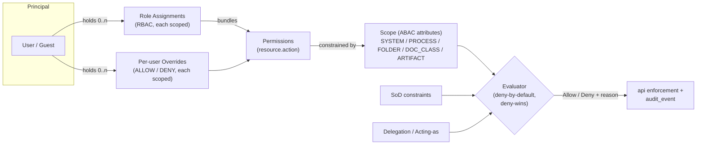
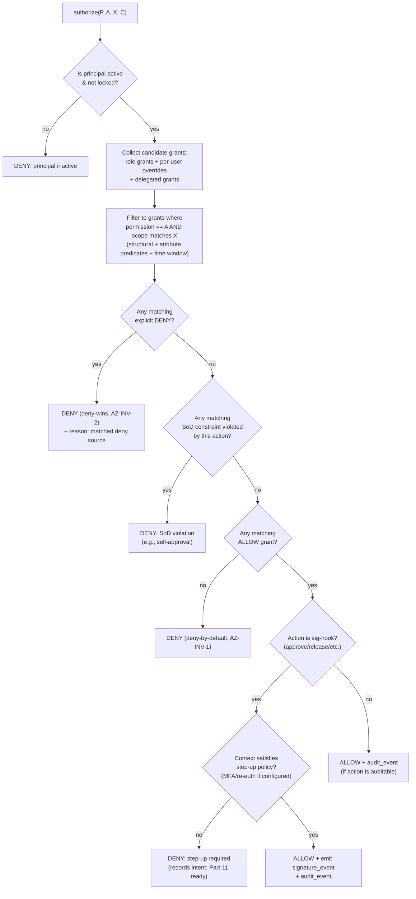
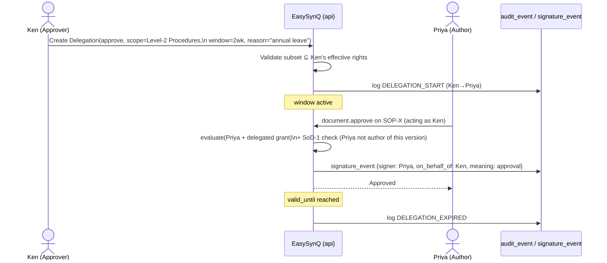
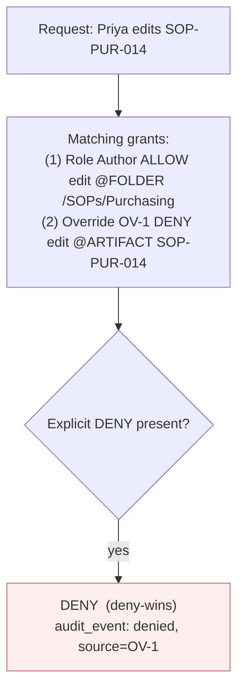

# Authorization Model — Hybrid RBAC + ABAC

EasySynQ enforces a **hybrid RBAC + ABAC** authorization model in which the atomic unit of access is the **Permission** (a `resource.action` capability), **Roles** are nothing more than convenient org-defined *bundles* of permissions (never a hard boundary), and every grant is **scoped** by attributes (system / process-area / folder / document-class / single artifact) and may be tuned by **direct per-user overrides**. Authorization is **deny-by-default**, evaluated **server-side in the `api` tier on every request** (never trusted from the client), and produces an append-only audit row for every permission change. This section defines the ADMIN super-role and its deliberate separation from quality-content authority; the complete permission catalog as `resource × action`; the role-bundle and per-user-override mechanics; the attribute-based scoping model; separation-of-duties (SoD) constraints; delegation / acting-on-behalf-of; the deterministic permission-evaluation/resolution order; and worked examples mapping the canonical personas (Avery, Mara, Diego, Priya, Ken, Ingrid, Sam, Olsen) to concrete grants — including a granular per-document override. It aligns verbatim to the locked terminology of the Vision & Scope, Domain Model, and Architecture sections, and reserves (without building) the hooks needed for 21 CFR Part 11 and multi-standard extension.

---

## 1. Concepts, Terms & Invariants

### 1.1 Vocabulary (inherited verbatim; do not rename)

| Term | Definition (operational) | Source doc |
|---|---|---|
| **Permission** | A fine-grained, atomic, assignable right expressed as `resource.action` (e.g., `document.approve`). The unit of access control. | Vision §8 |
| **Role** | An org-defined, convenient **bundle** of permissions. Convenient, **not binding** — a user's effective rights are computed from roles **plus** direct grants **minus** denials. | Vision §8 |
| **Scope** | The attribute-defined boundary to which a permission applies: `SYSTEM`, `PROCESS`, `FOLDER`, `DOC_CLASS`, or `ARTIFACT`. | Vision §8 |
| **Per-user Override** | A direct grant **or** denial assigned to one user, layered on top of (and able to override) their roles. | Vision §8 |
| **RBAC** | Role-Based Access Control — permissions delivered via role bundles. | Vision §8 |
| **ABAC** | Attribute-Based Access Control — grants constrained by attributes (process, doc-class, lifecycle state, scope window, etc.). | Vision §8 |
| **QMS role (`OrgRole`)** | An *organizational responsibility* (Clause 5.3) — RACI / accountability / who appears in records. **NOT a permission construct.** | Domain §3.4 |
| **Permission role** | A bundle of granular permissions (this document). **Never conflate with `OrgRole`.** | Domain §3.4 |
| **Principal** | Any authenticated identity an evaluation runs for: a User, or a Guest (time-boxed external account). | Architecture §8.3 |
| **Acting-as / Delegation** | A bounded, audited assumption of a delegator's authority by a delegate for a window. | This doc §8 |

> **Assumption AZ-1.** AuthN is handled entirely by Keycloak (OIDC Auth-Code + PKCE for the SPA; JWT validated via JWKS in the `api`). The JWT establishes *who* the principal is; **AuthZ — everything in this document — is computed by EasySynQ in the `api` tier**, not by Keycloak roles. We deliberately keep authorization data in PostgreSQL (not Keycloak) so it is scopable to artifacts, per-user-overridable, and captured in the same append-only audit table as everything else.

> **Assumption AZ-2.** Single org per install, but every authorization row carries `org_id` (Architecture invariant 5) so the model is multi-org-ready without rewrite.

> **Assumption AZ-3.** The `OrgRole ↔ Permission-role` link is a *suggestion only*. Naming a person "Process Owner of Purchasing" (a Clause 5.3 accountability) may *propose* a permission bundle at assignment time, but the two are independently editable thereafter (Domain §3.4).

### 1.2 Binding invariants (every downstream design must respect)

| # | Invariant |
|---|---|
| **AZ-INV-1** | **Deny-by-default.** Absence of an applicable allow = deny. |
| **AZ-INV-2** | **Explicit deny wins.** A matching DENY (from any source: role, override, SoD, scope-expiry) beats any ALLOW. |
| **AZ-INV-3** | **Server-side only.** The SPA hides what a user can't do for UX, but enforcement is 100% in the `api` tier; client claims are never trusted. |
| **AZ-INV-4** | **Permissions are atomic and assignable directly.** Nothing *requires* a role; a user may hold permissions entirely via direct grants. Roles are convenience, not a dependency. |
| **AZ-INV-5** | **Every authorization mutation is audited.** Grant, revoke, role edit, override, delegation start/stop, scope change → append-only `audit_event` (Architecture §8.3). |
| **AZ-INV-6** | **ADMIN ≠ quality authority.** System super-powers (`user.*`, `role.*`, `config.*`, `backup.*`) do **not** confer QMS content authority (`document.approve`, `document.release`, etc.) by default (Vision §6.2 Avery boundary note). |
| **AZ-INV-7** | **Approval is the signature hook.** Any permission gating an approval/release/sign action resolves to an append-only `signature_event` row, so Part 11 e-signature policy is additive (Architecture invariant 6). |
| **AZ-INV-8** | **Scope is narrowing, never widening.** A scoped grant can only *restrict* where a permission applies; it can never grant a permission the principal does not otherwise hold. |



---

## 2. The ADMIN Super-Role (Avery) — Outside the QMS

**Avery (System Admin)** is the canonical super-user who sits **outside** the QMS. ADMIN is a *reserved system role* (not a deletable org role) that bundles the full set of **system-administration** permissions but **explicitly excludes QMS content authority by default**.

### 2.1 What ADMIN holds vs. what it does not

| ADMIN holds (by default) | ADMIN does **NOT** hold (by default) |
|---|---|
| `user.*`, `role.*`, `permission.grant`/`revoke`, `delegation.administer` | `document.create` / `edit` / `submit` / `review` / `approve` / `release` / `obsolete` |
| `config.*`, `framework.read` (read-only; framework *content* config is a QMS act) | `record.create` / `dispose` (capturing/disposing evidence is a QMS act) (reconciled per Decisions Register R5) |
| `storage.*`, `backup.*`, `restore.*` | `audit.create` / `finding.create` (auditing is a QMS act) |
| `system.audit_log.read` (the *system* audit trail) | `ncr.*`, `capa.*` (quality work) |
| `guest.administer` (provision external/3rd-party guest accounts) | `report.evidence_pack.generate` (a QMS deliverable) |
| `import.execute` / `import.review` / `import.commit` (point the install at a QMS, scan/classify, review/correct, commit to vault) (reconciled per Decisions Register R5) | Approving/releasing the ingested documents |

> **Rationale (AZ-INV-6 / Vision §6.2).** Separating "who runs the system" from "who governs the QMS" is itself an ISO 9001 integrity control and a Part 11 prerequisite. Avery can *create* Mara and grant her QMS permissions, but cannot approve a procedure unless an authorized QMS principal explicitly grants Avery those QMS permissions (an intentionally awkward, fully-audited act that SoD will further constrain — see §7).

### 2.2 ADMIN guardrails

- **Break-glass, not silent self-grant.** ADMIN granting itself QMS-content permissions is permitted (the model never *hard-blocks* the super-user from system recovery) but is flagged as a `PRIVILEGE_ESCALATION` audit event, requires a mandatory reason, and surfaces on the QMS owner's (Mara's) review feed. This preserves recoverability without quietly eroding SoD.
- **ADMIN cannot delete the audit trail.** `audit.*` has no `delete` action anywhere in the catalog (§3) — the table is append-only by construction (Architecture §8.3).
- **At least one ADMIN must always exist.** The last `user.role.revoke` that would remove the final ADMIN is rejected by a system constraint.
- **First-run exception.** During the First-Run Setup Wizard (UJ-1), before any QMS principals exist, Avery operates with bootstrap ADMIN. The first QMS-owner (`Mara`) grant is the boundary after which ADMIN's QMS-content exclusion is enforced.

---

## 3. The Permission Catalog (`resource × action`)

Permissions are named `resource.action`. The catalog below is **complete for v1**. `resource.*` denotes "every action on that resource" as a shorthand in a bundle; it is expanded to the explicit action set at grant time (no implicit future actions).

> **Reading the columns:** **Scopable?** = the finest scope level this permission can be narrowed to (§5). **SoD-sensitive?** = participates in a separation-of-duties constraint (§7). **Sig-hook?** = resolves to a `signature_event` (AZ-INV-7).

### 3.1 Documented information — Documents (maintained, versioned)

| Permission | Meaning | Scopable to | SoD-sensitive | Sig-hook |
|---|---|---|---|---|
| `document.read` | View a Document and its released/effective version + metadata | ARTIFACT | – | – |
| `document.read_obsolete` | View superseded/obsolete versions (history) | ARTIFACT | – | – |
| `document.read_draft` | View Draft / In-Review (non-released) versions | ARTIFACT | – | – |
| `document.create` | Create a new Document (from template/blank) | FOLDER / DOC_CLASS | yes | – |
| `document.checkout` | Acquire the exclusive edit lock (Redis lock; Architecture §6.1) | ARTIFACT | – | – |
| `document.edit` | Check in a new Draft revision (with mandatory Change Reason) | ARTIFACT | yes (author side) | – |
| `document.submit` | Submit Draft → In Review | ARTIFACT | yes (author side) | – |
| `document.review` | Record review comments / request changes (In Review) | ARTIFACT | yes | – |
| `document.approve` | Record the approval decision (In Review → Approved) | ARTIFACT | **yes (core)** | **yes** |
| `document.release` | Approved → Released/Effective (sets the one effective version) | ARTIFACT | **yes (core)** | **yes** |
| `document.obsolete` | Released → Obsolete (supersede/withdraw) | ARTIFACT | yes | yes |
| `document.delete_draft` | Discard a never-released Draft (hard rule: released versions are immutable, never deletable) | ARTIFACT | – | – |
| `document.manage_metadata` | Edit clause_map, process_links, owner, identifier scheme, review cadence | ARTIFACT / DOC_CLASS | – | – |
| `document.acknowledge` | Record a "read & understood" acknowledgement (Sam's flow) | ARTIFACT | – | – |
| `document.print_controlled` | Render/print a watermarked *controlled* copy | ARTIFACT | – | – |
| `document.export` | Export Document + history outside EasySynQ | ARTIFACT / PROCESS | yes | – |

### 3.2 Documented information — Records (retained, immutable)

| Permission | Meaning | Scopable to | SoD-sensitive | Sig-hook |
|---|---|---|---|---|
| `record.read` | View a Record / Documented Evidence | ARTIFACT / PROCESS | – | – |
| `record.create` | Capture a new Record (e.g., fill a Form/Template instance) | DOC_CLASS / PROCESS | – | optional |
| `record.correct` | Create a *correction* record via `correction_of` chain (never edits the original) | ARTIFACT | yes | optional |
| `record.dispose` | Move a Record to disposition per its RetentionPolicy (audited; not deletion) (reconciled per Decisions Register R5 — was `record.retire`) | DOC_CLASS / PROCESS | yes | yes |
| `record.set_retention` | Define/adjust a Record's retention period & disposition rule | DOC_CLASS / PROCESS | – | – |
| `retention.read` | List/read retention policies (additive key — R38 / slice S-rec-4) | SYSTEM | – | – |
| `retention.manage` | Create/edit/archive retention policies (additive key — R38 / slice S-rec-4) | SYSTEM | – | – |
| `record.export` | Export records/evidence | PROCESS | yes | – |

> Records have **no `edit` and no `delete`** action anywhere — enforcing the Domain §4 immutability rule at the catalog level. "Editing" a record is structurally impossible; corrections are new records.

### 3.3 Change request / workflow routing

| Permission | Meaning | Scopable to | SoD |
|---|---|---|---|
| `changeRequest.create` | Raise a controlled change request against a Document (maps doc 10 `dcr.raise`) | PROCESS / DOC_CLASS | yes |
| `changeRequest.read` | View change requests | PROCESS | – |
| `changeRequest.assess` | Assess/triage a CR (impact, feasibility) (reconciled per Decisions Register R5) | PROCESS | yes |
| `changeRequest.route` | Route a CR / review task to a principal (reconciled per Decisions Register R5 — was `changeRequest.assign`) | PROCESS | – |
| `changeRequest.approve` | Approve the *intent to change* (gate before authoring) | PROCESS | yes |
| `changeRequest.implement` | Mark the approved change as implemented (reconciled per Decisions Register R5) | PROCESS | yes |
| `changeRequest.close` | Close/cancel a CR | PROCESS | – |

### 3.4 Audit (internal/external QMS audits — NOT the system log)

| Permission | Meaning | Scopable to | SoD |
|---|---|---|---|
| `audit.read` | View audits, plans, findings | PROCESS / SYSTEM | – |
| `audit.create` | Create an Audit (define scope = clauses/processes) | SYSTEM | yes |
| `audit.plan` | Build/maintain the Audit Program (the maintained plan, 9.2) | SYSTEM | yes |
| `audit.conduct` | Execute an audit, attach objective evidence | PROCESS | yes |
| `audit.close` | Close an audit with summary report | PROCESS | yes |
| `finding.create` | Log a Finding (NC / Observation / OFI) with severity + clause/process link | PROCESS | yes |
| `finding.read` | View findings | PROCESS | – |
| `finding.link_capa` | Link a Finding to a CAPA | PROCESS | – |

### 3.5 Nonconformity & CAPA (Act / Clause 10)

| Permission | Meaning | Scopable to | SoD |
|---|---|---|---|
| `ncr.create` | Raise a Nonconformity (incl. nonconforming output 8.7) | PROCESS | yes |
| `ncr.read` | View NCs | PROCESS | – |
| `ncr.record_correction` | Record immediate correction/containment | PROCESS | – |
| `capa.create` | Open a CAPA container (maps `capa.raise` → `capa.create`) | PROCESS | yes |
| `capa.read` | View CAPAs | PROCESS | – |
| `capa.update` | Update a CAPA (record RCA, define/assign actions, attach evidence) — umbrella over `capa.record_rca` / `capa.plan_action` / `capa.capture_effectiveness` (reconciled per Decisions Register R5) | PROCESS | yes |
| `capa.record_rca` | Record root-cause analysis | PROCESS | – |
| `capa.plan_action` | Define/assign corrective action(s) | PROCESS | yes |
| `capa.capture_effectiveness` | Attach effectiveness evidence | PROCESS | – |
| `capa.verify` | Verify effectiveness (enforces M4: RCA + action + evidence present) (reconciled per Decisions Register R5 — split from `capa.verify_close`) | PROCESS / SYSTEM | **yes (core)** |
| `capa.close` | Close the CAPA after verification (reconciled per Decisions Register R5 — split from `capa.verify_close`) | PROCESS / SYSTEM | **yes (core)** |

> **Note (per Decisions Register R5).** The canonical CAPA permission family is `capa.create` / `capa.update` / `capa.verify` / `capa.close`. The finer-grained `capa.record_rca` / `capa.plan_action` / `capa.capture_effectiveness` actions are retained as the detailed v1 expansion of `capa.update`. `capa.own` is a **role concept, not a permission**.

### 3.6 Process, clause map & QMS structure

| Permission | Meaning | Scopable to | SoD |
|---|---|---|---|
| `process.read` | View a Process node / Process Map | PROCESS | – |
| `process.create` | Add a Process to the map (4.4) | SYSTEM | – |
| `process.manage` | Edit a Process (owner/RACI, inputs/outputs, KPIs, risks) | PROCESS | – |
| `process.assign_owner` | Assign the `OrgRole` Process Owner (Clause 5.3 accountability) | PROCESS / SYSTEM | – |
| `clauseMap.read` | View clause catalog & coverage | SYSTEM | – |
| `clauseMap.map_artifact` | Map an artifact ↔ clause(s) (does not edit clause text) | ARTIFACT / DOC_CLASS | – |

> **Note.** The clause catalog itself is **read-only reference data** (Domain §A2). There is deliberately **no `clause.edit` permission** in v1 — orgs map *to* clauses, never edit them. (Reserved for the multi-standard extension as `framework.author`, not built now.)

### 3.7 Management review, objectives, registers (Plan/Check maintained items)

| Permission | Meaning | Scopable to | SoD |
|---|---|---|---|
| `mgmtReview.read` / `mgmtReview.create` / `mgmtReview.record_outputs` | View / hold / record outputs of a Management Review (9.3) | SYSTEM | yes (record_outputs) |
| `objective.read` / `objective.manage` | View / maintain Quality Objectives (6.2) | PROCESS / SYSTEM | – |
| `register.read` / `register.manage` | View / maintain Context, Interested-Party, Risk registers (4.x/6.1) | SYSTEM / PROCESS | – |
| `kpi.read` / `kpi.record` | View / capture KPI readings (9.1.1 — a Record) | PROCESS | – |

### 3.8 Reporting & evidence packs

| Permission | Meaning | Scopable to | SoD |
|---|---|---|---|
| `report.read` | View standard QMS reports/dashboards | SYSTEM / PROCESS | – |
| `report.evidence_pack.generate` | Assemble a clause-mapped, scope-limited Evidence Pack (UJ-7) | SYSTEM / PROCESS | yes |
| `report.export` | Export a report/pack to file | SYSTEM / PROCESS | yes |
| `report.compliance_checklist.read` | View the ★ mandatory-item coverage view | SYSTEM | – |

### 3.9 System administration (Avery's domain — outside the QMS)

| Permission | Meaning | Scopable to | Notes |
|---|---|---|---|
| `user.create` / `user.read` / `user.update` / `user.deactivate` | Manage user accounts | SYSTEM | not `delete` — deactivate preserves audit linkage |
| `user.role.assign` / `user.role.revoke` | Assign/revoke role bundles to users | SYSTEM | last-ADMIN guard (§2.2) |
| `permission.grant` / `permission.revoke` | Apply direct per-user overrides | SYSTEM / QMS-scope (two-tier) | every change audited (AZ-INV-5); **two-tier model (R35):** scopable to CONTENT domains (`document.*`, `record.*`, `audit.*`, `capa.*`, `changeRequest.*`, `evidencepack.*`) within QMS scope for the QMS Owner; granting SYSTEM permissions (`user.*`, `role.*`, `storage.*`, `backup.*`, `restore.*`, `config.*`, `import.*`) stays admin-only at SYSTEM scope (reconciled per Decisions Register R35) |
| `role.create` / `role.read` / `role.update` / `role.delete` | Define org-specific role bundles | SYSTEM | reserved roles undeletable |
| `delegation.administer` | Configure who *may* delegate, ceilings, max windows | SYSTEM | – |
| `guest.administer` | Provision time-boxed external/guest accounts (Olsen) | SYSTEM | bind to scope window |
| `framework.read` | Read framework/standard config | SYSTEM | content config is a QMS act (Mara) |
| `config.read` / `config.update` | System settings (identifier schemes, lifecycle params, SMTP, IdP federation) | SYSTEM | – |
| `storage.read` / `storage.manage` | Vault storage (DB/MinIO) & mirror config | SYSTEM | – |
| `backup.read` / `backup.run` / `backup.configure` | Admin-controlled backups | SYSTEM | – |
| `restore.run` | Restore from a backup | SYSTEM | always `PRIVILEGE_SENSITIVE` audit event |
| `drift.read` | Read the drift-detection status surface (latest scans, blob coverage, the D4 superseded-copies report) | SYSTEM | **R41 additive (R38)**, S-drift-3; granted to System Administrator |
| `import.execute` | Run the import scan/classify pass against a QMS to ingest | SYSTEM | admin-only at SYSTEM scope (reconciled per Decisions Register R5; replaces `import.initiate` / `import.administer`) |
| `import.review` | Review/correct import classifications | SYSTEM | admin-only at SYSTEM scope (reconciled per Decisions Register R5) |
| `import.commit` | Commit the reviewed import to the vault | SYSTEM | admin-only at SYSTEM scope (reconciled per Decisions Register R5) |
| `system.audit_log.read` | Read the append-only system audit trail | SYSTEM | no `delete` action exists |
| `system.audit_log.export` | Export the audit trail for an external auditor | SYSTEM | – |
| `system.health.read` | Read `/healthz` / `/readyz` / observability | SYSTEM | – |

### 3.10 Catalog summary by resource

| Resource | Actions (v1) |
|---|---|
| `document` | read, read_obsolete, read_draft, create, checkout, edit, submit, review, approve, release, obsolete, delete_draft, manage_metadata, acknowledge, print_controlled, export |
| `record` | read, create, correct, dispose, set_retention, export |
| `changeRequest` | create, read, assess, route, approve, implement, close |
| `audit` | read, create, plan, conduct, close |
| `finding` | create, read, link_capa |
| `ncr` | create, read, record_correction |
| `capa` | create, read, update, record_rca, plan_action, capture_effectiveness, verify, close |
| `process` | read, create, manage, assign_owner |
| `clauseMap` | read, map_artifact |
| `mgmtReview` | read, create, record_outputs |
| `objective` | read, manage |
| `register` | read, manage |
| `kpi` | read, record |
| `report` | read, evidence_pack.generate, export, compliance_checklist.read |
| `user` | create, read, update, deactivate, role.assign, role.revoke |
| `permission` | grant, revoke |
| `role` | create, read, update, delete |
| `delegation` | administer |
| `guest` | administer |
| `framework` | read |
| `config` | read, update |
| `storage` | read, manage |
| `backup` | read, run, configure |
| `restore` | run |
| `import` | execute, review, commit |
| `system` | audit_log.read, audit_log.export, health.read |

---

## 4. Roles as Permission Bundles

A **Role** is a named, org-editable set of `(permission, default-scope-template)` pairs. Roles are pure convenience (AZ-INV-4): assigning a role to a user copies references to its permissions into that user's effective set, *scoped* per the role assignment.

### 4.1 Role anatomy

```
Role
 ├─ id, name, description, org_id
 ├─ is_reserved (bool)            # ADMIN, QMS_OWNER seeds cannot be deleted
 ├─ suggested_for_orgrole?        # optional OrgRole hint (Domain §3.4) — non-binding
 └─ grants[]: { permission, scope_template }   # scope_template may be parameterized
                                                # e.g. PROCESS=:assignment_process
```

- **Scope templates** let one role be reused across processes. Example: a `Process Author` role grants `document.edit` with `scope_template = FOLDER=:assigned_folder`; the *actual* folder is bound when the role is assigned to a user. This is what makes "Priya authors **Purchasing**, Ravi authors **Production**" a single role with two scoped assignments, not two roles.
- Editing a role propagates to all holders on next evaluation (evaluation reads live; no baking).

### 4.2 Seeded starter roles (orgs may edit, clone, or ignore)

EasySynQ ships these as a fast start; they are **not** authoritative and carry **no special evaluation power** beyond the permissions they bundle. The two `is_reserved` roles are protected only against deletion/footgun, not against being supplemented.

| Seeded role | `is_reserved` | Typical persona | Core bundle (abbreviated) |
|---|---|---|---|
| **System Administrator** | yes | Avery | All §3.9 perms; `guest.administer`, `import.execute` / `import.review` / `import.commit` (reconciled per Decisions Register R5). **No** QMS-content perms. |
| **QMS Owner** | yes | Mara | Org-wide `*.read`; `framework`/lifecycle config (QMS side); `role.read`; `mgmtReview.*`; `report.evidence_pack.generate`; `audit.plan`; `capa.verify` / `capa.close`; `permission.grant` *scoped to CONTENT permission domains (`document.*`, `record.*`, `audit.*`, `capa.*`, `changeRequest.*`, `evidencepack.*`) within QMS scope* — delegated admin of QMS perms only; **system permissions (`user.*`, `role.*`, `storage.*`, `backup.*`, `restore.*`, `config.*`, `import.*`) remain admin-only at SYSTEM scope** (reconciled per Decisions Register R35). |
| **Process Owner** | no | Diego | Scoped to `:process`: `document.create/edit/submit/manage_metadata`, `record.create/read`, `capa.create/record_rca/plan_action/capture_effectiveness`, `process.manage`, `kpi.record`, broad `read`. |
| **Author** | no | Priya | Scoped to `:folder`/`:process`: `document.create/checkout/edit/submit`, `document.read_draft`, `record.create`, `changeRequest.create`. **No** `approve`/`release`. |
| **Approver** | no | Ken | Scoped to `:doc_class`/`:process`: `document.review/approve`, `changeRequest.approve`. **No** `edit`/`submit` on the same artifact (SoD §7). |
| **Internal Auditor** | no | Ingrid | Broad `*.read` incl. `document.read_obsolete`, `record.read`, `clauseMap.read`, `report.read`, and `report.compliance_checklist.read` (the ★ mandatory-coverage view — **added to the bundle in S10** via migration `0021`, since the auditor is the natural consumer of coverage); `audit.create/conduct/close`, `finding.*`. **Hard-excludes** all `document.edit/approve/release` (independence — Vision §6.2). |
| **Employee (Read-only)** | no | Sam | Scoped to `:area`: `document.read`, `document.print_controlled`, `document.acknowledge`, `record.read` (own/area), `process.read`. |
| **External Auditor (Guest)** | no | Olsen | Guest principal; `document.read` + `record.read` + `report.read` **only within a bound Evidence Pack**, plus `EXPIRES_AT` and `IP/scope` constraints (§5.4, §9). |

### 4.3 The two-tier permission-grant model (CONTENT vs SYSTEM)

> **Canonical statement (reconciled per Decisions Register R35; resolves the doc 07 §4.2 vs doc 08 §10 contradiction in favor of this two-tier model — stated once, consistently, in both).**

`permission.grant` / `permission.revoke` are governed by a **two-tier model**:

- **Tier 1 — CONTENT domains, QMS scope (QMS Owner / Quality Manager).** The **QMS Owner (Mara) MAY hold `permission.grant`** scoped to the **CONTENT permission domains** — namely `document.*`, `record.*`, `audit.*`, `capa.*`, `changeRequest.*`, `evidencepack.*` — **WITHIN QMS scope**. This is the delegated administration of QMS content authority and does **not** require being an ADMIN (per stakeholder decision (a)).
- **Tier 2 — SYSTEM domains, SYSTEM scope (Admin only).** Granting **SYSTEM permissions** — namely `user.*`, `role.*`, `storage.*`, `backup.*`, `restore.*`, `config.*`, `import.*` — **remains admin-only at SYSTEM scope**. The QMS Owner cannot grant these.

A QMS Owner therefore administers *who governs the QMS content* without ever being able to grant *who runs the system*, and an Admin runs the system without acquiring QMS-content granting authority by default. Any **QMS→admin crossing** (e.g., an ADMIN self-granting QMS-content permissions for recovery) keeps the **self-grant friction + full audit** described in §2.2 (the `PRIVILEGE_ESCALATION` flag, mandatory reason, and surfacing on Mara's review feed). Doc 08 §10 states the same two-tier model verbatim; the two documents are reconciled and must not diverge.

---

## 5. Scoping — The ABAC Layer

Every grant (whether via role or override) carries a **scope** that *narrows* where the permission applies (AZ-INV-8). Scope is the attribute-based half of the hybrid model.

### 5.1 Scope levels (from broadest to narrowest)

| Scope level | Selector | Example | Typical use |
|---|---|---|---|
| `SYSTEM` | (none — global) | applies QMS-wide | Mara's org-wide read; Avery's admin |
| `PROCESS` | `process_id` (+ optional descendants) | "Purchasing process" | Diego owns Purchasing |
| `FOLDER` | `documented_information.folder_path` (`ltree`) — **subtree-prefix (ltree ancestor) match** (reconciled per Decisions Register R6) | "/SOPs/Purchasing" | Priya authors one folder |
| `DOC_CLASS` | `document_level` (and optionally `kind` + `type`) — e.g., `L2_PROCEDURE` (reconciled per Decisions Register R7) | "all Level-2 Procedures" | Ken approves only Level-2 |
| `ARTIFACT` | single `document_id` / `record_id` | "SOP-PUR-002" | per-document override |

> **Backing fields (per Decisions Register R6 / R7).** The `FOLDER` scope is evaluated against the **`documented_information.folder_path`** column (PostgreSQL **`ltree`**, the materialized logical path; doc 14). It is a **scope selector, not physical storage**, and matching uses **subtree-prefix (ltree ancestor) matching** — a grant on `/SOPs` matches `/SOPs/Purchasing/...`. The path is set/edited via document metadata (metadata UI affordance in doc 04 / doc 11). `FOLDER` remains a first-class scope level. The `DOC_CLASS` scope matches on the **`document_level`** attribute of the `document_type` catalog (doc 14), with canonical values `L1_POLICY`, `L2_PROCEDURE`, `L3_WORK_INSTRUCTION`, `L4_FORM` (and may additionally constrain on `kind` + `type`); doc 10 routing keys (`document_class`) resolve to `document_level`.

> A grant's scope can also carry **attribute predicates** beyond the structural selector — e.g., `lifecycle_state IN (Released)`, `requirement_source = iso_mandatory`, `pdca_phase = CHECK`, `effective_at <= now`. These compose with the structural scope (logical AND).

### 5.2 Scope matching rule

A grant **G** with scope **S** matches a request for action **A** on artifact **X** iff:
1. `G.permission == A`, **and**
2. `X` is *within* `S` (artifact ∈ folder subtree / process / doc-class / equals the artifact), **and**
3. all attribute predicates on `S` evaluate true for `X` and the request context.

**Specificity ordering** (used only to break ALLOW-vs-ALLOW ties; deny always wins regardless — §6): `ARTIFACT > DOC_CLASS > FOLDER > PROCESS > SYSTEM`. A narrower-scope DENY and a broader-scope ALLOW → **deny wins** (not "most specific wins"); specificity is consulted only when all matching grants agree on ALLOW but differ on attached constraints (e.g., which expiry applies → the most specific constraint is honored).

### 5.3 Scope inheritance

- **Folders** inherit down their subtree via **ltree subtree-prefix matching on `documented_information.folder_path`** (per R6); a grant on `/SOPs` covers `/SOPs/Purchasing/SOP-PUR-002` unless a narrower DENY intervenes.
- **Processes** may form a parent/child map; a `PROCESS` grant optionally includes descendants (`include_subprocesses` flag, default true).
- **An artifact in multiple processes** (M:N `process_links`, Domain §6.2): a `PROCESS`-scoped grant matches if the artifact is linked to **any** in-scope process for ALLOW, but a `PROCESS`-scoped DENY matches if linked to **any** denied process (deny is conservative).

### 5.4 Time-boxed & contextual scope (guests + delegation)

Scope predicates carry an optional **validity window** and context constraints, making time-boxed guest access (Olsen) a first-class scope, not a special case:

| Predicate | Meaning |
|---|---|
| `valid_from` / `valid_until` | Grant inactive outside the window (auto-expiry; Vision UJ-7) |
| `evidence_pack_id` | Restrict reads to artifacts inside one assembled pack |
| `ip_allow` (optional) | Restrict to admin-listed source ranges |
| `read_only` (forced) | Strips all non-`*.read`/`*.print_controlled` actions regardless of bundle |

---

## 6. Permission Evaluation & Resolution Order

The evaluator answers a single question: **"May principal P perform action A on target X in context C?"** It is **deny-by-default** and **deny-wins**.

### 6.1 Inputs

```
authorize(P, A, X, C) where
  P = principal (+ active delegations)
  A = resource.action requested
  X = target artifact/resource (+ attributes: folder, process_links[],
       doc_class, lifecycle_state, requirement_source, owner, ...)
  C = context (now, source_ip, mfa_level, evidence_pack_id, acting_as?)
```

### 6.2 Resolution pipeline (ordered; first decisive rule short-circuits where noted)



### 6.3 Resolution order, stated precisely

> **Canonical precedence (confirmed per Decisions Register R3).** This is the authoritative authorization precedence algorithm and **deny always wins**: (1) deny-by-default; (2) gather all grants applicable to the `(subject, action, resource)` within matching scope; (3) if **ANY** explicit DENY applies → result is **DENY**, regardless of scope specificity (**deny always wins**); (4) else if any ALLOW applies → **ALLOW**; (5) scope specificity (more specific scope wins) breaks **ONLY** ALLOW-vs-ALLOW ties; (6) a per-user override outranks a role-derived grant **only WITHIN the same allow/deny class** — a more specific ALLOW never overrides a less specific DENY. Doc 12 §3.2 must cite this verbatim and drop any "most-specific-wins-first" phrasing.

1. **Principal validity** — inactive/locked/expired-guest → DENY.
2. **Gather** all grants reaching P: role-derived, direct overrides, and currently-active delegated grants (§8).
3. **Scope filter** — keep only grants whose `permission == A` and whose scope (structural + attribute predicates + time window) matches X/C (§5.2).
4. **Explicit DENY** — if any surviving grant is a DENY → **DENY** (AZ-INV-2). Deny from *any* source and *any* scope wins; specificity does not rescue an ALLOW.
5. **SoD** — if an ALLOW would be granted but a separation-of-duties constraint is violated by P performing A on X (§7) → **DENY**.
6. **ALLOW present?** — if no surviving ALLOW remains → **DENY** (AZ-INV-1, deny-by-default).
7. **Sig-hook step-up** — if A is a signature-hook action and the configured authentication-assurance policy isn't met by C → **DENY: step-up required** (in v1 the policy is "authenticated session"; the hook is where Part 11 re-auth/MFA slots in additively — AZ-INV-7).
8. **ALLOW** — emit the action; write `audit_event`; for sig-hook actions also write the append-only `signature_event`.

> **Why deny-wins rather than most-specific-wins?** In a compliance system the cost of an erroneous ALLOW (someone approves a doc they shouldn't, an auditor edits a control) dwarfs the cost of an erroneous DENY (an admin grants an explicit override). Deny-wins makes overrides *predictable*: a narrow DENY is a reliable carve-out that no broad role can silently re-open.

### 6.4 Worked micro-trace

> *Priya holds role `Author` scoped to FOLDER `/SOPs/Purchasing` (ALLOW `document.edit`). A per-user DENY of `document.edit` exists on ARTIFACT `SOP-PUR-009` (a sensitive doc). Priya requests `document.edit` on `SOP-PUR-009`.*
>
> Step 3 keeps both grants (folder ALLOW matches subtree; artifact DENY matches). Step 4 finds an explicit DENY → **DENY**, reason `override:artifact:SOP-PUR-009`. The broad folder ALLOW does not rescue it. ✔ predictable carve-out.

---

## 7. Separation of Duties (SoD)

SoD constraints are **declarative rules** evaluated at step 5. Each names an *incompatible-duty* relationship; when the requested action would make one principal occupy both sides for the **same target**, the action is denied. SoD is enforced **server-side** and is **independent of scope** (you cannot scope your way around it).

### 7.1 Core SoD constraints (v1, enforced)

| ID | Rule | Rationale |
|---|---|---|
| **SoD-1 — No self-approval** | The principal who performed `document.edit`/`document.submit` on a *version* may not `document.approve` **that same version**. | ISO 9001 §7.5.2 review/approval integrity; "author may not be sole approver of their own document." |
| **SoD-2 — No self-release of own approval** | The `document.release` actor must differ from the sole `document.approve` actor *unless* a config flag `allow_approver_release = true` (small orgs) is set — and even then the *author* may never be the releaser of their own edit. | Two-person control over what becomes Effective. |
| **SoD-3 — Auditor independence** | A principal holding `audit.conduct`/`finding.create` on a process may not hold `document.edit`/`approve`/`release` on documents *governing that same audited process*. | Internal-audit independence (Vision §6.2, Ingrid). |
| **SoD-4 — CAPA verifier ≠ action owner** | The principal who `capa.plan_action`/executes (i.e., performs `capa.update`) may not be the one who `capa.verify` / `capa.close` for the same CAPA. (reconciled per Decisions Register R5) | Independent effectiveness verification (M4). |
| **SoD-5 — Admin/QMS split** | A principal with system-admin perms (`user.role.assign`, `permission.grant`) performing a QMS-content sig-hook action (`approve`/`release`) triggers a `PRIVILEGE_ESCALATION` audit flag and (if `strict_admin_split = true`) a hard DENY. | AZ-INV-6; Avery boundary. |
| **SoD-6 — Creator ≠ disposer** | The principal who captured a Record (`record.captured_by`) may not execute its disposition to DISPOSED/DESTROY — refused **409 `sod_self_disposition`**, audited **`DISPOSITION_REFUSED_SOD`** — *unless* the org sets `allow_self_disposition = true` (small orgs). Enforced in-service (like the R27 dual-control), not the PDP, so a SYSTEM `record.dispose` override does not bypass it; gates only the DISPOSED edge (never DUE_FOR_REVIEW / ACTIVE), exempt for the Beat sweep (system actor), and subsumed by the stronger dual-control (requester≠approver) on the R27 legal-order hatch. (R38 / slice S-rec-4) | ISO 7.5.3 records-control integrity; two-person disposition control. |

### 7.2 SoD constraint shape & configurability

```
SoDConstraint
 ├─ id, description
 ├─ duty_A: { permission, on_target }     # e.g. document.edit on version V
 ├─ duty_B: { permission, on_target }     # e.g. document.approve on version V
 ├─ relation: SAME_PRINCIPAL_FORBIDDEN
 ├─ target_binding: SAME_VERSION | SAME_DOCUMENT | SAME_PROCESS | SAME_CAPA
 ├─ severity: HARD_DENY | FLAG_AND_REQUIRE_REASON
 └─ org_overridable: bool (some, e.g. SoD-2, expose a config flag; SoD-1 & SoD-3 are not overridable in v1)
```

- **SoD-1 and SoD-3 are not org-overridable** in v1 (they are the integrity backbone). SoD-2/4/5/6 expose documented config flags for small organizations that lack enough staff for full segregation (SoD-6's is `allow_self_disposition`), but every relaxation is itself an audited config change and surfaces on Mara's review feed.
- SoD evaluates against the **audit/version history**, not just current state — e.g., "who edited *this version*" is read from the immutable version record, so a user cannot edit, hand off, take back, and approve.

---

## 8. Delegation / Acting-on-Behalf-of

Delegation lets an authority (e.g., **Ken** going on leave) temporarily lend a *bounded subset* of their permissions to a delegate, fully audited, without permanently widening anyone's standing access.

### 8.1 Delegation object

```
Delegation
 ├─ delegator (principal), delegate (principal)
 ├─ permissions[] (subset of delegator's effective set; never a superset)
 ├─ scope (≤ delegator's scope for each permission)        # AZ-INV-8 still holds
 ├─ valid_from / valid_until (mandatory window)
 ├─ reason (mandatory)
 ├─ revocable_by: delegator | QMS_OWNER | ADMIN(delegation.administer)
 └─ status: ACTIVE | EXPIRED | REVOKED
```

### 8.2 Rules

| Rule | Detail |
|---|---|
| **Subset-only** | A delegate can never receive a permission/scope the delegator doesn't currently hold (re-checked at *evaluation* time — if the delegator loses the right, the delegated right evaporates). |
| **SoD survives delegation** | Delegated permissions are still subject to all SoD constraints. Ken delegating `approve` to Priya does **not** let Priya approve a version *she* authored (SoD-1 still fires). |
| **Acting-as is explicit & visible** | When a delegate exercises a delegated permission, the action is recorded as *"Priya, acting as Ken (delegation #N)"* in both the `audit_event` and any `signature_event` (intent + on-behalf-of identity preserved — Part-11-ready). The on-record *accountable* party (OrgRole) is unchanged. |
| **No re-delegation** | A delegate cannot delegate onward (no transitive chains) in v1. |
| **Auto-expiry** | At `valid_until`, the delegation flips to EXPIRED with no action; in-flight tasks revert to the delegator's **My Tasks** inbox (canonical task-inbox label per Decisions Register R23 — never "My Actions"). |
| **Ceiling governance** | `delegation.administer` (Avery/Mara) defines who may delegate, which permission classes are delegable at all (e.g., `restore.run`, `permission.grant` are **non-delegable**), and the max window length. |



---

## 9. Worked Example — Personas → Roles + Permissions

A reference deployment with two processes (**Purchasing**, **Production**) and a doc-class scheme keyed on `document_level` (`L1_POLICY` Level-1 Policy, `L2_PROCEDURE` Level-2 Procedure, `L3_WORK_INSTRUCTION` Level-3 Work Instruction, `L4_FORM` Forms) (reconciled per Decisions Register R7).

### 9.1 Persona → role bundle → scope mapping

| Persona | In/out QMS | Assigned role(s) | Bound scope(s) | Net effect (plain language) |
|---|---|---|---|---|
| **Avery** (Admin) | Outside | System Administrator (reserved) | SYSTEM | Runs the system; creates users/roles; configures storage/backups; provisions guests; imports a QMS. **Cannot** author/approve/release QMS content (AZ-INV-6). |
| **Mara** (Quality Mgr) | Inside | QMS Owner (reserved) | SYSTEM | Org-wide read; configures framework/lifecycle (QMS side); runs management review; generates evidence packs; plans audits; verifies/closes CAPAs; delegated `permission.grant` **scoped to CONTENT domains (`document.*`, `record.*`, `audit.*`, `capa.*`, `changeRequest.*`, `evidencepack.*`) within QMS scope** — cannot grant SYSTEM permissions (admin-only) (reconciled per Decisions Register R35). |
| **Diego** (Process Owner) | Inside | Process Owner | PROCESS = Purchasing (+subprocs) | Authors/owns Purchasing docs & records; manages the process; owns Purchasing CAPAs. Read-only elsewhere. |
| **Priya** (Author) | Inside | Author | FOLDER = /SOPs/Purchasing | Checks out/edits/submits docs in that folder; creates records from templates. **No** approve/release. |
| **Ken** (Approver) | Inside | Approver | DOC_CLASS = Level-2 Procedure (org-wide) | Reviews/approves Level-2 procedures anywhere. **Cannot** edit/submit; **cannot** approve a version he authored (SoD-1). |
| **Ingrid** (Internal Auditor) | Inside | Internal Auditor | SYSTEM (read) + PROCESS (conduct) | Broad read incl. obsolete versions & records; creates/conducts/closes audits; logs findings; links CAPAs. **Hard-excluded** from editing/approving controlled docs (independence; SoD-3). |
| **Sam** (Employee) | Inside | Employee (Read-only) | PROCESS = Production (area) | Reads & prints controlled current Production procedures; acknowledges reads. Nothing else. |
| **Olsen** (External Auditor) | Outside (guest) | External Auditor (Guest) | ARTIFACT-set = Evidence Pack #EP-2026-03; `valid_until = 2026-06-07`; `read_only` | Reads only the assembled pack's current docs + linked records; every view logged; access auto-expires. |

### 9.2 Same permission, different scope (illustrating RBAC × ABAC)

| Principal | Permission | Scope | Result on `SOP-PUR-002` (Purchasing, Level-2) | Result on `WI-PRD-014` (Production, Level-3) |
|---|---|---|---|---|
| Diego | `document.edit` | PROCESS=Purchasing | ✅ allowed (in process) | ❌ denied (not in scope) |
| Priya | `document.edit` | FOLDER=/SOPs/Purchasing | ✅ allowed (in folder) | ❌ denied (different folder) |
| Ken | `document.approve` | DOC_CLASS=Level-2 | ✅ allowed (Level-2) | ❌ denied (Level-3) |
| Sam | `document.read` | PROCESS=Production | ❌ denied (released only, not Purchasing) | ✅ allowed (read released) |
| Ingrid | `document.read_obsolete` | SYSTEM | ✅ allowed | ✅ allowed |
| Ingrid | `document.edit` | — (not granted; hard-excluded) | ❌ denied (independence) | ❌ denied |

### 9.3 Effective-permission resolution example (Mara on a Purchasing procedure)

> Mara (QMS Owner, SYSTEM read + QMS config) requests `document.approve` on `SOP-PUR-002`.
> - QMS Owner bundle gives org-wide *read*, not `document.approve` → no matching ALLOW for `approve`.
> - Step 6: no ALLOW → **DENY (deny-by-default)**.
> - **Lesson:** even the QMS owner does not approve documents merely by being the owner; approval authority is a *separate, explicitly granted* permission (typically Ken's). This keeps approval an attributable, SoD-governed act — exactly the Part-11-ready posture.

---

## 10. Granular Per-Document Override Example

**Scenario (matches Problem P5 / Vision §6.2):** `SOP-PUR-014 "Supplier Onboarding"` is commercially sensitive. The org wants:
1. **Priya** (normally an author for all of `/SOPs/Purchasing`) **blocked** from editing this one document.
2. A specific external consultant, **Reza** (not normally a QMS user), granted **read-only on just this one document** for two weeks.
3. **Ken's** Level-2 approval right on this document **stepped up** to require a recorded reason on approval (a pre-Part-11 toughening, scoped to one artifact).

### 10.1 The three overrides

| # | Principal | Type | Permission | Scope | Predicates / notes |
|---|---|---|---|---|---|
| OV-1 | Priya | **DENY** | `document.edit` | ARTIFACT=`SOP-PUR-014` | Beats her FOLDER-level ALLOW (deny-wins, §6.4). She keeps edit on the rest of the folder. |
| OV-2 | Reza | **ALLOW** | `document.read`, `document.print_controlled` | ARTIFACT=`SOP-PUR-014` | `valid_until = today+14d`, `read_only`, `state IN (Released)`. No role assigned; pure direct grant (AZ-INV-4). |
| OV-3 | Ken | **ALLOW (constrained)** | `document.approve` | ARTIFACT=`SOP-PUR-014` | adds predicate `require_reason = true`; SoD-1 still applies; resolves to `signature_event`. |

### 10.2 Resolution for each request

| Request | Matching grants | Decision | Reason |
|---|---|---|---|
| Priya `document.edit` on `SOP-PUR-014` | FOLDER ALLOW + OV-1 DENY | **DENY** | explicit deny wins (step 4) |
| Priya `document.edit` on `SOP-PUR-003` (same folder) | FOLDER ALLOW only | **ALLOW** | deny was artifact-scoped; no match here |
| Reza `document.read` on `SOP-PUR-014` (day 3) | OV-2 ALLOW (window valid) | **ALLOW** | direct grant, in window, released |
| Reza `document.read` on `SOP-PUR-014` (day 20) | OV-2 (window expired) | **DENY** | time-box lapsed → no matching ALLOW (deny-by-default) |
| Reza `document.read` on `SOP-PUR-003` | none | **DENY** | scope is single artifact only |
| Ken `document.approve` on `SOP-PUR-014` (version he did NOT author) | DOC_CLASS ALLOW + OV-3 constraint | **ALLOW** (reason required) → `signature_event` | passes SoD-1, sig-hook satisfied |
| Ken `document.approve` on a version **he authored** | grants present, SoD-1 violated | **DENY** | SoD-1 self-approval (step 5) |



---

## 11. Extensibility Hooks (Reserved — Not Built in v1)

| Future need | Reserved hook in this model | Why it's additive, not a rewrite |
|---|---|---|
| **21 CFR Part 11 e-signatures** | Sig-hook actions (`approve`/`release`/`obsolete`/`record.dispose`/`capa.verify`/`capa.close`) already resolve to append-only `signature_event` rows; step-up gate (§6.3 step 7) already exists in the pipeline. (reconciled per Decisions Register R5) | Part 11 = tighten the step-up policy (re-auth/MFA, signature meaning binding) + add columns to `signature_event`. No catalog or evaluator change. |
| **Multi-standard (13485/14001/45001/IATF)** | Permissions are framework-agnostic; scope predicates already include `clause_map`/`framework_id`; clause catalog is read-only data. | Add a `framework.author` permission and seed new clause data; existing roles/scopes carry over unchanged. |
| **Risk-/assurance-adaptive access** | Context `C` already carries `mfa_level`, `source_ip`; predicates compose via AND. | New predicates (e.g., `min_assurance_level`) slot into §5.1 with no evaluator rewrite. |
| **Per-attribute dynamic policies (full ABAC engine)** | Attribute predicates (§5.1) are already first-class; evaluator reads attributes off the target/context. | Swap the predicate set for a richer policy language behind the same `authorize(P,A,X,C)` contract. |
| **Delegated administration depth** | `permission.grant` is itself a scopable permission under the two-tier model (Mara holds it for CONTENT domains within QMS scope; SYSTEM domains stay admin-only — §4.3, R35). | Tighten/loosen who can grant by scoping `permission.grant`; no new mechanism. |

---

## 12. Summary

1. **One unit, three layers.** The Permission (`resource.action`) is atomic; **RBAC** bundles it into convenient org roles; **ABAC** scopes every grant to system/process/folder/doc-class/artifact with attribute + time predicates; **per-user overrides** add or deny on top. Roles are convenience, never a boundary (AZ-INV-4).
2. **ADMIN is powerful but bounded.** Avery runs the system end-to-end yet holds **no QMS-content authority** by default; the catalog itself (no `audit.delete`, no `record.edit`) and SoD-5 enforce the split (AZ-INV-6).
3. **Deny-by-default, deny-wins.** A deterministic 8-step pipeline (validity → gather → scope-filter → explicit-deny → SoD → allow-present → sig-hook step-up → allow+audit) makes a narrow DENY a predictable, un-overridable carve-out (§6).
4. **Integrity is structural.** Records cannot be edited or deleted (no such actions exist); audit cannot be deleted; SoD-1/SoD-3 (self-approval, auditor independence) are non-overridable; every authorization mutation is appended to the immutable audit trail.
5. **Time-boxing & delegation are first-class.** Olsen's scoped, auto-expiring guest access and Ken's bounded, SoD-respecting, fully-attributed leave delegation are both just *scoped grants with windows* — no special-case code paths.
6. **Future-proof by construction.** Sig-hook + step-up gate (Part 11) and framework-agnostic permissions + clause-data scoping (multi-standard) make the regulated and multi-standard extensions **additive**, exactly as the locked decisions require.
