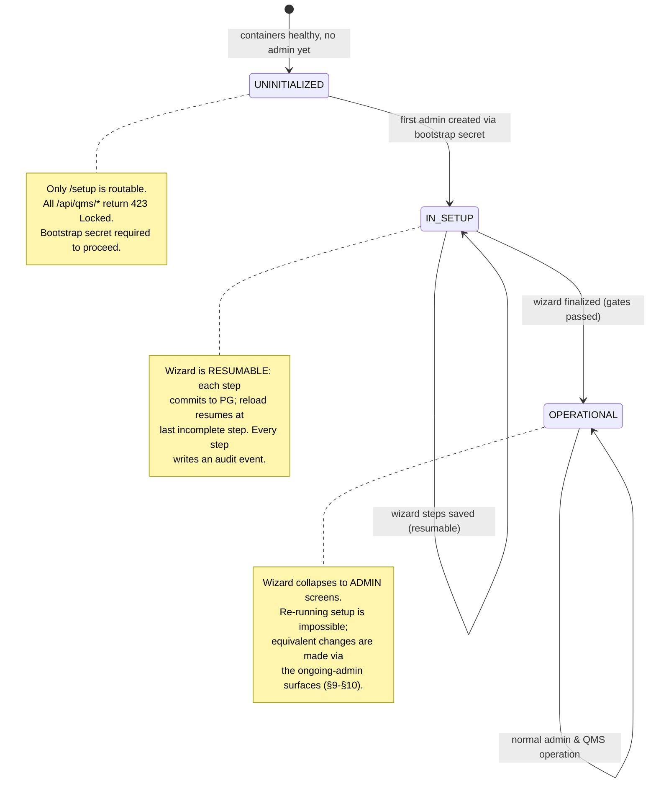
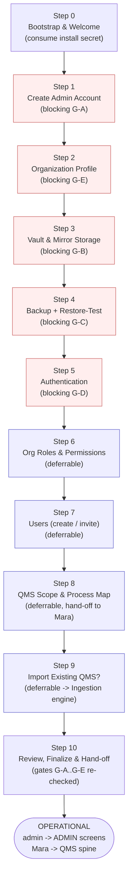
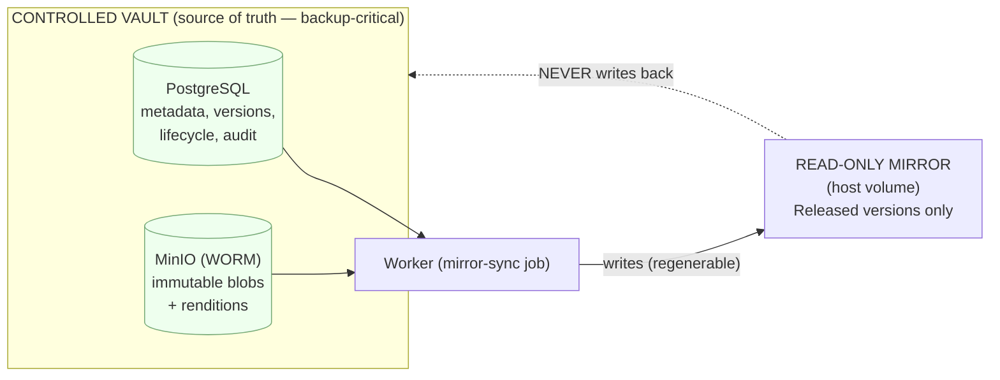
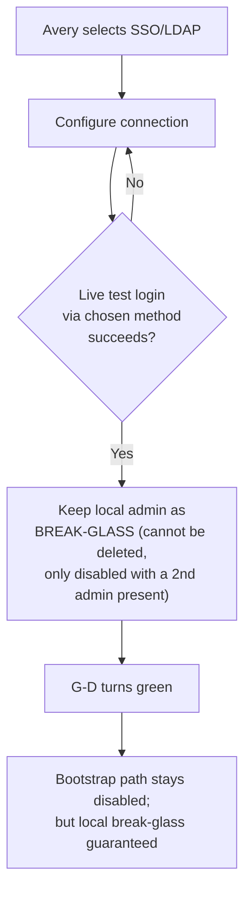
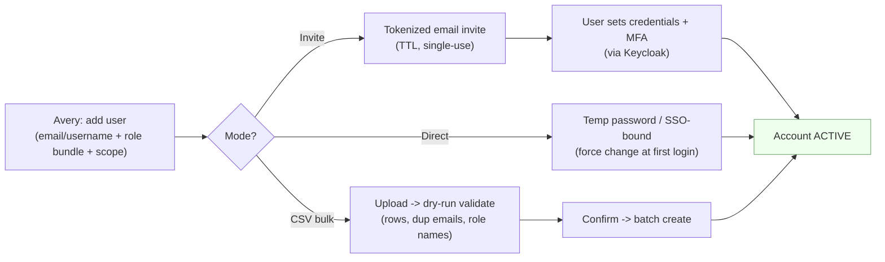
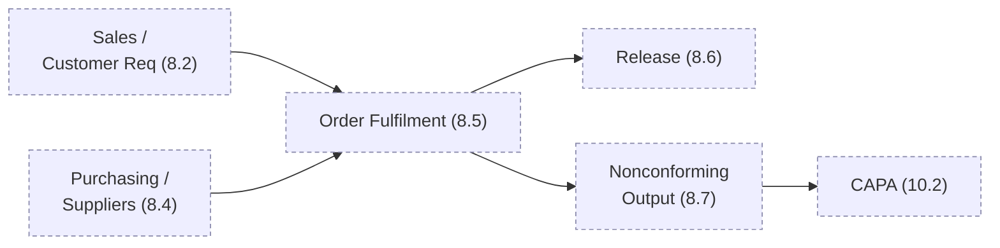
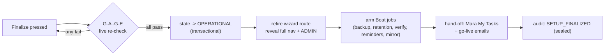
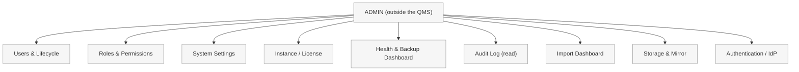
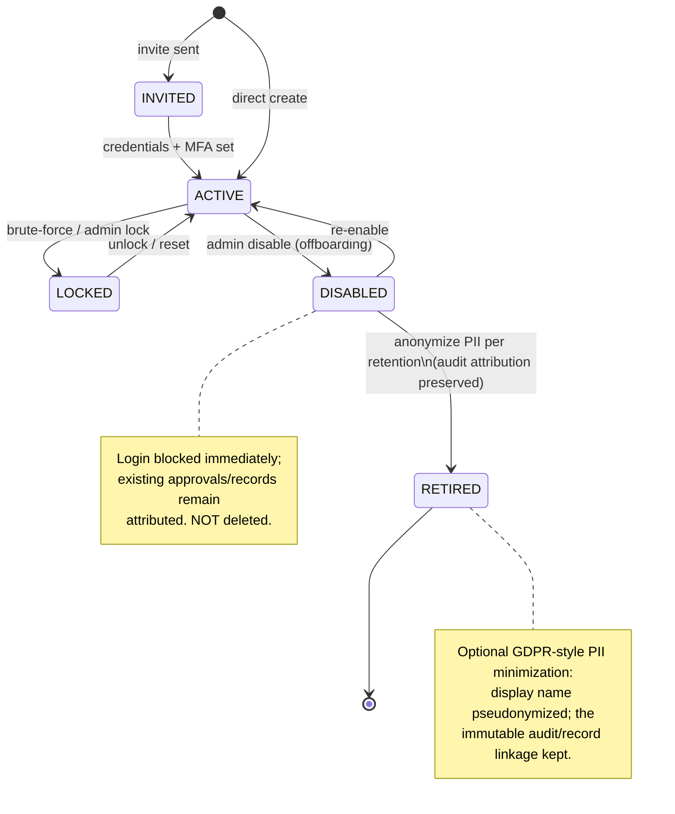
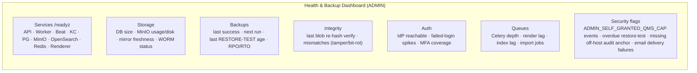

# First-Run Setup, Onboarding & Administration

This section specifies how an EasySynQ instance goes from a freshly-installed Docker Compose stack to a running, audit-ready QMS, and how it is administered thereafter. It details the **First-Run Setup Wizard** that **Avery (System Admin)** completes screen by screen — admin account, organization profile, vault/mirror storage, backup, authentication, organization roles & permissions, users, QMS scope & process map, and pointing the install at an existing QMS to import — followed by the ongoing administration surfaces (user lifecycle, role management, system settings, instance/license config, and the health-and-backup dashboard). The unifying principle, reinforced throughout, is **Avery sits OUTSIDE the QMS**: Avery owns the *system* (identity, storage, backup, recoverability, the permission machinery) but does **not** author or approve QMS content by default. The wizard scaffolds the *containers* of quality (scope, processes, roles, accounts); **Mara (Quality Manager)** and the QMS personas fill those containers with controlled documents and retained records. Everything below aligns to the canonical Vision, Domain Model, and Architecture sections: the Controlled Vault (PostgreSQL + MinIO) is the single source of truth; the filesystem is a read-only mirror; clauses are seeded read-only reference data; permissions are hybrid RBAC+ABAC; and every consequential action is written to the append-only audit trail.

---

## 1. Scope, Principles & Terms

### 1.1 What this section covers

| In scope | Out of scope (specified elsewhere) |
|---|---|
| The web First-Run Setup Wizard (post-install, in-browser) | The `install.sh` / Compose bring-up (Architecture §12) |
| Admin account bootstrap & hand-off from install secret | Full permission catalog & ABAC attribute model (Permissions doc) |
| Org profile, vault/mirror storage config, backup config | Ingestion/import *mechanics* (Import doc) — we specify only the **hand-off** |
| AuthN configuration (local / LDAP-AD / OIDC-SAML) | Part 11 e-signature detail (deferred, N1) |
| Org role & permission bundle creation; user creation/invite | Multi-standard pack authoring (deferred, N2) |
| QMS scope statement + process-map seeding (hand-off to Mara) | Day-to-day QMS authoring/approval flows (Document Control doc) |
| Ongoing admin: user lifecycle, roles, settings, license, health/backup dashboard | |

### 1.2 The governing principle — Admin sits OUTSIDE the QMS

This is a **separation-of-duties** boundary enforced in three concrete ways, repeated as a design rule everywhere below:

1. **Distinct surfaces.** Avery operates in **ADMIN** (the bottom nav group, outside the PLAN/DO/CHECK/ACT spine). The wizard is an ADMIN surface. QMS authoring/approval lives in the clause spine and is invisible-by-action to Avery unless explicitly granted QMS permissions.
2. **Default permission posture.** The seeded `System Administrator` permission bundle contains **system** capabilities (`user.*`, `role.*`, `storage.*`, `backup.*`, `restore.*`, `config.*`, `import.execute`, `import.review`, `import.commit`, `system.audit_log.read`) but **excludes** QMS content capabilities (`document.create`, `document.edit`, `document.submit`, `document.approve`, `record.create`, `capa.*`, `audit.*` conduct/manage) (reconciled per Decisions Register R5). Avery *can* self-grant them, but doing so is itself a logged, deliberately friction-laden act (see §10.4) so the boundary is never crossed silently.
3. **The wizard scaffolds, humans fill.** The wizard creates the **scope shell**, **empty/seeded process nodes**, **role bundles**, and **accounts**. It explicitly **does not** author a Quality Policy, write procedures, or approve anything. The final wizard screen hands the QMS to Mara with a checklist of "what only a QMS owner should now do."

> **Design rationale.** Conflating "system admin" with "quality content owner" is precisely persona **Avery's** stated pain (Vision §6.2) and a recurring real-world audit weakness. Keeping the boundary structural (permission bundles + surface separation), not merely advisory, is what makes EasySynQ defensible under independence scrutiny and pre-positions clean Part-11 separation later.

### 1.3 Key terms used in this section

| Term | Meaning here |
|---|---|
| **Bootstrap secret** | A one-time, single-use token printed by `install.sh` (and stored hashed in PG) that authorizes creation of the *first* admin account. Invalidated the instant the first admin is created. |
| **First-Run Setup Wizard** | The guided, resumable, one-time configuration flow (this section); the only thing reachable on a virgin instance. |
| **Setup state** | An instance-level enum: `UNINITIALIZED → IN_SETUP → OPERATIONAL`. The QMS is unreachable until `OPERATIONAL`. |
| **Org profile** | Singleton row describing the deploying organization (the single tenant; carries `org_id`). |
| **Process node (seed)** | A skeletal `Process` (Domain Model §6) with name, owner placeholder, and clause hints, created by the wizard for Mara to flesh out. Not yet a controlled Process Definition document. |
| **OrgRole** | QMS role (Clause 5.3 accountability) — distinct from a permission **Role** (RBAC+ABAC bundle). Never conflate (Domain Model §3.4). |
| **Permission Role** | An org-defined bundle of atomic permissions with a default scope. What the wizard's "roles" screen creates. |

---

## 2. The Setup State Machine & Where the Wizard Sits

A freshly-deployed stack passes Compose health gates (`/readyz` green for PG, MinIO, OpenSearch/FTS, Redis, Keycloak) and then exposes **only** the wizard. The instance advances through a strict state machine; the QMS spine does not exist for any user until setup completes.



**Hard gates before `IN_SETUP → OPERATIONAL`:**

| Gate | Requirement | Why blocking |
|---|---|---|
| G-A | At least one **admin** account exists and is verified | No unattended/anonymous system |
| G-B | Vault storage (PG reachable + MinIO bucket created, object-lock verified) **and** mirror path writable & confirmed empty/owned | Source of truth must be real before any content |
| G-C | A **successful test backup AND a successful restore-test** to a scratch namespace | "Configured but never verified" backups are the classic disaster (Vision M-aligned, Architecture §9) |
| G-D | An auth method is selected and a **non-bootstrap** login path proven (admin can log in via the chosen method) | Avoid lock-out before disabling the bootstrap path |
| G-E | Org profile complete; framework = ISO 9001:2015 selected (only option in v1) | Establishes the single-tenant identity & clause catalog binding |

Steps that *create QMS content shells* (roles, users, scope, process map, import) are **strongly recommended but skippable** — the wizard distinguishes **blocking system steps** (G-A…G-E) from **deferrable QMS-shell steps** (Steps 6–9), reflecting that those are Mara's domain and can be completed after go-live.

---

## 3. Wizard Overview — Ordered Screen Flow

> **Canonical (reconciled per Decisions Register R4).** This **ten-step wizard** — Step 0 (Bootstrap) through Step 10 (Review/Finalize) — together with the **blocking backup + restore-test gate (G-C)** before authentication, is the **canonical** first-run flow. **Org profile (Step 2) comes before storage (Step 3).** The doc 11 §5.8 wireframe must align to this step list/order (add the bootstrap step and the restore-test gate, and order org profile before storage). The blocking-before-deferrable structure (G-A…G-E blocking; Steps 6–9 deferrable) is part of the canon.



**Cross-cutting wizard behaviors (apply to every screen):**

- **Resumable & atomic:** each screen commits its captured config to PostgreSQL on "Save & Continue"; a browser reload returns to the first incomplete screen. No partial state is lost.
- **Validate-before-advance:** the **Next** button is disabled until synchronous validations pass; "live" checks (storage reachability, backup test, auth login) run as Celery jobs with progress feedback and never block the request thread (Architecture NFR).
- **Audited:** every screen-completion writes an append-only audit event (`actor=admin`, `action=SETUP_STEP_COMPLETED`, `step`, `before/after summary`, correlation id). Setup is itself fully traceable.
- **Calm/progressive:** one decision cluster per screen; advanced options live behind a disclosure ("Advanced settings") and have safe defaults. A persistent left "setup checklist" shows blocking vs. deferrable status with RAG dots.
- **Reversible within setup:** any completed step can be revisited and edited until finalize; after finalize, the equivalent change is made through the ongoing-admin surfaces (§9–§10), never by re-running the wizard.

---

## 4. Step 0 — Bootstrap & Welcome

**Purpose.** Prove the operator is the legitimate installer and start the audited setup session. Sits *before* any account exists.

**How the bootstrap secret works.**

```mermaid
sequenceDiagram
    actor Avery
    participant Inst as install.sh
    participant PG as PostgreSQL
    participant Web as /setup (browser)
    Inst->>PG: generate bootstrap_secret, store SHA-256 hash + TTL (default 24h)
    Inst-->>Avery: print one-time secret to console (and to a 0600 file)
    Avery->>Web: open https://host/setup
    Web-->>Avery: Welcome + "Enter bootstrap secret"
    Avery->>Web: paste secret
    Web->>PG: compare hash, check TTL & unused
    PG-->>Web: valid -> open setup session (short-lived setup JWT)
    Note over Web,PG: Secret marked CONSUMED on first valid use.<br/>Brute-force throttled; TTL expiry forces re-issue via CLI.
```

| Captures | Validates | Notes |
|---|---|---|
| Bootstrap secret (paste) | Hash match; not expired (TTL, default 24h); not already consumed; rate-limited (5 attempts / 15 min, then lock + CLI reissue) | Secret is **never** stored in plaintext; only a salted hash + TTL live in PG. On valid entry, a short-lived **setup session token** is issued. |
| (display only) Instance version, build digest, sizing profile (S/M/L), host health summary | Read-only; confirms the operator is on the right instance | Surfaces `/readyz` of each store so Avery starts from a known-good baseline. |

**Outcome.** A scoped setup session is open; instance enters `UNINITIALIZED` interaction. No data captured yet beyond consuming the secret (audit-logged as `BOOTSTRAP_CONSUMED`).

---

## 5. Step 1 — Create the Admin Account (blocking, G-A)

**Purpose.** Create the first **system administrator** — Avery — and end the anonymous window.

| Captures | Validation | Rationale / boundary |
|---|---|---|
| Display name, **username**, work email | Email format; username uniqueness; email is for system notices (backup failures, health alerts), not QMS notifications | This account is created **directly in EasySynQ's local store and provisioned in Keycloak** as a local account regardless of later SSO choice, so there is always a break-glass admin even if federation breaks. |
| **Password** (if local) or "I will federate this admin later" | Password policy from Keycloak (min length, complexity, breached-password check if enabled); confirm-match | If SSO is chosen in Step 5, Avery can later bind this account to the IdP, but the local credential remains as break-glass. |
| **MFA enrolment** (TOTP / WebAuthn) — strongly prompted | Verify a live TOTP code / passkey registration before continuing | MFA on the super-user is a baseline; pre-positions Part-11 re-auth. Skippable only with an explicit "I accept reduced security" acknowledgement (logged). |
| Acknowledge the **Admin-Outside-the-QMS notice** | Required checkbox: "I understand this account holds full SYSTEM permissions and does NOT author or approve QMS content by default." | Makes the separation-of-duties principle an explicit, audited acceptance, not fine print. |

**On completion:** the `System Administrator` permission bundle (seeded, system-scope, **no QMS content capabilities**) is assigned; the **bootstrap secret is permanently invalidated**; instance transitions to `IN_SETUP`; audit event `ADMIN_BOOTSTRAPPED`. From here on, the wizard requires a real authenticated admin session.

> **Multiple admins.** Only one is required to proceed, but Step 1 offers an inline "Add a second administrator now (recommended)" so the install is not single-admin fragile. Additional admins can also be added later in §9.

---

## 6. Step 2 — Organization Profile (blocking, G-E)

**Purpose.** Establish the single-tenant organization identity and bind the ISO 9001:2015 clause catalog.

| Field | Captures | Validation | Notes |
|---|---|---|---|
| Legal organization name | Text | Required, ≤200 chars | Appears on evidence packs, mirror root, audit exports. |
| Short name / code | Slug | Required, `[A-Z0-9-]`, unique | Used in default document-identifier scheme prefix and mirror folder name. |
| Logo | Image upload | PNG/SVG ≤1 MB | For SPA header & PDF watermarks; stored as a (non-controlled) system asset. |
| Primary locale & **org timezone** | Select | Valid IANA tz; locale = **en** (only v1 locale; UI is i18n-ready) | Drives audit timestamps display, retention countdowns, schedule cron interpretation. UTC stored; tz for display. **The org timezone is authoritative for effective-date interpretation** (see boundary note below). |
| **Compliance framework** | Select | Locked to **ISO 9001:2015** (only option in v1) | Seeds the **read-only clause catalog** (Clauses 4–10) and the ★ mandatory-item checklist. `framework_id` recorded for future multi-standard extension (do not build now). |
| Document-identifier scheme | Pattern builder | Preview must render; tokens validated | e.g. `{TYPE}-{PROCESS}-{SEQ:000}` → `SOP-PUR-002`. Configurable now to avoid re-coding identifiers post-import. |
| Default retention defaults | Per record-class table | Non-negative periods | Seeds sensible `RetentionPolicy` defaults (e.g., training 3y, calibration 5y) Mara can override per record; satisfies the "records retained, not edited" rule. |

**On completion:** the org profile singleton is written; the ISO 9001:2015 clause catalog and ★ checklist are seeded **read-only**; `framework_id=iso9001:2015` stamped on the org. Audit: `ORG_PROFILE_SET`, `CLAUSE_CATALOG_SEEDED`.

> **Boundary reminder.** Selecting the framework seeds *reference data and a checklist*; it does **not** create any Document. The Quality Policy, Scope Statement, and procedures remain Mara's to author. The wizard never writes QMS content.

> **Org timezone drives effective-date interpretation (reconciled per Decisions Register R8).** The **org timezone** captured here is the authoritative tz for effectivity. A document's `effective_from` is stored as **`timestamptz` in UTC**, but is **captured in the UI as a DATE interpreted as local-midnight in the org timezone and converted to UTC at save**; effectivity is **displayed in the org tz**, while the **server UTC clock remains authoritative for cutover**. This conversion rule is explicit and binding — choosing the org timezone here is therefore a consequential, system-wide setting, not merely a display preference.

---

## 7. Step 3 — Vault & Mirror Storage (blocking, G-B)

**Purpose.** Point the instance at its source-of-truth stores and its read-only export, and *prove they work* before any content can exist. This screen operationalizes the core architectural invariant: **Vault (PG + MinIO) is truth; filesystem is a read-only mirror; authority flows vault → mirror, never the reverse.**

### 7.1 What this screen captures

| Group | Field | Validation / live check |
|---|---|---|
| **Relational vault (PostgreSQL)** | Connection (host/port/db/user) — usually pre-filled from Compose `.env` | Live `/readyz` probe; confirm schema migrated to current Alembic head; confirm append-only audit partition exists |
| **Blob vault (MinIO/S3)** | Endpoint, region, access/secret (from secrets), **bucket names** (documents, renditions, records) | Live: create-if-absent buckets; **verify object-lock / WORM is enabled** (write a probe object, attempt early delete, expect denial); confirm SSE enabled |
| **Content addressing** | (display) SHA-256 content-addressing on | Read-only confirmation of immutability guarantee |
| **Filesystem mirror** | Absolute host path of the read-only mirror volume; layout template (by clause / by process / hybrid) | Path exists, is a mounted volume, is **writable by the worker** and **owned/empty or previously-EasySynQ-owned**; refuse a path containing foreign files to prevent clobbering |
| **Mirror policy** | What gets mirrored (Released versions only — enforced, not optional); include rendered PDF + metadata sidecar? | Enforce "Released only"; the mirror **cannot** include drafts (drift prevention) |

### 7.2 The vault → mirror relationship (made explicit on screen)



The screen states plainly: **the mirror is regenerable and is NOT backed up** (Architecture §9); only PG + MinIO are backup-critical. A "Run mirror dry-run" button executes a no-op sync that confirms write permission and reports the would-be folder tree, without yet writing content (there is none).

**On completion:** vault connectivity, WORM verification, and mirror writability are recorded as a `StorageConfig` row; gate **G-B** is marked green. Audit: `VAULT_CONFIGURED`, `MIRROR_CONFIGURED`, `WORM_VERIFIED`.

---

## 8. Step 4 — Backup & Restore-Test (blocking, G-C)

**Purpose.** Configure admin-controlled backups **and prove a restore actually works** before trusting the instance with real QMS data. A configured-but-unverified backup is treated as *no backup*.

### 8.1 Captured configuration

| Field | Captures | Validation | Default |
|---|---|---|---|
| Backup destination | Local path / NFS mount / S3-compatible bucket (NAS, MinIO, AWS/Azure) | Reachability + writability live check; capacity warning | (none — must set) |
| Encryption | Encrypt-at-rest of the backup archive (passphrase / key file) | Key present & non-empty; passphrase strength | On (recommended) |
| Schedule | Full backup cron + optional WAL/PITR streaming toggle | Valid cron in org tz; PITR requires WAL archiving reachable | Nightly full; PITR off |
| Retention | Keep N daily / M weekly / K monthly | Non-negative; at least 1 daily | 7 daily / 4 weekly / 6 monthly |
| Scope (display) | PG dump + MinIO manifest/mirror + Keycloak realm export + encrypted config; **OpenSearch & filesystem mirror excluded** (regenerable) | Read-only; enforces the "only PG+MinIO are truth" invariant | — |
| Alerting | Email/webhook on backup failure (uses admin email from Step 1) | Valid sink | Email admin |

### 8.2 The mandatory restore-test

The gate is not "a backup ran" but "a backup **was restored and verified**." The wizard runs an end-to-end drill into an **isolated scratch namespace** (a temporary scratch **PostgreSQL database** + a scratch MinIO bucket), never touching live data:

> **Reconciliation (S8b2).** The scratch namespace is implemented as a **temporary database**, not a schema — it is `pg_restore`'s natural unit (a whole-DB custom-format `pg_dump` does not restore cleanly into a renamed schema), gives the strongest isolation, and tears down with one `DROP DATABASE`. "Schema" above is illustrative of "an isolated namespace."

```mermaid
sequenceDiagram
    actor Avery
    participant Wiz as Setup Wizard
    participant W as Worker
    participant Dest as Backup Destination
    participant Scratch as Scratch namespace (PG schema + bucket)
    Avery->>Wiz: "Run test backup + restore"
    Wiz->>W: enqueue BACKUP_TEST job (progress streamed)
    W->>Dest: write checksummed, encrypted test archive
    W->>W: verify archive checksum + manifest
    W->>Scratch: restore PG dump + MinIO objects into scratch
    W->>Scratch: run integrity assertions (row counts, blob SHA-256 re-hash, FK checks)
    W-->>Wiz: PASS/FAIL + report (timings -> RPO/RTO estimate)
    Wiz->>Scratch: tear down scratch namespace
    Note over Wiz: G-C turns green ONLY on PASS.<br/>FAIL shows actionable diagnostics; retry allowed.
```

| Captures from the drill | Validation |
|---|---|
| Test archive written, checksum verified | Checksum match; archive decryptable with provided key |
| Restore into scratch succeeded | PG restore exit 0; all expected MinIO objects present; SHA-256 re-hash matches; FK/constraint checks pass |
| Measured backup & restore timings | Surfaced as estimated **RPO/RTO**; warn if RTO exceeds the M-profile target (≤2h) |

**On completion:** a `BackupPolicy` row + Celery Beat schedule are created; gate **G-C** green only on a **PASS**. Audit: `BACKUP_CONFIGURED`, `RESTORE_TEST_PASSED` (or `…_FAILED` with reason). The ongoing **Health & Backup dashboard** (§11) inherits this config and shows the last restore-test age, nudging periodic re-drills.

### 8.3 Off-host audit-checkpoint anchor (soft gate; reconciled per Decisions Register R13)

An **off-host / append-only audit-checkpoint anchor is MANDATORY for any install claiming tamper-evidence / Part-11 readiness** (stakeholder decision). The wizard therefore prompts Avery to configure at least one **off-host or append-only checkpoint sink** here, modeled as an **`audit_checkpoint_sink`** config entity. This is a **soft gate (G-soft)**: it does **not** block finalize, but if no sink is configured the wizard shows a **clear, persistent warning** that the install **cannot claim tamper-evidence** until one is added, and the warning is mirrored on the Health dashboard (§15.6).

| Field | Captures | Validation | Default |
|---|---|---|---|
| Sink type | Separate **WORM bucket** / external object store / **append-only syslog** | Reachability + append/write probe; for WORM, verify object-lock/retention; for syslog, verify append-only target | (none — soft gate) |
| Endpoint / target | Bucket+region+credentials, or syslog host/port/protocol, or external object-store connection | Live connectivity check; off-host (must not resolve to the same host/volume as the primary vault) | (none) |
| Checkpoint cadence | How often a chain checkpoint is anchored to the sink | Valid cron/interval in org tz | Periodic (Beat) |

> **Why a soft gate, not a hard gate.** Some evaluation/sandbox installs legitimately run without tamper-evidence claims. Blocking would be wrong; **silently allowing a tamper-evidence claim with no off-host anchor is worse.** The warning makes the gap loud and the claim honest: an install with no `audit_checkpoint_sink` is explicitly flagged as **NOT tamper-evident** until one is configured.

**On completion (if configured):** an `audit_checkpoint_sink` config row is written and the off-host anchor warning clears. Audit: `AUDIT_CHECKPOINT_SINK_CONFIGURED`. (Soft-gate — finalize is not blocked, but the absence-warning persists until set.)

---

## 9. Step 5 — Authentication (blocking, G-D)

**Purpose.** Choose how organization users sign in, configured through the **Keycloak** broker, while guaranteeing the admin can never be locked out.

EasySynQ supports three modes (not mutually exclusive — local is always retained as break-glass):

| Mode | When to choose | Captured | Validation / live check |
|---|---|---|---|
| **Local accounts** | No corporate directory, or smallest installs | Password policy (length/complexity/expiry/breached-check), lockout thresholds, MFA requirement (off/optional/required), session timeout | Policy values sane; at least the admin can authenticate |
| **LDAP / Active Directory federation** | Org already manages users in AD/LDAP | Server URL (LDAPS/STARTTLS), bind DN + secret, base DN, user/group search filters, attribute mapping (uid, mail, displayName), group→role import hints | Live **bind test**; live **sample user lookup**; TLS chain validates; STARTTLS/LDAPS enforced |
| **OIDC / SAML SSO** | Org has an IdP (Entra ID, Okta, Keycloak, ADFS, etc.) | Protocol; issuer/metadata URL or uploaded SAML metadata XML; client id/secret or SP entity id + cert; claim/attribute mapping (email, name, groups); allowed redirect URIs | Live **discovery** (OIDC `.well-known`) or metadata parse; a **test login round-trip** in a popup must succeed |

### 9.1 Lock-out prevention (the critical safeguard)



| Captures | Validation | Rationale |
|---|---|---|
| Chosen auth mode(s) | Exactly one primary login method proven via live round-trip (**G-D**) | Never strand the org on a misconfigured IdP |
| "Allow local login for break-glass admins" | Forced **on**; cannot be disabled while only one admin exists | The super-user can always recover access if federation breaks |
| Federated **group → permission-role** suggestions | Mapping is a *hint*, never binding (permissions stay granular per philosophy) | Convenience without surrendering the hybrid RBAC+ABAC model |

> **Note on JWT validation.** The SPA uses OIDC Auth-Code + PKCE; the API validates tokens via Keycloak JWKS (Architecture §8.3). The wizard only *configures the realm*; it does not change this enforcement path.

**On completion:** Keycloak realm/identity-provider config is written and exported (so it is captured by backups); gate **G-D** green. Audit: `AUTH_CONFIGURED` (mode), `AUTH_TEST_LOGIN_OK`.

> **Reconciliation (S8c).** EasySynQ always authenticates via Keycloak (OIDC); upstream federation (LDAP/OIDC/SAML) is configured *in Keycloak*. So G-D's "proven non-bootstrap login (live round-trip)" is implemented as: the `POST /setup/configure-auth` caller's **valid non-bootstrap JWT** (the endpoint runs inside the PEP; the bootstrap path authorizes via the install *secret* outside the PEP) **+ a live OIDC-issuer discovery reachability probe** (a misconfigured/unreachable issuer → 422 `auth_unavailable`, gate stays red — no false-PASS). The richer in-app Keycloak admin-API provisioning (account/password/TOTP create), a full federated popup round-trip, and **MFA enforcement** are v1 (MFA is a logged acknowledgement here; `acr`/step-up stays the reserved Part-11 seam, D3). Local break-glass login is never disabled, so the org cannot be locked out.

---

## 10. Step 6 — Organization Roles & Permissions (deferrable)

**Purpose.** Create convenient **permission Role** bundles the org will assign to users. This is the **permission machinery** — squarely Avery's job and squarely *outside* the QMS. (It is distinct from QMS **OrgRoles**/RACI in Clause 5.3, which Mara owns; see §12 and Domain Model §3.4.)

### 10.1 Seeded starter bundles (editable, not binding)

The wizard pre-creates bundles mirroring the canonical personas so the org starts usable, then can customize. Each is a *typical bundle*, never a hard boundary (Vision permission philosophy).

> **Permission-key canon (reconciled per Decisions Register R5).** The seeded bundles use the **doc 07 catalog keys exactly**. The legacy spellings normalize as: `document.author` → `{document.create, document.edit, document.submit}`; `capa.own` → `capa.*` (note: `capa.own` is a *role concept*, not a permission); `audit_qms.*` → `audit.*` (e.g., `audit_qms.conduct` → `audit.conduct`); and the import family `import.initiate`/`import.administer` → `import.execute` / `import.review` / `import.commit`. `record.create` stays `record.create`. Do not reintroduce the legacy spellings.

| Seeded Role bundle | Maps to persona | Typical capabilities (illustrative — full catalog in Permissions doc) | Default scope |
|---|---|---|---|
| **System Administrator** | Avery | `user.*`, `role.*`, `storage.*`, `backup.*`, `restore.*`, `config.*`, `import.execute`, `import.review`, `import.commit`, `system.audit_log.read` — **no** QMS content caps | System |
| **Quality Manager** | Mara | QMS-wide `document.read`, `framework.configure`, `lifecycle.configure`, `orgrole.manage`, `audit.*`, `mgmtreview.own`, `evidencepack.generate`, `capa.verify` | Org-wide |
| **Process Owner** | Diego | `document.read` (all), `{document.create, document.edit, document.submit}`/`record.create`/`capa.*` **scoped to owned process** | Per-process |
| **Author** | Priya | `document.checkout`, `document.edit`, `document.submit` within assigned folders/processes | Folder/process |
| **Approver** | Ken | `document.review`, `document.approve|reject` (the signature hook) within scope | Folder/process |
| **Internal Auditor** | Ingrid | broad `document.read` + `record.read`, `audit.conduct`, `finding.create`, `capa.link` — **explicitly NO** `{document.create, document.edit, document.submit}`/`document.approve` (independence) | Org-wide read |
| **Read-only Employee** | Sam | `document.read` (Released only) within area; optional `document.acknowledge` (normalized per R5; the catalog key — R42/R43 context) | Area/process |
| **External Auditor (Guest)** | Olsen | `evidencepack.read` only, **time-boxed**, scope-limited; every view logged | Bound to one evidence pack |

### 10.2 What the screen captures per role

| Field | Captures | Validation |
|---|---|---|
| Role name & description | Text | Unique name |
| Capabilities | Multi-select from the permission catalog (grouped by domain) | Catalog-valid; dependency hints (e.g., `approve` implies `read`) |
| Default scope template | System / process / folder / document | Scope type valid; per-assignment scope still set on the user |
| **Independence guards** | Toggle: "this role may NOT also hold approve/author on the same scope" | Warn (not hard-block) when a bundle mixes audit + authoring caps — surfaces SoD risk |

### 10.3 Permission model recap (so this screen stays aligned)

Hybrid **RBAC + ABAC**, **deny-by-default**, server-enforced (Architecture §8.3). The effective decision layers:

```
effective = deny_by_default
          ⊕ role_bundles (RBAC)
          ⊕ ABAC attributes (process / folder / doc level / scope-window)
          ⊕ per-user overrides (explicit grant or deny; deny wins)
```

The wizard creates **bundles + scope templates**; **per-user overrides** and the concrete scope of each grant are applied in Step 7 / ongoing admin. Full precedence rules live in the Permissions doc; this screen must not contradict them.

### 10.4 The self-grant friction (boundary enforcement)

If Avery edits the `System Administrator` bundle (or their own overrides) to add a **QMS content capability** (`document.create`, `document.edit`, `document.submit`, `document.approve`, `record.create`, `capa.*`, `audit.conduct`) (reconciled per Decisions Register R5), the UI:

1. Shows a blocking confirmation explaining the separation-of-duties consequence;
2. Requires a typed justification;
3. Writes a distinct, high-visibility audit event `ADMIN_SELF_GRANTED_QMS_CAP` that surfaces on the Health dashboard and in audit exports.

This makes crossing the Admin/QMS boundary *possible but never silent* — the principle is enforced by friction + traceability, not by a hard impossibility (because some tiny orgs legitimately need one person to wear both hats, knowingly).

> **Deferral (S8d → v1).** The S8d Users & Roles admin ships the role/override management surface but **defers the §10.4-specific friction** (the blocking typed-justification confirm + the distinct `ADMIN_SELF_GRANTED_QMS_CAP` event) to v1. There is no silent hole in the interim: an admin self-grant of a content cap still goes through the **two-tier grant guard** (R35) and is **audited as `OVERRIDE_ADD`** (object_type=permission); only the extra friction + the dedicated high-visibility event are deferred. Adding the event needs a new `event_type` value (an additive-enum migration).

### 10.5 The permission-grant boundary — a two-tier model (reconciled per Decisions Register R35)

Granting permissions is itself split along the Admin/QMS line, resolving the apparent conflict between this section and the Permissions doc (doc 07 §4.2) **in favor of a single, consistent two-tier model**:

| Tier | Who may hold `permission.grant` / `permission.revoke` | Domains | Scope |
|---|---|---|---|
| **CONTENT permissions** | The **Quality-Manager / QMS Owner** (Mara) **MAY** hold `permission.grant` (and `permission.revoke`) | `document.*`, `record.*`, `audit.*`, `capa.*`, `changeRequest.*`, `evidencepack.*` | **WITHIN QMS scope** |
| **SYSTEM permissions** | **Admin-only** (Avery) | `user.*`, `role.*`, `storage.*`, `backup.*`, `restore.*`, `config.*`, `import.*` | **SYSTEM scope** |

So the QMS Owner can delegate *content* authority (e.g., grant `document.edit` on a folder to an author) without ever touching *system* authority — and Avery retains exclusive control over system-permission granting. This means the QMS no longer depends on Avery to administer content-side delegation, which keeps the separation-of-duties boundary clean in both directions.

The **self-grant friction + audit (§10.4) still applies to any QMS→admin crossing**: if a QMS Owner who holds content-scoped `permission.grant` attempts to grant themselves (or anyone) a SYSTEM permission, that is blocked at this boundary; and any admin self-granting QMS content caps remains the high-friction, high-visibility act described above. The boundary is two-tier, not one-way: neither tier may silently acquire the other's grant powers.

**On completion:** role bundles persisted. Audit: `ROLE_CREATED`/`ROLE_SEEDED` per bundle. (Skippable — seeded bundles suffice to proceed.)

---

## 11. Step 7 — Users (create / invite) (deferrable)

**Purpose.** Populate accounts and assign role bundles + scopes. Avery creates the accounts; **who authors/approves what** is governed by the bundles and scopes, keeping Avery outside content.

### 11.1 Two provisioning paths

| Path | When | Flow |
|---|---|---|
| **Invite** (preferred for SSO/email orgs) | SMTP configured & email-based onboarding | Avery enters email + role + scope → EasySynQ sends a tokenized invite → user completes profile/MFA via Keycloak → account `ACTIVE` |
| **Direct create** | Local accounts, air-gapped, or bulk | Avery sets username/email/temp password (force-change at first login) + role + scope; or **CSV bulk import** with a dry-run preview & per-row validation |



### 11.2 What the screen captures per user

| Field | Captures | Validation |
|---|---|---|
| Identity | Email / username; display name | Email format; uniqueness; if SSO, must resolve in IdP/LDAP |
| **Permission Role(s)** | One or more bundles | Bundle exists |
| **Scope** | Concrete process(es)/folder(s)/doc(s) for scoped bundles | Scope target exists (or "assign later") |
| **Per-user overrides** (optional) | Explicit grant/deny on specific capabilities | Catalog-valid; deny-wins noted |
| **Guest / time-box** (for External Auditor) | Validity window + bound evidence-pack scope | End ≥ start; scope set; auto-expiry armed |
| **QMS OrgRole hint** (optional) | e.g., "Process Owner of Purchasing" | Distinct from permission role; recorded for RACI; does **not** itself grant permissions |

> **Boundary note.** Avery may *create* the account that Mara will use and *assign* the Quality-Manager bundle, but Avery does not thereby gain QMS authoring. Assigning a bundle to someone else is a system act; using QMS capabilities is a content act gated by the bundle the *user* holds.

**On completion:** users provisioned in EasySynQ + Keycloak; invites/temp credentials issued. Audit: `USER_CREATED`, `ROLE_ASSIGNED`, `SCOPE_ASSIGNED`, `GUEST_PROVISIONED` per user. (Skippable — at minimum Mara's account is recommended so the next steps can be handed off.)

---

## 12. Step 8 — QMS Scope & Process Map (deferrable; hand-off to Mara)

**Purpose.** Seed the **shell** of the QMS — the Clause 4.3 scope statement skeleton and the Clause 4.4 process map nodes — so Mara has a structured starting point, **without Avery authoring controlled content**.

### 12.1 The hard line on this screen

This is the screen where the Admin/QMS boundary is most tempting to blur, so it is explicitly constrained:

| The wizard DOES (system scaffolding) | The wizard does NOT (QMS content — Mara's job) |
|---|---|
| Capture **scope shell** fields (sites, product/service lines, **candidate exclusions** like Design 8.3) as *draft inputs* | Author/approve the **Scope Statement** Document (a Clause 4.3 ★ maintained doc) |
| Create skeletal **Process nodes** (name, owner placeholder, clause hints, draft input/output edges) | Author **Process Definition** Documents, Procedures, or the Quality Policy |
| Toggle IA section visibility from candidate exclusions (e.g., hide Design 8.3) | Decide/justify exclusions authoritatively (that is a recorded QMS decision Mara owns) |
| Assign **OrgRole** placeholders (Process Owner of X) for RACI | Grant permissions (that was Step 6/7) |

Everything the wizard creates here is marked **`DRAFT/SEED`** and **`requirement_source=org_determined` pending QMS confirmation**, owned by the QMS not by Avery. Nothing is `Released/Effective`.

### 12.2 What the screen captures

| Group | Captures | Validation |
|---|---|---|
| Scope shell | Sites/locations; product & service lines; boundaries; **candidate exclusions** with reason placeholders | At least one site; exclusions must reference a real clause (e.g., 8.3) |
| Process map seed | Process nodes (name, candidate owner/OrgRole, PDCA phase hint, clause hints), draft input→output edges | Unique node names; no self-loop edges; owner is a created user or "TBD" |
| Layout | How the process map renders & how the mirror is organized (by process / by clause / hybrid) | Matches Step 3 mirror layout choice |


*(Dashed = SEED nodes the wizard creates for Mara to confirm/flesh out; not yet controlled documents.)*

### 12.3 The hand-off to Mara

On finalize, EasySynQ generates a **"QMS Owner To-Do"** punch list assigned to the Quality-Manager account, e.g.:

1. Author & approve the **Quality Policy** (5.2 ★) and **Scope Statement** (4.3 ★).
2. Confirm process owners; convert SEED nodes to controlled **Process Definitions** (4.4 ★).
3. Set **Quality Objectives** (6.2 ★).
4. Confirm/justify exclusions; review the **★ Compliance Checklist** coverage.

This list lands in Mara's **My Tasks** (Home) the first time she logs in — making the hand-off concrete and the boundary obvious: the wizard prepared the stage; Mara performs the QMS.

**On completion:** scope shell + SEED process nodes + OrgRole placeholders persisted (all DRAFT/SEED, QMS-owned). Audit: `SCOPE_SHELL_SET`, `PROCESS_NODE_SEEDED` (per node), `QMS_HANDOFF_TASKS_CREATED`. (Skippable.)

---

## 13. Step 9 — Import an Existing QMS? (deferrable; hand-off to Ingestion engine)

**Purpose.** Optionally point the install at an existing QMS source and **hand off** to the ingestion engine (UJ-2). This section specifies only the **trigger and hand-off contract** — the import *mechanics* (scanning, mapping heuristics, dedupe, version capture) are owned by the Import/Ingestion doc.

### 13.1 What this screen captures

| Field | Captures | Validation |
|---|---|---|
| Decision | "Import existing QMS now" / "Start empty (import later from ADMIN)" | If "later," step is satisfied without import |
| Authorization (display) | The import family `import.execute` (run scan/classify) / `import.review` (review & correct classifications) / `import.commit` (commit to vault) gates this step (reconciled per Decisions Register R5) | Avery holds the system-scope import family; classification correction routes to the assigned reviewer |
| Source location | Path to a reachable folder tree / mounted file share (read access) | Path reachable & readable by worker; non-empty; size/file-count preview |
| Read posture | Treat source as **read-only**; copy into vault (never move/delete source) | Enforced; EasySynQ never mutates the source |
| Initial defaults | Default owner (placeholder), default document type/level, identifier-scheme application | Owner is a created user or TBD; scheme from Step 2 validates |
| Mapping review handoff | Whether Avery does first-pass mapping or hands the mapping review to **Mara** | At least one reviewer assigned |

### 13.2 The hand-off contract to the ingestion engine

```mermaid
sequenceDiagram
    actor Avery
    participant Wiz as Setup Wizard
    participant Ing as Ingestion Engine (separate subsystem)
    participant Vault as Controlled Vault (PG+MinIO)
    participant Mara
    Avery->>Wiz: Point at source + set defaults + reviewer
    Wiz->>Ing: HAND-OFF: ImportJob{source, defaults, reviewer, scope-seed links}
    Note over Wiz,Ing: Wizard's responsibility ENDS here.<br/>Engine performs scan/preview/map/ingest.
    Ing->>Ing: scan & preview structure (read-only)
    Ing-->>Mara: propose source->Document mapping + clause/process hints
    Mara->>Ing: review & adjust mappings, set owners/types
    Ing->>Vault: ingest as controlled MASTERS (initial immutable versions + source metadata)
    Ing->>Vault: generate read-only mirror from Released state
    Ing-->>Mara: coverage report on clause map; flag gaps
    Note over Ing,Vault: Every ingest action audit-logged.<br/>Source can then be archived.
```

| The wizard hands off | The ingestion engine owns (NOT specified here) |
|---|---|
| Source location, read-only posture, defaults, reviewer, links to the SEED process/scope from Step 8 | Scan, preview, mapping heuristics, dedupe, type/level inference |
| `import.execute` authorization (Avery's system right; the `import.review` / `import.commit` rights gate classification correction and vault commit) (reconciled per Decisions Register R5) | Capturing each file as an initial **immutable version** with source metadata |
| The `ImportJob` record + an entry on the Import dashboard | Mapping-review UI (Mara), ingest into vault, mirror generation, coverage report |

> **Boundary note.** Avery holds `import.execute` (a *system* capability — running the scan/classify and moving bytes into the vault, with `import.review` and `import.commit` completing the family) (reconciled per Decisions Register R5). The **mapping decisions** — which file is which document type, which process/clause it serves, who owns it — are QMS judgments routed to **Mara**. Avery may do a mechanical first pass for tiny orgs, but the controlling review is a QMS act. This keeps even import aligned to "Admin scaffolds, QMS decides."

**On completion (if importing):** an `ImportJob` is created and dispatched under the importer's `import.execute` right (with `import.review`/`import.commit` gating the later stages) (reconciled per Decisions Register R5); the wizard does **not** wait for ingestion to finish (it is async). Audit: `IMPORT_INITIATED` (source, scope, reviewer). The job's progress is then tracked on the ongoing **Import dashboard** (ADMIN). (Skippable — import can be launched anytime from ADMIN.)

---

## 14. Step 10 — Review, Finalize & Hand-off

**Purpose.** Re-validate the blocking gates, present a single summary, and transition the instance to `OPERATIONAL`.

### 14.1 Finalize checklist (gates re-checked live)

| Gate | Shown as | Block finalize if… |
|---|---|---|
| G-A | Admin account(s): N, MFA status | No verified admin |
| G-B | Vault reachable, WORM verified, mirror writable | Any storage check stale/red |
| G-C | Last restore-test: PASS @ timestamp, RPO/RTO estimate | No passing restore-test |
| G-D | Auth mode + proven login; break-glass local on | No proven non-bootstrap login |
| G-E | Org profile complete; ISO 9001:2015 seeded | Profile incomplete |
| G-soft | Off-host **`audit_checkpoint_sink`** configured (§8.3) | **Never blocks** — but if absent, finalize shows a persistent "install is NOT tamper-evident until an off-host audit anchor is added" warning (reconciled per Decisions Register R13) |
| (info) | Deferrable steps 6–9 status (roles/users/scope/import) | Never blocks — shown as "to complete after go-live" |

### 14.2 Finalize transaction

On "Finalize Setup":

1. Re-run G-A…G-E live checks; abort with diagnostics on any failure.
2. Flip instance setup state `IN_SETUP → OPERATIONAL` (single transactional commit).
3. Permanently retire the wizard route; expose the full nav (clause spine + ADMIN).
4. Arm scheduled jobs: backup (Beat), retention sweeps, integrity verify, review-due reminders, mirror-sync.
5. Push the **QMS Owner To-Do** to Mara's My Tasks; email the admin + Mara a "EasySynQ is live" summary.
6. Write a sealing audit event `SETUP_FINALIZED` with the full captured config summary (a permanent, exportable setup record — itself audit evidence of controlled commissioning).



**Outcome.** Avery lands on the **Health & Backup dashboard** (ADMIN). Mara, on first login, lands on Home with the QMS Owner To-Do. The Admin-Outside-the-QMS boundary is now live and structural.

---

## 15. Ongoing Administration

Once `OPERATIONAL`, the wizard is gone; equivalent and continuing controls live under **ADMIN** (outside the QMS). All admin actions are audit-logged; none grant QMS content authority by default.

### 15.1 ADMIN surface map



### 15.2 User lifecycle (create / disable / reset / audit)

EasySynQ uses **disable, never hard-delete** for any account that has touched the QMS — because that user's name is bound to immutable approvals, records, and audit rows that must remain attributable (Clause 7.5 / Part-11-readiness). Identities are retired, not erased.



| Action | What it does | Audit event |
|---|---|---|
| Create / invite | As Step 7 (also available post-setup) | `USER_CREATED` / `USER_INVITED` |
| Disable (offboard) | Immediate session revoke + login block; assignments retained | `USER_DISABLED` |
| Re-enable | Restore login | `USER_REENABLED` |
| Reset credential | Force password reset / re-enroll MFA (or trigger IdP reset) | `USER_CREDENTIAL_RESET` |
| Reassign scope/role | Change bundles/scope/overrides | `ROLE_ASSIGNED` / `OVERRIDE_SET` |
| Reassign ownership | On offboarding, transfer owned processes/CAPAs to another user (a **QMS** approval may be required) | `OWNERSHIP_REASSIGNED` |
| Retire (PII minimize) | Pseudonymize per retention; keep attribution linkage | `USER_RETIRED` |
| Audit a user | View a user's effective permissions (resolved RBAC+ABAC+overrides) and full action history | `USER_PERMISSIONS_VIEWED` |

> **Offboarding & QMS continuity.** Disabling a Process Owner does not orphan their process; the UI prompts to reassign owned artifacts. The *reassignment of QMS ownership* may itself require a QMS decision (Mara), again keeping content authority out of pure system admin.

### 15.3 Role & permission management

- Create/edit/clone/delete permission **Role** bundles; deleting a bundle in use warns and requires reassigning affected users first.
- Edit per-user **overrides** (explicit grant/deny; deny wins).
- **Effective-permissions explorer:** select a user + a target (doc/folder/process) and see the resolved decision with the *reason trace* (which bundle/attribute/override produced allow/deny) — essential for debugging deny-by-default and for audit defense.
- The **self-grant friction** (§10.4) applies identically here: adding QMS content caps to an admin/self is high-friction and high-visibility.
- The **two-tier `permission.grant` boundary** (§10.5) applies identically here: the QMS Owner may hold `permission.grant`/`permission.revoke` scoped to CONTENT domains within QMS scope (`document.*`, `record.*`, `audit.*`, `capa.*`, `changeRequest.*`, `evidencepack.*`), while SYSTEM-permission granting (`user.*`, `role.*`, `storage.*`, `backup.*`, `restore.*`, `config.*`, `import.*`) stays admin-only at SYSTEM scope (reconciled per Decisions Register R35).

### 15.4 System settings

| Group | Settings |
|---|---|
| Notifications | SMTP relay (host/TLS/from), email templates toggle, webhook sinks. **Email bounce / delivery-failure handling is owned by ADMIN** (reconciled per Decisions Register R32): failures surface on the Health dashboard (§15.6) and as a system notification — never deferred to an out-of-scope doc |
| Localization | Timezone, locale (en in v1; i18n-ready), date/number display |
| Branding | Logo, accent token, PDF watermark text for controlled/obsolete prints |
| Security | Session timeout, password/MFA policy (delegated to Keycloak), audit-view-of-controlled-docs toggle, IP allow-list (optional) |
| Mirror | Layout (by clause/process/hybrid), rendition inclusion, manual "rebuild mirror now" |
| Search | OpenSearch on/off (S-profile → Postgres FTS fallback), manual reindex |
| Retention | Org default retention policies (overridable per record class); disposition approval requirement |
| Observability | Opt-in Prometheus/Grafana/Loki profile, external sink (off by default — no telemetry leaves the boundary unless enabled) |

### 15.5 Instance / license configuration

| Item | Detail |
|---|---|
| Edition / license | License key (if applicable): named-user cap, sizing profile (S/M/L), feature flags (reserved: multi-standard, e-sig — **off** in v1). Self-hosted; license validated **offline** (no phone-home) via a signed key file. |
| User-count enforcement | Warn at 90% of named-user cap; soft-block new active users at 100% (existing users unaffected) |
| Version & upgrades | Show running version/digest; `easysynq upgrade` enforces pre-upgrade backup + Alembic migration gate + health gate + rollback path (Architecture §12) |
| Air-gap mode | Indicates offline image bundle; suppresses all outbound checks |
| Feature flags (reserved) | Part-11 e-signature module and multi-standard packs appear as **disabled, not-yet-available** toggles — visible to show the extension path, non-functional in v1 |

### 15.6 Health & Backup dashboard

The calm landing surface for Avery — the **system** analogue of Mara's PDCA wheel. Counts/RAG only; drill-down for detail (progressive disclosure).



| Panel | Surfaced signals | Drill-down |
|---|---|---|
| Services | `/readyz` RAG per container; degraded-mode banners (e.g., search on FTS fallback) | Per-service logs/metrics (if observability profile on) |
| Storage | PG size, MinIO usage vs. disk, **mirror last-synced**, WORM enabled | Rebuild mirror; storage trend |
| Backups | Last success/failure, next scheduled, **last restore-test age** (nudge re-drill), RPO/RTO | Run backup now; run restore-test; download/inspect manifest |
| Integrity | Last blob re-hash verify result; any SHA-256 mismatch (tamper/bit-rot alarm); **off-host `audit_checkpoint_sink` status** (reachable / last checkpoint age / **NOT tamper-evident if unset**, per §8.3) | Trigger full verify; view flagged blobs; open audit-anchor config |
| Auth | IdP/LDAP reachability; failed-login spike alert; % users with MFA | Open auth config; lock account |
| Queues | Celery depth, render/index lag, active import jobs | Pause/resume workers; inspect job |
| Security flags | High-visibility list incl. **admin self-grant of QMS caps**, overdue restore-tests, expiring guest accounts, **missing off-host audit anchor** (§8.3) | Open audit log filtered to the event |
| Email deliverability | **Email bounce / delivery-failure events** (SMTP/relay rejections, hard bounces, webhook-sink failures) are owned here, surfaced as a Health signal **and** as a system notification (reconciled per Decisions Register R32); not deferred elsewhere | View failed sends; open SMTP/relay config (§15.4); retry/resend |

The dashboard explicitly **does not** show QMS health (objectives, audits, CAPAs) — that is Mara's PDCA dashboard. The two dashboards are the visible manifestation of the Admin-Outside-the-QMS split: **Avery watches the machine; Mara watches the QMS.**

### 15.7 Audit log (read-only for Avery)

Avery has `system.audit_log.read` (system right) and can search/export the append-only trail (logins, permission changes, storage/backup/auth changes, setup events, import initiations, self-grants). Avery **cannot** edit or delete audit rows (append-only, partitioned, WORM-aligned) — not even the super-user. This is the tamper-evidence guarantee (Vision G7) and a Part-11 pre-requisite. QMS-content audit views (who approved which document) are visible but remain QMS evidence, not admin-editable.

---

## 16. Summary — How Setup & Admin Lock to the Foundation

1. **A strict state machine** (`UNINITIALIZED → IN_SETUP → OPERATIONAL`) makes the wizard the only thing reachable on a virgin instance and guarantees no QMS exists until commissioning is verified.
2. **Five blocking gates** (admin, vault+WORM, **verified** backup+restore-test, proven non-bootstrap login, org profile + ISO 9001:2015 catalog) ensure the source-of-truth and recoverability are real before any content lands — directly serving "vault is truth, mirror is regenerable, only PG+MinIO are backup-critical." A **non-blocking soft gate** additionally prompts for an off-host **`audit_checkpoint_sink`** (§8.3): finalize is never blocked, but any install lacking one is loudly flagged as **NOT tamper-evident** until it is configured (reconciled per Decisions Register R13).
3. **Four deferrable QMS-shell steps** (roles, users, scope, import) reflect that they belong to Mara's domain and can follow go-live; the wizard *scaffolds* them and *hands them off* with concrete tasks.
4. **The Admin/QMS boundary is structural**: separate surfaces (ADMIN vs. clause spine), a system-only default bundle, friction+visibility on self-granting QMS caps, and two distinct dashboards (machine vs. QMS).
5. **Permissions stay hybrid RBAC+ABAC, deny-by-default**: the wizard builds bundles + scope templates; per-user overrides and concrete scopes layer on; an effective-permissions explorer makes decisions auditable.
6. **Everything is audited and recoverable**: every setup step and every admin action writes append-only audit; backups are verified by an enforced restore-test; identities are retired, never erased, preserving attribution for ISO traceability and future Part-11 e-signatures.
