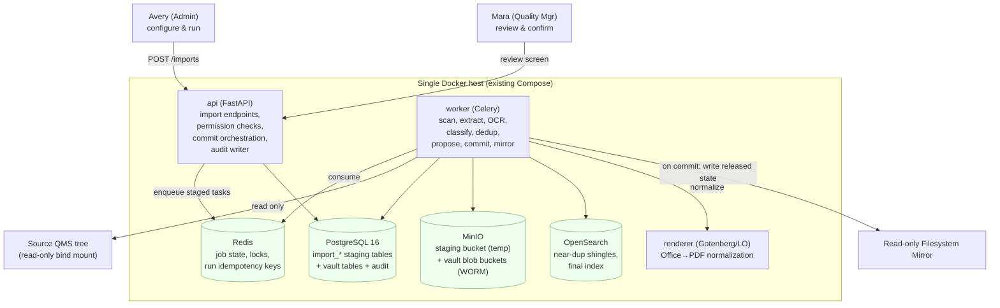
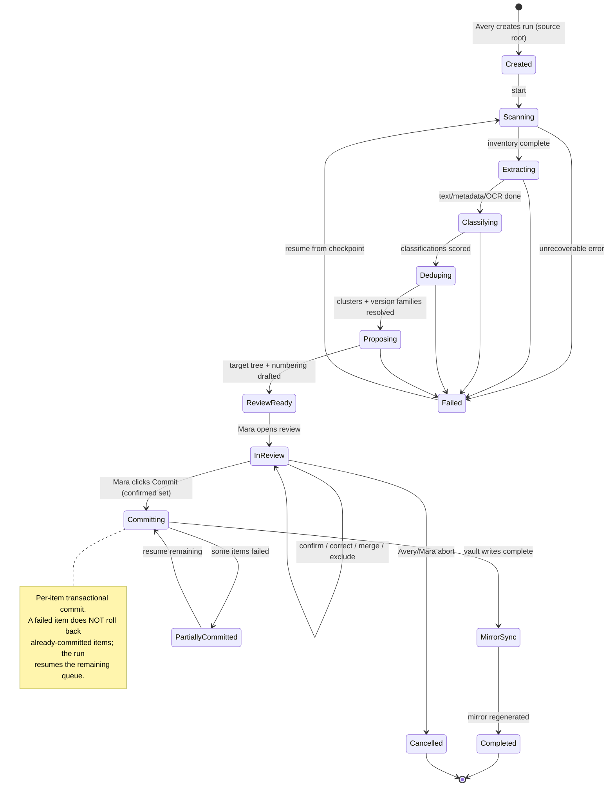
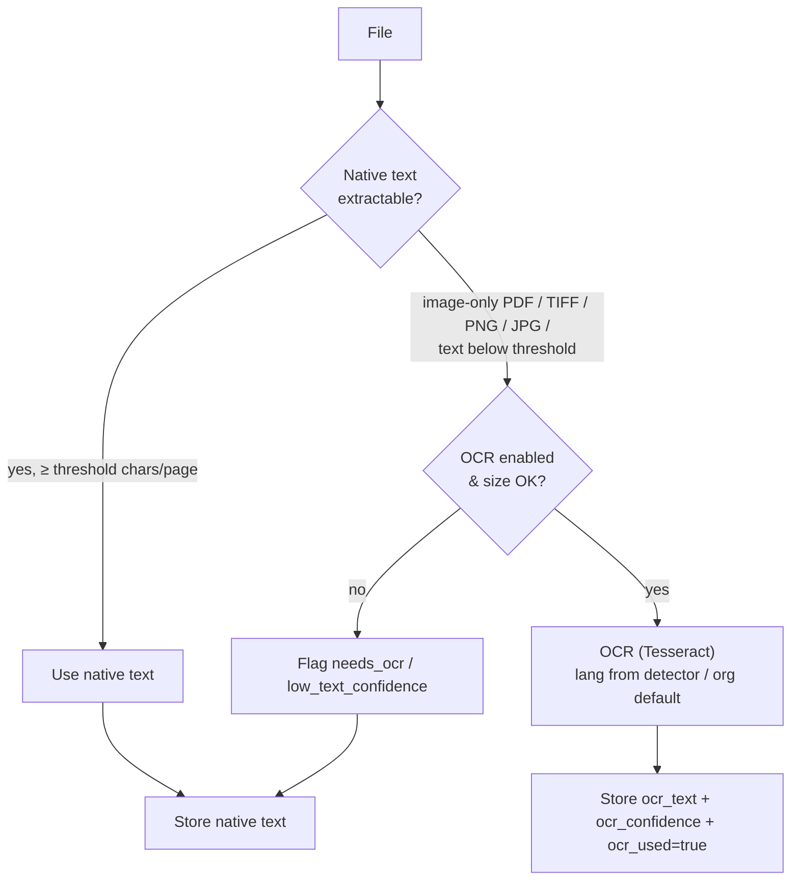
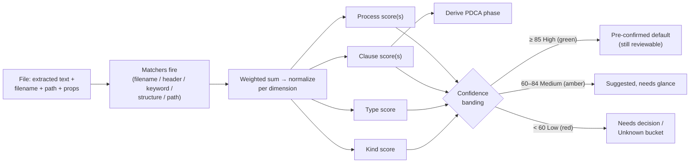
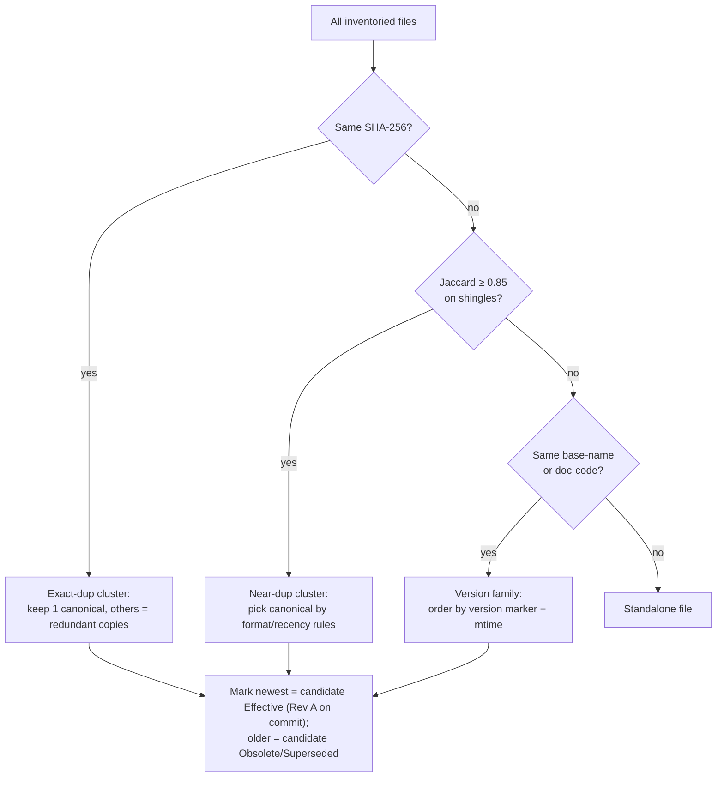
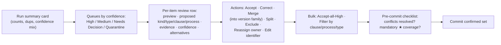

# Ingestion / Import / Auto-Organization Engine

This section specifies the **Ingestion Engine**: the pipeline that runs when **Avery (System Admin)** points EasySynQ at an existing QMS folder tree and turns a chaotic, drift-prone file share into a clean set of **controlled documents** living inside the **Controlled Vault** (PostgreSQL + MinIO), with a regenerated **read-only Filesystem Mirror** on top. The engine is a *staged, idempotent, resumable* pipeline that **scans and inventories** files (type, size, date, SHA-256); **extracts** metadata and text (with OCR for scanned PDFs/images); **classifies** each file by document type and proposes a **clause map**, **process link**, and **PDCA phase** using a transparent **rules + heuristics** scorer that emits **confidence scores**; **detects** exact duplicates, near-duplicates, and superseded/obsolete versions; and **proposes** a target IA-aligned folder structure and document numbering. Crucially, *nothing becomes controlled automatically*: the engine produces a **Proposal** that **Mara (Quality Manager)** reviews and corrects on a **human-in-the-loop** screen (the UJ-2 review step) before an explicit **Commit** migrates files into the vault as immutable **baseline versions** (`Rev A`, `Released/Effective`) and regenerates the mirror. The classifier is deliberately **pluggable**: rules + heuristics ship in v1, and an ML/AI classifier is a drop-in `ClassifierProvider` later with no pipeline rewrite. The whole run is captured in an append-only **Import Report** and the system **Audit Trail**.

> **Alignment anchors.** This engine implements **UJ-2 (Import an existing QMS)** from the Vision & Scope doc, respects every architecture **invariant** (vault is the source of truth, authority flows vault→mirror, blobs are immutable/content-addressed, audit is append-only), and produces artifacts that conform to the domain model's **`DocumentedInformation` taxonomy**, **maintain/retain distinction**, **read-only clause catalog**, and **universal control fields**. Personas, lifecycle states, and glossary terms are reused verbatim.

---

## 1. Scope, Goals & Non-Goals

### 1.1 What the engine does (v1)

| # | Capability | Output |
|---|---|---|
| IG1 | **Scan & inventory** a reachable source tree | One `SourceFile` row per file: path, size, mtime/ctime, MIME, SHA-256, ext |
| IG2 | **Extract** metadata + full text (OCR fallback for scans) | `extracted_text`, `header_block`, embedded properties (author/title/created), language |
| IG3 | **Classify** kind + type + clause(s) + process + PDCA phase | `Classification` with per-dimension **confidence scores** + evidence/rationale |
| IG4 | **Detect** exact dup, near-dup, version family, obsolescence | Dedup clusters + `version_family` groupings + `obsolete` flags |
| IG5 | **Propose** target folder layout + document numbering | A `Proposal` tree mirroring the ISO IA; suggested `identifier` per document |
| IG6 | **Human-in-the-loop review** by Mara (confirm/correct/merge/exclude) | A reviewed, decision-bearing `Proposal` ready to commit |
| IG7 | **Commit / migrate** confirmed items into the vault | Controlled `Document`s at **baseline `Rev A` → Released/Effective**; immutable blobs |
| IG8 | **Generate** the read-only mirror from committed released state | Organized, read-only directory tree |
| IG9 | **Report & audit** the whole run | Immutable **Import Report** + append-only audit events |
| IG10 | **Safe re-import / resume** | Idempotency keys, partial-resume, no duplicate ingestion |

### 1.2 Non-goals (explicit, to protect calm UX and the locked decisions)

- **NG1 — No auto-commit.** The engine never makes a file controlled without Mara's explicit confirmation (aligns with **N9**: no auto-compliance judgments; the tool organizes, humans decide).
- **NG2 — No content rewriting.** Files are ingested **byte-for-byte**; the engine never edits document content, fixes formatting, or "cleans up" the source (aligns with **N4**: not an authoring tool). Normalized PDF renditions are *additional* derived blobs, never replacements.
- **NG3 — No write-back to source.** The source tree is treated as **read-only**; the engine only reads. The original share can be archived by the org afterward (UJ-2 step 5).
- **NG4 — No ML/AI in v1**, but the classifier interface is built so AI is additive (`ClassifierProvider`, §6.6).
- **NG5 — Records are *imported as evidence*, not fabricated.** The engine can recognize a file as a likely **Record (retained)** and route it accordingly, but it does **not** synthesize template→record links beyond what evidence supports; uncertain record/document calls are surfaced for Mara.
- **NG6 — No source-system connectors in v1** (SharePoint API, Google Drive API). v1 ingests a **mounted/reachable filesystem path** (matching A3 and the architecture's `LegacyQMS` source). Connectors are a future `SourceProvider` (§3.4).

### 1.3 Stated assumptions

| # | Assumption |
|---|---|
| IA1 | The source is reachable as a mounted path or a copied snapshot directory inside the host the `worker` container can read (a read-only bind mount, e.g. `/srv/import/source`). |
| IA2 | The source is "reasonably structured" (A3) but **not** trusted: filenames, folders, and embedded metadata are *hints with confidence*, never ground truth. |
| IA3 | A single **import run** targets one source root. Multiple roots = multiple runs (each independently resumable and reportable). |
| IA4 | Mara has the `import.review` permission and the QMS-content authority to confirm classifications; Avery has `import.execute` (operate the scan/commit) but, per separation of duties, **may** be denied `import.review` so that QMS-content decisions stay with Quality. Both are configurable (hybrid RBAC+ABAC). |
| IA5 | The clause catalog (read-only seed) and the org's **Process** list / `OrgRole`s exist before review confidence is highest; if processes are not yet defined, the engine still proposes process links as *new-process suggestions* Mara can accept. |

---

## 2. Where the engine runs (architecture fit)

The engine is **not** a new service — it is a set of **Celery tasks** orchestrated by the `worker` pool, driven by the `api` tier, using the existing stores. It introduces a small set of **staging tables** in PostgreSQL (prefixed `import_`) and a **staging bucket** in MinIO; nothing about the core vault changes.



**Boundary rules inherited:**
- Source tree is mounted **read-only** (`:ro`) — the engine physically cannot write back (NG3).
- Staging blobs live in a dedicated MinIO bucket **without** object-lock; only on **Commit** are blobs promoted (copied content-addressed) into the **WORM** vault buckets. This keeps abandoned/rolled-back imports from polluting the immutable store.
- OpenSearch is used during the run for near-dup shingling but, per the invariant, is **rebuildable**; the authoritative dedup decisions are persisted in PG.

---

## 3. Pipeline Overview (the staged state machine)

The import run is a state machine with **resumable stages**. Each stage is a Celery task (or chord of parallel tasks) that reads its inputs from `import_*` tables and writes its outputs back, so a crashed run resumes from the last completed stage rather than rescanning.



### 3.1 Stage responsibilities

| Stage | Task(s) | Reads | Writes | Idempotency key |
|---|---|---|---|---|
| **Scanning** | `scan_source` (single walker, fan-out batches) | source tree (ro) | `import_file` rows (path, size, mtime, sha256, mime) | `(run_id, rel_path)` unique |
| **Extracting** | `extract_text` (parallel, per file) + `ocr_file` (conditional) | `import_file`, staging blobs | `import_extract` (text, header block, props, lang, ocr_used) | `(run_id, file_id)` |
| **Classifying** | `classify_file` (parallel) | `import_extract` + `import_file` | `import_classification` (kind/type/clauses/process/pdca + scores + evidence) | `(run_id, file_id, classifier_version)` |
| **Deduping** | `detect_dupes` (clustering), `detect_versions` | sha256s, shingles, classifications | `import_dupe_cluster`, `import_version_family` | `(run_id)` recomputed deterministically |
| **Proposing** | `build_proposal` | classifications + clusters + families | `import_proposal_node` (target tree), suggested `identifier`s | `(run_id)` |
| **InReview** | (interactive via `api`) | proposal | `import_decision` rows (Mara's edits) | `(run_id, file_id/cluster_id)` |
| **Committing** | `commit_item` (parallel, bounded) | confirmed decisions | vault `Document`/`Version`/blob rows; `import_commit_result` | `(run_id, file_id)` + content-hash check |
| **MirrorSync** | `mirror_sync` (reuses standard mirror task) | committed released versions | filesystem mirror | full regenerate (idempotent) |

### 3.2 Run as a first-class, audited object

Every run is an `ImportRun` row (status, source root, who created, counts, classifier version, timestamps). It is **visible in `Admin › Import / Vault Setup`** and produces an immutable **Import Report** (§11). Each stage transition appends an audit event (`IMPORT_RUN_STAGE_CHANGED`) — the run is as auditable as a document lifecycle.

### 3.3 Concurrency & locks
- A given **source root** may have only **one active run** at a time (Redis lock `import:src:{hash(root)}`); a re-import waits or is offered "resume existing run."
- Per-file extraction/classification tasks are bounded by a Celery concurrency cap so a 50k-file import does not starve interactive `render`/`index` jobs (separate Celery **queue** `import` with its own worker concurrency, so imports never block check-in pipelines).

### 3.4 Pluggable providers (extensibility, reserved not built)
The pipeline depends on three provider interfaces so future capability is additive:

| Interface | v1 implementation | Future drop-ins |
|---|---|---|
| `SourceProvider` | `FilesystemSourceProvider` (mounted path) | `SharePointSourceProvider`, `GoogleDriveSourceProvider`, `S3SourceProvider` (NG6) |
| `ClassifierProvider` | `RuleHeuristicClassifier` | `MlEmbeddingClassifier`, `LlmClassifier` (NG4 / §6.6) |
| `ExtractorProvider` | Apache-Tika/`textract`-style extractors + Tesseract OCR | cloud OCR, layout-aware extractors |

---

## 4. Stage 1 — Scan & Inventory

### 4.1 Walk
A single walker enumerates the source root depth-first, emitting batches (default 500 files) onto the `import` queue. For each file it records:

| Field | Source | Notes |
|---|---|---|
| `rel_path` | walk | path relative to source root (mirror-safe, no host secrets) |
| `filename`, `ext` | walk | extension lower-cased; missing-ext handled by content sniff |
| `size_bytes` | stat | 0-byte files flagged `empty` (excluded by default, surfaced) |
| `mtime`, `ctime` | stat | used as date hints for version/obsolescence heuristics |
| `mime_type` | libmagic content sniff (not just extension) | guards against mislabeled extensions |
| `sha256` | streamed hash | the **exact-dup key** and the eventual blob content address |
| `staged_blob_uri` | copy-to-staging | content-addressed object in the staging bucket |

> Files are **streamed** to compute SHA-256 and copied to the staging bucket in one pass, so large trees aren't read twice. Staging copy is itself content-addressed, so two identical files copy once.

### 4.2 Filters & quarantine (configurable, with safe defaults)

| Category | Default behavior | Rationale |
|---|---|---|
| System/junk (`Thumbs.db`, `.DS_Store`, `~$*.docx` lock files, `desktop.ini`) | **Excluded**, listed in report | Never QMS content |
| Temp/backup (`*.tmp`, `*.bak`, `*~`) | **Quarantined** (held, not auto-included) | Often stale copies; Mara decides |
| Archives (`*.zip`, `*.7z`, `*.rar`) | **Expanded one level** into the inventory (configurable depth) | QMS bundles are often zipped |
| Encrypted / password-protected | **Quarantined**, flagged `needs_password` | Can't extract/hash content meaningfully |
| Oversized (> configurable cap, default 500 MB) | **Quarantined**, flagged `oversize` | Likely media, not a document |
| Unsupported binary (e.g., `.exe`, `.iso`) | **Excluded**, listed | Not documented information |
| Empty (0 bytes) | **Excluded**, listed | No content |

Everything excluded/quarantined is **never silently dropped** — it appears in the Import Report with its reason, and Mara can pull a quarantined item back into review.

### 4.3 Inventory summary (calm first surface)
The scan completes into a **calm summary card** (progressive disclosure): total files, total size, type histogram, count by proposed kind (Documents vs Records vs Unknown), and counts of dups/quarantined — *not* a 10,000-row table on first paint. Detail is one click deeper.

---

## 5. Stage 2 — Extraction (text, metadata, OCR)

> **Implemented in S-ing-2** via an Apache Tika `-full` HTTP sidecar (the extractors + Tesseract OCR
> bundled in one local JVM container, no telemetry) behind the `ExtractorProvider` seam. The §5.2 OCR
> ladder is a two-pass PDF path (`no_ocr` → `ocr_only` below the per-page char threshold). Deviations:
> `ocr_confidence` is best-effort (Tika does not surface per-doc Tesseract confidence in `/rmeta`);
> `ocr_enabled=False` gates the PDF OCR pass but a standalone image is still OCR'd by the sidecar's
> image parser. Extraction failure marks `extract_failed` and never fails the run (§5.3). `full_text`
> is stored inline (capped) in the transient `import_extract` row, not a blob reference.

### 5.1 What is extracted

| Output | How | Used by |
|---|---|---|
| `full_text` | format-specific extractor (Tika/textract family); for Office, also via the Gotenberg/LibreOffice path already in the stack | keyword classification, near-dup shingles, final OpenSearch index |
| `header_block` | first N lines / first page + any title/footer region | high-signal classification (doc codes, "Procedure", rev tables) |
| `embedded_props` | document properties: author, title, subject, created/modified, app, page count | author→owner hint, date→version hint |
| `language` | language detector over `full_text` | OCR language selection, i18n readiness |
| `structure_hints` | heading count, table count, presence of a "Revision History" table, page count | type heuristics (a 1-page checklist vs a 12-page procedure) |

### 5.2 OCR decision (scanned PDFs & images)



- **Trigger:** image-only PDFs, raster image formats, or any PDF whose native text density falls below a per-page character threshold (default 50 chars/page).
- **Engine:** Tesseract (open, self-hostable — no outbound calls, honoring the no-telemetry posture). Language chosen by the detector with an org-configurable default set (en in v1, framework ready for more).
- **Confidence:** OCR mean confidence is stored; low-confidence OCR drops the file's *content-based* classification confidence (it can still classify on filename/path), and the file is tagged `low_text_confidence` so Mara can prioritize it.
- **Cost control:** OCR is the most expensive step; it runs on the dedicated `import` queue, is size-capped, and progress is reported per file. A run can be configured **OCR-off** (S/tiny profile) and re-run later with OCR-on (resume picks up only the un-OCR'd files).

### 5.3 Failure handling
Extraction failures (corrupt file, unknown sub-format) do **not** fail the run: the file is marked `extract_failed`, classification falls back to filename/path-only signals (lower confidence), and the reason is recorded. Nothing is lost.

---

## 6. Stage 3 — Classification (rules + heuristics, with confidence)

This is the analytical heart. The classifier assigns, **per file**, four independent dimensions, **each with its own confidence score** and a human-readable **evidence list** (so Mara sees *why*). It is deliberately transparent and pluggable.

> **Implemented in S-ing-2** as the pure `RuleHeuristicClassifier` (`classifier_version =
> "rule-heuristic-1"`) behind the `ClassifierProvider` seam, scoring against a versioned YAML rule
> pack (`domain/ingestion/rule_packs/iso9001_rule_pack_v1.yaml`). The §6.3 formula is a **capped
> weighted sum** `min(100, Σ fired-matcher weights)` (weights calibrated to reproduce the §6.5 worked
> examples). The **row-level review band is the type (headline) confidence** + a separate `ambiguous`
> flag (a near-tie on any dimension) — the §6.5 single-number model. `kind` is **scored only** (UNKNOWN
> below a floor; never auto-confirmed — R10; confirmation is the S-ing-4 review slice). PDCA is derived
> from the highest-confidence matched requirement-node clause. The measured per-dimension accuracy band
> (§6.4a) ships **INTERIM — synthetic corpus only** (`tests/fixtures/ingestion_corpus/VALIDATION.md`);
> the real-corpus validation sprint is a v1.x prerequisite.

### 6.1 The four classification dimensions

| Dimension | Output domain | Maps to domain-model field |
|---|---|---|
| **Kind** | `DOCUMENT` \| `RECORD` \| `UNKNOWN` | `DocumentedInformation.kind` — **always human-confirmed regardless of confidence** (reconciled per Decisions Register R10) |
| **Document/Record type** | Quality Policy, Quality Manual, Scope Statement, Process Definition, Procedure/SOP, Work Instruction, Form/Template, Quality Objective, register-type … / Audit, Mgmt Review, CAPA, Competence, Calibration, KPI, Supplier eval, Release, Filled Form … | concrete leaf type in the taxonomy (§6 of domain model) |
| **Clause map** | one or more `Clause` ids from the **read-only clause catalog** (M:N) | `clause_map[]` |
| **Process link** | one or more existing `Process` ids, or "new-process suggestion" | `process_links[]` |
| (derived) **PDCA phase** | `PLAN`\|`DO`\|`CHECK`\|`ACT` | `pdca_phase` — **derived** from clause map via the canonical PDCA↔clause mapping (Clause 7 split resolved by type: resourcing→PLAN, operating→DO) |

> **PDCA is derived, not guessed.** Because the domain model fixes the PDCA↔clause mapping, the engine computes `pdca_phase` from the chosen clause(s); it only has to *infer* clause, not phase. This keeps the engine aligned with the enforced mapping and avoids a redundant guess.

> **Kind is always human-confirmed (reconciled per Decisions Register R10).** Unlike the other dimensions, the **Document-vs-Record `kind` classification is ALWAYS human-confirmed regardless of confidence** — a High-band `kind` score (even ≥ 85) is only a *suggestion*, never a pre-confirmed default, and the bulk-accept-all-High affordance (§6.4 / §9.2) does **not** auto-confirm `kind`. Mara must affirm Document-vs-Record on every item before it can commit; the engine surfaces this as an explicit confirm step in review. (The maintain/retain distinction is too consequential to auto-decide on a confidence threshold.)

### 6.2 Signal sources (in descending typical reliability)

| Signal | Examples | Weight band |
|---|---|---|
| **Explicit doc-code in filename/header** | `SOP-PUR-002`, `QP-01`, `WI-WELD-14`, `F-7.5-03` | **High** (a recognized code scheme is near-decisive for type) |
| **Header/title keywords** | "Quality Policy", "Standard Operating Procedure", "Work Instruction", "Form", "Calibration Certificate", "Audit Report", "Management Review Minutes" | **High** |
| **Structural shape** | a "Revision History" table + approval block ⇒ controlled **Document**; a filled-in form with dated signatures ⇒ **Record**; many short rows ⇒ register | **Medium-High** |
| **Folder-path tokens** | `/Procedures/`, `/Records/2023/Audits/`, `/Forms/`, `/Calibration/` | **Medium** (structure is a hint, never trusted — IA2) |
| **Content keyword clusters** | clause-indicative vocabulary ("interested parties", "corrective action", "calibration interval", "supplier evaluation") matched to a per-clause lexicon | **Medium** |
| **Embedded properties / dates** | author, created/modified dates (feed owner + version heuristics) | **Low-Medium** |
| **Filename version markers** | `_v3`, `revB`, `FINAL`, `(old)`, `DRAFT`, date stamps | **Low for type, High for obsolescence** (§7) |

### 6.3 The scoring model (transparent, weighted, explainable)

The v1 classifier is a **weighted-evidence scorer**, not a black box:

1. A **rule pack** (YAML, org-overridable) defines, per type and per clause, a set of **matchers** (regex on filename/header, keyword sets with proximity, structural predicates, path-token patterns) each with a **weight** and a short **explanation string**.
2. For each file, every matching rule contributes its weight to the candidate it supports. Scores are normalized per dimension into a **0–100 confidence**.
3. The top candidate per dimension is the **proposal**; the runner-up and the margin are retained (a small margin ⇒ "ambiguous", surfaced for review).
4. Each contributing matcher's explanation is stored as the **evidence list** shown to Mara.



### 6.4 Confidence bands (drive the review UI)

| Band | Range | Review treatment |
|---|---|---|
| **High** | ≥ 85 | Green; pre-selected as the default; Mara can bulk-accept all High in one click (**except `kind`, which is always human-confirmed — R10**) |
| **Medium** | 60–84 | Amber; shown with the top-2 candidates and evidence; a glance/confirm |
| **Low** | < 60 | Red; routed to a **Needs Decision** queue; Mara must classify (or exclude) |
| **Ambiguous** | any band, margin < 10 | Flagged regardless of band — two candidates nearly tied |

> **Why bands, not a single threshold:** they power *progressive disclosure* in review — Mara confirms the easy 70% in seconds and spends attention only where the engine is genuinely unsure. This is the central UX lever for hitting **M8 (first-run setup < 1 working day)**.

### 6.4a Measured accuracy band & how it is validated (reconciled per Decisions Register R10)

The engine **states a measured expected auto-classification accuracy band and how it is validated** — confidence scores are only meaningful when the classifier's real-world accuracy is quantified and the validation method is published.

- **Stated band.** Each `classifier_version` ships with a published **accuracy band** expressed as **precision and recall per dimension** (separately for `kind`, `type`, and `clause_map`) measured on a labeled validation corpus, not as a single global "accuracy" number. The v1 `RuleHeuristicClassifier` publishes its band per dimension; the figure is a property of the model version, versioned alongside it.
- **How it is validated.** The band is computed against a **held-out, human-labeled validation set** representative of real QMS shares. The published validation note records the **corpus size, sampling strategy, labeling protocol, inter-rater check, and refresh cadence**, so the band can be reproduced and re-measured when the rule pack or provider changes.
- **Confidence ≠ accuracy.** The 0–100 confidence score is the scorer's *internal* margin; the stated band is the *measured* outcome on labeled data. The review UI surfaces the band so Mara can calibrate how much to trust each confidence tier; for `kind`, the band informs prioritization only — `kind` is human-confirmed regardless (§6.1).
- **Future providers.** Because every classification carries `classifier_version`, swapping in an `MlEmbeddingClassifier` / `LlmClassifier` (§6.6) requires re-publishing the measured band on the same validation set before that provider can be the default — a tracked, comparable operation.

### 6.5 Worked examples

| File (rel_path) | Top signals | Proposed kind / type | Clause / process / PDCA | Confidence |
|---|---|---|---|---|
| `/Procedures/SOP-PUR-002 Purchasing.docx` | doc-code `SOP-…`; header "Standard Operating Procedure"; folder `Procedures`; "supplier" keywords; revision-history table | DOCUMENT / Procedure (SOP) | 8.4 + 7.5 / Purchasing / DO | **High 92** |
| `/Quality Manual/Quality Policy.pdf` | header "Quality Policy"; singleton; folder | DOCUMENT / Quality Policy | 5.2 / — / PLAN | **High 96** |
| `/Records/Audits/2023/Internal Audit Report Q2.pdf` | header "Internal Audit Report"; path `Records/Audits`; date; filled signatures | RECORD / Audit report | 9.2 / (audited process) / CHECK | **High 90** |
| `/Forms/F-7.5-03 Calibration Log.xlsx` | code `F-…`; "Form"; "calibration"; empty grid (template, not filled) | DOCUMENT / Form-Template | 7.1.5 / — / DO | **High 88** |
| `/scan0421.pdf` (image-only) | OCR text low confidence; no code; no folder hint | UNKNOWN | — | **Low 22** → Needs Decision |
| `/Misc/process map draft.vsdx` | "process map"; Visio; "draft" | DOCUMENT / Process Definition (?) | 4.4 / multiple / PLAN | **Medium 71 (ambiguous)** |

### 6.6 Pluggable classifier (the AI extension point — reserved, not built)

`ClassifierProvider` is a stable interface: `classify(file_features) -> ClassificationResult{ per-dimension candidates + scores + evidence + classifier_version }`. v1 ships `RuleHeuristicClassifier`. The interface guarantees future ML/LLM providers are **additive**:

- The **review screen, confidence bands, evidence list, and commit path do not change** — they consume the same `ClassificationResult`.
- `classifier_version` is recorded on every classification (and in the Import Report), so re-classifying a run with a new provider is a tracked, comparable operation.
- An ML provider can **co-exist**: an **ensemble** mode (rules ∪ ML, max/weighted-blend of scores) is possible without touching the pipeline, because providers only produce scored candidates.
- Mara's confirmations/corrections are stored as `import_decision` rows — a clean, ready-made **labeled training set** for a future model, captured for free as a by-product of v1. (Stated as a future benefit, not a v1 feature.)

---

## 7. Stage 4 — Duplicate, Near-Duplicate & Obsolescence Detection

The single biggest cleanup win in a real import (directly serving **M2 — zero uncontrolled effective versions** and killing **P1 drift / P2 version chaos**). Three detectors run in sequence and feed a single **resolution** per family.

### 7.1 The three detectors

| Detector | Technique | Catches |
|---|---|---|
| **Exact duplicate** | identical **SHA-256** | byte-identical copies (the most common share clutter) |
| **Near-duplicate** | content **shingling + MinHash/Jaccard** over normalized text (whitespace/case-folded), threshold (default ≥ 0.85) | same document saved as `.doc` and `.pdf`; trivially edited copies; "FINAL" vs "FINAL2" |
| **Version family** | grouping by **normalized base-name** (strip version markers `_v#`, `revX`, `FINAL`, dates, `(1)`) **and/or** matching doc-code, ordered by version marker + mtime | `SOP-PUR-002_v1`, `_v2`, `_v3 FINAL` recognized as one document's revision history |



### 7.2 Canonical-pick rules (deterministic, explainable)
Within a cluster/family the engine nominates a **canonical** "keep" item using ordered tie-breakers (all shown as evidence, all overridable by Mara):
1. Highest explicit **version marker** (`v3` > `v2`), then `FINAL`/`APPROVED` markers over `DRAFT`.
2. Most recent **mtime** (and embedded modified date when present — parsed defensively; an unparseable/absent date is "no signal", never a sortable garbage value, falling through to the next tie-breaker).
3. **Format preference** for the *content* representation: prefer the editable **source** (e.g., `.docx`) as the controlled document's source blob, while keeping any matching **PDF** as a rendition rather than a separate document.
4. Path preference: a file under `/Current/` or `/Released/` over `/Archive/` or `/Old/`.
5. **Stable tie-break (total order):** lexically-lowest `rel_path`, then `import_file.id` — guarantees a *total* order so that identical exact-duplicates (and any all-tie cluster/family) resolve to the same canonical/effective deterministically across re-deliveries, which §11.1's "(run_id) recomputed deterministically" full-replace idempotency relies on.

### 7.3 Obsolescence outcome → the version chain
This is where dedup connects to the **maintain/retain** model:
- For a **Document version family**, the engine proposes the canonical as the **baseline `Rev A` (Released/Effective)** and resolves the older members per family. The **default** (and recommended) handling, and the **opt-in** alternative, are governed by **R10** (see the note below):
  - **(default) Import only the current/latest as the controlled baseline; archive the rest as provenance** — only the canonical (newest) version becomes Effective; older files are **archived as provenance** (recorded in the report and captured as provenance metadata as "superseded source, archived as provenance"), and the org's source archive retains the bytes. This is the default for every family regardless of confidence.
  - **(opt-in, per family, with explicit confirmation) Reconstruct the revision chain as provenance** — only when Mara **explicitly opts a specific document-family in and confirms it at commit time**, the engine stitches the older members into an ordered chain. Even then, the reconstructed older versions are **captured as provenance, NOT as approved revision history** — they document where the controlled baseline came from; they are never asserted as an approved canonical timeline.
- For **near-dup / exact-dup clusters that are not a true version chain**, the redundant copies are **not ingested**; they are recorded as "redundant copy of `<canonical>`" so nothing silently vanishes.
- A file whose **filename screams obsolete** (`(old)`, `superseded`, `DO NOT USE`, `archive`) is pre-flagged `obsolete_candidate` even outside a family.

> **Import version-handling default (reconciled per Decisions Register R10).** The import default is **current/latest-only as the controlled baseline plus archive older copies as provenance** — **NOT** approved revision history. **Revision-chain reconstruction is opt-in per document-family and requires explicit confirmation at commit time**, and even when chosen it is **captured as provenance, not approved history**. The engine never auto-builds an approved version history; the safe default keeps only the current version live and preserves the rest as provenance.

> **Result:** exactly **one Released/Effective** version per resulting document (enforcing **A7** and **M2**) the moment the import commits — drift is eliminated at the source, which is the entire point of the import.

---

## 8. Stage 5 — Proposed Target Structure & Numbering

The engine drafts a **Proposal**: the IA-aligned home and an `identifier` for every keep-item, so the post-import vault is organized the way the domain-model IA flows.

### 8.1 Proposed organization (lenses, not a new silo)
Per the domain model, files are not "put in folders" so much as **mapped to clauses + processes + PDCA**; those mappings *render* as the **clause spine**, **process map**, and **PDCA dashboard** lenses, and the **read-only mirror** is generated from them. The proposed mirror layout mirrors the IA:

```
QMS-Mirror/
  PLAN/
    04-Context/            (Scope Statement, Context, Interested Parties)
    05-Leadership/         (Quality Policy, Roles)
    06-Planning/           (Quality Objectives, Risk Register)
    07-Support/            (resourcing docs)            ← Cl.7 PLAN-tagged
  DO/
    07-Support/            (operating docs, Document Control artifacts)  ← Cl.7 DO-tagged
    08-Operation/          (Procedures, Work Instructions by process)
  CHECK/
    09-Performance/        (KPIs, Audit program; audit RECORDS under Records/)
  ACT/
    10-Improvement/        (Improvement docs; CAPA records under Records/)
  Records/                 (retained evidence, grouped by clause/year)
  _ImportReport/           (the immutable run report — read-only)
```

> The mirror is **read-only and regenerated** (architecture invariant). The proposal screen lets Mara preview this tree but its authority is always the vault mapping, never the folder.

### 8.2 Document numbering proposal

| Situation | Engine behavior |
|---|---|
| File already carries a recognized **doc-code** (`SOP-PUR-002`) | **Preserve it** as the `identifier` (least surprise; respects existing org scheme) |
| No code, but an org **numbering scheme** is configured (template like `{TYPE}-{PROCESS}-{SEQ}`) | **Generate** a proposed `identifier` from classified type + process + next sequence |
| No code and no scheme | Propose a sensible default (`{TYPE}-{SEQ}`) and flag for Mara to confirm/rename |
| **Collision** (two files would get the same code) | Flagged as a **conflict** (§9); engine never silently reuses an identifier |

Numbering is **proposed, never forced** — Mara can accept the existing codes wholesale (common when an org already has a scheme) or apply the configured scheme to normalize. All identifiers are validated unique at commit.

### 8.3 Owner & process-link proposals
- **Owner** is proposed from embedded author / a folder-owner mapping / the process's `OrgRole` (Clause 5.3 data), defaulting to *unassigned* if low confidence — Mara assigns on review (UJ-2 step 6).
- **Process link** uses an existing `Process`; if the engine infers a process that doesn't exist yet, it emits a **"create process?"** suggestion rather than inventing one silently.

---

## 9. Stage 6 — Human-in-the-Loop Review (the UJ-2 confirmation screen)

The review screen is where **Mara** turns a Proposal into a confirmed, commit-ready set. It is the product's promise of "humans decide" (**N9**) made concrete, and it is built for **calm, progressive disclosure**.

### 9.1 Layout & flow



### 9.2 What Mara can do per item (and in bulk)

| Action | Effect |
|---|---|
| **Accept** | Confirm the proposal as-is (records an `import_decision`) |
| **Correct** | Change any dimension (kind/type/clause/process/owner/identifier); confidence becomes "human=100%" with attribution |
| **Merge** | Combine items into one **version family** (force a revision chain) |
| **Split** | Break an over-eager dup/version cluster apart |
| **Exclude** | Drop a file from import (kept in report as "excluded by Mara, reason") |
| **Defer** | Leave un-decided; commit proceeds without it; resumable later |
| **Bulk Accept-all-High** | One click confirms every green item; the headline efficiency feature. **Does not auto-confirm `kind`** — Document-vs-Record stays human-confirmed regardless of band (R10, §6.1). |
| **Bulk triage (multi-select)** | Filter/sort thousands of low-confidence items and apply Accept / Correct-to-X / Exclude / Reassign across a multi-selection in one action; fully keyboard-driven (R10) |
| **Pull from Quarantine** | Bring a quarantined/temp file back into the review set |
| **Preview** | In-browser PDF.js preview of the rendition + extracted-text view + the evidence list (why the engine proposed this) |

### 9.2a Scale: thousands of low-confidence items via bulk triage (reconciled per Decisions Register R10)

The review UI **must scale to thousands of low-confidence items** — a real import can land many thousands of Medium/Low/Unknown units, and one-at-a-time review would not be viable. The screen is therefore built for **high-volume bulk triage**, not occasional single-item review:

- **Virtualized, paginated queues** (High / Medium / Needs Decision / Quarantine) render and scroll smoothly at thousands of rows; nothing renders a full 10,000-row table on first paint (§4.3, §14).
- **Filter, sort, group, and saved facets** — by clause, process, type, confidence, folder-path token, OCR/low-text flag — let Mara carve a large Low/Unknown pile into homogeneous subsets.
- **Multi-select + bulk actions** apply Accept / Correct-to-X / Exclude / Reassign-owner / Edit-identifier across an entire selection in one keyboard-driven action, so thousands of similar low-confidence items are triaged in batches rather than individually.
- **Bulk `kind` confirm is explicit, not implicit.** Bulk operations may *set* a `kind` across a selection, but the action is itself the required human confirmation; `kind` is never auto-finalized by a confidence threshold (R10, §6.1). Mara can bulk-confirm "all of these are Records" — a deliberate human act over a reviewed selection.
- **Progress + resumability** — triage progress is checkpointed; Mara can stop and resume a large review later (§11.2).

### 9.3 The pre-commit checklist (decision-bearing gate)
Before **Commit** is enabled, the screen surfaces a calm checklist:
- **Conflicts** (duplicate identifiers, unresolved ambiguous items above a configurable count) — must be resolved or explicitly deferred.
- **Mandatory ★ coverage preview** — a read of the **Compliance Checklist** projected onto the confirmed set: which of the ~20 mandatory items (Scope, Policy, Objectives, audit results, etc.) the import *appears* to satisfy and which are still missing. This is a **non-blocking** advisory (the import can proceed with gaps; the QMS may be genuinely incomplete) — it never asserts compliance (**N9**) but it directly serves Mara's UJ-2 step 6 "review clause coverage, flag gaps."
- **Unknown / Low bucket count** — a reminder of how many files remain un-classified.

### 9.4 Permission scoping on review
Per the hybrid RBAC+ABAC model: `import.review` can itself be **scoped** — e.g., a Process Owner (**Diego**) could be granted review rights only over items the engine maps to *his* process, letting Mara delegate review by process while retaining the final commit authority (`import.commit`). Separation of duties (Avery runs, Mara/Diego decide) is configurable, not hard-coded.

---

## 10. Stage 7 — Commit / Migration into the Vault

On **Commit**, the confirmed set is migrated **item-by-item** into the Controlled Vault. Each item's commit is **transactional and idempotent**; a failure isolates to that item.

### 10.1 Per-item commit sequence

```mermaid
sequenceDiagram
    actor Mara
    participant API
    participant WK as worker (commit_item)
    participant PG as PostgreSQL
    participant OBJ as MinIO (WORM vault)
    participant REND as renderer
    participant AUD as Audit (append-only)

    Mara->>API: POST /imports/{run}/commit (confirmed set)
    API->>PG: lock run; snapshot decisions; status=Committing
    loop per confirmed item (bounded parallelism)
        WK->>PG: begin tx
        WK->>OBJ: promote staging blob -> vault bucket (content-addressed, object-lock ON)
        WK->>PG: create Document (identifier, kind, clause_map, process_links, pdca_phase, owner, framework_id)
        WK->>PG: create Version Rev A (immutable) referencing source blob
        WK->>PG: set lifecycle = Released/Effective (baseline)
        WK->>PG: write import provenance (source rel_path, sha256, run_id, classifier_version, confidence, decided_by)
        WK->>AUD: append IMPORT_ITEM_COMMITTED (who/when/what)
        WK->>PG: commit tx
        WK->>REND: enqueue Office->PDF rendition + thumbnail (async)
        WK->>PG: record import_commit_result = success
    end
    WK->>API: all items processed (successes + failures)
    API->>PG: status = MirrorSync (or PartiallyCommitted)
```

### 10.2 Commit rules (the load-bearing guarantees)

| Rule | Detail |
|---|---|
| **Baseline state** | Every imported Document lands at **`Rev A`, Released/Effective** — it is treated as the org's *currently governing* version (these are existing, in-force documents, not new drafts). Per family, only the canonical (current/latest) is Effective; by **default** older members are **archived as provenance** (not ingested as versions). **Only** when a family is **explicitly opted into revision-chain reconstruction and confirmed at commit time** are older members materialized — and then as **provenance, not approved history** (reconciled per Decisions Register R10; see §7.3). |
| **Immutability** | The source bytes become an **immutable, content-addressed blob** in a **WORM/object-lock** vault bucket; the Version snapshot is immutable. (Architecture invariant 3.) |
| **Records are retained, not versioned** | Items classified **RECORD** are committed as immutable **Record** entities with `captured_at` (best-effort from embedded/mtime), `retention` (org default policy, Mara-set), and **no edit affordance** — honoring the maintain/retain distinction. A Record pins its source where evidence allows. |
| **Provenance** | Every committed item stores its **import provenance**: original `rel_path`, source `sha256`, `run_id`, `classifier_version`, final `confidence`, and `decided_by` (engine-auto vs Mara-corrected). This is permanent and appears in the artifact's history. |
| **Approval-as-import** | The baseline "release" is recorded as a `signature_event` whose `meaning` is the canonical enum value **`import_baseline`** (reconciled per Decisions Register R2) — capturing who committed and when. Per R2, `import_baseline` is the **signature meaning that signifies the baseline acceptance of a pre-existing controlled document into the vault at commit**: it is *not* a fresh authoring/approval signature but the formal, attributed acknowledgement that this imported artifact is the org's currently-governing baseline. This reuses the **Part-11 signature hook** so the baseline is on the same append-only signature spine as future e-signatures — no special-casing. |
| **No partial vault state** | A per-item tx either fully creates {blob promoted + Document + Version + audit} or rolls that **one** item back; it never half-commits. |
| **Idempotent re-commit** | If `commit_item` re-runs for an item already committed (crash/retry), it detects the existing `(run_id, file_id)` commit result + matching content hash and **no-ops** — never a duplicate Document. |

### 10.3 Mirror generation (Stage 8)
After commit, the standard **`mirror_sync`** task (the same one used in normal operation) regenerates the **read-only Filesystem Mirror** from the now-released versions, into the proposed IA layout (§8.1). Authority flows **vault → mirror**; the source tree is untouched and can now be archived (UJ-2 step 5). The mirror write is itself idempotent (full deterministic regenerate).

---

## 11. Idempotency, Safe Re-Import, Resume & Conflict Handling

These four properties are what make the engine safe to point at the same messy share twice, or to recover from a mid-run crash, without creating duplicates or losing work.

### 11.1 Idempotency keys (no double-ingestion)

| Operation | Key | Effect on repeat |
|---|---|---|
| File inventory | `(run_id, rel_path)` unique + content `sha256` | re-scan updates the same row; identical content not re-staged |
| Extraction/classification | `(run_id, file_id, classifier_version)` | re-run overwrites in place; bumping classifier_version creates a comparable new result, not a dup |
| **Cross-run dedup vs existing vault** | source `sha256` checked against **already-committed import provenance** and existing vault blob hashes | a file already imported in a **prior run** is recognized and marked **`already_imported`** — *not* re-proposed for ingestion |
| Commit | `(run_id, file_id)` + content-hash match | committed item re-commit is a **no-op** |

> **Safe re-import scenario:** the org adds 30 new procedures to the share and re-runs the importer against the same root. The engine inventories everything, but the **already-imported** detector (by content hash + provenance) means only the **30 net-new** files surface for review; the 1,000 previously committed files are shown as "already in vault, unchanged" and are not re-proposed. A file that *changed* since last import (same path, new hash) is surfaced as a **"revise existing document?"** candidate that, if accepted, becomes a **new Version (Rev B+)** via the normal check-in path — not a second document.

### 11.2 Partial-import resume
- Run state and per-stage checkpoints live in PG; the `worker` can crash and the **Beat** scheduler / a `resume_run` task picks up from the **last completed stage** for incomplete files only (each stage is keyed per file).
- **Commit** specifically is **per-item**: if it dies after 600 of 1,000 items, status becomes **`PartiallyCommitted`**; resuming commits only the remaining 400 (the 600 are recognized via idempotency keys and skipped). No rollback of good work.
- A run can also be **paused** by Avery/Mara and resumed later (e.g., turn OCR on overnight, finish review tomorrow).

### 11.3 Conflict handling matrix

| Conflict | Detection | Resolution |
|---|---|---|
| **Duplicate identifier** within the import | uniqueness check on proposed `identifier`s | flagged in pre-commit checklist; Mara renames one or merges into a version family; commit blocked for that item until resolved |
| **Identifier collides with existing vault doc** | check against committed `Document.identifier` | offered as either "this is a **new revision** of the existing doc" (→ Rev B+) or "rename to a new identifier" |
| **Same content, different identifiers** (near-dup across the tree) | dedup cluster | proposed merge; Mara accepts/splits |
| **Same path re-scanned, content changed** | path match + hash mismatch vs provenance | "revise existing document?" → new Version, never a duplicate |
| **Ambiguous classification (margin < 10)** | scorer margin | surfaced in Needs Decision; commit gate counts unresolved ambiguities |
| **Mandatory ★ item appears missing** | compliance-checklist projection | **non-blocking advisory** in checklist; never blocks (N9), only informs |
| **Commit-time blob/object-lock failure** | MinIO error | that item → `commit_failed` with reason; run continues; resumable |
| **Two concurrent runs on same source root** | Redis source lock | second run is refused/offered "resume existing" |

### 11.4 Rollback semantics
- **Pre-commit**, abandoning a run discards only the `import_*` staging rows + staging blobs (a janitor task purges staging after a TTL); the vault is untouched.
- **Post-commit**, items are in the **WORM** vault and are therefore *not* deletable by design (immutability is the whole point). "Undoing" a wrongly-imported document uses the normal lifecycle: it is transitioned to **Obsolete/withdrawn** (retained, marked, audited) — there is no destructive delete. This is stated plainly so operators don't expect a "delete import" button: the engine's safety net is the **review gate before commit**, not deletion after it.

---

## 12. Import Report & Audit Trail

Every run produces two complementary records: a human-facing **Import Report** and machine-facing **audit events**.

### 12.1 The Import Report (immutable, stored as a Record)
A single per-run report, generated at completion, stored as an **immutable Record** in the vault (and exported into `_ImportReport/` in the mirror). It is itself **retained evidence** of how the QMS was populated — useful to show an auditor *provenance* of the controlled set.

| Report section | Contents |
|---|---|
| **Run header** | run_id, source root, who created/committed, start/end, classifier_version, sizing profile, OCR on/off |
| **Inventory summary** | total files, total bytes, type histogram, counts by proposed kind |
| **Disposition table** | every source file → outcome (`committed` / `committed-as-version` / `redundant-copy-of` / `obsolete-archived` / `already-imported` / `excluded` / `quarantined` / `failed`) with reason |
| **Classification detail** | per committed item: final kind/type/clause/process/PDCA, confidence, **engine-auto vs human-corrected** (the correction rate is a quality signal) |
| **Dedup summary** | clusters found, exact vs near-dup counts, version families reconstructed |
| **Conflicts & resolutions** | each conflict and how it was resolved (or deferred) |
| **Mandatory ★ coverage** | which mandatory items appear satisfied / missing (advisory) |
| **Errors & skips** | extract/OCR/commit failures with reasons |

### 12.2 Audit events (append-only, per architecture §8.3)
The run emits granular, attributed, append-only audit rows — same partitioned, immutable audit table as the rest of the system:

| Event | When |
|---|---|
| `IMPORT_RUN_CREATED` | Avery starts a run |
| `IMPORT_RUN_STAGE_CHANGED` | each stage transition |
| `IMPORT_DECISION_RECORDED` | each Mara accept/correct/merge/exclude (captures before→after) |
| `IMPORT_ITEM_COMMITTED` | each Document/Record created (with provenance) |
| `IMPORT_ITEM_FAILED` | each commit failure |
| `IMPORT_RUN_COMPLETED` / `…_PARTIAL` / `…_CANCELLED` | terminal |
| `SIGNATURE_EVENT (meaning=import_baseline)` | per committed document's baseline release (reconciled per Decisions Register R2) |

This satisfies **M7 (100% audit-trail completeness)** for the import path and gives an external auditor (**Olsen**) a defensible answer to "how did these controlled documents get here, and who decided their classification?"

---

## 13. Data Model — Staging Tables (build-ready sketch)

These `import_*` tables are **staging only** (transient per run; purged after a TTL post-commit). They are separate from the vault tables; only **Commit** writes vault tables. All carry `org_id` (single-org now, multi-org-ready per invariant 5).

| Table | Key columns | Purpose |
|---|---|---|
| `import_run` | id, org_id, source_root, status, created_by, committed_by, classifier_version, ocr_enabled, profile, counts(jsonb), created_at, completed_at | the run object |
| `import_file` | id, run_id, rel_path, filename, ext, size_bytes, mtime, ctime, mime_type, sha256, staged_blob_uri, scan_flags(jsonb: empty/oversize/quarantine/encrypted/already_imported) | inventory |
| `import_extract` | id, run_id, file_id, full_text(ref), header_block, embedded_props(jsonb), language, structure_hints(jsonb), ocr_used, ocr_confidence, extract_status | extraction output |
| `import_classification` | id, run_id, file_id, classifier_version, kind, kind_conf, type, type_conf, clause_ids[], clause_conf, process_ids[], process_conf, pdca_phase, evidence(jsonb), top2_margin | scored proposal |
| `import_dupe_cluster` | id, run_id, method(exact/near), member_file_ids[], canonical_file_id, jaccard | dedup |
| `import_version_family` | id, run_id, base_name/doc_code, ordered_member_file_ids[], effective_file_id | reconstructed chain |
| `import_proposal_node` | id, run_id, file_id, proposed_identifier, target_ia_path, proposed_owner, conflict_flags(jsonb) | target structure + numbering |
| `import_decision` | id, run_id, file_id/cluster_id, action(accept/correct/merge/split/exclude/defer), before(jsonb), after(jsonb), decided_by, decided_at | human-in-the-loop record (and future ML labels) |
| `import_commit_result` | id, run_id, file_id, result(success/failed/noop), vault_document_id, vault_version_id, error, committed_at | idempotent commit ledger |

> **Note on the vault side:** committed items reuse the **existing** `DocumentedInformation` / `Document` / `Version` / `Record` / `signature_event` / `audit` tables defined elsewhere — the engine adds the staging layer plus an **`import_provenance`** column-set (or a thin satellite table) on the committed artifact so provenance survives after staging is purged.

---

## 14. Performance, Sizing & Degradation

| Concern | Approach (aligned to architecture §7/§11) |
|---|---|
| **Throughput** | Scan/extract/classify fan out across the dedicated `import` Celery queue; bounded concurrency keeps interactive check-in/render pipelines responsive (imports never block normal operation). |
| **OCR cost** | The dominant cost; size-capped, per-file progress, can be deferred/disabled (S profile runs OCR-off and re-runs later via resume). |
| **Large trees** | Streamed hashing (one read pass), batched walking, checkpointed stages so a 1M-file ceiling (architecture target) is approached incrementally; the review UI paginates and filters rather than rendering all rows. |
| **Search dependency** | Near-dup shingling can use OpenSearch *or* an in-process MinHash if OpenSearch is disabled (S profile / search-down) — dedup degrades gracefully to exact + filename-family detection, with a banner noting near-dup detection is reduced. |
| **Target** | Supports **M8** (first-run setup → first imported QMS browsable in **< 1 working day** for a typical existing QMS) by front-loading auto-classification and making the High-confidence bulk-accept the default path. |

---

## 15. Security & Permissions for Import

| Aspect | Control |
|---|---|
| **Source access** | Read-only bind mount; the engine cannot modify or delete source (NG3). |
| **No telemetry** | All extraction, OCR (Tesseract), and classification run **locally**; no file content leaves the org boundary (honors the self-hosted, no-outbound-telemetry posture). |
| **Permission gates** | The canonical **`import.*` permission family** (reconciled per Decisions Register R5): `import.execute` (run the scan/classify — typically Avery), `import.review` (review/correct classifications — typically Mara, scopable to a process for delegation), `import.commit` (commit to vault — final commit authority). These three keys replace any `import.initiate`/`import.administer` spellings. Deny-by-default, server-side enforced; per R35, `import.*` is a SYSTEM-scope, admin-only domain. |
| **Separation of duties** | Default config lets Avery operate the mechanics while QMS-content classification authority sits with Mara — configurable, never hard-wired (consistent with Avery being *outside* the QMS). |
| **Staging hygiene** | Staging bucket has **no** object-lock and a TTL janitor; abandoned runs leave no residue in the immutable vault. |
| **Audit** | Every consequential action audited (§12.2); the Import Report is itself retained evidence. |

---

## 16. Extensibility Hooks (reserved, not built)

Consistent with the locked decisions, the engine reserves clean extension points without building them now:

| Future capability | Reserved hook |
|---|---|
| **AI/ML classification** | `ClassifierProvider` interface; `classifier_version` tracked; `import_decision` rows already form a labeled training set; ensemble mode possible without pipeline change (§6.6). |
| **Source connectors** (SharePoint, Google Drive, S3) | `SourceProvider` interface; v1 is `FilesystemSourceProvider` (NG6). |
| **Multi-standard import** | Classification maps to the **clause catalog** via M:N `clause_map` and carries `framework_id`; adding ISO 13485/14001/etc. is a new seeded clause catalog + rule pack, not a pipeline rewrite. |
| **21 CFR Part 11** | Baseline release already recorded as a `signature_event` (`meaning=import_baseline`, per R2); future Part-11 commit could require re-authentication/MFA at commit with no schema change (additive policy + columns). |
| **Better extractors / layout models** | `ExtractorProvider` interface isolates extraction so improved or cloud extractors are drop-ins. |

---

## 17. Summary — How Import Locks Into the System

1. **One pipeline, staged & resumable.** Scan → Extract(+OCR) → Classify → Dedup → Propose → **Review** → Commit → Mirror, each stage idempotent and checkpointed, all driven by the existing `worker`/`api`/stores — no new service.
2. **Transparent, pluggable classification.** Rules + heuristics emit per-dimension **confidence + evidence**; PDCA phase is *derived* from the clause map; an AI `ClassifierProvider` is additive.
3. **Drift killed at the source.** Exact/near-dup detection and version-family reconstruction guarantee exactly **one Released/Effective** version per resulting document on commit (**A7 / M2**).
4. **Humans decide.** Nothing is controlled until **Mara** confirms on the calm, banded, bulk-accept review screen with a non-blocking mandatory-coverage advisory — never an auto-compliance judgment (**N9**).
5. **Immutable, provenanced, audited.** Committed items are WORM blobs at baseline `Rev A`/Effective, carrying full import provenance, a baseline `signature_event`, an immutable **Import Report**, and a complete append-only audit trail.
6. **Safe to re-run.** Content-hash + provenance idempotency means re-pointing at the same source surfaces only net-new/changed files, and changed files become **new versions**, never duplicate documents.

This makes UJ-2 a controlled, defensible, repeatable operation — and turns the very first thing an organization does in EasySynQ (import their existing mess) into the moment their drift problem is solved.
