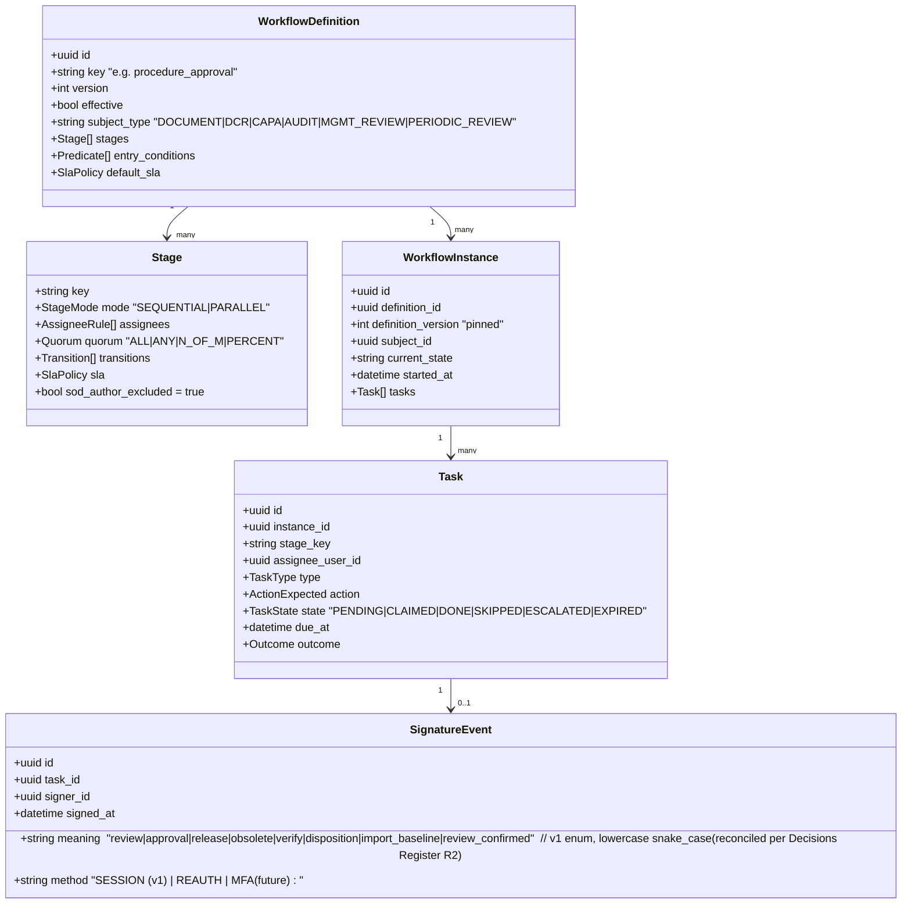
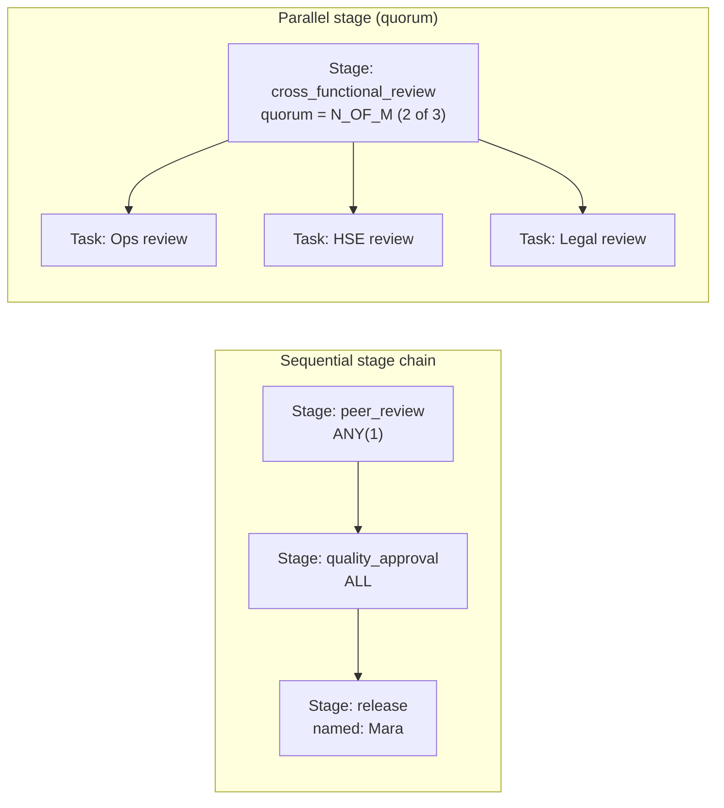
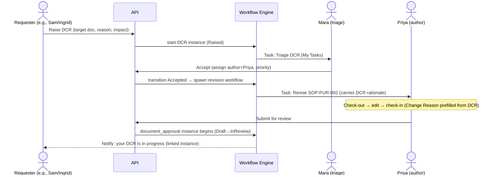

# Workflows, Approvals, Tasks & Notifications

This section specifies the **active machinery** of EasySynQ — the engines that move documented information and quality events through their lifecycles, route work to the right people, hold them accountable with timers, and keep everyone informed without overwhelming them. It defines a single, declarative, configurable **Workflow Engine** that powers every multi-step process in the product (document approval, Document Change Requests, periodic review, internal audit, nonconformity/CAPA, and management review), the per-user **My Tasks** task inbox that is the universal "what do I have to do" surface, and the dual-channel (in-app + email) **Notification System** with templates, digests, escalation timers, and quiet hours. Everything here aligns to the locked decisions: the Controlled Vault is the source of truth, the document lifecycle is `Draft → In Review → Approved → Released/Effective → Obsolete`, approvals are recorded as append-only `signature_event` rows (the Part 11 hook), and authorization is hybrid RBAC+ABAC enforced server-side. Workflows are **data, not code**: every routing rule is a versioned, org-editable definition so that adding standards, signature requirements, or new event types later is additive, never a rewrite.

---

## 1. Foundational Concepts & Vocabulary

We fix this vocabulary before the detail so the rest of the section reads precisely. These terms are used verbatim in the schema, API, and UI.

| Term | Precise meaning in EasySynQ |
|---|---|
| **Workflow Definition** | A declarative, versioned template describing the states, stages, transitions, routing, timers, and notifications for a class of process (e.g., "3-stage Procedure Approval"). Stored as data; org-editable by appropriately-permissioned users. |
| **Workflow Instance** | A live, running execution of a Definition, bound to exactly one subject artifact (a Document version, a CAPA, an Audit, etc.). Carries current stage, history, and pending tasks. |
| **Stage** | A named step within a workflow (e.g., `peer_review`, `quality_approval`). A stage resolves to one or more **Tasks** and a **completion rule** (quorum). |
| **Task** | A unit of work assigned to one identity (user or, transiently, a role-derived candidate pool), with a type, due date, state, and an `action` it expects (Approve/Reject/Acknowledge/Complete/Verify…). The atom of the My Tasks inbox. |
| **Assignee resolution** | The rule that turns "who does this stage" into concrete users at runtime: by **named user**, by **OrgRole** (QMS role, Clause 5.3), by **process attribute** (e.g., "the owner of the subject's primary process"), or by **permission predicate**. |
| **Transition** | A guarded move between states, triggered by a task outcome, a timer, or a system event. Transitions are the only legal way state changes; each writes an audit row. |
| **Quorum** | The completion rule for a parallel stage: `ALL`, `ANY(1)`, `N_OF_M`, or `PERCENT`. Determines when a stage is satisfied. |
| **Escalation** | A timer-driven action (reminder, reassign, notify-manager, auto-decision) that fires when a Task or Stage exceeds an SLA. |
| **Signature Event** | The append-only record of a recorded decision. The `signature_event.meaning` enum (v1, lowercase snake_case) is fixed at `review`, `approval`, `release`, `obsolete`, `verify`, `disposition`, `import_baseline`, `review_confirmed` (`authored` / `responsibility` are reserved for the future Part-11 phase, declared but not emitted in v1) (reconciled per Decisions Register R2). Today: authenticated single-factor click. Tomorrow (Part 11): re-auth + meaning + cryptographic binding. Same row, stricter policy. |
| **OrgRole vs Permission** | Reused verbatim from the domain model: **OrgRole** (Clause 5.3 accountability, e.g., "Quality Manager") drives *assignee resolution and RACI*; **Permission** (RBAC+ABAC) drives *whether the action is allowed at all*. Both are checked: a user must be a resolved assignee **and** hold the permission. |

> **Assumption W1.** The Workflow Engine is **not** a general-purpose BPMN engine (explicit non-goal N7). It is a constrained, declarative state-machine-plus-router tuned to the six QMS process families below. This keeps it auditable, testable, and calm — no arbitrary scripting in production definitions.

> **Assumption W2.** Every workflow-driven state transition of a controlled artifact writes (a) an append-only **audit_trail** row and (b), for decision transitions, a **signature_event** row. Notifications and mirror-sync are *consequences* of the committed transition, never preconditions — a failed email never blocks a release.

> **Assumption W3.** Authorization is layered. The engine resolves *candidate assignees*; the permission engine (deny-by-default RBAC+ABAC, server-side) is consulted at task-claim and action time. A user resolved as a candidate who lacks the permission is dropped from the pool and the resolution is re-evaluated (with an audit note), preventing a workflow from deadlocking on an unauthorized assignee.

---

## 2. The Configurable Workflow Engine

### 2.1 Design goals

1. **Declarative & versioned.** A Definition is JSON/YAML persisted in PostgreSQL (`workflow_definition`, with `version` + `effective` semantics mirroring document lifecycle). Editing a Definition creates a new version; running instances keep the version they started on (instances are *pinned*, exactly like a Record pins its template version).
2. **Composable routing.** Sequential and parallel stages compose freely. A stage is itself parallel-or-sequential; workflows nest at most to the depth our six families need (no recursion).
3. **Conditional.** Routing branches on subject attributes — `document_class` (which resolves to the `document_level` attribute on the `document_type` catalog, values `L1_POLICY` / `L2_PROCEDURE` / `L3_WORK_INSTRUCTION` / `L4_FORM`; reconciled per Decisions Register R7), `process`, `clause_map`, `risk_rating` (the derived/stored `risk_rating` field on `risk_opportunity`, backed by `likelihood` / `severity` / `scoring_method`; reconciled per Decisions Register R18), `requirement_source`, CAPA `severity`, monetary/impact thresholds — via a small, sandboxed predicate grammar (comparisons, `in`, `and/or/not`; no loops, no I/O).
4. **Timed.** Every stage and task can declare SLAs, reminders, and escalations.
5. **Deny-by-default & independence-aware.** Resolution honors separation-of-duties constraints (e.g., **author ≠ approver**, and the **Internal Auditor cannot edit/approve controlled docs** — Ingrid's independence rule).

### 2.2 Core entities (build-ready)



### 2.3 Assignee resolution strategies

| Strategy | Definition syntax (example) | Resolves to | Typical use |
|---|---|---|---|
| **Named user** | `{ "by": "user", "id": "ken.uuid" }` | One fixed person | Small org, a specific approver |
| **OrgRole** | `{ "by": "org_role", "role": "Quality Manager" }` | All holders of that Clause-5.3 role (candidate pool) | "Any QM may approve" |
| **Process attribute** | `{ "by": "process", "attr": "owner", "of": "subject.primary_process" }` | The owning person/role of the subject's process | Diego approves docs for processes he owns |
| **Permission predicate** | `{ "by": "permission", "cap": "document.approve", "scope": "subject.folder" }` | Everyone holding that capability in scope | Broad approver pools |
| **Subject field** | `{ "by": "field", "path": "subject.author.manager" }` | Derived person (e.g., author's line manager via `app_user.manager_id`) | Escalation targets |
| **Initiator's manager** | `{ "by": "manager_of", "ref": "instance.initiator" }` | The starter's manager, resolved via `app_user.manager_id`; falls back to the QM/OrgRole when unset (reconciled per Decisions Register R29) | CAPA escalation |

Resolution rules:
- A **pool** (OrgRole / permission predicate) creates **claimable** tasks (first-claim-wins for `ANY` quorum; one task per member for `ALL`/`N_OF_M`).
- **Separation of duties** filters: `sod_author_excluded` removes the subject's author/last-editor; named SoD predicates (`exclude: subject.author`, `exclude: roles[Internal Auditor]`) are honored. If filtering empties a mandatory stage, the instance enters **`NEEDS_ATTENTION`** and notifies the workflow owner rather than silently skipping (auditability over convenience).

### 2.4 Stage modes & quorum



| Quorum | Stage completes when | Reject behavior (configurable) |
|---|---|---|
| `ALL` | every resolved task is `DONE` with positive outcome | any reject → stage fails (default) |
| `ANY(1)` | first positive outcome | first reject → optional fail, or wait for a positive |
| `N_OF_M` | N positive outcomes reached | if positives can no longer reach N → fail |
| `PERCENT(p)` | ≥ p% positive of resolved tasks | symmetric to N_OF_M |

Outstanding sibling tasks on stage completion are auto-`SKIPPED` (recorded, not deleted), so the audit trail shows who *would have* acted.

### 2.5 Conditional routing (worked example)

A single `document_approval` Definition routes by class and risk:

| Condition (predicate) | Routing effect |
|---|---|
| `subject.document_class == "Work Instruction"` | skip `quality_approval`; peer_review (ANY 1) + process-owner release only — lightweight |
| `subject.document_class in ["Procedure","Process Definition"]` | full 3-stage: peer_review → quality_approval (QM) → release |
| `subject.clause_map contains "5.2"` (Quality Policy) | add `top_management_approval` stage (named: top management OrgRole) |
| `subject.requirement_source == "iso_mandatory" AND subject.risk_rating == "high"` | quorum on quality_approval becomes `N_OF_M(2 of 2)` |

The `subject.risk_rating` routing key resolves against the real **`risk_rating`** field (derived/stored) on the **`risk_opportunity`** entity — backed by the `likelihood`, `severity`, and `scoring_method` fields — rather than an unmodeled attribute (reconciled per Decisions Register R18).

This is the core of "conditional routing by document class/process": one Definition, branch points evaluated against the subject at stage entry. The `document_class` routing key resolves to the explicit `document_level` attribute (`L1_POLICY` / `L2_PROCEDURE` / `L3_WORK_INSTRUCTION` / `L4_FORM`) on the subject's `document_type` (reconciled per Decisions Register R7); e.g. `"Work Instruction"` resolves to `L3_WORK_INSTRUCTION`, and `["Procedure","Process Definition"]` resolve to `L2_PROCEDURE`.

### 2.6 Engine execution semantics

- **Atomic transitions.** Each transition is a single DB transaction: validate guard → write new `current_state` → close/open tasks → append `audit_trail` (+`signature_event` for decisions) → commit. Side effects (notify, mirror-sync, index) are enqueued to Celery **after** commit via an outbox, so they are at-least-once and never block.
- **Idempotency.** Task actions carry a client token; replays are no-ops. Timer firings are guarded by the instance's monotonically-increasing `revision` to avoid double-escalation.
- **Locks.** Editing the subject document still uses the Redis check-in/out lock; the workflow never edits content, only state.
- **Crash safety.** Beat-scheduled `timer_sweep` reconciles due timers from the DB (durable), not from in-memory timers, so a worker restart never loses an escalation.

---

## 3. Document Approval & Document Change Requests (DCR)

### 3.1 The two entry paths

EasySynQ separates *intent to change* from *the change itself*:

| Path | What it is | When used | Produces |
|---|---|---|---|
| **Direct authoring** (UJ-3 / UJ-4) | Author checks out, edits, checks in with a mandatory Change Reason/Summary, then submits the new draft version into the approval workflow | Routine create/revise where the author already has change rights in scope | A new Document **version** that walks `Draft → In Review → Approved → Released` |
| **Document Change Request (DCR)** | A lightweight *request* artifact: "this controlled doc should change, because…", raised by anyone with `changeRequest.create` (incl. read-only employees and auditors who can't edit) | When the requester can't or shouldn't edit, or change must be triaged/prioritized first | A triaged DCR that, when accepted, **spawns** a revision workflow assigning an author |

A DCR is itself a small workflow. It is a **controlled WORKFLOW object** with a **mutable state column** and an **append-only history of stage events** — it is **NOT a `kind=RECORD` immutable artifact** (its closed form is retained as a record-like snapshot) (reconciled per Decisions Register R22). The short form used here (**Raised → Triage → Accepted/Rejected → Linked**) is the user-facing summary of the **canonical DCR lifecycle** `Open → Assessed → Routed → InApproval → Approved → Implemented → Closed` (with terminal states `Cancelled` / `Rejected`): *Raised* maps to `Open`, *Triage* spans `Assessed`/`Routed`/`InApproval`, *Accepted* corresponds to `Approved` (and, on spawning the revision, `Implemented` → `Closed`), and *Rejected* maps to the terminal `Rejected`. On Accept it instantiates the document-revision workflow, carrying the DCR's rationale into the version's Change Reason. This satisfies Ingrid (auditor) and Sam (read-only) being able to *drive* change without breaching their independence/edit boundaries.

### 3.2 Review-and-approve flow (the canonical document workflow)

```mermaid
stateDiagram-v2
    [*] --> Draft: Author checks in (Change Reason required)
    Draft --> InReview: Submit for review
    InReview --> Draft: Changes requested (reject w/ comments)
    InReview --> Approved: All approval stages satisfied (signature_event per approver)
    Approved --> Released: Release (effective now or scheduled date)
    Released --> Draft: Start revision (new draft version; prior stays Effective until new Released)
    Released --> Obsolete: Supersede / withdraw
    Obsolete --> [*]
    note right of Approved
      Each approver decision = append-only
      signature_event (meaning=approval).
      Part 11 hook: add re-auth/MFA later,
      no schema change.
    end note
    note right of Released
      Exactly ONE Released/Effective version
      per document at any time. On Release,
      the prior Effective version becomes
      Obsolete/Superseded and the read-only
      filesystem mirror is rewritten.
    end note
```



Key rules:
- **One Effective version invariant** is enforced at the `Approved → Released` transition inside the same transaction that obsoletes the predecessor.
- **Scheduled effectivity:** `Approved` may carry a future `effective_date`; Beat releases it automatically at that date (a timed transition), notifying subscribers and rewriting the mirror.
- **Reject = "Changes requested"** returns to `Draft` with structured comments captured as tasks for the author; the version number does **not** advance on reject (it advances on the next check-in).
- **Separation of duties:** the author/last check-in user is excluded from approval stages by default (`sod_author_excluded`), configurable only with an explicit, audited override flag.

### 3.3 DCR sequence



> The short-form states shown above (`Raised`, `Triage`, `Accepted`) are the user-facing summary; the engine and data model use the canonical DCR lifecycle `Open → Assessed → Routed → InApproval → Approved → Implemented → Closed` with terminal `Cancelled` / `Rejected`, persisted as a mutable state column plus an append-only stage-event history (reconciled per Decisions Register R22).

---

## 4. Periodic Review (Reminders & Escalation)

ISO 7.5/8.5 expects controlled documents to be kept current. EasySynQ assigns each Document a **review cadence** (e.g., 12/24/36 months, or none for static docs) set at release.

### 4.1 Mechanics

- On `Released`, the system stamps `next_review_due = effective_date + cadence`.
- A nightly Beat job (`periodic_review_sweep`) finds documents crossing reminder thresholds and **creates a `PeriodicReview` task** for the document owner (Diego/process owner or named owner).
- The owner's task offers three outcomes, each audited:

| Outcome | Effect |
|---|---|
| **Confirm still valid** | Re-stamps `next_review_due` for one more cadence; writes a `signature_event(meaning=review_confirmed)` — the lowercase v1 enum value emitted by a periodic review that concludes no change is needed (reconciled per Decisions Register R2). No new version (a "review-only" event is a record, not a revision). |
| **Revise** | Spawns a document-revision workflow (same as UJ-4). |
| **Obsolete** | Routes a supersede/withdraw approval. |

### 4.2 Reminder & escalation ladder (default `SlaPolicy`, org-tunable)

| T (relative to `next_review_due`) | Action | Channel |
|---|---|---|
| **T − 30 days** | Create task + first reminder to owner | In-app + email |
| **T − 7 days** | Reminder #2 to owner | In-app + email |
| **T (due)** | Mark **overdue**; reminder to owner | In-app + email |
| **T + 7 days** | Escalate to owner's manager / Quality Manager | Email (cc owner) |
| **T + 14 days** | Surface on Mara's QMS-health dashboard "overdue reviews" tile; weekly digest entry | Dashboard + digest |

> **Escalation target & business-day resolution (reconciled per Decisions Register R29).** "Owner's manager" resolves against the **`manager_id`** reporting-line FK on **`app_user`**; where it is unset, the escalation **falls back to the QM / OrgRole**. All business-day offsets and SLAs (e.g. the `T ± N days` rows above) are computed against the **`working_calendar`** entity (org holidays / working days), not raw calendar days.

> Periodic review **never** auto-obsoletes a document (explicit non-goal N9 — no automatic compliance judgments). It only nags and escalates; a human always decides.

---

## 5. Internal Audit Workflow (Clause 9.2)

Maps to UJ-5. The **Audit Program** is a *maintained document* (the schedule); each executed **Audit** and its **Findings** are *retained records*. The workflow drives Audit instances; the program is the planning context.

### 5.1 Lifecycle

```mermaid
stateDiagram-v2
    [*] --> Scheduled: Added to Audit Program (scope, auditee process, date)
    Scheduled --> Planned: Lead auditor assigned; plan + checklist prepared
    Planned --> InProgress: Audit opened (opening meeting logged)
    InProgress --> FindingsDraft: Evidence gathered; findings logged
    FindingsDraft --> Reported: Audit report issued (closing meeting)
    Reported --> Closing: All NC findings have linked CAPAs progressing
    Closing --> Closed: All findings dispositioned/CAPAs verified
    Closed --> [*]
    note right of InProgress
      Auditor (Ingrid) has broad READ + can
      log findings, but CANNOT edit/approve
      controlled docs (independence). Enforced
      by permission engine, not goodwill.
    end note
```



### 5.2 Stages, actors, tasks

| Stage | Owner / assignee rule | Tasks created | SLA / escalation |
|---|---|---|---|
| **Schedule** | Quality Manager (Mara) | none yet; entry in Audit Program | program-level annual coverage reminder |
| **Plan** | Lead Auditor (OrgRole, SoD: ≠ auditee process owner) | "Prepare audit plan", "Build checklist (clause/process scoped)" | due 5 days before audit date |
| **Conduct** | Lead Auditor + team | "Conduct audit", per-criterion evidence capture | escalate to QM if not opened by scheduled date + 3d |
| **Findings** | Auditor logs each **Finding** (typed) | one task per finding to classify & describe | findings must be entered ≤ 5d after conduct |
| **Report** | Lead Auditor → auditee acknowledgement | "Issue report", "Auditee acknowledges report" | auditee ack reminder ladder |
| **Close** | Quality Manager | gate: every NC finding's CAPA reached `Verified` | audit stays open; dashboard flags age |

### 5.3 Findings → CAPA bridge

A **Finding** is typed (reusing canonical terms): **Nonconformity (NC)** / **Observation** / **Opportunity for Improvement (OFI)**, each with **severity** and a **clause/process link**.

- Finding of type **NC** → **auto-creates a linked CAPA** in `Raised` state (closing Check→Act), pre-populating NC description, clause, process, and severity. The CAPA's `source = audit` and `source_ref = finding.id` (lowercase source token, consistent with `source=complaint`; reconciled per Decisions Register R16).
- **Observation / OFI** → optional CAPA or improvement initiative; no auto-creation, but a one-click "Raise CAPA/Initiative" from the finding.
- An Audit **cannot reach `Closed`** while any NC-sourced CAPA is unverified — the engine evaluates this gate at the `Closing → Closed` transition, satisfying success metric M2/M3 (full traceability, no orphan NCs).

---

## 6. Nonconformity (NCR) & Corrective Action (CAPA) Workflow (Clause 10.2)

Maps to UJ-6. **CAPA** is EasySynQ's pragmatic unified container (explicitly non-ISO) bundling **NC + Correction + Root Cause + Corrective Action + Verification of effectiveness**. A CAPA is a *retained record* that accretes evidence; corrections to a closed CAPA create a new linked record (`correction_of`), never an in-place edit.

### 6.1 CAPA lifecycle (mermaid)

```mermaid
stateDiagram-v2
    [*] --> Raised: NC captured (source: audit/process/complaint/internal)
    Raised --> Containment: Assess + immediate correction (contain symptom)
    Containment --> RootCause: Correction recorded; begin RCA
    RootCause --> ActionPlan: Cause(s) confirmed (RCA evidence attached)
    ActionPlan --> Implement: Corrective action plan approved
    Implement --> Verify: Actions completed (implementation evidence)
    Verify --> Closed: Effectiveness verified (evidence attached)
    Verify --> ActionPlan: Not effective -> revise plan (loop)
    Raised --> Rejected: Not a valid NC (justified, audited)
    Rejected --> [*]
    Closed --> [*]
    note right of Containment
      Correction = fix the symptom NOW.
      Distinct from Corrective Action
      (eliminate the cause). ISO 10.2.
    end note
    note right of Verify
      CANNOT close without:
      root cause + corrective action +
      effectiveness evidence (M3).
      Effectiveness check is itself a task
      with a due date set after a "soak"
      period to confirm non-recurrence.
    end note
```



### 6.2 Stage-by-stage specification

| Stage | Purpose | Assignee (typical) | Mandatory artifacts to advance | SLA default |
|---|---|---|---|---|
| **Raised** | Capture NC: what requirement was not met, where, severity, source link | Initiator (anyone with `capa.create`) | NC description, clause, process, severity | triage ≤ 2 business days |
| **Containment** | Immediate **correction** to contain the symptom | CAPA owner (often process owner / Diego) | correction description + evidence; or justified "no containment needed" | severity-scaled (Critical ≤ 24h, Major ≤ 3d, Minor ≤ 10d) |
| **Root Cause** | RCA (5-Whys / fishbone — captured as structured text + attachments) | CAPA owner + SMEs | confirmed root cause(s) + RCA evidence | ≤ 10 business days |
| **Action Plan** | Define corrective action(s) to eliminate cause; approve plan | CAPA owner proposes → Quality Manager approves (signature_event) | action items with owners + due dates; approval | ≤ 5 business days |
| **Implement** | Execute action items; each is a trackable sub-task in My Tasks | Action-item owners | completion evidence per action | per action-item due date |
| **Verify** | Confirm **effectiveness** (did it actually prevent recurrence?) | Independent verifier (SoD: ≠ implementer) | effectiveness evidence; verifier decision | verification task scheduled after soak period |
| **Closed** | All above satisfied; CAPA frozen as immutable record | Quality Manager (gate) | gate check passes | — |

### 6.3 Severity-driven routing (conditional)

| Severity | Containment SLA | Root-cause depth required | Action-plan approval | Verification |
|---|---|---|---|---|
| **Critical** | ≤ 24h | full RCA mandatory | QM (ANY) → Top Management (ANY) — **sequential** two-stage | mandatory independent verify + management-review visibility |
| **Major** | ≤ 3 days | full RCA mandatory | QM | mandatory independent verify |
| **Minor** | ≤ 10 days | lightweight cause note allowed | process owner | verify may be same owner if `capa.verify` self-verification is permitted (audited) |

### 6.4 Closure gate (the hard rule)

The `Verify → Closed` transition guard requires, in one evaluation: **root_cause present AND ≥1 corrective_action implemented-with-evidence AND effectiveness_evidence present AND verifier decision = effective**. Failing any clause routes back to `Action Plan` (the effectiveness loop). This directly implements success metric **M3 (100% CAPA traceability)** and the canonical "CAPA must have root cause + action + effectiveness evidence to close."

> **As built (S-capa-3, decisions-register R39 addendum — authoritative on the details).** `POST /capas/{id}/verify` records the `effective`/`not_effective` decision + the `signature_event(meaning=verify)` + the severity-aware SoD-4 check (verifier ∉ implementer set; Critical/Major hard, Minor honours `allow_capa_self_verify`); `POST /capas/{id}/close` runs the M4 gate server-side. Because re-approval is required, the `not_effective` loop routes the FSM through **RootCause** (`Verify→RootCause`, `cycle_marker++`) — a revised plan is re-proposed + re-approved (`RootCause→ActionPlan`) before re-implementing — rather than jumping straight to ActionPlan. An `effective` verification that is missing an evidence clause is a `409 capa_close_incomplete` (not the loop — the recorded verification is not discarded). "Evidence" is a real `evidence_for_link(target_type=capa_stage)` row on the current cycle's Implement/Verify stage; `root_cause` is cycle-agnostic.

### 6.5 Customer-complaint intake → CAPA spawn

A lightweight **Complaint** capture (`record_type=COMPLAINT`, with fields `customer`, `received_at`, `channel`, `description`, `severity`) can **one-click spawn an NCR/CAPA** carrying **`source=complaint`** (reconciled per Decisions Register R16). The spawned CAPA enters the lifecycle at `Raised`, pre-populating its NC description from the complaint `description` and inheriting `severity`; `source_ref` links back to the originating complaint record. This closes the dangling `source=complaint` reference so customer complaints (ISO 9001 8.2.1 / 9.1.2) become a first-class CAPA source alongside `audit`, `process`, and `internal`.

---

## 7. Management Review Workflow (Clause 9.3)

Maps to Mara's ownership. A **Management Review** is a *retained record* (inputs + outputs/decisions). The workflow is cyclical and gathers evidence the system already holds.

### 7.1 Lifecycle & inputs

```mermaid
stateDiagram-v2
    [*] --> Scheduled: Cadence reached (e.g., quarterly/annual)
    Scheduled --> Preparing: Auto-assemble 9.3.2 inputs (evidence pack)
    Preparing --> Convened: Meeting held; attendance + inputs reviewed
    Convened --> Decided: Outputs recorded (decisions, actions, resource needs)
    Decided --> ActionsTracked: Output actions spawned as tracked tasks/CAPAs
    ActionsTracked --> Closed: All review-output actions reach closure
    Closed --> [*]
```



EasySynQ **auto-compiles the Clause 9.3.2 input pack** by querying the live QMS (no manual gathering — supports M1 evidence-pack speed):

| 9.3.2 input | Auto-sourced from |
|---|---|
| Status of prior review actions | previous Management Review's tracked actions |
| Changes in external/internal issues | Context Register (4.1), Interested Parties (4.2) deltas |
| Quality performance / KPIs | KPI/Metric readings (9.1.1) trend tiles |
| Audit results | Internal Audit findings since last review |
| Nonconformities & corrective actions | open/closed CAPAs by severity & age |
| Customer satisfaction | Satisfaction survey records (9.1.2) |
| Process performance & conformity | per-process PDCA health |
| Adequacy of resources | resource/competence gaps flagged |
| Effectiveness of risk actions | Risk & Opportunity Register status (6.1) |
| Improvement opportunities | open OFIs / improvement initiatives (10.3) |

### 7.2 Outputs → closed loop

Each **9.3.3 output** (decisions on improvement, resource needs, changes) is recorded and, where it implies work, **spawns a tracked action or a CAPA**, appearing in the owners' My Tasks. The review reaches `Closed` only when its output actions are closed — making management review a live driver of ACT, not a filed PDF. Outputs that change context/objectives **feed back to Clause 4/6** (the loop the domain model describes).

---

## 8. My Tasks — The Per-User Task Inbox

**My Tasks** (a Home-level nav item, §5.2 of the IA) is the single, universal "what must I do" surface, named **My Tasks** everywhere — the legacy "My Actions" label is retired (reconciled per Decisions Register R23). Every workflow task across all six families lands here — no per-module to-do lists.

### 8.1 What appears

| Task type | Source workflow | Example label |
|---|---|---|
| `APPROVE` / `REVIEW` | Document/DCR approval | "Approve SOP-PUR-002 Rev C" |
| `PERIODIC_REVIEW` | Periodic review | "Review WI-QA-014 (due in 7 days)" |
| `AUDIT_TASK` | Internal audit | "Prepare audit plan: Purchasing" |
| `FINDING_ACK` | Audit report | "Acknowledge audit report A-2026-03" |
| `CAPA_STAGE` | CAPA | "Provide root cause: CAPA-2026-041 (Major)" |
| `CAPA_ACTION` | CAPA implement | "Complete action: update receiving check" |
| `VERIFY` | CAPA / change | "Verify effectiveness: CAPA-2026-038" |
| `MR_INPUT` / `MR_ACTION` | Management review | "Provide KPI commentary for Q2 review" |
| `DCR_TRIAGE` | DCR | "Triage change request DCR-118" |
| `DOC_ACK` (onboarding) | New-joiner / distribution-target entry | "Acknowledge SOP-PUR-002 Rev C (onboarding)" |

### 8.2 Inbox UX (calm, progressive)

- **Grouped by urgency, then PDCA phase**, so the inbox mirrors the mental model: *Overdue → Due soon → Upcoming*, each foldable; a quiet "Done recently" section for reassurance.
- **Each row** shows: artifact identifier + kind chip (Document/Record visual asymmetry preserved), action expected, due-in countdown (RAG), source ("from Audit A-2026-03"), and one-click primary action.
- **Claimable vs assigned:** pool tasks (`ANY`/`N_OF_M`) show a "Claim" affordance; claiming locks it to the user and notifies the pool.
- **Delegation & out-of-office:** a user may delegate a task (audited; delegatee must hold the permission); an OOO setting auto-reassigns/escalates incoming pool tasks.
- **Bulk actions** are deliberately limited (e.g., acknowledge several reads) — *decisions* (approve/verify) are one-at-a-time to keep each `signature_event` deliberate (Part 11 posture).
- **Counts, not noise:** the nav badge shows only **actionable, due/overdue** counts; informational items live in Notifications, not My Tasks. This separation (action vs. awareness) is the core anti-overwhelm decision.

### 8.3 Filters & scope

Filtered by phase (PLAN/DO/CHECK/ACT), type, process, clause, severity, and "delegated to me / by me". Read-only employees (Sam) see only acknowledgement-type tasks; external auditors (Olsen) see no tasks (read-only guest) — both enforced by permission scope, not UI hiding.

### 8.4 New-joiner & distribution-target acknowledgements

When a user **enters any distribution target** — a **role**, a **process**, or a **folder** — the system creates **`DOC_ACK` acknowledgement tasks for the CURRENT `Effective` version** of every document in that target that **requires acknowledgement**, and surfaces them as **onboarding tasks in My Tasks** (reconciled per Decisions Register R15). Already-acknowledged versions are **excluded**, so a transferring employee is not re-prompted for documents they have already signed off; only genuinely new reading obligations appear. This same mechanism covers role-changers (new target entry) as well as brand-new joiners, and is driven off the Effective version so a person never acknowledges a Draft or a superseded copy.

---

## 9. Notification System (In-App + Email)

Notifications are **awareness**; My Tasks is **work**. The two are deliberately distinct. Notifications are best-effort, never gating, and fully governed by per-user preferences.

### 9.1 Channels & delivery

| Channel | Transport | Guarantees | Notes |
|---|---|---|---|
| **In-app** | Stored `notification` rows; SPA polls / SSE | Durable, read/unread, persists | Always on; the bell + center |
| **Email** | Celery → SMTP relay (org-configured, STARTTLS) | At-least-once via outbox; bounces/delivery failures owned (not deferred) | Per-event opt-out; digestable |
| **(future) Webhook** | Reserved hook | — | Non-goal now; event bus is ready |

Email **never** carries controlled content (data stays in the boundary, per architecture): emails contain a summary + a deep link back into EasySynQ. This also keeps PII/IP out of mail archives.

> **Delivery-failure ownership (reconciled per Decisions Register R32).** Email bounce / delivery-failure handling is **owned by the system, not deferred to a non-existent doc**. Every outbound message is tracked through the outbox; on a bounce or SMTP delivery failure the system (a) emits a **`system.email_delivery_failed`** system notification and (b) surfaces the failure on the **Health dashboard (doc 08 §15.6)**, so an undelivered notification never fails silently. Because email is best-effort and never gating, a delivery failure still never blocks a workflow transition.

### 9.2 Event catalog (representative)

| Event key | Trigger | Default in-app | Default email | Digestable | Escalates |
|---|---|---|---|---|---|
| `task.assigned` | A task is assigned/claimed to you | ✓ | ✓ | ✓ | — |
| `task.due_soon` | Task within reminder window | ✓ | ✓ | ✓ | ✓ |
| `task.overdue` | Task SLA exceeded | ✓ | ✓ | ✓ (escalation digest) | ✓ |
| `doc.review_requested` | You are an approver on a new version | ✓ | ✓ | ✓ | ✓ |
| `doc.approved` | A doc you authored/subscribe to is approved | ✓ | — | ✓ | — |
| `doc.released` | New Effective version (subscribers + process readers) | ✓ | opt-in | ✓ | — |
| `doc.changes_requested` | Your submission was rejected with comments | ✓ | ✓ | — | — |
| `dcr.raised` / `dcr.accepted` | DCR lifecycle | ✓ | ✓ | ✓ | — |
| `review.due` | Periodic review window opens | ✓ | ✓ | ✓ | ✓ |
| `audit.scheduled` / `audit.report_issued` | Audit milestones | ✓ | ✓ | ✓ | — |
| `finding.assigned` | A finding/CAPA assigned to you | ✓ | ✓ | ✓ | ✓ |
| `capa.stage_changed` | CAPA you own/follow advances | ✓ | opt-in | ✓ | — |
| `capa.overdue` | CAPA stage SLA exceeded | ✓ | ✓ | ✓ (escalation) | ✓ |
| `mr.scheduled` / `mr.input_requested` | Management review | ✓ | ✓ | ✓ | ✓ |
| `system.backup_failed` / `integrity.alarm` | Admin/ops (Avery) | ✓ | ✓ | — | ✓ |
| `system.email_delivery_failed` | Outbound email bounced / delivery failure (owned by the system; surfaced on the Health dashboard, doc 08 §15.6) | ✓ | ✓ | — | ✓ |
| `guest.access_expiring` | External-auditor grant nearing expiry | ✓ | ✓ | — | — |

> **Scoping:** every notification respects the recipient's permission scope. A `doc.released` notification only reaches users who can read that document/process. External auditors get only events inside their time-boxed scope.

### 9.3 Templates

Each event maps to a versioned **template** with both an in-app form (compact) and an email form (subject + body), localized (i18n-ready, en in v1), with a strict, escaped variable set. Example email template (`doc.review_requested`):

```
Subject: [EasySynQ] Review requested: {{doc.identifier}} {{version.label}}

Hi {{recipient.first_name}},

{{initiator.full_name}} has submitted {{doc.identifier}} — "{{doc.title}}"
({{version.label}}) for your {{stage.role}} review.

  Change reason: {{version.change_reason}}
  Process:       {{doc.primary_process}}
  Due by:        {{task.due_at | date}}

Open in EasySynQ:  {{deep_link}}

You are receiving this because you are a {{stage.assignee_reason}}.
Manage notifications: {{prefs_link}}
```

Templates carry **no document content/attachments** — only metadata and a deep link.

### 9.4 Digests & quiet hours

- **Digest modes (per user, per event class):** `immediate` | `hourly` | `daily` | `weekly` | `off`. Default for action-relevant events = `immediate` in-app + `daily` email; for awareness events = `daily` digest.
- **Daily digest** (Beat-driven, sent at the user's configured local hour) bundles: due/overdue tasks, items awaiting your action, releases in your scope, CAPAs you follow. One calm email instead of many — the primary anti-overwhelm lever for email.
- **Quiet hours & escalation override:** users set quiet hours; **escalation-class** notifications (`*.overdue`, `integrity.alarm`) may pierce quiet hours if the org policy marks them critical.
- **Bundling rule:** identical events to one recipient within a short window collapse ("3 documents released in Purchasing").

### 9.5 Escalation timers (cross-cutting)

Escalation is defined on the `SlaPolicy` of a stage/task and executed by the durable `timer_sweep`:

```mermaid
flowchart TD
    A["Task created with due_at + SlaPolicy"] --> B{Timer sweep (Beat, every N min)}
    B -->|"now ≥ remind_1"| R1["Send reminder #1 to assignee"]
    B -->|"now ≥ remind_2"| R2["Send reminder #2"]
    B -->|"now ≥ due_at"| OV["Mark overdue, notify assignee + dashboard"]
    B -->|"now ≥ escalate_1"| E1["Notify assignee's manager / QM"]
    B -->|"now ≥ escalate_2"| E2["Reassign from pool OR flag NEEDS_ATTENTION"]
    E2 --> AUD["Audit: escalation action recorded"]
```

> **Escalation dependencies (reconciled per Decisions Register R29).** "Assignee's manager" resolves against the nullable **`manager_id`** reporting-line FK on **`app_user`**; when that is unset the escalation **falls back to the QM / OrgRole** (e.g. `org_role: "Quality Manager"`). Every business-day SLA computed by the `timer_sweep` (reminder, overdue, and escalation offsets) is evaluated against the **`working_calendar`** entity (org holidays / working days) so timers do not fire on non-working days.

Escalation never auto-*decides* a quality outcome (no auto-approve of documents, no auto-close of CAPAs — N9). It may reassign, remind, and surface — humans decide. (A future, explicitly-configured "auto-approve trivial WI after N days with QM consent" could plug in via the same timer hook, but is off by default.)

---

## 10. Example Workflow Definition (Declarative)

A complete, build-ready `document_approval` definition showing conditional routing, sequential + parallel stages, quorum, SoD, assignee resolution, SLAs, and notification bindings. Persisted as a versioned row; running instances pin the version.

```yaml
key: document_approval
version: 4
effective: true
subject_type: DOCUMENT
description: >
  Risk- and class-aware approval for maintained documents.
  Routes Work Instructions lightly; Procedures/Process Definitions
  through full quality approval; Quality Policy adds top-management.

entry_conditions:
  - "subject.kind == 'DOCUMENT'"
  - "subject.state == 'Draft'"

default_sla:
  reminders:    ["due_at - 3d", "due_at - 1d"]
  overdue_at:   "due_at"
  escalations:
    - { at: "due_at + 2d", action: notify, target: { by: manager_of, ref: task.assignee } }
    - { at: "due_at + 5d", action: notify, target: { by: org_role, role: "Quality Manager" } }

stages:

  - key: peer_review
    mode: PARALLEL
    sod_author_excluded: true
    assignees:
      - { by: permission, cap: "document.review", scope: "subject.folder" }
    quorum: { type: ANY, n: 1 }
    sla: { due_in: "3 business_days" }
    notify:
      on_enter:    [ doc.review_requested ]
      on_complete: [ task.assigned ]   # to next stage
    transitions:
      - { on: stage_satisfied, to: route_by_class }
      - { on: reject,          to: REJECTED_TO_DRAFT, capture: comments }

  # Conditional fan-out evaluated against the subject
  - key: route_by_class
    mode: ROUTER
    branches:
      - when: "subject.document_class == 'Work Instruction'"
        to: release
      - when: "subject.clause_map contains '5.2'"     # Quality Policy
        to: quality_approval
        then: top_management_approval
      - when: "subject.document_class in ['Procedure','Process Definition']"
        to: quality_approval
      - default: quality_approval

  - key: quality_approval
    mode: PARALLEL
    sod_author_excluded: true
    assignees:
      - { by: org_role, role: "Quality Manager" }
    # high-risk mandatory docs require two approvers
    quorum:
      type: conditional
      rule:
        - when: "subject.requirement_source == 'iso_mandatory' and subject.risk_rating == 'high'"
          quorum: { type: N_OF_M, n: 2, m: 2 }
        - default: { type: ANY, n: 1 }
    sla: { due_in: "5 business_days" }
    signature: { meaning: approval, method: SESSION }   # Part 11 hook -> REAUTH/MFA later (lowercase v1 enum, reconciled per Decisions Register R2)
    notify:
      on_enter: [ doc.review_requested ]
    transitions:
      - { on: stage_satisfied, to: release }
      - { on: reject,          to: REJECTED_TO_DRAFT, capture: comments }

  - key: top_management_approval        # only reached for Quality Policy
    mode: SEQUENTIAL
    assignees:
      - { by: org_role, role: "Top Management" }
    quorum: { type: ALL }
    sla: { due_in: "7 business_days" }
    signature: { meaning: approval, method: SESSION }
    transitions:
      - { on: stage_satisfied, to: release }
      - { on: reject,          to: REJECTED_TO_DRAFT, capture: comments }

  - key: release
    mode: SEQUENTIAL
    assignees:
      - { by: process, attr: owner, of: "subject.primary_process" }
      - { by: org_role, role: "Quality Manager" }      # either may release
    quorum: { type: ANY, n: 1 }
    signature: { meaning: release, method: SESSION }
    effects:
      - obsolete_prior_effective: true     # enforce ONE Effective version
      - rewrite_filesystem_mirror: true
      - set_next_review_due: "effective_date + subject.review_cadence"
    notify:
      on_complete: [ doc.released ]        # to subscribers in scope
    transitions:
      - { on: stage_satisfied, to: RELEASED }

terminal_states:
  - RELEASED
  - REJECTED_TO_DRAFT        # returns subject to Draft, version unchanged
```

Notes on the definition:
- The `subject.document_class` predicates in the `route_by_class` stage resolve to the subject's `document_level` attribute (`L1_POLICY` / `L2_PROCEDURE` / `L3_WORK_INSTRUCTION` / `L4_FORM`) on its `document_type` catalog entry (reconciled per Decisions Register R7); the human-readable class names above are display labels for those levels.
- The `subject.risk_rating` predicate in the `quality_approval` quorum rule resolves against the real `risk_rating` field (derived/stored, backed by `likelihood` / `severity` / `scoring_method`) on the `risk_opportunity` entity (reconciled per Decisions Register R18).
- `ROUTER` stages create no tasks; they only branch (the conditional-routing primitive).
- `signature` blocks declare the `meaning` and current `method` (`SESSION`); flipping the org-level Part-11 flag changes `method` requirements without editing the definition shape.
- `effects` on `release` are the *only* place the one-Effective-version invariant and mirror rewrite are triggered — centralized and auditable.
- The `default_sla` escalation chain (`manager_of` → `org_role: "Quality Manager"`) resolves the manager via `app_user.manager_id` and falls back to the QM/OrgRole when unset; `business_days` SLAs are computed against the `working_calendar` entity (reconciled per Decisions Register R29).
- The same engine + grammar express the DCR, periodic-review, audit, CAPA, and management-review definitions; only `subject_type`, stages, and guards differ.

---

## 11. Permissions, Audit & Extensibility Touchpoints

| Concern | How this section honors the locked decisions |
|---|---|
| **Hybrid RBAC+ABAC** | Assignee resolution produces *candidates*; the deny-by-default permission engine gates *claim* and *action*. OrgRole drives "who is responsible"; permissions drive "who is allowed". Both required. |
| **Separation of duties / independence** | `sod_author_excluded` and named exclusions enforce author≠approver and keep the Internal Auditor (Ingrid) out of edit/approve stages by permission, not convention. |
| **Append-only audit** | Every transition, task action, escalation, delegation, and notification-policy override writes an immutable `audit_trail` row → supports M11 (100% audit-trail completeness). |
| **Part 11 hook** | Each decision = a `signature_event`. v1 `method=SESSION`; future re-auth/MFA + cryptographic binding are additive columns + a stricter policy flag — no workflow rewrite. |
| **Multi-standard** | Conditional routing keys on `clause_map`/`framework_id`, already M:N data. New standards add clause data and (optionally) new Definitions; the engine is unchanged. |
| **Calm UX / progressive disclosure** | My Tasks = work (counts), Notifications = awareness (digests, quiet hours); decisions are deliberate and one-at-a-time; nothing dense surfaces on landing. |
| **Mirror authority** | Only the `release` stage's `rewrite_filesystem_mirror` effect touches the mirror, after commit, vault→mirror only. |

## 12. Success-Metric Linkage

| Metric | Mechanism in this section |
|---|---|
| **M1** evidence/audit-pack assembly < 30 min | Management-review auto-input compilation (§7.1); audit report assembly from logged findings (§5) |
| **M2** zero uncontrolled Effective versions | One-Effective-version invariant enforced in the `release` transaction (§3.2, §10) |
| **M3** 100% CAPA traceability | CAPA closure gate requires root cause + action + effectiveness evidence (§6.4); audit-NC → CAPA auto-link + close gate (§5.3) |
| **M11** 100% audit-trail completeness | Every transition/action/escalation appends an immutable audit row (§2.6, §11) |

---

## 13. Open Items Deferred to Other Sections

- **Full permission capability catalog** and scope-resolution precedence (Permissions doc) — here we only reference capabilities like `document.approve`, `capa.create`, `changeRequest.create` (canonical doc 07 keys; reconciled per Decisions Register R5).
- **Part 11 e-signature detail** (re-auth flows, signature manifest) — only the hook (`signature_event`, `method`) is fixed here.
- **Notification SSE vs polling transport** specifics — implementation detail for the API/Worker docs. (Email deliverability / bounce handling is **no longer deferred**: it is owned here via the `system.email_delivery_failed` notification and the Health dashboard at doc 08 §15.6 — reconciled per Decisions Register R32.)
- **Workflow-definition editor UX** (the admin/QM authoring surface for Definitions) — belongs to the clause-aligned UX/IA doc; this section fixes the underlying data shape and semantics.
