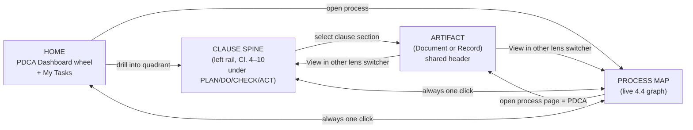

# UI/UX & Design System

This section specifies the **complete user-experience layer** of EasySynQ: the design principles, the navigation model, the visual design language (typography, color, spacing, elevation, motion), the component library, and detailed wireframes for the key screens. Everything here is in service of three non-negotiable product qualities established upstream — the product must be **modern, elegant, and calm**, it must **flow exactly the way ISO 9001:2015 flows** (clause spine + process map + PDCA, the *three lenses, one QMS* from the domain model), and it must use **progressive disclosure** so a user is never confronted with the entire standard, every permission, or every record at once. The visual system is built on the locked stack — **React + TypeScript, Mantine components, Tailwind design tokens, TanStack Query, OpenAPI client** — and binds to the locked NFRs, above all **WCAG 2.2 Level AA**. The single most load-bearing UX rule is inherited verbatim from the domain model: **Documents (maintained) and Records (retained) must feel visually different** — the UI *teaches* the maintain/retain distinction by making the two genuinely different to look at and to touch.

---

## 1. Design Principles

These ten principles are the rubric every screen is measured against. They are ordered; when two conflict, the lower number wins.

| # | Principle | What it means concretely | How we verify it |
|---|---|---|---|
| **DP-1** | **Flow like the standard** | Every primary surface is one of the three canonical lenses — **Clause spine**, **Process Map**, **PDCA Dashboard** — never a generic "files & folders" tree. Nav groups clauses under PLAN/DO/CHECK/ACT banners (inherited from domain §5.2). | A Quality Manager recognizes their QMS in < 60 s without training. |
| **DP-2** | **Calm by default** | Landing surfaces show **status/health**, not data dumps. Counts and RAG (Red/Amber/Green) first; detail one click deeper. Generous whitespace, restrained palette, at most one accent action per region. | No landing screen exceeds ~7 primary regions; no list shows > 25 rows before pagination. |
| **DP-3** | **Progressive disclosure** | Home → lens → cluster → artifact → version/record. Each step reveals only what is needed. Dense detail lives behind drawers, accordions, "Show more," and tabbed detail panels — never on the first paint. | Every key screen documents its disclosure ladder (see per-screen sections). |
| **DP-4** | **Maintain vs Retain is visible** | Documents = version timeline + **Effective** badge + check-in/out + approval chip. Records = lock icon + **captured-at** stamp + retention countdown + **no edit button**. Two visually distinct artifact "skins." | A user can tell a Document from a Record at a glance, with color removed. |
| **DP-5** | **One artifact header everywhere** | Regardless of lens, every artifact shows the same header: identifier, kind, clause map, owning process(es), state/version, owner, and a **"View in [other lens]"** cross-lens switcher (domain §5.4). | The header component is a single shared React component, lens-agnostic. |
| **DP-6** | **Deny-by-default, show-what-you-can-do** | The UI never shows controls the server-side AuthZ would reject. Permissions (hybrid RBAC+ABAC) gate affordances; absent rights yield *quiet absence or a clear "request access,"* never a dead button. | No action a user lacks permission for is rendered as an enabled control. |
| **DP-7** | **Accessible as a baseline, not a retrofit** | WCAG 2.2 AA throughout: full keyboard operability, visible non-obscured focus, ≥ 4.5:1 text contrast, ≥ 24×24 px targets, `prefers-reduced-motion` respected, ARIA on every custom widget. | axe-core CI gate + NVDA/VoiceOver manual passes per release (NFR §11). |
| **DP-8** | **Restrained, meaningful motion** | Motion communicates causality and state change (drawer slide, row commit, stepper advance) — never decoration. Default durations 120–240 ms; all motion collapses to instant under reduced-motion. | Motion tokens are the only animation source; no ad-hoc transitions. |
| **DP-9** | **Trust through transparency** | Audit trail, "who/when/why," and immutability are always one click away and never hidden. Destructive/irreversible actions (obsolete, dispose, release) require typed or explicit confirmation and state the consequence. | Every state transition surfaces its audit consequence before commit. |
| **DP-10** | **Extension-ready, not over-built** | Signature hooks, multi-standard clause labels, and e-sig confirmation dialogs are designed as **slots** (placeholders) so Part 11 and extra standards are additive (non-goals N1/N2). v1 renders the slot's 9001 single-factor form. | Approval dialog is a component with a pluggable "signature step" region. |

---

## 2. Navigation Model

EasySynQ navigation is the **three lenses over one QMS** made concrete. There is exactly one persistent application shell; lenses are routes within it, not separate apps.

### 2.1 Application shell (layout regions)

```
┌──────────────────────────────────────────────────────────────────────────┐
│  TOP BAR                                                                   │
│  [≡] EasySynQ   [ Global Search ⌘K ............... ]   [PLAN▸DO▸CHECK▸ACT] │
│                                          [Acks •2] [Tasks •5] [Avery ▾]    │
├───────────────┬────────────────────────────────────────────────────────── ┤
│  LEFT RAIL    │  BREADCRUMB + CLAUSE CHIP                                   │
│  (clause      │  Home › DO › Operation (Cl.8) › Production & Service       │
│   spine,      ├──────────────────────────────────────────────────────────  ┤
│   grouped     │                                                            │
│   by PDCA)    │   MAIN CONTENT REGION (the active lens / screen)           │
│               │                                                            │
│  Home         │                                          ┌───────────────┐ │
│  ─ PLAN ─     │                                          │  DETAIL       │ │
│  ─ DO ─       │                                          │  DRAWER       │ │
│  ─ CHECK ─    │                                          │  (slides in   │ │
│  ─ ACT ─      │                                          │   on select)  │ │
│  ─ LIBRARY ─  │                                          └───────────────┘ │
│  ─ ADMIN ─    │                                                            │
└───────────────┴────────────────────────────────────────────────────────── ┘
```

| Region | Contents | Behavior |
|---|---|---|
| **Top bar** | App menu/rail toggle, **Global Search (⌘K / Ctrl-K)**, a compact **PDCA progress indicator**, Acknowledgements bell, My Tasks bell, user/account menu | Sticky. PDCA indicator is a calm, non-interactive "where the QMS is in its cycle" cue. |
| **Left rail** | The clause spine grouped under **PLAN / DO / CHECK / ACT** banners, plus Home, Library, Admin (domain §5.2 nav verbatim) | Collapsible to icon rail (≤ tablet auto-collapses). Active section highlighted; banner group is a non-collapsible visual divider, sections within are expandable. |
| **Breadcrumb + clause chip** | Path trail with a **clause chip** (e.g., `Cl. 8.5`) that is itself a link to the clause catalog entry | Always reflects the lens path; clause chip opens the read-only clause reference in a drawer. |
| **Main content** | The active lens/screen | Single scroll context; never two competing scroll regions. |
| **Detail drawer** | Right-side panel for artifact detail, tasks, or contextual help | Slides in over content (does not navigate away); ESC or click-scrim closes; deep-linkable via URL. |

### 2.2 The three lenses and how the user moves between them



**Rule (DP-5):** the artifact header is identical across all three lenses, so switching lenses never feels like changing applications. The **cross-lens switcher** in the header reads, e.g., *"Open in Process Map"* / *"View clause 8.5"* / *"Show in PDCA"*.

### 2.3 PDCA-oriented Home dashboard (the calm landing)

The Home dashboard is a **PDCA wheel** with four quadrants. Each quadrant shows **only counts and RAG status** (DP-2). Drilling into a quadrant opens the relevant clause section, pre-filtered (progressive disclosure DP-3). The signals surfaced per quadrant are inherited from domain §5.3 (Plan: objectives off-target, overdue reviews; Do: pending approvals, checked-out drift risk; Check: overdue audits, KPI breaches; Act: open/overdue CAPAs).

### 2.4 Global search

Global search (⌘K) is a single **command-and-search palette**, the fastest path to any artifact and the keyboard entry point for power users.

| Feature | Behavior |
|---|---|
| **Scope** | Documents, Records, Processes, Clauses, People/Roles, and Commands ("New procedure," "Go to CAPA board"). |
| **Backing** | OpenSearch (faceted, highlighted); **Postgres FTS fallback** with a non-blocking "Search running in reduced mode" banner if OpenSearch is down (degradation path from arch §11). |
| **Facets** | Kind (Document/Record), state, clause, process, PDCA phase, owner, requirement source (iso_mandatory/org_determined). |
| **Progressive disclosure** | Empty palette shows recent items + suggested commands; typing reveals grouped results (max 5 per group, "see all N" expands to the full filtered Library view). |
| **Permission-aware** | Results the user cannot read are omitted server-side (DP-6); a count footer notes "*N results hidden by your access scope*" only when relevant. |
| **A11y** | `role="combobox"` + `aria-activedescendant`; arrow-key navigation; results announced via a polite live region; ESC closes and restores focus to the trigger. |

---

## 3. Visual Design Language

The aesthetic target is **clinical-calm**: lots of quiet neutral space, a single restrained accent, and color reserved almost entirely for *meaning* (status), not decoration. Tokens are expressed as **CSS variables** consumed by both Tailwind (utility layer) and Mantine (theme object), so a single source drives both and re-theming (or a future multi-standard skin) is a token change, not a rebuild.

### 3.1 Typography

A single, highly legible sans (Inter, self-hosted — no outbound font fetch, honoring the no-telemetry posture) plus a monospace (JetBrains Mono) for identifiers, diffs, hashes, and code.

| Token | rem / px (base 16) | Weight | Line height | Use |
|---|---|---|---|---|
| `font-display` | 2.0 rem / 32 | 600 | 1.2 | Page titles (one per screen) |
| `font-h1` | 1.5 rem / 24 | 600 | 1.25 | Section headers |
| `font-h2` | 1.25 rem / 20 | 600 | 1.3 | Card / panel titles |
| `font-h3` | 1.0625 rem / 17 | 600 | 1.4 | Sub-headers, drawer titles |
| `font-body` | 1.0 rem / 16 | 400 | 1.5 | Default body text |
| `font-body-sm` | 0.875 rem / 14 | 400 | 1.45 | Secondary text, table cells (comfortable) |
| `font-caption` | 0.8125 rem / 13 | 500 | 1.4 | Metadata, timestamps, helper text |
| `font-overline` | 0.6875 rem / 11 | 600 | 1.3 | Eyebrow labels (UPPERCASE, +0.06em tracking), e.g., clause chips |
| `font-mono` | 0.875 rem / 14 | 400 | 1.5 | `SOP-PUR-002`, SHA-256, diff text |

Rules: body never below 14 px; identifiers always monospace so doc codes are scannable; max line length ~75ch for prose blocks (clause text, change reasons).

### 3.2 Color system

Two complete themes (**light** and **dark**) generated from the same token names; the renderer chooses by `data-theme` plus `prefers-color-scheme`. All pairings below meet **WCAG 2.2 AA** (≥ 4.5:1 for text, ≥ 3:1 for large text and UI boundaries).

**Neutral & brand ramp (light theme shown; dark inverts L\*):**

| Token | Light | Role |
|---|---|---|
| `--bg-canvas` | `#F7F8FA` | App background (calm off-white) |
| `--bg-surface` | `#FFFFFF` | Cards, panels |
| `--bg-sunken` | `#EEF0F4` | Wells, table header, code blocks |
| `--border-subtle` | `#E2E5EB` | Hairlines |
| `--border-strong` | `#C4C9D4` | Inputs, focus container |
| `--text-primary` | `#1A1D23` | Primary text (15.8:1 on surface) |
| `--text-secondary` | `#5A6172` | Secondary text (7.0:1) |
| `--text-tertiary` | `#8A91A0` | Disabled/placeholder (meets 3:1 non-text only) |
| `--accent` | `#2A6FDB` | Single brand accent (primary actions, links, active nav) |
| `--accent-hover` | `#1F58B5` | Accent hover/active |
| `--focus-ring` | `#2A6FDB` @ 3px, 2px offset | Focus indicator (never removed) |

**Semantic status colors for DOCUMENT states** — these are the lifecycle states from the canonical state machine (Draft → In Review → Approved → Released/Effective → Obsolete). Each state has a token used consistently in badges, timelines, and dashboards. **Color is never the only signal** (DP-7): each state also carries an icon and a text label.

| Document state | Token | Light hex | Icon | Meaning |
|---|---|---|---|---|
| **Draft** | `--state-draft` | `#8A91A0` (slate) | ✎ pencil | Editable working version, not controlled-effective |
| **In Review** | `--state-review` | `#B26A00` (amber) | ◔ clock-circle | Submitted; awaiting reviewer/approver decision |
| **Approved** | `--state-approved` | `#2E6FAE` (blue) | ✓ check | Decision recorded; awaiting effective date/release |
| **Released / Effective** | `--state-effective` | `#1F8A52` (green) | ★ filled-star / shield | The single governing version (one per document) |
| **Obsolete / Superseded** | `--state-obsolete` | `#6B7280` on hachure | ⊘ slash | Retained, read-only, not governing |

**Semantic status for RECORDS** — records do not have lifecycle states; they have **retention status**, which is its own visual family to reinforce DP-4:

| Record status | Token | Light hex | Icon | Meaning |
|---|---|---|---|---|
| **Captured (locked)** | `--rec-locked` | `#374151` (graphite) | 🔒 lock | Immutable evidence, within retention |
| **Retention expiring** | `--rec-expiring` | `#B26A00` (amber) | ⏳ hourglass | Retention countdown < threshold |
| **Disposed** | `--rec-disposed` | `#6B7280` muted | 🗑 strike | Disposed per policy (audited event) |
| **Correction-of** | `--rec-correction` | `#2E6FAE` (blue) | ⤺ link | Supersedes a prior record via `correction_of` chain |

**Feedback colors** (toasts, banners, validation): `--success #1F8A52`, `--warning #B26A00`, `--danger #C2334A`, `--info #2A6FDB`. RAG dashboard semantics map to success/warning/danger.

> **Why a separate Document-state family and Record-status family?** It is the visual encoding of the maintain/retain rule (DP-4). A user scanning the Library can tell, *with color removed* (icon + label + position), whether they are looking at a living document or frozen evidence — the core teaching goal of the domain model.

### 3.3 Spacing, layout grid & density

- **Base unit:** 4 px. Spacing scale: `4, 8, 12, 16, 24, 32, 48, 64` (tokens `space-1`…`space-8`). Component padding and gaps draw only from this scale.
- **Layout grid:** 12-column fluid grid, max content width **1440 px**, gutters `space-4` (16). Reading-centric pages cap prose at `--measure: 75ch`.
- **Shell metrics:** top bar 56 px; left rail 264 px expanded / 64 px collapsed; detail drawer 420 px (resizable 360–640), full-width sheet on mobile.
- **Density modes:** tables support **Comfortable** (default, 48 px rows) and **Compact** (36 px rows) — a per-table, persisted user choice (see §4.2). Density never drops the 24×24 px minimum target size for interactive cells (WCAG 2.2 Target Size).

### 3.4 Elevation

A restrained 4-step elevation ramp; surfaces are distinguished primarily by **border + background**, with shadow used sparingly to signal "floats above."

| Token | Use | Light shadow |
|---|---|---|
| `elev-0` | Flush surfaces, table rows | none, `--border-subtle` only |
| `elev-1` | Cards, panels | `0 1px 2px rgba(16,24,40,.06)` |
| `elev-2` | Drawers, popovers, dropdowns | `0 8px 24px rgba(16,24,40,.12)` |
| `elev-3` | Modals, command palette, e-sig dialog | `0 16px 48px rgba(16,24,40,.18)` + scrim |

Dark theme uses lighter surface tints rather than heavier shadows (shadows read poorly on dark); elevation is conveyed by `+L*` surface steps.

### 3.5 Motion

| Token | Duration | Easing | Use |
|---|---|---|---|
| `motion-fast` | 120 ms | `ease-out` | Hover, focus, small toggles |
| `motion-base` | 180 ms | `cubic-bezier(.2,.0,.2,1)` | Drawer/panel slide, accordion |
| `motion-emphasis` | 240 ms | `cubic-bezier(.2,.0,0,1)` | Stepper advance, row commit, state badge flip |
| `motion-stagger` | 40 ms/item, cap 6 | — | Skeleton-to-content reveal |

**Reduced motion:** when `prefers-reduced-motion: reduce`, all of the above collapse to a 0 ms cross-fade (or instant), and the staggered skeleton reveal becomes a single fade. Motion never conveys information that is not also available statically (DP-8).

---

## 4. Component Library

Components are Mantine primitives wrapped in EasySynQ design-token theming, plus a small set of bespoke domain components. Each bespoke component lists its states, props of note, and a11y contract.

### 4.1 Cards

Used on dashboards and cluster landing pages. Anatomy: optional eyebrow (clause/PDCA chip) → title → primary metric/RAG → supporting line → optional footer action.

| State | Treatment |
|---|---|
| Default | `elev-1`, `--bg-surface`, hover lifts to `elev-2` only if interactive |
| Loading | Skeleton lines matching final layout (no spinner-in-card) |
| Empty | Centered icon + one-line guidance + single primary action |
| RAG | Left 3 px status bar in success/warning/danger; the color is mirrored by an icon + label |

### 4.2 Density-adaptive tables

The workhorse for Library, audit findings, CAPA lists, records, version lists.

- **Columns:** user-reorderable, hideable; a persisted view per table.
- **Density toggle:** Comfortable/Compact (§3.3), persisted per user per table.
- **Row affordances:** entire row is a click target opening the **detail drawer** (not a full navigation), with an explicit chevron for screen-reader/keyboard clarity.
- **Bulk actions:** checkbox column reveals a context action bar (e.g., "Export selected," "Map to clause") only when ≥ 1 row selected.
- **Maintain/Retain skinning:** in mixed lists, the kind column shows the Document badge family or Record badge family (§3.2) so the two never blur.
- **Sorting/filtering:** column header menus; active filters render as removable chips above the table (the "filter shelf").
- **Pagination:** cursor-based, 25/50/100 page sizes; sticky header; virtualized body for large sets.
- **A11y:** native semantic `<table>` with `scope`, `aria-sort` on sorted headers, row selection announced, full keyboard (arrow to cell, Enter opens drawer, Space toggles selection).

### 4.3 Detail side-panel / drawer

The primary progressive-disclosure mechanism. Selecting any artifact opens a right drawer **without leaving the list**, so the user keeps context.

- **Header:** the shared **artifact header** (DP-5) — identifier (mono), kind badge, clause chips, process links, state/version, owner, cross-lens switcher.
- **Body:** tabbed (Overview / History / Where-used / Acknowledgements / Audit) — tabs lazy-load (TanStack Query) so opening a drawer never fetches everything at once.
- **Footer:** context actions gated by permission (DP-6).
- **Behavior:** resizable; deep-linkable (`?artifact=SOP-PUR-002`); ESC closes; focus trapped while open; on close, focus returns to the originating row. A drawer can promote to a **full page** via a "⤢ Open full" affordance for deep work (editor, redline).

### 4.4 Wizards / steppers

For First-Run Setup, Ingestion Review, New Document, and CAPA creation.

- **Pattern:** horizontal stepper (vertical on mobile) with numbered steps, current/complete/upcoming states, and a **persistent progress + "Save & exit"** so long flows are resumable.
- **One decision cluster per step** (DP-3): never more than a screenful; "Next" disabled until the step validates, with inline reasons.
- **Review step:** every wizard ends with a read-only summary before commit (DP-9).
- **A11y:** `aria-current="step"`, step list is a labeled `nav`, validation errors focus-managed to the first invalid field with `aria-describedby`.

### 4.5 Status badges

Two badge families (Document state, Record status) from §3.2, plus generic feedback chips.

- Anatomy: icon + label, pill shape, `font-overline` text, status token background at low alpha with full-strength text/border for contrast.
- The **Effective ★** badge is visually the strongest (filled, slight glow) because "which version governs?" is the single most important question in document control.
- Badges are never icon-only in primary contexts (label always present for a11y); icon-only is allowed only in dense cells with an accessible name via `aria-label` + tooltip.

### 4.6 Revision-history timeline

The signature visual for a **Document**.

```
┌ Version history ──────────────────────────────────────────┐
│  ● Rev D  ★ Effective   2026-04-02  Ken (approved)         │
│  │        "Updated PPE section after audit AF-118"         │
│  │        [ Compare ▾ ]  [ View ]                          │
│  ○ Rev C  ⊘ Obsolete    2025-09-10  Ken                    │
│  │        "Annual review; no functional change"            │
│  ○ Rev B  ⊘ Obsolete    2024-08-01  Mara                   │
│  ○ Rev A  ⊘ Obsolete    2023-06-15  Mara (initial release) │
└────────────────────────────────────────────────────────────┘
```

- Vertical timeline, newest first; Effective node visually dominant; obsolete nodes muted but fully retrievable (read-only).
- Each node: rev label + state badge + date + actor + **mandatory change reason** (the Change Reason/Summary captured at check-in).
- Inline **Compare** picks any two versions → opens the redline/diff viewer.
- Progressive disclosure: collapsed to the latest 3 with "Show all N versions."

### 4.7 Redline / diff viewer

Compares two immutable versions.

| Mode | Behavior |
|---|---|
| **Text redline** | Word-level inline diff (insertions underlined/green, deletions struck/red) for text-extractable renditions; not color-only — insert/delete carry `ins`/`del` semantics and markers. |
| **Side-by-side** | A single image pane with a Before/After/Diff layer toggle + a changed-page rail (the worker-async page-image diff; S-web-4b). |
| **Metadata diff** | A table of changed control fields (owner, clause map, retention, etc.). |

- Header pins which two versions (e.g., `Rev C → Rev D`), the change reason of the newer, and approver.
- Keyboard: `n`/`p` jump to next/previous change; changes also listed in a navigable side index for screen-reader users.

### 4.8 Breadcrumb + clause map

- **Breadcrumb:** Home › PDCA banner › Clause section › Artifact, each segment a link; the trailing **clause chip** (`Cl. 8.5`) opens the **read-only clause catalog** entry in a drawer (intent text, mandatory ★ items, mapped artifacts) — the spine made reachable from anywhere.
- **Clause map (mini):** on an artifact, a compact chip row of all mapped clauses (M:N); on the Compliance Checklist, the full ★-coverage matrix.

### 4.9 Component-wide states: empty, loading, error

| State | Standard treatment |
|---|---|
| **Empty** | Friendly one-illustration + one-sentence explanation of *what goes here* + a single primary action (e.g., "No procedures yet — Author the first one"). For permission-empty: "Nothing here is in your access scope" + "Request access." Never a blank region. |
| **Loading** | **Skeletons** that match final layout (cards → card skeletons, tables → row skeletons), revealed via `motion-stagger`. Spinners only for in-place actions < 1 region (e.g., a button). Long async jobs (render, import, export) show a **progress affordance with phase labels**, never a frozen UI (NFR: long ops are async). |
| **Error** | Inline, scoped, recoverable: a banner within the affected region (not a full-screen takeover) stating what failed, the likely cause, and a **Retry**. Degraded-dependency errors (OpenSearch down, renderer down) are **non-blocking banners** that explain the reduced mode (search fallback; previews queued) per arch §11. Validation errors are inline at the field. |

---

## 5. Key Screen Wireframes

Each screen below specifies: layout, the progressive-disclosure ladder, and notable states. Wireframes are ASCII sketches; they describe structure, not pixel-perfect visuals.

### 5.1 Home / QMS Dashboard (PDCA wheel)

```
Home › Dashboard                                    [ Density ▾ ] [ ? Help ]
────────────────────────────────────────────────────────────────────────────
QMS Health        ●  Certified-ready          Next mgmt review: 18 days
────────────────────────────────────────────────────────────────────────────
        ┌─────────────────────────┐   ┌─────────────────────────┐
        │  PLAN            (Cl 4–7)│   │  DO            (Cl 7–8)  │
        │  ● 6/7 objectives on tgt │   │  ▲ 3 docs pending appr.  │
        │  ▲ 2 reviews overdue     │   │  ▲ 1 checked-out 9d (drift│
        │  ● 0 high risks open     │   │      risk)               │
        │            [ Open ▸ ]    │   │           [ Open ▸ ]     │
        └─────────────────────────┘   └─────────────────────────┘
        ┌─────────────────────────┐   ┌─────────────────────────┐
        │  CHECK           (Cl 9)  │   │  ACT          (Cl 10)    │
        │  ● next audit in 12d     │   │  ▲ 4 CAPAs open          │
        │  ● 1 KPI breach          │   │  ✕ 1 corrective action   │
        │                          │   │      overdue             │
        │            [ Open ▸ ]    │   │           [ Open ▸ ]     │
        └─────────────────────────┘   └─────────────────────────┘
────────────────────────────────────────────────────────────────────────────
My Tasks (5)            Process Map ▸            Compliance Checklist ▸
  ◔ Review SOP-PUR-002 (you, due 2d)
  ✓ Approve WI-PRD-014
  ⚑ CAPA-2026-031 root cause due tomorrow            [ See all my tasks ▸ ]
```

- **Disclosure ladder:** wheel shows **counts + RAG only** → "Open ▸" enters the pre-filtered clause section → artifact drawer → version/record. Nothing dense on this surface (DP-2).
- **My Tasks** preview shows top 3; full list one click away.
- **Empty/first-run:** if the QMS is freshly set up, the wheel shows guidance cards ("Define your Scope," "Add your first Process") that route into the relevant clause section.
- **Loading:** four card skeletons + a task-list skeleton.
- **A11y:** the wheel is a `nav` of four labeled regions; RAG conveyed by icon (●/▲/✕) + text, not color alone.

### 5.2 Document Library / Explorer

```
Library › All Documents                       [ + New Document ]  [ ⌘K ]
────────────────────────────────────────────────────────────────────────────
Filters:  [Kind: Document ✕] [Clause: 8.x ▾] [State ▾] [Process ▾] [Owner ▾]
Active filter shelf:  ( State: Effective ✕ )  ( Process: Order Fulfilment ✕ )
────────────────────────────────────────────────────────────────────────────
☐  Identifier      Title                     State        Clause   Rev  Owner
──────────────────────────────────────────────────────────────────────────── 
☐  SOP-PUR-002     Purchasing Procedure      ★ Effective  8.4      D    Diego
☐  WI-PRD-014      Final Inspection WI       ◔ In Review  8.6      —    Priya
☐  SOP-PRD-007     Production Control SOP     ✎ Draft      8.5      —    Priya
☐  FRM-CAL-003     Calibration Log Template   ★ Effective  7.1.5    B    Mara
                                            [ Comfortable | Compact ]
                                            ◂ 1 2 3 … ▸   [25 ▾] per page
```

- **Maintain/Retain split:** "All Documents" and "All Records" are separate Library entries (domain §5.2). A Document list uses the Document-state badge family; the Records list uses retention-status badges + lock icons + **no New/Edit affordance on rows**.
- **Disclosure ladder:** list (metadata only) → click row → **detail drawer** (Overview tab) → tabs reveal History/Where-used/etc. on demand.
- **Filter shelf:** active filters as removable chips; advanced filters behind a "Filters ▾" disclosure, not all expanded.
- **Empty:** "No documents match these filters" with a "Clear filters" action; truly empty store shows the first-document guidance.
- **A11y:** semantic table, `aria-sort`, selection announcements, keyboard row-open.

### 5.3 Document Detail (history + approvals + where-used + acknowledgements)

Opens as a drawer from any list; promotable to full page. Tabbed body keeps the surface calm.

```
┌ SOP-PUR-002  ·  Purchasing Procedure ───────────────── [⤢ Full] [✕] ┐
│ [Document]  ★ Effective Rev D   Clause: 8.4  Process: Purchasing      │
│ Owner: Diego (Process Owner)        [ View in Process Map ▾ ]         │
├──────────────────────────────────────────────────────────────────────┤
│ ( Overview ) ( History ) ( Approvals ) ( Where-used ) ( Acks ) (Audit)│
├──────────────────────────────────────────────────────────────────────┤
│  Overview                                                             │
│   Effective since 2026-04-02 · Next review due 2027-04-02            │
│   Requirement source: ISO mandatory ★                                 │
│   [ Preview ]  [ Check out to revise ]  [ Download (controlled) ]     │
│                                                                        │
│  ▸ History (4 versions)        ← collapsed; expands to §4.6 timeline   │
│  ▸ Approvals: Ken approved 2026-04-02 (single-factor) [signature slot]│
│  ▸ Where-used: 2 processes · instantiates FRM-PUR-009 · 3 records     │
│  ▸ Acknowledgements: 41/52 staff have read current rev  [ Remind ▾ ]   │
└──────────────────────────────────────────────────────────────────────┘
```

- **Approvals tab** renders the approval decision and the **signature slot** (DP-10): v1 shows "Approved by Ken, 2026-04-02, logged-in approval"; the slot is where Part 11 e-sig (re-auth + meaning) drops in later — no redesign.
- **Where-used** answers "what depends on this?" — processes, child work instructions, the form it is, and records produced from it (each version-pinned, domain §4.2).
- **Acknowledgements** shows read-coverage of the current effective rev with a "Remind" action (acknowledgement is how Clause 7.3 awareness is evidenced).
- **Disclosure ladder:** header + Overview first; History/Approvals/Where-used/Acks are collapsed accordions or lazy tabs.
- **Record variant:** when the artifact is a **Record**, this same shell renders the Record skin — lock icon, captured-at, captured-by, retention countdown, "View source document version" link, `correction_of` chain if any, and **no Check-out / no Edit** (DP-4).

### 5.4 Document Editor / Check-out

EasySynQ is not an in-app rich editor (non-goal N4); editing is **governed check-out → external edit → check-in**, and this screen orchestrates that.

```
SOP-PUR-002 · Check out to revise                              [ Cancel ]
────────────────────────────────────────────────────────────────────────────
You are about to lock this document for editing.
  • Current effective: Rev D  ·  New working version: Rev E (draft)
  • While checked out, others cannot edit; they still see Rev D as effective.
  • Lock holder: Priya · auto-expires in 8h (extendable)

Step 1 — Get the working file
   [ Download working copy (.docx) ]      ← presigned, content-addressed

Step 2 — Edit it in your tool, then check it back in
   ┌ Check in ─────────────────────────────────────────────────────────┐
   │ Upload revised file:   [ Drop file or browse ]                     │
   │ * Change Reason / Summary (required):                              │
   │   [ Updated PPE section after audit AF-118 ........................]│
   │ Clause mapping unchanged (8.4)  [ edit ▾ ]                          │
   │ [ Check in as Draft Rev E ]   (then submit for review separately)  │
   └────────────────────────────────────────────────────────────────────┘
```

- **Lock model:** Redis distributed lock (arch §6.1) surfaced as a clear banner: who holds it, when it expires, extend/release controls. If already locked, the action is replaced by "Locked by Priya since 09:14 — Request unlock" (DP-6, no dead button).
- **Mandatory Change Reason:** check-in is blocked until the reason/summary is entered (canonical lifecycle rule). Inline validation, focus-managed.
- **Disclosure ladder:** two numbered sub-steps; clause-map and retention edits are behind "edit ▾" (most check-ins don't touch them).
- **States:** upload progress bar; render/index runs async post-check-in with a quiet "Generating preview…" chip (never blocks).
- **A11y:** drag-drop has a keyboard-accessible browse fallback; required field announced; lock-expiry is a polite live-region update.

### 5.5 Review / Approve Task

The reviewer/approver's focused decision surface (reached from My Tasks or notification).

```
Task › Review SOP-PUR-002  Rev E (draft)              Assigned to: Ken
────────────────────────────────────────────────────────────────────────────
┌ What changed ─────────────────────┐  ┌ Decision ───────────────────────┐
│  Rev D → Rev E   redline:          │  │  ( ) Approve                     │
│   + Added section 6.3 (PPE)        │  │  ( ) Request changes             │
│   - Removed obsolete form ref      │  │  ( ) Reject                      │
│   Change reason: "Updated PPE      │  │                                  │
│   section after audit AF-118"      │  │  Comment (required if not        │
│   [ Open full redline ⤢ ]          │  │  Approve):                       │
│                                    │  │  [ ............................ ]│
│  Clause map: 8.4 · Process: Purch. │  │                                  │
│  Author: Priya · submitted 2d ago  │  │  ┌ Signature ──── [slot] ──────┐ │
│                                    │  │  │ Approving as: Ken           │ │
│                                    │  │  │ (v1: logged-in confirmation)│ │
│                                    │  │  └─────────────────────────────┘ │
│                                    │  │       [ Submit decision ]        │
└────────────────────────────────────┘  └──────────────────────────────────┘
```

- **Two-pane focus:** left = *what changed* (redline summary, change reason, context), right = *the decision*. Nothing else competes (DP-2).
- **Signature slot (DP-10):** the "Signature" region is the Part 11 hook. v1 = single-factor logged-in confirmation; the region's design accommodates a future re-auth/meaning step without layout change. The decision is recorded as an append-only `signature_event` (arch §6.2).
- **Disclosure ladder:** redline summary inline; full redline opens the diff viewer (§4.7) on demand.
- **States:** if the doc was changed/withdrawn since assignment, a banner explains the task is stale and offers refresh.
- **A11y:** radio group for decision, conditional required comment with `aria-describedby`, submit disabled with reason until valid.

### 5.6 Internal Audit

Audit program (maintained) + audits and findings (retained) — reflecting domain §2 Clause 9.2.

```
CHECK › Performance › Internal Audit                    [ + Plan audit ]
────────────────────────────────────────────────────────────────────────────
Audit Program 2026  [Document ★ Effective]   |   Audits ▾   Findings ▾
────────────────────────────────────────────────────────────────────────────
Schedule (calendar strip)  Q1 ●done  Q2 ◔in-prog  Q3 ○planned  Q4 ○planned
────────────────────────────────────────────────────────────────────────────
Audit A-2026-02 · Purchasing & Suppliers (8.4) · Lead: Ingrid · In progress
  Findings (3)
   ✕ NC   AF-118  "Supplier re-eval overdue for 2 vendors"  8.4  → CAPA-031
   △ OBS  AF-119  "Approval evidence not linked to PO"       8.4
   ◇ OFI  AF-120  "Consider supplier scorecard automation"   8.4
                                                      [ + Log finding ]
```

- **Finding types** are the canonical typed set: **NC / Observation / OFI**, each with severity + clause/process link (vision glossary). An NC finding offers **"Raise CAPA"** and, once raised, shows the linked CAPA id — closing Check→Act (domain §2 note: NC auto-links CAPA).
- **Maintain/Retain on one screen:** the **Audit Program** is a Document (versioned, Effective badge); each **Audit** and **Finding** is a Record (locked, captured-at). The two skins coexist and read differently (DP-4).
- **Disclosure ladder:** program → calendar strip → audit → findings list → finding drawer (evidence, clause, linked CAPA).
- **Auditor independence (DP-6):** Internal Auditor (Ingrid) can log findings but the UI never offers controlled-doc edit controls to her.
- **Log finding** is a compact wizard (type, severity, clause/process, evidence link, description).

### 5.7 CAPA Board

CAPA is the pragmatic unified container (NC + correction + root cause + corrective action + verification); explicitly non-ISO but the canonical home of Clause 10.2.

```
ACT › Improvement › Nonconformity & CAPA              [ + Raise CAPA ]
────────────────────────────────────────────────────────────────────────────
View: ( Board )  ( List )      Filter: [Owner ▾][Process ▾][Age ▾][Source ▾]
────────────────────────────────────────────────────────────────────────────
 OPEN        CORRECTION     ROOT CAUSE     ACTION        VERIFY       CLOSED
┌────────────┐  ┌────────────┐   ┌────────────┐   ┌───────────┐  ┌───────────┐
│CAPA-031    │  │CAPA-028    │   │CAPA-025    │   │CAPA-019   │  │CAPA-012   │
│Supplier    │  │8.5 scrap   │   │8.4 late    │   │7.2 comp.  │  │closed when│
│re-eval ✕   │  │△           │   │delivery    │   │gap        │  │effective  │
│from AF-118 │  │            │   │⚑ RCA due   │   │           │  │evidence ✓ │
│Owner: Diego│  │Owner: Sam  │   │tomorrow    │   │Owner: Mara│  │           │
└────────────┘  └────────────┘   └────────────┘   └───────────┘  └───────────┘
```

- **Columns = the CAPA lifecycle stages** (NC → Correction → Root Cause → Corrective Action → Verification/Close), so the board *is* the closed-loop process. Cards carry source link (e.g., from `AF-118`), owner, and the nearest due date with RAG.
- **Close gate (DP-9):** a CAPA cannot move to Closed without **root cause + action + effectiveness evidence** (vision glossary rule); the UI blocks the move and names the missing element.
- **Disclosure ladder:** board (cards: id, title, owner, due, RAG) → card drawer (full NC → correction → RCA → CA → verification thread, all linked records and the document changes they drove — full traceability, success metric M-CAPA).
- **List view** is the density-adaptive table alternative for bulk triage.
- **A11y:** the board is keyboard-navigable (arrow between columns/cards, Enter opens); drag-and-drop has a keyboard "Move to ▾" menu equivalent; live-region announces stage moves.

### 5.8 Admin First-Run Setup Wizard

Avery (System Admin, **outside the QMS**) completes this once; it is a resumable stepper (§4.4).

```mermaid
flowchart LR
    S0["0\nBootstrap &\nWelcome\n(install secret)"] --> S1["1\nAdmin account\n(Avery)\nblocking G-A"]
    S1 --> S2["2\nOrganization\nProfile\nblocking G-E"]
    S2 --> S3["3\nVault & Mirror\nStorage\nblocking G-B"]
    S3 --> S4["4\nBackup +\nRestore-Test\nblocking G-C"]
    S4 --> S5["5\nAuthentication\n(local / LDAP /\nOIDC-SAML)\nblocking G-D"]
    S5 --> S6["6\nOrg Roles &\nPermissions\ndeferrable"]
    S6 --> S7["7\nUsers\n(create / invite)\ndeferrable"]
    S7 --> S8["8\nQMS Scope &\nProcess Map\ndeferrable (UJ-2 hand-off)"]
    S8 --> S9["9\nImport existing\nQMS? (UJ-2)\ndeferrable"]
    S9 --> S10["10\nReview, Finalize\n& Hand-off"]

    classDef block fill:#fee,stroke:#c66;
    classDef defer fill:#eef,stroke:#66c;
    class S1,S2,S3,S4,S5 block;
    class S6,S7,S8,S9 defer;
```



```
First-Run Setup        ●─●─●─●─○─○─○─○─○─○─○   Step 4 of 11   [ Save & exit ]
────────────────────────────────────────────────────────────────────────────
4 · Backup + Restore-Test  (blocking gate G-C)
   A backup is only trustworthy once it has been restored. We will run an
   end-to-end restore-test into an isolated scratch namespace before you can
   proceed — "configured but never verified" is not enough.            [ ? ]
   ┌──────────────────────────────────────────────────────────────┐
   │ Backup destination               [ s3://offsite/easysynq    ] │
   │ Schedule (cron)                  [ 0 2 * * *                 ] │
   │ ☑ WAL / point-in-time recovery enabled                       │
   │ ☑ Include append-only audit checkpoint                       │
   └──────────────────────────────────────────────────────────────┘
   [ Run backup + restore-test ]  ◔ restoring to scratch…   (G-C blocks Next)
   ── Gate G-C turns green ONLY on a verified PASS ────── [ ◂ Back ] [ Next ▸ ]
```

- **Ten-step canonical flow** (reconciled per Decisions Register R4): **Step 0 Bootstrap & Welcome** (consume the install secret, *before* any account) → 1 Admin account → 2 **Organization Profile** → 3 **Vault & Mirror Storage** → 4 **Backup + Restore-Test** → 5 Authentication → 6 Org Roles & Permissions → 7 Users → 8 QMS Scope & Process Map → 9 Import existing QMS? → 10 Review, Finalize & Hand-off. Org profile (Step 2) precedes storage (Step 3).
- **Blocking vs. deferrable** (DP-3 + persona rule): Steps 1–5 are **blocking system gates** (G-A admin, G-E org profile, G-B vault, G-C backup, G-D auth) shown red on the stepper; Steps 6–9 are **deferrable QMS-shell steps** (Mara's domain) shown blue and skippable. One decision cluster per step; "Next" validates before advancing.
- **Step 0 Bootstrap & Welcome** consumes the one-time install secret and opens the audited setup session before the first admin exists.
- **Blocking backup + restore-test gate (G-C)** sits *before* Authentication: Step 4 does not turn green until an end-to-end backup **and** restore-test into a scratch namespace PASSES — the wizard cannot advance otherwise.
- **Test/verify affordances** at each integration step (storage reachable, backup target writable + restore-test pass, IdP metadata valid + proven non-bootstrap login) with inline status.
- **Authentication step (Step 5)** exposes the three locked auth modes (local / LDAP-AD / OIDC-SAML) as a choice with mode-specific fields revealed only for the chosen mode, and proves a non-bootstrap login before the bootstrap path is disabled.
- **Import step (Step 9)** is optional and chains into the Ingestion Review screen (§5.9) — or can be deferred ("Skip; import later").
- **Review/Finalize step (Step 10)** is a read-only summary that re-checks gates G-A…G-E live; finishing provisions the realm, starts backups, and lands Avery on an admin dashboard (Avery does **not** author/approve QMS content by default — persona rule).
- **A11y:** `aria-current="step"`, errors focus the first invalid field; "Save & exit" persists partial state so a long first-run survives interruption.

### 5.9 Ingestion / Import Review Screen

Where an existing QMS folder is brought into the vault (UJ-2). The crux is turning a messy filesystem into controlled artifacts — this is the moment drift is *eliminated*, so the screen emphasizes **classification + confidence + human confirmation**.

```
Import › Review (Batch #3 · 214 files scanned)        [ Pause ] [ Commit ▾ ]
────────────────────────────────────────────────────────────────────────────
Summary:  ● 168 auto-classified   ▲ 31 need review   ✕ 9 conflicts/dupes
Group by: ( Suggested type ) ( Source folder ) ( Clause )   [ filter ▾ ]
────────────────────────────────────────────────────────────────────────────
☐  Source file                 → Suggested      Kind     Clause  Confidence
──────────────────────────────────────────────────────────────────────────── 
☐  /Procedures/Purchasing.docx  SOP-PUR-???      Document 8.4 ?    ●●●●○ 86%
☐  /Forms/Cal Log.xlsx          FRM-CAL-???      Document 7.1.5    ●●●●● 94%
☐  /Records/2025 audit.pdf      Audit record     Record   9.2      ●●●○○ 71%
☐  /old/SOP-PUR v2 FINAL.docx   ⚠ duplicate of   —        —        conflict
                                  Purchasing.docx                          
────────────────────────────────────────────────────────────────────────────
Selected: Purchasing.docx → [ Type: Procedure ▾ ] [ Identifier: SOP-PUR-002 ]
          [ Clause map: 8.4 ✕  + ] [ Process: Purchasing ▾ ] [ Owner: Diego ▾ ]
          [ Set as Effective Rev A ]   or   [ Import as Draft ]
```

- **Drift-elimination framing:** the screen's job is to assign each file a **kind (Document/Record)**, identifier, clause map, process, owner, and (for documents) an initial lifecycle state. Once committed, the file lives in the vault; the original folder becomes part of the read-only mirror.
- **Confidence + triage (progressive disclosure):** auto-classified high-confidence items are collapsed under a "168 auto-classified ✓ (review optional)" group; the user's attention is steered to the **31 need-review** and **9 conflicts** first (DP-2). Duplicates (the `_FINAL_revB` problem) are surfaced as conflicts to resolve into a single version chain.
- **Detail editing** happens in the selection footer/drawer for one item at a time, or via bulk actions for a homogeneous group.
- **Commit** is staged and reversible until finalized; a review summary precedes commit (DP-9). Large imports run async with phase progress (scanning → classifying → committing → mirror regenerate).
- **States:** empty (no source pointed yet → "Point to a folder to scan"); error per-file (unreadable/unsupported) listed without failing the batch; conflict requires explicit resolution before those rows can commit.
- **A11y:** confidence shown as dots + numeric % + text (not color/bars alone); per-row review is fully keyboard-operable.

---

## 6. Cross-Cutting UX Concerns

### 6.1 Empty, loading, and error states (summary matrix)

| Screen | Empty | Loading | Error / degraded |
|---|---|---|---|
| Home dashboard | First-run guidance cards | 4 card + task skeletons | Per-quadrant error banner, others still render |
| Document Library | "No documents yet / no match" + action | Row skeletons (virtualized) | Inline retry; OpenSearch-down → FTS banner |
| Document Detail | n/a (artifact exists) | Tab-scoped skeleton (lazy tabs) | Per-tab error, header always renders |
| Editor / Check-out | n/a | Upload progress; async render chip | Lock conflict → "Request unlock"; render fail → preview retry |
| Review / Approve | "No tasks assigned" | Two-pane skeleton | Stale-task banner; submit error inline |
| Internal Audit | "No audits planned" + Plan action | Schedule + list skeleton | Inline |
| CAPA Board | "No open CAPAs" (celebratory, calm) | Column skeletons | Move-blocked dialog names missing element |
| First-Run Wizard | n/a (guided) | Per-step verify spinners | Inline per-field; integration test failures explained |
| Ingestion Review | "Point to a folder to scan" | Scan/classify progress phases | Per-file errors listed; batch continues |

### 6.2 Accessibility (WCAG 2.2 AA) — binding checklist

Inherited from NFR §11; the design system bakes these in:

- **Perceivable:** text contrast ≥ 4.5:1 (≥ 3:1 large/UI); status never color-only (icon + label + position); skeletons not conveyed by motion alone.
- **Operable:** 100% keyboard operable; **visible, non-obscured focus** (WCAG 2.2 *Focus Not Obscured*); **target size ≥ 24×24 px** (WCAG 2.2 *Target Size (Minimum)*); no keyboard traps except intentional modal focus-traps (escapable); ⌘K and primary actions have documented shortcuts; **dragging alternatives** for the CAPA board (WCAG 2.2 *Dragging Movements*).
- **Understandable:** consistent artifact header and nav (DP-5); errors identify field + suggest fix; no surprise context changes on focus; **no auth cognitive-test/puzzle** barriers (WCAG 2.2 *Accessible Authentication* — login via Keycloak password/SSO/passkey, no puzzles).
- **Robust:** semantic HTML + ARIA on every bespoke widget (drawer, command palette, stepper, timeline, diff, board); live regions for async results and lock/state changes; tested with NVDA + VoiceOver.
- **Reduced motion:** `prefers-reduced-motion` collapses all §3.5 motion.
- **Verification:** axe-core in CI; manual screen-reader pass and keyboard-only pass gate each release.

### 6.3 Responsive behavior

Target: desktop-first (latest two Chrome/Edge/Firefox/Safari), **responsive down to tablet** (NFR §11); native mobile is a non-goal (N10) but the layout must not break on a tablet/phone.

| Breakpoint | Layout adaptation |
|---|---|
| **≥ 1280 px (desktop)** | Full shell: expanded rail + content + side drawer can coexist. |
| **1024–1279 px (small desktop/landscape tablet)** | Rail auto-collapses to icon rail; drawer overlays content (scrim) instead of sitting beside it. |
| **768–1023 px (tablet)** | Rail becomes an off-canvas menu (hamburger); drawers and the redline viewer become full-width sheets; tables default to Compact and allow horizontal scroll with a pinned identifier column; two-pane screens (Review) stack vertically (what-changed above decision). |
| **< 768 px (phone, best-effort)** | Single-column; wheel quadrants stack; CAPA board switches to List view; dense tables collapse to stacked "label: value" cards. Functional, not optimized (N10). |

Responsive rules never hide a *function* — only re-layout it. Any control that disappears at a breakpoint is relocated to an accessible menu, never removed.

---

## 7. Mapping UX to Personas & Journeys

A final alignment check: the design system serves the canonical personas and the seven user journeys (vision §). No new personas or journeys are introduced.

| Persona | Primary surfaces | Key UX guarantees |
|---|---|---|
| **Avery** (Admin, outside QMS) | First-Run Wizard (§5.8), Admin section, Ingestion Review (§5.9) | Resumable setup; cannot author/approve QMS content by default; verify-at-each-step. |
| **Mara** (Quality Manager) | Home wheel, Compliance Checklist, Audit, Management Review, Library | Owns the calm health view; one-click evidence-pack path; configures lifecycle. |
| **Diego** (Process Owner) | Process Map → process PDCA page, Document Detail (where-used) | Process-scoped fractal PDCA; sees what depends on his docs. |
| **Priya** (Author) | Library, Editor/Check-out (§5.4), My Tasks | Governed check-in with mandatory change reason; no in-app rich editor (N4). |
| **Ken** (Approver) | Review/Approve task (§5.5), My Tasks | Focused two-pane decision; redline; signature slot ready for Part 11. |
| **Ingrid** (Internal Auditor) | Internal Audit (§5.6), broad read, Library | Logs typed findings; **no controlled-doc edit affordances** (independence, DP-6). |
| **Sam** (Read-only Employee) | Read views, Acknowledgements | Read + acknowledge effective docs; quiet absence of edit controls. |
| **Olsen** (External Auditor) | Time-boxed, scope-limited read; Evidence Pack | Guest shell shows only in-scope artifacts; clause-mapped pack; read/export only. |

| Journey | Screens it traverses |
|---|---|
| **UJ-1 First-run setup** | §5.8 Wizard |
| **UJ-2 Import existing QMS** | §5.8 (step 7) → §5.9 Ingestion Review |
| **UJ-3 Author new procedure** | §5.2 Library (New) → §5.4 Editor/Check-out → §5.5 Review/Approve |
| **UJ-4 Revise & approve** | §5.3 Detail → §5.4 Check-out → §5.5 Review/Approve → §4.7 Redline |
| **UJ-5 Internal audit & findings** | §5.6 Internal Audit |
| **UJ-6 Raise & close CAPA** | §5.6 (finding → raise) → §5.7 CAPA Board |
| **UJ-7 External-audit evidence pack** | §5.2 Library + Compliance Checklist → scoped Evidence Pack (Olsen guest shell) |

---

## 8. Summary

EasySynQ's UI/UX is the domain model made tangible: **three lenses over one QMS** (clause spine, process map, PDCA dashboard) inside a single calm shell; a **maintain/retain visual asymmetry** (two badge/status families) that teaches the central behavioral rule; **progressive disclosure** at every level (Home → lens → cluster → artifact → version/record, with drawers, lazy tabs, and accordions doing the disclosure work); a restrained, token-driven visual language meeting **WCAG 2.2 AA**; and a component library (cards, density-adaptive tables, detail drawers, wizards, status badges, revision timeline, redline diff, breadcrumb + clause map) sized exactly to the key screens. Throughout, **signature slots** and **data-driven clause labels** keep the design extension-ready for 21 CFR Part 11 and multi-standard frameworks without painting us into a corner — additive, never a rewrite.
