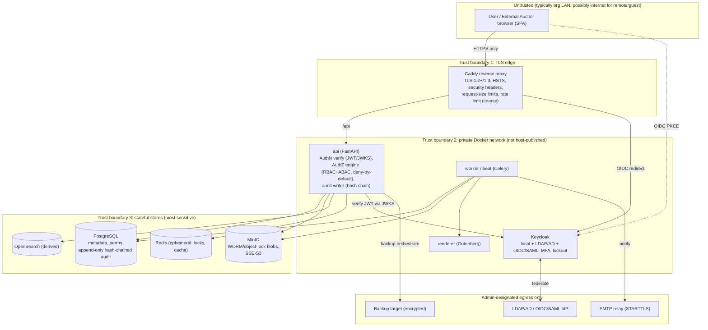
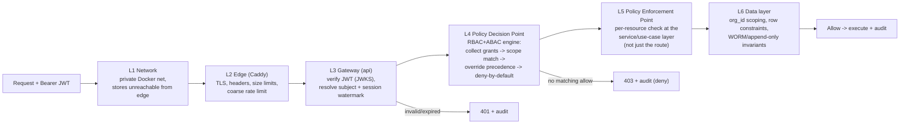
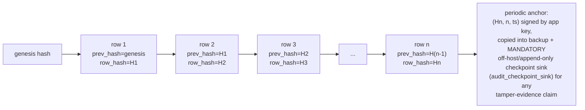
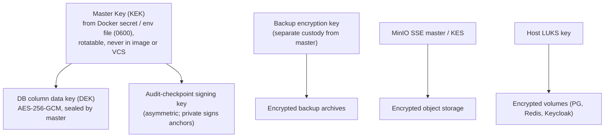
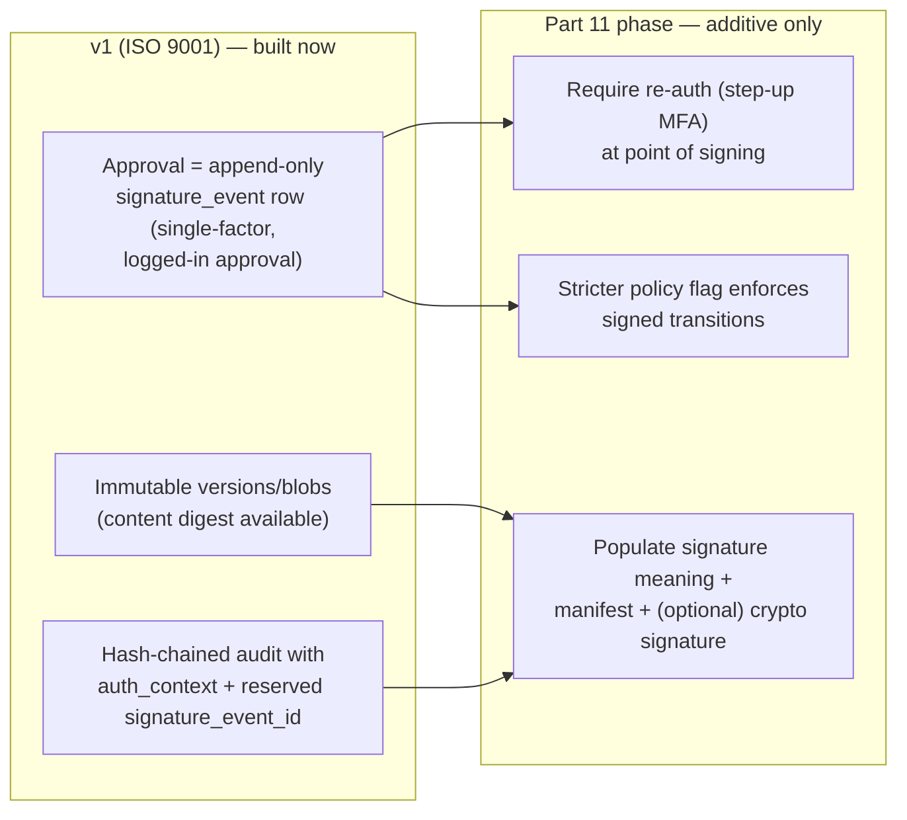

# Security, Audit Trail, Integrity & Data Protection

EasySynQ is a self-hosted Quality Management System whose value rests entirely on one promise: **what the controlled vault says is true, is true** — the right people did the right things, the evidence is intact, and nobody (including a privileged insider) can quietly rewrite history. This section specifies how that promise is kept. It defines authentication (local password policy + optional MFA, LDAP/AD federation, OIDC/SAML SSO, sessions, lockout); centralized, defense-in-depth authorization enforcement; the **tamper-evident, append-only, hash-chained audit trail** that records who/what/when/before-and-after/why for every security- and content-relevant event; encryption in transit and at rest (DB, object storage, backups); secrets management; document-binary integrity via content addressing and scheduled re-hashing; backup, restore, and disaster recovery; data retention and deletion including GDPR/PII handling for *user* (not QMS) data; an OWASP-aligned threat model with concrete mitigations; and the reserved **electronic-signature hooks** (signature meaning, re-authentication at point of signing, signature manifest) that let EasySynQ satisfy 21 CFR Part 11 later as an *additive* change rather than a rewrite. Everything here is built **for ISO 9001:2015 traceability now**, and **architected to satisfy Part 11 later** (non-goal N1), per the locked foundational decisions.

---

## 1. Scope, Principles & Threat Surface

### 1.1 What this section covers (and what it defers)

| In scope (specified here) | Deferred to another doc |
| --- | --- |
| AuthN modes, session/lockout, MFA policy | Full permission *catalog* & role bundles → **Permissions doc** (referenced, not duplicated) |
| AuthZ enforcement points & defense in depth | Full ERD → **Data Model doc** (audit table shape given here for the audit subsystem) |
| Tamper-evident audit trail design | Clause-aligned UX/IA → **IA doc** |
| Encryption at rest / in transit / backups | Import mechanics → **Import doc** (its audit + integrity obligations are stated here) |
| Secrets management | Full Part 11 e-sig build → **E-signature doc** (only the *hooks* are reserved here) |
| Blob integrity (checksums, re-hash) | |
| Backup/restore/DR (RPO/RTO, drills) | |
| Data retention & deletion, GDPR/PII | |
| Threat model + OWASP Top 10 mitigations | |
| Reserved e-signature hooks | |

### 1.2 Security design principles (binding)

| # | Principle | Concrete meaning in EasySynQ |
| --- | --- | --- |
| P1 | **Deny-by-default** | No request is authorized unless an explicit grant resolves to *allow*. Absence of a grant = denial. |
| P2 | **Server-side enforcement only** | The browser SPA never decides authority; it only *hints* the UI. Every decision is re-made in the `api` tier. The client is treated as hostile. |
| P3 | **Defense in depth** | Multiple independent layers (network, proxy, gateway, service, data) each enforce or constrain; no single layer is the sole guard. |
| P4 | **Immutability of truth** | Blobs, versions, records, and audit rows are write-once. Mutation is impossible at the storage layer (WORM) and modeled-out at the data layer (append-only). |
| P5 | **Tamper-evidence over tamper-proofing** | A determined DBA *can* corrupt a row; the system guarantees such corruption is **detectable** (hash chain) even if not preventable. This is the honest, achievable, auditor-credible posture. |
| P6 | **Least privilege & separation of duties** | Avery (Admin) administers the *system* but does not author/approve *QMS content*; Ingrid (Internal Auditor) reads broadly but cannot edit controlled docs (independence). |
| P7 | **No outbound trust** | No telemetry leaves the org boundary; all egress is to admin-designated systems (IdP, SMTP, backup target, image registry) only. |
| P8 | **Additive extensibility** | Part 11 e-signatures and multi-standard support are reserved as data/columns and pluggable hooks, never as future rewrites. |
| P9 | **Fail closed, degrade safe** | An auth/authz subsystem failure denies access; a *non-security* subsystem failure (search, renderer) degrades gracefully without weakening security. |
| P10 | **Auditable everything** | If an event changes security state or controlled content, it produces exactly one immutable, attributed, hash-chained audit row. |

### 1.3 Trust boundaries



**Boundary rules:** (1) only `caddy` publishes a host port; all other containers are reachable only on the private Docker network. (2) Stores (PG/MinIO/Redis/OpenSearch) accept connections only from `api`/`worker`/`beat` on the internal network, never from the proxy or the internet. (3) The most sensitive assets (PG audit partition, MinIO WORM buckets) are the innermost boundary and are the only backup-critical stores.

---

## 2. Authentication (AuthN)

AuthN is brokered entirely by **Keycloak** (locked stack decision). EasySynQ never stores user passwords itself; it consumes OIDC tokens. This collapses three mandated identity modes into one hardened, externally-audited component and pre-positions MFA + re-authentication for Part 11.

### 2.1 Identity modes

| Mode | When used | How it works | Notes |
| --- | --- | --- | --- |
| **Local accounts** | Org has no central IdP, or for break-glass/admin and external-auditor guests | Keycloak realm stores the credential; password policy + lockout + MFA enforced by Keycloak | Always available as a fallback so EasySynQ runs fully standalone |
| **LDAP/AD federation** | Org wants to reuse directory identities/passwords | Keycloak User Federation binds to LDAP/AD over **LDAPS or STARTTLS**; users authenticate against the directory; groups can map to EasySynQ role bundles | EasySynQ is never the primary IdP; directory remains source of identity |
| **OIDC / SAML SSO** | Org has Entra ID, Okta, Keycloak, ADFS, Google Workspace, etc. | Keycloak brokers the external IdP; EasySynQ SPA always speaks **OIDC Authorization Code + PKCE** to Keycloak regardless of the upstream protocol | SAML/OIDC differences are absorbed by Keycloak; the SPA/API see uniform OIDC |

> **Assumption A-AuthN-1.** Avery (Admin) selects the identity mode(s) in the First-Run Setup Wizard (UJ-1). Modes can coexist (e.g., SSO for staff + local accounts for external auditors). Whatever the upstream mode, the SPA→Keycloak protocol is always OIDC Auth-Code+PKCE; the api→Keycloak relationship is always JWT validation via JWKS.

### 2.2 SPA / API token flow

```mermaid
sequenceDiagram
    actor User
    participant SPA as Browser SPA
    participant KC as Keycloak
    participant API as api (FastAPI)
    participant IdP as External IdP / LDAP (optional)

    User->>SPA: open app
    SPA->>KC: redirect /authorize (Auth Code + PKCE, S256 challenge)
    KC->>IdP: (if federated) delegate auth
    IdP-->>KC: assertion / bind OK
    KC->>User: MFA challenge (if policy requires)
    User->>KC: credential + 2nd factor
    KC-->>SPA: authorization code (front channel)
    SPA->>KC: exchange code + PKCE verifier (back channel)
    KC-->>SPA: access token (JWT, short TTL) + refresh token
    SPA->>API: request + Bearer access token
    API->>KC: fetch JWKS (cached, rotated)
    API->>API: verify signature, iss, aud, exp, nbf; map sub->user; load grants
    API-->>SPA: response (authorized) or 401/403
    Note over SPA,KC: silent refresh via refresh token before access-token expiry
```

**Token handling decisions:**

| Item | Decision | Rationale |
| --- | --- | --- |
| SPA grant type | Authorization Code + **PKCE (S256)**, public client | No client secret in browser; mitigates code interception |
| Access token | JWT, short TTL (**default 5 min**, configurable 1–15) | Limits blast radius of a leaked token; forces frequent re-validation |
| Refresh token | Rotating, longer TTL (**default 8 h**, ≤ 12 h), bound to session; **idle timeout 30 min** | Balances UX with revocability; rotation defeats replay |
| Token storage in browser | **In-memory** access token; refresh handled via Keycloak session cookie / rotating refresh token. **No tokens in `localStorage`.** | Mitigates XSS token theft (OWASP A03/A07) |
| API validation | Verify signature against **JWKS** (cached, auto-refetched on `kid` rotation), check `iss`, `aud`, `exp`, `nbf`, and a per-user `not-before` for forced logout | Stateless verification; supports key rotation and global sign-out |
| Logout | OIDC RP-initiated logout → Keycloak session end; API honors a `user.session_invalidated_at` watermark | True sign-out across SPA and API |
| Clock skew | ±60 s tolerance on `exp`/`nbf` | Tolerates host time drift without weakening expiry materially |

### 2.3 Local password policy (Keycloak-enforced)

Applied to **local** accounts (federated accounts inherit the directory/IdP policy). Defaults below are the shipped baseline; Avery can tighten but a **floor** is enforced and cannot be lowered below it.

| Control | Default | Enforced floor | Notes |
| --- | --- | --- | --- |
| Minimum length | 12 | 10 | NIST 800-63B leans on length over composition |
| Composition rules | Not required (length-first) | — | Optional toggle for orgs with policy mandates |
| Breached-password screening | On (k-anonymity list shipped offline) | — | No outbound call; bundled HIBP-style hash prefix list, refreshable by admin |
| Password history | Last 5 reused-blocked | — | Prevents trivial rotation cycling |
| Maximum age | Off by default (NIST: no forced rotation without cause) | — | Forced reset only on compromise or admin action |
| Reset flow | Time-limited, single-use token via email (SMTP) | — | Token hashed at rest; 30-min expiry |
| Initial credential | Force change on first login | mandatory | Admin-created accounts start in must-reset state |

### 2.4 Multi-factor authentication (MFA)

| Aspect | Decision |
| --- | --- |
| Methods | **TOTP** (RFC 6238) and **WebAuthn / passkeys** (FIDO2), both via Keycloak |
| Default policy | Optional per realm; **strongly recommended on** for any account holding approve/admin permissions |
| Step-up (conditional) | MFA can be **required only for sensitive actions** (approval, permission change, admin) via Keycloak conditional flows and an EasySynQ `acr`/`amr` claim check — this is the seam reused later for Part 11 signing re-authentication (§11) |
| Recovery | Admin-issued single-use recovery codes; loss of factor handled by Avery (audited) |
| Federated MFA | If the org IdP already enforces MFA, EasySynQ honors the upstream `amr`/`acr` and does not double-prompt unless step-up demands a fresher factor |

### 2.5 Sessions, lockout & brute-force protection

| Control | Decision | Layer |
| --- | --- | --- |
| Account lockout | Keycloak brute-force detection: **5 failed attempts → 15-min lock**, exponential backoff on repeat; permanent-lock threshold configurable | Keycloak |
| IP/login throttling | Coarse rate limit at Caddy (e.g., 20 auth requests / min / IP) + fine per-account at Keycloak | Caddy + Keycloak |
| Concurrent sessions | Allowed by default; admin can cap per-user; all sessions listable and **revocable** by Avery | Keycloak |
| Idle timeout | 30 min idle → refresh fails → re-auth | Keycloak + API watermark |
| Absolute session lifetime | ≤ 12 h then full re-auth | Keycloak |
| Forced global logout | Avery can invalidate all sessions for a user (e.g., offboarding); API enforces via `session_invalidated_at` watermark even within an access token's TTL | API + Keycloak |
| External auditor (Olsen) | Time-boxed account: session and grant both carry `valid_until`; expiry forcibly ends access and disables the account | API + Keycloak |
| Anti-automation on auth | CAPTCHA-style challenge after N failures (Keycloak built-in), no anonymous endpoints (non-goal N8) | Keycloak |

Every authentication event — success, failure, lockout, MFA challenge result, logout, token refresh anomaly, admin session revocation — is emitted to the EasySynQ audit trail (§4) in addition to Keycloak's own event log, so security forensics live in one tamper-evident place.

---

## 3. Authorization (AuthZ) — Enforcement & Defense in Depth

The **policy model** (hybrid RBAC + ABAC: atomic Permissions, org-defined Role bundles, Scopes at system/process/folder/document, per-user Overrides) is owned by the Permissions doc. This section fixes **how and where** authorization is *enforced* and why it is trustworthy.

### 3.1 The enforcement pipeline (every request)



**Decision/enforcement separation:** the **Policy Decision Point (PDP)** is a single, centralized evaluator inside `api`; the **Policy Enforcement Points (PEP)** are at the *use-case/service* layer, invoked for the specific resource (this document, this process, this record), not merely at the HTTP route. This prevents the classic IDOR/BOLA gap (OWASP A01) where a route is guarded but object ownership is not re-checked.

### 3.2 Decision algorithm (deny-by-default, deny always wins) (reconciled per Decisions Register R3)

The authorization precedence algorithm is **canonical as defined in doc 07** and is cited here verbatim; **deny always wins**. Any earlier "most-specific-wins-first" phrasing is retracted: scope specificity does **not** decide ALLOW-vs-DENY — it is used **only** to break ALLOW-vs-ALLOW ties.

```
effective_decision(subject, action, resource):
  1. Deny-by-default.
  2. Gather all grants applicable to the (subject, action, resource)
     within matching scope.
  3. If ANY explicit DENY applies => result is DENY, regardless of scope
     specificity (deny always wins).
  4. Else if any ALLOW applies => result is ALLOW.
  5. Scope specificity (more specific scope wins) is used ONLY to break
     ALLOW-vs-ALLOW ties.
  6. A per-user override outranks a role-derived grant only WITHIN the
     same allow/deny class (a more specific ALLOW never overrides a less
     specific DENY).
```

The deciding rule id is recorded in the audit row for explainability (logged, not leaked to the client).

**Examples that this algorithm must get right:**

| Scenario | Outcome | Why |
| --- | --- | --- |
| Ingrid (Internal Auditor) tries to check out a controlled SOP | **Deny** | Auditor independence: broad read, but no edit grant on controlled docs; no override (deny-by-default) |
| Avery (Admin) tries to *approve* a procedure | **Deny by default** | Admin holds system perms, not QMS-content approve perms; separation of duties (P6). Could be explicitly granted via override, which is itself audited |
| Diego owns Process "Purchasing"; edits an SOP scoped to that process | **Allow** | ABAC `process_owner == subject` + scoped author grant; no DENY applies |
| Olsen (External Auditor) reads a doc outside his audit scope after `valid_until` | **Deny** (two reasons) | Scope miss + time-box expiry |
| Ken has role-ALLOW approve, but a per-user DENY for one sensitive doc | **Deny** | An explicit DENY applies, so deny always wins — regardless of scope specificity |

### 3.3 Why client cannot be trusted

The SPA receives a **capabilities hint** (a derived, read-only summary of what the current user can likely do) purely to render/hide buttons for UX. This hint is **advisory**; the `api` re-derives the real decision on every mutating and every sensitive read call. A forged or stale hint changes nothing because L4/L5 re-decide server-side. Endpoints return **404 rather than 403** for resources the subject may not even know exist (avoids existence disclosure) where the resource is identity-scoped; otherwise **403** with the deciding-rule id logged but not leaked to the client.

### 3.4 Special enforcement cases

- **Check-in/out lock** (drift prevention) is an *authorization-adjacent* control: a Redis distributed lock guarantees single-writer; the lock holder is recorded and the lock is re-validated at check-in. A lock held by another user yields 409, audited.
- **External auditor scope** is enforced as an ABAC predicate (`resource ∈ audit_scope` AND `now < valid_until`) layered on top of read perms; export is a separately-grantable action so "read in app" and "download evidence pack" can be governed independently.
- **Org isolation:** every query is scoped by `org_id` at the data layer (single org in v1, but enforced now so future multi-org cannot leak).

---

## 4. Tamper-Evident Audit Trail

The audit trail is the **spine of ISO 9001 traceability** and the **evidentiary foundation for future Part 11**. It is append-only, attributed, time-stamped, before/after-capturing, reason-bearing, and **hash-chained** so that any insertion, deletion, reordering, or mutation is *detectable*.

### 4.1 What is audited

| Category | Example events |
| --- | --- |
| **Authentication** | login success/failure, MFA result, logout, lockout, token-refresh anomaly, session revoke |
| **Authorization** | permission/role grant or revoke, scope change, per-user override add/remove, denied-access attempts (configurable verbosity) |
| **Document lifecycle** | create, check-out, check-in (new version), submit-for-review, review comment, approve, release/effective, supersede, obsolete |
| **Record lifecycle** | capture, correction-of chain creation, retention/disposition (archive, destroy), legal hold set/release |
| **Content access** | view/download of a controlled doc or record (configurable; default on for records & released docs, sampled for drafts) |
| **Integrity** | blob re-hash verify pass/fail, audit-chain verify pass/fail, mirror-sync regeneration |
| **Admin/system** | user create/disable, storage/backup config change, IdP/federation config change, restore performed, retention-policy change, audit-export performed |

### 4.2 Audit record schema (PostgreSQL, append-only, partitioned)

| Column | Type | Purpose |
| --- | --- | --- |
| `id` | `bigint` identity | Monotonic sequence within partition; gap = tamper signal |
| `org_id` | uuid | Tenancy scoping (single org v1) |
| `occurred_at` | `timestamptz` | Event time (server clock, UTC) |
| `actor_id` | uuid (nullable) | The authenticated subject; null only for system/`beat` jobs (then `actor_type='system'`) |
| `actor_type` | enum | `user` \| `system` \| `external_auditor` \| `admin` |
| `on_behalf_of` | uuid (nullable) | Reserved for delegated/impersonation (must be empty in v1; column reserved) |
| `event_type` | enum | e.g., `DOC_APPROVE`, `PERM_GRANT`, `LOGIN_FAIL` |
| `object_type` | enum | `document` \| `version` \| `record` \| `permission` \| `user` \| `session` \| `config` \| `audit` |
| `object_id` | uuid (nullable) | The affected entity |
| `scope_ref` | text (nullable) | Process/folder/document scope context |
| `reason` | text (nullable) | **Mandatory** Change Reason/Summary for content-changing events (enforced at PEP) |
| `before` | `jsonb` (nullable) | Prior state of changed fields (redacted of secrets) |
| `after` | `jsonb` (nullable) | New state of changed fields |
| `request_id` | uuid | Correlates with structured app logs / traces |
| `client_ip` | inet | Source IP (proxy-forwarded, validated) |
| `user_agent` | text | Client hint |
| `auth_context` | `jsonb` | `acr`/`amr` (factors used), session id — **reused by Part 11 to prove re-auth at signing** |
| `prev_hash` | bytea (**nullable until linked**) | SHA-256 of the previous row's `row_hash` in this org's chain; populated by the single-threaded chain-linker, not in the action transaction (reconciled per Decisions Register R12) |
| `row_hash` | bytea (**nullable until linked**) | `SHA-256(canonical(all fields above except row_hash))`; populated by the chain-linker after the row is durably written (reconciled per Decisions Register R12) |
| `chained_at` | `timestamptz` (nullable until linked) | When the chain-linker computed and stored `prev_hash`/`row_hash` for this row; null = written-but-not-yet-chained (reconciled per Decisions Register R12) |
| `signature_event_id` | uuid (nullable) | **Reserved** FK to `signature_event` (null in v1; the e-sig hook, §11) |

> The `before`/`after` JSONB pair is what lets an ISO auditor see *exactly* what changed (e.g., a procedure's approver, an objective's target value), and lets a future Part 11 reviewer reconstruct the controlled record at signing time.

### 4.3 Hash chaining (tamper-evidence)

Each org maintains an ordered chain. The first row seeds `prev_hash` with a constant genesis value. For every subsequent row:

```
row_hash[n] = SHA-256( canonical_serialize(
                 id, org_id, occurred_at, actor_id, actor_type,
                 event_type, object_type, object_id, scope_ref,
                 reason, before, after, request_id, client_ip,
                 user_agent, auth_context, signature_event_id,
                 prev_hash[n] ) )
prev_hash[n] = row_hash[n-1]
```



**Properties:**
- **Mutation detection:** altering any field of row *k* changes `row_hash[k]`, breaking every link from *k* onward — a single fast verification pass localizes the break.
- **Deletion/reordering detection:** removing or reordering rows breaks the chain and creates an `id` gap.
- **Insertion detection:** a back-dated insert cannot reproduce the downstream chain without rewriting all later `row_hash` values (and the periodic signed anchors, below).
- **Anchoring:** `beat` periodically (default hourly + on shutdown) writes a **signed checkpoint** `(latest_id, latest_row_hash, timestamp)` signed with an app private key. Checkpoints are included in every backup, so even a full-history rewrite by a privileged DBA is exposed by a checkpoint that no longer matches. This is the honest "tamper-evident, not tamper-proof" guarantee (P5).
- **Off-host anchor (MANDATORY for tamper-evidence claims) (reconciled per Decisions Register R13):** An off-host / append-only audit-checkpoint anchor is **MANDATORY for any install claiming tamper-evidence / Part-11 readiness** (stakeholder decision c). Backup-bundled checkpoints alone are **not** sufficient, because a privileged operator who controls both the database and the backups could rewrite both. The system therefore **requires** at least one **off-host or append-only checkpoint sink** — e.g., a separate **WORM bucket**, an external object store, or **append-only syslog** — to which signed checkpoints are continuously written. This sink is modeled as the **`audit_checkpoint_sink`** config entity (see §4.6 and Data Model doc / R13) and is **configured during setup as a soft gate**: setup is not blocked, but if no `audit_checkpoint_sink` is configured the system surfaces a **clear, persistent UI warning** that **tamper-evidence cannot be honestly claimed** until an off-host anchor exists. An install with no off-host anchor MUST NOT present itself (in UI, exports, or evidence packs) as tamper-evident.

### 4.4 Write path & integrity guarantees

- The audit row is written **in the same database transaction** as the state change it records (FastAPI service layer). Either both commit or both roll back — **no action without its audit row, no orphan audit row**. The row is written with its full payload (`id` sequence, `before`/`after`, `reason`, `auth_context`, etc.) but with `prev_hash`, `row_hash`, and `chained_at` left **null** at this point.
- **Decoupled chain-linking (reconciled per Decisions Register R12).** The chain link is **decoupled from the row write**: `prev_hash` / `row_hash` are **not** computed inside the action transaction. Instead a **single-threaded chain-linker** — a Celery/Beat worker (or a Postgres advisory-lock-guarded process) that guarantees exactly one linker per org chain — runs **continuously with a small bounded lag**, walks the as-yet-unchained rows in `id` order, computes `prev_hash`/`row_hash` over the canonical serialization (§4.3), and stamps `chained_at`. This removes chain-tail contention from the request hot path: **per-org write throughput is not gated by serialized chain-tail updates**, while tamper-evidence is fully preserved (any gap, edit, deletion, reorder, or back-dated insert still breaks the chain once the affected rows are linked, and the signed checkpoints/off-host anchor still expose a wholesale rewrite).
- **Written-but-not-yet-chained window.** Between an audit row's transactional commit and the chain-linker stamping it, the row exists with `chained_at IS NULL` (and null `prev_hash`/`row_hash`). This is the **written-but-not-yet-chained window**: under normal operation it is bounded to **a few seconds** (target: chain-linker lag ≤ ~5 s, alarmed if lag exceeds a configurable threshold, e.g., 60 s). Rows in this window are durable and queryable but are **not yet covered by the hash chain**; the chain-verify job (below) and exports/evidence packs explicitly account for the tail of unchained rows so the window is never mistaken for a chain break. Recovery, restore, and integrity claims treat only `chained_at IS NOT NULL` rows as chain-verified.
- The audit partition has **no UPDATE and no DELETE grant** for the application role; only INSERT and SELECT. A separate, rarely-used `audit_retention` role (operated only via the documented retention job under dual control, §8) may purge whole *expired, sealed* partitions — never individual rows.
- Partitioned by month (`occurred_at`) for performance and for whole-partition lifecycle; indexed by `object_id`, `actor_id`, `event_type`, `occurred_at`.
- Mirrored into OpenSearch for fast investigative search (derived, rebuildable; PG remains authoritative).
- A `beat` **chain-verify** job (default nightly + on-demand) re-walks the chain over rows where `chained_at IS NOT NULL` and compares against the latest signed checkpoint **and the latest checkpoint persisted to the off-host `audit_checkpoint_sink`**; a mismatch raises a high-severity audit alarm and an admin alert. Rows in the written-but-not-yet-chained window (`chained_at IS NULL`) at the chain tail are reported as *pending*, not as a break; a persistent or growing unchained tail (chain-linker stalled) is itself alarmed.

### 4.5 Audit access & retention

- Read access to the audit trail is a **granted permission** (typically Mara, Ingrid, Avery; Olsen gets scoped audit views within his audit window).
- Audit export (for an external audit / evidence pack) is itself an audited event and produces a checksummed bundle including the relevant signed checkpoint, so the export's integrity is independently verifiable.
- **Audit retention defaults to the longest applicable record-retention period** (admin-configurable, default 10 years) and is never shorter than the records it describes. Audit rows are **excluded from GDPR erasure** of operational PII where lawful (legitimate interest / legal-obligation basis); see §9.4.

### 4.6 Off-host audit-checkpoint sink (`audit_checkpoint_sink`) (reconciled per Decisions Register R13)

To honor the mandatory off-host anchor (§4.3), EasySynQ models a configuration entity **`audit_checkpoint_sink`** (also defined in the Data Model doc per R13). It records where signed checkpoints are continuously mirrored off-host so that a privileged operator who controls both the live database and the backups still cannot silently rewrite history undetected.

| Aspect | Specification |
| --- | --- |
| **Entity** | `audit_checkpoint_sink` config entity (one or more configured sinks). |
| **Sink kinds** | A separate **WORM bucket** (object-lock, distinct credentials/custody), an **external object store**, or an **append-only syslog** target. At least one off-host/append-only sink is **MANDATORY** for any install claiming tamper-evidence / Part-11 readiness. |
| **What is written** | Each signed checkpoint `(latest_id, latest_row_hash, timestamp, signature)` is appended (write-once / append-only) as the chain advances. |
| **Setup posture** | Configured during setup as a **soft gate** (setup not blocked); if absent, a **clear, persistent UI warning** states tamper-evidence cannot be honestly claimed. |
| **Custody** | Sink credentials are held separately from the app master key and the backup key, so the same operator cannot trivially control the live chain, the backups, *and* the off-host anchor. |

---

## 5. Document & Record Binary Integrity

Integrity of the *bytes* (not just the metadata) is what makes EasySynQ's evidence credible.

| Mechanism | Specification |
| --- | --- |
| **Content addressing** | Every blob is stored in MinIO under its **SHA-256** digest. Identity *is* the hash; two identical files dedupe naturally; a mismatch between requested digest and stored bytes is impossible to serve silently. |
| **Immutability (WORM)** | Document/record buckets use MinIO **object-lock / WORM** with retention; versions and retained records cannot be overwritten or deleted before retention expiry — enforced by the storage layer, not just app code. |
| **Write ordering** | A version is marked *complete* only after its blob is durably written (object-lock applied) **and** the metadata + audit row commit in PG. A crash mid-write leaves an incomplete version that is never released. |
| **Renditions are derived** | The normalized PDF preview and thumbnails are *derived* blobs (also content-addressed). The **source blob is the integrity anchor**; renditions are rebuildable and never authoritative. |
| **Scheduled re-hash verify** | A `beat` job re-reads blobs and recomputes SHA-256: a **rolling sample continuously** + a **full sweep periodically** (cadence by sizing profile; full sweep weekly on M). Any mismatch (tampering or bit-rot) raises a high-severity integrity alarm + audit row and flags the affected version/record in the UI. |
| **Download integrity** | Downloads/exports include the SHA-256; evidence packs ship a manifest of digests so an external auditor can independently verify nothing changed in transit or at rest. |
| **Mirror integrity** | The read-only filesystem mirror is **regenerated from released versions only** (authority flows vault→mirror). The mirror is never read back as truth; if it is altered on disk, the next mirror-sync overwrites it, and the discrepancy is not trusted. |

---

## 6. Encryption

### 6.1 In transit

| Channel | Protection |
| --- | --- |
| Browser ↔ Caddy | **TLS 1.2 minimum, TLS 1.3 preferred**; modern cipher suites only; HSTS (long max-age, `includeSubDomains`); HTTP/2; OCSP stapling where applicable |
| Caddy ↔ api / SPA assets | Private Docker network; **optional mTLS overlay** for regulated customers (future profile) |
| api/worker ↔ PostgreSQL | TLS to Postgres (recommended; required in hardened profile) |
| api/worker ↔ MinIO | HTTPS to MinIO endpoint |
| api ↔ Keycloak | HTTPS; OIDC/SAML strictly over TLS |
| Keycloak ↔ LDAP/AD | **LDAPS or STARTTLS** (plaintext LDAP refused) |
| worker ↔ SMTP | **STARTTLS** required (or implicit TLS) |
| Backups → target | TLS for transport; archive itself encrypted (§6.2) |

Security response headers set at Caddy: strict **`Content-Security-Policy`** (nonce-based, `default-src 'self'`, no inline script except nonce, `frame-ancestors 'none'`), `X-Content-Type-Options: nosniff`, `Referrer-Policy: strict-origin-when-cross-origin`, `Permissions-Policy` (deny camera/mic/geolocation), and `Strict-Transport-Security`.

### 6.2 At rest

| Store | Encryption | Notes |
| --- | --- | --- |
| **PostgreSQL volume** | Host-level **LUKS/dm-crypt full-volume encryption** (install-guide recommended/required) | Protects DB files, WAL, temp |
| **Sensitive DB columns** | App-layer envelope encryption (AES-256-GCM) of secrets stored in DB (federation client secrets, SMTP creds): data key sealed by a master key | Defense in depth even if volume key is compromised |
| **MinIO** | **SSE-S3** server-side encryption on all buckets; object-lock for WORM | Keys managed by MinIO KES or env-provided master, rotatable |
| **Backups** | Archive encrypted with a dedicated backup key (AES-256), separate from the app master key | A stolen backup is useless without the backup key |
| **Redis** | Holds only ephemeral locks/cache/short-lived tokens; volume on encrypted host disk; no long-term secrets persisted | Treated as ephemeral (rebuildable) |
| **Keycloak realm/DB** | Same volume encryption; realm export (a backup artifact) encrypted | Contains user/identity data — high sensitivity |

### 6.3 Key hierarchy



---

## 7. Secrets Management

| Practice | Specification |
| --- | --- |
| **No secrets in images or VCS** | Images are built clean; all secrets injected at runtime |
| **Injection** | Via **Docker secrets** (preferred) or `.env` with `0600` perms owned by the deploy user; the `install.sh` wizard **generates** strong random secrets at first run (DB password, Keycloak admin, app master key, backup key, MinIO root) |
| **Inventory (the secrets that exist)** | DB credentials; MinIO root/access keys; Keycloak admin + client secrets; app master key (KEK); audit-checkpoint signing key; backup encryption key; SMTP credentials; IdP federation client secret/cert | 
| **Rotation** | Documented rotation procedure for each: Keycloak client secrets and the app master key are explicitly rotatable; rotation is an audited admin event; envelope encryption means rotating the KEK re-wraps DEKs without re-encrypting all data |
| **Least exposure** | Each container receives only the secrets it needs (e.g., the renderer gets none; `beat` gets the signing key) |
| **Scrubbing** | Secrets are redacted from logs, audit `before`/`after`, error responses, and exports by an allowlist serializer; CSP and error handling prevent secret echo |
| **Break-glass** | A sealed, documented local admin credential exists for IdP-outage recovery; its use triggers a high-severity audit event |

---

## 8. Backup, Restore & Disaster Recovery

**Principle (inherited from architecture):** only **PostgreSQL + MinIO** are backup-critical; OpenSearch and the filesystem mirror are always rebuildable. A backup is *valid* only if the DB snapshot and the blob snapshot **correspond** (consistency point).

### 8.1 Backup matrix

| Component | Method | Default cadence (admin-tunable) | Restore |
| --- | --- | --- | --- |
| PostgreSQL | `pg_dump` logical + optional continuous **WAL archiving (PITR)** | Nightly full + WAL stream | `pg_restore` / PITR to timestamp |
| MinIO blobs | `mc mirror` / bucket replication (WORM ⇒ immutable ⇒ safe incremental) | Nightly incremental | `mc mirror` back / repoint |
| Keycloak realm | Realm export JSON (encrypted) | On config change + nightly | Realm import |
| Config / secrets | `.env` + Compose snapshot (encrypted) | On change | Redeploy |
| **Audit checkpoints** | Latest signed chain checkpoints bundled into every backup | Each backup | Verifies chain integrity post-restore |
| OpenSearch | **Not backed up** | — | Reindex from PG+MinIO |
| Filesystem mirror | **Not backed up** | — | Regenerate from vault |

### 8.2 Backup/restore flow & consistency

- `easysynq backup` briefly **quiesces** (short consistency lock) to align the DB dump with the blob manifest, then produces a **single timestamped, checksummed, encrypted archive** (DB dump + MinIO manifest + Keycloak realm + config + audit checkpoint) written to the admin-configured target. Backup success/failure is an audited event and alertable.
- `easysynq restore` **verifies checksums and decrypts**, restores PG + MinIO, re-imports the realm, **re-walks and verifies the audit hash chain against the bundled checkpoint** (a restore that fails chain verification is flagged, not silently accepted), then triggers **reindex + mirror-sync**.
- A documented **restore drill** is part of the admin runbook and is itself an auditable, recommended-periodic activity (the only way to trust a backup is to have restored one).

### 8.2.1 WORM-aware restore, PITR ↔ blob alignment & quiesce bound (reconciled per Decisions Register R37)

Because document/record blobs live under MinIO **object-lock / WORM** (§5) and Postgres supports point-in-time recovery (PITR), a naive restore can either fail against immutable objects or reconstruct an internally inconsistent system. The restore procedure therefore makes the following explicit and binding:

- **WORM-aware restore target.** Restoring blobs over an existing object-locked bucket is **not** permitted by the storage layer (that is the whole point of WORM). A restore that must rewrite blobs MUST target a **fresh / cleared bucket or a versioned restore target** — never an attempt to overwrite locked objects in place. The runbook specifies provisioning a clean bucket (or a new object-lock-enabled bucket version) and repointing the app at it.
- **PITR ↔ blob alignment.** A Postgres point-in-time restore MUST be **paired with the matching blob set** for that point in time — **not merely the latest mirror or the latest blob snapshot**. The blob manifest captured at backup (and the content-addressed SHA-256 digests) is used to select the blob set whose digests the restored metadata references, so the restored DB and the restored blobs **correspond** (the consistency-point principle of §8). Restoring the DB to time *T* with the newest blobs (or vice-versa) is explicitly disallowed.
- **Checkpoint not ahead of the PITR target.** When restoring to a **mid-chain PITR target**, the verifier MUST **confirm the audit hash-chain checkpoint is not ahead of that target**: a bundled/off-host checkpoint whose `latest_id` exceeds the highest restored `audit_event.id` would falsely report a "missing tail" as tampering. The restore selects (or recomputes against) the checkpoint at-or-before the PITR target and verifies the chain only up to the restored point; a checkpoint ahead of the target is flagged and the matching earlier checkpoint is used.
- **Bounded consistency-quiesce window.** The backup consistency lock (§8.2) and any restore-time quiesce are **explicitly bounded** (short, sub-minute target) and are **reconciled with the R14 availability target** (99.0% per month for the single-host profile, including the Keycloak and Beat dependencies): the quiesce window is counted against — and must fit within — that monthly budget, so backup/restore quiescing does not silently breach the stated availability target.

### 8.3 DR objectives

| Objective | Target |
| --- | --- |
| **RPO** | ≤ 24 h with nightly backups; **≤ minutes** with WAL archiving enabled |
| **RTO** | ≤ 2 h for a full restore on the M profile |
| **Availability** | **99.0% per month for the single-host profile**, excluding planned maintenance — **including** the auth (**Keycloak**) and scheduler (**Beat**) dependencies, which are **single points of failure** on this profile. **99.5%+ is achievable only via the documented HA/K8s path**; do **not** claim 99.5% on a single host running six single-instance stateful services (reconciled per Decisions Register R14) |
| **Integrity after DR** | Audit chain verified, blob sample re-hashed, before declaring the system trustworthy post-restore |

> **Availability posture & SPOFs (reconciled per Decisions Register R14).** On the single-host profile, **Keycloak (auth)** and **Beat (scheduler)** are explicit **single points of failure**: if Keycloak is down, no one can authenticate (the auth subsystem fails closed, P9); if Beat is down, scheduled jobs (chain-linking, chain-verify, re-hash sweeps, retention sweeps, checkpoint anchoring, mirror-sync) stall. The single-host availability target is therefore stated as **99.0% per month, inclusive of these dependencies** — not 99.5%. A **fast-restart runbook** for both Keycloak and Beat is part of the admin runbook (detect → restart → verify), and the consistency-quiesce windows of §8.2.1 are counted within this same budget. Reaching **99.5%+** requires the **documented HA/K8s path** (redundant Keycloak, redundant scheduler, replicated stores); it is not a property of the six-single-instance-stateful-service single host.

---

## 9. Data Retention, Deletion & GDPR/PII

EasySynQ holds two very different data classes; conflating them is a compliance error, so the model separates them explicitly.

### 9.1 Two data classes

| Class | Examples | Governing rule | Deletability |
| --- | --- | --- | --- |
| **QMS content** (documents, versions, records, audit) | SOPs, approved versions, audit reports, CAPAs, calibration records, the audit trail | **ISO 9001 retention** + the org's retention policy + WORM | **Not freely deletable**; superseded versions retained; records immutable; disposition only after retention expiry, audited |
| **User/operational PII** | User profile (name, email), login history, sessions, IP addresses in logs | **GDPR / privacy law** (data minimization, erasure, purpose limitation) | Subject to erasure/anonymization **except** where retained QMS records lawfully require the identity (legal obligation / legitimate interest) |

### 9.2 Record retention & disposition (QMS content)

- Each record carries a **`RetentionPolicy`** (period, basis) and a **`DispositionState`** (active → due → archived → destroyed), inherited from the domain model.
- Disposition runs via a `beat` **retention sweep**: items past retention surface for a **controlled, audited disposition** decision (never silent auto-destroy by default for mandatory records).
- **Legal hold** overrides retention: a held record/version cannot be disposed regardless of expiry; set/release is audited.
- WORM object-lock retention on MinIO is set to **at least** the policy period so storage cannot delete early even by mistake.
- Disposing a record is an immutable audit event capturing what, why, by whom, under which policy.

### 9.3 Document version retention

- Superseded/obsolete versions are **retained read-only** for traceability (the maintain/retain rule). They are not deleted on supersession; obsolescence changes state, not existence.

### 9.4 GDPR / PII handling (user data)

| Concern | Approach |
| --- | --- |
| **Lawful basis & minimization** | EasySynQ stores the minimum user PII needed for QMS attribution (name, email, org role). No special-category data. |
| **Right of access / portability** | Avery can export a user's profile + their activity references (audited). |
| **Right to erasure** | On offboarding/erasure request, the user **account** is disabled and profile PII can be **anonymized/pseudonymized** (e.g., replaced by a stable pseudonymous actor id "Former User #1234"). |
| **Conflict with QMS traceability** | **Audit rows and signed/approved records are NOT erased** where ISO/legal obligation requires attribution. Instead, the *separate user profile* PII is anonymized while the audit chain keeps the stable `actor_id` — so the hash chain is **never broken** by erasure, and traceability survives, but personal contact data is removed. This separation is the deliberate design that reconciles GDPR with ISO/Part-11 integrity. |
| **Log PII** | IPs/user agents in operational logs follow a shorter retention than the audit trail; configurable. |
| **External auditor data** | Olsen's guest account and its PII are time-boxed and purged after the audit window (account disabled, profile anonymized), while his audited *actions* remain in the immutable trail. |
| **Residency** | All PII stays within the org boundary (no outbound telemetry; non-goal N8/privacy NFR). |

> **Design takeaway:** PII lives in *mutable* user-profile tables; *attribution* in the audit trail uses a stable `actor_id` plus a point-in-time `auth_context`. Erasure rewrites the profile, never the chain. GDPR erasure and tamper-evident audit therefore coexist without contradiction.

### 9.5 GDPR vs WORM: PII-in-content under object-lock (reconciled per Decisions Register R27)

The §9.4 separation (mutable profile PII vs stable `actor_id`) resolves erasure for *attribution* PII, but it does **not** address the harder case where the **PII is the content of a controlled record itself** — e.g., a personnel file, a signed competence/training record, or a customer complaint that names an individual — held under MinIO **object-lock / WORM** with a retention that **exceeds the data subject's employment or relationship**. The honest legal posture is stated here:

- **Default: such records remain under object-lock.** Records whose **content is PII** and whose **retention period exceeds employment/relationship** **remain under object-lock for their full retention period.** ISO 9001 retention, WORM immutability (P4), and the legal-obligation / legitimate-interest basis (§9.1) take precedence over a routine erasure request for the *content* of a controlled record; erasure of operational/profile PII (§9.4) is unaffected and still performed.
- **Destroy-under-legal-order escape hatch (dual-control, fully audited).** For the genuinely exceptional cases that WORM cannot otherwise satisfy — **mis-imports** (PII that should never have been ingested) and **binding erasure orders / legal orders** — EasySynQ provides a **tightly-controlled, dual-control, fully-audited destroy-under-legal-order escape hatch** for WORM blobs. Properties of the escape hatch:
  - **Dual control:** the destruction of an object-locked blob requires **two authorized operators** (e.g., the QMS Owner/DPO requesting and the Admin executing); no single actor can destroy a WORM record.
  - **Legal-order gating:** the action requires recording the **legal basis / order reference** (court order, regulator instruction, or documented mis-import determination); it is not a routine retention-disposition path.
  - **Fully audited, chain-preserving:** the destruction is an immutable, hash-chained `audit_event` capturing *what*, *why* (the order reference), *by whom* (both controllers), *under which authority*, and *when*. The **blob content** is destroyed (or its object-lock legal-hold cleared and the object removed), but the **audit chain itself is never broken** — the chain records that a destruction occurred without re-containing the destroyed PII.
  - **Scope:** the escape hatch destroys the **PII content blob**, not the surrounding traceability metadata; metadata that does not itself contain the erasable PII is retained so the record's existence and the destruction event remain auditable.

This makes WORM the rule and destruction the audited, dual-controlled exception — reconciling GDPR erasure of PII-as-content with WORM immutability and ISO/Part-11 integrity.

---

## 10. Threat Model & OWASP Top 10 Mitigations

### 10.1 Adversaries considered

| Adversary | Capability | Primary concern |
| --- | --- | --- |
| External attacker (network) | Reaches the TLS edge | Auth bypass, injection, data exfiltration |
| Malicious/compromised low-priv user (e.g., Sam) | Valid session, minimal grants | Privilege escalation, IDOR, drift |
| Curious/over-reaching insider (e.g., Ingrid) | Broad read | Acting beyond independence (editing controlled docs) |
| Privileged operator / DBA (e.g., Avery or host root) | DB/host access | Silent history rewrite, content tampering |
| Departed user / stolen token | Old credential/token | Replay, lingering access |
| External auditor (Olsen) | Time-boxed guest | Scope creep, retained access after window |
| Supply chain | Compromised dependency/image | Backdoor, secret theft |

### 10.2 OWASP Top 10 (2021) mapping

| OWASP category | EasySynQ mitigations |
| --- | --- |
| **A01 Broken Access Control** | Deny-by-default PDP, per-object PEP at the use-case layer (not just routes), per-user override precedence, `org_id` scoping, 404-for-unknown, every denied attempt audited. Auditor independence + admin/QMS separation enforced as grants. |
| **A02 Cryptographic Failures** | TLS 1.2+/1.3 everywhere, HSTS, LUKS + SSE-S3 at rest, envelope-encrypted DB secrets, encrypted backups, strong randoms for secrets, SHA-256 content addressing. |
| **A03 Injection** | SQLAlchemy 2 parameterized queries (no string SQL), strict input validation via Pydantic/FastAPI schemas, OpenSearch queries built via the client (no query injection), strict output encoding in the SPA, nonce-based CSP to blunt XSS. |
| **A04 Insecure Design** | Threat-modeled here; immutable/append-only/WORM by design; separation of duties; fail-closed authz; tamper-evident over tamper-proof acknowledged honestly. |
| **A05 Security Misconfiguration** | Hardened defaults, secrets generated at install, no debug in prod, security headers, private network for stores, healthchecks gate readiness, pinned image digests, air-gapped bundle option. |
| **A06 Vulnerable & Outdated Components** | Pinned-by-digest images, dependency scanning in CI, documented patch/upgrade path with backup-before-upgrade, Keycloak/Postgres/MinIO/OpenSearch on supported LTS. |
| **A07 Identification & Auth Failures** | Keycloak brute-force lockout, MFA (TOTP/WebAuthn), PKCE, short-lived tokens with rotation, in-memory token storage, idle/absolute session limits, forced global logout, breached-password screening. |
| **A08 Software & Data Integrity Failures** | Content-addressed immutable blobs, WORM object-lock, hash-chained signed audit, transactional audit-with-action, restore-time chain verification, pinned images. |
| **A09 Logging & Monitoring Failures** | Tamper-evident audit of all security/content events, OpenTelemetry metrics, auth-failure/integrity-failure/backup-failure alerts, audit chain-verify job, separate operational logs vs. compliance audit. |
| **A10 SSRF** | No user-supplied URL fetching in core flows; outbound egress restricted to admin-designated endpoints (IdP/SMTP/backup/registry); renderer is fed local blobs only, network-restricted; no anonymous/public endpoints (N8). |

### 10.3 Notable residual risks & honest posture

| Risk | Posture |
| --- | --- |
| Privileged DBA/root silently rewriting history | **Detectable, not preventable**: hash chain + signed external/backup-copied checkpoints expose it; documented as such for auditors. |
| Host compromise stealing the master key | Mitigated by volume encryption + secret-file perms + rotation; defense in depth limits but cannot fully eliminate root-level compromise. |
| Insider with legitimately broad grants | Mitigated by least-privilege grant design, separation of duties, and *complete auditing* — misuse is recorded even when permitted. |

---

## 11. Reserved Hooks for Electronic Signatures (21 CFR Part 11) — Not Built Now

Per non-goal **N1**, e-signatures are **not implemented in v1**, but the foundation already reserves everything needed so Part 11 becomes *additive columns + a stricter policy flag*, never a rewrite. The locked decisions already model **approval as a `signature_event` row**; this section makes the reserved surface explicit.

### 11.1 The three Part 11 requirements and where they will plug in

| Part 11 requirement | Reserved hook in EasySynQ today |
| --- | --- |
| **Signature meaning** (what the signature *means*: authorship, review, approval, responsibility) | `signature_event.meaning` is a fixed v1 enum (lowercase snake_case): the v1-emitted values are `review`, `approval`, `release`, `obsolete`, `verify`, `disposition`, `import_baseline`, `review_confirmed` (where `review_confirmed` is emitted by a periodic review that concludes no change needed); `authored` and `responsibility` are reserved for the future Part-11 phase (declared but NOT emitted in v1). The lifecycle already names the transition (approval, release), so meaning maps directly onto the existing state machine (reconciled per Decisions Register R2). |
| **Re-authentication at point of signing** (signer must re-assert identity at the moment of signing) | The MFA **step-up / conditional** flow (§2.4) and the `auth_context` (`acr`/`amr`) already captured in each audit row provide the seam: a signing action will require a fresh re-auth and record the factors used. |
| **Signature manifest / signed-record linkage** (signature is permanently linked to the exact record content) | Content-addressed immutable blobs + immutable versions + the hash-chained audit row give a stable content digest to bind a signature to; `audit.signature_event_id` (reserved FK) and `before/after` snapshots provide the linkage. |

### 11.2 Reserved `signature_event` shape (illustrative — fields exist as reserved/nullable now)

| Field | Purpose (activated in Part 11 phase) |
| --- | --- |
| `id`, `org_id` | Identity / tenancy |
| `subject_id` | The signer |
| `meaning` | `signature_event.meaning` enum (v1, lowercase snake_case) — emitted values: `review`, `approval`, `release`, `obsolete`, `verify`, `disposition`, `import_baseline`, `review_confirmed`; reserved for the Part-11 phase (declared but NOT emitted in v1): `authored`, `responsibility` (reconciled per Decisions Register R2) |
| `signed_object_type` / `signed_object_id` | The version/record signed |
| `content_digest` | SHA-256 of the exact signed content (binds signature to bytes) |
| `signed_at` | Time of signing |
| `auth_context` | Factors used at signing (re-auth proof: `acr`/`amr`, session) |
| `reauth_at` | Timestamp of the fresh re-authentication immediately preceding signing |
| `manifest` | JSON manifest: signer identity, meaning, content digest, timestamp, method |
| `crypto_signature` | (optional later) cryptographic signature over the manifest |
| `prev_signature_hash` / `signature_hash` | Optional chaining of signatures, mirroring the audit chain |

### 11.3 What stays the same vs. what is added later



**Guarantee:** moving to Part 11 requires (a) flipping a policy flag to demand re-auth on signing transitions, (b) populating already-reserved `signature_event` fields, and (c) optionally adding cryptographic signing — **no change to the lifecycle state machine, the audit schema's shape, or the storage model.** This is the no-corner-painted promise of the locked foundational decisions, realized.

---

## 12. Summary — How the Guarantees Lock Together

1. **AuthN** is brokered by Keycloak across local/LDAP/AD/SSO with a strong password floor, optional MFA + step-up, short-lived PKCE tokens, brute-force lockout, and revocable sessions.
2. **AuthZ** is deny-by-default, hybrid RBAC+ABAC, decided centrally (PDP) and enforced per-object (PEP) server-side, with override precedence and complete auditing of allows *and* denies.
3. **The audit trail** is append-only, transactional with the action, before/after-capturing, reason-bearing, and **hash-chained with signed checkpoints** — tamper-evident by design and ready to carry Part 11 signing evidence.
4. **Binary integrity** is guaranteed by SHA-256 content addressing, WORM object-lock immutability, and scheduled re-hash verification, with the filesystem mirror as a read-only, regenerable export (vault→mirror authority only).
5. **Encryption** protects data in transit (TLS 1.2+/1.3, LDAPS/STARTTLS) and at rest (LUKS, SSE-S3, envelope-encrypted DB secrets, encrypted backups), under a clear key hierarchy with rotatable, never-committed secrets.
6. **Backup/restore/DR** treat only PG+MinIO as critical, enforce DB↔blob consistency, verify the audit chain on restore, and meet RPO ≤ 24 h (minutes with WAL) / RTO ≤ 2 h.
7. **Retention & GDPR** are reconciled by separating immutable QMS content/audit from mutable user PII: erasure anonymizes the profile while the stable `actor_id` keeps the hash chain — and ISO traceability — intact.
8. **The threat model** maps OWASP Top 10 to concrete mitigations and states honestly that privileged-insider history rewrites are *detectable* (not preventable) via signed audit checkpoints.
9. **E-signature hooks** are reserved (signature meaning, re-auth at signing, signature manifest) so 21 CFR Part 11 is an additive change, not a rewrite — fulfilling the foundational extensibility mandate.
