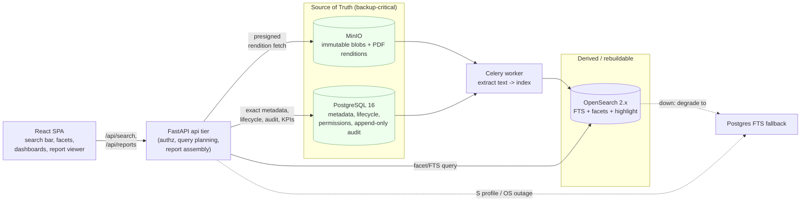
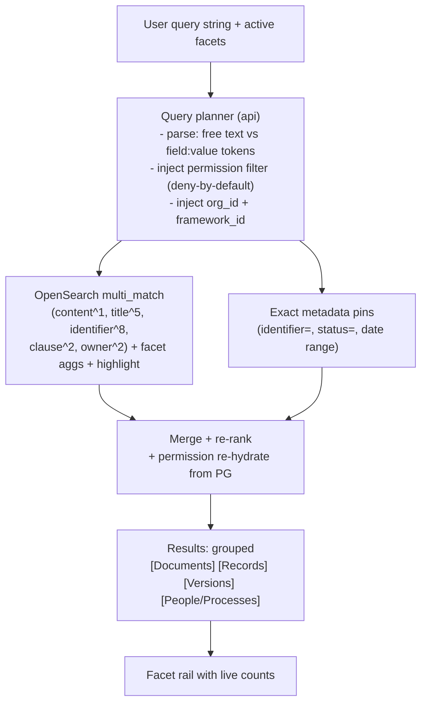
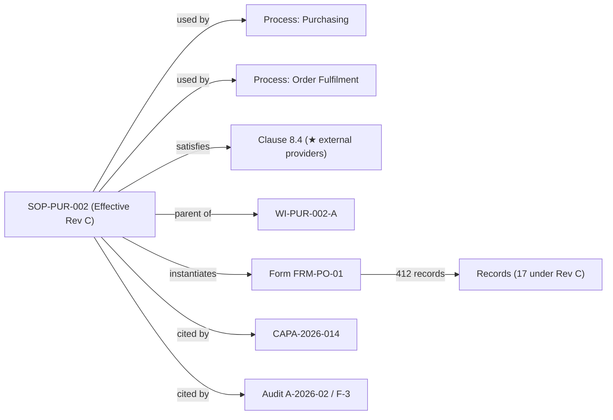
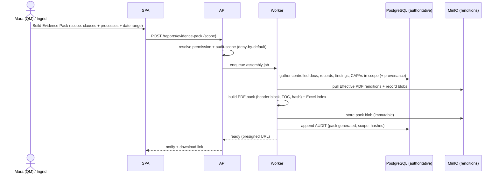

# Search, Navigation & Reporting / Dashboards

This section specifies how users **find** anything in the Controlled Vault and how they **see the state** of the QMS at a glance. It defines a unified full-text-plus-metadata search with faceted filtering, clause/process navigation, saved searches, and find-where-used (impact analysis); then it specifies the reporting and dashboard layer for QMS health — the Management-Review dashboard, the persona-targeted KPI dashboards, the canonical document-control reports (Controlled Document Register, Revision-History report, Distribution-and-Acknowledgement report), and auditor-grade PDF/Excel exports. Everything here is a **lens over the one QMS** (per the domain model's three-lenses rule): search and reports never duplicate truth, they query PostgreSQL (metadata, lifecycle, permissions, append-only audit) and OpenSearch (rebuildable index) and present results through the same artifact header and cross-lens switcher established in `02-iso-9001-domain-model.md` §5.4. All results are **permission-filtered server-side, deny-by-default** (architecture invariant #4), so a user — including a time-boxed external auditor (Olsen) — only ever sees, searches, or exports what their effective permissions grant.

---

## 1. Scope, principles & terminology

### 1.1 What this section covers (and explicitly does not)

| In scope | Out of scope (non-goal ref) |
|---|---|
| Full-text content search + metadata search, unified | Quality analytics / SPC / control charts (N6) |
| Faceted filters: type, clause, process, status, owner, date | Auto-compliance judgments ("you are/aren't compliant") (N9) |
| Clause-spine & Process-Map navigation entry points | Generic user-configurable workflow/report builder engine (N7) |
| Saved searches (personal + shared) | Native mobile reporting app (N10) |
| Find-where-used (impact / link graph) | Public/anonymous dashboards (N8) |
| Management-review dashboard + persona KPI dashboards | Real-time co-editing of reports (N5) |
| Document-control reports (register, revision history, distribution/ack) | In-app rich authoring of report layouts (N4) |
| PDF / Excel export suitable for auditors | — |

> **Principle (calm-by-default).** Every surface in this section obeys progressive disclosure (domain model §5.1.3): landing views show **counts, RAG status, and the top few rows**; density (full tables, every facet, every audit line) is always one click deeper, never on the first paint.

### 1.2 Terms used in this section (precise)

| Term | Definition |
|---|---|
| **Search document** (index unit) | One OpenSearch document per **DocumentedInformation entity** (a Document or a Record), denormalizing its current control fields + extracted text of its **Effective version** (for Documents) or its captured blob (for Records). Superseded versions are indexed in a separate `versions` index for revision-history search. |
| **Facet** | A pre-computed aggregation over a metadata field (e.g., `status`) used to filter results and show counts per value. |
| **Saved search** | A named, serializable query (full-text terms + facet selections + sort) that re-runs live; not a frozen result set. |
| **Find-where-used** | The reverse-link query: "what references / depends on this artifact?" across `process_links`, `clause_map`, parent/child docs, template→record instantiation, and CAPA/audit links. |
| **Widget** | An atomic dashboard tile bound to one query, with a defined visual, drill-through target, and refresh cadence. |
| **RAG** | Red/Amber/Green status, computed from explicit, documented thresholds (never a subjective judgment). |
| **Report** | A parameterized, exportable, point-in-time rendering of a query, with a header block carrying generation metadata for audit defensibility. |
| **Evidence Pack** | (Defined in vision doc.) A clause-mapped, scope-limited bundle assembled for an external audit; reporting/export here is the engine the pack assembly reuses. |

### 1.3 Where search and reporting sit in the stack



**Authority & degradation rules inherited from architecture:**
- OpenSearch is **derived and always rebuildable** from PG+MinIO; it is never backup-critical and never authoritative for lifecycle/permission decisions.
- **Search-down degradation:** the **S sizing profile runs Postgres-FTS-only (OpenSearch disabled) as a documented degraded mode** (reconciled per Decisions Register R34) — on the **S (tiny) profile** OpenSearch is off by default and **PostgreSQL FTS** (`tsvector`/`tsquery` + `pg_trgm`) serves search; on **M/L** profiles, if OpenSearch is unreachable, search **falls back to Postgres FTS** with a non-blocking banner ("Reduced search: relevance/highlighting limited"). Exact-match metadata search, navigation, dashboards, and reports keep working because they query PG directly.
- **Reports and KPIs are computed from PostgreSQL only** (the authoritative store) — never from OpenSearch — so an audit-grade report is correct even if the index is stale or rebuilding. Search uses OpenSearch for relevance/highlight but **re-checks permissions in PG** at result-hydration time.

---

## 2. Unified search

### 2.1 The unified search model: one box, two planes

> **Status (2026-06-09):** Shipped (S10 backend + S-web-6 UI) = the **metadata plane** (titles / identifiers / clause-refs, Effective docs) + the ⌘K palette + the ★ Compliance Checklist. **Deferred (v1.x):** the **content plane** (body-text / OCR FTS), OpenSearch faceting, saved searches, and the §3–§7 reports. The §2 narrative below describes the full design intent.

EasySynQ presents a **single global search bar** (always in the top app bar, primary keyboard shortcut `Cmd-K` / `Ctrl-K`, with `/` as a secondary focus shortcut) (reconciled per Decisions Register R23) that searches two planes simultaneously and merges them:

1. **Content plane** — full text extracted from the document binary (the Effective version's PDF rendition / source) and from record attachments, including OCR'd image-PDFs (deferred-OCR is a worker job; until OCR completes, the record is searchable by metadata only).
2. **Metadata plane** — the universal control fields on `DocumentedInformation` (identifier, title, kind, clause_map, process_links, pdca_phase, owner/org_role, status, dates, requirement_source, framework_id) plus type-specific fields (e.g., CAPA root cause text, audit finding severity).



**Ranking (boost order, highest first):** exact `identifier` match → title match → clause/owner match → body content match. Effective Documents and non-disposed Records rank above Obsolete/superseded/disposed items (which are de-emphasized but findable when the relevant facet is selected).

**Query syntax (progressive — plain users never need it):**
- Plain words → relevance search across content + metadata.
- `field:value` pins a metadata field, e.g. `status:Released owner:"Priya Sharma" clause:8.5`.
- Quoted phrases for exact content phrases; `-term` to exclude.
- This maps to a structured query object so saved searches and facets share one representation (§2.4, §2.6).

### 2.2 What is indexed (and what is deliberately not)

| Indexed | Source | Notes |
|---|---|---|
| Effective-version extracted text | MinIO PDF rendition → text extraction | One `documents` index doc per Document, body = Effective version text |
| Superseded/Obsolete version text | per-version | `versions` index, queried only for revision-history/forensic search |
| Record content + attachment text | MinIO blob → extraction/OCR | `records` index; immutable, captured-at |
| All universal control fields | PostgreSQL → denormalized into index | identifier, title, kind, clause_map[], process_links[], pdca_phase, owner, status, dates, requirement_source, framework_id |
| Type-specific searchable fields | PostgreSQL | CAPA root-cause/CA text, audit finding text+severity, objective name, supplier name |
| People & Process names | PostgreSQL | so "Diego" or "Order Fulfilment" returns the person/process entity, not just docs |
| **Not indexed:** raw audit-trail rows | — | Audit search is a **separate, permission-gated audit-log search** (PG-backed, optionally mirrored to OS) — never blended into general document search, to avoid leaking who-did-what to under-privileged users |
| **Not indexed:** draft working copies mid-checkout | — | Drafts are searchable only by users with edit/view-draft scope; never surfaced to read-only users |

### 2.3 Faceted filtering

The facet rail (left side of the search results page) shows the **six canonical facets** required by the brief, each with live per-value counts that respect the current query + the user's permission filter. Facets are multi-select; selecting values AND-combines across facets and OR-combines within a facet.

| Facet | Backing field | Values / behavior | UX |
|---|---|---|---|
| **Type** | `kind` + concrete type | Top split Documents / Records, then concrete types (Procedure, Work Instruction, Form/Template, Quality Objective, Audit, CAPA, Calibration, Training, KPI reading, …) | Two-level tree; Documents vs Records visually distinct (version-timeline glyph vs lock glyph) per domain model §4.3 |
| **Clause** | `clause_map[]` (M:N) | Clause-catalog tree 4–10 → sub-clauses; counts roll **up** the tree; `★` marks mandatory items | Collapsible clause tree; selecting `8` selects all of 8.x |
| **Process** | `process_links[]` (M:N) | Flat list of Process nodes (from Process Map); "(unlinked)" bucket surfaces governance gaps | Type-ahead for large maps |
| **Status** | lifecycle `status` (Documents) / disposition (Records) | Draft, In Review, Approved, Released/Effective, Obsolete; Records: Active / Archived / Disposed | Chips; "Effective only" is the default for the general searcher |
| **Owner** | `owner` / `org_role` | People + OrgRoles; "My items" quick toggle | Type-ahead; respects who the searcher may see |
| **Date** | created / modified / **next-review-due** / effective-from / captured-at | Presets (last 7/30/90 d, this quarter, overdue) + custom range; the date *dimension* is itself selectable | Date-dimension dropdown + range picker |

Two cross-cutting quick filters always present: **`requirement_source`** (ISO-mandatory ★ vs org-determined) and **`framework_id`** (hidden in v1's single-framework install, reserved per extensibility) — both are real index fields today so multi-standard filtering is additive.

### 2.4 The structured query object (shared representation)

Search bar, facet selections, saved searches, and report parameters all serialize to one JSON shape, so any view can be saved, shared, deep-linked (`/search?q=...`), or promoted into a report:

```jsonc
{
  "text": "calibration overdue",          // free-text plane (optional)
  "filters": {
    "kind": ["RECORD"],
    "type": ["Calibration"],
    "clause": ["7.1.5"],                   // expands to 7.1.5.1, 7.1.5.2
    "process": ["proc_uuid_metrology"],
    "status": ["Active"],
    "owner": ["role:Metrology Owner"],
    "date": { "dimension": "next_due", "preset": "overdue" },
    "requirement_source": ["iso_mandatory"]
  },
  "sort": [{ "field": "next_due", "dir": "asc" }],
  "scope": "auto"                          // permission scope resolved server-side
}
```

### 2.5 Search result row & grouping

Results are **grouped by entity class** (Documents, Records, Versions, People/Processes) with the artifact-header consistency rule applied to every row:

- **Document row:** identifier · title · concrete type · **Effective badge** + version (e.g., Rev C) · clause chips · process chips · owner · next-review-due (RAG if overdue) · highlighted snippet · cross-lens switcher.
- **Record row:** identifier · title · **lock icon** · captured-at · captured-by · retention countdown · source-version pin link ("produced under SOP-PUR-002 Rev B") · clause/process chips · **no edit affordance** (enforces maintain/retain visual asymmetry, domain model §4.3).
- **Version row** (revision-history search): parent doc · revision label · state · approved-by/date · "superseded by" link.

### 2.6 Saved searches

| Aspect | Specification |
|---|---|
| **What is saved** | The structured query object (§2.4) — **not** a snapshot of rows; re-runs live, always permission-filtered for the *viewer* (a shared saved search shows each user only their permitted subset). |
| **Personal vs shared** | Personal (default). A user with the `saved_search.share` permission may publish to a Role, a Process scope, or org-wide. Mara (QM) typically curates org-wide standards like "All overdue document reviews", "Effective procedures with no linked records (90 d)". |
| **Pin to nav** | A saved search can be pinned as a left-rail shortcut or surfaced as a dashboard widget (a widget is a saved search + a visual). |
| **Notifications (opt-in)** | A saved search can carry a "notify me when result count crosses N / when a new item enters this set" subscription, fulfilled by Celery Beat (e.g., Mara subscribes to "new Obsolete-but-still-mirrored anomalies"). Reuses the notification path, not a new engine. |
| **System-seeded** | EasySynQ ships read-only system saved searches mapped to compliance hot-spots (the ★ mandatory set, "Pending approvals > 7 days", "Open CAPAs aging"), editable only by cloning. |
| **Governance** | Saved searches are themselves audited (create/edit/share/delete) and carry an owner; deleting a shared one warns of dependent widgets. |

### 2.7 Search NFRs & permission enforcement

- **Performance:** search P95 ≤ 800 ms (architecture NFR), facet aggregation included; type-ahead suggest P95 ≤ 150 ms.
- **Permission model:** the api tier injects a **permission filter clause** into every query (deny-by-default, RBAC+ABAC, scopable to document/folder/process with per-user overrides). OpenSearch returns candidate IDs; PG **re-validates** effective permission at hydration so a stale index can never over-disclose. External auditor (Olsen) searches are additionally constrained to the **audit-scope grant** and time-box.
- **Audit:** searches/exports of controlled content are recorded as configurable audit events (supports "who looked at what" for Part-11-style readiness, without building Part 11 now).

---

## 3. Navigation: clause, process & cross-lens

Navigation reuses the **three lenses** (clause spine, Process Map, PDCA dashboard) defined in the domain model; this subsection specifies how each lens acts as a **scoped entry into search/results** so navigation and search are the same machinery.

### 3.1 Clause navigation (the authoritative spine)

- The left-rail clause sections (grouped under PLAN/DO/CHECK/ACT) are the canonical entry. Selecting a clause node opens a **clause page**: seeded intent text (read-only clause catalog) + the artifacts mapped to it (a search pre-filtered by `clause:<n>`) + the **mandatory-item coverage** strip for that clause's `★` items.
- Every clause page is just a **saved search bound to `clause_map`** rendered with the clause's reference header — proving the "lenses, not silos" rule.
- A dedicated **Compliance Checklist** view (Library group) lists the `★` mandatory items with per-item status: exists? Effective version present? overdue review? linked evidence present? — each row deep-links into the filtered search. The checklist **seeds from the consolidated star (mandatory) documented-information list** in `02-iso-9001-domain-model.md` §2.1, which is authoritative for this seed and **includes the 8.5.6 (production/service change control) mandatory item** (reconciled per Decisions Register R30).

### 3.2 Process navigation (the Process Map lens)

- The Process Map renders `Process` nodes + input/output edges (Clause 4.4). Clicking a node opens its **process-scoped PDCA page** (fractal PDCA, domain model §3.3), which is itself a dashboard (see §5.7) plus a `process:<id>` pre-filtered artifact list.
- A persistent **"(unlinked) artifacts"** bucket on the map surfaces documents/records not tied to any process — a governance gap finder.

### 3.3 Cross-lens switcher & deep links

Every artifact header carries "View in: [Clause] [Process] [PDCA] [Library]". Any search result, widget drill-through, or report row is a **stable deep link** (`/doc/{id}`, `/search?...`, `/report/{key}?params`) so reports, emails, and evidence packs can link directly back into the live QMS.

### 3.4 Find-where-used (impact analysis)

A first-class action on every Document/Record/Process/Clause: **"Where used"** answers *"if I change/obsolete this, what is affected?"* — directly serving drift prevention and revise-&-approve (UJ-4) impact review.

| Relationship traversed | Example answer |
|---|---|
| `process_links[]` | "SOP-PUR-002 is used by processes: Purchasing, Order Fulfilment" |
| `clause_map[]` | "satisfies clauses 8.4, 7.5" (and is it the **only** evidence for a `★`?) |
| Parent/child docs | "Work Instructions WI-PUR-002-A/-B are children of this procedure" |
| Template → record instantiation | "Form FRM-INSP-01 has 412 records; 17 produced under the version you are obsoleting" |
| CAPA / Audit / Objective links | "referenced by CAPA-2026-014 root cause; cited in Audit A-2026-02 finding F-3" |
| Quality Policy alignment | "3 Quality Objectives declare consistency with this policy" |



**Behavioral rule:** attempting to **Obsolete** a Document triggers an automatic where-used check; if it is the **sole evidence** for a `★` mandatory clause, or has active child docs/open CAPAs, EasySynQ shows a blocking-warning impact panel before allowing the transition (never silently breaks compliance coverage). Where-used queries run from PG link tables (authoritative), not the index.

---

## 4. Reporting & dashboards: shared design

### 4.1 Dashboard vs report (distinct artifacts)

| | **Dashboard** | **Report** |
|---|---|---|
| Nature | Live, interactive, persona-home surface of widgets | Parameterized, point-in-time, exportable rendering |
| Freshness | Live query (KPI cache ≤ 5 min, §4.4) | Frozen "as-of" timestamp in the header |
| Audience | Daily operating rhythm (internal) | Evidence for auditors / management review minutes |
| Output | On-screen tiles with drill-through | On-screen + **PDF / Excel** export (§7) |
| Mutability | n/a (re-renders) | The **exported file** is itself capturable as a **Record** (immutable, retained) |

> A generated report PDF can be **filed back into the vault as a Record** (e.g., the management-review pack), pinning the queries and as-of time — closing the loop between reporting and retained evidence.

### 4.2 Widget catalog (reusable tile types)

Every dashboard is composed from this fixed catalog (no generic builder — N7), keeping UX calm and consistent:

| Widget type | Use | Drill-through |
|---|---|---|
| **Stat/RAG tile** | single number + RAG + trend arrow (e.g., "Overdue reviews: 4 ▲ Red") | opens the underlying saved search |
| **Donut/stacked bar** | distribution (e.g., Documents by state) | click a segment → filtered list |
| **Aging bucket bar** | counts by age band (0–7, 8–30, 31–90, >90 d) | click a band → list sorted by age |
| **Progress gauge** | % toward target (objectives, training completion) | → item list |
| **Mini-timeline / sparkline** | KPI reading trend vs target line | → KPI detail |
| **Table-lite** | top N rows of a query with key columns | "See all" → full results |
| **Coverage matrix** | clause × status heat (mandatory ★ coverage) | cell → filtered list |
| **Calendar/due strip** | upcoming audits, reviews, recerts | → scheduled item |

### 4.3 RAG thresholds are configured data, not judgments (N9)

RAG colors come from **explicit, org-configurable, audited thresholds** stored as data (e.g., "document review overdue > 0 d = Red; due within 30 d = Amber"). EasySynQ shows *status against a defined rule*; it never asserts "you are compliant." Default thresholds ship sensibly and Mara (QM) may tune them; threshold changes are audited.

### 4.4 Performance, freshness, scoping

- KPI aggregates are computed in PG (authoritative) and cached in Redis with a short TTL (default 5 min) + on-write invalidation for the relevant key; dashboard first paint targets the ≤ 1.5 s interactive NFR by loading tiles progressively (skeleton → value).
- Every widget is **permission-scoped**: a Process Owner's dashboard auto-scopes to their process(es) via ABAC; an org-wide tile a user can't fully see shows only their permitted subset and labels it ("scoped to your access").
- Heavy reports/exports run as **async Celery jobs** with progress + a notification when ready (never block the request thread); the assembled file lands in MinIO with a presigned download.

### 4.5 Dashboard → persona map (overview)

| Dashboard | Primary persona | Secondary | Section |
|---|---|---|---|
| QMS Health / PDCA Home (wheel) | All (role-scoped) | — | §5.1 |
| Management-Review dashboard | Mara (Quality Manager) | Top management | §5.2 |
| Document-Control dashboard (surfaces no-controlled-rendition documents per Decisions Register R26) | Mara / Document Controller | Ken (Approver), Avery (system view only) | §5.3 |
| Approvals & My Tasks (reconciled per Decisions Register R23) | Ken (Approver), Priya (Author), Diego | all assignees | §5.4 |
| Improvement (NCR/CAPA) dashboard | Mara, Diego (Process Owner) | Ingrid (auditor, read) | §5.5 |
| Audit dashboard | Ingrid (Internal Auditor) | Mara, Olsen (scoped read) | §5.6 |
| Process-scoped PDCA dashboard | Diego (Process Owner) | process team | §5.7 |
| Competence/Training dashboard | Mara / HR-competence owner | Sam (own record) | §5.8 |

---

## 5. The dashboards (widgets + persona)

### 5.1 QMS Health / PDCA Home (the calm landing wheel)

**Persona:** every logged-in user (content auto-scoped by permission); the default home. **Goal:** one calm glance at QMS state via the PDCA wheel (domain model §5.3c), counts + RAG only, drill deeper for density.

| Quadrant | Widgets (Stat/RAG tiles, drill-through to filtered search) |
|---|---|
| **PLAN** (Cl 4–7 resourcing) | Quality Objectives on/off target (gauge); open high-risk register items (resolved against the real `risk_rating` field — `risk_rating in (high, critical)` on `risk_opportunity`, reconciled per Decisions Register R18, not an ad-hoc risk flag); overdue document reviews |
| **DO** (Cl 7 operating, 8) | Documents pending approval (count + aging); items checked-out > X days (drift risk); procedures past review date |
| **CHECK** (Cl 9) | Upcoming/overdue internal audits; KPI breaches; days-to next Management Review |
| **ACT** (Cl 10) | Open CAPAs by age band; overdue corrective actions; improvement initiatives in progress |

Center hub tile: **mandatory-item coverage** (`★` set) as a single RAG ("19/20 mandatory items current"). My Tasks rail (reconciled per Decisions Register R23; approvals, reviews, CAPAs, acknowledgements assigned to me) sits beside the wheel.

> **As-built (S-risk-4a/4b, R49):** the PLAN "high-risk register items" tile reads **`GET /risks/summary`** — `summarize_register` over the register's **GOVERNING (Effective) frozen snapshot** → `{ published, total, by_band, high_risk, by_type, effectiveness }`, where `high_risk` is the danger-tone (High ∪ Critical) count (the controlled read-of-record, never the live working satellite). Gated `register.read` @ SYSTEM (org-level). The Home PLAN card surfaces it as a single high-risk `StatLine` (an honest "no published register yet" line pre-first-release); the full **Risk register page** (`/risks`) adds a 5×5-matrix SVG, the row register, and a detail drawer with the risk→CAPA spawn seam. Per N6/N9 the matrix + band pills are calm tone+glyph+label, not a verdict.

### 5.2 Management-Review dashboard (Clause 9.3)

**Persona:** **Mara (Quality Manager)**, presented to **top management**. **Goal:** assemble, in-meeting and as an exportable pack, the full **9.3 input set** so the review and its outputs are evidenced. This dashboard is the spine of UJ-5/UJ-7 prep and is exportable as the management-review report (§7).

The widget set is **deliberately aligned to the ISO 9001:2015 §9.3.2 required management-review inputs**:

| §9.3.2 required input | Widget(s) | Source entities |
|---|---|---|
| (a) status of actions from prior reviews | Prior-review action tracker (table-lite + RAG aging) | `ManagementReview` → `ReviewOutput` actions |
| (b) changes in external/internal issues & interested parties | Context-change summary (Stat tiles: new/changed issues, parties) | `ContextRegister`, `InterestedParty` |
| (c) info on QMS performance & effectiveness: | — | — |
|  c1) customer satisfaction & interested-party feedback | Satisfaction trend (sparkline vs target) | `SatisfactionSurvey` |
|  c2) extent objectives met | Objectives scorecard (gauges + table) | `QualityObjective` |
|  c3) process performance & product/service conformity | KPI panel (sparklines) + nonconforming-output rate | `KpiMeasurement`, NC (8.7) |
|  c4) nonconformities & corrective actions | NCR/CAPA status + aging (stacked bar + buckets) | `CAPA` |
|  c5) monitoring & measurement results | KPI roll-up (Check quadrant) | `KpiMeasurement` |
|  c6) audit results | Internal-audit findings status (donut by type/severity) | `Audit`, `AuditFinding` |
|  c7) performance of external providers | Supplier-performance summary (table-lite, RAG) | `SupplierEvaluation` |
| (d) adequacy of resources | Resource/competence adequacy (training completion gauge; calibration-overdue tile) | `Resource`, `CompetenceRecord`, `MeasuringResource` |
| (e) effectiveness of actions taken re: risks & opportunities | Risk-treatment effectiveness (table-lite) | `RiskOpportunityRegister` |
| (f) opportunities for improvement | Improvement pipeline (count by stage) | `ImprovementInitiative`, OFI findings |
| **§9.3.3 outputs** (decisions/actions captured **in-meeting**) | **Review-output capture panel**: log decisions on improvement, change needs, resource needs → each spawns an `ImprovementInitiative`/`CAPA`/action with owner+due | writes `ManagementReview` + `ReviewOutput` |

> The dashboard's **"Generate Management Review Pack"** action produces a PDF (and Excel companion) snapshotting every input widget as-of the meeting date, and offers to **file it as a `ManagementReview` Record** (immutable, retained) — making the dashboard the literal tool that produces the 9.3 evidence. Captured outputs become trackable actions surfaced on the next review's input (a).

> **As-built (S-mr-1, R45):** the 9.3.2 input set is now backed by **real data** — `compile-inputs` runs the six live org-wide reads (objectives scorecard, audits, CAPAs/NCRs/complaints, KPI readings, compliance-checklist+overdue, drift) under the review owner's grants, fail-closed → gap rows. ⚠ **The chart vocabulary above (gauges / sparklines / donuts) is superseded by the shipped product posture (N6 no-charts, N9 no-verdict): restate every widget as a calm table + RAG band** (server RAG read verbatim — no auto-compliance verdict). The filed minutes are the `MR` document's frozen version snapshot, not a separately-filed Record. The **rendered Management-Review-Pack PDF (and the Excel companion) is deferred to v1.1**; the four sourceless 9.3.2 inputs + risk (e) + improvement (f) ship as honest gap rows. The trailing **S-mr-2** delivers the dashboard UI + the Home "next review in N days" widget.

### 5.3 Document-Control dashboard (Clause 7.5 engine view)

**Persona:** **Mara / Document Controller**; **Ken (Approver)** secondary; **Avery (System Admin)** sees the *operational health* view only (lock states, mirror sync) — Avery does **not** approve/own QMS content. **Goal:** keep the maintained-document estate current and drift-free.

| Widget | Type | What it shows / drill |
|---|---|---|
| Documents by state | Stacked bar/donut | Draft / In Review / Approved / Released-Effective / Obsolete counts |
| Overdue document reviews | RAG aging buckets | Effective docs past `next_review_due`, by age band → list |
| Pending approvals & aging | Aging bar | In-Review items by time-in-state; oldest highlighted |
| Checked-out (drift watch) | Table-lite | Currently checked-out docs, holder, duration (long holds flagged) |
| Mirror-sync health | Stat/RAG | Last successful filesystem-mirror write; any divergence flagged (authority vault→mirror) |
| Mandatory-item coverage | Coverage matrix | `★` clause × status heat; gaps in red |
| No-controlled-rendition exceptions | Table-lite | `Effective` documents whose source format cannot be rendered (LibreOffice/Gotenberg) and therefore have **no controlled rendition** to watermark; flagged here as a visible compliance exception, not hidden (reconciled per Decisions Register R26) |
| Recently effective | Calendar/due strip | Newly Released this period + upcoming effective dates |
| Soon-due reviews | Calendar strip | Reviews due in next 30/60/90 d |

Backing reports launched from here: **Controlled Document Register**, **Revision-History report**, **Distribution-and-Acknowledgement report** (§6).

### 5.4 Approvals & My Tasks dashboard (reconciled per Decisions Register R23)

**Persona:** **Ken (Approver)**, **Priya (Author)**, **Diego** — anyone with assigned lifecycle work. **Goal:** zero-surprise queue of what *I* must act on (UJ-3/UJ-4).

| Widget | Type | Drill |
|---|---|---|
| My pending approvals | Aging table | items awaiting *my* decision, oldest first → approval screen (the signature-hook step) |
| My drafts / changes-requested | Table-lite | my in-flight authoring, with mandatory Change Reason status |
| Reviews assigned to me | Calendar strip | docs I own due for periodic review |
| My acknowledgements due | Stat | controlled docs I must read/acknowledge → ack action |
| My open CAPAs / actions | Aging buckets | actions I own, by due date |

Org-wide twin (Mara): **Pending approvals & aging** across all owners to spot bottlenecks.

### 5.5 Improvement dashboard (NCR / CAPA — Clause 10)

**Persona:** **Mara** and **Diego (Process Owner)**; **Ingrid (auditor)** read-only. **Goal:** see open nonconformities & CAPA health and guarantee 100% traceability + closure discipline (M3/M-metrics).

| Widget | Type | Notes |
|---|---|---|
| Open NCRs/CAPAs by status | Stacked bar | by stage: NC raised → correction → RCA → CA → verification → closed |
| CAPA aging | Aging buckets (0–7/8–30/31–90/>90 d) | overdue corrective actions flagged Red |
| Source breakdown | Donut | audit-finding vs nonconforming-output vs complaint vs review-output |
| Overdue verifications | Table-lite | CAPAs whose CA done but effectiveness not yet verified (closure blocked) |
| Recurrence watch | Table-lite | new NCs sharing root-cause/clause/process with a closed CAPA (repeat-issue signal — counts only, no SPC, N6) |
| Process heat | Coverage matrix | open CAPAs by Process → where to focus |

**Closure rule surfaced visually:** a CAPA cannot show "Closed" unless it has root cause + corrective action + **effectiveness evidence** (vision doc rule); the widget renders the missing element so the gap is obvious.

### 5.6 Audit dashboard (Clause 9.2)

**Persona:** **Ingrid (Internal Auditor)** (broad read, logs findings, cannot edit controlled docs — independence); **Mara** secondary; **Olsen (External Auditor)** sees a **scoped, time-boxed** read-only variant. **Goal:** run the audit program and track findings to closure (UJ-5).

| Widget | Type | Notes |
|---|---|---|
| Audit program schedule | Calendar/due strip | planned vs executed vs overdue audits (program is a maintained doc; audits are records) |
| Findings by type & severity | Donut/stacked bar | NC / Observation / OFI × severity |
| Findings → CAPA linkage | Stat/RAG | % NC findings with a linked CAPA (NC findings auto-create CAPA; gap = Red) |
| Findings aging to closure | Aging buckets | open findings by age |
| Clause/process coverage | Coverage matrix | which clauses/processes audited in current program (gaps = unaudited areas) |
| Evidence readiness | Stat | "Generate Evidence Pack" launcher (scope-limited, §7) |

### 5.7 Process-scoped PDCA dashboard (fractal)

**Persona:** **Diego (Process Owner)**; process team. **Goal:** one process's mini-PDCA (domain model §3.3) — the same wheel as Home, auto-scoped to one `Process` via ABAC.

| PDCA quadrant (this process) | Widgets |
|---|---|
| PLAN | process objectives & targets; linked risks; criteria/inputs |
| DO | this process's effective procedures/WIs (with review status); recent records produced |
| CHECK | this process's KPIs (sparkline vs target); audit findings on this process |
| ACT | open CAPAs/improvements on this process, aging |

Header: process owner (OrgRole), RACI, "(unlinked) artifacts" nudge if governance gaps exist.

### 5.8 Competence / Training & Acknowledgement dashboard (Clause 7.2/7.3)

**Persona:** **Mara / competence owner**; **Sam (read-only employee)** sees only *their own* record. **Goal:** prove competence and that controlled-document acknowledgements are complete.

| Widget | Type | Notes |
|---|---|---|
| Training completion | Progress gauge | % of required training complete, by role/process |
| Acknowledgement completion | Progress gauge + table | per controlled document: who must acknowledge vs who has (ties to distribution report §6.3) |
| Competence gaps | Table-lite | required-vs-held competencies by person/role |
| Recerts/expiries due | Calendar strip | competence/cert expiries in next 30/60/90 d |

---

## 6. Document-control reports (the canonical three)

These are the audit-defensible, parameterized, exportable reports a certification auditor expects. Each carries a **report header block** for defensibility: report name, generated-by, generated-at (with timezone), as-of timestamp, applied filters/scope, EasySynQ version, page x/y, and a **content hash** of the data set (so an exported file's integrity is verifiable).

### 6.1 Controlled Document Register ("master document list")

**The master list of every controlled Document.** Default scope: all Documents the requester may see; filterable by clause/process/type/status/owner (same facet object as search).

| Column | Source |
|---|---|
| Document identifier (doc code) | `identifier` |
| Title | `title` |
| Type | concrete Document type |
| Effective version / revision | Effective `Version` label (e.g., Rev C) |
| Status | lifecycle state |
| Owner / OrgRole | `owner` / `org_role` |
| Clause map (★ flagged) | `clause_map[]` + `requirement_source` |
| Linked process(es) | `process_links[]` |
| Effective-from date | version effective date |
| Next review due (RAG) | `next_review_due` |
| Approved-by / approved-on | approval record |
| Retention of superseded | retention policy |

Exports: **Excel** (filter/sort/pivot by auditors) and **PDF** (signed-look master list). This report directly serves "zero uncontrolled effective versions" (M-metrics): exactly one Released/Effective version per document is invariant, and the register makes any anomaly visible.

### 6.2 Revision-History report

**Per-document (or per-scope) full version timeline** — the maintained-document audit story.

| Column | Source |
|---|---|
| Revision label | each `Version` |
| State at the time | lifecycle transition history |
| Change Reason / Summary | **mandatory** check-in change reason (vision doc) |
| Checked-out by / on, checked-in by / on | check-in/out events |
| Reviewer(s) / Approver(s) + decision + date | approval / `signature_event` rows (the Part-11 signature hook, append-only) |
| Effective-from / superseded-on | dates |
| Superseded-by | next version link |
| Blob hash (SHA-256) | content-address (integrity/immutability proof) |

Sourced from the **append-only audit trail + version chain in PostgreSQL** (authoritative), so it is complete and tamper-evident (M-metric: 100% audit-trail completeness). Exportable PDF (per-doc revision dossier) and Excel (multi-doc).

### 6.3 Distribution-and-Acknowledgement report

> **Status (2026-06-10):** implemented backend: S-ack-1 R43 — the matrix endpoint (`GET /documents/{id}/acknowledgements`, gate `document.distribute`); the report itself (provenance header, exports, reminder history) stays v1.x.

**Who is required to read which controlled document, and who has acknowledged** (Clause 7.5.3 distribution/availability + 7.3 awareness).

| Column | Source |
|---|---|
| Document identifier / title / effective rev | Document + Effective version |
| Distribution audience (people/roles/process scope) | distribution assignment |
| Required-to-acknowledge? | distribution rule |
| Acknowledged by / on | acknowledgement records (Records, retained) |
| Outstanding (not yet acknowledged) | computed gap |
| % acknowledged (RAG) | rollup |
| Reminder history | notification audit |

Drives the §5.8 acknowledgement widget. Exportable PDF/Excel; the outstanding-list export doubles as a chase list. Read-only Sam can see his own acknowledgement obligations; Mara sees the full matrix.

### 6.4 Other report templates (same engine)

The above three are mandatory; the same parameterized engine also produces: **Mandatory-item Coverage report** (★ set status), **CAPA register**, **Audit-findings report**, **Objectives scorecard**, **Calibration-due report**, **Supplier-evaluation report**, and the **Management-Review pack** (§5.2). Each is a saved query + a layout; no per-report code branching beyond column maps.

---

## 7. Export formats (auditor-grade)

### 7.1 Format matrix

| Output | When | Characteristics |
|---|---|---|
| **PDF** | Tabled reports, dashboards-as-of, management-review pack, evidence packs, per-doc dossiers | Paginated, header/footer with the report-header block (§6) + page x/y; optional watermark ("Auditor copy — generated <ts> for <user>"); embedded controlled-doc PDF renditions for packs; bookmarks/TOC for multi-section packs |
| **Excel (.xlsx)** | Registers, lists, KPI tables, anything an auditor will sort/pivot | First sheet = the report-header/provenance block; data sheets with frozen header row, autofilter, typed columns (dates as dates), one row per entity; hyperlinks back to the live deep link |
| **CSV** | Raw data interchange / re-import | UTF-8, RFC 4180; provenance in a sidecar `.meta.txt` |
| **(reserved) signed PDF** | Future 21 CFR Part 11 | Export pipeline already emits the `signature_event` data into the header; cryptographic signing is the additive future step — **not built now** |

### 7.2 Provenance & integrity (what makes it auditor-defensible)

Every export embeds: report name, **generated-by user**, **generated-at** + **as-of** timestamps (timezone explicit), applied filters/scope, EasySynQ + framework version, total row count, and a **SHA-256 content hash of the underlying dataset**. The export action itself writes an **audit event** (who exported what, when, with what scope) — so even the act of producing auditor evidence is itself traceable.

### 7.3 Evidence Pack assembly (auditor scenario UJ-7)



The pack is **scope-limited** to exactly the audit's clauses/processes/date-range and the requester's permissions; an external auditor (Olsen) can be granted a **time-boxed read** of the pack within their guest scope. Pack assembly reuses the §6 report engine, so the brief's success target (audit-pack assembly < 30 min) is met by selecting scope and exporting — no manual file hunting.

---

## 8. Summary of decisions

1. **One unified search** over content + metadata, OpenSearch-backed with a Postgres-FTS fallback/degradation path; the six canonical facets (type, clause, process, status, owner, date) plus reserved `requirement_source`/`framework_id`; every result permission-filtered server-side and re-validated against PG.
2. **Search, navigation, saved searches, and clause/process pages are one machine** — all serialize to a single structured query object, making lenses, deep links, widgets, and reports interoperable without data duplication.
3. **Find-where-used** is a first-class impact tool sourced from authoritative PG link tables; obsoleting an artifact runs a where-used safety check to prevent silent loss of `★` coverage.
4. **Dashboards are live and persona-scoped**; the Management-Review dashboard is structured exactly to ISO 9001:2015 §9.3.2 inputs and produces a fileable §9.3 record.
5. **KPIs and reports compute from PostgreSQL only** (authoritative), with RAG from explicit configured thresholds — status against a rule, never an auto-compliance judgment (N9).
6. **The three canonical document-control reports** (Controlled Document Register, Revision-History, Distribution-and-Acknowledgement) plus the broader templates all share one parameterized engine and export to auditor-grade **PDF/Excel** with embedded provenance + content-hash and an audited export event.
7. **Extensibility preserved:** `framework_id`/M:N `clause_map` make multi-standard search/reporting additive; the append-only `signature_event` data flows into exports today and is the seam for future Part 11 signed reports — neither built now.
