# Consolidated Data Model / ERD

This section is the **single, authoritative data model** for EasySynQ. It consolidates every entity, attribute, relationship, and constraint that the foundation and domain sections (`01`–`13`) require, and renders them as a set of focused Entity-Relationship diagrams. It is the build-ready contract a senior engineer can hand to SQLAlchemy 2.x + Alembic and PostgreSQL 16 (per `03-architecture-and-stack.md`). Where the upstream sections disagreed or used drifting names, this document **reconciles** them explicitly (§14) and the reconciled name is the one used in the schema. The model holds the line on every locked decision: the Controlled Vault (PostgreSQL + MinIO) is the only source of truth; Documents are versioned/maintained and Records are immutable/retained; authorization is hybrid RBAC+ABAC, deny-by-default; the audit trail is append-only and hash-chained; every artifact carries `org_id` + `framework_id` so multi-org and multi-standard are additive; and `signature_event` is the reserved 21 CFR Part 11 hook.

> **How to read this document.** §1 fixes conventions (PK/FK types, tenancy, the immutability/append-only matrix). §2–§13 give one ER diagram per bounded area plus a per-entity attribute/constraint table. §14 reconciles cross-section conflicts. §15 lists the global index plan and the immutability enforcement summary. Mermaid `erDiagram` blocks use `||--o{` etc. for cardinality; PK/FK are flagged in the attribute lists, not inside the diagrams (Mermaid limitation), so read the diagram for *shape* and the table for *keys and rules*.

---

## 1. Modeling Conventions, Tenancy & the Immutability Matrix

### 1.1 Universal column conventions

| Convention | Decision | Rationale / source |
|---|---|---|
| Primary keys | `uuid` (v7 time-ordered) on all domain entities; `bigint` identity **only** on `audit_event` (monotonic sequence is itself a tamper signal). | `12-security §4.2`; uuid avoids enumeration (IDOR) and eases future multi-org merge. |
| Tenancy discriminator | **Every** table carries `org_id uuid NOT NULL` (FK → `organization.id`). Single org in v1; enforced now so multi-org is additive. | `03 §8.4`, `07 AZ-2`, `12 §3.4`. |
| Framework discriminator | Every `documented_information` row (and clause-mappable entity) carries `framework_id uuid NOT NULL DEFAULT iso9001:2015`. | `02 A1`, `06`, `07`, `13`. |
| Timestamps | `created_at`, `updated_at` `timestamptz` (UTC stored, tz for display); soft entities only. Immutable entities have `created_at` and no `updated_at`. | `03 §11`, `05 R-A4`. |
| Attribution | `created_by`, `updated_by` `uuid` (FK → `app_user.id`, **never deleted** — users are deactivated/retired). | `08 §15.2`, `12 §9.4`. |
| Soft-delete | No hard delete of QMS content, users, audit, or signatures. Users → `DISABLED/RETIRED`; documents → `Obsolete`; records → `DISPOSED` tombstone. | `08 §15.2`, `06 §5.3`, `07 §3.9`. |
| JSONB | Used for flexible/extensible attribute bags (`metadata_snapshot`, `evidence`, `before`/`after`, `criteria_results`) — never for relational data that needs FK integrity. | `03 §3`. |
| Enums | Postgres native enums for closed sets; **new enum values are additive** (multi-standard / new record types). | `02`, `06 §2`. |

### 1.2 The immutability / append-only matrix (the single most load-bearing table)

Drives DB grants, WORM object-lock, and the absence of UPDATE/DELETE API verbs.

| Entity | Mutable? | Rule | Enforcement |
|---|---|---|---|
| `document` | Pointers only (`current_state`, `effective_version_id`, checkout state) | The logical line of descent; content lives on versions. | App + FK |
| `document_version` | **Immutable** content; only `version_state` transitions (state-machine-guarded) | No UPDATE of content columns; INSERT successors only. | No UPDATE verb; partial-unique index for single-effective |
| `working_draft` | **The only mutable surface** | Exists between checkout and check-in; frozen into a version on check-in. | Redis lock + app |
| `blob` | **Immutable**, content-addressed | SHA-256 identity; WORM/object-lock in MinIO. | Storage layer (WORM) |
| `record` | **Immutable** post-capture | No edit endpoint; corrections via `correction_of`; only `disposition_state` advances. | No edit verb; WORM blobs |
| `capa` (+ `capa_stage`) | Stage-blocks append-only | Each stage appends a sealed block; earlier blocks never rewritten. | App; stage rows immutable |
| `audit_event` | **Append-only, hash-chained (decoupled write/link)** | INSERT/SELECT for app role; the only post-insert mutation is the single-threaded chain-linker populating `prev_hash`/`row_hash`/`chained_at` once (nullable until linked, R12); whole-partition purge under dual control after retention. | DB grants + hash chain |
| `signature_event` | **Append-only** | Rescission recorded via `voided_by`/`voided_reason`, never deleted. | DB grants |
| `acknowledgement` | **Immutable** (a Record) | Pins `document_version_id`; never editable. | App |
| `import_*` (staging) | Transient, mutable, **TTL-purged** | Never in the vault; only Commit writes vault tables. | Janitor task |
| Registers (`context_issue`, `interested_party`, `risk_opportunity`) | Rows mutable but **row-change-history retained**; the register-as-document versions together | Maintained-document semantics with per-row history. | App + version link |

### 1.3 The four foundational diagram clusters

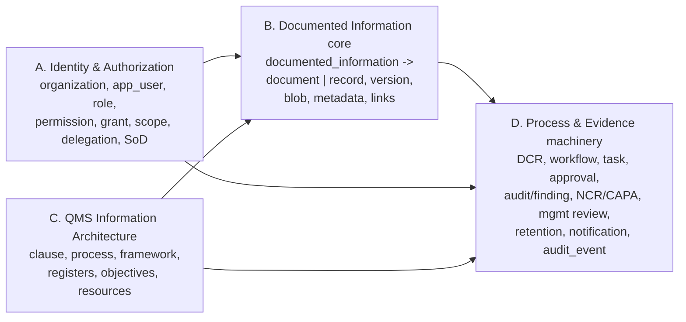

---

## 2. Organization, Instance Config, Storage & Backup

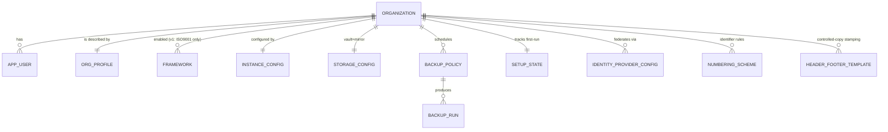

| Entity | Key attributes | Notes / source |
|---|---|---|
| `organization` | `id` PK, `legal_name`, `short_code` (unique, `[A-Z0-9-]`), `framework_id` (default), `created_at` | Singleton tenant in v1; `org_id` everywhere FKs here. `08 §6`. |
| `org_profile` | `org_id` PK/FK, `logo_blob_id`, `primary_locale` (`en`), `timezone` (IANA), `default_retention_defaults` jsonb | `08 §6`. Logo is a non-controlled system asset. |
| `setup_state` | `org_id` PK/FK, `state` enum(`UNINITIALIZED`,`IN_SETUP`,`OPERATIONAL`), `bootstrap_secret_hash`, `bootstrap_ttl`, `bootstrap_consumed_at`, gate flags `g_a..g_e` | `08 §2`. QMS locked until `OPERATIONAL`. |
| `instance_config` | `org_id` PK/FK, `license_key`, `named_user_cap`, `sizing_profile` enum(`S`,`M`,`L`), `feature_flags` jsonb (`part11=false`,`multi_standard=false`), `airgap` bool, `version`, `build_digest` | `08 §15.5`. Feature flags reserved, off in v1. |
| `storage_config` | `id` PK, `org_id`, `pg_dsn_ref`, `minio_endpoint`, `bucket_documents`, `bucket_renditions`, `bucket_records`, `bucket_staging`, `worm_verified_at`, `sse_enabled`, `mirror_path`, `mirror_layout` enum(`by_clause`,`by_process`,`hybrid`), `mirror_released_only` (forced true) | `08 §7`, `04 §10`. Mirror is read-only, regenerable, never backup-critical. **S8b shipped a minimal `storage_config` (`worm_verified_at` + `object_lock_mode`); the `mirror_*`/`bucket_*`/`sse_enabled` columns are still deferred. `mirror_layout` specifically: S9b/S9d build the by-clause + by-process trees **always-on (hybrid)**, so the toggle column lands with its config UI (v1).** |
| `backup_policy` | `id` PK, `org_id`, `destination`, `encryption_key_ref`, `cron`, `wal_pitr_enabled`, `retention_daily/weekly/monthly`, `alert_sink`, `last_restore_test_at`, `last_restore_test_result` | `08 §8`, `12 §8`. Restore-test gate G-C. |
| `backup_run` | `id` PK, `org_id`, `policy_id` FK, `started_at`, `finished_at`, `status`, `archive_checksum`, `includes_audit_checkpoint` bool, `rpo_estimate`, `rto_estimate` | `12 §8.2`. |
| `mirror_build` (**S-drift-2**) | `id` PK, `org_id`, `build_name` (unique, the `.builds/<hex>` dir), `built_at`, `swapped_at` (null until the post-swap stamp), `manifest` jsonb (file/symlink entries; doc-owned ones carry `document_id`/`version_id`), `manifest_sha256` (digest of the on-disk `_meta/manifest.json`), `documents`/`files`/`symlinks` counts | `05 §9.2`, R11. The mirror scan's **vault-side expected-state baseline** — the on-disk manifest is byte-verified against this row, never trusted as authority; `current` is verified against the newest *swapped* row (pointer integrity). A regenerable registry (mutable; keep-last-20 pruned, never the row `current` points at). |
| `drift_scan` (**S-drift-2**) | `id` PK, `org_id`, `kind` enum(`'MIRROR','BLOB_REHASH'` — `BLOB_REHASH` added additively in mig `0047`, S-drift-3), `started_at`/`finished_at`, `status` enum(`CLEAN`,`DIVERGENT`,`FAILED`), `counts` jsonb (scanned/stale/tampered/extra/missing/quarantined + `scan_id`/`pointer`/`rebuild_triggered`), `triggered_by` (`beat`/`sync`/`cli`) | `05 §9.2` "write scan summary", R11. One write-once row per scan; the S-drift-3 admin drift-status surface reads latest-per-kind via `ix_drift_scan_kind_started_at`. |
| `identity_provider_config` | `id` PK, `org_id`, `mode` enum(`local`,`ldap_ad`,`oidc_saml`), `connection` jsonb (secrets envelope-encrypted), `group_role_hints` jsonb, `break_glass_local_enabled` (forced true while 1 admin) | `08 §9`, `12 §2`. AuthN brokered by Keycloak; this row is EasySynQ-side config only. |
| `numbering_scheme` | `id` PK, `org_id`, `template` (e.g. `{TYPE}-{AREA}-{SEQ:000}`), `revision_label_style` enum(`letter`,`numeric`,`major_minor`), `per_area_sequencing` bool | `04 §7`. Identifier allocation backed by per-(type,area) PG sequences. |
| `header_footer_template` | `id` PK, `org_id`, `logo_blob_id`, `fields` jsonb, mandatory non-removable: rev + effective date + copy status | `04 §11.3`. |

**Constraints:** at least one `ORGANIZATION`; `setup_state.state` cannot reach `OPERATIONAL` unless gates G-A…G-E pass (`08 §14`); `worm_verified_at` must be non-null before any blob write (G-B).

---

## 3. Users, Roles, Permissions, Grants, Scopes (Cluster A)

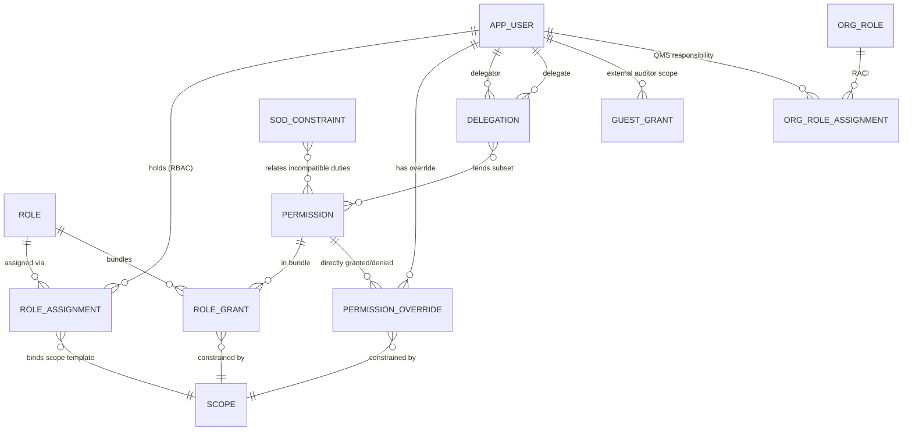

| Entity | Key attributes | Notes / source |
|---|---|---|
| `app_user` | `id` PK, `org_id`, `username` (unique/org), `email`, `display_name`, `keycloak_sub`, `status` enum(`INVITED`,`ACTIVE`,`LOCKED`,`DISABLED`,`RETIRED`), `mfa_enrolled`, `session_invalidated_at`, `is_guest` bool, `valid_until` (guests), `manager_id` uuid FK → `app_user.id` null | `08 §15.2`, `07`, `12 §2.5`. **Never hard-deleted** (attribution). PII anonymizable on `RETIRED` while `id` stable (`12 §9.4`). `manager_id` is the reporting-line FK that notification escalations resolve against (falling back to the QM/OrgRole where unset) (reconciled per Decisions Register R29). |
| `role` | `id` PK, `org_id`, `name` (unique/org), `description`, `is_reserved` bool (ADMIN, QMS_OWNER), `suggested_for_orgrole_id` (nullable hint) | `07 §4`. Convenience bundle, never binding (AZ-INV-4). |
| `role_grant` | `id` PK, `role_id` FK, `permission_id` FK, `scope_template` jsonb (parameterized, e.g. `FOLDER=:assigned_folder`) | `07 §4.1`. |
| `role_assignment` | `id` PK, `user_id` FK, `role_id` FK, `bound_scope` jsonb (concrete scope binding the template) | `07 §4.1`. |
| `permission` | `id` PK, `key` (`resource.action`, unique), `resource`, `action`, `finest_scope` enum, `sod_sensitive` bool, `sig_hook` bool | `07 §3` — the complete v1 catalog is seed data (24 resources). Seed keys are the **doc 07 canonical keys exactly**, including the import family `import.execute`/`import.review`/`import.commit`, `record.dispose`, the `changeRequest.*` / `capa.*` / `audit.*` families — see §3.1 (reconciled per Decisions Register R5). |
| `permission_override` | `id` PK, `user_id` FK, `permission_id` FK, `effect` enum(`ALLOW`,`DENY`), `scope_id` FK, `predicates` jsonb, `valid_from`, `valid_until`, `require_reason` bool | `07 §10`, `12 §3.2`. Deny-wins, beats role grants. |
| `scope` | `id` PK, `org_id`, `level` enum(`SYSTEM`,`PROCESS`,`FOLDER`,`DOC_CLASS`,`ARTIFACT`), `selector` jsonb (`process_id`/`folder_id`/`doc_class`/`artifact_id`), `predicates` jsonb (`lifecycle_state`,`requirement_source`,`pdca_phase`,`valid_from/until`,`ip_allow`,`evidence_pack_id`,`read_only`) | `07 §5`. ABAC layer; narrowing-only (AZ-INV-8). |
| `delegation` | `id` PK, `org_id`, `delegator_id`, `delegate_id`, `permissions[]` (subset), `scope_id`, `valid_from`, `valid_until`, `reason`, `revocable_by` enum, `status` enum(`ACTIVE`,`EXPIRED`,`REVOKED`) | `07 §8`. Subset-only, SoD survives, no re-delegation. |
| `sod_constraint` | `id` PK, `org_id`, `duty_a` jsonb, `duty_b` jsonb, `target_binding` enum(`SAME_VERSION`,`SAME_DOCUMENT`,`SAME_PROCESS`,`SAME_CAPA`), `severity` enum(`HARD_DENY`,`FLAG_AND_REQUIRE_REASON`), `org_overridable` bool | `07 §7`. SoD-1/SoD-3 non-overridable. |
| `guest_grant` | `id` PK, `user_id` (guest), `evidence_pack_id` FK, `valid_until`, `ip_allow`, `read_only` (forced) | `06 §7.4`, `07 §5.4`. Time-boxed external auditor — the **heavier** delivery path (a DB-backed guest identity + ABAC). **Deferred to v1.x**: S-pack-2 shipped the lighter Ed25519 signed-token path instead (`pack_share_link`, §5.7). |
| `org_role` | `id` PK, `org_id`, `name` (e.g. "Process Owner of Purchasing", "Top Management"), `description` | `02 §3.4`. **QMS role ≠ permission role** — RACI/accountability only, drives assignee resolution, not authz. |
| `org_role_assignment` | `id` PK, `org_role_id` FK, `user_id` FK, `process_id` (nullable) | `02 §3.4`, `10 §2.3`. |
| `working_calendar` | `id` PK, `org_id`, `name`, `working_days` jsonb (week mask), `holidays` jsonb (org holiday dates), `is_default` bool | Org holidays/working days; **business-day SLAs and notification escalations resolve against this** (reconciled per Decisions Register R29). |

**Constraints:** ADMIN holds no QMS-content permission by default (`07 §2.1`); last-ADMIN revoke rejected; `app_user.username` unique per org; `permission.key` globally unique; `sod_constraint` evaluated against immutable version/audit history (cannot edit-then-approve).

### 3.1 Permission-catalog seed (canonical, matches doc 07; reconciled per Decisions Register R5)

The `permission` table is seeded from the **doc 07 canonical catalog**. The seed keys below are normalized — all prior variant spellings collapse onto these (e.g. `document.view`→`document.read`, `document.submit_for_review`→`document.submit`, `dcr.raise`→`changeRequest.create`, `capa.raise`→`capa.create`, `audit_qms.conduct`→`audit.conduct`, and `import.initiate`/`import.administer`→the three import keys). Record disposition is `record.dispose` (**NOT** `record.retire`).

| Family | Seeded keys (verbatim) |
|---|---|
| Document | `document.read`, `document.read_draft`, `document.create`, `document.checkout`, `document.edit`, `document.submit`, `document.approve`, `document.release`, `document.obsolete`, `document.export` |
| Record | `record.create`, `record.read`, **`record.dispose`** |
| Change Request (DCR) | `changeRequest.create`, `changeRequest.assess`, `changeRequest.route`, `changeRequest.approve`, `changeRequest.implement`, `changeRequest.close` |
| CAPA | `capa.create`, `capa.read`, `capa.update`, `capa.record_rca`, `capa.plan_action`, `capa.capture_effectiveness`, `capa.verify`, `capa.close` (`capa.own` is a **role concept, not a permission**) |
| Internal audit | `audit.conduct` (and the rest of the `audit.*` namespace — **NOT** `audit_qms.*`) |
| Import | **`import.execute`** (run the scan/classify), **`import.review`** (review/correct classifications), **`import.commit`** (commit to vault) |
| Grant/revoke | `permission.grant`, `permission.revoke` — scopable to CONTENT domains within QMS scope for the QMS Owner; system-permission granting stays SYSTEM-scope admin-only |

**Seeded role bundles** (the `role` + `role_grant` rows seeded alongside the permission catalog — see `07 §4.2` for the full descriptions):

| Seeded role | `is_reserved` | Core bundle (abbreviated) |
|---|---|---|
| **System Administrator** | yes | All §3.9 perms; no QMS-content perms. |
| **QMS Owner** | yes | Org-wide `*.read`; framework/lifecycle config (QMS side); `mgmtReview.*`; `permission.grant` scoped to CONTENT domains. |
| **Register Steward** | yes | Stewards the org-level registers (Risk 6.1 / Context 4.1 / Interested Parties 4.2): start-revision / publish / release the register heads; holds `document.release` @ SYSTEM, excludes `document.approve` for SoD (the approver stays a separate Approver/QMS-Owner; release stays releaser ≠ approver). (R52, migration `0062`.) |
| **Process Owner** | no | Scoped to `:process`: `document.create/edit/submit`, `record.create/read`, `capa.create`, `process.manage`. |
| **Author** | no | Scoped to `:folder`/`:process`: `document.create/checkout/edit/submit`, `document.read_draft`, `record.create`, `changeRequest.create`. No `approve`/`release`. |
| **Approver** | no | Scoped to `:doc_class`/`:process`: `document.review/approve`, `changeRequest.approve`. No `edit`/`submit` on the same artifact (SoD). |
| **Internal Auditor** | no | Broad `*.read`; `audit.create/conduct/close`, `finding.*`. Hard-excludes `document.edit/approve/release`. |
| **Top Management** | yes | Membership-pool only (no direct permission grants); members are the eligible `meaning=verify` signers for the leadership-authorization preflight on POL/OBJ/MR release. (Migration `0038`.) |
| **Employee (Read-only)** | no | Scoped to `:area`: `document.read`, `document.print_controlled`, `document.acknowledge`, `record.read` (own/area). |
| **External Auditor (Guest)** | no | `document.read` + `record.read` + `report.read` only within a bound Evidence Pack. |

---

## 4. Clauses, Processes, Frameworks — the ISO Information Architecture (Cluster C)

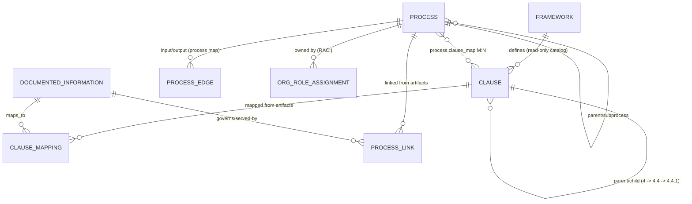

| Entity | Key attributes | Notes / source |
|---|---|---|
| `framework` | `id` PK, `org_id`, `code` (`iso9001:2015`), `name`, `is_active`, `is_authorable` (false in v1) | `02 A1/A2`, `07 §3.6`. Multi-standard additive. |
| `clause` | `id` PK, `framework_id` FK, `number` (`8.4`), `parent_id` (self), `title`, `intent_text` (seeded), `is_mandatory_star` bool, `pdca_phase` enum, `requirement_node` bool | `02 §2`. **Read-only reference data**; no `clause.edit` permission (`07 §3.6 note`). |
| `process` | `id` PK, `org_id`, `name` (unique/org), `parent_id` (self, subprocess), `owner_org_role_id`, `pdca_phase`, `criteria` text, `state` enum(`SEED`,`ACTIVE`), `excluded` bool, `is_outsourced` bool, `outsourced_supplier_id` uuid FK → `supplier` null | `02 §3.3`, `08 §12`. Clause 4.4 graph node; `SEED` from wizard, confirmed by Mara. `is_outsourced`/`outsourced_supplier_id` represent an outsourced/external process node linked to the supplier that performs it (ISO 9001 8.4.1 + 4.4) (reconciled per Decisions Register R17). **Built S9c ✅** (`0019`; `pdca_phase` reuses the `0017` enum; the owner/supplier FKs are nullable — `org_role`/`supplier` are empty-but-present, no authoring endpoint in S9c). |
| `process_edge` | `id` PK, `from_process_id`, `to_process_id`, `io_label` | `02 §5.3`. Process Map graph (no self-loops). |
| `clause_mapping` | `id` PK, `clause_id` FK, `documented_information_id` FK, `is_requirement_level` bool | `02 §2.1`. The M:N join driving the compliance checklist + clause spine. **Audited link.** |
| `process_link` | `id` PK, `process_id` FK, `documented_information_id` FK | `02 §6.2`. M:N driving Process Map lens. **Audited link.** |

**Constraints:** `clause` is INSERT-by-seed only (no user edit); `process.name` unique per org; `process_edge` forbids self-loops; an artifact requires `≥1 clause_mapping` before `Draft → In Review` (`04 §6.1`); excluded processes hide IA sections but rows persist (`02 §2 note`).

---

## 5. Documented Information Core — the Maintain/Retain Spine (Cluster B)

This is the heart of the model: the abstract superclass and its two subtypes, expressed as **class-table inheritance** (`documented_information` base + `document` / `record` extension tables sharing the same PK).

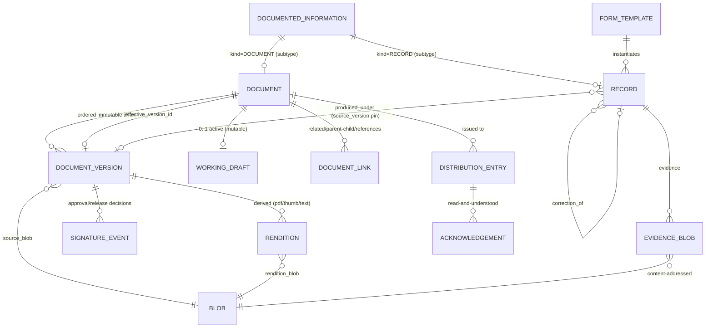

### 5.1 `documented_information` (abstract base — universal control fields)

| Attribute | Type | Notes |
|---|---|---|
| `id` PK | uuid | Stable internal identity. |
| `org_id`, `framework_id` | uuid | Tenancy + standard. |
| `identifier` | text | Human doc code (`SOP-PUR-014`); unique per org; immutable; vault-allocated (`04 §7`). |
| `legacy_identifier` | text null | Preserved on import (`04 §7.2`). |
| `title` | text | |
| `kind` | enum(`DOCUMENT`,`RECORD`) | Discriminator driving all lifecycle behavior. |
| `concrete_type` | enum | Leaf type (Procedure, Form/Template, Audit, CAPA, Calibration, …). |
| `requirement_source` | enum(`iso_mandatory`,`org_determined`) | Drives ★ checklist + SoD default. |
| `pdca_phase` | enum(`PLAN`,`DO`,`CHECK`,`ACT`) | Dashboard placement. |
| `owner_user_id` | uuid FK | Accountable person (Cl 5.3). |
| `owner_org_role_id` | uuid FK null | QMS responsibility (RACI). |
| `folder_path` | ltree null | Materialized logical folder path; a **scope selector**, not physical storage. Scope evaluation uses **subtree-prefix (ltree ancestor) matching**; `FOLDER` survives as a first-class scope level. Set/edited via document metadata (metadata UI affordance) (reconciled per Decisions Register R6). |
| `import_provenance` | jsonb null | `source_rel_path`, `source_sha256`, `run_id`, `classifier_version`, `confidence`, `decided_by` (`09 §10.2`). |
| `created_at/by` | | |

> `clause_map[]` and `process_links[]` are the `clause_mapping` / `process_link` join tables (§4), keyed to `documented_information_id`. Registers, objectives, etc. are also `documented_information` rows (see §6 reconciliation R3).

### 5.2 `document` (subtype — maintained)

| Attribute | Type | Notes |
|---|---|---|
| `id` PK/FK | uuid | = `documented_information.id`. |
| `current_state` | enum(`Draft`,`InReview`,`Approved`,`Effective`,`UnderRevision`,`Superseded`,`Obsolete`) | **Derived headline** (state lives precisely on versions). `04 §3.1`. |
| `effective_version_id` | uuid FK null | The single governing version (or null). |
| `document_type` | enum | Quality Policy, Manual, Scope Statement, Process Definition, Procedure/SOP, Work Instruction, Form/Template, Quality Objective, Register, … (catalog: see `document_type` entity in §6). |
| `document_level` | enum(`L1_POLICY`,`L2_PROCEDURE`,`L3_WORK_INSTRUCTION`,`L4_FORM`) | Explicit ISO documentation level (extensible); the `DOC_CLASS` authz scope (`07`) matches on `document_level` (and optionally `kind`+`type`), and doc 10 routing key `document_class` resolves to `document_level` (reconciled per Decisions Register R7). |
| `is_singleton` | bool | Quality Policy / Scope Statement (vault refuses a 2nd **Effective** at a time, not a 2nd ever — see §5.2 singleton note, reconciled per Decisions Register R25). |
| `review_period_months` | integer (months) | Nullable; `null` = no scheduled review. **NOT `interval`** — psycopg3 cannot load month-bearing PG intervals into `timedelta` (S-drift-1). |
| `next_review_due` | date STORED | Nullable. Recomputed on release (`_cutover`), on `review_confirmed`, and on PATCH. Anchor = `MAX(last_reviewed_at, effective_from)` + months (day-clamped). (S-drift-1) |
| `last_reviewed_at` | timestamptz | Nullable; set to `now()` on `review_confirmed`. (S-drift-1) |
| `review_state` | derived at read (`current`/`due_soon`/`overdue`) | **Never stored/indexed** — computed from `next_review_due` + org-tz. `05 §9.3`. (S-drift-1) |
| `classification` | enum(`Public`,`Internal`,`Confidential`,`Restricted`) | Watermark + export gating. |
| `acknowledgement_required` | bool | |
| `retention_of_superseded` | uuid FK → `retention_policy` | How long superseded versions kept. |
| `checkout_user_id`, `checkout_at`, `lock_token` | | Redis lock mirror (authority is Redis; this is for display/recovery). |

### 5.3 `document_version` (immutable snapshot)

| Attribute | Type | Notes |
|---|---|---|
| `id` PK | uuid | |
| `document_id` FK | uuid | |
| `version_seq` | int | System-owned monotonic; never reused (`05 §2.2`). |
| `revision_label` | text | Projected per scheme (`Rev C`/`2.0`). |
| `change_significance` | enum(`MAJOR`,`MINOR`) | Set on DCR/check-in (`05 §2.2`). |
| `version_state` | enum(`Draft`,`InReview`,`Approved`,`Effective`,`Superseded`,`Obsolete`) | The authoritative per-version state. `04 §3.1`. |
| `source_blob_id` FK | uuid | The exact bytes (`04 §2.2`). |
| `metadata_snapshot` | jsonb | Title/type/owner/clause_map/process_links/classification **as they were** (`04 §2.2`). |
| `change_reason`, `change_summary` | text NOT NULL | Mandatory at check-in (INV-3 / 422 otherwise). |
| `dcr_id` FK null | uuid | The DCR that produced it (reverse of `dcr.resulting_version_id`; the cross-FK realized in S-dcr-5, mig `0044`, `use_alter`). |
| `effective_from`, `effective_to` | timestamptz null | Effectivity window; `effective_to` auto-set on supersession. `effective_from` is stored as **`timestamptz` in UTC** but **captured in the UI as a DATE interpreted as local-midnight in the org timezone and converted to UTC at save**; effectivity is displayed in org tz while the server UTC clock remains authoritative for cutover (reconciled per Decisions Register R8). |
| `superseded_by_version_id` FK null | uuid | Forward link in supersession chain. |
| `imported` | bool | Baseline-imported provenance (`05 §2.6`). |
| `created_at/by` | | No `updated_at`. |

> **INV-1 (single effective) enforcement:** `CREATE UNIQUE INDEX ON document_version (document_id) WHERE version_state = 'Effective'` — a partial unique index. Supersession runs in one SERIALIZABLE transaction (`04 §3.4`).

### 5.4 `blob`, `rendition`, `working_draft`

| Entity | Key attributes | Notes |
|---|---|---|
| `blob` | `sha256` PK, `org_id`, `size_bytes`, `mime_type`, `bucket`, `object_key`, `worm_until`, `sse`, `verified_at`, `verify_failed_at` | Content-addressed, deduplicated, WORM. Identity *is* the hash (`04 §2.1`, `12 §5`). `verified_at` = the D1 rolling-verify cursor (S-drift-3): stamped on a passing re-hash ONLY. `verify_failed_at` (mig 0047) = the alarm latch: set on a finding, cleared on a pass, sorted FIRST in the rotation sample — an unresolved finding re-alarms every run regardless of the never-verified backlog. |
| `rendition` | `id` PK, `document_version_id` FK (or `record_id`), `rendition_type` enum(`pdf`,`thumbnail`,`extracted_text`), `blob_sha256` FK | Derived, rebuildable, never authoritative. |
| `working_draft` | `id` PK, `document_id` FK (unique — at most one active), `checked_out_by`, `checked_out_at`, `source_version_id`, `scratch_blob_ref`, `lock_ttl` | The only mutable surface; frozen into a version on check-in (`04 §2.1`). |

### 5.5 `record` (subtype — retained, immutable)

| Attribute | Type | Notes |
|---|---|---|
| `id` PK/FK | uuid | = `documented_information.id`. |
| `record_type` | enum | AUDIT, AUDIT_FINDING, CAPA, COMPETENCE, CALIBRATION, MGMT_REVIEW, SUPPLIER_EVAL, RELEASE, KPI_READING, SATISFACTION, TRACEABILITY, PROPERTY_EVENT, CHANGE, EVIDENCE, FILLED_FORM, **COMPLAINT** (`06 §2`; COMPLAINT added per Decisions Register R16). |
| `captured_at` | timestamptz | Point-in-time; immutable once set. |
| `captured_by` | uuid FK | |
| `content_hash` | sha256 | Over canonical structured content + attached blob digest manifest (`06 §3`). |
| `source_document_id`, `source_version_id` | uuid FK null | **Pinned** exact version produced under (survives supersession). Every Record produced UNDER a controlled document pins `source_version_id`; **ad-hoc EVIDENCE records may leave it null** (nullable allowed) (reconciled per Decisions Register R21). |
| `form_field_values` | jsonb null | Validated against pinned template Version's `Schema`. |
| `correction_of` | uuid FK null | Prior record this corrects. |
| `superseded_by_correction` | uuid FK null | Inverse. |
| `retention_policy_id` | uuid FK | Snapshotted at capture (one-way ratchet). |
| `retention_basis_date` | date | Anchor for retention computation. |
| `disposition_state` | enum(`ACTIVE`,`DUE_FOR_REVIEW`,`ON_HOLD`,`DISPOSED`) | `06 §5.3`. |
| `legal_hold` | bool | Overrides expiry. |
| `structured_pdf_blob_sha256` (**S-rec-3**) | text null, **NO FK** | Pointer to the cached structured-record PDF — a DERIVED, regenerable rendition (§5.4) in the non-WORM renditions bucket, built best-effort at Stage 2. Plain Text (the `evidence_pack.zip_blob_sha256` R27 precedent) so the WORM-destroy hatch never aborts; nulled + the `blob` row dropped on destroy (blob-row-iff-bytes). NOT part of `content_hash`. |

| Supporting entity | Key attributes | Notes |
|---|---|---|
| `form_template` (**S-rec-3**) | `id` PK/FK = `documented_information.id` (a shared-PK subtype of a `kind=DOCUMENT`, `document_type` code `FRM`; there is no separate `document` table — DI is the single kind-discriminated base), `org_id`, `field_schema` jsonb (the **editable WORKING copy** — a bespoke field-list DSL; doc 06 §4.2) | A maintained Document that instantiates Records (`06 §1.2`, `02 §4.2`). The working `field_schema` is **frozen into each `document_version.metadata_snapshot` at check-in** (`metadata_snapshot.field_schema`) — Mode-B capture validates + pins the schema from the record's `source_version_id` snapshot, **never** this mutable row, so already-captured records keep showing their edition (the v2.0 ratchet, doc 06 §4.2). |
| `evidence_blob` | `id` PK, `record_id` FK, `blob_sha256` FK, `is_original` bool | Content-addressed attachment(s); original never mutated. |
| `requirement_link` | `id` PK, `record_id` FK, `clause_id` FK (requirement node) | Finer-grained direct requirement traceability (`06 §3`). |
| `evidence_for_link` | `id` PK, `record_id` FK, `target_type` enum(`finding`,`capa_stage`,`clause`,`process`,`document`), `target_id` | Link-as-evidence (Mode C), audited, never copies (`06 §4.3`). |

### 5.6 Document linking & distribution

| Entity | Key attributes | Notes |
|---|---|---|
| `document_link` | `id` PK, `org_id`, `from_document_id`, `to_document_id`, `link_type` enum(`parent_of`,`child_of`,`references`,`supersedes`), `created_by`, `created_at` | Where-used / impact graph (`05 §7.1`, `13 §3.4`). **S-dcr-2 (mig `0041`) realizes it** — editable metadata (`GRANT SELECT,INSERT,DELETE`, NOT append-only; the `clause_mapping` precedent); `UNIQUE(from,to,type)` + `ck_document_link_no_self`; FK names `fk_doc_link_from/to` (<63-char). CRUD on `document.manage_metadata`; traversed by `GET /documents/{id}/where-used`. |
| `distribution_entry` | `id` PK, `document_id` FK, `target_type` enum(`user`,`org_role`,`process`,`folder`), `target_id`, `ack_required` bool | Dynamically resolved at release (`04 §8.1`). |
| `acknowledgement` | `id` PK, `document_version_id` FK (**pinned**), `user_id` FK, `acknowledged_at`, `client_ip` | An immutable Record (evidence of awareness, Cl 7.3). Re-release re-triggers (`04 §8.2`). |

> **As built (S-ack-1, mig `0048` — R43):** `acknowledgement` adds `org_id` (the §1.1 convention), `document_id` (coverage), and `created_reason` enum(`release`,`target_entry`); carries NO FK to `distribution_entry` (deletable config vs durable evidence); append-only via DB `REVOKE UPDATE, DELETE` (harder than §1.2's "App"); `UNIQUE(user_id, document_version_id)`. `distribution_entry` adds `org_id` + `UNIQUE(document_id, target_type, target_id)`; grants `SELECT,INSERT,DELETE` only (change = delete + re-add); the API 422s `process`/`folder` targets until owner-assignment binding lands. The `acknowledgement_required` flag landed per §5.2 — as built on `documented_information` (the supertype), not the `document` subtype row. Re-release re-trigger is **MAJOR-only with carry-forward satisfaction** per R43 (superseding the `04 §8.2` blanket note above).

**Constraints / invariants on Cluster B:** exactly one `Effective` version per document (INV-1); released versions immutable (INV-2); check-in requires non-empty change_reason + significance (INV-3); author ≠ sole approver, auditor cannot approve (INV-4, via `sod_constraint`); records never edited — corrections only (R3/INV-7); record pins are immutable (INV-7); `document.is_singleton` enforces **exactly one `Effective` instance at a time** (NOT one instance ever) for the Quality Policy / Scope Statement — a draft successor may coexist while the current governs, and this survives import dedup and multi-site (reconciled per Decisions Register R25).

### 5.7 `evidence_pack`, `pack_item` & `pack_share_link` (Evidence Packs / UJ-7 — as built, slices S-pack-1/2 + S-aud-capa-pack, doc 06 §7)

| Entity | Key attributes | Notes |
|---|---|---|
| `evidence_pack` | `id` PK, `org_id`, `framework_id`, `title`, `scope_kind` enum(`CLAUSE`,`PROCESS`,`FINDING`,`CAPA`), `scope_selector` jsonb (`clause_ids`/`process_ids`/`finding_ids`/`capa_ids`), `period_start/end` (date overlay), `status` enum(`DRAFT`,`BUILDING`,`SEALED`,`FAILED`), `build_started_at`, `item_count`, `gap_summary` jsonb, `exclusion_summary` jsonb, `content_hash` (the domain-separated manifest seal), `zip_blob_sha256` (**plain Text, NO FK to `blob`**), `portfolio_blob_sha256` (**S-pack-2** — the cached PDF portfolio pointer; plain Text, NO FK; nullable, a derived rendition), `pack_record_id` FK→`record` (nullable until sealed), `error`, `created_by`, `created_at`, `generated_at` | The pack header. Sealed = an immutable, content-addressed ZIP written to the WORM `records` bucket + registered as a `RETAIN_PERMANENT` EVIDENCE `record` (`pack_record_id`). The ZIP blob is reached via `pack_record_id → evidence_blob → blob` — `zip_blob_sha256` carries **no `blob` FK** so the pack's R27 WORM-destroy hatch never aborts on a RESTRICT FK (`06 §7.4`). |
| `pack_item` | `id` PK, `org_id`, `pack_id` FK→`evidence_pack` (**ON DELETE CASCADE**), `item_type` enum(`RECORD`,`DOCUMENT_VERSION`), `record_id` FK→`record` (nullable), `version_id` FK→`document_version` (nullable, the PINNED governing version), `inclusion_status` enum(`INCLUDED`,`EXCLUDED_PERMISSION`,`EXCLUDED_ABSENCE`), `exclusion_reason`, `content_hash_at_seal`, `created_at` | The resolved membership. **R28: the exclusion report IS this table** — every in-scope candidate (incl. the ones left out) gets a row with its classifying status; a silently-dropped item is a defect. Rebuilt atomically (delete-all-then-reinsert) at preview and again at seal. |
| `pack_share_link` (**S-pack-2**) | `id` PK, `org_id`, `pack_id` FK→`evidence_pack` (**RESTRICT**), `token_digest` (**UNIQUE** — SHA-256 of the issued token; the raw token is **never stored**), `recipient` (audit label), `expires_at`, `created_by`, `created_at`, `revoked_at`/`revoked_by`/`revoke_reason` (nullable), `download_count`, `last_downloaded_at` | The time-boxed external-delivery grant (`06 §7.4`). The bearer credential is a domain-separated Ed25519 token (`services/packs/share_token.py`) validated **outside the PEP** by the public guest endpoints, which then consult this row for the authoritative, **revocable** state (re-checked on every access). State (`ACTIVE`/`EXPIRED`/`REVOKED`) is **derived** from the nullable timestamps (no status enum — the `worm_destroy_request` precedent). |

`event_type` gains `PACK_GENERATED` / `PACK_BUILD_FAILED` (S-pack-1) and `PACK_SHARED` / `PACK_DOWNLOADED` / `PACK_SHARE_REVOKED` (S-pack-2); `audit_object_type` gains `evidence_pack` (all pack lifecycle + delivery events key on the pack-header id). **S-pack-2 took the Ed25519 signed-token-outside-the-PEP delivery path** (the `pack_share_link` row above); the heavier `guest_grant` table + the `scope.predicates.evidence_pack_id` ABAC bound (§3, above) + a Keycloak guest identity stay **deferred to v1.x** (the token path supersedes them for v1).

**S-aud-capa-pack** (migration `0039`) adds `pack_scope_kind` values **`FINDING` / `CAPA`** (pure `ALTER TYPE … ADD VALUE`; no schema/column change — `scope_selector` is already a polymorphic jsonb bag, now also keyed `finding_ids` / `capa_ids`). A FINDING/CAPA pack resolves the records linked AS EVIDENCE to the finding(s) / the CAPA's stages (`evidence_for_link(target_type=finding|capa_stage)`); the finding/CAPA **subject is never a `pack_item`** (a record subtype has no `evidence_blob`), so its substance rides a synthesized, content-hash-**sealed dossier** written into the pack ZIP (`findings/<id>.json` / `capas/<id>.json`: the finding fields / the CAPA stage trail + e-signature metadata, doc 06 §7.1). The dossier folds into `content_hash` as a **v2** seal (`easysynq.evidencepack.v2`; CLAUSE/PROCESS stay v1) via a `dossier_digest` over the manifest's per-file SHA-256s (ZIP-reconstructable). No new table, FK, permission key, event type, or Celery task.

---

## 6. Registers, Objectives, Resources & the QMS Plan/Support Entities

These satisfy clauses 4–7 expected documented information. Per reconciliation **R3**, registers/objectives are **maintained Documents** (`documented_information` with `kind=DOCUMENT`) whose *rows* version together with per-row history; the tables below are their row/satellite stores.

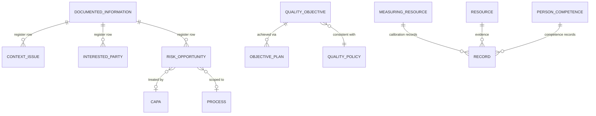

| Entity | Key attributes | Notes / source |
|---|---|---|
| `context_issue` | `id` PK, `register_doc_id` FK, `org_id`, `classification` enum(`internal`,`external`), `category` enum(`strength`,`weakness`,`opportunity`,`threat`) null, `status` enum(`active`,`closed`), `description`, `last_reviewed_at` null, `row_version`, audit bookkeeping (`created_at`/`_by`, `updated_at`/`_by`) | Cl 4.1 (`02`). As-built (S-context-1, migration `0060`, R50): a 1:many satellite of a `kind=DOCUMENT` `CTX` singleton head (the R49 register-as-Document shape), **org-level — no `process_id`** (clause 4.1 is org-wide; rides `register.*` @ SYSTEM). The v1 model **enriches** the contracted minimum (`classification`+`description`) with the optional SWOT `category`, the `status` lifecycle, and `last_reviewed_at` (R50). |
| `interested_party` | `id` PK, `register_doc_id` FK, `org_id`, `party_type` enum(`customer`,`regulator`,`supplier`,`employee`,`owner`,`community`,`partner`), `party_name`, `needs_expectations`, `influence` enum(`low`,`medium`,`high`) null, `status` enum(`active`,`closed`), `last_reviewed_at` null, `row_version`, audit bookkeeping (`created_at`/`_by`, `updated_at`/`_by`) | Cl 4.2 (`02`). As-built (S-interested-parties-1, migration `0061`, R51): a 1:many satellite of a `kind=DOCUMENT` `IPR` singleton head (the R49/R50 register-as-Document shape), **org-level — no `process_id`** (clause 4.2 is org-wide; rides `register.*` @ SYSTEM). **⚠ `org_id` added here** — the minimal contract omitted it (the only register satellite that did), an editorial gap corrected when built (R50/R51). The v1 model **enriches** the contracted minimum (`party_name`+`needs_expectations`) with the `party_type` ISO-4.2 spine, the optional `influence` relevance axis, the `status` lifecycle, and `last_reviewed_at` (R51). |
| `risk_opportunity` | `id` PK, `register_doc_id` FK, `type` enum(`risk`,`opportunity`), `description`, `process_id` null, `clause_id` null, `likelihood`, `severity`, `risk_rating` (derived/stored), `scoring_method`, `treatment`, `effectiveness`, `linked_capa_id` null, `row_version` | Cl 6.1; feeds mgmt-review input (e). Doc 10 workflow routing on `subject.risk_rating` and doc 13 high-risk dashboards resolve against these real fields (reconciled per Decisions Register R18). |
| `quality_policy` | `id` PK/FK (singleton `document`) | Cl 5.2 ★, apex. |
| `quality_objective` | `id` PK/FK (a `document`, kind=DOCUMENT subtype of `documented_information`, type `OBJ`), `org_id`, `target_value`, `unit`, `baseline_value` (nullable), `current_value` (mutable rollup — NOT versioned; rolled from append-only `KPI_READING` records under `FOR UPDATE`+`populate_existing`), `direction` (`objective_direction` enum: `HIGHER_IS_BETTER`/`LOWER_IS_BETTER`), `at_risk_threshold` (nullable), `due_date`, `process_id` (nullable), `policy_id` FK→`documented_information` (nullable — validated against the current Effective `POL` singleton) | Cl 6.2 ★; measurable by construction; drives Check dashboard. **Built in mig `0049` (S-obj-1, R44).** `owner_user_id` is the BASE `documented_information.owner_user_id` — NOT duplicated on this satellite. RAG (`green`/`amber`/`red`/`unmeasured`) is computed at read, never stored (N9/N6). |
| `objective_plan` | `id` PK, `org_id`, `objective_id` FK→`quality_objective`, `action`, `resource` (nullable), `responsible_user_id` (nullable), `due_date` (nullable) | Cl 6.2. **Built in mig `0049`.**  |
| `resource` | `id` PK, `org_id`, `resource_type` enum(`infrastructure`,`environment`,`knowledge`,`general`), `name`, `description` | Cl 7.1.x. |
| `knowledge_item` | `id` PK, `org_id`, `title`, `body_ref` | Cl 7.1.6. |
| `communication_plan` | `id` PK/FK (a `document`) | Cl 7.4. |
| `measuring_resource` | `id` PK, `org_id`, `name`, `identifier`, `calibration_interval`, `next_due`, `standard_traceability` | Cl 7.1.5; calibration evidence are `record`s (`06`). |
| `person_competence` | `id` PK, `user_id` FK, `competence_item`, `required` bool, `held` bool, `expiry` null | Cl 7.2; backing for competence dashboard (`13 §5.8`). |
| `supplier` | `id` PK, `org_id`, `name`, `status` enum(`ACTIVE`,`UNDER_EVALUATION`,`INACTIVE`), `re_eval_due` date | Cl 8.4; evaluations are `record`s. **Built empty-but-present S9c ✅** (`0019`; the `status` value set was unspecified here — defined as the v1 forward-compat choice). |
| `design_project` | `id` PK, `org_id`, `name`, `state` | Cl 8.3 (hideable when excluded); D&D records attach. |
| `document_type` | `id` PK, `org_id`, `name`, `document_level` enum(`L1_POLICY`,`L2_PROCEDURE`,`L3_WORK_INSTRUCTION`,`L4_FORM`) | Document-type catalog carrying the explicit ISO documentation level (extensible). `DOC_CLASS` authz scope (`07`) and doc 10 routing key `document_class` resolve to `document_level` (reconciled per Decisions Register R7). |

> Operational evidence rows (release, traceability, KPI reading, satisfaction, supplier eval, calibration, competence, change) are **Records** (§5.5), not separate base tables — they carry their type-specific fields in `record.form_field_values` / dedicated satellite columns per `record_type` (`06 §2`). `kpi_measurement` and `satisfaction_survey` exist as thin satellites for the dashboard time-series (`13 §5.2`).

| Satellite | Key attributes | Notes |
|---|---|---|
| `kpi_measurement` | `id` PK, `org_id`, `record_id` FK→`record` (the WORM `KPI_READING` evidence row), `objective_id` FK→`quality_objective` (nullable), `process_id` (nullable), `period` date, `value`, `target_at_capture` (frozen at capture — a later target edit cannot rewrite a past verdict), `unit`, `source` (nullable) | Cl 9.1.1 time-series (`06`, `13`). Append-only (`REVOKE UPDATE,DELETE` — the `capa_stage`/`acknowledgement` house style). **Built in mig `0049` (S-obj-1, R44).** |
| `satisfaction_survey` | `id` PK, `record_id` FK, `period`, `score`, `respondents` | Cl 9.1.2. |
| `complaint` | `id` PK/FK (a `record`, COMPLAINT), `org_id`, `customer`, `received_at`, `channel`, `description`, `severity` null, `spawned_capa_id` FK→`capa` null UNIQUE | Cl 8.2.1 lightweight customer-complaint capture; can **one-click spawn a CAPA** with `source=complaint` (`spawned_capa_id` is the idempotency latch; reconciled per Decisions Register R16). **S-capa-1 (mig `0036`) implements `complaint` as a `kind=RECORD` shared-PK subtype** (`complaint.id` IS `record.id`) — a justified divergence from the literal `id PK + record_id FK` satellite phrasing for consistency with the `audit`/`capa` record-subtype family (per R39, the `audit_program` divergence precedent). |

---

## 7. Document Change Requests (DCR), Workflows & Tasks (Cluster D — change machinery)

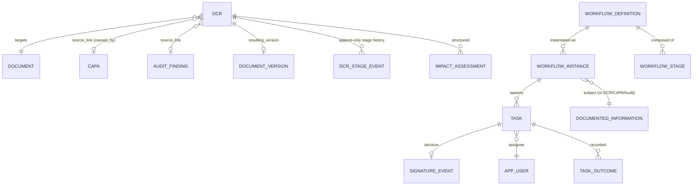

| Entity | Key attributes | Notes / source |
|---|---|---|
| `dcr` | `id` PK, `org_id`, `identifier` (`DCR-2026-0042`), `target_document_id`, `change_type` enum(`REVISE`,`CREATE`,`RETIRE`), `change_significance`, `reason_for_change` enum+text (`regulatory`,`audit_finding`,`capa`,…), `source_link_type`+`source_link_id` (CAPA/finding/mgmt_review/risk), `proposed_effective_from`, `resulting_version_id`, `spawn_idempotency_key`, `state` enum(`Open`,`Assessed`,`Routed`,`InApproval`,`Approved`,`Implemented`,`Closed`,`Cancelled`,`Rejected`), `decision`, `decided_by`, `decided_at` | **A controlled WORKFLOW object with a mutable `state` column** plus an **append-only history of stage events** (`dcr_stage_event`); it is **NOT a `kind=RECORD` immutable artifact** — its closed form is retained as a record-like snapshot (reconciled per Decisions Register R22). Lifecycle `Open → Assessed → Routed → InApproval → Approved → Implemented → Closed` with terminal states `Cancelled`/`Rejected`; doc 10 short form (Raised/Triage/Accepted) maps onto these — `05 §5`, `10 §3.1`. **S-dcr-1 (mig `0040`) realizes `dcr` + `dcr_stage_event`** as own tables (the InApproval changes-requested loop targets `Open` per R40); `source_link_id` is a polymorphic UUID with **no FK** (the `signature_event` precedent). **S-dcr-5 (mig `0044`) lands** the `resulting_version_id` ↔ `document_version.dcr_id` cross-FK (`use_alter` 2-table cycle) + `spawn_idempotency_key` (the CAPA→DCR spawn dedup, partial-UNIQUE `(org_id, source_link_id, spawn_idempotency_key)`); S-dcr-2 (mig `0041`) realized `impact_assessment`. **The DCR family is COMPLETE (S-dcr-1..5).** |
| `dcr_stage_event` | `id` PK, `dcr_id` FK, `from_state`, `to_state`, `actor_id`, `occurred_at`, `comment`, `payload` jsonb | **Append-only** per-DCR stage-transition history (earlier events never rewritten); the mutable `dcr.state` is the headline, this table is the immutable trail (reconciled per Decisions Register R22). |
| `impact_assessment` | `id` PK, `org_id`, `dcr_id` FK, `dimension` enum(7 doc 05 §5.3 dims), `auto_populated` jsonb, `requester_annotation`, `created_at`, `updated_at` | Pre-populated from where-used (`05 §5.3`). **S-dcr-2 (mig `0041`) realizes it** — `POST /dcrs/{id}/assess` (Open→Assessed) UPSERTs one row per dimension (`UNIQUE(dcr_id,dimension)`; auto_populated re-computed, requester_annotation preserved); `GET/PUT /dcrs/{id}/impact`. A CREATE DCR → all dims `{applicable:false}`. |
| `workflow_definition` | `id` PK, `org_id`, `key` (`document_approval`), `version` int, `effective` bool, `subject_type` enum(`DOCUMENT`,`DCR`,`CAPA`,`AUDIT`,`MGMT_REVIEW`,`PERIODIC_REVIEW`,`DOC_ACK` *(S-ack-1)*,`IMPROVEMENT_INITIATIVE` *(S-improvement-4, mig `0053`)*,`LEADERSHIP_AUTHORIZATION` *(S-leadership-1, mig `0054`)*), `stages` jsonb, `entry_conditions` jsonb, `default_sla` jsonb | Declarative, versioned, data-not-code (`10 §2`). The full 9-member enum is mirrored in `openapi.yaml`'s `WorkflowInstance.subject_type`. |
| `workflow_stage` | `id` PK, `definition_id` FK, `key`, `mode` enum(`SEQUENTIAL`,`PARALLEL`,`ROUTER`), `assignees` jsonb, `quorum` jsonb (`ALL`/`ANY`/`N_OF_M`/`PERCENT`), `transitions` jsonb, `sla` jsonb, `sod_author_excluded` bool, `signature` jsonb | `10 §2.2`. |
| `workflow_instance` | `id` PK, `org_id`, `definition_id` FK, `definition_version` (**pinned**), `subject_type`, `subject_id`, `current_state`, `started_at`, `revision` int (idempotency guard), `context` jsonb null | `context` = the entry snapshot the engine evaluates conditional quorum/routing against (e.g. `{"severity":"Critical"}`); the DOCUMENT single-stage path leaves it NULL (S-wf-engine, mig `0035`). `10 §2.6`. |
| `task` | `id` PK, `org_id`, `instance_id` FK, `stage_key`, `assignee_user_id` null, `candidate_pool` jsonb, `type` enum(`APPROVE`,`REVIEW`,`PERIODIC_REVIEW`,`AUDIT_TASK`,`FINDING_ACK`,`CAPA_STAGE`,`CAPA_ACTION`,`VERIFY`,`MR_INPUT`,`MR_ACTION`,`DCR_TRIAGE`,`DOC_ACK` *(S-ack-1)*), `action_expected`, `state` enum(`PENDING`,`CLAIMED`,`DONE`,`SKIPPED`,`ESCALATED`,`EXPIRED`), `due_at`, `client_token` (idempotency) | The atom of **My Tasks** (`10 §8`) (reconciled per Decisions Register R23). |
| `task_outcome` | `id` PK, `task_id` FK, `outcome` enum(`approve`,`reject`,`acknowledge`,`complete`,`verify`,`changes_requested`), `comment`, `decided_at`, `decided_by` | Reject captures comments → returns to Draft. |

**Constraints:** running instances **pin** `definition_version` (like a Record pins its template); a stage whose SoD filter empties → instance `NEEDS_ATTENTION` (never silent skip); only the `release` stage's effects trigger one-effective-version + mirror rewrite (`10 §10`); task actions idempotent via `client_token`.

---

## 8. Approvals & Signature Events (the Part 11 hook)

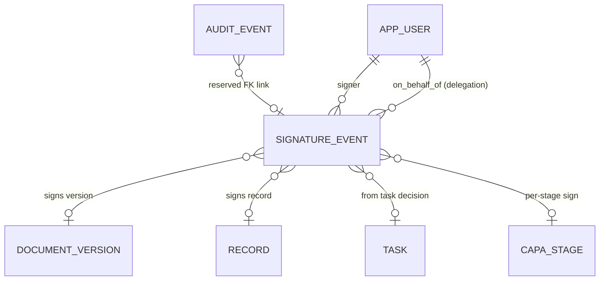

| Entity | Key attributes | Notes / source |
|---|---|---|
| `signature_event` | `id` PK, `org_id`, `signer_user_id` FK, `on_behalf_of` FK null (delegation), `signed_object_type` enum(`document_version`,`record`,`capa_stage`,`dcr` *(S-dcr-4, mig `0043`)*,`improvement_initiative_stage_event` *(S-improvement-4, mig `0053`)*), `signed_object_id`, `meaning` enum(`review`,`approval`,`release`,`obsolete`,`verify`,`disposition`,`import_baseline`,`review_confirmed`; **reserved for the future Part-11 phase, declared but NOT emitted in v1:** `authored`,`responsibility`), `intent` text, `method` enum(`app_click`/`SESSION` v1; reserved `password_reauth`,`mfa_totp`,`mfa_webauthn`), `content_digest` (binds to bytes), `auth_context` jsonb (`acr`/`amr`), `reauth_at` (reserved), `manifest` jsonb (reserved), `crypto_signature` (reserved), `prev_signature_hash`/`signature_hash` (reserved chaining), `voided_by`/`voided_reason`, `created_at` | **Append-only.** Single-factor v1; Part 11 = populate reserved fields + stricter policy flag, no rewrite (`04 §4.2`, `12 §11`, `07 AZ-INV-7`). |

> **Reconciliation note:** `04`/`05`/`12` use lowercase `meaning` values (`approval`); `10` uses uppercase (`APPROVE`). Canonical = **lowercase** enum values to match the storage examples in `04 §4.2` and `12 §11.2`. The `IMPORT_BASELINE` meaning (`09 §10.2`) is normalized to `import_baseline`. Per Decisions Register R2 the v1 emitted enum is fixed at `review, approval, release, obsolete, verify, disposition, import_baseline, review_confirmed` — `review_confirmed` is emitted by a **periodic review that concludes no change needed** — and `authored`, `responsibility` are reserved for the future Part-11 phase (declared but NOT emitted in v1).

---

## 9. Audits, Findings, NCRs & CAPAs (Check → Act loop)

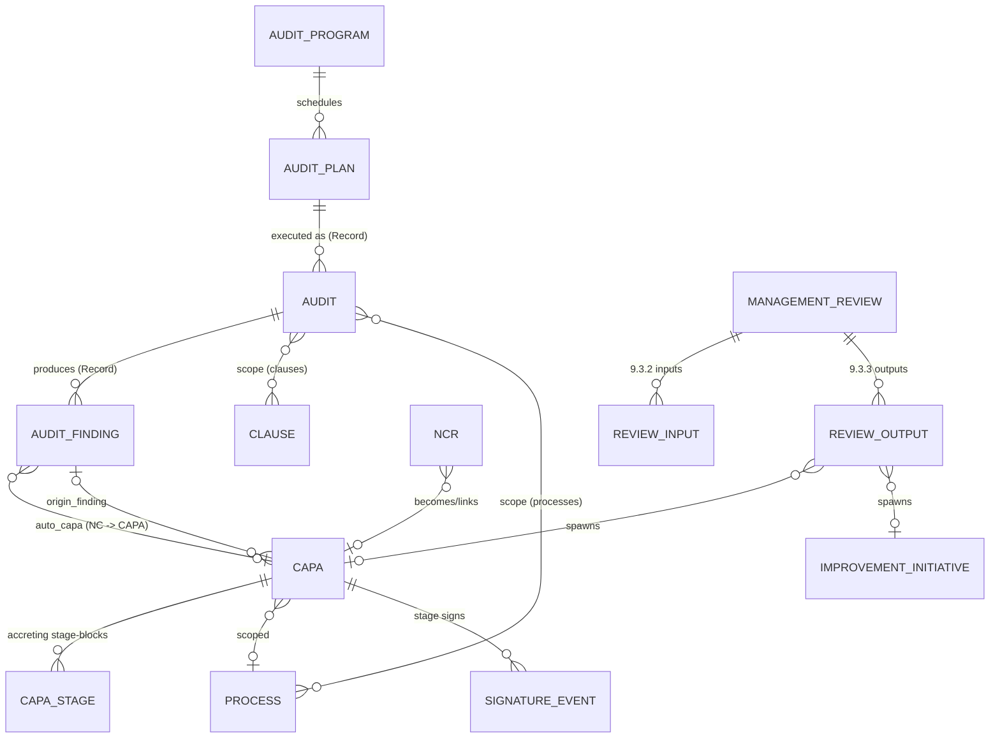

| Entity | Key attributes | Notes / source |
|---|---|---|
| `audit_program` | `id` PK, `org_id`, `identifier`, `title`, `period`, `coverage` jsonb, `archived`, `created_by`, `created_at` | **Own-table** scheduling container (R39 — a deliberate divergence from `kind=DOCUMENT`: a programme has no version/mirror presence; a version-less Effective document would be mis-listed). The retained `audit`/`audit_finding`/`capa` evidence stays a `record` subtype. mig `0034`. |
| `audit_plan` | `id` PK, `program_id` FK, `auditee_process_id`, `lead_auditor_user_id`, `scheduled_date`, `checklist_ref` | `10 §5.2`. |
| `audit` | `id` PK/FK (a `record`, AUDIT), `plan_id` FK, `lead_auditor`, `dates`, `result_summary`, `state` enum(`Scheduled`,`Planned`,`InProgress`,`FindingsDraft`,`Reported`,`Closing`,`Closed`) | A **retained** record (`10 §5.1`). |
| `audit_finding` | `id` PK/FK (a `record`, AUDIT_FINDING), `audit_id` FK, `finding_type` enum(`NC`,`OBSERVATION`,`OFI`), `severity`, `clause_ref`, `process_ref`, `auto_capa_id` null | NC **auto-creates** linked CAPA (`02`, `06 §2`, `10 §5.3`). |
| `ncr` | `id` PK, `org_id`, `source` enum(`audit`,`process`,`complaint`,`internal`), `description`, `severity`, `process_id`, `disposition` enum(`use_as_is`,`rework`,`scrap`,`return`,`concession`,`regrade`), `disposition_authorized_by` uuid FK → `app_user.id` | Nonconforming output (8.7) / raised NC. Often folded into CAPA (R5). `disposition`/`disposition_authorized_by` record the ISO 9001 8.7 disposition decision and its authorizer (reconciled per Decisions Register R20). **S-capa-1 (mig `0036`)** adds a human `identifier` (`NCR-{SEQ}`, the `allocate_seq` numbering), `disposition_notes`, `disposed_at`, `created_by`/`created_at`; its events key on the reserved `audit_object_type='ncr'`. |
| `capa` | `id` PK/FK (a `record`, CAPA), `origin_finding_id` null, `source` enum(`audit`,`process`,`complaint`,`review_output`), `severity` enum(`Critical`,`Major`,`Minor`), `process_id`, `close_state` enum(`Raised`,`Containment`,`RootCause`,`ActionPlan`,`Implement`,`Verify`,`Closed`,`Rejected`), `cycle_marker` int | Unified container; a multi-stage **Record** (`06 §2`, `10 §6`). `source` is all-lowercase (R39 normalizes the §9 `AUDIT` typo; the R2/R16 lowercase canon). `origin_finding_id` is a nullable UUID with **no FK** until S-aud-2 adds `audit_finding` + the reverse `auto_capa_id`. `cycle_marker` counts the Verify→ActionPlan effectiveness loop (S-capa-1, mig `0036`). |
| `capa_stage` | `id` PK, `org_id`, `capa_id` FK, `stage` enum (same as close_state), `content_block` jsonb (sealed), `signed_event_id` null, `cycle_marker` int, `created_by`, `created_at` | **Append-only stage-blocks** (`06 §2 note`); the `easysynq_app` role is `REVOKE`d UPDATE/DELETE (structural immutability, mig `0036`). The doc-14 `attachments` member is realized as `evidence_for_link(target_type=CAPA_STAGE)` edges (Mode C, links-never-copy; R39) — **no `attachments` column**. |
| `management_review` | `id` PK/FK (a `record`, MGMT_REVIEW), `review_date`, `attendees` jsonb, `cycle` | Cl 9.3 ★ (`02`, `10 §7`). |
| `review_input` | `id` PK, `management_review_id` FK, `input_type` enum (9.3.2 a–f), `source_ref` jsonb | Auto-compiled (`10 §7.1`, `13 §5.2`). |
| `review_output` | `id` PK, `management_review_id` FK, `decision`, `action`, `owner_user_id`, `due_date`, `spawned_capa_id` null, `spawned_initiative_id` null | Spawns tracked actions/CAPAs (`10 §7.2`). |
| `improvement_initiative` | `id` PK, `org_id`, `identifier` (`II-{SEQ}`), `title`, `description`, `process_id`, `stage` enum(`Open`,`InProgress`,`Completed`,`Closed`,`Cancelled`), `source` enum(`OFI`,`review`,`manual`), `source_link_type`+`source_link_id` (finding/mgmt_review, polymorphic UUID, **no FK** — the `signature_event` precedent), `spawn_idempotency_key`, `created_by`, `created_at` | **Cl 10.3 ★-less own-table mutable-state WORKFLOW object** with an **append-only history of stage events** (`improvement_initiative_stage_event`) — the DCR/R22 doctrine, **NOT a `kind=RECORD` immutable artifact and NOT a `kind=DOCUMENT` shared-PK subtype** (no ★ checklist node to flip; R46). Reads gate PROCESS-scoped (`improvement.read`/`improvement.manage`, mig `0052`); authority for the opt-in Top-Management authorization is candidate-pool membership (no new permission key). **S-improvement-1 (mig `0052`)** realizes `improvement_initiative` + `improvement_initiative_stage_event`; **S-improvement-2** adds the OFI-finding / MR-output spawn endpoints (`spawn_idempotency_key`, partial-UNIQUE 1:N dedup); **S-improvement-4 (mig `0053`)** adds the signed, engine-routed Top-Management authorization (`signature_event` with `signed_object_type=improvement_initiative_stage_event`, `meaning=verify`; `WorkflowSubjectType.IMPROVEMENT_INITIATIVE`). **The Improvement Initiatives family is COMPLETE end-to-end** (backend + SPA). `02`, `13`, `15 §8.12b`. |
| `improvement_initiative_stage_event` | `id` PK, `initiative_id` FK, `from_state`, `to_state`, `actor_id`, `occurred_at`, `comment`, `payload` jsonb | **Append-only** per-initiative stage-transition history (earlier events never rewritten); the mutable `improvement_initiative.stage` is the headline, this table is the immutable trail (the `dcr_stage_event` precedent, R22). The append-only-FK names are mirrored explicitly in the ORM (the convention default exceeds PG's 63-char limit → phantom-DROP otherwise). S-improvement-1 (mig `0052`). |

> **As-built (S-mr-1, mig `0050`, R45):** `management_review` ships as a **kind=DOCUMENT shared-PK subtype** of `documented_information` (`id` PK/FK → `documented_information.id`, document_type `MR`) — a **deliberate, register-sanctioned deviation from the `record`/MGMT_REVIEW prescription above** (only a released *document* earns the `current_effective_version_id` the compliance checklist reads → DOCUMENT is the only shape that flips the 9.3 ★). It carries the operational tail (`close_state` enum `ActionsTracked`/`Closed`, `cycle`, `attendees` jsonb roster). `review_input` (append-only-by-posture; `input_type` enum `review_input_type`, 12 members; `available`/`source_ref`/gap rows from `compile-inputs`) and `review_output` (append-only-by-posture; `output_type` enum `review_output_type`; `spawned_capa_id`/`spawned_initiative_id` ship **reserved-null** — the CAPA un-reserve is slice-2) are child tables. Enums: `review_input_type`, `review_output_type`, `management_review_close_state`. ~~`improvement_initiative` is deferred/unbuilt in v1~~ **(SUPERSEDED — accurate only as of S-mr-1):** the `improvement_initiative` family later shipped end-to-end as an **own-table mutable-state workflow object** (mig `0052`; S-improvement-1..4) — see the `improvement_initiative` / `improvement_initiative_stage_event` rows in §9 above and `15 §8.12b`. At S-mr-1, `review_output.spawned_initiative_id` shipped reserved-null and improvement-opportunity inputs landed as honest gap rows; the improvement family later backed the gap-row inputs (an MR output can now **spawn** an initiative), but `review_output.spawned_initiative_id` **stays reserved-null** — the MR→initiative link is **one-way** (the initiative records `source_link_id = review_output.id`; there is **no reciprocal FK**, asserted `null` in `test_improvement_spawn.py`). The frozen minutes live in the version snapshot (`metadata_snapshot.mgmt_review_minutes`), not a column.

**Constraints:** an `audit` cannot reach `Closed` while any NC-sourced CAPA is unverified (`10 §5.3`); CAPA `Verify → Closed` guard requires root cause + ≥1 implemented action with evidence + effectiveness evidence + verifier decision (M4, `10 §6.4`); CAPA verifier ≠ action owner (SoD-4); auto-link `audit_finding.auto_capa_id ⇄ capa.origin_finding_id` bidirectional.

---

## 10. Retention Schedules & Disposition

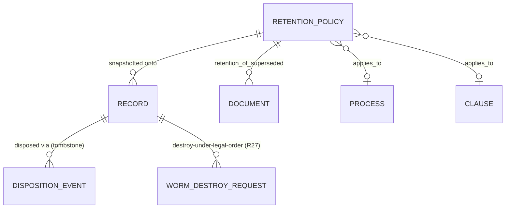

| Entity | Key attributes | Notes / source |
|---|---|---|
| `retention_policy` | `id` PK, `org_id`, `name`, `applies_to` jsonb (record_type/clause/process), `basis` enum(…), `duration` (ISO-8601 / `PERMANENT`), `disposition_action` enum(`DESTROY`,`ARCHIVE_COLD`,`TRANSFER`,`RETAIN_PERMANENT`), `review_required` bool, `worm_lock_period` (≥ duration), **`active` bool (S-rec-4 soft-archive; default true), `archived_at`, `archived_by` FK, `created_at`, `updated_at`** | Policy-as-data. The capture snapshot pins only `policy_id` + `retention_basis_date` (`06 §5.1`); `duration`/`disposition_action`/`review_required` are **live-dereferenced** at sweep time, so a policy *edit* propagates to pinned records — the one-way ratchet (`06 §5.2`) is honored by the **extend-forward PATCH guard** (a reduction is refused while records are pinned) + **soft-archive** (`active=false` stops new-capture auto-attach; pinned records keep being swept; shorten-for-future = archive + create a shorter policy). The seeded System Default is protected (un-archivable, un-renameable). CRUD via `/retention-policies` (`15 §8.16`, `retention.read`/`retention.manage`, R38). |
| `disposition_event` | `id` PK, `org_id`, `record_id` FK, `action`, `tombstone` bool, `policy_id` FK **null** (null for a non-policy legal-order destroy), `approved_by` FK **null** (null on a system Beat-sweep auto-dispose), `requested_by` FK **null** (the R27 first authorizer), `is_worm_destroy` bool, `legal_basis` text null, `executed_at` | Immutable; the executed-disposition tombstone — blob removed/anonymized but Record metadata + audit preserved (`06 §5.3`). Slice S-rec-2 added the `is_worm_destroy`/`requested_by`/`legal_basis` dual-control fields + the `policy_id` nullability. |
| `worm_destroy_request` | `id` PK, `org_id`, `record_id` FK, `legal_basis` text, `requested_by` FK, `requested_at`, `approved_by` FK null, `executed_at` null, `cancelled_by` FK null, `cancelled_at` null | The R27 dual-control two-step workflow (the `dcr` mutable-state precedent, R22); state derived from the nullable timestamps (open / executed / cancelled). `CHECK(approved_by <> requested_by)` + a partial `UNIQUE(record_id) WHERE open` (one open request per record). Slice S-rec-2. |

**Constraints:** resolution precedence per-record > process > clause > type > system default; `legal_hold = true` overrides expiry; DESTROY blocked until `worm_lock_period` expired AND no hold (a blocked destroy is logged-as-refused-with-reason, `RECORD_ERASURE_REFUSED`, R27); `RETAIN_PERMANENT` pairs with `duration=PERMANENT` (never auto-swept); reduction of retention never applies to already-captured records (extension forward only). The R27 dual-control destroy is the **only** pre-lock-expiry destruction path (two distinct authorizers, `BypassGovernanceRetention`, GOVERNANCE-only).

---

## 11. Notifications & My-Actions

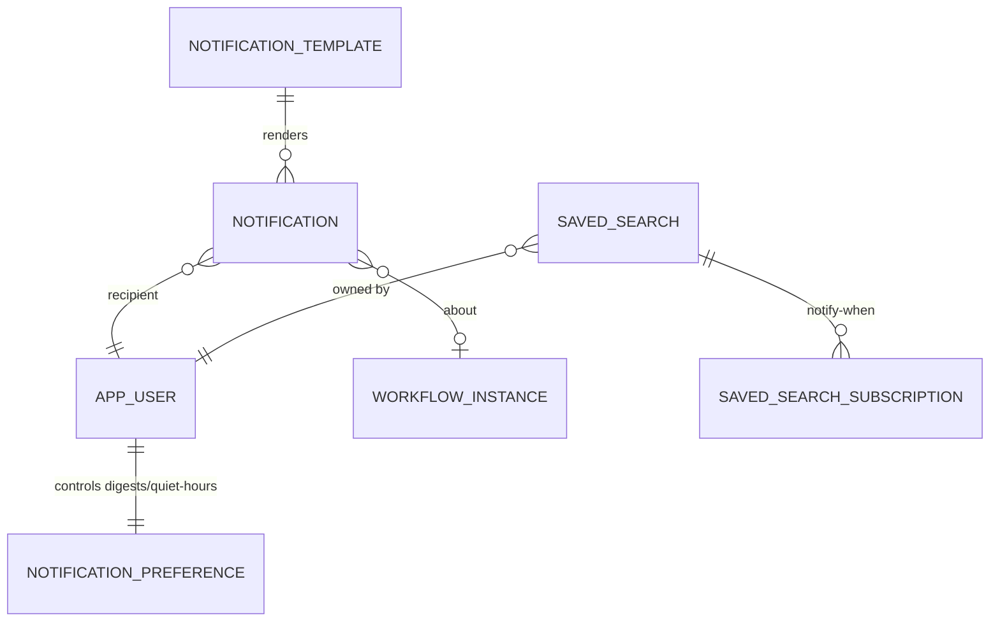

| Entity | Key attributes | Notes / source |
|---|---|---|
| `notification` | `id` PK, `org_id`, `recipient_user_id`, `event_key` (`task.due_soon`,`doc.released`,…), `template_id`, `payload` jsonb (metadata + deep_link, **no controlled content**), `channel` enum(`in_app`,`email`), `read_at`, `created_at` | Awareness, best-effort, never gating (`10 §9`). |
| `notification_template` | `id` PK, `org_id`, `event_key`, `version`, `in_app_form`, `email_subject`, `email_body`, `locale` | Versioned, escaped vars, metadata-only (`10 §9.3`). |
| `notification_preference` | `user_id` PK/FK, `per_event_class` jsonb (`immediate`/`hourly`/`daily`/`weekly`/`off`), `quiet_hours`, `escalation_pierces` bool | `10 §9.4`. |
| `saved_search` | `id` PK, `org_id`, `owner_user_id`, `name`, `query_object` jsonb (the structured query), `visibility` enum(`personal`,`role`,`process`,`org`), `is_system_seeded` bool | Live re-run, permission-filtered per viewer (`13 §2.6`). |
| `saved_search_subscription` | `id` PK, `saved_search_id` FK, `user_id`, `trigger` enum(`count_crosses`,`new_item_enters`), `threshold` | Beat-driven (`13 §2.6`). |

> My-Actions is **not a separate table** — it is a query over `task` (`state IN PENDING/CLAIMED` for the user/pool) grouped by urgency then PDCA. Notifications = awareness; Tasks = work (the core anti-overwhelm split, `10 §8.2`).

---

## 12. Append-Only, Hash-Chained Audit Trail & Event Log

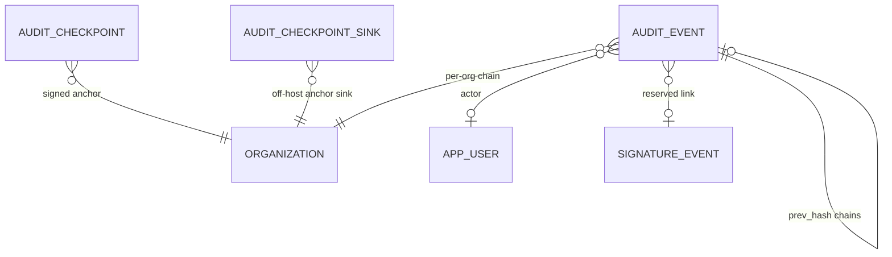

| Entity | Key attributes | Notes / source |
|---|---|---|
| `audit_event` | `id` **bigint identity** PK (gap = tamper signal), `org_id`, `occurred_at`, `actor_id` null, `actor_type` enum(`user`,`system`,`external_auditor`,`admin`), `on_behalf_of` null, `event_type` enum, `object_type` enum, `object_id` null, `scope_ref`, `reason` (**mandatory** for content-changing events), `before` jsonb, `after` jsonb, `request_id`, `client_ip` inet, `user_agent`, `auth_context` jsonb, `prev_hash` bytea **null (until linked)**, `row_hash` bytea **null (until linked)**, `chained_at` timestamptz null, `signature_event_id` null | **Append-only, partitioned by month, hash-chained.** INSERT/SELECT only for app role (`12 §4`). The write is **decoupled from the chain link** (per Decisions Register R12): rows (with id sequence, before/after, reason) are written in the action transaction; `prev_hash`/`row_hash` are computed by a **single-threaded chain-linker** (Celery/Beat worker or Postgres advisory-lock-guarded process) running continuously with a small bounded lag, which also sets `chained_at`. Tamper-evidence is preserved (gaps/edits still break the chain) while per-org write throughput is not gated by chain-tail contention. |
| `audit_checkpoint` | `id` PK, `org_id`, `latest_id`, `latest_row_hash`, `timestamp`, `app_signature` | Hourly + on-shutdown signed anchor; bundled in backups; detects full-history rewrite (`12 §4.3`). |
| `audit_checkpoint_sink` | `id` PK, `org_id`, `kind` enum(`worm_bucket`,`external_object_store`,`append_only_syslog`), `connection` jsonb (**non-secret config only** — endpoint/bucket/region + an `off_host` flag), `enabled` bool, `last_anchored_at` | Config entity for the **off-host / append-only checkpoint sink**. At least one such sink is **MANDATORY for any install claiming tamper-evidence / Part-11 readiness** and is configured during setup as a soft gate with a clear UI warning if absent (reconciled per Decisions Register R13). **S6/D-8 reconciliation:** the actual sink credential is a **separate Docker secret** (genuine custody separation), NOT stored/envelope-encrypted in `connection`; the tamper-evidence soft-gate stays false until an `off_host=true` sink anchors freshly. v1 implements the `worm_bucket` kind. |

**Invariants:** audit row written in the **same transaction** as the state change (no action without its row, no orphan row); the chain link (`prev_hash`/`row_hash`/`chained_at`) is computed afterward by the single-threaded chain-linker — `prev_hash`/`row_hash` are **nullable until linked** and the **only permitted post-insert mutation is the linker populating these three columns once** (a bounded written-but-not-yet-chained window, per Decisions Register R12); no other UPDATE/DELETE grant; whole expired-and-sealed partition purge only, under dual control via `audit_retention` role; chain-verify Beat job nightly; mirrored to OpenSearch (derived, rebuildable) but PG authoritative; **excluded from GDPR erasure** where lawful (stable `actor_id` keeps chain intact while user profile PII anonymized — `12 §9.4`). This is the reconciliation that lets GDPR erasure and tamper-evidence coexist.

---

## 13. Ingestion: Import Jobs, Classification & Staging (transient)

All `import_*` tables are **staging only**, mutable, TTL-purged after commit, and separate from the vault. Only **Commit** writes vault tables (`document`/`record`/`version`/`blob`/`signature_event`/`audit_event`). They carry `org_id`.

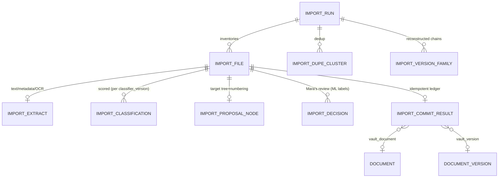

| Entity | Key attributes | Notes / source |
|---|---|---|
| `import_run` | `id` PK, `org_id`, `source_root`, `status` enum(`Created`…`Completed`/`PartiallyCommitted`/`Cancelled`/`Failed`), `created_by`, `committed_by`, `classifier_version`, `ocr_enabled`, `profile`, `counts` jsonb | First-class audited object (`09 §3.2`). |
| `import_file` | `id` PK, `run_id` FK, `rel_path`, `filename`, `ext`, `size_bytes`, `mtime`, `ctime`, `mime_type`, `sha256`, `staged_blob_uri`, `scan_flags` jsonb (`empty`/`oversize`/`quarantine`/`encrypted`/`already_imported`) | unique `(run_id, rel_path)` (`09 §4`). |
| `import_extract` | `id` PK, `run_id`, `file_id`, `full_text_ref`, `header_block`, `embedded_props` jsonb, `language`, `structure_hints` jsonb, `ocr_used`, `ocr_confidence`, `extract_status` | `09 §5`. |
| `import_classification` | `id` PK, `run_id`, `file_id`, `classifier_version`, `kind`, `kind_conf`, `type`, `type_conf`, `clause_ids[]`, `clause_conf`, `process_ids[]`, `process_conf`, `pdca_phase` (derived), `evidence` jsonb, `top2_margin` | Confidence-banded; PDCA derived from clauses (`09 §6`). |
| `import_dupe_cluster` | `id` PK, `run_id`, `method` enum(`exact`,`near`), `member_file_ids[]`, `canonical_file_id`, `jaccard` | `09 §7`. |
| `import_version_family` | `id` PK, `run_id`, `base_name`/`doc_code`, `ordered_member_file_ids[]`, `effective_file_id` | Reconstructed revision chain (`09 §7.3`). |
| `import_proposal_node` | `id` PK, `run_id`, `file_id`, `proposed_identifier`, `target_ia_path`, `proposed_owner`, `conflict_flags` jsonb | `09 §8`. |
| `import_decision` | `id` PK, `run_id`, `file_id`/`cluster_id`, `action` enum(`accept`,`correct`,`merge`,`split`,`exclude`,`defer`), `before` jsonb, `after` jsonb, `decided_by`, `decided_at` | Human-in-the-loop; future ML labels (`09 §6.6`). |
| `import_commit_result` | `id` PK, `run_id`, `file_id`, `result` enum(`success`,`failed`,`noop`), `vault_document_id`, `vault_version_id`, `error`, `committed_at` | Idempotent commit ledger; `(run_id, file_id)` + content-hash (`09 §10`). |

> The committed **Import Report** is itself an immutable `record` (`record_type=EVIDENCE`) in the vault (`09 §12.1`), and `import_provenance` is folded onto the committed `documented_information` row (§5.1) so provenance survives staging purge.

---

## 14. Reconciliation of Cross-Section Conflicts (explicit)

> **Authoritative source (updated):** The **EasySynQ Decisions Register (`decisions-register.md`) is now the single authoritative source of truth** and **supersedes** the resolutions previously stated locally in this section. The locally-numbered conflicts below (the in-section `R1`–`R9`) are **retained for historical traceability**, but each is now reconciled against and governed by the register's resolutions `R1`–`R46` (see `decisions-register.md`); where they differ, the **Decisions Register wins**. All data-model fields/entities/enums in §1–§13 above have been brought into line with the register and the affected register items are **marked RESOLVED** below.
>
> **Register items applied in this section (all RESOLVED):** R2 (`signature_event.meaning` final enum incl `review_confirmed`; reserved `authored`/`responsibility`), R5 (permission-catalog seed incl `import.execute`/`import.review`/`import.commit`, `record.dispose`, `changeRequest.*`/`capa.*`/`audit.*`), R6 (`documented_information.folder_path` ltree null), R7 (`document_type.document_level` enum), R8 (`effective_from` timestamptz UTC), R12 (`audit_event.chained_at` null + `prev_hash`/`row_hash` nullable-until-linked), R13 (`audit_checkpoint_sink` config entity), R16 (`record_type=COMPLAINT` + `complaint` satellite, spawnable to NCR/CAPA), R17 (`process.is_outsourced` + `process.outsourced_supplier_id`), R18 (`risk_opportunity.likelihood`/`severity`/`risk_rating`/`scoring_method`), R20 (`ncr.disposition` enum + `ncr.disposition_authorized_by`), R21 (`record.source_version_id` nullable), R22 (DCR = mutable-state workflow object + append-only `dcr_stage_event`, not `kind=RECORD`), R25 (singleton = one `Effective` at a time), R29 (`app_user.manager_id` + `working_calendar`).

The upstream sections were internally consistent on the big decisions but drifted on names, capitalization, and a few structural choices. Here is the canonical resolution used above (now governed by the Decisions Register):

| # | Conflict observed | Sections | Canonical resolution |
|---|---|---|---|
| **R1 — Lifecycle state names** *(RESOLVED — governed by Decisions Register R1)* | `04` uses `Effective/Released`, `Under Revision`, `Superseded`; `03/10` collapse to `Released` and omit `Under Revision`/`Superseded`; `05` uses `Obsolete` for prior versions and omits `Superseded`. | 03, 04, 05, 10 | **Version-level** states: `Draft, InReview, Approved, Effective, Superseded, Obsolete`. **Document-level** `current_state` adds the **derived** `UnderRevision` (a new draft exists while an Effective version governs). `05`'s "Obsolete" for predecessors maps to `Superseded` (then `Obsolete` only on full retirement). This is the superset that satisfies all three; `04 §3.1` is the authority. Per Decisions Register R1 the canonical engine machine is the **seven-state** `Draft, InReview, Approved, Effective, UnderRevision, Superseded, Obsolete`; the five-state form is a simplified user-facing summary only. |
| **R2 — `signature_event.meaning` casing/values** *(RESOLVED — governed by Decisions Register R2)* | `04/05/12` lowercase (`approval`,`release`); `10` uppercase (`APPROVE`,`RELEASE`,`VERIFY`,`DISPOSITION`); `09` adds `IMPORT_BASELINE`. | 04, 05, 09, 10, 12 | Canonical enum = **lowercase**, fixed v1 set per Decisions Register R2: `review, approval, release, obsolete, verify, disposition, import_baseline, review_confirmed`; reserved (declared, not emitted in v1): `authored, responsibility`. (Matches the storage-shape tables, which outrank the workflow prose.) |
| **R3 — Registers / objectives: Document or own entity?** | `02 §6.1` marks registers as "Doc (M)*" with row-versioning; `13` and `06` treat objectives/registers as first-class queryable entities. | 02, 06, 13 | **Both, layered:** registers/objectives **are** `documented_information` rows (`kind=DOCUMENT`) for lifecycle/approval/clause-mapping, **plus** satellite row tables (`context_issue`, `risk_opportunity`, `quality_objective`, …) for queryable structured rows with per-row history. The register-document versions together (lightweight approval profile, `04 A3`). |
| **R4 — Permission key naming drift** *(RESOLVED — governed by Decisions Register R5)* | `04/05/07` use `document.checkout`, `document.approve`, `record.create`; `08 §10.1` uses `document.author`, `capa.own`, `audit_qms.*`, `import.initiate`; `09` uses `import.execute`/`import.review`/`import.commit`. | 04, 05, 07, 08, 09 | **`07` (Authorization Model) is authoritative** for the permission catalog. `08`'s `document.author` ≡ `document.create`+`document.edit`; `audit_qms.*` ≡ `audit.*`; `import.initiate`/`import.administer` are **replaced** by `import.execute`/`import.review`/`import.commit`; `dcr.raise`→`changeRequest.create`; `capa.raise`→`capa.create`; record disposition is `record.dispose` (**NOT** `record.retire`). Seed the catalog from `07 §3` per Decisions Register R5 (see §3.1); treat legacy `08`/`09` names as aliases mapped at seed time. |
| **R5 — NCR vs CAPA as entities** *(RESOLVED — `ncr.disposition` added per Decisions Register R20; `source=complaint` backed per R16)* | `02/06/10` model **CAPA** as the unified container (NC folded in); `07 §3.5` exposes separate `ncr.*` and `capa.*` permissions and the workflows reference an NCR stage. | 02, 06, 07, 10 | Keep a thin `ncr` entity (nonconforming output 8.7 / raised NC, with its own `ncr.*` perms, now carrying `disposition`/`disposition_authorized_by` per R20) that **may stand alone or be promoted into a `capa`** (the NC becomes the CAPA's `Raised` stage). CAPA remains the multi-stage record; NCR is the lightweight capture that can exist before a CAPA is opened. A `Complaint` (`record_type=COMPLAINT`, R16) can one-click spawn an NCR/CAPA with `source=complaint`. This satisfies both the permission catalog and the unified-container model. |
| **R6 — "Approval" entity vs `signature_event`** | The task asked for `Approvals and ApprovalSteps`; the specs never create standalone approval tables — approvals are `workflow_stage` (the step) + `task` (the assignment) + `signature_event` (the recorded decision). | 04, 07, 10 | **No separate `approval`/`approval_step` tables.** "Approval" = `workflow_stage` of mode approval; "ApprovalStep" = a `task` within it; the decision = a `signature_event`. Modeled this way to avoid duplicating the workflow engine. Called out so a reader expecting those tables finds the mapping. |
| **R7 — Audit PK type** | Domain entities use `uuid`; `12 §4.2` mandates `bigint identity` for `audit_event` (gap detection). | 12 | `audit_event` uses **`bigint identity`** (the one exception); everything else `uuid`. |
| **R8 — Checkout lock home** | `03/04/05` say the Redis lock is authoritative; a `document.checkout_*` column set also appears. | 03, 04, 05 | Redis is the **runtime authority**; the `document.checkout_user_id/checkout_at/lock_token` columns are a **display/recovery mirror** only — "even total Redis loss cannot corrupt the vault" (`04 §5.2`). Documented so engineers don't treat the PG columns as the lock. |
| **R9 — `Resource`/competence as base entities vs Records** | `02` lists `Resource`, `MeasuringResource`, `CompetenceRecord` as entities; `06` says competence/calibration are `record_type`s. | 02, 06 | **Both:** `resource`/`measuring_resource`/`person_competence` are *master* entities (the equipment, the person's required competence); the *evidence* (calibration cert, training cert) are `record`s linked to them. The master is maintained config; the evidence is retained. |

---

## 15. Global Index Plan, Constraints & Append-Only Summary

### 15.1 Key indexes (performance + integrity)

| Index | Purpose | Source NFR |
|---|---|---|
| `UNIQUE (org_id, identifier)` on `documented_information` | Identifier collision-free, immutable (`04 §7.2`). | M9 zero-uncontrolled |
| **Partial** `UNIQUE (document_id) WHERE version_state='Effective'` on `document_version` | **INV-1 single-effective** — DB-enforced, not advisory. | `04 §3.4` |
| `(document_id, version_seq)` on `document_version` | Monotonic chain, history. | `05 §2.2` |
| `(documented_information_id)` on `clause_mapping`, `process_link` | Lens queries, where-used. | `13 §3.4` |
| `(record_id)` on `evidence_blob`; `source_version_id` on `record` | Traceability chain bottom-up. | `06 §6` |
| `(occurred_at)` partition + `(object_id)`,`(actor_id)`,`(event_type)` on `audit_event` | Audit search, whole-partition lifecycle. | `12 §4.4` |
| **Partial** `ix_documented_information_next_review_due` on `(next_review_due)` WHERE NOT NULL on `documented_information` | Beat review-sweep + dashboard. `review_state` is **derived, never stored/indexed** (S-drift-1). | `05 §9.3` |
| `(retention_basis_date, disposition_state)` on `record` | Beat retention-sweep. | `06 §5.3` |
| `(assignee_user_id, state)` and `(instance_id)` on `task` | My-Actions inbox. | `10 §8` |
| `UNIQUE (run_id, rel_path)` on `import_file`; `UNIQUE (run_id, file_id)` on `import_commit_result` | Import idempotency. | `09 §11.1` |
| `sha256` PK on `blob` | Content addressing / dedup. | `04 §2.1` |
| `UNIQUE (permission.key)`; `(user_id, permission_id, scope_id)` on `permission_override` | Authz resolution. | `07 §6` |

### 15.2 Append-only / immutable entities (no UPDATE/DELETE)

`document_version` (content), `blob`, `record`, `evidence_blob`, `acknowledgement`, `capa_stage`, `dcr_stage_event`, `signature_event` (void via columns), `audit_event` (only the chain-linker may populate `prev_hash`/`row_hash`/`chained_at` once, per R12), `audit_checkpoint`, `disposition_event`, the closed-form record-like snapshot of a `dcr` (the `dcr` itself is a mutable-state workflow object with an append-only `dcr_stage_event` history per R22), the committed Import Report record. WORM object-lock backs `blob`s; DB grants strip UPDATE/DELETE on `audit_event`/`signature_event` from the app role.

### 15.3 Entities carrying the extensibility discriminators

`org_id` on **every** table; `framework_id` on every `documented_information`, `clause`, `clause_mapping`, and authz scope predicate; reserved/nullable `signature_event` fields (`reauth_at`, `manifest`, `crypto_signature`, signature chaining) and `audit_event.signature_event_id` — so 21 CFR Part 11 and multi-standard (13485/14001/45001/IATF) are **additive columns + seed data + a policy flag**, never a schema rewrite (`12 §11`, `07 §11`, `02 §7`).

---

## 16. Summary — How the Model Locks to the Foundation

1. **One vault, two kinds.** `documented_information` is the spine; `document` (versioned, single-effective via a partial unique index) and `record` (immutable, retention-governed, `correction_of`) are its subtypes — the maintain/retain rule is structural, not advisory.
2. **Immutability is enforced, not hoped.** Blobs are content-addressed + WORM; versions and records have no UPDATE path; the audit trail is append-only and hash-chained with signed checkpoints — tamper-*evident* per the honest posture.
3. **Authorization is data.** Permissions are atomic rows, roles are bundles, grants/overrides carry scopes with ABAC predicates, SoD and delegation are first-class — deny-by-default, deny-wins, every mutation audited.
4. **The ISA is the navigation.** `clause` (read-only seed) + `process` (4.4 graph) + `clause_mapping`/`process_link` M:N joins drive the three lenses and the compliance checklist without duplicating truth.
5. **The Check→Act loop is wired.** `audit_finding(NC) → capa` auto-link, CAPA closure gate, DCR↔CAPA `source_link`, management-review outputs spawning CAPAs/initiatives — traceability is a graph of audited links.
6. **Workflows pin like records.** `workflow_instance` pins its `definition_version`; tasks feed My-Actions; decisions become `signature_event`s — the same hook Part 11 will tighten.
7. **Import is staged and safe.** `import_*` tables are transient and idempotent; only Commit writes the vault, producing baseline `Rev A` Effective documents, a baseline `signature_event`, and an immutable Import Report.
8. **Nothing painted into a corner.** `org_id` + `framework_id` everywhere and the reserved signature/audit columns make multi-org, multi-standard, and e-signatures additive — exactly as the locked decisions require.
