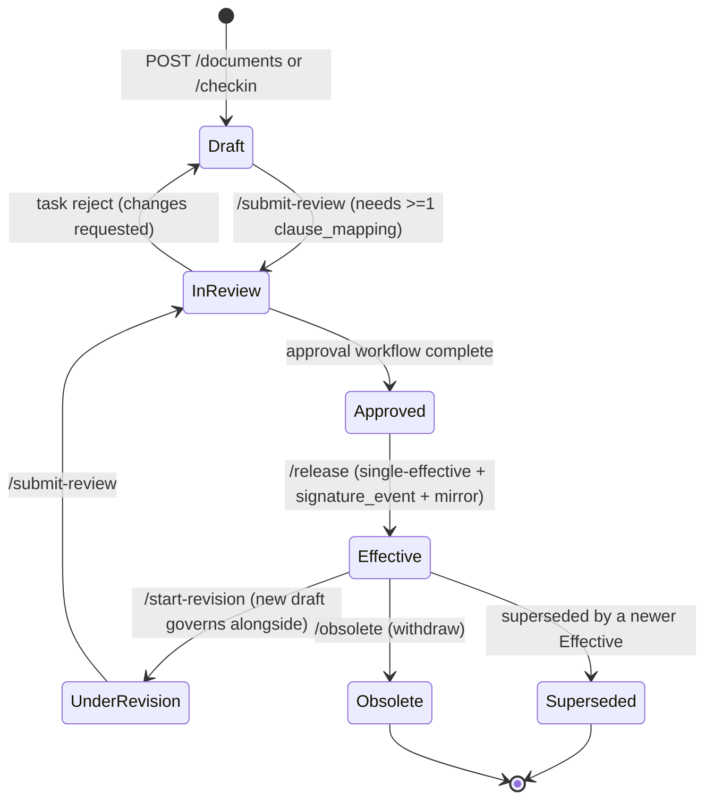

# API Design

This section specifies the **external HTTP API surface** of EasySynQ: the contract every client (the React SPA, future integrations, external-auditor tooling) speaks to the FastAPI tier. It is binding on `03-architecture-and-stack.md` (FastAPI + OpenAPI-first, Keycloak/OIDC + PKCE, JWT validated against JWKS, OpenSearch with Postgres-FTS fallback, MinIO presigned blob access, Celery async pipelines, deny-by-default server-side authz) and on `14-data-model.md` (the consolidated entity model, the immutability matrix, the hybrid RBAC+ABAC resolution order, append-only hash-chained audit, and the `dcr`/`workflow`/`task`/`signature_event`/`capa_stage`/`ncr`/`import_*` shapes). Where this section names an entity or permission key, it uses the **canonical, reconciled** name from `14-data-model.md` (which itself defers to `07` for the permission catalog).

> **How to read this.** §1 picks the transport style and justifies it. §2 fixes the global conventions (base URL, headers, IDs, envelopes). §3 gives pagination/filtering/sorting/shaping. §4 is the single error model. §5–§6 are authentication and server-side authorization enforcement. §7 is the resource map. §8 is the full endpoint catalog grouped by domain (one table per domain, with representative shapes and the state machines). §9 details the authz engine at request time. §10 is versioning. §11 is webhooks + real-time events. §12 summarizes cross-cutting conventions. §13 lists the deliberate forward-compatibility hooks.

---

## 1. Transport & Style Decision

### 1.1 Chosen: REST (resource-oriented JSON over HTTPS), OpenAPI 3.1-first

| Candidate | Verdict | Rationale |
|---|---|---|
| **REST + JSON, OpenAPI-first** | **Chosen** | Locked by `03 §2`/`§11`: FastAPI *is* OpenAPI-first — request/response Pydantic models generate the spec, the interactive docs, **and** the typed TanStack-Query client in one move (`03 §2` client data layer). REST fits a CRUD-and-lifecycle-heavy document-control domain; it is cacheable, proxy-friendly (Caddy), and **auditor-legible** — a `GET /documents/{id}/audit-events` is self-describing in a network log, which matters for a compliance tool a 3rd-party auditor may inspect. |
| GraphQL | Rejected (v1) | Flexible read-shaping is attractive for dashboards, but it fights three of our hard requirements: (a) **per-field ABAC** scoping is awkward when one query spans many scopes; (b) one opaque `POST /graphql` obscures intent in the **append-only audit trail** (every mutation must write a typed `audit_event` with a clear `event_type`); (c) query-cost analysis + rate-limiting add operational burden on a single-host install. The few aggregation needs are met by purpose-built report endpoints (§8.14). |
| gRPC / tRPC | Rejected | Browser-first SPA over Caddy; no cross-language/streaming-RPC need. tRPC couples client to server internals and bypasses the explicit, language-neutral, auditable OpenAPI contract we want for future external/auditor clients. |

**Real-time:** **Server-Sent Events (SSE)** for in-app live updates (My-Actions/task changes, notifications, long-job progress) — §11.3. SSE over WebSockets because the traffic is server→client, rides ordinary HTTP/auth/proxy infra, and auto-reconnects with `Last-Event-ID`. **Outbound webhooks** (HMAC-signed, retried by a Celery worker) for server→external integration — §11.1.

### 1.2 Base URL, media types, headers

- **Base path:** `https://{org-host}/api/v1`. The SPA and `/api` are served behind the same Caddy proxy (`03 §5`).
- **Media type:** `application/json; charset=utf-8` for bodies; full UTF-8 end-to-end (`03 §11` i18n). Errors use `application/problem+json` (§4).
- **Required on authenticated calls:** `Authorization: Bearer <keycloak_access_jwt>`, `Accept: application/json`.
- **Mutating requests:** `Content-Type: application/json`; **`Idempotency-Key: <client-uuid>`** SHOULD be sent on every mutating POST (deduped in Redis; replays return the original result — `03 §5` Redis).
- **Optimistic concurrency:** detail GETs return a strong `ETag`; unsafe updates SHOULD send `If-Match`. A stale `If-Match` → `412` (prevents lost updates when two authors touch one document's metadata). Document *content* edits are additionally guarded by the Redis check-out lock (§8.5), surfaced as `423 locked`.
- **Correlation:** every request carries / is assigned `X-Request-Id`; it is propagated API→worker (`03 §10`) and stored on the resulting `audit_event.request_id` for end-to-end traceability.

### 1.3 Design principles specific to this surface

1. **Lifecycle transitions are named action sub-resources, never `PATCH status=`.** `POST /dcrs/{id}/submit`, `POST /documents/{id}/release`, `POST /tasks/{id}/decision`. Rationale: each carries side effects beyond a field write (a `signature_event`, an `audit_event` in the *same transaction*, a Celery render/index/mirror job), each has its **own permission key** (`document.release` ≠ `document.edit`), and each maps directly onto a state machine in `14 §5/§7/§9`. This is also the seam where 21 CFR Part 11 e-signatures tighten later (§13) with no new endpoints.
2. **The API tier is the single authorization choke point** (`03 §8.3`: "evaluated server-side… never trusted from the client; deny-by-default"). No service/repository call runs before the policy dependency passes (§9). MinIO is never proxied for authz — **presigned URLs are minted only after** the permission check.
3. **Every mutation is auditable and idempotent-safe.** The `audit_event` is written in the *same DB transaction* as the change (`14 §12` invariant: "no action without its row"). Content-changing events require a non-empty `reason` or the request is `422`.
4. **Progressive disclosure is a server concern too.** List endpoints return compact summaries; detail endpoints return full representations; expensive sub-collections (versions, audit trail, tasks, stages) are *separate* endpoints, never eagerly embedded. The calm, clause-aligned, PDCA UI is fed by `view=`/`fields=`/`expand=` shaping (§3.4), not one dense payload.
5. **Immutability shows up as the absence of verbs.** Per the `14 §1.2` matrix, there is **no PUT/PATCH/DELETE** on `document_version` content, `record`, `blob`, `signature_event`, `audit_event`, `capa_stage`, or `acknowledgement`. Corrections are new rows (a successor version, a `correction_of` record), never edits.

---

## 2. Standard Envelopes

### 2.1 Single resource — returned bare

```json
{
  "id": "018f9a1c-3b2e-7c11-9a44-0a1b2c3d4e5f",
  "type": "document",
  "kind": "DOCUMENT",
  "identifier": "SOP-PUR-014",
  "title": "Supplier Evaluation Procedure",
  "document_type": "Procedure",
  "current_state": "Effective",
  "effective_version_id": "018f9a2d-...",
  "owner_user_id": "018f9000-...",
  "folder_path": "Quality.Purchasing.Procedures",
  "framework_id": "iso9001:2015",
  "clause_refs": ["8.4"],
  "review_state": "current",
  "next_review_due": "2027-03-01",
  "created_at": "2026-01-12T09:00:00Z",
  "updated_at": "2026-05-20T15:42:10Z",
  "_links": {
    "self": "/api/v1/documents/018f9a1c-...",
    "versions": "/api/v1/documents/018f9a1c-.../versions",
    "audit_events": "/api/v1/documents/018f9a1c-.../audit-events",
    "checkout": "/api/v1/documents/018f9a1c-.../checkout"
  }
}
```

`type` is a stable discriminator; `_links` (HATEOAS-lite) advertise valid next actions **the caller is permitted to take** — action links the policy engine would deny are omitted, so the SPA can gate buttons without a second round-trip. All IDs are **UUID v7 strings** (`14 §1.1`); `framework_id` and `org_id` are present per the multi-standard / multi-org discriminators (`14 §15.3`) — `org_id` is implicit-from-session in v1 and omitted from payloads. `folder_path` is the nullable materialized logical scope path (PostgreSQL `ltree`) on `documented_information`; it is a **scope selector**, not physical storage, and FOLDER-level grants match it by subtree-prefix (ltree-ancestor) (reconciled per Decisions Register R6).

### 2.2 Collection — cursor-paginated

```json
{
  "data": [ { "id": "...", "type": "document", "...": "..." } ],
  "page": {
    "next_cursor": "eyJzIjoiMjAyNi0wNS0yMC4uLiIsImlkIjoiMDE4Zi4uLiJ9",
    "prev_cursor": null,
    "limit": 25,
    "has_more": true
  },
  "_links": { "self": "/api/v1/documents?limit=25", "next": "/api/v1/documents?limit=25&cursor=eyJ..." }
}
```

No exact total by default (counting is expensive on append-heavy tables). `?include_count=true` adds `"approx_total"` from a cheap estimator (`reltuples`) — never an exact `COUNT(*)` on hot list paths.

---

## 3. Pagination, Filtering, Sorting, Shaping

### 3.1 Pagination — keyset cursor over UUID v7

UUID v7 is time-ordered (`14 §1.1`), so keyset paging over `(created_at DESC, id DESC)` is stable and drift-free even while `audit_event`/`document_version` grow underneath the cursor (no OFFSET skew).

| Param | Default | Notes |
|---|---|---|
| `limit` | 25 | Max 100; over-max is clamped with a `Warning` header. |
| `cursor` | — | Opaque base64url of `{last_sort_value, id}`; tampered → `400 invalid_cursor`. |

### 3.2 Filtering — typed, allow-listed per resource

Bracketed operators. Only fields explicitly declared filterable on a resource are accepted (else `400 unknown_filter`). JSONB attribute filtering uses dotted paths.

| Pattern | Meaning | Example |
|---|---|---|
| `filter[field][eq]=v` | equals | `filter[current_state][eq]=InReview` |
| `filter[field][in]=a,b` | membership | `filter[document_type][in]=Procedure,WorkInstruction` |
| `filter[field][gte]` / `[lte]` / `[gt]` / `[lt]` | range | `filter[created_at][gte]=2026-01-01T00:00:00Z` |
| `filter[field][contains]=v` | substring (FTS-backed where indexed) | `filter[title][contains]=calibration` |
| `filter[field][is]=null` | null check | `filter[effective_version_id][is]=null` |
| `filter[clause_refs][has]=8.4` | array contains | `text[]`/array columns |
| `filter[metadata.site][eq]=Plant-A` | JSONB path | `metadata_snapshot`/`payload` keys |

### 3.3 Sorting

`sort=field` (asc) or `sort=-field` (desc); comma-separated multi-key: `sort=-severity,created_at`. Allow-listed sortable fields only (`400 unknown_sort` otherwise). The effective sort always appends `,id` internally to keep the keyset cursor totally ordered.

### 3.4 Shaping (progressive disclosure)

- `fields=id,identifier,title,current_state` — sparse fields for list views.
- `view=summary|full` — named presets (`summary` is the list default).
- `expand=owner,effective_version,folder` — inline allow-listed relations, **depth 1 only** (no nested expand), to cut round-trips on detail screens. Each expanded object is independently read-checked; a relation the caller may not read returns `{ "id": "...", "_redacted": true }` rather than 403-ing the whole request (so a partial document detail still renders calmly).

---

## 4. Error Model — RFC 9457 `application/problem+json`

One envelope for every non-2xx. HTTP status is authoritative; `code` is the stable machine string clients branch on; `type` is a documentation URL.

```json
{
  "type": "https://errors.easysynq.local/validation_failed",
  "title": "Request body failed validation",
  "status": 422,
  "code": "validation_failed",
  "detail": "1 field is invalid.",
  "instance": "/api/v1/documents/018f.../versions",
  "request_id": "01J8X3...",
  "errors": [
    { "field": "change_reason", "code": "required", "message": "change_reason is mandatory at check-in (INV-3)." }
  ]
}
```

| HTTP | `code` (examples) | When |
|---|---|---|
| 400 | `invalid_cursor`, `unknown_filter`, `unknown_sort`, `malformed_request` | Bad query/path/syntax. |
| 401 | `unauthenticated`, `token_expired`, `token_invalid` | Missing/expired/invalid Keycloak JWT or failed JWKS verification. |
| 403 | `permission_denied`, `out_of_scope`, `sod_violation`, `step_up_required`, `setup_incomplete` | Authenticated but policy engine denies: ABAC scope miss, Separation-of-Duties block (`14 §3`), MFA/re-auth required, or QMS locked because `setup_state ≠ OPERATIONAL`. |
| 404 | `not_found` | Absent, **or** hidden by row-level visibility (§9.5). |
| 409 | `conflict`, `duplicate_identifier`, `invalid_state_transition`, `document_checked_out`, `singleton_exists` | Unique violation, illegal transition, doc locked by another user, or a 2nd Quality-Policy/Scope singleton. |
| 412 | `precondition_failed` | `If-Match` ETag mismatch (optimistic lock). |
| 415 | `unsupported_media_type` | Wrong `Content-Type`. |
| 422 | `validation_failed` | Well-formed JSON, semantically invalid; per-field `errors[]` (e.g. missing `change_reason`, no `clause_mapping` before `Draft→InReview`). |
| 423 | `locked` | Acting on a checked-out document without holding the lock (`14 §5.4`). |
| 429 | `rate_limited` | Redis token bucket exhausted; `Retry-After` set. |
| 5xx | `internal_error`, `dependency_unavailable` | Server / MinIO / OpenSearch / DB fault. `request_id` always present. When OpenSearch is down, search degrades to Postgres FTS rather than 5xx-ing (`03 §11` graceful degradation). |

`invalid_state_transition` and `sod_violation` responses include `"allowed_transitions": [...]` / `"conflicting_duty": {...}` so the client corrects without guessing.

---

## 5. Authentication & Session

AuthN is brokered entirely by **Keycloak** (`03 §2/§8.3`): local accounts, LDAP/AD federation, and OIDC/SAML SSO behind one realm. **EasySynQ issues no tokens of its own** — it is an OAuth2 **resource server**. The SPA runs **OIDC Authorization Code + PKCE** directly against Keycloak; the API validates the resulting access JWT against Keycloak's **JWKS**.

### 5.1 Token handling

| Token | Issuer | Lifetime (Keycloak-configured) | SPA storage | API role |
|---|---|---|---|---|
| Access JWT | Keycloak | short (e.g. 5–15 min) | in-memory | Validated per request against JWKS (signature, `iss`, `aud`, `exp`). Claims read: `sub` (→ `app_user.keycloak_sub`), `realm_access`/group hints, `acr`/`amr` (auth strength), `sid`. **Permissions are NOT taken from the token** — they are resolved server-side per request (§9) so a revocation takes effect immediately, not at token expiry. |
| Refresh token | Keycloak | sliding | `HttpOnly; Secure; SameSite=Strict` cookie (BFF-style refresh proxied through the API to keep it out of JS) | Used only to mint a new access JWT via Keycloak. |

The JWT `acr`/`amr` (auth-context) is carried onto `signature_event.auth_context` and `audit_event.auth_context` so high-assurance actions (future Part 11 signing, admin config) can demand **step-up** without re-architecting tokens.

### 5.2 Session & identity endpoints

| Method | Path | Purpose |
|---|---|---|
| GET | `/auth/config` | Public: enabled login methods / Keycloak realm + client + authority URLs the SPA needs to start PKCE. Unauthenticated. |
| POST | `/auth/session` | Exchange a freshly obtained Keycloak code/token for an EasySynQ session: links/provisions the `app_user` by `keycloak_sub` (JIT provisioning honoring `INVITED→ACTIVE`), sets the refresh cookie, returns the access token + session metadata. |
| POST | `/auth/refresh` | Refresh the access JWT via the cookie-held refresh token. |
| POST | `/auth/logout` | End-session: revokes the Keycloak session and clears the cookie; sets `app_user.session_invalidated_at`. |
| POST | `/auth/step-up` | Re-assert MFA / re-authentication to raise `acr` for a sensitive operation; returns an upgraded access token. Pre-positions Part 11. |
| GET | `/me` | Current user profile (`app_user`) + a compact effective-permission summary. |
| GET | `/me/permissions?scope_level=&scope_id=` | Resolved effective permissions for the caller in a given scope (drives UI gating). |
| GET | `/me/actions` | **My-Actions** inbox: a query over `task` where state ∈ `PENDING/CLAIMED` for the user or their candidate pool, grouped by urgency then PDCA phase (`14 §11` — My-Actions is a query, not a table). |
| GET | `/me/notifications?unread=true` | Awareness inbox (`notification`); `POST /me/notifications/{id}/read`, `POST /me/notifications/read-all`. |

**`POST /auth/session` 200:**
```json
{
  "access_token": "eyJhbGciOi...",
  "token_type": "Bearer",
  "expires_in": 600,
  "session": { "acr": "mfa", "keycloak_sid": "01J..." },
  "user": { "id": "018f9000-...", "username": "a.okoye", "display_name": "A. Okoye", "is_guest": false }
}
```

---

## 6. Server-Side Authorization (request-time, deny-by-default)

Every authenticated route declares (a) the **required permission key(s)** (from the `07` catalog, e.g. `document.checkout`, `dcr.approve`, `record.create`, `import.execute`) and (b) how to derive the **target scope** of the resource (`SYSTEM | PROCESS | FOLDER | DOC_CLASS | ARTIFACT`, `14 §3`). A FastAPI dependency runs the policy engine (§9) **before** the handler. The resolution order is the `14 §1.7/§3` contract: **explicit user `DENY` → explicit user `ALLOW` → role grant within scope → default deny**, with **deny-wins** and **SoD** evaluated against immutable version/audit history. The endpoint tables in §8 name the key(s) per route; full engine detail is §9.

---

## 7. Resource Catalog Overview

| Domain | Base path(s) | Backing entities (`14`) |
|---|---|---|
| Auth / Session | `/auth/*`, `/me/*` | `app_user`, Keycloak, Redis sessions |
| Users | `/users` | `app_user` |
| Roles | `/roles` | `role`, `role_grant`, `role_assignment` |
| Permissions / Grants | `/permissions`, `/users/{id}/roles`, `/users/{id}/overrides`, `/delegations` | `permission`, `permission_override`, `scope`, `delegation`, `sod_constraint` |
| Folders / IA | `/folders`, `/processes`, `/clauses` | `folder`/IA, `process`, `process_edge`, `clause`, `clause_mapping`, `process_link` |
| Documents | `/documents` | `documented_information`+`document`, `working_draft` |
| Versions | `/documents/{id}/versions` | `document_version`, `blob`, `rendition` |
| Change Requests (DCR) | `/dcrs` | `dcr`, `impact_assessment` |
| Workflows / Tasks (approvals) | `/workflow-instances`, `/tasks` | `workflow_instance`, `task`, `task_outcome`, `signature_event` |
| Records / Evidence | `/records` | `record`, `evidence_blob`, `form_template` |
| Complaints | `/complaints` | `record` (`record_type=COMPLAINT`) |
| NCRs | `/ncrs` | `ncr` |
| Risks & Opportunities | `/risks` | `risk_opportunity` |
| CAPAs | `/capas`, `/capas/{id}/stages` | `capa`, `capa_stage` |
| Audits | `/audit-programs`, `/audits`, `/audits/{id}/findings` | `audit_program`, `audit_plan`, `audit`, `audit_finding` |
| Management Review | `/management-reviews` | `management_review`, `review_input`, `review_output` |
| Audit Trail | `/audit-events`, `/{resource}/{id}/audit-events` | `audit_event`, `audit_checkpoint` |
| Search | `/search` | OpenSearch (Postgres-FTS fallback) |
| Dashboards / Reports | `/dashboards/*`, `/reports/*` | aggregates |
| Retention | `/retention-policies`, `/records/{id}/disposition` | `retention_policy`, `disposition_event` |
| Admin / Config | `/admin/*` | `organization`, `instance_config`, `storage_config`, `setup_state`, `identity_provider_config`, `numbering_scheme` |
| Backup | `/admin/backups` | `backup_policy`, `backup_run` |
| Import | `/admin/imports` | `import_run`, `import_file`, `import_classification`, `import_decision`, `import_commit_result` |
| Webhooks / Events | `/admin/webhooks`, `/events` (SSE) | system |

---

## 8. Endpoint Catalog by Domain

> Legend — **Perm:** required permission key (`07` catalog). **Idem:** honors `Idempotency-Key`. Collection GETs support §3 unless noted. **Every mutation writes an `audit_event` in the same transaction** (`14 §12`); content-changing mutations require a non-empty `reason`/`change_reason`.

### 8.1 Users (`/users`)

The user representation backs `app_user`. It carries a nullable `manager_id` (self-FK to `app_user`) — the reporting-line edge that notification escalations and business-day SLAs resolve against, falling back to the QM/OrgRole where unset (reconciled per Decisions Register R29):

```json
{
  "id": "018f9000-...",
  "username": "a.okoye",
  "display_name": "A. Okoye",
  "email": "a.okoye@example.com",
  "status": "ACTIVE",
  "manager_id": "018f9111-...",
  "is_guest": false
}
```

| Method | Path | Perm | Idem | Notes |
|---|---|---|---|---|
| GET | `/users` | `user.read` | — | Filter `status`, `email`, `is_guest`, `manager_id`. Sort `display_name`, `created_at`. |
| POST | `/users` | `user.create` | ✓ | Invite/create; provisions the Keycloak account, status begins `INVITED`. Optional `manager_id`. |
| GET | `/users/{id}` | `user.read` | — | `expand=roles,overrides,manager`. |
| PATCH | `/users/{id}` | `user.update` | — | `display_name`, attributes, `manager_id`, `status` (`ACTIVE/LOCKED/DISABLED`). `If-Match`. |
| POST | `/users/{id}/retire` | `user.update` | ✓ | `status→RETIRED`; PII anonymizable while `id`/`audit` chain stays intact (`14 §12`, `12 §9.4`). **Never hard-deleted** (attribution integrity). |
| POST | `/users/{id}/guest-grant` | `permission.grant` | ✓ | Time-boxed external-auditor access: `{ evidence_pack_id, valid_until, ip_allow?, read_only:true }` (`14 §3` `guest_grant`). |

### 8.2 Roles (`/roles`)

Roles are **convenience bundles, never binding** (`14 §3` AZ-INV-4). `is_reserved` roles (ADMIN, QMS_OWNER) are flagged.

| Method | Path | Perm | Idem | Notes |
|---|---|---|---|---|
| GET | `/roles` | `role.read` | — | `is_reserved` filterable. |
| POST | `/roles` | `role.create` | ✓ | `{ name, description, grants:[{permission_key, scope_template}] }`. |
| GET | `/roles/{id}` | `role.read` | — | Includes resolved `role_grant` rows. |
| PATCH | `/roles/{id}` | `role.update` | — | Rename/redescribe. |
| DELETE | `/roles/{id}` | `role.delete` | — | `409 conflict` if assigned; `?reassign_to={roleId}` to force. |
| PUT | `/roles/{id}/grants` | `role.update` | — | Replace the full grant set (idempotent set semantics). |

### 8.3 Permissions, Grants, Overrides, Delegation

The permission **catalog** is read-only seed data (`07 §3`, 24 resources). Grants live on roles (§8.2); per-user overrides and delegations live here.

| Method | Path | Perm | Notes |
|---|---|---|---|
| GET | `/permissions` | `role.read` | Full catalog; `resource`/`action`/`sod_sensitive` filterable (drives the granular-permission grid UI). |
| GET / POST | `/users/{id}/roles` | `user.read` / `permission.grant` | List / assign role with a concrete `bound_scope` (`role_assignment`). |
| DELETE | `/users/{id}/roles/{assignmentId}` | `permission.grant` | Revoke a scoped assignment. |
| GET / POST | `/users/{id}/overrides` | `user.read` / `permission.grant` | Direct `permission_override`: `{ permission_key, effect:"ALLOW"\|"DENY", scope:{level,selector,predicates}, valid_from?, valid_until?, reason? }`. **Deny-wins, beats role grants.** |
| DELETE | `/users/{id}/overrides/{overrideId}` | `permission.grant` | Remove override. |
| GET / POST | `/delegations` | `delegation.read` / `delegation.create` | Subset-only, scope-bound, time-boxed delegation (`14 §3`): SoD survives, no re-delegation. |
| POST | `/delegations/{id}/revoke` | `delegation.revoke` | →`REVOKED`. |
| GET | `/users/{id}/effective-permissions?scope_level=&scope_id=` | `user.read` | Computed result **with provenance** (which role/override/delegation produced each, and whether a `sod_constraint` flagged it). Auditor-facing. |

**`GET /users/{id}/effective-permissions` 200:**
```json
{
  "scope": { "level": "FOLDER", "selector": { "folder_id": "018f...fld" } },
  "permissions": [
    { "key": "document.read",     "effect": "ALLOW", "source": "role:Quality Manager" },
    { "key": "document.approve",  "effect": "ALLOW", "source": "role:Quality Manager", "sod_flag": "author_excluded" },
    { "key": "document.delete",   "effect": "DENY",  "source": "user_override" }
  ]
}
```

### 8.4 Information Architecture — Folders, Processes, Clauses

Clauses are **read-only seed reference data** — there is deliberately no `clause.edit` (`14 §4`). Processes are the Clause 4.4 graph; folders are the document-tree scope used by FOLDER-level grants.

| Method | Path | Perm | Idem | Notes |
|---|---|---|---|---|
| GET | `/clauses` | `clauseMap.read` | — | **S9** ✅. The clause spine (4 → 4.4 → 4.4.1), returned flat + numeric-sorted (the client builds the tree from `parent_id`). Read-only seed data. Optional `?framework=iso9001:2015` (the framework *code*, default iso9001:2015). _(Key corrected from `clause.read` per the S9 build — the closed doc-07 catalog has `clauseMap.read`, not `clause.read`.)_ |
| POST / GET / DELETE | `/documents/{id}/clause-mappings` | `document.manage_metadata` / `document.read` | ✓ | **S9** ✅. Map / list / unmap a document↔clause (flat sub-resources, body `{clause_id, is_requirement_level?}`). Framework-mismatch → 422; duplicate → 409; emits `CLAUSE_MAPPED`/`CLAUSE_UNMAPPED`. _(The dedicated `clauseMap.map_artifact` key stays seeded-but-ungranted; the build gates the write on `document.manage_metadata`, which the Author bundle holds, so mapping + the submit gate work out of the box — owner decision.)_ |
| GET | `/folders/tree` / `/folders` | `folder.read` | — | Hierarchy for the navigator (lazy children); `?parent_id=` / `?subtree_of=`. |
| POST / PATCH / DELETE | `/folders` … | `folder.create`/`.update`/`.delete` | ✓ | Move re-roots the subtree path (async-mirrored). Cascade delete needs `document.delete` too. |
| GET | `/processes` / `/processes/{id}` / `/processes/map` | `process.read` | — | **S9c** ✅. Process list / detail / the `{nodes, edges}` graph for the Process Map lens. Gated at the **default SYSTEM scope** (the `GET /clauses` shape — QMS Owner / Internal Auditor; per-process read-filtering for PROCESS-scoped owners is deferred until owner-assignment, since the seeded PROCESS grants carry an unsubstituted `:assignment_process` placeholder). |
| POST / PATCH | `/processes` … | `process.create`/`process.manage` | ✓ | **S9c** ✅. Create (`state=SEED`) / confirm `SEED→ACTIVE` (a one-way ratchet; `ACTIVE→SEED` → 409 `invalid_state_transition`), set owner org-role + metadata. _(Key corrected from the shorthand `process.update` → the closed catalog's `process.manage`. `process.create`/`assign_owner` are **seeded-but-ungranted** → grant via override until the role UI, the `document.export` precedent.)_ |
| POST / DELETE | `/processes/{id}/edges` `(/{edge_id})` | `process.manage` | ✓ | **S9c** ✅. Add / remove an input/output edge (`{to_process_id, io_label}`); self-loop or duplicate pair → 409 (DB `CHECK`+`UNIQUE` backstop). |
| POST / GET / DELETE | `/documents/{id}/process-links` `(/{process_id})` | `document.manage_metadata` / `document.read` | ✓ | **S9c** ✅. Link / list / unlink a document↔process (the clause-mappings shape; body `{process_id}`); duplicate → 409; emits `PROCESS_LINKED`/`PROCESS_UNLINKED` (object_type `document`). Drives the S9d `by-process/` mirror index. |

### 8.5 Documents (`/documents`)

The logical maintained item (`documented_information` + `document`, `14 §5.2`). Content lives on versions (§8.6); the only mutable surface is the `working_draft` between check-out and check-in (`14 §1.2/§5.4`).

| Method | Path | Perm | Idem | Notes |
|---|---|---|---|---|
| GET | `/documents` | `document.read` | — | Filter `current_state`, `document_type`, `folder_id`, `owner_user_id`, `clause_refs[has]`, `review_state`, `classification`. **Row-filtered by scope** (§9.3). |
| POST | `/documents` | `document.create` | ✓ | Creates the logical doc in `Draft` with no version yet. Identifier is **vault-allocated** from the org `numbering_scheme` (`14 §2`) unless `legacy_identifier` is supplied on import. `singleton_exists`→`409` for a 2nd Quality Policy/Scope. |
| GET | `/documents/{id}` | `document.read` | — | `expand=owner,effective_version,folder`; `_links` advertise permitted actions. |
| PATCH | `/documents/{id}` | `document.edit` | — | **Metadata only** (title, owner, folder, clause map, classification, review period). **Never** sets state — see actions. `If-Match`. |
| DELETE | `/documents/{id}` | `document.delete` | — | Soft-delete only; blocked (`409`) once a version is `Effective` (must be obsoleted via lifecycle). |
| POST | `/documents/{id}/checkout` | `document.checkout` | ✓ | Acquires the **Redis** exclusive edit lock (authority is Redis; `document.checkout_*` columns are a display/recovery mirror — `14 §5.4`/R8). `409 document_checked_out` if held by another; returns a `working_draft` token. |
| POST | `/documents/{id}/checkin` | `document.checkout` | ✓ | Two-step blob upload then finalize → a new **immutable** `document_version` (`Draft`). Releases the lock; enqueues the Celery render→index→mirror pipeline. Requires non-empty `change_reason` + `change_significance` (INV-3) → else `422`. |
| POST | `/documents/{id}/submit-review` | `document.submit` | ✓ | `Draft→InReview`; **requires ≥1 `clause_mapping`** (`14 §4`) → else `422`. Instantiates the approval `workflow_instance` (§8.7). _(Key corrected from `document.edit` per the S4 build — the closed doc-07 catalog has a dedicated `document.submit`, which doc-04 T2/T9 uses.)_ |
| POST | `/documents/{id}/release` | `document.release` | ✓ | On an `Approved` version: makes it the single `Effective` version (partial-unique-index enforced, SERIALIZABLE supersession), writes a `signature_event(meaning=release)`, enqueues the **read-only FS mirror** rewrite. Only released versions ever hit the mirror. |
| POST | `/documents/{id}/start-revision` | `document.edit` | ✓ | `Effective→UnderRevision` (derived): opens a new draft while the current version keeps governing. |
| POST | `/documents/{id}/obsolete` | `document.obsolete` | ✓ | Supersede/withdraw → predecessor `Superseded`, document `Obsolete`; pulled from mirror; all versions/records retained (immutability). **(S-dcr-5)** the doc 05 §7.3 obsoletion-safety gate fires on the T11 document-level obsolete: a coverage gap (governs an active process / referenced by an Effective document / sole ★ coverer) is `409 obsoletion_blocked` unless `{force_retire:true, override_justification}`. Both this endpoint and the DCR RETIRE-implement share the one gate. |
| GET | `/documents/{id}/download` | `document.read` | — | Returns a short-lived **MinIO presigned GET URL** to the effective version's PDF rendition (watermarked per classification). |
| PUT | `/documents/{id}/form-schema` | `document.manage_metadata` | — | **S-rec-3 (Mode-B):** set/replace a Form/Template's editable working `field_schema` (the bespoke field-list DSL). In-service guard: `FRM` document_type + Draft/UnderRevision only (422/409 otherwise). |
| GET | `/documents/{id}/form-schema` | `document.read` | — | The current working `field_schema` (null if unset). |
| GET | `/documents/{id}/effective-form-schema` | `document.read` | — | The schema **pinned in the in-force version** (the form to render — doc 06 §4.2 `GET /templates/{id}/effective-version`); read from the version snapshot, honoring the org pre-release-capture toggle. `422` if no resolvable version. |
| POST | `/documents/{id}/form-schema:checkin` | `document.edit` | — | Freeze the working schema into an immutable Draft version (its WORM source blob IS the canonical-serialized schema; the schema is pinned into `metadata_snapshot`). Then submit-review → approve → release drives it Effective. |
| GET | `/documents/{id}/where-used` | `document.read` | — | The `document_link` impact graph (parent/child/references). |
| GET | `/documents/{id}/audit-events` | `document.read` + `audit.read` | — | Per-document slice of the immutable trail (§8.13). |
| GET / POST | `/documents/{id}/distribution` | `document.read` / `document.distribute` | — | Distribution list + read-and-understood acknowledgements (immutable `acknowledgement` records pinned to a version). |

**Document/version lifecycle** (server-enforced; illegal transition → `409 invalid_state_transition`; reconciliation R1 — document `current_state` is derived, version state is authoritative):



### 8.6 Versions (`/documents/{id}/versions`)

Immutable snapshots (`14 §5.3`). Two-step presigned upload keeps large blobs off the API tier; blobs are **content-addressed by SHA-256** and WORM-locked in MinIO (`14 §5.4`).

| Method | Path | Perm | Idem | Notes |
|---|---|---|---|---|
| GET | `/documents/{id}/versions` | `document.read` | — | Newest first: `version_seq`, `revision_label`, `change_significance`, `version_state`, `change_reason`. |
| POST | `/documents/{id}/versions:init-upload` | `document.checkout` | ✓ | Returns a **MinIO presigned PUT URL** + required headers + intended `object_key`. Client uploads bytes directly. |
| POST | `/documents/{id}/checkin` | `document.checkout` | ✓ | Finalize (see §8.5): server verifies the uploaded object's `sha256` + `size_bytes`, dedups against existing `blob`, creates the immutable `document_version`, bumps `version_seq`. |
| GET | `/documents/{id}/versions/{vid}` | `document.read` | — | Includes `metadata_snapshot` (title/type/owner/clause map **as they were**). |
| GET | `/documents/{id}/versions/{vid}/download` | `document.read` | — | Presigned GET to the immutable source or PDF rendition. |
| GET | `/documents/{id}/versions/{vid}/diff?from={vid2}` | `document.read` | — | Rendered/text diff between two versions (the drift-prevention view). |

**`versions:init-upload` 200:**
```json
{
  "object_key": "documents/018f.../v/018f9b2c-...",
  "upload": {
    "method": "PUT",
    "url": "https://minio.internal/easysynq-documents/...&X-Amz-Expires=900",
    "headers": { "Content-Type": "application/pdf" },
    "expires_at": "2026-05-31T14:18:00Z"
  },
  "finalize_with": { "sha256": "<client-computed>", "change_reason": null, "change_significance": null }
}
```

### 8.7 Change Requests — DCR (`/dcrs`)

The **Document Change Request** (`14 §7`) is the sanctioned, audited path to revise/create/retire a controlled document; direct `PATCH /documents/{id}` is metadata-only. A `dcr` is a **controlled workflow object with a mutable `state` column** plus an **append-only stage-event history** (`dcr_stage_event`) — it is **NOT a `kind=RECORD` immutable artifact**; its closed form is retained as a record-like snapshot (`14 §7`, reconciled per Decisions Register R22). Canonical lifecycle: `Open → Assessed → Routed → InApproval → Approved → Implemented → Closed`, with `Cancelled`/`Rejected` as terminal states.

| Method | Path | Perm | Idem | Notes |
|---|---|---|---|---|
| GET | `/dcrs` | `dcr.read` | — | Filter `state`, `change_type`, `target_document_id`, `created_by`, `reason_for_change`. |
| POST | `/dcrs` | `dcr.create` | ✓ | `{ change_type:"REVISE"\|"CREATE"\|"RETIRE", target_document_id?, change_significance, reason_for_change, source_link?:{type,id} }`. `target_document_id` null for `CREATE`. Starts `Open`. |
| GET | `/dcrs/{id}` | `dcr.read` | — | `expand=target_document,impact_assessment,resulting_version`. |
| PATCH | `/dcrs/{id}` | `dcr.update` | — | Edit reason/annotations while `Open`. |
| GET / PUT | `/dcrs/{id}/impact` | `dcr.read` / `dcr.update` | — | `impact_assessment` rows, auto-populated from `where-used`. |
| POST | `/dcrs/{id}/assess` | `dcr.update` | ✓ | `Open→Assessed`. |
| POST | `/dcrs/{id}/route` | `dcr.update` | ✓ | `Assessed→Routed→InApproval`; instantiates the approval `workflow_instance`. |
| POST | `/dcrs/{id}/cancel` | `dcr.update` | ✓ | →`Cancelled` (while not implemented). |
| POST | `/dcrs/{id}/implement` | `changeRequest.implement` | ✓ | **(S-dcr-5)** `Approved→Implemented`. DCR-as-orchestrator: drives the vault action for the change_type (REVISE/CREATE schedule the resulting version's go-live + the cross-FK link, the `release_due` sweep does the cutover; RETIRE obsoletes behind the §7.3 gate, `{force_retire?, override_justification?}`). **Also enforces the underlying `document.release`/`document.obsolete` (SoD-2) in addition to `changeRequest.implement`** — no DCR side-door past document control; an author cannot self-implement (403 `sod_violation`). 409 `no_approved_draft`/`obsoletion_blocked`/`version_already_linked`. |
| POST | `/dcrs/{id}/close` | `changeRequest.close` | ✓ | **(S-dcr-5)** `Implemented→Closed`; 409 `dcr_effectivity_pending` until the change has actually taken effect (the resulting version Effective / the target Obsolete). |
| POST | `/capas/{id}/raise-dcr` | `changeRequest.create` | ✓ | **(S-dcr-5)** Spawn a DCR from a CAPA corrective action (`source_link={type:capa,id}`; the §10→§7.5 loop). 1:N (a CAPA may spawn child DCRs); an `Idempotency-Key` makes a retry return the same DCR (201 new / 200 replay); 409 `capa_terminal` (a Closed/Rejected CAPA cannot spawn). |

> **Approve / reject of a DCR is not a DCR endpoint** — it is performed via the `task` decision (§8.8), because the spec models the decision as `workflow_stage` + `task` + `signature_event`, not a standalone approval table (reconciliation R6). The engine drives only `InApproval→Approved` (on the completing approval task, per-approver `signature_event`s, doc 05 §5.4). **`Implemented` and `Closed` are explicit gated endpoints** `POST /dcrs/{id}/implement` + `/close` (S-dcr-5, DCR-as-orchestrator — this supersedes the earlier "the engine auto-drives `InApproval→Approved→Implemented→Closed`" note; the seeded `changeRequest.implement`/`.close` keys gate human-paced closeout). `implement` produces/links `resulting_version_id`.

```mermaid
stateDiagram-v2
    [*] --> Open: POST /dcrs
    Open --> Assessed: /assess
    Assessed --> Routed: /route
    Routed --> InApproval: workflow instantiated
    Open --> Cancelled: /cancel
    InApproval --> Approved: all approval tasks approved
    InApproval --> Open: task reject (changes requested)
    Approved --> Implemented: POST /implement (drives the vault action; resulting_version applied/scheduled)
    Implemented --> Closed: POST /close (effective + downstream done; closed form retained as record-like snapshot)
    Closed --> [*]
    Cancelled --> [*]
```

### 8.8 Workflows & Tasks — the approval surface (`/workflow-instances`, `/tasks`)

Per reconciliation **R6**, "approvals" are **not** standalone tables: an approval **stage** is a `workflow_stage`, an approval **step** is a `task`, and the recorded **decision** is a `signature_event`. Workflows are **declarative, versioned data** (`workflow_definition`), and a running `workflow_instance` **pins its `definition_version`** like a record pins its template (`14 §7`). The `task` is the atom of **My-Actions**.

| Method | Path | Perm | Idem | Notes |
|---|---|---|---|---|
| GET | `/workflow-definitions` | `workflow.read` | — | The configured templates (`subject_type`, stages, quorum). |
| GET | `/workflow-instances/{id}` | `workflow.read` | — | `expand=tasks`; `current_state`, pinned `definition_version`, subject. |
| GET | `/documents/{id}/approval` | `document.read` (on the subject) | — | **S-web-5 (implemented).** The document → its current approval cycle: the **latest** `workflow_instance` (+ tasks) or `null` when never submitted (calm, not 404). Powers the Approvals stepper. |
| GET | `/tasks?assignee=me&state=PENDING` | `task.read` | — | The reviewer/approver queue. Filter `type`, `state`, `instance_id`, `stage_key`, `due_at`. Also surfaced via `/me/actions`. |
| GET | `/tasks/{id}` | `task.read` | — | Task detail + the subject it acts on. |
| POST | `/tasks/{id}/claim` | `task.claim` | ✓ | Claim a pool task (`PENDING→CLAIMED`). |
| POST | `/tasks/{id}/decision` | derived from subject (`document.approve` \| `dcr.approve` \| `capa.verify` \| `record.approve`) | ✓ | `{ outcome:"approve"\|"reject"\|"acknowledge"\|"complete"\|"verify"\|"changes_requested", comment? }` (idempotent via `client_token`). Writes a `task_outcome` **and** a `signature_event` and an `audit_event` in one transaction. **SoD enforced:** an author/auditor excluded by `sod_author_excluded`/`sod_constraint` → `403 sod_violation`. May require `acr=mfa` (config) → else `403 step_up_required`. Reject returns the subject to `Draft`/`Open` with the comment. |
| POST | `/tasks/{id}/reassign` | `task.reassign` | ✓ | `{ to_user_id, reason }` (delegation-aware). |
| POST | `/tasks/{id}/escalate` | `task.escalate` | ✓ | Manual escalation; SLA breach auto-escalates via Beat (`task` state `ESCALATED`). |

> **Implemented-gate note (S5/S-web-5):** the closed v1 catalog has **no `task.*`/`workflow.*` keys**, so the implementation gates differ from the aspirational columns above: `GET /tasks` and `/tasks/{id}` are **self-scoped** (caller is assignee or in the candidate pool — no permission key), and `GET /workflow-instances/{id}` and `GET /documents/{id}/approval` gate on **`document.read` on the subject document** (not `workflow.read`). `POST /tasks/{id}/decision` derives the key from the (subject, outcome) as shown (`document.approve`/`document.review`).

**`POST /tasks/{id}/decision` 200 (note the e-signature-ready shape — the Part 11 hook):**
```json
{
  "task_id": "018f...task", "instance_id": "018f...wfi", "stage_key": "quality_approval",
  "outcome": "approve", "decided_at": "2026-05-31T14:05:00Z", "decided_by": "018f...usr",
  "signature_event": {
    "id": "018f...sig", "meaning": "approval", "method": "SESSION",
    "content_digest": "sha256:...", "auth_context": { "acr": "mfa", "amr": ["pwd","otp"] },
    "reauth_at": null, "crypto_signature": null
  },
  "comment": "Reviewed against clause 8.4.1; conforms."
}
```

> **`signature_event.meaning` enum (v1, lowercase snake_case, verbatim).** Every emitted `signature_event` in any payload (`/tasks/{id}/decision`, `/documents/{id}/release`, `/capas/{id}/verify`, import baseline, periodic review, etc.) carries `meaning` drawn **only** from this fixed set: `review`, `approval`, `release`, `obsolete`, `verify`, `disposition`, `import_baseline`, `review_confirmed` — where `review_confirmed` is emitted by a periodic review that concludes no change is needed. `authored` and `responsibility` are **reserved for the future Part-11 phase and NOT emitted in v1**. Clients must tolerate unknown values for forward-compat (§10) (reconciled per Decisions Register R2).

### 8.9 Records / Evidence (`/records`)

Documented evidence to be **retained** (`14 §5.5`, ISO 7.5.3). Records are **immutable post-capture**: no content edit, ever — corrections are a **new** record via `correction_of`; only `disposition_state` advances. No PUT, no content PATCH.

| Method | Path | Perm | Idem | Notes |
|---|---|---|---|---|
| GET | `/records` | `record.read` | — | Filter `record_type`, `source_document_id`, `captured_by`, `captured_at` range, `disposition_state`, `legal_hold`. |
| POST | `/records:init-upload` | `record.create` | ✓ | Presigned PUT for evidence blob(s) (content-addressed, WORM). |
| POST | `/records` | `record.create` | ✓ | Finalize: `{ record_type, source_document_id?, source_version_id?, title, evidence:[{sha256}], captured_at, form_field_values?, retention_basis_date? }`. Server snapshots the `retention_policy` (one-way ratchet); when `source_document_id` resolves to an **`FRM` form template** (Mode-B, S-rec-3) it resolves + pins the Effective (or pre-release) version and validates `form_field_values` against **that version's pinned schema** (422 `errors[].field`). The capture `record.create` scope is built from the source template's framework + process-links (the R28 full-context rule). |
| GET | `/records/{id}` | `record.read` | — | Metadata + `_links.download` + `content_hash` + `has_structured_pdf`. |
| GET | `/records/{id}/download` | `record.read` | — | Presigned GET to the immutable evidence blob. |
| GET | `/records/{id}/rendition` | `record.read` | — | **S-rec-3:** presigned GET to the structured-record PDF rendition (a derived, regenerable view of the fielded data). `409 rendition_pending` until the best-effort Stage-2 build lands (or the record is not structured). |
| POST | `/records/{id}/correction` | `record.create` | ✓ | Create a successor record correcting this one (sets `correction_of`/`superseded_by_correction`). The original is never mutated. |
| PATCH | `/records/{id}/disposition` | `record.dispose` | — | Advance `disposition_state` only (`ACTIVE→DUE_FOR_REVIEW→…→DISPOSED`); a `disposition_event` tombstone is written. **Blocked (`409`)** while `worm_lock_period` is unexpired or `legal_hold=true` (the refusal is audited `RECORD_ERASURE_REFUSED`, R27) (`14 §10`). |
| POST | `/records/{id}/legal-hold` | `record.dispose` | — | Place/release a legal hold (`{action, reason}`, reason mandatory) — overrides retention expiry (`06 §5.2`). |
| GET / POST | `/records/{id}/worm-destroy-requests` | `record.read` / `record.dispose` | ✓ | The R27 dual-control destroy-under-legal-order — step 1 (`{legal_basis}`). One open request per record. |
| POST | `/records/{id}/worm-destroy-requests/{req_id}/{approve\|cancel}` | `record.dispose` | — | Step 2 — a **distinct** second actor approves (governance-bypass purge, fail-closed) or cancels. `409 dual_control_same_actor` / `409 compliance_mode_denies_destroy`. |

> **Records stay immutable** (`06 §1.3`): `PATCH /records/{id}/disposition` is the *only* PATCH on the records surface — a sanctioned state advance, not a content edit (the route-inventory proof whitelists it exactly as the evidence-link `DELETE` is whitelisted). Legal-hold + the dual-control destroy are POST sub-resources. There is no content PATCH/PUT and no content DELETE.

### 8.9a Complaints (`/complaints`)

A lightweight customer-complaint intake (ISO 9001 8.2.1), modeled as `record_type=COMPLAINT` (`14`, `06`) so it lives in the controlled record store. A complaint can **one-click spawn an NCR/CAPA** with `source=complaint`, closing the previously-dangling `source=complaint` reference (reconciled per Decisions Register R16). Fields: `customer`, `received_at`, `channel`, `description`, `severity`.

| Method | Path | Perm | Idem | Notes |
|---|---|---|---|---|
| GET | `/complaints` | `record.read` | — | List `record_type=COMPLAINT` records. Filter `customer`, `channel`, `severity`, `received_at` range. |
| POST | `/complaints` | `record.create` | ✓ | `{ customer, received_at, channel, description, severity }`. Creates a `record_type=COMPLAINT` record. |
| GET | `/complaints/{id}` | `record.read` | — | `expand=spawned_ncr,spawned_capa`. |
| POST | `/complaints/{id}/spawn-ncr` | `ncr.create` | ✓ | One-click create an `ncr` with `source=complaint`, linked bidirectionally to this complaint (reconciled per Decisions Register R16). |
| POST | `/complaints/{id}/spawn-capa` | `capa.create` | ✓ | One-click create a `capa` with `source=complaint` (its `Raised` stage cites this complaint), linked bidirectionally (reconciled per Decisions Register R16). |

### 8.10 NCRs (`/ncrs`)

Per reconciliation **R5**: a **thin** nonconforming-output / raised-NC capture (8.7) that may stand alone or be **promoted into a `capa`** (the NC becomes the CAPA's `Raised` stage). It carries its own `ncr.*` permissions.

The `ncr` record also carries an ISO 9001 8.7 **`disposition`** enum and a **`disposition_authorized_by`** (FK to `app_user`) recording who authorized the disposition. The `disposition` enum is fixed (verbatim): `use_as_is`, `rework`, `scrap`, `return`, `concession`, `regrade` (reconciled per Decisions Register R20).

| Method | Path | Perm | Idem | Notes |
|---|---|---|---|---|
| GET | `/ncrs` | `ncr.read` | — | Filter `source`, `severity`, `process_id`, `disposition`. |
| POST | `/ncrs` | `ncr.create` | ✓ | `{ source:"audit"\|"process"\|"complaint"\|"internal", description, severity, process_id?, source_link? }`. |
| GET | `/ncrs/{id}` | `ncr.read` | — | `expand=process,promoted_capa`. |
| PATCH | `/ncrs/{id}` | `ncr.update` | — | Edit while not yet promoted/closed; set `disposition` (one of `use_as_is`/`rework`/`scrap`/`return`/`concession`/`regrade`) and `disposition_authorized_by` (ISO 9001 8.7) (reconciled per Decisions Register R20). |
| POST | `/ncrs/{id}/promote-capa` | `capa.create` | ✓ | Create a `capa` whose `Raised` stage is this NC; links bidirectionally. |

### 8.10b Risks & Opportunities (`/risks`)

The Clause 6.1 risk-and-opportunity register, backed by `risk_opportunity` (`14`). Each item carries real scoring fields so workflow routing on `subject.risk_rating` (`10`) and the high-risk dashboards (`13`) resolve against stored values rather than free text: **`likelihood`**, **`severity`**, **`risk_rating`** (derived/stored from likelihood × severity), and **`scoring_method`** (reconciled per Decisions Register R18).

```json
{
  "id": "018f...rsk",
  "type": "risk_opportunity",
  "title": "Supplier qualification gap",
  "likelihood": 4,
  "severity": 5,
  "risk_rating": 20,
  "scoring_method": "5x5_matrix"
}
```

| Method | Path | Perm | Idem | Notes |
|---|---|---|---|---|
| GET | `/risks` | `risk.read` | — | Filter `risk_rating`, `scoring_method`, `process_id`. Sort `-risk_rating` (high-risk views). |
| POST | `/risks` | `risk.create` | ✓ | `{ title, likelihood, severity, scoring_method, process_id? }`. Server derives/stores `risk_rating` (reconciled per Decisions Register R18). |
| GET | `/risks/{id}` | `risk.read` | — | `expand=process`. |
| PATCH | `/risks/{id}` | `risk.update` | — | Re-score (`likelihood`, `severity`, `scoring_method`); `risk_rating` re-derived. `If-Match`. |

### 8.11 CAPAs (`/capas`)

The unified multi-stage corrective/preventive container — **a Record whose stages are append-only `capa_stage` blocks** (`14 §9`, R5). Earlier stage-blocks are never rewritten; each may carry a `signature_event`.

| Method | Path | Perm | Idem | Notes |
|---|---|---|---|---|
| GET | `/capas` | `capa.read` | — | Filter `close_state`, `severity`, `source`, `process_id`, `origin_finding_id`. Sort `due_date` (overdue views). |
| POST | `/capas` | `capa.create` | ✓ | `{ source, severity, process_id?, origin_finding_id? }`. Starts `Raised`. (Audit-finding NCs **auto-create** a linked CAPA — §8.12.) |
| GET | `/capas/{id}` | `capa.read` | — | `expand=origin_finding,process`; includes ordered `capa_stage` summaries. |
| POST | `/capas/{id}/containment` | `capa.update` | — | `Raised→Containment` — append the immediate-correction block. (As built: per-stage endpoints **supersede** the unified `POST /capas/{id}/stages`; R39.) |
| POST | `/capas/{id}/root-cause` | `capa.record_rca` | — | `Containment→RootCause` — the sealed RCA narrative (unsigned). |
| POST | `/capas/{id}/action-plan` | `capa.plan_action` | — | Propose the corrective plan + open the severity-routed approval; `close_state` stays RootCause until the approval completes (then ActionPlan, signed). |
| POST | `/capas/{id}/implement` | `capa.capture_effectiveness` | — | `ActionPlan→Implement` — append the action-completion block (unsigned). Link completion evidence to the new stage via `POST /records/{rid}/evidence-links`. |
| POST | `/capas/{id}/verify` | `capa.verify` | ✓ | `Implement→Verify` — `{ decision: effective\|not_effective, content_block }`; records a `signature_event(meaning=verify)`. **SoD-4:** verifier ∉ implementer set (Critical/Major hard, Minor honours `allow_capa_self_verify`) → else `409 sod_self_verify`. Effectiveness evidence linked to the Verify stage is then frozen (unlink → `409 evidence_frozen`). |
| POST | `/capas/{id}/close` | `capa.close` | ✓ | The **M4 gate** (server-derived): `effective` + root cause + ≥1 implemented action with evidence + effectiveness evidence → `Closed`; `not_effective` → loop `Verify→RootCause` (`cycle_marker++`; re-propose + re-approve); `effective` but missing evidence → `409 capa_close_incomplete`. |

### 8.12 Audits — Internal Audit Program (`/audit-programs`, `/audits`)

PDCA "Check" (`14 §9`). The program is a **maintained document**; an `audit` and each `audit_finding` are **retained records**; an NC finding **auto-creates** a linked CAPA.

| Method | Path | Perm | Idem | Notes |
|---|---|---|---|---|
| GET / POST | `/audit-programs` | `audit.read` / `audit.plan` | ✓ | The Cl 9.2 program (coverage, period). |
| GET | `/audits` | `audit.read` | — | Filter `state`, `lead_auditor`, `plan_id`, scope clauses/processes, dates. |
| POST | `/audits` | `audit.plan` | ✓ | From a plan; starts `Scheduled`. |
| GET | `/audits/{id}` | `audit.read` | — | `expand=lead_auditor,findings`. |
| POST | `/audits/{id}/transition` | `audit.conduct` | ✓ | `{ to:"InProgress"\|"FindingsDraft"\|"Reported"\|"Closing"\|"Closed" }`. **`Closed` blocked** while any NC-sourced CAPA is unverified (`14 §9`). |
| GET / POST | `/audits/{id}/findings` | `audit.read` / `audit.record_finding` | ✓ | `{ finding_type:"NC"\|"OBSERVATION"\|"OFI", severity?, clause_ref, process_ref?, description }`. An `NC` **auto-creates** a `capa` and sets `auto_capa_id` (bidirectional link) in the same transaction. |

### 8.13 Audit Trail — immutable, hash-chained journal (`/audit-events`)

Read-only projection of `audit_event` (`14 §12`). The auditor's primary evidence surface. **No POST/PATCH/DELETE ever** — append-only and hash-chained is a *system invariant*, not an API capability; the app DB role lacks UPDATE/DELETE on this table.

> **S6 reconciliation (perm key):** the trail endpoints below are gated by **`system.audit_log.read`** (and export by `system.audit_log.export`) — the purpose-built SYSTEM-domain keys seeded in the doc-07 catalog for the immutable security trail. The `audit.read`/`audit.export` spellings in the table are the pre-catalog-split shorthand; `audit.read` (PROCESS scope) is the *ISO-9001 internal-audit content* permission, a different concept. `GET /audit-events/export` is **deferred** in the MVP (needs the §8.18 async-job pattern — D-9): its schema stays in `openapi.yaml`, the route is not mounted. `GET /documents/{id}/audit-events` ships; the generic `/{resource}/{id}/audit-events` form follows as resources land.

| Method | Path | Perm | Notes |
|---|---|---|---|
| GET | `/audit-events` | `audit.read` | Org-wide trail. Filter `actor_id`, `actor_type`, `event_type`, `object_type`, `object_id`, `occurred_at` range. Sort `occurred_at` (default desc). Served from OpenSearch mirror, PG-authoritative (`03 §10`). |
| GET | `/audit-events/{id}` | `audit.read` | Single event incl. `before`/`after` diff, `reason`, `request_id`, `client_ip`, `auth_context`, `prev_hash`/`row_hash`. |
| GET | `/audit-events/verify-chain?from=&to=` | `audit.read` | On-demand hash-chain verification against the signed `audit_checkpoint`s (tamper-evidence; the nightly Beat job does this continuously). |
| GET | `/audit-events/export` | `audit.export` | Async export (CSV/JSON) → `202` + job link (§8.18 pattern) for external-auditor evidence packs. |
| GET | `/{resource}/{id}/audit-events` | `audit.read` + read on resource | Per-resource trail (e.g. one document's full history). |

### 8.14 Search (`/search`)

OpenSearch on M/L profiles; **Postgres FTS fallback** on the S profile and on OpenSearch outage (`03 §7/§11`). The endpoint contract is engine-agnostic.

| Method | Path | Perm | Notes |
|---|---|---|---|
| GET | `/search?q=...&types=document,record,ncr,capa,audit&facets=clause,process,pdca_phase` | per-type read | Unified faceted search. Results are **post-filtered by the caller's effective permissions** — never leak titles of out-of-scope items. Cursor-paginated; highlight snippets included. |
| GET | `/search/suggest?q=...` | `document.read` | Low-latency type-ahead (identifiers, titles). |
| GET / POST | `/saved-searches` | `search.read` / `search.save` | `saved_search` (live re-run, permission-filtered per viewer); subscriptions notify on count-crosses / new-item (`14 §11`). |

### 8.15 Dashboards & Reports (`/dashboards`, `/reports`)

Purpose-built aggregation (the reason GraphQL was unnecessary), organized around **PDCA** so the UI flow mirrors ISO 9001 and stays calm.

| Method | Path | Perm | Notes |
|---|---|---|---|
| GET | `/dashboards/overview` | `dashboard.read` | PDCA KPI tiles: docs by state, reviews due/overdue (Plan/Do), pending approvals, open NCRs by severity, overdue CAPAs, upcoming audits (Check), improvement initiatives (Act). Cached in Redis (short TTL). |
| GET | `/dashboards/my-work` | `dashboard.read` | Caller's actionable queue (alias view over `/me/actions` + owned CAPAs + authored DCRs + checked-out docs). |
| GET | `/reports/document-control` | `report.read` | Controlled-doc register: identifier, title, owner, effective revision, state, next review, clause coverage. Exportable. |
| GET | `/reports/capa-effectiveness` | `report.read` | Closure & effectiveness over a period (`from`,`to`,`group_by`). |
| GET | `/reports/audit-coverage` | `report.read` | ISO clause-coverage matrix from audits/findings. |
| POST | `/reports/{key}/export` | `report.export` | Async export (PDF/CSV/XLSX) → `202` + job; the artifact lands in MinIO and is returned via presigned URL (self-hosted; nothing leaves the boundary). |

### 8.15a Evidence Packs (`/evidence-packs`) — as built (slices S-pack-1/2, doc 06 §7)

UJ-7: an on-demand, scope-limited, **immutable, self-verifying** bundle of records + their evidence + a traceability manifest, sealed and registered as a `RETAIN_PERMANENT` EVIDENCE `record`. Build/seal runs on the worker (poll `GET` for `SEALED`). The pack **content** is immutable — **no PUT/PATCH/DELETE** on a pack (the route-inventory proof; the S-pack-2 share/revoke POSTs manage delivery grants, not pack content). **S-pack-2** adds external delivery via a time-boxed, revocable Ed25519 share link + a PUBLIC, no-auth, latch-exempt guest landing/download (the signed token IS the authorization; the heavier `guest-grant` of §8.1 + ABAC stays v1.x).

| Method | Path | Perm | Notes |
|---|---|---|---|
| POST | `/evidence-packs` | `report.evidence_pack.generate` | Create (DRAFT) + synchronous preview: `{ title, scope_kind:CLAUSE\|PROCESS, clause_ids\|process_ids, period_start?, period_end? }`. Resolves candidates (CLAUSE/PROCESS UNION of `evidence_for_link` + clause-mapped/process-linked source docs) and **R28-classifies** each `INCLUDED`/`EXCLUDED_PERMISSION`/`EXCLUDED_ABSENCE` (nothing silently dropped) + the gap report. `422` on bad scope / unknown clause-process / bad period. |
| GET | `/evidence-packs` | `report.evidence_pack.generate` | List the org's packs (newest first). |
| GET | `/evidence-packs/{id}` | `report.evidence_pack.generate` | Header + membership + gap/exclusion summaries + **`status`** (DRAFT→BUILDING→SEALED\|FAILED — the build poll). Seal-time classification once SEALED. |
| POST | `/evidence-packs/{id}/generate` | `report.evidence_pack.generate` | Enqueue the immutable build/seal (DRAFT/FAILED→BUILDING) → `202`. `409` if already SEALED or building. |
| GET | `/evidence-packs/{id}/download` | `report.export` | Presigned GET to the sealed pack ZIP. `409` until SEALED. |
| POST | `/evidence-packs/{id}/share` | `report.evidence_pack.generate` | **(S-pack-2)** Mint a time-boxed Ed25519 share link for a SEALED pack: `{ ttl_days?\|expires_at?, recipient? }`. Returns the raw token + `share_url` **once** (only its digest is stored). `409` if not SEALED; `503` if the signing key isn't provisioned. |
| GET | `/evidence-packs/{id}/share-links` | `report.evidence_pack.generate` | **(S-pack-2)** List a pack's share links (management view, digest prefix only — never the raw token). |
| POST | `/evidence-packs/{id}/share-links/{link_id}/revoke` | `report.evidence_pack.generate` | **(S-pack-2)** Revoke a link (immediate — re-checked on every public access): `{ reason? }`. `409` if already revoked. |
| GET | `/evidence-packs/shared?t=<token>` | *public (no auth)* | **(S-pack-2)** The guest HTML landing — verify the token + show the pack summary (incl. the R28 gap/exclusion surface) + download links, or an honest expired/revoked/invalid message. Latch-exempt; `Referrer-Policy: no-referrer`. |
| GET | `/evidence-packs/shared/download?t=<token>&format=zip\|pdf` | *public (no auth)* | **(S-pack-2)** Stream the pack to the guest (ZIP canonical, or the live-stamped PDF portfolio). Re-checks the **revocable** DB row each request (revoke is immediate), audits `PACK_DOWNLOADED`, streams through the API (no presigned URL outlives a revoke). `403` if invalid/expired/revoked; `409` if the PDF portfolio is unavailable. |

> **No new permission key** — `report.evidence_pack.generate` + `report.export` already exist in the closed `07 §3.8` catalog (held by QMS Owner); packs ride a **SYSTEM override** until the role UI (the `record.*` precedent). Pack lifecycle audits as `PACK_GENERATED`/`PACK_BUILD_FAILED` (object_type `evidence_pack`).

### 8.16 Retention (`/retention-policies`)

Policy-as-data (`14 §10`). **Shipped (slice S-rec-4).** `retention.read`/`retention.manage` are the two
CONTENT-domain keys opened additively in migration `0028` (R38). A hard DELETE is impossible (3 RESTRICT
FKs) → retirement is the soft `:archive` action.

| Method | Path | Perm | Notes |
|---|---|---|---|
| GET | `/retention-policies` | `retention.read` | List (active only; `?include_archived=true` for all). |
| POST | `/retention-policies` | `retention.manage` | Create. Fields: `name`, `applies_to?` ({record_type\|clause_id\|process_id}), `basis`, `duration` (ISO-8601 / `PERMANENT`), `disposition_action`, `review_required`, `worm_lock_period?` (≥ duration). 422 on a malformed value or the reserved System-Default name; 409 `name_taken`. |
| GET | `/retention-policies/{id}` | `retention.read` | A single policy. |
| PATCH | `/retention-policies/{id}` | `retention.manage` | Partial edit. **Extend-forward only while records are pinned** (`06 §5.2`): a duration reduction / weaker `disposition_action` / `review_required` true→false is refused 422 `retention_reduction_blocked`. The System Default may not be renamed or have its `applies_to` changed (409 `system_default_protected`). |
| POST | `/retention-policies/{id}/archive` · `/unarchive` | `retention.manage` | Soft-archive / reactivate. Archived = hidden from new-capture resolution; pinned records keep it. System Default un-archivable (409). |
| GET | `/records/{id}/disposition` | `record.read` | Current disposition status, `retention_until`, `legal_hold`. (Advancing disposition is §8.9; SoD-6 self-disposition is refused 409 `sod_self_disposition` unless `allow_self_disposition`.) |

### 8.17 Admin & Config (`/admin/*`)

The ADMIN super-user sits **outside the QMS** (`03 §4`): first-run setup, users, roles, storage/backup, IdP federation, import. ADMIN holds **no QMS-content permission by default** (`14 §3`) and **every admin action is itself audited**. All `/admin/**` require `is_system_admin` **and** `acr=mfa`; while `setup_state ≠ OPERATIONAL` the QMS surface returns `403 setup_incomplete`.

| Method | Path | Notes |
|---|---|---|
| GET / PATCH | `/admin/setup` | First-run `setup_state` gates G-A…G-E; cannot reach `OPERATIONAL` until all pass (`14 §2`). |
| GET / PATCH | `/admin/config` | **S-rec-3 (as built):** post-OPERATIONAL org toggles on `system_config` (today `capture_pre_release_templates`, doc 06 §4.2). Gated on the SYSTEM-domain `config.update` (admin-only; R35); audited `CONFIG_UPDATED` (object_type `config`). |
| GET / PATCH | `/admin/org` | `organization` + `org_profile` (locale, timezone, logo). |
| GET / PATCH | `/admin/config/storage` | `storage_config`: MinIO endpoint/buckets (secret fields write-only), `mirror_path`/`mirror_layout`, `worm_verified_at`. `POST …:test` runs a connectivity + WORM check (must be verified before any blob write, gate G-B). |
| GET / PATCH | `/admin/config/identity` | `identity_provider_config`: Keycloak mode (local/LDAP-AD/OIDC-SAML), connection (secrets envelope-encrypted), group→role hints. |
| GET / PATCH | `/admin/config/numbering` | `numbering_scheme` (`{TYPE}-{AREA}-{SEQ:000}`, revision-label style). |
| GET / PATCH | `/admin/config/workflow` | `workflow_definition`s (versioned); per-doc-type approval chains, MFA-on-approval toggle, SLAs. |
| GET | `/admin/system/health` | Liveness/readiness of PG, MinIO, OpenSearch, Redis, Keycloak, renderer, queue depth (mirrors `/readyz`, `03 §10`). |
| GET | `/admin/jobs/{id}` | Generic async-job status (the `202` follow-up): `{ id, kind, status:queued\|running\|succeeded\|failed, progress, result_url?, error? }`. |
| POST | `/admin/export` | **Whole-vault export stub** (`vault.export`): a portable, full-QMS export — documents + records + audit in open formats — for tenant migration/decommission, **distinct** from scoped Evidence Packs and from backups. Async: returns `202` + a job (poll `/admin/jobs/{id}`); the archive lands in MinIO and is returned via presigned URL. Declared for the v1.x roadmap (`16`) (reconciled per Decisions Register R33). |

### 8.18 Backup (`/admin/backups`)

Admin-controlled (`03 §9`, locked decision #1). Only PG + MinIO are backup-critical; OpenSearch/mirror are rebuildable.

| Method | Path | Notes |
|---|---|---|
| GET / POST | `/admin/backups` | List `backup_run`s / trigger now → `202` + job (quiesces briefly for DB↔blob consistency, checksums, optional encryption). |
| GET | `/admin/backups/{id}` | Snapshot metadata + integrity status (`includes_audit_checkpoint`, RPO/RTO estimates). |
| GET | `/admin/backups/{id}/download` | Presigned URL to the encrypted archive. |
| GET / PUT | `/admin/backups/policy` | `backup_policy` (cron, WAL-PITR, retention, alert sink, last restore-test). |
| POST | `/admin/restore` | Initiate restore (guarded: confirmation token from `GET /admin/backups/{id}`; enters maintenance mode; triggers reindex + mirror-sync afterward). |

### 8.19 Import (`/admin/imports`)

Point the install at an existing QMS and ingest into the controlled vault (locked decision #2). **Staging only** — `import_*` tables are transient/TTL-purged; **only Commit writes the vault** (`14 §13`), producing baseline `Rev A` Effective documents, a baseline `signature_event(meaning=import_baseline)`, and an immutable Import Report record. Idempotent commit ledger. Permission keys per `09`: `import.execute` (scan/classify), `import.review` (decide), `import.commit`.

| Method | Path | Perm | Notes |
|---|---|---|---|
| POST | `/admin/imports` | `import.execute` | Start an `import_run`: `{ source_root, profile, ocr_enabled?, classifier_version? }` → `202` + `import_id`. |
| GET | `/admin/imports/{id}` | `import.review` | Run status + counts (inventoried, classified, staged, committed, failed). |
| GET | `/admin/imports/{id}/files?scan_flags=&status=` | `import.review` | Paginated `import_file` items with `import_classification` (kind/type/clauses + confidence), dedup clusters, proposed identifier/IA path/owner, conflict flags. |
| POST | `/admin/imports/{id}/files/{fileId}/decision` | `import.review` | `import_decision` (per-file **dimensional** decision): `{ action:"accept"\|"correct"\|"exclude"\|"defer", after?:{kind?,type_code?,clause_numbers?,process_names?,identifier?,owner?} }`. The R10 kind-confirm rides `after.kind`. Human-in-the-loop; captured for future ML labels. |
| POST | `/admin/imports/{id}/decisions` | `import.review` | **Bulk** dimensional decision across explicit `file_ids` OR a `{kind,band,disposition}` selector (`09 §9.2a`). |
| POST | `/admin/imports/{id}/merge` | `import.review` | **Structural** — combine ≥2 files into one version family + the per-family `reconstruct_revision_chain` opt-in (`09 §9.2`). |
| POST | `/admin/imports/{id}/split` | `import.review` | **Structural** — break a dupe-cluster / version-family apart (a group dropping <2 members is deleted). |
| GET | `/admin/imports/{id}/checklist` | `import.review` | The `09 §9.3` pre-commit gate: `ready` + blocking conflicts (over the **effective** folded state) + the non-blocking mandatory-★ coverage projection + advisory counts. |
| GET | `/admin/imports/{id}/decisions` | `import.review` | The run's append-only review-decision log (`09 §12.2`). |
| POST | `/admin/imports/{id}/commit` | `import.commit` | Ingest accepted items into the vault (idempotent via `import_commit_result` on `(run_id,file_id)`+content-hash; resumable on partial failure). Writes one `audit_event` per ingested doc. |
| POST | `/admin/imports/{id}/cancel` | `import.execute` | Abort; discards staged-but-uncommitted items (TTL-purged). |

> **S-ing-4 refinement (decided at implementation):** `merge`/`split` are **structural** intent (they reshape the dedup clusters / version families) and ship as the **dedicated** `…/merge` and `…/split` endpoints above; the per-file `…/decision` action enum is therefore the **dimensional** set `{accept, correct, exclude, defer}` (a `merge`/`split` posted there is rejected `422`). The `import_decision.action` column still records all six values. All review writes accept an optional `Idempotency-Key` header (replay = no-op).

> **Import permission family is canonical.** The subsystem is the `imports` collection (mounted under `/admin`) with the three actions `import.execute` (run the scan/classify), `import.review` (review/correct classifications), and `import.commit` (commit to vault). These **REPLACE the legacy `import.initiate` / `import.administer` keys everywhere** (reconciled per Decisions Register R5).

> **S-ing-4b — now UI-backed (web, 2026-06-08).** The full `/admin/imports/*` surface above is surfaced by the **Ingestion Review UI** (`apps/web/src/features/ingestion/` — a four-faces run page + the review cockpit; **closes UJ-2**). Front-end only — **no endpoint, contract, or permission change**. Note for FE consumers: `run.counts` is a **flat, top-level-merged bag** (`by_band`, top-level `quarantine`, `dedup`, `proposal`, `commit` — no `queues`/`review` block), and the folded review stats (`undecided`/`kind_confirmed`/`keep_items`) are read from `…/checklist`.

**Import flow (ingest into controlled vault; FS becomes read-only mirror):**

```mermaid
sequenceDiagram
    actor Admin
    participant API as FastAPI
    participant Worker as Celery worker
    participant Stage as import_* (transient)
    participant Vault as PostgreSQL + MinIO
    Admin->>API: POST /admin/imports (source_root)
    API->>Worker: enqueue scan+classify
    API-->>Admin: 202 { import_id }
    Worker->>Stage: inventory files, extract, classify (confidence-banded)
    Admin->>API: GET /admin/imports/{id}/files?status=staged
    API-->>Admin: classifications + proposed mapping + dupes
    Admin->>API: POST .../files/{fileId}/decision (correct/accept)
    Admin->>API: POST /admin/imports/{id}/commit
    API->>Worker: enqueue commit (idempotent)
    Worker->>Vault: per item -> document + immutable Rev A version + signature_event(import_baseline) + audit_event
    Worker->>Vault: write immutable Import Report record
    Worker->>Worker: schedule read-only FS mirror export
    API-->>Admin: 202 { job_id }; poll GET /admin/jobs/{job_id}
```

---

## 9. Authorization Engine (request-time)

### 9.1 Where it runs

A **FastAPI dependency** on every authenticated route. The route declares the required permission key and how to resolve the **target scope** from the resource (process/folder/doc-class/artifact). Service and repository code is unreachable until the dependency passes (principle #2). MinIO presigned URLs are minted only *after* a successful check.

### 9.2 Resolution algorithm (the `14 §1.7/§3` contract)

```mermaid
flowchart TD
    A["Authenticated request:\nuser, permission_key, resolved scope"] --> S{setup_state OPERATIONAL?\n(non-admin routes)}
    S -- no --> SI["403 setup_incomplete"]
    S -- yes --> ADM{is_system_admin AND /admin route?}
    ADM -- yes --> ALLOW["ALLOW + audit_event"]
    ADM -- no --> SOD{SoD constraint hard-blocks\nthis duty vs history?}
    SOD -- HARD_DENY --> DENYS["403 sod_violation"]
    SOD -- no/flag --> D1{explicit user_override DENY\nat scope or ancestor?}
    D1 -- yes --> DENY["403 permission_denied"]
    D1 -- no --> A1{explicit user_override ALLOW\nat scope or ancestor?}
    A1 -- yes --> PRED{ABAC predicates +\nstep-up satisfied?}
    A1 -- no --> RG{role grant covers permission\nwithin scope chain?}
    RG -- yes --> PRED
    RG -- no --> DENY
    PRED -- yes --> ALLOW
    PRED -- no --> DENYP["403 out_of_scope / step_up_required"]
```

- **Deny-wins absolutely**; default is deny.
- **Scope inheritance:** a grant at `PROCESS`/`FOLDER`/`DOC_CLASS` covers artifacts beneath it; narrowing-only ABAC predicates (`lifecycle_state`, `pdca_phase`, `requirement_source`, `valid_from/until`, `ip_allow`, `read_only`) can only further constrain a grant (`14 §3` AZ-INV-8).
- **SoD** (`sod_constraint`) is evaluated against **immutable version/audit history** so an author cannot edit-then-approve the same version; HARD_DENY blocks, FLAG_AND_REQUIRE_REASON forces a reason. Auditor-cannot-approve and verifier≠owner are the same machinery.
- **Delegations** lend a subset of permissions within a scope and time window; they appear in resolution with `source: delegation`.

### 9.3 Row-level visibility (list filtering)

List endpoints **filter, not 403**: the dependency injects a scope predicate into the query so callers see only rows they may `*.read` within scope. This keeps pagination/counts honest and prevents existence-leakage via pagination math. `/search` results are post-filtered the same way.

### 9.4 Caching & freshness

Effective-permission resolution is cached in **Redis** keyed by `(user_id, permissions_epoch)`. Any role/grant/override/delegation change bumps the user's `permissions_epoch`, instantly invalidating the cache — so a revoke takes effect on the **next request**, not at token expiry (this is the operational payoff of *not* baking permissions into the JWT, §5.1).

### 9.5 Non-leakage rule

For sensitive types (`record`, `ncr`, `capa`, `audit`, `signature_event`), permitted-but-absent vs forbidden collapses to `404 not_found` unless the caller has at least `*.read` in some scope (then `403` is allowed). Configurable per type; defaults conservative.

---

## 10. API Versioning Strategy

| Aspect | Decision |
|---|---|
| **Scheme** | URI major version `/api/v1`; bump to `/api/v2` only for breaking changes. |
| **Non-breaking (no bump)** | New endpoints; new **optional** request fields; new response fields; new enum values on **output** (enums are additive by `14 §1.1`); new optional query params; new `_links`. Clients MUST ignore unknown fields and tolerate new enum values. |
| **Breaking (requires bump)** | Removing/renaming a field or endpoint; type changes; making an optional field required; **narrowing** accepted input enums; changing default behavior; changing the pagination or error envelope. |
| **Deprecation** | Deprecated endpoints/fields emit `Deprecation:` + `Sunset:` headers (RFC 8594) and a `warnings[]` array in collection responses; minimum two minor releases of overlap before removal in the next major. |
| **Discovery** | `GET /api/version` → `{ "api":"v1", "build":"1.8.3", "min_client":"1.4.0", "deprecations":[...] }`. OpenAPI 3.1 doc at `GET /api/v1/openapi.json` and interactive docs at `/api/v1/docs` (FastAPI native, `03 §2`). |
| **Self-hosted nuance** | Each org runs its own pinned build (`03 §12`). `min_client` + `GET /api/version` let the bundled SPA detect a server it is too old/new for and prompt an upgrade rather than failing opaquely. |

---

## 11. Webhooks & Events

### 11.1 Outbound webhooks (server → external)

Org-configured, **HMAC-signed**, retried by a Celery worker (`03 §5`). Fed by the same write path that emits `audit_event`, so webhook fan-out is a downstream job — **no missed events on an API crash** (the audit row is the durable source of record).

| Method | Path | Perm | Notes |
|---|---|---|---|
| GET / POST | `/admin/webhooks` | `webhook.manage` | `{ url, event_types[], secret? }` (server generates `secret` if absent, shown once). |
| GET / PATCH / DELETE | `/admin/webhooks/{id}` | `webhook.manage` | Config + recent delivery stats / update / remove. |
| POST | `/admin/webhooks/{id}/rotate-secret` | `webhook.manage` | Rotate HMAC secret (grace window with dual-accept). |
| GET | `/admin/webhooks/{id}/deliveries` | `webhook.manage` | Delivery log (status, attempts, response code, dead-letter). |
| POST | `/admin/webhooks/{id}/deliveries/{deliveryId}/retry` | `webhook.manage` | Manual replay. |
| POST | `/admin/webhooks/{id}/test` | `webhook.manage` | Send a `ping`. |

**Event names** mirror `audit_event.event_type`: `document.released`, `document.obsoleted`, `dcr.submitted`, `dcr.approved`, `dcr.implemented`, `task.assigned`, `task.decided`, `ncr.created`, `capa.created`, `capa.overdue`, `capa.closed`, `audit.completed`, `record.created`, `import.committed`, `backup.completed`.

**Delivery contract:**
- `POST` to the subscriber URL with the JSON body below.
- Headers: `X-EasySynQ-Event: document.released`, `X-EasySynQ-Delivery: <uuid>`, `X-EasySynQ-Event-Id: <audit_event id>`, `X-EasySynQ-Signature: t=<unix>,v1=<hex hmac_sha256(secret, t + "." + body)>` (timestamped to defeat replay).
- **At-least-once**; subscribers MUST dedupe on `X-EasySynQ-Event-Id`. Retry with exponential backoff (~0s, 30s, 2m, 10m, 1h, 6h) up to ~24h, then dead-letter (visible in the deliveries log).

```json
{
  "id": "918273",
  "type": "document.released",
  "occurred_at": "2026-05-31T14:05:00Z",
  "actor": { "id": "018f...usr", "display_name": "A. Okoye" },
  "subject": { "type": "document", "id": "018f...doc", "identifier": "SOP-PUR-014", "revision_label": "Rev C" },
  "data": { "previous_state": "Approved", "new_state": "Effective" }
}
```
Payloads carry **identifiers + minimal context, never blobs** — subscribers call back through the authorized API (and presigned download) to fetch content, preserving the authorization boundary and the "data never leaves the org" guarantee.

### 11.2 Inbound real-time (server → browser): SSE

| Method | Path | Notes |
|---|---|---|
| GET | `/events?topics=actions,notifications,jobs` | `text/event-stream`. Authenticated; the server emits only events the caller is authorized to see (re-uses the policy engine per event). Auto-reconnect via `Last-Event-ID` resumes from a bounded Redis-backed buffer. |

SSE topics: `actions` (My-Actions/`task` changes affecting the caller), `notifications` (awareness inbox push), `jobs` (progress for the caller's async render/export/import/backup jobs). This powers the calm, optimistic SPA without polling. Awareness (`notification`) is best-effort and never gating; work (`task`) is the authoritative queue (`14 §11`).

---

## 12. Cross-Cutting Conventions Summary

| Concern | Convention |
|---|---|
| Auth | Keycloak OIDC + PKCE; API is a resource server validating the access JWT against JWKS; refresh token in `HttpOnly` cookie; **permissions resolved server-side, never from the token**. |
| Authorization | FastAPI dependency on every route; deny-by-default, deny-wins, SoD against immutable history (§9); list endpoints filter, detail endpoints 403/404 per §9.5. |
| Idempotency | `Idempotency-Key` on mutating POSTs (Redis dedupe); task actions also idempotent via `client_token`. |
| Concurrency | `ETag` + `If-Match` optimistic lock (`412`); document content guarded by the Redis check-out lock (`423`). |
| Pagination | Keyset cursor over UUID v7; `limit ≤ 100`; no exact totals on hot paths. |
| Filter/Sort/Shape | Allow-listed bracketed operators; `sort=-field`; `fields=`, `view=summary\|full`, `expand=` (depth 1, permission-checked). |
| Errors | RFC 9457 `application/problem+json`; stable `code`; per-field `errors[]`; `request_id` always. |
| Async | Long ops (render, import, export, backup, reindex) return `202` + `GET /admin/jobs/{id}`; progress via SSE `jobs`. |
| Blobs | Never proxied; two-step presigned PUT (content-addressed SHA-256, WORM) → finalize; presigned GET for download; integrity by `sha256`. |
| Time / IDs | ISO 8601 UTC; UUID v7 string IDs (`audit_event` is the lone `bigint` exception, R7); full UTF-8. |
| Audit | Every mutation writes an `audit_event` in the **same transaction**; content-changing events require `reason`; exposed read-only at `/audit-events`; append-only, hash-chained, no write verbs. |
| Versioning | URI `/api/v1`; additive evolution; RFC 8594 `Deprecation`/`Sunset`; OpenAPI 3.1 at `/api/v1/openapi.json`. |
| Degradation | OpenSearch down → Postgres-FTS fallback + non-blocking banner; renderer down → previews queue, check-in still works (`03 §11`). |
| Rate limiting | Redis token bucket (per-user + per-IP) at app and proxy; `429` + `Retry-After`. |

---

## 13. Forward-Compatibility Hooks (architected, not built)

- **21 CFR Part 11 e-signatures.** The `signature_event` row (with reserved `reauth_at`, `manifest`, `crypto_signature`, signature-chaining fields) is already produced by every `POST /tasks/{id}/decision`, `/documents/{id}/release`, and `/capas/{id}/verify`. The `auth_context` (`acr`/`amr`) and `/auth/step-up` flow already capture signing strength. Activation = demand `acr=mfa`/re-auth, populate the reserved fields, add a `signed_meaning` to the decision payload — **no new endpoints, no version bump** (`14 §8/§15.3`).
- **Multi-standard frameworks (ISO 13485/14001/45001/IATF 16949).** `framework_id` rides on every `documented_information`, `clause`, and scope predicate; `clause_refs[has]` filtering and the `/clauses?framework_id=` catalog already accept other framework codes. Enabling a framework is seed data + a `feature_flag`, not a reshape.
- **Multi-org / multi-tenant.** Every resource already carries `org_id` (`14 §15.3`); v1 treats org as implicit-from-session. A future tenant-resolution dependency + an `/orgs` admin surface activates it additively.
- **External search engine swap.** The `/search` contract is engine-agnostic; the Postgres-FTS ⇄ OpenSearch choice is an implementation detail behind the same endpoints (`03 §3`).
- **Permission-catalog aliases.** Endpoint perms use the authoritative `07` keys; legacy/`08`/`09` alias names (`document.author` ≡ `document.create`+`document.edit`; `import.initiate`/`import.administer` → `import.execute`/`import.review`/`import.commit`; `record.retire` → `record.dispose`; `audit_qms.*` → `audit.*`; `dcr.raise` → `changeRequest.create`; `capa.raise` → `capa.create`, etc., normalized per reconciliation R5) are mapped at seed time, so renaming an org's role bundles never breaks the API contract.
