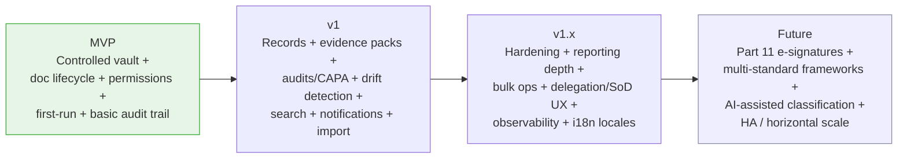
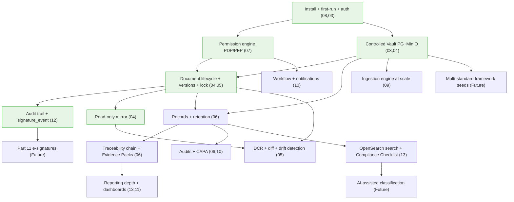

# EasySynQ — Phased Delivery Roadmap

> This roadmap sequences the build into **MVP → v1 → v1.x → Future**. It states a crisp, defensible MVP, then layers value while never violating the four locked foundational decisions (overview §3). Every phase respects the rule that Part 11 e-signatures and multi-standard frameworks are *architected now, built later* — the reserved hooks (`signature_event`, `framework_id`, M:N `clause_map`, retention-policy-as-data) carry no cost today and prevent a rewrite tomorrow. Phasing is driven by **dependency order** (you cannot have approvals without a vault, nor evidence packs without records) and by **risk-burn-down** (prove the hardest, most foundational guarantees first).

---

## 1. Phasing Principles

| Principle | Consequence on sequencing |
|---|---|
| **Prove the foundation before the features** | The vault, immutable versions, the "exactly one Effective" invariant, and the audit trail are built and hardened in MVP — everything else depends on them. |
| **Authority + recoverability before data** | First-run setup, the permission engine, and backup/restore must work before any real QMS content lands (doc 08 proves backup before import). |
| **Ship a usable slice, not a horizontal layer** | MVP is an end-to-end thin path (set up → import/author → control → audit-log it), not "all of the backend, none of the UI." |
| **Each phase leaves hooks, never debt** | Extensibility hooks are added in the phase where their host entity is built (e.g., `signature_event` ships in MVP empty-but-present), so Future phases are additive. |
| **Calm UX is a release gate, not a later polish** | Progressive disclosure and WCAG 2.2 AA are acceptance criteria from MVP onward (doc 11, doc 03 §11), because retrofitting calm is expensive. |
| **Self-hosted operability is a feature** | One-command Compose install, sizing profiles, and a tested restore drill are part of "done," not afterthoughts. |

---

## 2. Phase Overview (at a glance)

| Phase | Theme | Outcome a customer can do | Primary docs realized |
|---|---|---|---|
| **MVP** | *Controlled document control that actually controls* | Install, configure, grant permissions, author or import documents, run the full Draft→Effective lifecycle with immutable versions and a single Effective copy, browse a read-only mirror, and see every action in an audit log. | 03, 04, 07 (core), 08, 12 (core), 02 (IA core) |
| **v1** | *A complete ISO 9001:2015 QMS* | Capture and retain evidence, run audits and CAPA, generate clause-mapped Evidence Packs, search across the QMS, receive workflow notifications, detect drift, and import an existing QMS at scale. | 05, 06, 09, 10, 13 + completion of 02, 11 |
| **v1.x** | *Operate it confidently at scale* | Richer reporting/dashboards, bulk operations, delegation/SoD administration UX, full observability stack, additional UI locales, performance hardening to the L profile, and a **whole-vault portable export** for tenant migration/decommission (R33). | depth across 10, 11, 13; 03 (obs/scale); 06, 15 (export) |
| **Future** | *Regulated & multi-standard, without a rewrite* | Turn on Part 11-grade e-signatures, add a second standard (e.g., ISO 13485) as a framework, get AI-assisted classification suggestions, and (optionally) run HA on Kubernetes. | the reserved hooks across 04/06/07/12/14 + new standards-pack section |

---

## 3. MVP — "The Controlled Vault, Proven"

> **✅ SHIPPED (2026-06-03).** The MVP is complete — all 11 ordered slices (S0–S11) of
> `docs/18-mvp-implementation-plan.md` §7 are on `main`, all six acceptance proofs are in, and the exit checklist
> (doc 18 §12) is closed. This section is the original goal/scope statement; see `CLAUDE.md` for shipped detail and
> the v1/v1.x deferrals. v1 (§4) is the next phase.

**Goal:** deliver the *minimum that makes EasySynQ structurally better than a file share* — a controlled vault with a working document lifecycle, granular permissions, first-run setup, and a basic but tamper-evident audit trail. If the MVP works, document drift is already structurally prevented for documents under control.

### 3.1 MVP scope (in)

| Capability | What's in MVP | Doc |
|---|---|---|
| **Self-hosted install** | Single-host Docker Compose (S + M profiles), `install.sh` wizard, pinned images, TLS via Caddy, `/healthz` + `/readyz`. Air-gapped bundle. | 03 §12 |
| **First-run setup wizard** | Steps 0-10: bootstrap login → admin+MFA → org identity → framework seed (ISO 9001:2015 clause catalog) → identity (local + at least one of LDAP/OIDC) → storage+vault+WORM verify → **backup+tested restore** → SMTP (deferrable) → create Mara + seed roles → import/empty → finalize gate. **Configure the off-host / append-only audit-checkpoint anchor (R13)** as a soft gate (an `audit_checkpoint_sink`: WORM bucket, external object store, or append-only syslog), with a **clear UI warning if absent** — it is **MANDATORY for any install claiming tamper-evidence / Part-11 readiness**. | 08 |
| **Controlled Vault** | PostgreSQL (metadata/lifecycle/audit) + MinIO (content-addressed, WORM blobs). Authority flows vault → mirror only. | 03 §5, 04 §2 |
| **Document lifecycle** | The canonical **7-state machine** (engine/data-model tokens, verbatim) `Draft` → `InReview` → `Approved` → `Effective` → `UnderRevision` → `Superseded` → `Obsolete` (per decisions-register R1; the 5-state `Draft → In Review → Approved → Effective → Obsolete` form is only a simplified user-facing summary); **exactly one Effective** enforced by partial-unique index + serializable supersession. | 04 §3 |
| **Immutable versions + working draft** | Immutable version snapshots; single mutable working draft; check-out/check-in under Redis lock; **mandatory change reason**; content-addressed dedup. | 04 §5, 05 §2-4 |
| **Approval = signature hook** | Recorded approval writes an append-only `signature_event` (single-factor today); SoD flag (author ≠ sole approver) for `iso_mandatory` docs. | 04 §4 |
| **Document metadata + numbering** | Controlled metadata schema; configurable `{TYPE}-{AREA}-{SEQ}` numbering; revision label distinct from identifier. | 04 §6-7 |
| **Read-only filesystem mirror** | Regenerated from Released versions only; atomic swap; read-only mount; nightly reconcile. | 04 §10 |
| **Controlled-copy watermarking** | Server-side watermark + revision/effective-date header/footer on preview/print/export; controlled vs uncontrolled stamping. | 04 §11 |
| **Authorization engine** | Hybrid RBAC + ABAC; permission catalog (documents + system); roles as bundles; scope tree (system/process/folder/document); per-user overrides; deny-wins; PDP/PEP, deny-by-default; seeded starter roles. | 07 |
| **Authentication** | Keycloak: local accounts + (LDAP/AD **or** OIDC/SAML); MFA for admins. | 03 §8.3 |
| **Basic audit trail** | Append-only, partitioned, attributed event log for lifecycle transitions, check-in/out, approvals, permission-grant changes, logins, exports/prints; in-app view + filter. Tamper-evidence requires the **mandatory off-host / append-only audit-checkpoint anchor (R13, `audit_checkpoint_sink`)** configured at setup; an install without it cannot claim tamper-evidence. | 12 (core) |
| **Core IA / navigation** | Clause spine grouped by PDCA, Library (All Documents), a calm document landing + version timeline; progressive disclosure; WCAG 2.2 AA baseline; English. | 02 §5, 11 (core) |
| **Backup/restore** | `easysynq backup`/`restore`, nightly default, tested restore drill in the runbook. | 03 §9 |

### 3.2 MVP scope (explicitly out — lands in v1)

Records/evidence capture, retention/disposition, Evidence Packs, audits/findings/CAPA workflows, where-used/impact analysis, redline/diff, drift *detection* (mirror tamper scan, verify tokens, scheduled re-review), full-text/faceted **OpenSearch** (MVP uses Postgres-FTS fallback), the **ingestion engine at scale** (MVP supports manual create + small ad-hoc upload only), and the notification engine (MVP shows **My Tasks** in-app; email is best-effort).

### 3.3 MVP acceptance criteria (the proof points)

- A document goes Draft → In Review → Approved → Effective with a recorded approval; the prior Effective atomically becomes Superseded; **two Effective versions are provably impossible** (concurrency test).
- An edit to a file in the read-only mirror is overwritten from the vault on next sync (drift cannot win).
- A user with `document.checkin@process:X` but a per-user deny on a specific document is **denied** on that document (precedence works).
- Avery (`system.*`) is **denied** `document.approve` by default (system ≠ content boundary).
- Setup completes only after a **tested restore** passes (recoverability before data).
- Every step above appears in the append-only audit trail and cannot be edited.

---

## 4. v1 — "A Complete ISO 9001:2015 QMS"

> **🟡 IN PROGRESS (v1 started 2026-06-03).** The **Records & evidence family is COMPLETE** on `main` (migration head
> `0027`) — the first three capability rows below: **S-rec-1** (capture + evidence-linking + correction), **S-rec-2**
> (retention/disposition lifecycle + daily Beat sweep + the R27 dual-control WORM-destroy hatch), the **Evidence Packs
> (UJ-7)** family **S-pack-1** (scope resolution + immutable build/seal) + **S-pack-2** (external delivery via a
> time-boxed revocable Ed25519 share link + the PDF portfolio), and **S-rec-3** (Mode-B structured-form capture: a
> Form/Template carries a versioned `field_schema`; capture validates `form_field_values` against the pinned Effective
> version's schema). **UJ-7 (one-click evidence pack) works end-to-end.** Deferred to the next v1 slices: the rows below
> (audits/findings, CAPA, ingestion, workflows+notifications, the web UI, the rest of search/reporting), plus the
> records-family residual Mode B for the `audit`/`capa` multi-stage records (once those entities land). The
> **records-family close-out — `/retention-policies` CRUD + soft-archive + the creator≠disposer SoD-6** — shipped in
> **S-rec-4** (migration `0028`, the first additive catalog extension, R38). The **Ingestion engine (UJ-2)** family is now
> STARTED: **S-ing-1** (run + scan/inventory foundation, migration `0029`) ships an idempotent, crash-safe scan that
> inventories a read-only mounted source tree into transient `import_*` staging; **S-ing-2** (extract + classify,
> migration `0030`) adds the Tika `-full` sidecar [extractors + Tesseract OCR over HTTP] + the pure
> `RuleHeuristicClassifier`; **S-ing-3** (dedup + version-families + proposal, migration `0031`) adds the three §7
> detectors [exact / near-dup via **in-process MinHash** behind a `DedupDetector` seam / version-family], the §7.2
> provably-total canonical pick, and the §8 proposal — all still writing nothing to the vault. **S-ing-4** (the
> human-in-the-loop review, migration `0032`) adds the §9 decision surface — per-file accept/correct/exclude/defer + the
> **R10 `kind` confirmation** (folded at read, never on the engine classification), live-mutating merge/split, the §9.2a
> bulk lever, and the §9.3 pre-commit checklist (blocking conflicts + the non-blocking ★-coverage projection) — turning a
> `Proposed` run into a confirmed, commit-ready set, still writing nothing to the vault. **S-ing-5** (the COMMIT, migration
> `0033`) is the capstone that **completes the Ingestion family (UJ-2)**: it migrates the `commit_ready` keep-items into the
> vault as Effective **Rev A** controlled documents + immutable Records, per-item transactional + idempotent (the
> `import_commit_result` ledger) + resumable (PartiallyCommitted → re-POST resumes), each with `import_provenance` (doc 14 §5.1)
> + a baseline `signature_event(meaning=import_baseline)` (R2) + the §12.1 Import Report (a RETAIN_PERMANENT EVIDENCE Record +
> the mirror `_ImportReport/` export), preserving the source doc-code as the vault identifier per R10. **OpenSearch posture
> (S-ing-3):** near-dup ships as in-process MinHash; the OpenSearch container itself stays **absent (R34)** — the
> `DedupDetector`/`Indexer` OpenSearch impls are reserved, not-built drop-ins. See `CLAUDE.md` for shipped detail.

**Goal:** everything an organization needs to *run and certify* an ISO 9001:2015 QMS, end to end, and to face an external audit with a one-click evidence pack.

| Capability | What v1 adds | Doc | Depends on |
|---|---|---|---|
| ✅ **Records & evidence capture** | Three capture modes (upload, structured-form-from-Effective-template, link-as-evidence); record types catalog; `source_version_id` pinning; immutability + `correction_of`; WORM retention hold. **Shipped (S-rec-1 + S-rec-3).** | 06 §2-4 | MVP vault, forms-as-Documents |
| ✅ **Retention & disposition** | Retention policies as data; resolution precedence; one-way ratchet; legal hold; disposition lifecycle with tombstones; Beat retention sweep. **Shipped (S-rec-2).** Plus **`/retention-policies` CRUD + soft-archive** and the **creator≠disposer SoD-6** (overridable via `allow_self_disposition`). **Shipped (S-rec-4, R38).** | 06 §5, 07 §7 | records, Beat |
| ✅ **Traceability chain + Evidence Packs (UJ-7)** | requirement→process→document→record→evidence chain; clause/process/finding-scoped packs; immutable, self-verifying, gap-honest; time-boxed external-auditor guest delivery. **Shipped (S-pack-1/2)** — clause/process scope; **Finding/CAPA scope** awaits those entities. | 06 §6-7 | records, search, authz scope |
| **Audits & findings (UJ-5)** | Audit program/plan/audit/finding; finding types (NC/Observation/OFI) + severity; NC auto-creates CAPA. | 02 §2 (9.2), 06, 10 | records, authz (auditor independence) |
| **CAPA / improvement (UJ-6)** | Multi-stage CAPA record (NC → correction → RCA → action → verification → close); close-guards (RCA + action + effectiveness all present, metric M4). | 06, 10 | audits, records |
| **Revision/change depth** | DCR (reason, impact assessment, routing); where-used/impact analysis; major/minor significance; effectivity windows + scheduled future revisions; redline/diff (text + metadata + visual). | 05 | MVP versions |
| **Drift detection** | Mirror tamper/staleness scan with auto-correct; controlled-rendition verify token (CURRENT/SUPERSEDED/UNKNOWN); blob integrity verify; scheduled re-review currency sweep. | 05 §9, 12 | mirror, blobs, Beat |
| **Distribution & acknowledgement** | Issue-on-release to dynamic distribution lists; version-pinned read-and-understood acknowledgements as immutable evidence; ack dashboard. | 04 §8 | records, notifications |
| **Search & reporting** | OpenSearch full-text + faceted + metadata; clause/process/state filters; ★ mandatory-coverage **Compliance Checklist**; currency/overdue reports; audit-log search. | 13 | OpenSearch, records |
| **Workflow & notifications** | Approval/review routing topologies (single/sequential/parallel-quorum/lightweight/policy-apex); CAPA/audit/retention/review/ack tasks; My Tasks; escalations; SMTP + in-app delivery + digests. | 10 | authz routing, SMTP |
| **Ingestion engine (UJ-2)** | Scan & preview existing QMS; proposed source→document mapping with process/clause hints; baseline version creation; legacy-identifier preservation; bulk record import (CSV sidecar); mirror generation. **Import default (R10): current/latest version only as the controlled baseline, with older copies archived as provenance** (not approved revision history); **revision-chain reconstruction is opt-in per document-family with explicit confirmation**; the **Document-vs-Record (`kind`) classification is ALWAYS human-confirmed regardless of confidence**; the review UI scales to thousands of low-confidence items (bulk triage). | 09 | vault, records, setup import hand-off |
| **PDCA dashboard (Home)** | The four-quadrant health wheel reading live signals from documents/records/audits/CAPA; process-scoped PDCA pages. | 02 §5.3, 11 | all engines emitting health |

**v1 exit = the seven user journeys (UJ-1…UJ-7) all work end-to-end**, and the success metrics (M1 audit-pack < 30 min, M2 zero uncontrolled effective, M3 < 5% overdue, M4 100% CAPA traceability, M7 100% audit-trail completeness) are demonstrably met on the M-profile reference deployment (~150 docs, ~50 users).

---

## 5. v1.x — "Operate It Confidently at Scale"

Incremental hardening and operability; no new locked-decision surface, with one locked addition: the **whole-vault portable export (R33)** for tenant migration/decommission. Sequenced by customer-feedback priority.

| Increment | Content | Doc |
|---|---|---|
| **v1.1 Reporting depth** | Saved/scheduled reports, management-review input packs, KPI/objective trend views (read-only, not SPC analytics — N6 still out), exportable compliance-coverage report. | 13, 10 |
| **v1.2 Bulk & admin UX** | Bulk metadata edit, bulk re-acknowledge, bulk retention re-class, the "why can/can't this user do X?" explainability tool, delegation + SoD administration screens. | 07 §10-12, 11 |
| **v1.3 Observability & ops** | Opt-in Prometheus/Grafana/Loki profile, Alertmanager rules (disk/queue/backup/integrity), upgrade tooling with enforced pre-upgrade backup + rollback. | 03 §10, §12 |
| **v1.4 Performance & L-profile** | Tuning to the L sizing profile (≤250 users, ≤1M docs/versions); OpenSearch heap sizing; render/index pipeline throughput; P95 budgets verified under load. | 03 §7, §11 |
| **v1.5 i18n locales** | Ship additional UI locales on the already-externalized string framework (RTL verified); locale-aware dates/numbers end to end. | 03 §11 |
| **v1.6 Mirror & history exports** | Configurable `by-process/` secondary mirror index; optional `_history/` superseded export; richer Evidence-Pack formats. | 04 §10, 06 §7 |
| **v1.7 Whole-Vault Portable Export (R33)** | A **portable, whole-QMS export** (documents + records + audit trail in **open formats**) for **tenant migration / decommission / offboarding** — distinct from scoped **Evidence Packs** and from **backup/restore**. A stub export endpoint is reserved in the API (doc 15); the full export job, manifest, and integrity-verification are delivered here. | 06, 15, decisions-register R33 |

---

## 6. Future — "Regulated & Multi-Standard, Without a Rewrite"

These are the locked-decision *extension* targets (D3). Each is **additive** because the hook already exists. None is built before its phase.

| Future capability | What it turns on | The reserved hook it activates | Net-new work (not a rewrite) |
|---|---|---|---|
| **21 CFR Part 11 e-signatures** | Credentialed signing manifestations: re-authentication / MFA at approve/release, signature meaning binding, cryptographic signature payload, trusted timestamps, controlled training records, tightened SoD. | `signature_event` (signer/meaning/intent/method/ts) already append-only on every approval and CAPA stage; `system.signature.policy`; `session.mfa` ABAC condition; SoD flag; the **mandatory off-host `audit_checkpoint_sink` (R13)** already in place from MVP, which Part-11 readiness depends on. | Add non-null-defaulted columns (`signature_payload`, re-auth method) + policy flags (`require_reauth_on_approve`, `require_mfa_on_release`); signing UX; validation/IQ-OQ-PQ docs. |
| **Multi-standard frameworks** (ISO 13485 / 14001 / 45001 / IATF 16949) | A second standard's clause catalog seeded as data; one artifact satisfying clauses across standards; standard-specific retention schedules and routes. | `framework_id` on every artifact; M:N `clause_map`; clause catalog is seeded data; routes & numbering `{TYPE}` codes are data; retention policy-as-data; `framework:{id}` permission scope. | Author new clause-catalog seeds + framework selection UI; per-framework checklist; (this is the natural "section 17" standards-pack appendix). No schema rewrite. |
| **AI-assisted classification** | Suggested clause mapping, process linkage, document-type, and duplicate/near-duplicate detection at ingest/check-in; **suggestions only**, human confirms (preserves N9 "no auto-compliance judgments"). | Extracted text already indexed in OpenSearch; ingestion already proposes mappings (doc 09). | Add a classification service (self-hosted model) behind a worker task; a confirm-or-reject UI; never auto-applies. Must stay inside the org boundary (D1). |
| **HA / horizontal scale** | Kubernetes/Helm deployment: Postgres replica + PgBouncer, MinIO distributed, OpenSearch cluster, clustered Keycloak. | App tier already stateless/12-factor; OpenSearch + mirror already rebuildable; `org_id` discriminator present. | Helm chart + HA runbooks. Optional; single-host remains the supported default. |
| **(Optional) Multi-org / SaaS variant** | Tenant isolation on a shared install. | `org_id` discriminator present from day one (doc 03 §8.4). | Tenant isolation layer + cross-org guards. **Note:** contradicts D1's single-org self-hosted default; only as a separate product line, never as a change to the self-hosted edition. |

---

## 7. Dependency & Sequencing Summary

**Hard dependencies to respect:** the permission engine and the vault gate everything; the audit trail must exist before any auditable action ships (so it ships in MVP); records depend on the version model (forms are Documents that instantiate Records); Evidence Packs depend on records + search + authz scope; CAPA depends on audits + records; drift *detection* depends on the mirror + blobs + Beat; the ingestion engine depends on the full vault + records (hence v1, not MVP). Part 11 depends only on the already-present `signature_event`; multi-standard depends only on the already-present `framework_id` + M:N clause mapping.

---

## 8. Risks & Mitigations

| # | Risk | Likelihood / impact | Mitigation |
|---|---|---|---|
| **R1** | **WORM/object-lock not available or misconfigured** on the customer's MinIO/S3, weakening the immutability guarantee. | Med / High | Setup wizard *verifies* WORM at Step 5 (`WORM_VERIFIED`) and blocks finalize if absent; documented MinIO object-lock prerequisites; integrity verify job alarms on tamper as a defense-in-depth backstop. |
| **R2** | **Office→PDF rendering fidelity / throughput** (LibreOffice/Gotenberg) is imperfect for complex documents, hurting preview/watermark/diff. | Med / Med | Source blob remains the editable master (rendition is derived, never authoritative); diff uses extracted text + visual page diff (stated limitation, N4); rendering is async with progress; renderer scales horizontally; bad render alarms, never blocks check-in. |
| **R3** | **"Exactly one Effective" race** under concurrency or partial failure. | Low / High | DB partial-unique index + serializable supersession transaction + Redis check-out lock; lazy-read cutover guard so correctness is independent of Beat latency; concurrency test is an MVP acceptance gate. |
| **R4** | **Messy / inconsistent existing QMS** makes import mapping unreliable (UJ-2). | High / Med | Import is preview-and-confirm with human review (Avery + Mara); legacy identifiers preserved; baseline versions clearly flagged `imported`; import can run post-finalize so it never blocks setup; gaps flagged on the Compliance Checklist. Per **R10**, the default ingests **current/latest only as the controlled baseline (older copies archived as provenance)** — avoiding manufactured false revision history; **revision-chain reconstruction is opt-in per family with explicit confirmation**, and the **`kind` (Document-vs-Record) classification is ALWAYS human-confirmed**, so unreliable auto-classification can never silently commit. |
| **R5** | **Drift detection produces false positives / noisy alarms** on the mirror (legitimate OS-level activity). | Med / Med | Mirror is auto-corrected from the vault (vault always wins) so a false positive is self-healing; alarms are quality/security signals, rate-limited and surfaced calmly; read-only mount reduces incidence at the source. |
| **R6** | **Permission model complexity** (RBAC+ABAC+overrides+SoD+break-glass) confuses admins → over-grant or lockout. | Med / High | Seeded starter roles; the explainability tool ("why can/can't X?"); deny-wins with break-glass as the *only* audited deny override so there is never an unrecoverable deadlock; SoD secure defaults. |
| **R7** | **Backup/restore not actually exercised**, so recoverability is theoretical. | Med / High | Setup proves a **test restore before data lands**; documented restore drill in the runbook; only PG + MinIO are backup-critical (everything else rebuildable), shrinking the surface. |
| **R8** | **Single-host availability** (one Linux host) is a SPOF for some customers. | Med / Med | Per **decisions-register R14**, the stated target is **99.0% per month for the single-host profile** — **including** the auth (**Keycloak**) and scheduler (**Beat**) dependencies, which are documented **single points of failure** with a **fast-restart runbook**. Graceful degradation (search→FTS fallback, renderer queue) and a documented vertical-scale path apply. **99.5%+ is achievable only via the documented HA/Kubernetes path** (Future HA/Helm option); do **not** claim 99.5% on a six-single-instance-stateful-service single host. |
| **R9** | **Scope creep toward non-goals** (in-app authoring, analytics, BPM, SaaS) erodes the calm-UX promise and timeline. | Med / Med | Non-goals are explicit (doc 01 §4) and re-asserted per phase; Future items are gated behind their reserved hooks; multi-org explicitly fenced as a separate product line, not a change to the self-hosted edition. |
| **R10** | **Part 11 retrofit turns out to need schema changes** despite the hook. | Low / High | `signature_event` is append-only and present from MVP, empty for records; the documented Part 11 delta is *additive columns + policy flags only* (doc 04 §4.2, doc 12); validated by a design spike before committing the Future phase. |
| **R11** | **Accessibility/i18n retrofitted late** becomes costly. | Med / Med | WCAG 2.2 AA + string externalization are MVP acceptance criteria (doc 03 §11); axe checks in CI + screen-reader passes per release; locales added on an already-externalized framework in v1.x. |

---

## 9. Major Assumptions

| # | Assumption | If false… |
|---|---|---|
| **AS1** | The deploying org has IT capability to run a self-hosted web app (Linux host, Docker Compose, DB/object-store/backup target) on its own network (doc 01 A1, doc 03). | Offer the air-gapped bundle + guided `install.sh`; a managed-install service would be a separate engagement, not a product change. |
| **AS2** | Users author in their existing desktop tools; EasySynQ controls the artifact lifecycle, not the editing surface (N4/N5, doc 01 A2). | In-app authoring stays out of scope; revisit only as a far-future, separate decision. |
| **AS3** | The existing QMS to import is reachable as a file tree/share with reasonably consistent structure at setup (doc 01 A3, doc 09). | Import degrades to manual create + ad-hoc upload (still fully controlled); R4 mitigations apply. |
| **AS4** | v1 "approval" satisfies ISO 9001 recorded-authorization needs; cryptographic/Part 11 signatures are a future additive layer (doc 01 A4, D3). | Pull the Part 11 Future item forward; the hook already exists, so it is additive. |
| **AS5** | One organization (single tenant) per install (doc 01 A5, D1). | Multi-org is a *separate product line* via the present `org_id` discriminator — never a change to the self-hosted edition. |
| **AS6** | Modern desktop browsers; responsive but no native mobile (doc 01 A6, N10). | Responsive web only; native apps remain out of scope. |
| **AS7** | Exactly one Released/Effective version per controlled document at any time; all prior effective versions retained as Superseded/Obsolete (doc 01 A7, doc 04 §3.4). | This is an enforced invariant, not a hope (DB constraint) — failure here is a bug, not an assumption change. |
| **AS8** | Customer-controlled MinIO/S3 supports object-lock/WORM and SSE (doc 03 §8.2, doc 06 R3). | R1 mitigations; without WORM, immutability falls back to application + audit enforcement with a flagged reduced guarantee. |
| **AS9** | OpenSearch can be afforded on M/L profiles; tiny installs accept the Postgres-FTS fallback with reduced faceting (doc 03 §3, §7). | MVP already ships on FTS; OpenSearch is the v1 upgrade for richer search. |
| **AS10** | The reference scale (≤250 users, ≤1M docs/versions, single host) covers the target market; HA is opt-in Future (doc 03 §7). | Future Helm/HA path exists; does not gate v1. |

---

## 10. Summary

EasySynQ is built **foundation-first**: the MVP proves the hardest guarantees — a controlled vault, an enforced single-Effective lifecycle with immutable versions and recorded approvals, a deny-by-default granular permission engine, a guided first-run that proves recoverability before data lands, and a tamper-evident audit trail. With that proven, **v1** completes a full ISO 9001:2015 QMS: records and evidence, audits and CAPA, drift detection, search, notifications, Evidence Packs, and scaled import — making all seven user journeys real and the success metrics measurable. **v1.x** turns a working product into a confidently operable one (reporting, bulk ops, observability, scale, locales, and a whole-vault portable export for tenant migration/decommission — R33). **Future** activates the locked-decision extensions — Part 11 e-signatures, multi-standard frameworks, AI-assisted classification, and optional HA — each **additive on a reserved hook, never a rewrite**, because every prior phase was built to leave the door open while keeping today's product calm, focused, and self-hosted.
